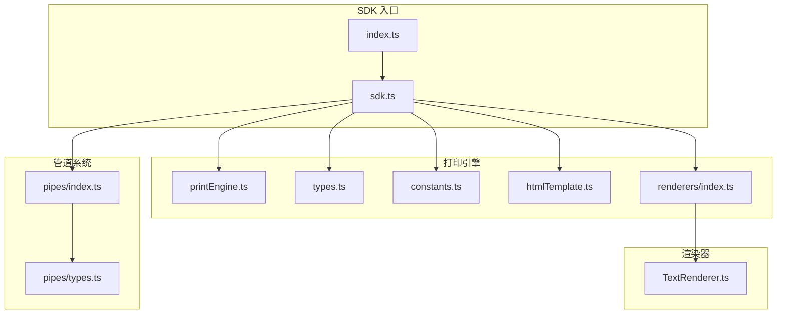
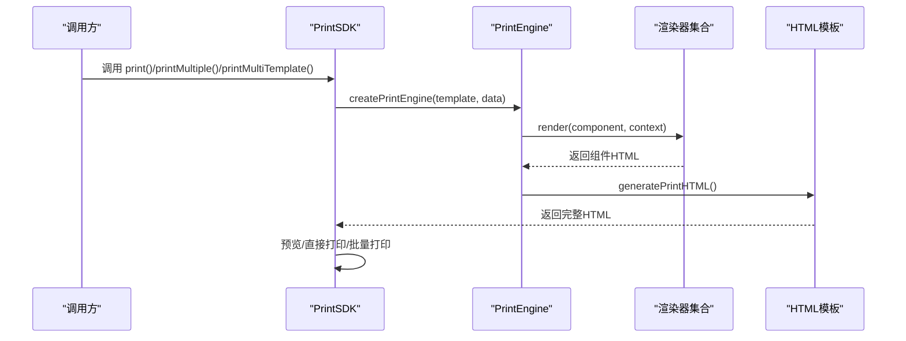
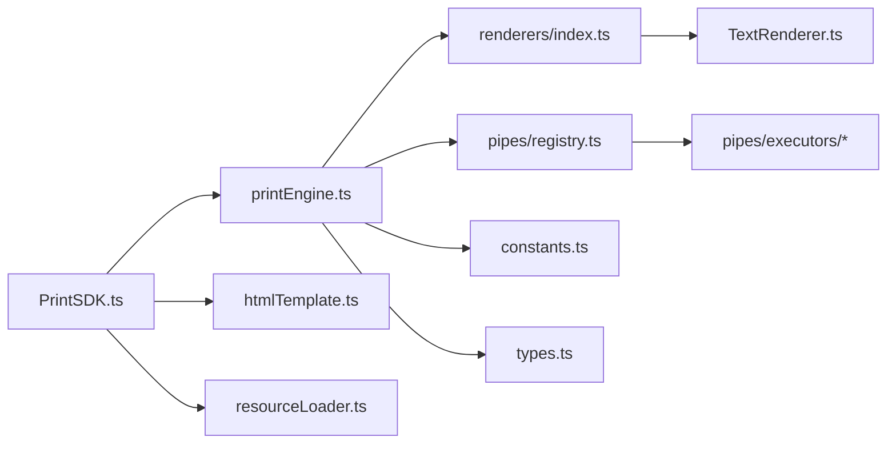

# API 参考文档

<cite>
**本文引用的文件**
- [index.ts](file://sdk/src/index.ts)
- [sdk.ts](file://sdk/src/sdk.ts)
- [PrintSDK.ts](file://sdk/src/PrintSDK.ts)
- [printEngine.ts](file://sdk/src/printEngine.ts)
- [types.ts](file://sdk/src/types.ts)
- [renderers/index.ts](file://sdk/src/printEngine/renderers/index.ts)
- [TextRenderer.ts](file://sdk/src/printEngine/renderers/TextRenderer.ts)
- [pipes/index.ts](file://sdk/src/pipes/index.ts)
- [pipes/types.ts](file://sdk/src/pipes/types.ts)
- [htmlTemplate.ts](file://sdk/src/printEngine/htmlTemplate.ts)
- [constants.ts](file://sdk/src/printEngine/constants.ts)
- [package.json](file://sdk/package.json)
- [README.md](file://sdk/README.md)
</cite>

## 目录
1. [简介](#简介)
2. [项目结构](#项目结构)
3. [核心组件](#核心组件)
4. [架构总览](#架构总览)
5. [详细组件分析](#详细组件分析)
6. [依赖关系分析](#依赖关系分析)
7. [性能考量](#性能考量)
8. [故障排查指南](#故障排查指南)
9. [结论](#结论)
10. [附录](#附录)

## 简介
本文件为 PrintSDK 的完整 API 参考文档，涵盖 PrintEngine 的核心方法与配置、类型定义、渲染器与数据管道扩展接口、错误处理与调试信息，并提供版本兼容性与迁移指南、最佳实践与示例路径。

## 项目结构
PrintSDK 采用“解耦 + 数据驱动”的设计，核心模块包括：
- SDK 入口与导出：统一导出 PrintSDK、PrintEngine、类型与工具
- 打印引擎：负责模板解析、数据绑定、管道转换、虚拟分页与 HTML 生成
- 渲染器：组件渲染插件化，支持文本、表格、图片、二维码、条形码、线条、矩形等
- 管道系统：数据转换插件化，支持日期、货币、金额、中文大写、大小写、切片、默认值等
- 工具与常量：HTML 模板生成、样式常量、单位换算等

**图表来源**
- [index.ts:1-22](file://sdk/src/index.ts#L1-L22)
- [sdk.ts:1-66](file://sdk/src/sdk.ts#L1-L66)
- [printEngine.ts:1-800](file://sdk/src/printEngine.ts#L1-L800)
- [types.ts:1-228](file://sdk/src/types.ts#L1-L228)
- [constants.ts:1-113](file://sdk/src/printEngine/constants.ts#L1-L113)
- [htmlTemplate.ts:1-200](file://sdk/src/printEngine/htmlTemplate.ts#L1-L200)
- [renderers/index.ts:1-13](file://sdk/src/printEngine/renderers/index.ts#L1-L13)
- [TextRenderer.ts:1-60](file://sdk/src/printEngine/renderers/TextRenderer.ts#L1-L60)
- [pipes/index.ts:1-9](file://sdk/src/pipes/index.ts#L1-L9)
- [pipes/types.ts:1-30](file://sdk/src/pipes/types.ts#L1-L30)

**章节来源**
- [index.ts:1-22](file://sdk/src/index.ts#L1-L22)
- [sdk.ts:1-66](file://sdk/src/sdk.ts#L1-L66)

## 核心组件
- PrintSDK：对外 API 的唯一入口，提供打印、预览、HTML 生成、批量打印、多模板批量打印等能力
- PrintEngine：核心渲染与分页引擎，负责数据绑定、管道执行、组件渲染、虚拟分页与 HTML 生成
- 渲染器：组件渲染插件接口与实现，支持注册/注销
- 管道系统：数据转换插件接口与内置执行器
- 类型与常量：模板、组件、表格、页码、管道、Schema 等类型定义与常量

**章节来源**
- [PrintSDK.ts:100-477](file://sdk/src/PrintSDK.ts#L100-L477)
- [printEngine.ts:30-800](file://sdk/src/printEngine.ts#L30-L800)
- [types.ts:1-228](file://sdk/src/types.ts#L1-L228)
- [constants.ts:1-113](file://sdk/src/printEngine/constants.ts#L1-L113)

## 架构总览
PrintSDK 通过 PrintEngine 将模板与数据结合，利用渲染器将组件渲染为 HTML，并通过 HTML 模板生成器输出完整打印页面。批量打印与多模板打印在 SDK 层组装页面并触发打印。

**图表来源**
- [PrintSDK.ts:110-467](file://sdk/src/PrintSDK.ts#L110-L467)
- [printEngine.ts:196-418](file://sdk/src/printEngine.ts#L196-L418)
- [htmlTemplate.ts:178-200](file://sdk/src/printEngine/htmlTemplate.ts#L178-L200)

## 详细组件分析

### PrintSDK API 参考
PrintSDK 提供以下公共方法与类型：

- 打印
  - 方法：print(options)
  - 参数：
    - options.template: PrintTemplate
    - options.data: any
    - options.preview?: boolean
  - 返回：Promise<void>
  - 行为：根据 preview 决定预览或直接打印；预览打开新窗口，直接打印使用隐藏 iframe；等待图片资源加载后触发打印；监听 afterprint 或兜底清理

- 快捷打印（不预览）
  - 方法：printDirect(template, data)
  - 参数：template: PrintTemplate, data: any
  - 返回：Promise<void>

- 预览后打印
  - 方法：printWithPreview(template, data)
  - 参数：template: PrintTemplate, data: any
  - 返回：Promise<void>

- 仅生成 HTML（不打印）
  - 方法：generateHTML(template, data)
  - 参数：template: PrintTemplate, data: any
  - 返回：Promise<string>

- 批量打印（同模板多数据）
  - 方法：printMultiple(template, dataList, options?)
  - 参数：
    - template: PrintTemplate
    - dataList: any[]
    - options.preview?: boolean
    - options.onProgress?: (progress: BatchPrintProgress) => void
  - 返回：Promise<void>
  - 进度对象：total/completed/failed/currentIndex

- 多模板批量打印
  - 方法：printMultiTemplate(groups, options?)
  - 参数：
    - groups: PrintTemplateGroup[]
    - options.preview?: boolean
    - options.onProgress?: (progress: MultiTemplatePrintProgress) => void
  - 返回：Promise<void>
  - 进度对象：totalGroups/completedGroups/totalDataItems/completedDataItems/failed/currentGroupIndex/currentDataIndex

- 类型与工厂
  - createPrintSDK(): PrintSDK
  - 类型导出：PrintOptions/BatchPrintOptions/BatchPrintProgress/PrintTemplateGroup/MultiTemplatePrintOptions/MultiTemplatePrintProgress

**章节来源**
- [PrintSDK.ts:110-477](file://sdk/src/PrintSDK.ts#L110-L477)

### PrintEngine API 参考
PrintEngine 负责模板解析、数据绑定、管道执行、组件渲染与虚拟分页：

- 构造与注册
  - 构造函数：new PrintEngine(template, data)
  - 注册渲染器：registerRenderer(renderer)
  - 注销渲染器：unregisterRenderer(type)

- 渲染流程
  - renderComponent(component): 渲染单个组件，自动注入页头/页脚区域的 overflow 控制
  - createRenderContext(): 构建渲染上下文，包含 data、resolveBinding、applyPipes、getValueByPath、formatDate、mmToPx、pageInfo

- 数据绑定与管道
  - resolveBinding(binding): 解析数据绑定路径，支持 root. 自动匹配与 fallback
  - applyPipes(value, pipes): 依次执行管道
  - executePipe(value, pipe): 执行单个管道

- 分页与布局
  - calculatePages(components, headerComponents?, footerComponents?): 基于相对间距的虚拟分页，支持表格跨页拆分与表头重复
  - shouldBreakPage(currentHeight, componentHeight, gap, availableHeight, contentTop): 判断是否换页
  - measureMaxBottom(comps): 计算组件列表最大底部坐标，用于页头/页脚高度测量
  - measureTableRowHeights(tableComponent, tableData): 渲染后测量表格行高（浏览器环境），或回退估算（SSR）

- 页码渲染
  - renderPageNumber(pageNumber?, totalPages?): 根据配置渲染页码文本与定位

- 工具方法
  - formatDate(value, format): 日期格式化
  - escapeHtml(text): HTML 转义
  - renderSinglePage(components, pageNumber?, totalPages?): 渲染单页并附加页码

- 类型与常量
  - 类型导出：ComponentRenderer、RenderContext
  - 常量导出：MM_TO_PX、COMPONENT_DEFAULT_SIZE、TABLE_DEFAULT、STYLE_DEFAULT、TABLE_STYLE_DEFAULT、BARCODE_CONFIG、QRCODE_CONFIG

**章节来源**
- [printEngine.ts:30-800](file://sdk/src/printEngine.ts#L30-L800)
- [types.ts:185-217](file://sdk/src/types.ts#L185-L217)
- [constants.ts:1-113](file://sdk/src/printEngine/constants.ts#L1-L113)

### 渲染器接口与实现
- 组件渲染器接口
  - type: string（只读）
  - render(component, context): string
  - calculateHeight?(component, context): number（可选）

- 渲染器导出
  - TextRenderer、TableRenderer、ImageRenderer、RectRenderer、LineRenderer、QRCodeRenderer、BarcodeRenderer、PageNumberRenderer

- 示例：TextRenderer
  - 渲染文本组件，支持 label 前缀、flex 布局与文本对齐、默认样式回退、定位样式构建

**章节来源**
- [renderers/index.ts:1-13](file://sdk/src/printEngine/renderers/index.ts#L1-L13)
- [TextRenderer.ts:1-60](file://sdk/src/printEngine/renderers/TextRenderer.ts#L1-L60)
- [types.ts:57-86](file://sdk/src/types.ts#L57-L86)

### 管道系统接口与内置执行器
- 管道执行器接口
  - type: string
  - label: string
  - execute(value, options?): any

- 管道系统导出
  - types、registry、executors

- 内置执行器（示例）
  - ChineseNumberPipe：将数字转换为中文大写（支持小数、负数、多种模式与连接符）

**章节来源**
- [pipes/types.ts:1-30](file://sdk/src/pipes/types.ts#L1-L30)
- [pipes/index.ts:1-9](file://sdk/src/pipes/index.ts#L1-L9)

### HTML 模板与样式生成
- generatePrintPageStyles(config): 生成预览模式页面样式（标准分页与连续纸）
- generateBatchPrintStyles(config): 生成批量打印样式（直接打印模式）
- generatePrintHTML({ title, styles, bodyContent }): 生成完整 HTML 文档

**章节来源**
- [htmlTemplate.ts:1-200](file://sdk/src/printEngine/htmlTemplate.ts#L1-L200)

### 类型定义与枚举
- 模板与组件
  - PrintTemplate、ComponentNode、ComponentType、PageSection
- 页面配置
  - PageConfig、PageNumberConfig
- 表格与合计
  - TableProps、TableColumn、TablePaginationConfig、TableColumnSummary、TableSummaryStyle、SummaryExtraRow、SummaryExtraRowItem
- 数据绑定与管道
  - DataBinding、PipeConfig
- Schema 与 Mock
  - SchemaField、SchemaDictionary、MockData

**章节来源**
- [types.ts:1-228](file://sdk/src/types.ts#L1-L228)

### 错误码与异常处理
- 打印窗口打开失败：抛出错误并提示检查浏览器设置
- iframe 文档访问失败：抛出错误
- afterprint 事件未触发：5 秒兜底清理
- DOMParser 解析失败：回退正则提取 body 内容
- 表格渲染后测量失败：回退估算值（SSR 或测量失败场景）
- 管道执行异常：捕获并回退原始值

**章节来源**
- [PrintSDK.ts:117-171](file://sdk/src/PrintSDK.ts#L117-L171)
- [PrintSDK.ts:289-321](file://sdk/src/PrintSDK.ts#L289-L321)
- [PrintSDK.ts:422-466](file://sdk/src/PrintSDK.ts#L422-L466)
- [printEngine.ts:630-655](file://sdk/src/printEngine.ts#L630-L655)
- [ChineseNumberPipe.ts:132-136](file://sdk/src/pipes/executors/ChineseNumberPipe.ts#L132-L136)

### 调试信息
- 打印引擎日志：渲染页码时输出页码信息与配置
- 分页警告：组件高度接近页面可用高度时输出警告
- 进度回调：批量与多模板打印提供进度回调，便于前端展示

**章节来源**
- [printEngine.ts:295-296](file://sdk/src/printEngine.ts#L295-L296)
- [printEngine.ts:492-496](file://sdk/src/printEngine.ts#L492-L496)
- [PrintSDK.ts:238-256](file://sdk/src/PrintSDK.ts#L238-L256)
- [PrintSDK.ts:384-389](file://sdk/src/PrintSDK.ts#L384-L389)

### TypeScript 类型定义参考
- SDK 导出类型：PrintOptions、BatchPrintOptions、BatchPrintProgress、PrintTemplateGroup、MultiTemplatePrintOptions、MultiTemplatePrintProgress
- 打印引擎导出类型：ComponentRenderer、RenderContext
- 常量导出：MM_TO_PX、COMPONENT_DEFAULT_SIZE、TABLE_DEFAULT、STYLE_DEFAULT、TABLE_STYLE_DEFAULT、BARCODE_CONFIG、QRCODE_CONFIG
- HTML 模板工具：generatePrintPageStyles、generateBatchPrintStyles、generatePrintHTML、getPageSizeFromConfig
- 渲染器导出：TextRenderer、TableRenderer、ImageRenderer、RectRenderer、LineRenderer、QRCodeRenderer、BarcodeRenderer、PageNumberRenderer
- 类型定义：PrintTemplate、ComponentNode、DataBinding、PipeConfig、PageConfig、PageNumberConfig、ComponentType、SchemaField、SchemaDictionary、MockData、TableProps、TableColumn

**章节来源**
- [sdk.ts:52-66](file://sdk/src/sdk.ts#L52-L66)

### 版本兼容性与迁移指南
- v1.5.0
  - 新增页头/页脚支持与三区域组件列表
  - 新增 ComponentNode._section 与 PrintTemplate.headerComponents/footerComponents
  - 分页精度提升与溢出控制增强
- v1.4.0
  - 表格列宽自定义、行号列宽度自定义、表格边框自定义
  - 列宽计算规则优化与精度修复
- v1.3.0
  - 表格合计额外行、行号列支持
  - 分页精度与稳定性增强
- v1.2.0
  - ChineseNumberPipe 增强（小数、负数、连接符）
  - MoneyPipe 中文大写金额
  - 表格合计管道化
- v1.1.3
  - 多模板批量打印
  - 设计器多模板模式
- v1.1.2
  - 打印内容偏移修复、批量打印边距修复
- v1.1.1
  - 表格嵌套对象数据支持、服务架构简化
- v1.1.0
  - 表格分页精度大幅提升、组件定位优化、表格渲染改进、错误处理增强

**章节来源**
- [README.md:16-66](file://sdk/README.md#L16-L66)
- [package.json:1-61](file://sdk/package.json#L1-L61)

### 最佳实践与使用示例
- 基本打印：使用 createPrintSDK() 创建实例，调用 printDirect 或 printWithPreview
- 批量打印：printMultiple 提供进度回调，适合大量订单或发票打印
- 多模板打印：printMultiTemplate 适合“一客一模板”场景，一次确认打印多个模板
- 表格分页：合理设置 repeatHeader 与列宽，避免跨页截断
- 管道链：先货币/金额，再中文大写，注意选项传递与连接符
- 预览与直接打印：预览用于校验布局，直接打印用于生产

**章节来源**
- [README.md:90-136](file://sdk/README.md#L90-L136)
- [README.md:162-197](file://sdk/README.md#L162-L197)
- [README.md:235-303](file://sdk/README.md#L235-L303)
- [README.md:305-454](file://sdk/README.md#L305-L454)

## 依赖关系分析

**图表来源**
- [PrintSDK.ts:7-14](file://sdk/src/PrintSDK.ts#L7-L14)
- [printEngine.ts:6-28](file://sdk/src/printEngine.ts#L6-L28)
- [renderers/index.ts:1-13](file://sdk/src/printEngine/renderers/index.ts#L1-L13)
- [TextRenderer.ts:1-60](file://sdk/src/printEngine/renderers/TextRenderer.ts#L1-L60)
- [constants.ts:1-113](file://sdk/src/printEngine/constants.ts#L1-L113)
- [types.ts:1-228](file://sdk/src/types.ts#L1-L228)

**章节来源**
- [PrintSDK.ts:7-14](file://sdk/src/PrintSDK.ts#L7-L14)
- [printEngine.ts:6-28](file://sdk/src/printEngine.ts#L6-L28)

## 性能考量
- 图片资源加载：预览与打印前等待图片加载，避免内容缺失
- 表格跨页拆分：采用“渲染后测量”策略，减少分页截断，提高准确性
- 连续纸模式：不进行分页，减少计算与 DOM 操作
- SSR 回退：在无 DOM 环境下使用估算值，保证可用性
- 单位换算：统一使用 MM_TO_PX 常量，避免重复计算

**章节来源**
- [PrintSDK.ts:125-147](file://sdk/src/PrintSDK.ts#L125-L147)
- [printEngine.ts:626-756](file://sdk/src/printEngine.ts#L626-L756)
- [constants.ts:8](file://sdk/src/printEngine/constants.ts#L8)

## 故障排查指南
- 打印窗口无法打开：检查浏览器弹窗策略与权限
- 打印内容偏移：确认 @media print 中的 margin 与 padding 设置
- 批量打印边距异常：检查 generateBatchPrintStyles 的 padding 生效
- 表格跨页截断：适当增大列宽或减少行高，或开启 repeatHeader
- 页码不显示：检查 PageNumberConfig.enabled 与位置配置
- 管道执行报错：查看管道选项与输入值类型，必要时增加防御性处理

**章节来源**
- [README.md:50-54](file://sdk/README.md#L50-L54)
- [README.md:60-66](file://sdk/README.md#L60-L66)
- [ChineseNumberPipe.ts:132-136](file://sdk/src/pipes/executors/ChineseNumberPipe.ts#L132-L136)

## 结论
PrintSDK 以“解耦 + 数据驱动 + 插件化”为核心理念，提供稳定、易扩展的客户端打印能力。通过清晰的 API、完善的类型定义与丰富的扩展点，满足复杂打印场景需求。建议在生产环境中结合预览与进度回调，配合表格列宽与分页策略，获得最佳打印体验。

## 附录
- 完整示例与最佳实践请参考 README 中的“快速开始”、“使用示例”与“表格高级功能”章节
- 版本变更历史与已知限制请参考 README 的“v1.5.0 新增功能”与“已知限制”

**章节来源**
- [README.md:84-136](file://sdk/README.md#L84-L136)
- [README.md:138-651](file://sdk/README.md#L138-L651)