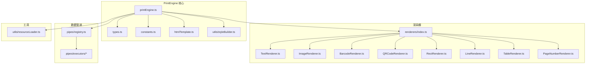
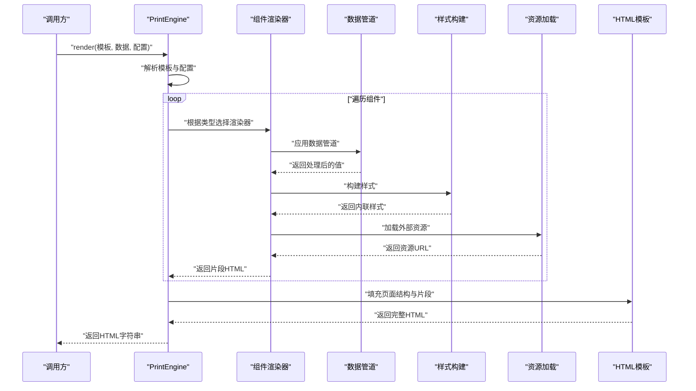
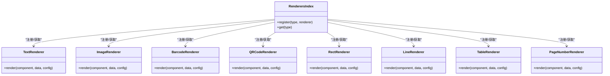
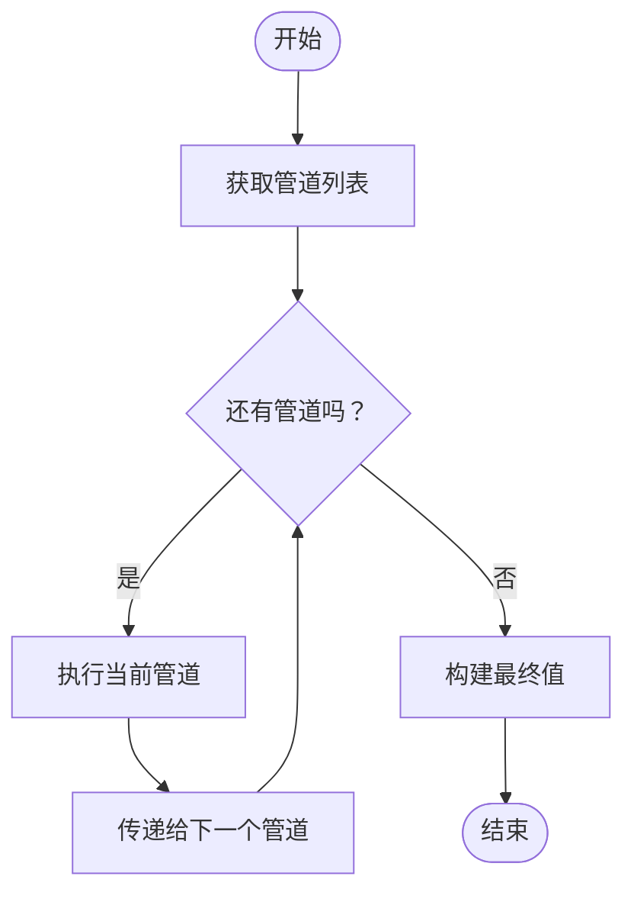
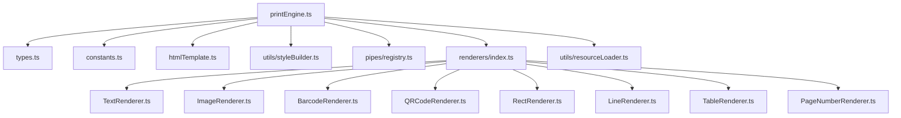

# PrintEngine 接口文档

<cite>
**本文档引用的文件**
- [printEngine.ts](file://sdk/src/printEngine.ts)
- [PrintSDK.ts](file://sdk/src/PrintSDK.ts)
- [types.ts](file://sdk/src/printEngine/types.ts)
- [constants.ts](file://sdk/src/printEngine/constants.ts)
- [htmlTemplate.ts](file://sdk/src/printEngine/htmlTemplate.ts)
- [styleBuilder.ts](file://sdk/src/printEngine/utils/styleBuilder.ts)
- [registry.ts](file://sdk/src/pipes/registry.ts)
- [index.ts](file://sdk/src/printEngine/renderers/index.ts)
- [TextRenderer.ts](file://sdk/src/printEngine/renderers/TextRenderer.ts)
- [ImageRenderer.ts](file://sdk/src/printEngine/renderers/ImageRenderer.ts)
- [BarcodeRenderer.ts](file://sdk/src/printEngine/renderers/BarcodeRenderer.ts)
- [QRCodeRenderer.ts](file://sdk/src/printEngine/renderers/QRCodeRenderer.ts)
- [RectRenderer.ts](file://sdk/src/printEngine/renderers/RectRenderer.ts)
- [LineRenderer.ts](file://sdk/src/printEngine/renderers/LineRenderer.ts)
- [TableRenderer.ts](file://sdk/src/printEngine/renderers/TableRenderer.ts)
- [PageNumberRenderer.ts](file://sdk/src/printEngine/renderers/PageNumberRenderer.ts)
- [ChineseNumberPipe.ts](file://sdk/src/pipes/executors/ChineseNumberPipe.ts)
- [CurrencyPipe.ts](file://sdk/src/pipes/executors/CurrencyPipe.ts)
- [DatePipe.ts](file://sdk/src/pipes/executors/DatePipe.ts)
- [MoneyPipe.ts](file://sdk/src/pipes/executors/MoneyPipe.ts)
- [resourceLoader.ts](file://sdk/src/utils/resourceLoader.ts)
</cite>

## 目录
1. [简介](#简介)
2. [项目结构](#项目结构)
3. [核心组件](#核心组件)
4. [架构总览](#架构总览)
5. [详细组件分析](#详细组件分析)
6. [依赖关系分析](#依赖关系分析)
7. [性能考虑](#性能考虑)
8. [故障排除指南](#故障排除指南)
9. [结论](#结论)
10. [附录](#附录)

## 简介
PrintEngine 是一个用于将设计模板和数据渲染为可打印 HTML 的核心渲染引擎。它通过组件渲染器体系、数据管道系统、样式构建工具以及资源加载机制协同工作，支持文本、图像、条形码、二维码、矩形、线条、表格、页码等组件类型的渲染，并提供可扩展的注册机制与回调事件体系，便于在不同场景下进行定制化输出。

## 项目结构
SDK 根目录下的关键模块组织如下：
- printEngine：核心渲染引擎与渲染器集合
- pipes：数据管道注册与执行器
- utils：通用工具（如资源加载）
- 类型定义：统一的类型声明与常量

**图表来源**
- [printEngine.ts](file://sdk/src/printEngine.ts)
- [types.ts](file://sdk/src/printEngine/types.ts)
- [constants.ts](file://sdk/src/printEngine/constants.ts)
- [htmlTemplate.ts](file://sdk/src/printEngine/htmlTemplate.ts)
- [styleBuilder.ts](file://sdk/src/printEngine/utils/styleBuilder.ts)
- [registry.ts](file://sdk/src/pipes/registry.ts)
- [index.ts](file://sdk/src/printEngine/renderers/index.ts)
- [TextRenderer.ts](file://sdk/src/printEngine/renderers/TextRenderer.ts)
- [ImageRenderer.ts](file://sdk/src/printEngine/renderers/ImageRenderer.ts)
- [BarcodeRenderer.ts](file://sdk/src/printEngine/renderers/BarcodeRenderer.ts)
- [QRCodeRenderer.ts](file://sdk/src/printEngine/renderers/QRCodeRenderer.ts)
- [RectRenderer.ts](file://sdk/src/printEngine/renderers/RectRenderer.ts)
- [LineRenderer.ts](file://sdk/src/printEngine/renderers/LineRenderer.ts)
- [TableRenderer.ts](file://sdk/src/printEngine/renderers/TableRenderer.ts)
- [PageNumberRenderer.ts](file://sdk/src/printEngine/renderers/PageNumberRenderer.ts)
- [resourceLoader.ts](file://sdk/src/utils/resourceLoader.ts)

**章节来源**
- [printEngine.ts](file://sdk/src/printEngine.ts)
- [PrintSDK.ts](file://sdk/src/PrintSDK.ts)

## 核心组件
本节概述 PrintEngine 的主要公共接口与职责：
- 渲染入口：负责接收模板与数据，协调渲染器与管道系统，生成最终 HTML 字符串
- 组件渲染器：针对不同元素类型（文本、图像、条形码、二维码、矩形、线条、表格、页码）提供专用渲染逻辑
- 数据管道：提供可插拔的数据转换与格式化能力，支持注册自定义管道执行器
- 样式构建：将组件样式属性转换为内联或内嵌 CSS
- 资源加载：处理外部资源（如图片）的加载与替换
- HTML 模板：提供页面级 HTML 结构与占位符，作为渲染结果的容器

**章节来源**
- [printEngine.ts](file://sdk/src/printEngine.ts)
- [types.ts](file://sdk/src/printEngine/types.ts)
- [constants.ts](file://sdk/src/printEngine/constants.ts)
- [htmlTemplate.ts](file://sdk/src/printEngine/htmlTemplate.ts)
- [styleBuilder.ts](file://sdk/src/printEngine/utils/styleBuilder.ts)
- [registry.ts](file://sdk/src/pipes/registry.ts)
- [resourceLoader.ts](file://sdk/src/utils/resourceLoader.ts)

## 架构总览
PrintEngine 的整体工作流如下：
- 输入：模板对象、数据对象、渲染配置
- 处理：遍历模板组件，按类型选择对应渲染器；应用数据管道对字段值进行转换；构建样式；加载外部资源；拼接 HTML
- 输出：完整的 HTML 字符串

**图表来源**
- [printEngine.ts](file://sdk/src/printEngine.ts)
- [index.ts](file://sdk/src/printEngine/renderers/index.ts)
- [registry.ts](file://sdk/src/pipes/registry.ts)
- [styleBuilder.ts](file://sdk/src/printEngine/utils/styleBuilder.ts)
- [resourceLoader.ts](file://sdk/src/utils/resourceLoader.ts)
- [htmlTemplate.ts](file://sdk/src/printEngine/htmlTemplate.ts)

## 详细组件分析

### 渲染入口与 render() 方法
- 方法签名与职责
  - render(template, data, config): 将模板与数据渲染为 HTML 字符串
  - 参数规范
    - template: 模板对象，描述页面布局与组件层级
    - data: 数据对象，提供组件字段绑定的数据
    - config: 渲染配置对象，包含回调、事件、资源加载策略、管道配置等
  - 返回值类型
    - string: 完整的 HTML 文档字符串
  - 渲染流程
    - 解析模板与配置
    - 遍历组件树，按类型分派到对应渲染器
    - 应用数据管道转换字段值
    - 构建样式并注入内联CSS
    - 加载外部资源并替换占位
    - 使用 HTML 模板填充页面结构
    - 返回最终 HTML

- 回调与事件机制
  - 支持在配置中注册回调钩子，如渲染开始、组件渲染完成、资源加载完成、渲染结束等事件
  - 回调函数接收上下文信息（组件类型、字段名、原始值、处理后值、错误信息等），便于外部进行日志记录、指标采集与异常处理

- 性能监控与调试
  - 提供计时统计与阶段耗时上报
  - 可开启调试模式输出中间状态与片段HTML，便于定位问题

**章节来源**
- [printEngine.ts](file://sdk/src/printEngine.ts)
- [types.ts](file://sdk/src/printEngine/types.ts)

### 组件渲染器体系
- 注册机制
  - 通过渲染器索引集中导出所有内置渲染器
  - 支持扩展：允许外部注册自定义渲染器，覆盖默认行为或新增组件类型
- 内置渲染器
  - 文本：TextRenderer
  - 图像：ImageRenderer
  - 条形码：BarcodeRenderer
  - 二维码：QRCodeRenderer
  - 矩形：RectRenderer
  - 线条：LineRenderer
  - 表格：TableRenderer
  - 页码：PageNumberRenderer

**图表来源**
- [index.ts](file://sdk/src/printEngine/renderers/index.ts)
- [TextRenderer.ts](file://sdk/src/printEngine/renderers/TextRenderer.ts)
- [ImageRenderer.ts](file://sdk/src/printEngine/renderers/ImageRenderer.ts)
- [BarcodeRenderer.ts](file://sdk/src/printEngine/renderers/BarcodeRenderer.ts)
- [QRCodeRenderer.ts](file://sdk/src/printEngine/renderers/QRCodeRenderer.ts)
- [RectRenderer.ts](file://sdk/src/printEngine/renderers/RectRenderer.ts)
- [LineRenderer.ts](file://sdk/src/printEngine/renderers/LineRenderer.ts)
- [TableRenderer.ts](file://sdk/src/printEngine/renderers/TableRenderer.ts)
- [PageNumberRenderer.ts](file://sdk/src/printEngine/renderers/PageNumberRenderer.ts)

**章节来源**
- [index.ts](file://sdk/src/printEngine/renderers/index.ts)
- [TextRenderer.ts](file://sdk/src/printEngine/renderers/TextRenderer.ts)
- [ImageRenderer.ts](file://sdk/src/printEngine/renderers/ImageRenderer.ts)
- [BarcodeRenderer.ts](file://sdk/src/printEngine/renderers/BarcodeRenderer.ts)
- [QRCodeRenderer.ts](file://sdk/src/printEngine/renderers/QRCodeRenderer.ts)
- [RectRenderer.ts](file://sdk/src/printEngine/renderers/RectRenderer.ts)
- [LineRenderer.ts](file://sdk/src/printEngine/renderers/LineRenderer.ts)
- [TableRenderer.ts](file://sdk/src/printEngine/renderers/TableRenderer.ts)
- [PageNumberRenderer.ts](file://sdk/src/printEngine/renderers/PageNumberRenderer.ts)

### 数据管道系统
- 调用方式
  - 在渲染过程中，针对组件字段值调用已注册的管道执行器
  - 管道按注册顺序串联执行，前一管道的输出作为下一管道的输入
- 配置选项
  - 管道注册表：集中管理管道名称到执行器的映射
  - 执行器：实现统一的转换接口，支持同步与异步处理
- 已有执行器
  - 中文大写数字：ChineseNumberPipe
  - 货币格式：CurrencyPipe
  - 日期格式：DatePipe
  - 金额格式：MoneyPipe

**图表来源**
- [registry.ts](file://sdk/src/pipes/registry.ts)
- [ChineseNumberPipe.ts](file://sdk/src/pipes/executors/ChineseNumberPipe.ts)
- [CurrencyPipe.ts](file://sdk/src/pipes/executors/CurrencyPipe.ts)
- [DatePipe.ts](file://sdk/src/pipes/executors/DatePipe.ts)
- [MoneyPipe.ts](file://sdk/src/pipes/executors/MoneyPipe.ts)

**章节来源**
- [registry.ts](file://sdk/src/pipes/registry.ts)
- [ChineseNumberPipe.ts](file://sdk/src/pipes/executors/ChineseNumberPipe.ts)
- [CurrencyPipe.ts](file://sdk/src/pipes/executors/CurrencyPipe.ts)
- [DatePipe.ts](file://sdk/src/pipes/executors/DatePipe.ts)
- [MoneyPipe.ts](file://sdk/src/pipes/executors/MoneyPipe.ts)

### HTML 生成过程
- HTML 模板
  - 提供页面级结构与占位符，确保输出的 HTML 符合标准文档结构
- 片段拼接
  - 将各组件渲染器生成的片段与样式注入到模板中
- 最终输出
  - 返回完整的 HTML 字符串，可直接用于打印或保存

**章节来源**
- [htmlTemplate.ts](file://sdk/src/printEngine/htmlTemplate.ts)

### 样式构建与资源加载
- 样式构建
  - 将组件样式属性转换为内联 CSS，保证渲染结果的视觉一致性
- 资源加载
  - 对外部资源（如图片）进行加载与替换，支持错误回退策略

**章节来源**
- [styleBuilder.ts](file://sdk/src/printEngine/utils/styleBuilder.ts)
- [resourceLoader.ts](file://sdk/src/utils/resourceLoader.ts)

## 依赖关系分析
PrintEngine 的内部依赖关系如下：

**图表来源**
- [printEngine.ts](file://sdk/src/printEngine.ts)
- [types.ts](file://sdk/src/printEngine/types.ts)
- [constants.ts](file://sdk/src/printEngine/constants.ts)
- [htmlTemplate.ts](file://sdk/src/printEngine/htmlTemplate.ts)
- [styleBuilder.ts](file://sdk/src/printEngine/utils/styleBuilder.ts)
- [registry.ts](file://sdk/src/pipes/registry.ts)
- [index.ts](file://sdk/src/printEngine/renderers/index.ts)
- [TextRenderer.ts](file://sdk/src/printEngine/renderers/TextRenderer.ts)
- [ImageRenderer.ts](file://sdk/src/printEngine/renderers/ImageRenderer.ts)
- [BarcodeRenderer.ts](file://sdk/src/printEngine/renderers/BarcodeRenderer.ts)
- [QRCodeRenderer.ts](file://sdk/src/printEngine/renderers/QRCodeRenderer.ts)
- [RectRenderer.ts](file://sdk/src/printEngine/renderers/RectRenderer.ts)
- [LineRenderer.ts](file://sdk/src/printEngine/renderers/LineRenderer.ts)
- [TableRenderer.ts](file://sdk/src/printEngine/renderers/TableRenderer.ts)
- [PageNumberRenderer.ts](file://sdk/src/printEngine/renderers/PageNumberRenderer.ts)
- [resourceLoader.ts](file://sdk/src/utils/resourceLoader.ts)

**章节来源**
- [printEngine.ts](file://sdk/src/printEngine.ts)
- [index.ts](file://sdk/src/printEngine/renderers/index.ts)
- [registry.ts](file://sdk/src/pipes/registry.ts)

## 性能考虑
- 渲染器分发优化：通过索引集中管理渲染器，减少动态查找开销
- 管道链路：合理组织管道顺序，避免重复计算；对异步管道采用并发策略
- 样式构建：尽量合并样式属性，减少内联CSS体积
- 资源加载：对图片等资源进行缓存与重用，必要时启用懒加载
- 调试模式：仅在开发环境开启，避免生产环境性能损耗

## 故障排除指南
- 常见问题
  - 组件类型未注册：检查渲染器索引是否包含对应类型
  - 管道执行失败：确认管道名称正确且执行器已注册
  - 资源加载超时：检查网络与资源URL，设置合理的超时与重试策略
  - 样式不生效：核对样式构建逻辑与浏览器兼容性
- 异常恢复
  - 在配置中注册错误回调，捕获并记录异常上下文
  - 对可选字段提供默认值，避免渲染中断
  - 使用阶段性的断点与日志，快速定位问题环节

**章节来源**
- [printEngine.ts](file://sdk/src/printEngine.ts)
- [types.ts](file://sdk/src/printEngine/types.ts)

## 结论
PrintEngine 通过清晰的模块划分与可扩展的注册机制，提供了稳定高效的 HTML 渲染能力。结合数据管道与样式构建工具，能够满足复杂打印场景的需求。建议在实际使用中：
- 明确渲染配置与回调策略
- 合理组织管道链路与渲染器扩展
- 关注性能与调试开关的使用
- 建立完善的错误处理与恢复机制

## 附录

### 渲染配置选项清单
- 回调钩子
  - onRenderStart：渲染开始时触发
  - onComponentRender：每个组件渲染完成后触发
  - onResourceLoad：资源加载完成后触发
  - onRenderEnd：渲染结束时触发
  - onError：发生错误时触发
- 资源加载策略
  - 超时时间、重试次数、缓存策略
- 调试选项
  - 是否输出中间片段HTML、是否记录耗时统计

**章节来源**
- [types.ts](file://sdk/src/printEngine/types.ts)
- [constants.ts](file://sdk/src/printEngine/constants.ts)