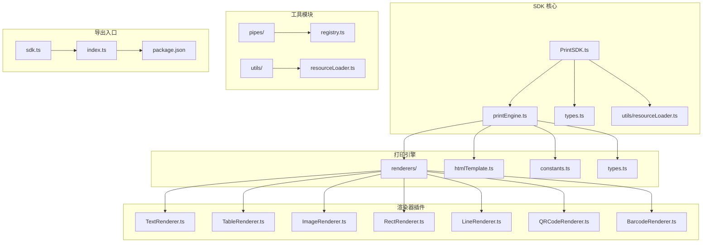
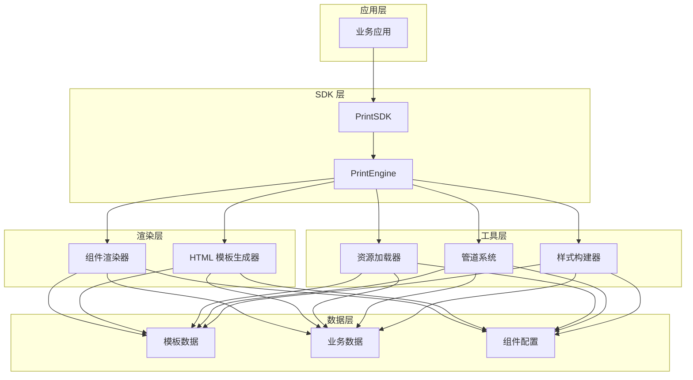
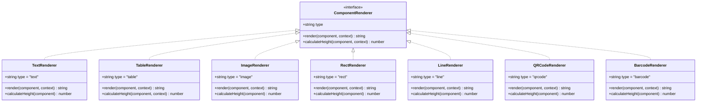
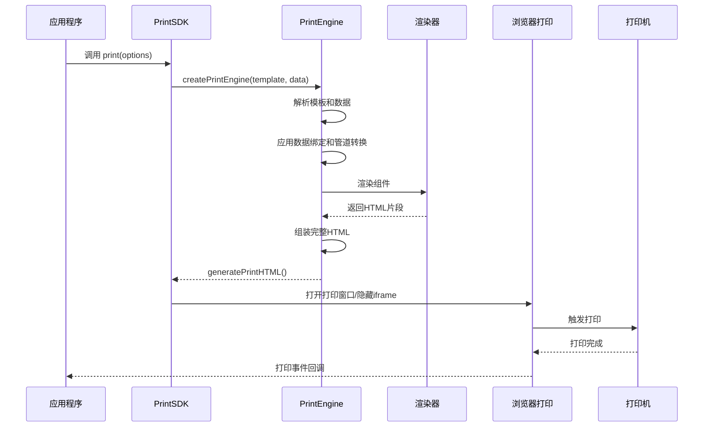
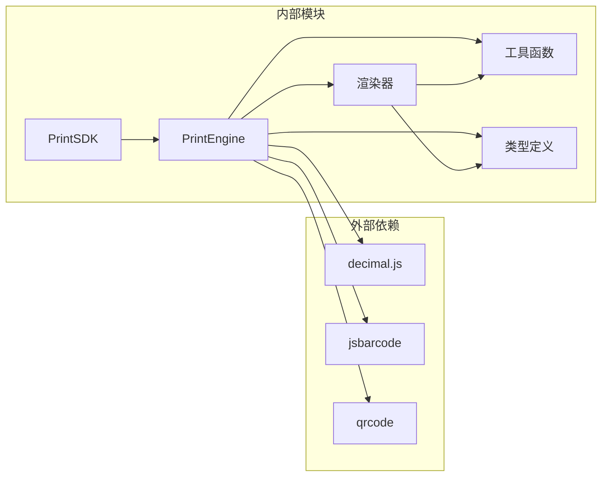

# PrintSDK 接口文档

<cite>
**本文档引用的文件**
- [PrintSDK.ts](file://sdk/src/PrintSDK.ts)
- [printEngine.ts](file://sdk/src/printEngine.ts)
- [sdk.ts](file://sdk/src/sdk.ts)
- [types.ts](file://sdk/src/types.ts)
- [index.ts](file://sdk/src/index.ts)
- [htmlTemplate.ts](file://sdk/src/printEngine/htmlTemplate.ts)
- [resourceLoader.ts](file://sdk/src/utils/resourceLoader.ts)
- [package.json](file://sdk/package.json)
- [example.html](file://sdk/example.html)
- [TextRenderer.ts](file://sdk/src/printEngine/renderers/TextRenderer.ts)
- [TableRenderer.ts](file://sdk/src/printEngine/renderers/TableRenderer.ts)
- [registry.ts](file://sdk/src/pipes/registry.ts)
</cite>

## 目录
1. [简介](#简介)
2. [项目结构](#项目结构)
3. [核心组件](#核心组件)
4. [架构概览](#架构概览)
5. [详细组件分析](#详细组件分析)
6. [依赖关系分析](#依赖关系分析)
7. [性能考虑](#性能考虑)
8. [故障排除指南](#故障排除指南)
9. [结论](#结论)
10. [附录](#附录)

## 简介

PrintSDK 是一个完全解耦的客户端打印解决方案，专为浏览器环境设计。它提供了完整的打印功能封装，无需依赖任何外部服务，直接接收模板数据进行渲染和打印。该SDK采用插件化架构，支持多种组件类型的渲染，并提供了丰富的配置选项和错误处理机制。

## 项目结构

PrintSDK 项目采用模块化设计，主要包含以下核心模块：



**图表来源**
- [PrintSDK.ts:1-477](file://sdk/src/PrintSDK.ts#L1-L477)
- [printEngine.ts:1-800](file://sdk/src/printEngine.ts#L1-L800)
- [sdk.ts:1-66](file://sdk/src/sdk.ts#L1-L66)

**章节来源**
- [PrintSDK.ts:1-477](file://sdk/src/PrintSDK.ts#L1-L477)
- [sdk.ts:1-66](file://sdk/src/sdk.ts#L1-L66)

## 核心组件

### PrintSDK 类

PrintSDK 是SDK的核心类，提供了完整的打印功能。它采用完全解耦的设计，无需任何配置即可使用。

**主要特性：**
- 无状态设计：无需初始化和配置
- 数据驱动：直接接收模板和数据
- 插件化渲染：支持多种组件类型的渲染
- 批量打印：支持同模板多数据和多模板批量打印
- 预览模式：支持预览后打印功能

**构造函数：**
```typescript
new PrintSDK()
```

PrintSDK 类提供了以下公共方法：

**章节来源**
- [PrintSDK.ts:100-477](file://sdk/src/PrintSDK.ts#L100-L477)

### PrintEngine 类

PrintEngine 是打印引擎的核心类，负责模板解析、数据绑定、组件渲染和虚拟分页计算。

**主要职责：**
- 模板解析和验证
- 数据绑定和管道转换
- 组件渲染器管理
- 虚拟分页算法
- 页面尺寸计算

**章节来源**
- [printEngine.ts:30-800](file://sdk/src/printEngine.ts#L30-L800)

## 架构概览

PrintSDK 采用了清晰的分层架构，确保了良好的可维护性和扩展性：



**图表来源**
- [PrintSDK.ts:100-477](file://sdk/src/PrintSDK.ts#L100-L477)
- [printEngine.ts:30-800](file://sdk/src/printEngine.ts#L30-L800)

## 详细组件分析

### PrintSDK 类详细分析

#### print() 方法

print() 方法是SDK的核心打印方法，支持直接打印和预览两种模式。

**方法签名：**
```typescript
async print(options: PrintOptions): Promise<void>
```

**参数类型：**
- `options`: PrintOptions 接口
  - `template`: PrintTemplate - 模板数据
  - `data`: any - 打印数据
  - `preview`: boolean (可选) - 是否预览，默认 false

**返回值：**
- Promise<void> - 打印操作完成后返回

**使用示例：**

1. 直接打印：
```typescript
await sdk.print({
  template: templateData,
  data: businessData,
  preview: false
});
```

2. 预览后打印：
```typescript
await sdk.print({
  template: templateData,
  data: businessData,
  preview: true
});
```

**章节来源**
- [PrintSDK.ts:110-172](file://sdk/src/PrintSDK.ts#L110-L172)

#### printMultiple() 方法

printMultiple() 方法支持同模板多数据的批量打印。

**方法签名：**
```typescript
async printMultiple(
  template: PrintTemplate,
  dataList: any[],
  options: BatchPrintOptions
): Promise<void>
```

**参数类型：**
- `template`: PrintTemplate - 模板数据
- `dataList`: any[] - 数据列表
- `options`: BatchPrintOptions - 批量打印选项
  - `preview`: boolean (可选) - 是否预览
  - `onProgress`: (progress: BatchPrintProgress) => void (可选) - 进度回调

**返回值：**
- Promise<void> - 批量打印完成后返回

**章节来源**
- [PrintSDK.ts:210-322](file://sdk/src/PrintSDK.ts#L210-L322)

#### printMultiTemplate() 方法

printMultiTemplate() 方法支持多个模板各自绑定数据列表的批量打印。

**方法签名：**
```typescript
async printMultiTemplate(
  groups: PrintTemplateGroup[],
  options: MultiTemplatePrintOptions
): Promise<void>
```

**参数类型：**
- `groups`: PrintTemplateGroup[] - 模板+数据组列表
- `options`: MultiTemplatePrintOptions - 打印选项
  - `preview`: boolean (可选) - 是否预览
  - `onProgress`: (progress: MultiTemplatePrintProgress) => void (可选) - 进度回调

**返回值：**
- Promise<void> - 多模板批量打印完成后返回

**章节来源**
- [PrintSDK.ts:332-467](file://sdk/src/PrintSDK.ts#L332-L467)

### PrintEngine 类详细分析

#### 组件渲染器体系

PrintEngine 采用插件化渲染器架构，支持多种组件类型的渲染：



**图表来源**
- [TextRenderer.ts:10-60](file://sdk/src/printEngine/renderers/TextRenderer.ts#L10-L60)
- [TableRenderer.ts:147-602](file://sdk/src/printEngine/renderers/TableRenderer.ts#L147-L602)

**章节来源**
- [printEngine.ts:30-800](file://sdk/src/printEngine.ts#L30-L800)

#### 数据绑定和管道系统

PrintEngine 提供了强大的数据绑定和管道转换功能：

**数据绑定流程：**
1. 通过 `getValueByPath()` 方法解析数据路径
2. 支持嵌套属性访问和智能前缀匹配
3. 通过 `applyPipes()` 方法应用管道转换
4. 最终返回渲染所需的字符串值

**管道系统：**
- 支持多种内置管道：日期格式化、货币转换、中文大写等
- 支持自定义管道扩展
- 管道执行器注册和管理

**章节来源**
- [printEngine.ts:74-125](file://sdk/src/printEngine.ts#L74-L125)
- [registry.ts:1-65](file://sdk/src/pipes/registry.ts#L1-L65)

### 模板加载、数据绑定和打印输出流程



**图表来源**
- [PrintSDK.ts:110-172](file://sdk/src/PrintSDK.ts#L110-L172)
- [printEngine.ts:389-420](file://sdk/src/printEngine.ts#L389-L420)

**章节来源**
- [PrintSDK.ts:110-172](file://sdk/src/PrintSDK.ts#L110-L172)
- [printEngine.ts:389-420](file://sdk/src/printEngine.ts#L389-L420)

## 依赖关系分析

PrintSDK 的依赖关系设计体现了良好的模块化原则：



**图表来源**
- [package.json:49-53](file://sdk/package.json#L49-L53)
- [PrintSDK.ts:7-14](file://sdk/src/PrintSDK.ts#L7-L14)

**章节来源**
- [package.json:1-61](file://sdk/package.json#L1-L61)

### 错误处理机制

PrintSDK 实现了多层次的错误处理机制：

1. **构造函数错误处理**：创建打印窗口失败时抛出明确错误
2. **数据绑定错误处理**：数据路径解析失败时使用回退值
3. **渲染器错误处理**：找不到渲染器时记录警告并返回空内容
4. **资源加载错误处理**：图片加载失败时记录错误并继续执行
5. **批量打印错误处理**：单个数据项处理失败时记录错误并继续处理其他数据

**章节来源**
- [PrintSDK.ts:117-119](file://sdk/src/PrintSDK.ts#L117-L119)
- [printEngine.ts:199-202](file://sdk/src/printEngine.ts#L199-L202)
- [resourceLoader.ts:62-66](file://sdk/src/utils/resourceLoader.ts#L62-L66)

## 性能考虑

### 渲染性能优化

1. **虚拟分页算法**：使用相对间距计算，避免复杂的布局重排
2. **组件高度估算**：提供快速高度估算，减少不必要的测量开销
3. **表格渲染优化**：支持跨页拆分和重复表头，提升大表格渲染效率
4. **资源加载优化**：异步加载图片和其他外部资源

### 内存管理

1. **DOM 清理**：打印完成后及时清理临时DOM元素
2. **事件监听器**：使用一次性监听器，避免内存泄漏
3. **超时机制**：图片加载超时自动清理，防止长时间阻塞

### 打印性能

1. **预览优化**：预览模式下延迟打印，确保资源完全加载
2. **批量打印**：支持一次性生成所有页面，减少打印对话框弹出次数
3. **连续纸支持**：针对连续纸张优化，避免不必要的分页

## 故障排除指南

### 常见问题及解决方案

**问题1：打印窗口无法打开**
- 检查浏览器弹窗阻止设置
- 确认 `window.open()` 方法可用
- 在受限制的环境中使用预览模式

**问题2：图片无法正确显示**
- 检查图片URL的有效性和可访问性
- 确认跨域资源共享(CORS)配置
- 使用本地图片或CDN加速

**问题3：表格跨页显示异常**
- 检查表格数据绑定路径
- 确认表格列配置的正确性
- 调整表格宽度以适应页面布局

**问题4：批量打印进度不准确**
- 确认 `onProgress` 回调函数的正确实现
- 检查数据列表的长度和格式
- 监控网络请求和资源加载状态

**章节来源**
- [PrintSDK.ts:252-257](file://sdk/src/PrintSDK.ts#L252-L257)
- [resourceLoader.ts:28-32](file://sdk/src/utils/resourceLoader.ts#L28-L32)

## 结论

PrintSDK 提供了一个功能完整、性能优异的客户端打印解决方案。其完全解耦的设计理念使得集成变得极其简单，而插件化的渲染器架构则保证了良好的扩展性。通过合理的错误处理机制和性能优化策略，PrintSDK 能够满足各种复杂的打印需求。

## 附录

### API 参考

#### PrintSDK 类

| 方法 | 参数 | 返回值 | 描述 |
|------|------|--------|------|
| `print` | `PrintOptions` | `Promise<void>` | 执行打印操作 |
| `printDirect` | `PrintTemplate, any` | `Promise<void>` | 直接打印（预览=false） |
| `printWithPreview` | `PrintTemplate, any` | `Promise<void>` | 预览后打印（预览=true） |
| `generateHTML` | `PrintTemplate, any` | `Promise<string>` | 仅生成HTML |
| `printMultiple` | `PrintTemplate, any[], BatchPrintOptions` | `Promise<void>` | 同模板多数据批量打印 |
| `printMultiTemplate` | `PrintTemplateGroup[], MultiTemplatePrintOptions` | `Promise<void>` | 多模板批量打印 |

#### 类型定义

**PrintOptions 接口**
- `template`: PrintTemplate - 模板数据
- `data`: any - 打印数据  
- `preview`: boolean (可选) - 是否预览

**PrintTemplate 接口**
- `id`: string - 模板标识
- `name`: string - 模板名称
- `page`: PageConfig - 页面配置
- `components`: ComponentNode[] - 组件列表
- `headerComponents`: ComponentNode[] (可选) - 页头组件
- `footerComponents`: ComponentNode[] (可选) - 页脚组件

**章节来源**
- [PrintSDK.ts:47-98](file://sdk/src/PrintSDK.ts#L47-L98)
- [types.ts:204-217](file://sdk/src/types.ts#L204-L217)

### 使用示例

完整的使用示例可以在以下文件中找到：
- [example.html](file://sdk/example.html) - 完整的演示页面
- [index.ts](file://sdk/src/index.ts) - SDK 导出入口

这些示例展示了如何创建SDK实例、配置打印选项以及处理各种打印场景。