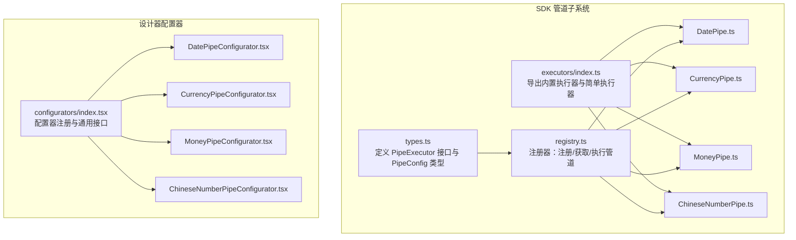
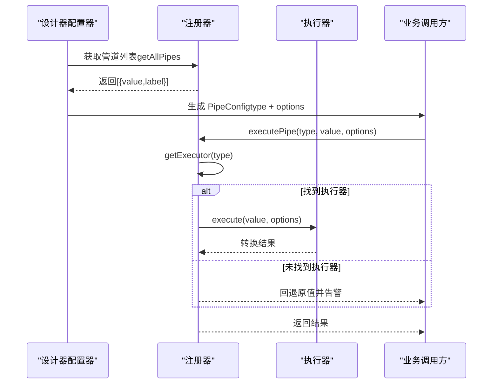
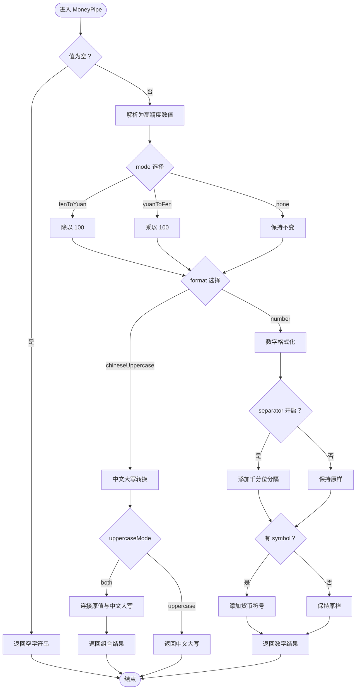
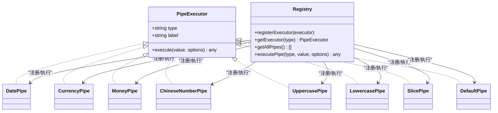

# 数据管道执行器接口

<cite>
**本文引用的文件**
- [sdk/src/pipes/types.ts](file://sdk/src/pipes/types.ts)
- [sdk/src/pipes/registry.ts](file://sdk/src/pipes/registry.ts)
- [sdk/src/pipes/executors/index.ts](file://sdk/src/pipes/executors/index.ts)
- [sdk/src/pipes/executors/DatePipe.ts](file://sdk/src/pipes/executors/DatePipe.ts)
- [sdk/src/pipes/executors/CurrencyPipe.ts](file://sdk/src/pipes/executors/CurrencyPipe.ts)
- [sdk/src/pipes/executors/MoneyPipe.ts](file://sdk/src/pipes/executors/MoneyPipe.ts)
- [sdk/src/pipes/executors/ChineseNumberPipe.ts](file://sdk/src/pipes/executors/ChineseNumberPipe.ts)
- [designer/src/pipes/configurators/index.tsx](file://designer/src/pipes/configurators/index.tsx)
- [designer/src/pipes/configurators/DatePipeConfigurator.tsx](file://designer/src/pipes/configurators/DatePipeConfigurator.tsx)
- [designer/src/pipes/configurators/CurrencyPipeConfigurator.tsx](file://designer/src/pipes/configurators/CurrencyPipeConfigurator.tsx)
- [designer/src/pipes/configurators/MoneyPipeConfigurator.tsx](file://designer/src/pipes/configurators/MoneyPipeConfigurator.tsx)
- [designer/src/pipes/configurators/ChineseNumberPipeConfigurator.tsx](file://designer/src/pipes/configurators/ChineseNumberPipeConfigurator.tsx)
- [sdk/src/types.ts](file://sdk/src/types.ts)
- [sdk/src/pipes/index.ts](file://sdk/src/pipes/index.ts)
- [sdk/example.html](file://sdk/example.html)
</cite>

## 目录
1. [简介](#简介)
2. [项目结构](#项目结构)
3. [核心组件](#核心组件)
4. [架构总览](#架构总览)
5. [详细组件分析](#详细组件分析)
6. [依赖分析](#依赖分析)
7. [性能考虑](#性能考虑)
8. [故障排查指南](#故障排查指南)
9. [结论](#结论)
10. [附录](#附录)

## 简介
本文件为“数据管道执行器系统”的接口与使用文档，覆盖以下内容：
- 内置数据管道执行器的接口规范与行为说明（DatePipe、CurrencyPipe、MoneyPipe、ChineseNumberPipe 等）
- 管道执行器的注册机制与扩展接口
- 每个管道的配置选项、参数设置与典型使用场景
- 自定义数据管道执行器的开发指南与接口规范
- 管道链式调用与错误处理机制
- 管道性能优化与缓存策略建议
- 完整的代码示例路径，展示如何实现自定义管道

## 项目结构
数据管道系统位于 SDK 的 pipes 子模块，包含类型定义、注册器、执行器集合与 UI 配置器。设计器侧提供各管道的可视化配置器，用于在设计阶段配置管道参数。

图表来源
- [sdk/src/pipes/types.ts:1-30](file://sdk/src/pipes/types.ts#L1-L30)
- [sdk/src/pipes/registry.ts:1-65](file://sdk/src/pipes/registry.ts#L1-L65)
- [sdk/src/pipes/executors/index.ts:1-45](file://sdk/src/pipes/executors/index.ts#L1-L45)
- [sdk/src/pipes/executors/DatePipe.ts:1-35](file://sdk/src/pipes/executors/DatePipe.ts#L1-L35)
- [sdk/src/pipes/executors/CurrencyPipe.ts:1-17](file://sdk/src/pipes/executors/CurrencyPipe.ts#L1-L17)
- [sdk/src/pipes/executors/MoneyPipe.ts:1-130](file://sdk/src/pipes/executors/MoneyPipe.ts#L1-L130)
- [sdk/src/pipes/executors/ChineseNumberPipe.ts:1-138](file://sdk/src/pipes/executors/ChineseNumberPipe.ts#L1-L138)
- [designer/src/pipes/configurators/index.tsx:1-85](file://designer/src/pipes/configurators/index.tsx#L1-L85)
- [designer/src/pipes/configurators/DatePipeConfigurator.tsx:1-23](file://designer/src/pipes/configurators/DatePipeConfigurator.tsx#L1-L23)
- [designer/src/pipes/configurators/CurrencyPipeConfigurator.tsx:1-23](file://designer/src/pipes/configurators/CurrencyPipeConfigurator.tsx#L1-L23)
- [designer/src/pipes/configurators/MoneyPipeConfigurator.tsx:1-143](file://designer/src/pipes/configurators/MoneyPipeConfigurator.tsx#L1-L143)
- [designer/src/pipes/configurators/ChineseNumberPipeConfigurator.tsx:1-58](file://designer/src/pipes/configurators/ChineseNumberPipeConfigurator.tsx#L1-L58)

章节来源
- [sdk/src/pipes/index.ts:1-8](file://sdk/src/pipes/index.ts#L1-L8)
- [sdk/src/pipes/types.ts:1-30](file://sdk/src/pipes/types.ts#L1-L30)
- [sdk/src/pipes/registry.ts:1-65](file://sdk/src/pipes/registry.ts#L1-L65)
- [sdk/src/pipes/executors/index.ts:1-45](file://sdk/src/pipes/executors/index.ts#L1-L45)

## 核心组件
- 管道执行器接口（PipeExecutor）
  - type：字符串，唯一标识
  - label：显示名称
  - execute(value, options?)：执行转换，返回任意类型
- 管道配置（PipeConfig）
  - type：管道类型
  - options：配置选项对象
- 注册器（registry）
  - registerExecutor：注册执行器
  - getExecutor：按 type 获取执行器
  - getAllPipes：返回下拉选择所需的数据
  - executePipe：统一执行入口，未注册时回退原值并告警

章节来源
- [sdk/src/pipes/types.ts:11-29](file://sdk/src/pipes/types.ts#L11-L29)
- [sdk/src/types.ts:77-86](file://sdk/src/types.ts#L77-L86)
- [sdk/src/pipes/registry.ts:17-52](file://sdk/src/pipes/registry.ts#L17-L52)

## 架构总览
管道系统采用“执行器 + 注册器 + 配置器”的分层设计：
- 执行器负责具体转换逻辑
- 注册器集中管理执行器生命周期与执行
- 配置器在设计器侧提供可视化参数面板
- SDK 通过统一入口导出类型、注册器与执行器集合

图表来源
- [sdk/src/pipes/registry.ts:31-52](file://sdk/src/pipes/registry.ts#L31-L52)
- [designer/src/pipes/configurators/index.tsx:69-84](file://designer/src/pipes/configurators/index.tsx#L69-L84)

## 详细组件分析

### DatePipe（日期格式化）
- 类型标识：date
- 显示名称：日期格式化
- 参数（options）
  - format：格式串，默认 YYYY-MM-DD；支持占位符 YYYY、MM、DD、HH、mm、ss
- 行为
  - 输入为空返回空字符串
  - 非法日期保持原值字符串
  - 使用占位符替换实现格式化
- 典型场景
  - 订单时间、创建时间、到期日等展示
- 错误处理
  - 非法日期输入返回原始字符串
- 复杂度
  - O(n) 与格式串长度相关

章节来源
- [sdk/src/pipes/executors/DatePipe.ts:7-34](file://sdk/src/pipes/executors/DatePipe.ts#L7-L34)
- [designer/src/pipes/configurators/DatePipeConfigurator.tsx:9-22](file://designer/src/pipes/configurators/DatePipeConfigurator.tsx#L9-L22)

### CurrencyPipe（货币格式化）
- 类型标识：currency
- 显示名称：货币格式化
- 参数（options）
  - symbol：货币符号，默认 ¥
  - precision：小数位，默认 2
- 行为
  - 将数值按精度格式化并加前缀符号
- 典型场景
  - 价格、金额、账单费用等
- 错误处理
  - 非数值输入按 0 处理

章节来源
- [sdk/src/pipes/executors/CurrencyPipe.ts:7-16](file://sdk/src/pipes/executors/CurrencyPipe.ts#L7-L16)
- [designer/src/pipes/configurators/CurrencyPipeConfigurator.tsx:9-22](file://designer/src/pipes/configurators/CurrencyPipeConfigurator.tsx#L9-L22)

### MoneyPipe（金额转换）
- 类型标识：money
- 显示名称：金额转换
- 参数（options）
  - mode：转换模式，'fenToYuan' | 'yuanToFen' | 'none'，默认 fenToYuan
  - precision：小数位，默认 2
  - symbol：货币符号，默认空
  - separator：千分位分隔开关，默认 false
  - format：输出格式，'number' | 'chineseUppercase'，默认 number
  - uppercaseMode：中文大写模式，'uppercase' | 'both'，默认 uppercase
  - separator（中文大写连接符）：当 uppercaseMode='both' 时的连接符，可自定义
- 行为
  - 支持分/元互转与原值格式化
  - 支持数字格式化（精度、千分位、货币符号）
  - 支持中文大写金额（含角分、整、负数、连接符）
  - 内部使用高精度计算库保证精度
- 典型场景
  - 订单金额、发票金额、财务报表金额
- 错误处理
  - 异常时记录错误并回退为原始字符串

图表来源
- [sdk/src/pipes/executors/MoneyPipe.ts:59-129](file://sdk/src/pipes/executors/MoneyPipe.ts#L59-L129)

章节来源
- [sdk/src/pipes/executors/MoneyPipe.ts:59-129](file://sdk/src/pipes/executors/MoneyPipe.ts#L59-L129)
- [designer/src/pipes/configurators/MoneyPipeConfigurator.tsx:9-142](file://designer/src/pipes/configurators/MoneyPipeConfigurator.tsx#L9-L142)

### ChineseNumberPipe（中文大写数字）
- 类型标识：chineseNumber
- 显示名称：中文大写数字
- 参数（options）
  - mode：输出模式，'uppercase' | 'both'，默认 uppercase
  - separator：连接符（当 mode='both' 时），默认括号
  - unit：后缀单位，如“元”
- 行为
  - 将数字转换为会计大写中文（支持到亿级）
  - 支持整数与小数逐位读出
  - 支持负数、零、点等规则
- 典型场景
  - 发票、合同、财务凭证的大写金额
- 错误处理
  - 非法输入回退为原始值或空字符串

章节来源
- [sdk/src/pipes/executors/ChineseNumberPipe.ts:99-137](file://sdk/src/pipes/executors/ChineseNumberPipe.ts#L99-L137)
- [designer/src/pipes/configurators/ChineseNumberPipeConfigurator.tsx:11-57](file://designer/src/pipes/configurators/ChineseNumberPipeConfigurator.tsx#L11-L57)

### 简单管道执行器（无需配置）
- UppercasePipe：转大写
- LowercasePipe：转小写
- SlicePipe：字符串截取（start、end）
- DefaultPipe：默认值（defaultValue）

章节来源
- [sdk/src/pipes/executors/index.ts:16-44](file://sdk/src/pipes/executors/index.ts#L16-L44)

## 依赖分析
- 类型依赖
  - PipeExecutor 接口定义于 types.ts
  - PipeConfig 在 SDK 类型定义中复用
- 执行器依赖
  - MoneyPipe 依赖高精度计算库与 ChineseNumberPipe 的中文大写转换函数
- 注册与执行
  - registry.ts 统一注册内置执行器，并提供执行入口
- 设计器配置器
  - 通过 configurators/index.tsx 注册各管道配置器，映射到对应 UI 控件

图表来源
- [sdk/src/pipes/types.ts:11-29](file://sdk/src/pipes/types.ts#L11-L29)
- [sdk/src/pipes/registry.ts:17-52](file://sdk/src/pipes/registry.ts#L17-L52)
- [sdk/src/pipes/executors/DatePipe.ts:7-34](file://sdk/src/pipes/executors/DatePipe.ts#L7-L34)
- [sdk/src/pipes/executors/CurrencyPipe.ts:7-16](file://sdk/src/pipes/executors/CurrencyPipe.ts#L7-L16)
- [sdk/src/pipes/executors/MoneyPipe.ts:59-129](file://sdk/src/pipes/executors/MoneyPipe.ts#L59-L129)
- [sdk/src/pipes/executors/ChineseNumberPipe.ts:99-137](file://sdk/src/pipes/executors/ChineseNumberPipe.ts#L99-L137)
- [sdk/src/pipes/executors/index.ts:16-44](file://sdk/src/pipes/executors/index.ts#L16-L44)

章节来源
- [sdk/src/pipes/registry.ts:54-64](file://sdk/src/pipes/registry.ts#L54-L64)
- [sdk/src/pipes/executors/index.ts:6-9](file://sdk/src/pipes/executors/index.ts#L6-L9)

## 性能考虑
- 执行器复杂度
  - DatePipe：O(n) 与格式串长度相关
  - CurrencyPipe：常数级
  - MoneyPipe：高精度计算与字符串替换，整体近似 O(n)
  - ChineseNumberPipe：字符串构造，近似 O(m)，m 为数字位数
- 缓存策略建议
  - 对高频、相同格式的日期/货币格式化，可在上层缓存格式串替换结果
  - 对中文大写金额，可缓存常用数值映射（注意边界与精度）
- 精度控制
  - MoneyPipe 使用高精度库，避免浮点误差
- 渲染优化
  - 在设计器侧，配置器应避免不必要的重渲染（受控组件值变更时再触发 onChange）

## 故障排查指南
- 管道未找到
  - 现象：executePipe 未命中执行器，返回原值并告警
  - 排查：确认 type 是否正确，执行器是否已注册
- 日期格式异常
  - 现象：非法日期返回原始字符串
  - 排查：检查输入是否可被解析为有效日期
- 金额转换异常
  - 现象：异常时回退为原始字符串
  - 排查：检查输入是否为合法数值，mode 与 format 组合是否合理
- 中文大写异常
  - 现象：异常时回退为原始值或空字符串
  - 排查：检查输入类型与单位、连接符设置

章节来源
- [sdk/src/pipes/registry.ts:45-52](file://sdk/src/pipes/registry.ts#L45-L52)
- [sdk/src/pipes/executors/DatePipe.ts:11-17](file://sdk/src/pipes/executors/DatePipe.ts#L11-L17)
- [sdk/src/pipes/executors/MoneyPipe.ts:124-128](file://sdk/src/pipes/executors/MoneyPipe.ts#L124-L128)
- [sdk/src/pipes/executors/ChineseNumberPipe.ts:132-136](file://sdk/src/pipes/executors/ChineseNumberPipe.ts#L132-L136)

## 结论
本系统提供了清晰的管道执行器接口与完善的注册机制，内置多种实用管道并配套设计器可视化配置器。通过统一的 PipeConfig 与 executePipe，用户可以灵活地组合多个管道实现复杂的字段转换需求。对于自定义扩展，只需遵循 PipeExecutor 接口即可无缝接入。

## 附录

### 管道链式调用与错误处理
- 链式调用
  - 在业务侧对同一字段依次执行多个管道，按顺序传递上一个管道的输出作为下一个管道的输入
  - 建议在执行链中保留中间状态以便调试
- 错误处理
  - 执行器内部捕获异常并回退为安全值
  - 注册器未找到执行器时返回原值并输出警告

章节来源
- [sdk/src/pipes/registry.ts:45-52](file://sdk/src/pipes/registry.ts#L45-L52)

### 自定义数据管道执行器开发指南
- 接口规范
  - 实现 PipeExecutor 接口，提供 type、label、execute 方法
  - execute(value, options?)：根据 options 对 value 进行转换
- 注册与使用
  - 通过 registerExecutor 注册你的执行器
  - 通过 executePipe(type, value, options) 执行
- 设计器集成
  - 在 configurators/index.tsx 中新增配置器并注册
  - 通过 PipeConfigurator 接口提供 UI 控件与 onChange 回调
- 示例路径
  - 参考 MoneyPipe 的实现与 MoneyPipeConfigurator 的 UI 配置
  - 参考 ChineseNumberPipe 的中文大写转换逻辑

章节来源
- [sdk/src/pipes/types.ts:11-29](file://sdk/src/pipes/types.ts#L11-L29)
- [sdk/src/pipes/registry.ts:17-52](file://sdk/src/pipes/registry.ts#L17-L52)
- [designer/src/pipes/configurators/index.tsx:17-20](file://designer/src/pipes/configurators/index.tsx#L17-L20)
- [designer/src/pipes/configurators/MoneyPipeConfigurator.tsx:9-142](file://designer/src/pipes/configurators/MoneyPipeConfigurator.tsx#L9-L142)
- [sdk/src/pipes/executors/MoneyPipe.ts:59-129](file://sdk/src/pipes/executors/MoneyPipe.ts#L59-L129)
- [sdk/src/pipes/executors/ChineseNumberPipe.ts:99-137](file://sdk/src/pipes/executors/ChineseNumberPipe.ts#L99-L137)

### 使用示例（代码路径）
- SDK 初始化与打印（示例页面）
  - [sdk/example.html:130-198](file://sdk/example.html#L130-L198)
- 管道配置类型
  - [sdk/src/types.ts:77-86](file://sdk/src/types.ts#L77-L86)
- 管道入口导出
  - [sdk/src/pipes/index.ts:6-8](file://sdk/src/pipes/index.ts#L6-L8)