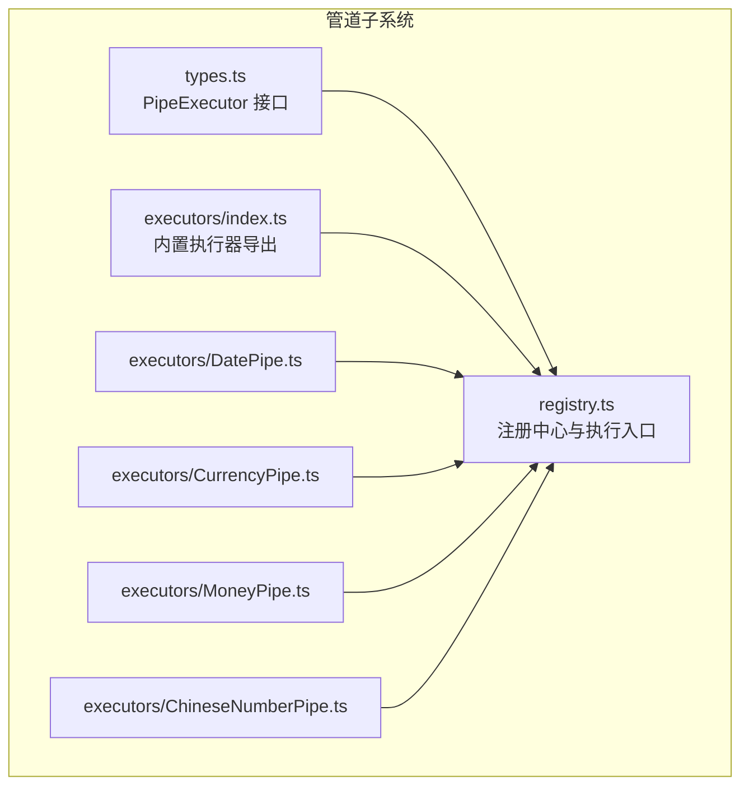
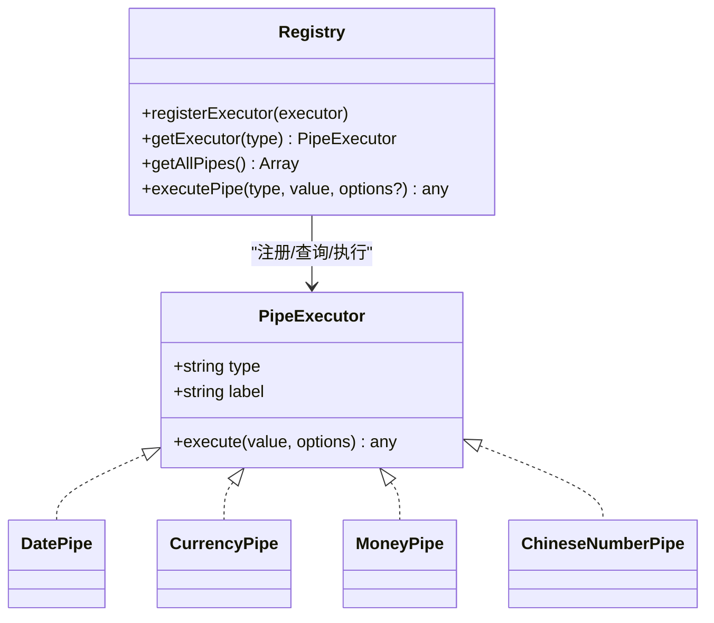
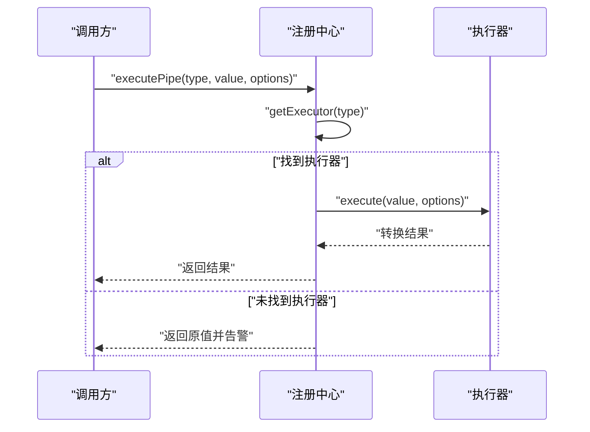
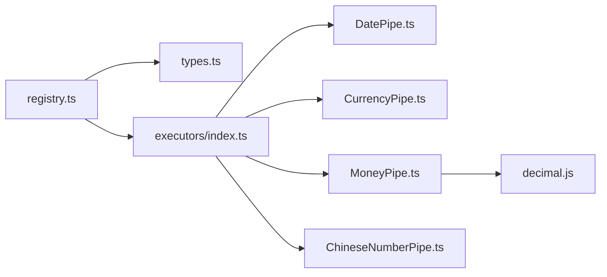

# 管道注册器接口

<cite>
**本文引用的文件**
- [sdk/src/pipes/registry.ts](file://sdk/src/pipes/registry.ts)
- [sdk/src/pipes/index.ts](file://sdk/src/pipes/index.ts)
- [sdk/src/pipes/types.ts](file://sdk/src/pipes/types.ts)
- [sdk/src/pipes/executors/index.ts](file://sdk/src/pipes/executors/index.ts)
- [sdk/src/pipes/executors/ChineseNumberPipe.ts](file://sdk/src/pipes/executors/ChineseNumberPipe.ts)
- [sdk/src/pipes/executors/CurrencyPipe.ts](file://sdk/src/pipes/executors/CurrencyPipe.ts)
- [sdk/src/pipes/executors/DatePipe.ts](file://sdk/src/pipes/executors/DatePipe.ts)
- [sdk/src/pipes/executors/MoneyPipe.ts](file://sdk/src/pipes/executors/MoneyPipe.ts)
- [sdk/src/types.ts](file://sdk/src/types.ts)
- [sdk/src/index.ts](file://sdk/src/index.ts)
</cite>

## 目录
1. [简介](#简介)
2. [项目结构](#项目结构)
3. [核心组件](#核心组件)
4. [架构总览](#架构总览)
5. [详细组件分析](#详细组件分析)
6. [依赖关系分析](#依赖关系分析)
7. [性能考量](#性能考量)
8. [故障排查指南](#故障排查指南)
9. [结论](#结论)
10. [附录](#附录)

## 简介
本文件面向“数据管道注册器”的接口与实现，聚焦 PipeRegistry 的职责边界、生命周期、依赖注入与插件化扩展点，并给出使用示例与最佳实践。通过统一的 PipeExecutor 接口与注册中心，系统实现了内置管道的集中管理与动态执行，同时预留了扩展空间以支持自定义管道。

## 项目结构
围绕管道系统的目录组织采用“按功能域分层 + 按职责聚合”的方式：
- pipes 子系统：包含类型定义、执行器集合、注册中心与入口导出
- types.ts：与管道相关的数据绑定与模板类型定义
- index.ts：SDK 入口导出，包含管道系统导出

图表来源
- [sdk/src/pipes/registry.ts:1-65](file://sdk/src/pipes/registry.ts#L1-L65)
- [sdk/src/pipes/types.ts:1-30](file://sdk/src/pipes/types.ts#L1-L30)
- [sdk/src/pipes/executors/index.ts:1-45](file://sdk/src/pipes/executors/index.ts#L1-L45)
- [sdk/src/pipes/executors/DatePipe.ts:1-35](file://sdk/src/pipes/executors/DatePipe.ts#L1-L35)
- [sdk/src/pipes/executors/CurrencyPipe.ts:1-17](file://sdk/src/pipes/executors/CurrencyPipe.ts#L1-L17)
- [sdk/src/pipes/executors/MoneyPipe.ts:1-130](file://sdk/src/pipes/executors/MoneyPipe.ts#L1-L130)
- [sdk/src/pipes/executors/ChineseNumberPipe.ts:1-138](file://sdk/src/pipes/executors/ChineseNumberPipe.ts#L1-L138)

章节来源
- [sdk/src/pipes/registry.ts:1-65](file://sdk/src/pipes/registry.ts#L1-L65)
- [sdk/src/pipes/index.ts:1-9](file://sdk/src/pipes/index.ts#L1-L9)
- [sdk/src/pipes/types.ts:1-30](file://sdk/src/pipes/types.ts#L1-L30)
- [sdk/src/pipes/executors/index.ts:1-45](file://sdk/src/pipes/executors/index.ts#L1-L45)

## 核心组件
- PipeExecutor 接口：定义管道执行器的最小契约，包含 type、label 与 execute 方法
- 注册中心 registry：维护执行器映射、提供注册、查询、遍历与执行入口
- 内置执行器集合：提供日期、货币、金额、中文大写等常用转换
- 入口导出：统一导出类型、注册中心与执行器集合

章节来源
- [sdk/src/pipes/types.ts:11-29](file://sdk/src/pipes/types.ts#L11-L29)
- [sdk/src/pipes/registry.ts:12-52](file://sdk/src/pipes/registry.ts#L12-L52)
- [sdk/src/pipes/executors/index.ts:6-44](file://sdk/src/pipes/executors/index.ts#L6-L44)

## 架构总览
管道系统采用“接口 + 注册中心 + 执行器集合”的分层设计：
- 接口层：PipeExecutor 定义统一能力
- 注册中心：集中管理执行器实例，提供查询与执行
- 执行器层：内置多种转换逻辑，支持扩展
- 使用方：通过类型标识与可选参数调用执行器

图表来源
- [sdk/src/pipes/types.ts:11-29](file://sdk/src/pipes/types.ts#L11-L29)
- [sdk/src/pipes/registry.ts:17-52](file://sdk/src/pipes/registry.ts#L17-L52)
- [sdk/src/pipes/executors/DatePipe.ts:7-34](file://sdk/src/pipes/executors/DatePipe.ts#L7-L34)
- [sdk/src/pipes/executors/CurrencyPipe.ts:7-16](file://sdk/src/pipes/executors/CurrencyPipe.ts#L7-L16)
- [sdk/src/pipes/executors/MoneyPipe.ts:59-129](file://sdk/src/pipes/executors/MoneyPipe.ts#L59-L129)
- [sdk/src/pipes/executors/ChineseNumberPipe.ts:99-137](file://sdk/src/pipes/executors/ChineseNumberPipe.ts#L99-L137)

## 详细组件分析

### 注册中心与生命周期
- 生命周期阶段
  - 初始化阶段：在模块加载时完成内置执行器的注册
  - 运行阶段：提供查询与执行能力
  - 扩展阶段：允许外部在运行期注册新的执行器
- 关键行为
  - 注册：将执行器实例登记到 Map
  - 查找：根据 type 获取执行器
  - 枚举：生成下拉选择所需的 value/label 列表
  - 执行：委托具体执行器完成转换，未找到时返回原值并告警

图表来源
- [sdk/src/pipes/registry.ts:45-52](file://sdk/src/pipes/registry.ts#L45-L52)
- [sdk/src/pipes/registry.ts:24-26](file://sdk/src/pipes/registry.ts#L24-L26)

章节来源
- [sdk/src/pipes/registry.ts:12-19](file://sdk/src/pipes/registry.ts#L12-L19)
- [sdk/src/pipes/registry.ts:24-40](file://sdk/src/pipes/registry.ts#L24-L40)
- [sdk/src/pipes/registry.ts:45-52](file://sdk/src/pipes/registry.ts#L45-L52)
- [sdk/src/pipes/registry.ts:54-65](file://sdk/src/pipes/registry.ts#L54-L65)

### PipeExecutor 接口规范
- 成员
  - type：唯一标识，用于注册与查找
  - label：展示名称，用于 UI 下拉列表
  - execute：执行转换的核心方法，支持可选 options
- 设计要点
  - 统一的输入输出模型，便于组合与链式调用
  - options 作为可扩展参数载体，避免接口膨胀
  - 返回值与输入保持同构，便于在不同上下文中复用

章节来源
- [sdk/src/pipes/types.ts:11-29](file://sdk/src/pipes/types.ts#L11-L29)

### 内置执行器与扩展点
- 内置执行器
  - 日期格式化：支持格式模板替换
  - 货币格式化：支持符号与精度
  - 金额转换：支持分/元互转、中文大写、千分位与精度控制
  - 中文大写数字：支持整数与小数、正负数与模式组合
- 扩展点
  - 新增执行器：实现 PipeExecutor 接口并通过注册中心注册
  - 插件化：在设计器或业务侧动态注册，参与渲染管线

章节来源
- [sdk/src/pipes/executors/index.ts:6-44](file://sdk/src/pipes/executors/index.ts#L6-L44)
- [sdk/src/pipes/executors/DatePipe.ts:7-34](file://sdk/src/pipes/executors/DatePipe.ts#L7-L34)
- [sdk/src/pipes/executors/CurrencyPipe.ts:7-16](file://sdk/src/pipes/executors/CurrencyPipe.ts#L7-L16)
- [sdk/src/pipes/executors/MoneyPipe.ts:59-129](file://sdk/src/pipes/executors/MoneyPipe.ts#L59-L129)
- [sdk/src/pipes/executors/ChineseNumberPipe.ts:99-137](file://sdk/src/pipes/executors/ChineseNumberPipe.ts#L99-L137)

### 数据绑定与管道配置
- PipeConfig：描述单个管道的 type 与 options
- DataBinding：在数据绑定中串联多个管道，形成转换链
- 表格合计与额外行：支持对合计值应用管道转换

章节来源
- [sdk/src/types.ts:77-86](file://sdk/src/types.ts#L77-L86)
- [sdk/src/types.ts:164-183](file://sdk/src/types.ts#L164-L183)

### 使用示例与最佳实践
- 基本用法
  - 通过类型标识与可选 options 调用执行器
  - 在渲染前确保所需执行器已注册（内置已自动注册）
- 最佳实践
  - 明确区分“执行器”与“配置”，避免在执行器中硬编码业务参数
  - 使用 options 传递可变配置，便于 UI 配置与复用
  - 对异常输入进行显式处理，保证转换稳定与可预期
  - 在设计器中使用 getAllPipes 提供的 value/label 列表构建下拉选择

章节来源
- [sdk/src/pipes/registry.ts:31-40](file://sdk/src/pipes/registry.ts#L31-L40)
- [sdk/src/pipes/registry.ts:45-52](file://sdk/src/pipes/registry.ts#L45-L52)

### 冲突检测与版本管理
- 冲突检测
  - 注册阶段：若 type 已存在，后续注册会覆盖旧实现；建议在应用启动阶段集中注册，避免重复注册导致的行为差异
- 版本管理
  - 管道执行器本身未内置版本字段；可在 label 或 options 中携带版本信息，或通过外部策略（如命名约定）进行版本化管理
  - 模板层面的版本管理由 PrintTemplate.version 独立维护，与管道执行器版本解耦

章节来源
- [sdk/src/pipes/registry.ts:17-19](file://sdk/src/pipes/registry.ts#L17-L19)
- [sdk/src/types.ts:204-217](file://sdk/src/types.ts#L204-L217)

## 依赖关系分析
- 模块耦合
  - registry 依赖 types 与 executors
  - executors 依赖 types 以实现统一接口
  - index.ts 作为聚合导出，向上层暴露统一入口
- 外部依赖
  - MoneyPipe 依赖 decimal.js 进行高精度计算
- 潜在风险
  - 执行器内部错误应被捕获并回退，避免影响整体渲染

图表来源
- [sdk/src/pipes/registry.ts:6-7](file://sdk/src/pipes/registry.ts#L6-L7)
- [sdk/src/pipes/types.ts](file://sdk/src/pipes/types.ts#L5)
- [sdk/src/pipes/executors/index.ts:6-9](file://sdk/src/pipes/executors/index.ts#L6-L9)
- [sdk/src/pipes/executors/MoneyPipe.ts](file://sdk/src/pipes/executors/MoneyPipe.ts#L6)

章节来源
- [sdk/src/pipes/registry.ts:6-7](file://sdk/src/pipes/registry.ts#L6-L7)
- [sdk/src/pipes/executors/MoneyPipe.ts](file://sdk/src/pipes/executors/MoneyPipe.ts#L6)

## 性能考量
- 查询复杂度：Map 查找为 O(1)，注册与执行均为高效路径
- 执行成本：内置执行器多为纯函数式转换，开销较低；金额转换涉及高精度计算与字符串处理，建议在高频场景下缓存中间结果
- 扩展成本：新增执行器只需实现接口并注册，对现有流程无侵入

## 故障排查指南
- 现象：执行器未找到
  - 检查 type 是否正确，确认执行器是否已注册
  - 若为动态注册，确认注册时机与作用域
- 现象：转换结果异常
  - 检查输入类型与 options 参数
  - 查看执行器内部错误日志与回退策略
- 现象：金额转换精度问题
  - 确认 decimal.js 的使用与精度配置
  - 校验 mode 与 precision 的组合是否符合预期

章节来源
- [sdk/src/pipes/registry.ts:47-50](file://sdk/src/pipes/registry.ts#L47-L50)
- [sdk/src/pipes/executors/MoneyPipe.ts:124-127](file://sdk/src/pipes/executors/MoneyPipe.ts#L124-L127)

## 结论
PipeRegistry 通过简洁的接口与集中式注册，提供了可扩展、可维护的数据管道执行框架。内置执行器覆盖常见场景，扩展点清晰，适合在设计器与打印引擎中作为通用数据转换层使用。建议在实际工程中结合配置化与版本化策略，确保稳定性与演进性。

## 附录
- 入口导出：统一导出管道系统，便于上层按需引入
- 类型支撑：PipeExecutor、PipeConfig、DataBinding 等类型定义贯穿数据绑定与渲染流程

章节来源
- [sdk/src/pipes/index.ts:6-8](file://sdk/src/pipes/index.ts#L6-L8)
- [sdk/src/index.ts:12-15](file://sdk/src/index.ts#L12-L15)
- [sdk/src/types.ts:77-86](file://sdk/src/types.ts#L77-L86)