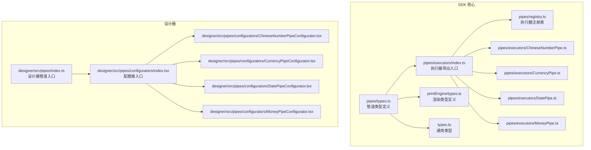
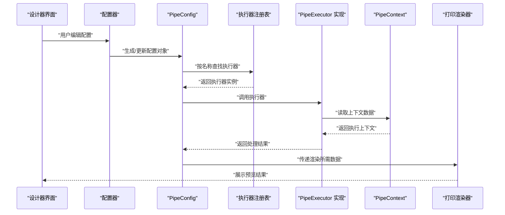
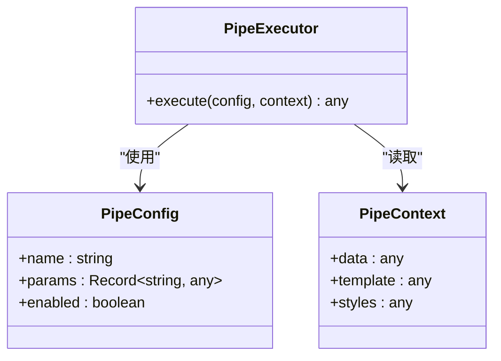
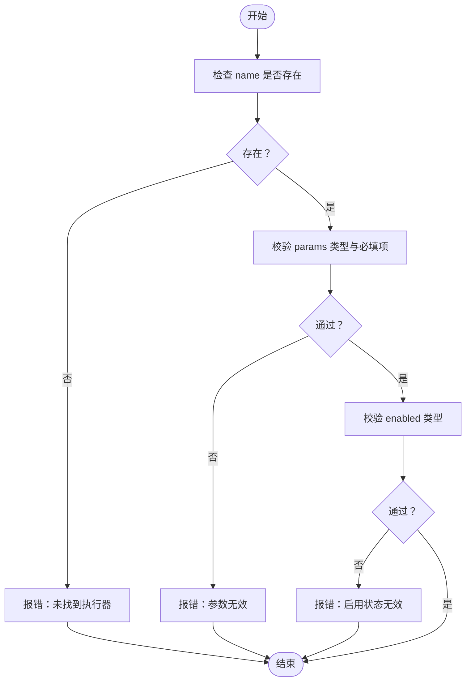
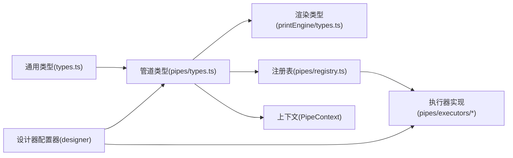

# 管道类型定义

<cite>
**本文引用的文件**
- [sdk/src/pipes/types.ts](file://sdk/src/pipes/types.ts)
- [sdk/src/printEngine/types.ts](file://sdk/src/printEngine/types.ts)
- [sdk/src/types.ts](file://sdk/src/types.ts)
- [sdk/src/pipes/registry.ts](file://sdk/src/pipes/registry.ts)
- [sdk/src/pipes/executors/index.ts](file://sdk/src/pipes/executors/index.ts)
- [sdk/src/pipes/executors/ChineseNumberPipe.ts](file://sdk/src/pipes/executors/ChineseNumberPipe.ts)
- [sdk/src/pipes/executors/CurrencyPipe.ts](file://sdk/src/pipes/executors/CurrencyPipe.ts)
- [sdk/src/pipes/executors/DatePipe.ts](file://sdk/src/pipes/executors/DatePipe.ts)
- [sdk/src/pipes/executors/MoneyPipe.ts](file://sdk/src/pipes/executors/MoneyPipe.ts)
- [designer/src/pipes/index.ts](file://designer/src/pipes/index.ts)
- [designer/src/pipes/configurators/index.tsx](file://designer/src/pipes/configurators/index.tsx)
- [designer/src/pipes/configurators/ChineseNumberPipeConfigurator.tsx](file://designer/src/pipes/configurators/ChineseNumberPipeConfigurator.tsx)
- [designer/src/pipes/configurators/CurrencyPipeConfigurator.tsx](file://designer/src/pipes/configurators/CurrencyPipeConfigurator.tsx)
- [designer/src/pipes/configurators/DatePipeConfigurator.tsx](file://designer/src/pipes/configurators/DatePipeConfigurator.tsx)
- [designer/src/pipes/configurators/MoneyPipeConfigurator.tsx](file://designer/src/pipes/configurators/MoneyPipeConfigurator.tsx)
</cite>

## 目录
1. [简介](#简介)
2. [项目结构](#项目结构)
3. [核心组件](#核心组件)
4. [架构总览](#架构总览)
5. [详细组件分析](#详细组件分析)
6. [依赖关系分析](#依赖关系分析)
7. [性能考量](#性能考量)
8. [故障排查指南](#故障排查指南)
9. [结论](#结论)
10. [附录](#附录)

## 简介
本文件面向数据管道类型系统，聚焦于管道执行器、管道配置与上下文等核心类型定义，系统化梳理接口规范、参数传递机制、配置数据结构与验证规则，并提供可扩展指南与安全兼容性建议。目标是帮助开发者在不深入源码细节的前提下，快速理解并正确使用管道类型系统。

## 项目结构
管道类型系统主要分布在 SDK 的 pipes 模块与 printEngine 模块中，同时设计器侧提供了可视化配置器以辅助配置与调试。整体结构如下：

图表来源
- [sdk/src/pipes/types.ts](file://sdk/src/pipes/types.ts)
- [sdk/src/pipes/executors/index.ts](file://sdk/src/pipes/executors/index.ts)
- [sdk/src/pipes/registry.ts](file://sdk/src/pipes/registry.ts)
- [sdk/src/printEngine/types.ts](file://sdk/src/printEngine/types.ts)
- [sdk/src/types.ts](file://sdk/src/types.ts)
- [designer/src/pipes/index.ts](file://designer/src/pipes/index.ts)
- [designer/src/pipes/configurators/index.tsx](file://designer/src/pipes/configurators/index.tsx)

章节来源
- [sdk/src/pipes/types.ts](file://sdk/src/pipes/types.ts)
- [sdk/src/printEngine/types.ts](file://sdk/src/printEngine/types.ts)
- [sdk/src/types.ts](file://sdk/src/types.ts)
- [sdk/src/pipes/registry.ts](file://sdk/src/pipes/registry.ts)
- [sdk/src/pipes/executors/index.ts](file://sdk/src/pipes/executors/index.ts)
- [designer/src/pipes/index.ts](file://designer/src/pipes/index.ts)
- [designer/src/pipes/configurators/index.tsx](file://designer/src/pipes/configurators/index.tsx)

## 核心组件
本节对管道类型系统的关键类型进行分层说明：基础类型、管道执行器接口、管道配置与上下文、以及渲染相关类型。

- 基础类型（通用）
  - 定义了通用的字符串、数字、布尔、对象等基础类型别名，用于统一数据处理与校验。
  - 参考路径：[sdk/src/types.ts](file://sdk/src/types.ts)

- 管道类型（pipes/types.ts）
  - PipeExecutor：管道执行器接口，定义统一的执行签名与上下文交互方式。
  - PipeConfig：管道配置的数据结构，包含执行器标识、参数字典、启用状态等字段。
  - PipeContext：管道执行上下文，承载当前执行所需的环境信息（如数据源、模板、样式等）。
  - 参考路径：
    - [sdk/src/pipes/types.ts](file://sdk/src/pipes/types.ts)

- 渲染类型（printEngine/types.ts）
  - 定义打印引擎渲染阶段使用的类型，如渲染器接口、元素类型、样式构建等。
  - 参考路径：[sdk/src/printEngine/types.ts](file://sdk/src/printEngine/types.ts)

- 执行器注册表（pipes/registry.ts）
  - 提供执行器的注册与查找机制，确保按名称解析到具体执行器实现。
  - 参考路径：[sdk/src/pipes/registry.ts](file://sdk/src/pipes/registry.ts)

- 执行器实现（pipes/executors/*）
  - 包含多种内置执行器，如中文大写金额、货币格式化、日期格式化、金额格式化等。
  - 参考路径：
    - [sdk/src/pipes/executors/ChineseNumberPipe.ts](file://sdk/src/pipes/executors/ChineseNumberPipe.ts)
    - [sdk/src/pipes/executors/CurrencyPipe.ts](file://sdk/src/pipes/executors/CurrencyPipe.ts)
    - [sdk/src/pipes/executors/DatePipe.ts](file://sdk/src/pipes/executors/DatePipe.ts)
    - [sdk/src/pipes/executors/MoneyPipe.ts](file://sdk/src/pipes/executors/MoneyPipe.ts)

- 设计器集成（designer/src/pipes/*）
  - 提供可视化配置器，用于在设计器中编辑管道配置并实时预览效果。
  - 参考路径：
    - [designer/src/pipes/index.ts](file://designer/src/pipes/index.ts)
    - [designer/src/pipes/configurators/index.tsx](file://designer/src/pipes/configurators/index.tsx)
    - [designer/src/pipes/configurators/ChineseNumberPipeConfigurator.tsx](file://designer/src/pipes/configurators/ChineseNumberPipeConfigurator.tsx)
    - [designer/src/pipes/configurators/CurrencyPipeConfigurator.tsx](file://designer/src/pipes/configurators/CurrencyPipeConfigurator.tsx)
    - [designer/src/pipes/configurators/DatePipeConfigurator.tsx](file://designer/src/pipes/configurators/DatePipeConfigurator.tsx)
    - [designer/src/pipes/configurators/MoneyPipeConfigurator.tsx](file://designer/src/pipes/configurators/MoneyPipeConfigurator.tsx)

章节来源
- [sdk/src/types.ts](file://sdk/src/types.ts)
- [sdk/src/pipes/types.ts](file://sdk/src/pipes/types.ts)
- [sdk/src/printEngine/types.ts](file://sdk/src/printEngine/types.ts)
- [sdk/src/pipes/registry.ts](file://sdk/src/pipes/registry.ts)
- [sdk/src/pipes/executors/ChineseNumberPipe.ts](file://sdk/src/pipes/executors/ChineseNumberPipe.ts)
- [sdk/src/pipes/executors/CurrencyPipe.ts](file://sdk/src/pipes/executors/CurrencyPipe.ts)
- [sdk/src/pipes/executors/DatePipe.ts](file://sdk/src/pipes/executors/DatePipe.ts)
- [sdk/src/pipes/executors/MoneyPipe.ts](file://sdk/src/pipes/executors/MoneyPipe.ts)
- [designer/src/pipes/index.ts](file://designer/src/pipes/index.ts)
- [designer/src/pipes/configurators/index.tsx](file://designer/src/pipes/configurators/index.tsx)
- [designer/src/pipes/configurators/ChineseNumberPipeConfigurator.tsx](file://designer/src/pipes/configurators/ChineseNumberPipeConfigurator.tsx)
- [designer/src/pipes/configurators/CurrencyPipeConfigurator.tsx](file://designer/src/pipes/configurators/CurrencyPipeConfigurator.tsx)
- [designer/src/pipes/configurators/DatePipeConfigurator.tsx](file://designer/src/pipes/configurators/DatePipeConfigurator.tsx)
- [designer/src/pipes/configurators/MoneyPipeConfigurator.tsx](file://designer/src/pipes/configurators/MoneyPipeConfigurator.tsx)

## 架构总览
下图展示了从“配置输入”到“执行器执行”再到“渲染输出”的完整流程，以及设计器如何参与配置与校验。

图表来源
- [sdk/src/pipes/types.ts](file://sdk/src/pipes/types.ts)
- [sdk/src/pipes/registry.ts](file://sdk/src/pipes/registry.ts)
- [sdk/src/pipes/executors/index.ts](file://sdk/src/pipes/executors/index.ts)
- [sdk/src/printEngine/types.ts](file://sdk/src/printEngine/types.ts)
- [designer/src/pipes/configurators/index.tsx](file://designer/src/pipes/configurators/index.tsx)

## 详细组件分析

### 管道执行器接口规范（PipeExecutor）
- 职责
  - 统一的执行签名，接收配置与上下文，返回处理后的值或错误。
  - 通过注册表按名称解析，避免硬编码分支。
- 关键点
  - 输入：PipeConfig、PipeContext
  - 输出：处理结果（类型由具体执行器定义）
  - 错误：抛出或返回错误对象，便于上层捕获与提示
- 参考路径
  - [sdk/src/pipes/types.ts](file://sdk/src/pipes/types.ts)
  - [sdk/src/pipes/registry.ts](file://sdk/src/pipes/registry.ts)

图表来源
- [sdk/src/pipes/types.ts](file://sdk/src/pipes/types.ts)

章节来源
- [sdk/src/pipes/types.ts](file://sdk/src/pipes/types.ts)
- [sdk/src/pipes/registry.ts](file://sdk/src/pipes/registry.ts)

### 管道配置数据结构与验证规则（PipeConfig）
- 数据结构
  - name：执行器名称（需与注册表一致）
  - params：参数字典（键值对），用于向执行器传递运行时参数
  - enabled：是否启用该管道
- 验证规则
  - name 必填且非空；若不存在对应执行器，应报错
  - params 类型必须为对象；各执行器可自定义必填参数
  - enabled 必须为布尔值
- 参考路径
  - [sdk/src/pipes/types.ts](file://sdk/src/pipes/types.ts)

图表来源
- [sdk/src/pipes/types.ts](file://sdk/src/pipes/types.ts)

章节来源
- [sdk/src/pipes/types.ts](file://sdk/src/pipes/types.ts)

### 管道上下文（PipeContext）
- 职责
  - 提供执行器所需的运行时环境数据，如原始数据、模板片段、样式信息等
- 结构要点
  - data：当前处理的数据对象
  - template：模板上下文（如页面、区域等）
  - styles：样式上下文（如主题、字号、颜色等）
- 参考路径
  - [sdk/src/pipes/types.ts](file://sdk/src/pipes/types.ts)

章节来源
- [sdk/src/pipes/types.ts](file://sdk/src/pipes/types.ts)

### 执行器注册表（Registry）
- 职责
  - 将执行器名称映射到具体实现，支持动态查找与扩展
- 行为
  - 注册：新增执行器实现
  - 查找：根据名称返回执行器实例
  - 错误：未找到时抛出异常
- 参考路径
  - [sdk/src/pipes/registry.ts](file://sdk/src/pipes/registry.ts)

章节来源
- [sdk/src/pipes/registry.ts](file://sdk/src/pipes/registry.ts)

### 内置执行器（示例）
- 中文大写金额（ChineseNumberPipe）
  - 功能：将阿拉伯数字转换为中文大写金额格式
  - 参数：可能包含精度、单位等
  - 参考路径：[sdk/src/pipes/executors/ChineseNumberPipe.ts](file://sdk/src/pipes/executors/ChineseNumberPipe.ts)
- 货币格式化（CurrencyPipe）
  - 功能：按地区/货币符号格式化数值
  - 参数：货币代码、小数位、分隔符等
  - 参考路径：[sdk/src/pipes/executors/CurrencyPipe.ts](file://sdk/src/pipes/executors/CurrencyPipe.ts)
- 日期格式化（DatePipe）
  - 功能：将日期时间转换为指定格式字符串
  - 参数：格式模板、时区、语言等
  - 参考路径：[sdk/src/pipes/executors/DatePipe.ts](file://sdk/src/pipes/executors/DatePipe.ts)
- 金额格式化（MoneyPipe）
  - 功能：将数值格式化为金额显示（整数/小数分离）
  - 参数：千分位分隔符、小数位、正负号样式等
  - 参考路径：[sdk/src/pipes/executors/MoneyPipe.ts](file://sdk/src/pipes/executors/MoneyPipe.ts)

章节来源
- [sdk/src/pipes/executors/ChineseNumberPipe.ts](file://sdk/src/pipes/executors/ChineseNumberPipe.ts)
- [sdk/src/pipes/executors/CurrencyPipe.ts](file://sdk/src/pipes/executors/CurrencyPipe.ts)
- [sdk/src/pipes/executors/DatePipe.ts](file://sdk/src/pipes/executors/DatePipe.ts)
- [sdk/src/pipes/executors/MoneyPipe.ts](file://sdk/src/pipes/executors/MoneyPipe.ts)

### 设计器配置器（Designer Configurators）
- 职责
  - 在设计器中提供可视化的配置界面，绑定 PipeConfig 的参数字段
- 交互
  - 用户输入参数后，生成/更新 PipeConfig
  - 支持参数联动与实时预览
- 参考路径：
  - [designer/src/pipes/configurators/index.tsx](file://designer/src/pipes/configurators/index.tsx)
  - [designer/src/pipes/configurators/ChineseNumberPipeConfigurator.tsx](file://designer/src/pipes/configurators/ChineseNumberPipeConfigurator.tsx)
  - [designer/src/pipes/configurators/CurrencyPipeConfigurator.tsx](file://designer/src/pipes/configurators/CurrencyPipeConfigurator.tsx)
  - [designer/src/pipes/configurators/DatePipeConfigurator.tsx](file://designer/src/pipes/configurators/DatePipeConfigurator.tsx)
  - [designer/src/pipes/configurators/MoneyPipeConfigurator.tsx](file://designer/src/pipes/configurators/MoneyPipeConfigurator.tsx)

章节来源
- [designer/src/pipes/configurators/index.tsx](file://designer/src/pipes/configurators/index.tsx)
- [designer/src/pipes/configurators/ChineseNumberPipeConfigurator.tsx](file://designer/src/pipes/configurators/ChineseNumberPipeConfigurator.tsx)
- [designer/src/pipes/configurators/CurrencyPipeConfigurator.tsx](file://designer/src/pipes/configurators/CurrencyPipeConfigurator.tsx)
- [designer/src/pipes/configurators/DatePipeConfigurator.tsx](file://designer/src/pipes/configurators/DatePipeConfigurator.tsx)
- [designer/src/pipes/configurators/MoneyPipeConfigurator.tsx](file://designer/src/pipes/configurators/MoneyPipeConfigurator.tsx)

## 依赖关系分析
- 类型依赖
  - pipes/types.ts 依赖 printEngine/types.ts 与通用 types.ts
  - 执行器实现依赖 pipes/types.ts 的接口定义
- 运行时依赖
  - PipeConfig 通过注册表解析到具体执行器
  - 执行器读取 PipeContext 获取运行时数据
- 设计器依赖
  - 设计器配置器读取/写入 PipeConfig，并驱动预览渲染

图表来源
- [sdk/src/types.ts](file://sdk/src/types.ts)
- [sdk/src/pipes/types.ts](file://sdk/src/pipes/types.ts)
- [sdk/src/printEngine/types.ts](file://sdk/src/printEngine/types.ts)
- [sdk/src/pipes/registry.ts](file://sdk/src/pipes/registry.ts)
- [sdk/src/pipes/executors/index.ts](file://sdk/src/pipes/executors/index.ts)
- [designer/src/pipes/configurators/index.tsx](file://designer/src/pipes/configurators/index.tsx)

章节来源
- [sdk/src/types.ts](file://sdk/src/types.ts)
- [sdk/src/pipes/types.ts](file://sdk/src/pipes/types.ts)
- [sdk/src/printEngine/types.ts](file://sdk/src/printEngine/types.ts)
- [sdk/src/pipes/registry.ts](file://sdk/src/pipes/registry.ts)
- [sdk/src/pipes/executors/index.ts](file://sdk/src/pipes/executors/index.ts)
- [designer/src/pipes/configurators/index.tsx](file://designer/src/pipes/configurators/index.tsx)

## 性能考量
- 执行器复用
  - 尽量避免在执行器内部重复创建昂贵对象，可在构造时初始化并缓存
- 参数校验前置
  - 在配置阶段尽早校验参数，减少运行时失败重试成本
- 上下文最小化
  - 仅传递执行器需要的数据，避免上下文过大导致序列化/传输开销
- 并发与异步
  - 对于耗时操作建议采用异步执行并在 UI 层做节流/防抖
- 渲染优化
  - 利用设计器的增量更新与局部重绘，降低频繁全量刷新

## 故障排查指南
- 常见问题
  - 执行器名称不匹配：检查 PipeConfig.name 与注册表中的名称是否一致
  - 参数缺失或类型错误：核对 params 字段的键名与类型，必要时添加默认值
  - 启用状态异常：确认 enabled 为布尔值
- 排查步骤
  - 在设计器中打开配置器，逐项检查参数
  - 使用最小化配置复现问题，逐步增加复杂度定位根因
  - 查看执行器日志或错误信息，结合上下文数据定位问题点
- 参考路径
  - [sdk/src/pipes/types.ts](file://sdk/src/pipes/types.ts)
  - [sdk/src/pipes/registry.ts](file://sdk/src/pipes/registry.ts)

章节来源
- [sdk/src/pipes/types.ts](file://sdk/src/pipes/types.ts)
- [sdk/src/pipes/registry.ts](file://sdk/src/pipes/registry.ts)

## 结论
管道类型系统通过统一的接口、清晰的配置结构与上下文抽象，实现了可扩展、可配置、可预览的数据处理流水线。配合设计器的可视化配置器，开发者可以高效地构建与维护复杂的打印/渲染数据管道。遵循本文档的接口规范、验证规则与扩展指南，有助于提升系统的安全性与兼容性。

## 附录
- 使用示例（步骤级）
  - 步骤1：在设计器中选择目标组件，打开对应配置器
  - 步骤2：填写执行器名称与参数，保存配置
  - 步骤3：在渲染阶段，注册表解析执行器，执行器读取上下文并返回结果
  - 步骤4：渲染器消费结果并输出最终内容
- 扩展指南
  - 新增执行器：在执行器目录新增实现，导出并在注册表中注册
  - 新增配置器：在设计器配置器目录新增组件，绑定 PipeConfig 参数
  - 新增类型：在通用类型文件中补充新类型别名或接口
- 安全与兼容性
  - 安全：对输入参数进行白名单校验，避免注入；对执行器进行沙箱化或超时控制
  - 兼容：保持 PipeExecutor 接口稳定；对新增参数提供默认值；版本化配置结构