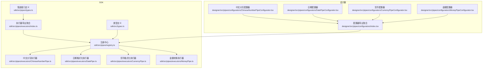
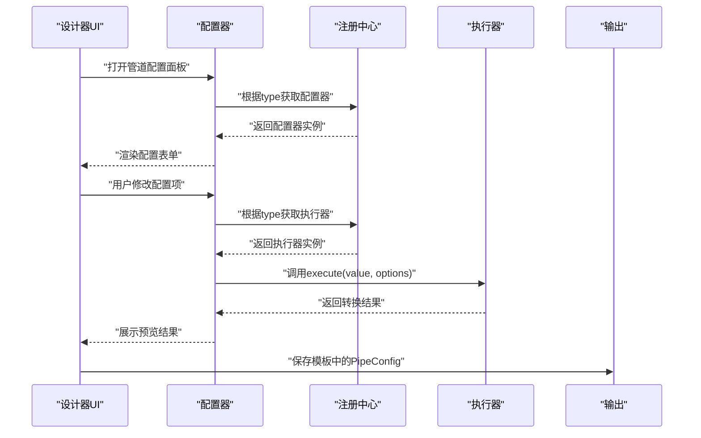
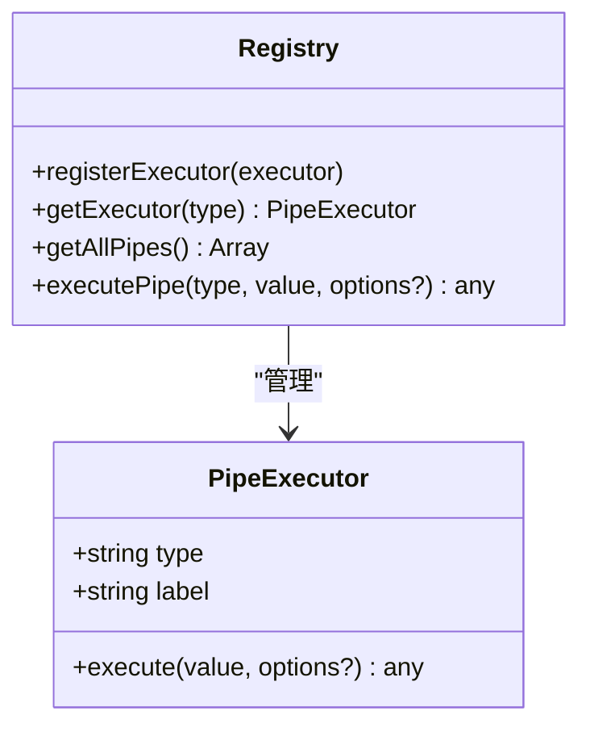
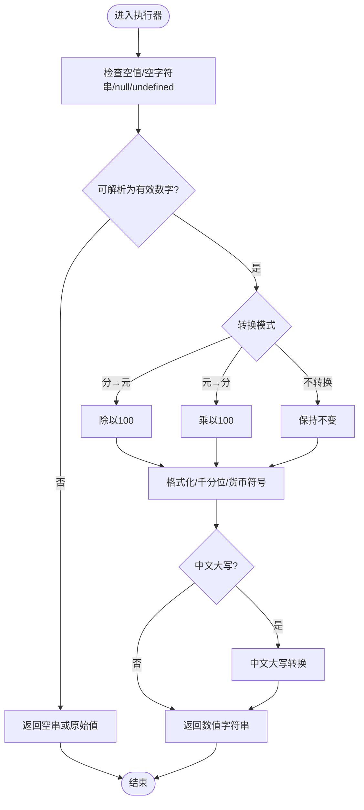
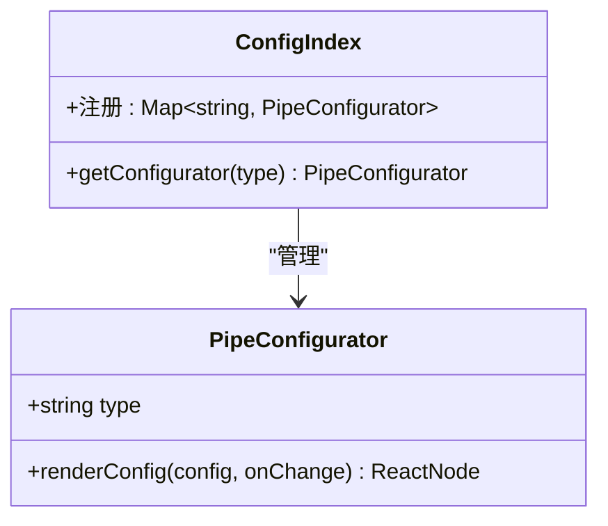
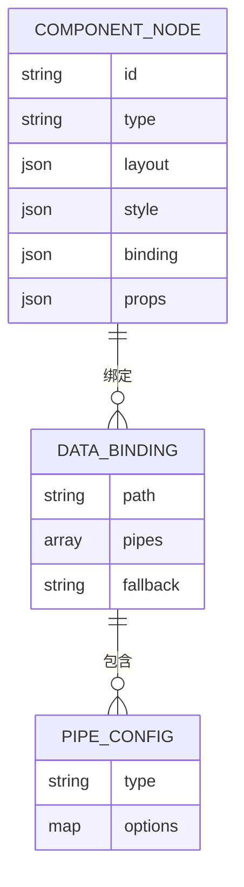
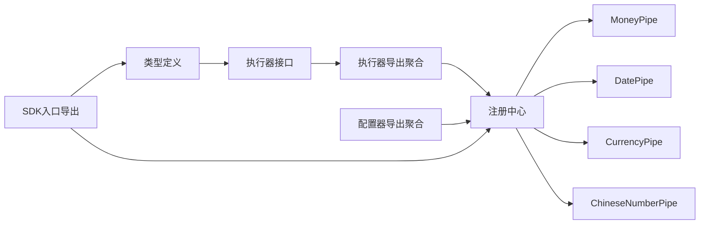

# 自定义管道开发指南

<cite>
**本文档引用的文件**
- [sdk/src/pipes/types.ts](file://sdk/src/pipes/types.ts)
- [sdk/src/pipes/registry.ts](file://sdk/src/pipes/registry.ts)
- [sdk/src/pipes/executors/index.ts](file://sdk/src/pipes/executors/index.ts)
- [sdk/src/pipes/executors/ChineseNumberPipe.ts](file://sdk/src/pipes/executors/ChineseNumberPipe.ts)
- [sdk/src/pipes/executors/DatePipe.ts](file://sdk/src/pipes/executors/DatePipe.ts)
- [sdk/src/pipes/executors/CurrencyPipe.ts](file://sdk/src/pipes/executors/CurrencyPipe.ts)
- [sdk/src/pipes/executors/MoneyPipe.ts](file://sdk/src/pipes/executors/MoneyPipe.ts)
- [designer/src/pipes/configurators/index.tsx](file://designer/src/pipes/configurators/index.tsx)
- [designer/src/pipes/configurators/ChineseNumberPipeConfigurator.tsx](file://designer/src/pipes/configurators/ChineseNumberPipeConfigurator.tsx)
- [designer/src/pipes/configurators/DatePipeConfigurator.tsx](file://designer/src/pipes/configurators/DatePipeConfigurator.tsx)
- [designer/src/pipes/configurators/CurrencyPipeConfigurator.tsx](file://designer/src/pipes/configurators/CurrencyPipeConfigurator.tsx)
- [designer/src/pipes/configurators/MoneyPipeConfigurator.tsx](file://designer/src/pipes/configurators/MoneyPipeConfigurator.tsx)
- [sdk/src/types.ts](file://sdk/src/types.ts)
- [sdk/src/index.ts](file://sdk/src/index.ts)
- [package.json](file://package.json)
</cite>

## 目录
1. [简介](#简介)
2. [项目结构](#项目结构)
3. [核心组件](#核心组件)
4. [架构总览](#架构总览)
5. [详细组件分析](#详细组件分析)
6. [依赖关系分析](#依赖关系分析)
7. [性能考虑](#性能考虑)
8. [故障排查指南](#故障排查指南)
9. [结论](#结论)
10. [附录](#附录)

## 简介
本指南面向需要在打印模板系统中开发自定义数据管道的工程师与设计师。文档覆盖从接口实现、注册机制、配置器开发，到测试方法、最佳实践、性能优化、错误处理策略、配置标准化与验证规则，以及发布与版本管理的全流程。读者将能够基于现有内置管道与配置器，快速扩展新的管道执行器与可视化配置器，并将其安全地集成到设计器与运行时环境。

## 项目结构
打印SDK采用“执行器 + 配置器”的双层设计：
- 执行器（后端/纯函数）：负责实际的数据转换逻辑，位于执行器目录。
- 配置器（前端/UI）：负责渲染配置界面，收集用户输入并更新管道配置，位于配置器目录。
- 注册中心：统一注册与检索执行器与配置器，保证类型安全与可发现性。
- 类型系统：统一定义管道配置、数据绑定、组件节点等核心类型。

**图表来源**
- [sdk/src/pipes/types.ts:1-30](file://sdk/src/pipes/types.ts#L1-L30)
- [sdk/src/pipes/registry.ts:1-65](file://sdk/src/pipes/registry.ts#L1-L65)
- [sdk/src/pipes/executors/index.ts:1-45](file://sdk/src/pipes/executors/index.ts#L1-L45)
- [sdk/src/pipes/executors/ChineseNumberPipe.ts:1-138](file://sdk/src/pipes/executors/ChineseNumberPipe.ts#L1-L138)
- [sdk/src/pipes/executors/DatePipe.ts:1-35](file://sdk/src/pipes/executors/DatePipe.ts#L1-L35)
- [sdk/src/pipes/executors/CurrencyPipe.ts:1-17](file://sdk/src/pipes/executors/CurrencyPipe.ts#L1-L17)
- [sdk/src/pipes/executors/MoneyPipe.ts:1-130](file://sdk/src/pipes/executors/MoneyPipe.ts#L1-L130)
- [designer/src/pipes/configurators/index.tsx:1-85](file://designer/src/pipes/configurators/index.tsx#L1-L85)
- [designer/src/pipes/configurators/ChineseNumberPipeConfigurator.tsx:1-58](file://designer/src/pipes/configurators/ChineseNumberPipeConfigurator.tsx#L1-L58)
- [designer/src/pipes/configurators/DatePipeConfigurator.tsx:1-23](file://designer/src/pipes/configurators/DatePipeConfigurator.tsx#L1-L23)
- [designer/src/pipes/configurators/CurrencyPipeConfigurator.tsx:1-23](file://designer/src/pipes/configurators/CurrencyPipeConfigurator.tsx#L1-L23)
- [designer/src/pipes/configurators/MoneyPipeConfigurator.tsx:1-143](file://designer/src/pipes/configurators/MoneyPipeConfigurator.tsx#L1-L143)

**章节来源**
- [sdk/src/pipes/types.ts:1-30](file://sdk/src/pipes/types.ts#L1-L30)
- [sdk/src/pipes/registry.ts:1-65](file://sdk/src/pipes/registry.ts#L1-L65)
- [sdk/src/pipes/executors/index.ts:1-45](file://sdk/src/pipes/executors/index.ts#L1-L45)
- [designer/src/pipes/configurators/index.tsx:1-85](file://designer/src/pipes/configurators/index.tsx#L1-L85)

## 核心组件
- 管道执行器接口：定义 type、label 与 execute 方法，确保类型安全与可发现性。
- 注册中心：提供注册、查询、遍历与执行管道的核心能力。
- 执行器集合：内置多种执行器，涵盖日期、货币、金额、中文大写与常用字符串处理。
- 配置器接口：定义 UI 层的配置渲染与变更回调，配合设计器完成可视化配置。
- 类型系统：统一的 PipeConfig、DataBinding、ComponentNode 等类型，保障数据绑定与模板结构的一致性。

**章节来源**
- [sdk/src/pipes/types.ts:11-29](file://sdk/src/pipes/types.ts#L11-L29)
- [sdk/src/pipes/registry.ts:17-52](file://sdk/src/pipes/registry.ts#L17-L52)
- [sdk/src/pipes/executors/index.ts:6-44](file://sdk/src/pipes/executors/index.ts#L6-L44)
- [designer/src/pipes/configurators/index.tsx:17-20](file://designer/src/pipes/configurators/index.tsx#L17-L20)
- [sdk/src/types.ts:77-86](file://sdk/src/types.ts#L77-L86)

## 架构总览
管道系统遵循“类型驱动 + 注册中心 + 可插拔执行器 + 可视化配置器”的架构模式。执行器负责纯函数式的数据转换，配置器负责渲染配置界面并回填配置，注册中心统一管理两者，类型系统贯穿始终，确保编译期与运行期的安全性。

**图表来源**
- [sdk/src/pipes/registry.ts:24-52](file://sdk/src/pipes/registry.ts#L24-L52)
- [designer/src/pipes/configurators/index.tsx:82-84](file://designer/src/pipes/configurators/index.tsx#L82-L84)
- [sdk/src/pipes/executors/ChineseNumberPipe.ts:99-137](file://sdk/src/pipes/executors/ChineseNumberPipe.ts#L99-L137)

## 详细组件分析

### 管道执行器接口与注册中心
- 接口职责：type 唯一标识、label 用户可见名称、execute 执行转换。
- 注册中心：提供 registerExecutor/getExecutor/getAllPipes/executePipe 四大能力，内置初始化阶段注册所有内置执行器。
- 设计要点：Map 存储、未找到执行器时的降级策略（返回原始值并告警）、遍历生成下拉列表。

**图表来源**
- [sdk/src/pipes/types.ts:11-29](file://sdk/src/pipes/types.ts#L11-L29)
- [sdk/src/pipes/registry.ts:17-65](file://sdk/src/pipes/registry.ts#L17-L65)

**章节来源**
- [sdk/src/pipes/types.ts:11-29](file://sdk/src/pipes/types.ts#L11-L29)
- [sdk/src/pipes/registry.ts:17-65](file://sdk/src/pipes/registry.ts#L17-L65)

### 内置执行器详解
- 日期格式化：支持 YYYY、MM、DD、HH、mm、ss 占位符替换，非法日期回退为原始值。
- 货币格式化：支持符号与精度配置，缺省值安全。
- 金额转换：支持分/元互转、精度控制、千分位分隔、中文大写（含“整”与“零”规则）。
- 中文大写：支持纯中文大写与“原值+中文大写”两种模式，支持单位后缀与自定义连接符。

**图表来源**
- [sdk/src/pipes/executors/MoneyPipe.ts:63-129](file://sdk/src/pipes/executors/MoneyPipe.ts#L63-L129)

**章节来源**
- [sdk/src/pipes/executors/DatePipe.ts:11-34](file://sdk/src/pipes/executors/DatePipe.ts#L11-L34)
- [sdk/src/pipes/executors/CurrencyPipe.ts:11-16](file://sdk/src/pipes/executors/CurrencyPipe.ts#L11-L16)
- [sdk/src/pipes/executors/MoneyPipe.ts:59-129](file://sdk/src/pipes/executors/MoneyPipe.ts#L59-L129)
- [sdk/src/pipes/executors/ChineseNumberPipe.ts:99-137](file://sdk/src/pipes/executors/ChineseNumberPipe.ts#L99-L137)

### 配置器接口与内置配置器
- 配置器接口：type 对应执行器 type，renderConfig 根据当前配置渲染表单并回调 onChange(option, value)。
- 内置配置器：日期（格式字符串）、货币（符号）、金额（格式/模式/精度/符号/千分位/中文大写模式与连接符）、中文大写（模式/连接符/单位）。
- 设计要点：通过 Map 注册配置器，按 type 查找；UI 使用受控组件，onChange 同步更新配置。

**图表来源**
- [designer/src/pipes/configurators/index.tsx:17-20](file://designer/src/pipes/configurators/index.tsx#L17-L20)
- [designer/src/pipes/configurators/index.tsx:69-84](file://designer/src/pipes/configurators/index.tsx#L69-L84)

**章节来源**
- [designer/src/pipes/configurators/index.tsx:17-20](file://designer/src/pipes/configurators/index.tsx#L17-L20)
- [designer/src/pipes/configurators/index.tsx:69-84](file://designer/src/pipes/configurators/index.tsx#L69-L84)
- [designer/src/pipes/configurators/DatePipeConfigurator.tsx:9-22](file://designer/src/pipes/configurators/DatePipeConfigurator.tsx#L9-L22)
- [designer/src/pipes/configurators/CurrencyPipeConfigurator.tsx:9-22](file://designer/src/pipes/configurators/CurrencyPipeConfigurator.tsx#L9-L22)
- [designer/src/pipes/configurators/MoneyPipeConfigurator.tsx:9-142](file://designer/src/pipes/configurators/MoneyPipeConfigurator.tsx#L9-L142)
- [designer/src/pipes/configurators/ChineseNumberPipeConfigurator.tsx:11-57](file://designer/src/pipes/configurators/ChineseNumberPipeConfigurator.tsx#L11-L57)

### 类型系统与数据绑定
- PipeConfig：type + options，用于描述单个管道的配置。
- DataBinding：支持路径、管道链、回退值，形成“数据路径 + 多级管道”的表达式。
- ComponentNode：组件树节点，binding 字段承载数据绑定与管道链。
- 类型一致性：通过 Record<string, any> 传递 options，既灵活又可被上层校验约束。

**图表来源**
- [sdk/src/types.ts:77-86](file://sdk/src/types.ts#L77-L86)
- [sdk/src/types.ts:185-202](file://sdk/src/types.ts#L185-L202)

**章节来源**
- [sdk/src/types.ts:77-86](file://sdk/src/types.ts#L77-L86)
- [sdk/src/types.ts:185-202](file://sdk/src/types.ts#L185-L202)

## 依赖关系分析
- 执行器与注册中心：执行器通过导出聚合文件集中导出，注册中心在初始化时批量注册，降低耦合。
- 配置器与执行器：配置器通过 type 关联执行器，二者通过注册中心解耦。
- 类型系统：类型定义横跨执行器与配置器，确保两端一致。
- 导出入口：SDK 入口统一导出公共API与管道系统，便于外部使用。

**图表来源**
- [sdk/src/pipes/types.ts:11-29](file://sdk/src/pipes/types.ts#L11-L29)
- [sdk/src/pipes/executors/index.ts:6-10](file://sdk/src/pipes/executors/index.ts#L6-L10)
- [sdk/src/pipes/registry.ts:56-65](file://sdk/src/pipes/registry.ts#L56-L65)
- [designer/src/pipes/configurators/index.tsx](file://designer/src/pipes/configurators/index.tsx#L12)
- [sdk/src/index.ts:12-15](file://sdk/src/index.ts#L12-L15)

**章节来源**
- [sdk/src/pipes/executors/index.ts:6-10](file://sdk/src/pipes/executors/index.ts#L6-L10)
- [sdk/src/pipes/registry.ts:56-65](file://sdk/src/pipes/registry.ts#L56-L65)
- [designer/src/pipes/configurators/index.tsx](file://designer/src/pipes/configurators/index.tsx#L12)
- [sdk/src/index.ts:12-15](file://sdk/src/index.ts#L12-L15)

## 性能考虑
- 执行器幂等与无副作用：避免在 execute 中产生外部状态变化，确保可缓存与可并行。
- 选项参数最小化：尽量使用必要选项，减少分支判断与字符串替换开销。
- 数值计算稳定性：金额类建议使用高精度库，避免浮点误差；格式化操作尽量一次性完成。
- 配置器轻量渲染：配置器仅渲染必要表单项，避免复杂状态与深层嵌套。
- 注册中心常驻内存：执行器与配置器注册一次即可反复使用，避免重复注册带来的开销。

## 故障排查指南
- 执行器未找到：注册中心在未找到执行器时会告警并回退为原始值，检查 type 是否正确、是否已注册。
- 非法输入：执行器对空值、空字符串、null/undefined、NaN、无穷大进行显式处理，必要时返回空串或原值。
- 错误捕获：执行器内部使用 try/catch 包裹复杂逻辑，异常时记录日志并回退，避免中断渲染。
- 配置器联动：中文大写与金额配置器存在条件渲染与联动逻辑，检查 onChange 的键名与默认值是否匹配。

**章节来源**
- [sdk/src/pipes/registry.ts:45-52](file://sdk/src/pipes/registry.ts#L45-L52)
- [sdk/src/pipes/executors/ChineseNumberPipe.ts:104-136](file://sdk/src/pipes/executors/ChineseNumberPipe.ts#L104-L136)
- [sdk/src/pipes/executors/MoneyPipe.ts:124-128](file://sdk/src/pipes/executors/MoneyPipe.ts#L124-L128)
- [designer/src/pipes/configurators/ChineseNumberPipeConfigurator.tsx:32-43](file://designer/src/pipes/configurators/ChineseNumberPipeConfigurator.tsx#L32-L43)
- [designer/src/pipes/configurators/MoneyPipeConfigurator.tsx:66-97](file://designer/src/pipes/configurators/MoneyPipeConfigurator.tsx#L66-L97)

## 结论
通过统一的接口、注册中心与类型系统，打印SDK实现了“可插拔”的数据管道体系。开发者可以基于现有执行器与配置器快速扩展新管道，同时保持与设计器与运行时的无缝衔接。遵循本文档的实现规范、测试方法与最佳实践，将有助于构建稳定、可维护、高性能的自定义管道。

## 附录

### 自定义管道开发步骤
- 实现执行器
  - 定义类型与标签，实现 execute(value, options?)。
  - 在执行器导出聚合文件中导出新执行器。
  - 在注册中心初始化处注册新执行器。
  - 参考路径：[sdk/src/pipes/executors/index.ts:6-10](file://sdk/src/pipes/executors/index.ts#L6-L10)，[sdk/src/pipes/registry.ts:56-65](file://sdk/src/pipes/registry.ts#L56-L65)
- 开发配置器
  - 实现 PipeConfigurator 接口，renderConfig 根据 options 渲染表单。
  - 在配置器导出聚合文件中导出并注册新配置器。
  - 参考路径：[designer/src/pipes/configurators/index.tsx](file://designer/src/pipes/configurators/index.tsx#L12)，[designer/src/pipes/configurators/index.tsx:69-84](file://designer/src/pipes/configurators/index.tsx#L69-L84)
- 测试方法
  - 单元测试：针对 execute 的边界条件（空值、非法输入、异常）编写用例。
  - 集成测试：在设计器中配置新管道，验证 UI 渲染与预览效果。
  - 参考路径：[sdk/src/pipes/executors/ChineseNumberPipe.ts:104-136](file://sdk/src/pipes/executors/ChineseNumberPipe.ts#L104-L136)，[sdk/src/pipes/executors/MoneyPipe.ts:124-128](file://sdk/src/pipes/executors/MoneyPipe.ts#L124-L128)
- 发布与版本管理
  - 使用包管理脚本构建与发布：参见根目录脚本与包配置。
  - 版本号遵循语义化版本，新增管道建议主版本或次版本升级，破坏性变更才做主版本。
  - 参考路径：[package.json:4-8](file://package.json#L4-L8)，[sdk/src/index.ts:12-15](file://sdk/src/index.ts#L12-L15)

### 管道配置标准化与验证规则
- PipeConfig 标准结构
  - type：字符串，唯一标识执行器。
  - options：对象，键值对形式，具体键由执行器定义。
- 验证规则
  - 必填：type。
  - 可选：options，键名需与执行器期望一致；值类型需满足执行器要求。
  - 回退：当执行器无法处理时，应返回空串或原始值并记录日志。
- 参考路径：[sdk/src/types.ts:77-86](file://sdk/src/types.ts#L77-L86)，[sdk/src/pipes/registry.ts:45-52](file://sdk/src/pipes/registry.ts#L45-L52)