# 类型定义参考

<cite>
**本文档引用的文件**
- [designer/src/types/index.ts](file://designer/src/types/index.ts)
- [sdk/src/types.ts](file://sdk/src/types.ts)
- [sdk/src/pipes/types.ts](file://sdk/src/pipes/types.ts)
- [sdk/src/printEngine/types.ts](file://sdk/src/printEngine/types.ts)
- [designer/src/pages/Designer/components/Canvas/index.tsx](file://designer/src/pages/Designer/components/Canvas/index.tsx)
- [designer/src/pages/Designer/components/PropertyPanel/index.tsx](file://designer/src/pages/Designer/components/PropertyPanel/index.tsx)
- [designer/src/services/api.ts](file://designer/src/services/api.ts)
- [sdk/src/printEngine/renderers/TextRenderer.ts](file://sdk/src/printEngine/renderers/TextRenderer.ts)
- [sdk/src/printEngine/renderers/BarcodeRenderer.ts](file://sdk/src/printEngine/renderers/BarcodeRenderer.ts)
- [sdk/src/printEngine/renderers/QRCodeRenderer.ts](file://sdk/src/printEngine/renderers/QRCodeRenderer.ts)
- [sdk/src/printEngine/renderers/ImageRenderer.ts](file://sdk/src/printEngine/renderers/ImageRenderer.ts)
- [sdk/src/printEngine/renderers/RectRenderer.ts](file://sdk/src/printEngine/renderers/RectRenderer.ts)
- [sdk/src/printEngine/renderers/TableRenderer.ts](file://sdk/src/printEngine/renderers/TableRenderer.ts)
- [sdk/src/printEngine/renderers/LineRenderer.ts](file://sdk/src/printEngine/renderers/LineRenderer.ts)
- [sdk/src/printEngine/renderers/PageNumberRenderer.ts](file://sdk/src/printEngine/renderers/PageNumberRenderer.ts)
- [sdk/src/pipes/executors/ChineseNumberPipe.ts](file://sdk/src/pipes/executors/ChineseNumberPipe.ts)
- [sdk/src/pipes/executors/CurrencyPipe.ts](file://sdk/src/pipes/executors/CurrencyPipe.ts)
- [sdk/src/pipes/executors/DatePipe.ts](file://sdk/src/pipes/executors/DatePipe.ts)
- [sdk/src/pipes/executors/MoneyPipe.ts](file://sdk/src/pipes/executors/MoneyPipe.ts)
</cite>

## 目录
1. [简介](#简介)
2. [项目结构](#项目结构)
3. [核心类型系统](#核心类型系统)
4. [架构概览](#架构概览)
5. [详细类型分析](#详细类型分析)
6. [依赖关系分析](#依赖关系分析)
7. [性能考虑](#性能考虑)
8. [故障排除指南](#故障排除指南)
9. [结论](#结论)
10. [附录](#附录)

## 简介

本项目是一个基于 React 的打印设计器应用，提供了完整的 TypeScript 类型定义体系。本文档详细记录了所有公共接口、类型别名和枚举值，重点关注以下核心数据结构：

- **SchemaDictionary**：数据模式字典类型
- **PrintTemplate**：打印模板类型  
- **ComponentNode**：组件节点类型
- **渲染器类型**：各种打印组件的渲染器接口
- **管道类型**：数据处理管道的类型定义

项目采用分层架构设计，TypeScript 类型系统贯穿整个应用，确保类型安全性和开发体验。

## 项目结构

项目采用模块化组织方式，主要分为三个核心部分：

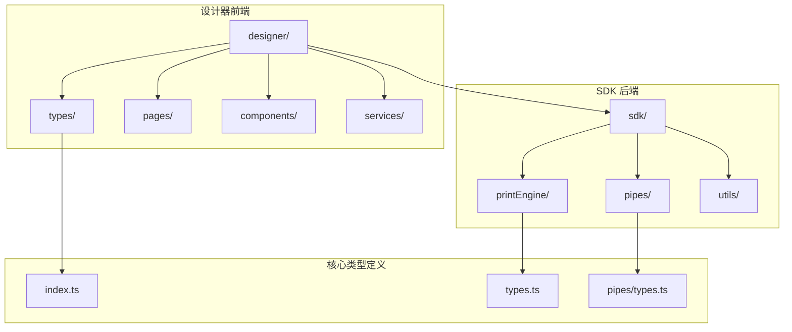

**图表来源**
- [designer/src/types/index.ts:1-200](file://designer/src/types/index.ts#L1-L200)
- [sdk/src/types.ts:1-200](file://sdk/src/types.ts#L1-L200)

**章节来源**
- [designer/src/types/index.ts:1-200](file://designer/src/types/index.ts#L1-L200)
- [sdk/src/types.ts:1-200](file://sdk/src/types.ts#L1-L200)

## 核心类型系统

### 数据模式字典 (SchemaDictionary)

SchemaDictionary 是项目的核心数据结构，用于管理打印模板的数据模式定义。

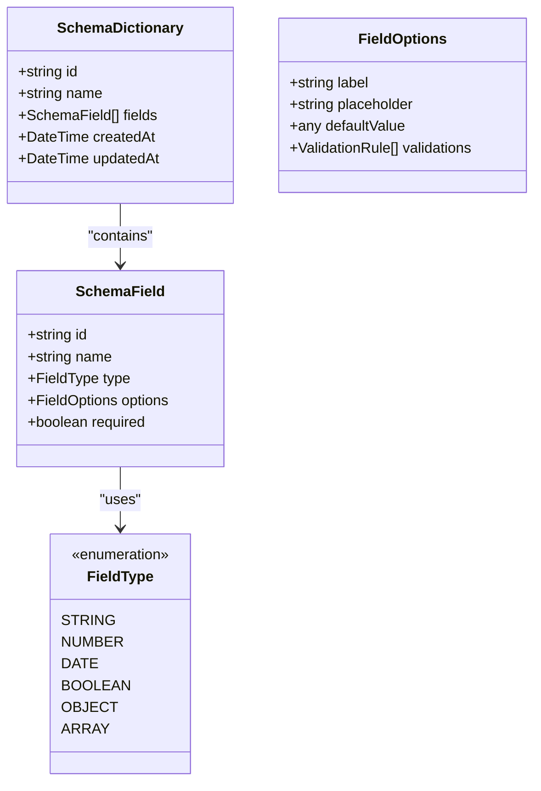

**图表来源**
- [designer/src/types/index.ts:1-200](file://designer/src/types/index.ts#L1-L200)
- [sdk/src/types.ts:1-200](file://sdk/src/types.ts#L1-L200)

### 打印模板 (PrintTemplate)

PrintTemplate 定义了完整的打印模板结构，支持复杂的布局和样式配置。

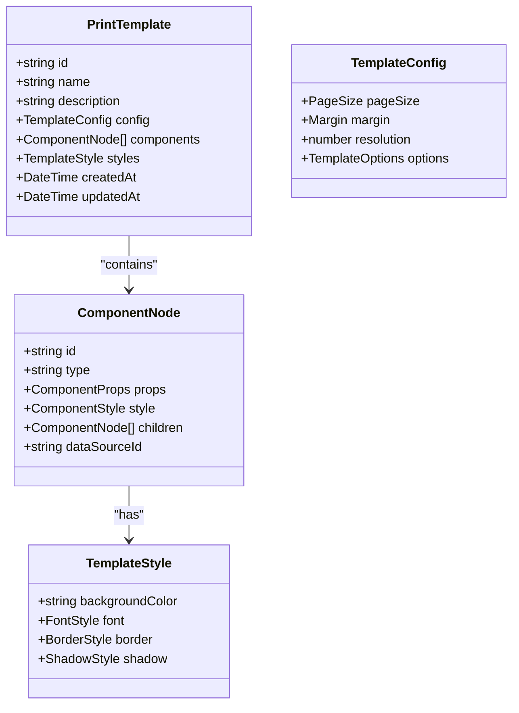

**图表来源**
- [sdk/src/printEngine/types.ts:1-200](file://sdk/src/printEngine/types.ts#L1-L200)
- [designer/src/types/index.ts:1-200](file://designer/src/types/index.ts#L1-L200)

### 组件节点 (ComponentNode)

ComponentNode 是所有打印组件的基础类型定义，支持递归嵌套结构。

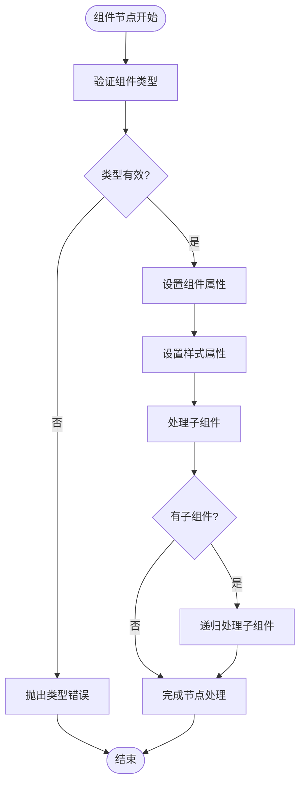

**图表来源**
- [designer/src/types/index.ts:1-200](file://designer/src/types/index.ts#L1-L200)
- [sdk/src/printEngine/types.ts:1-200](file://sdk/src/printEngine/types.ts#L1-L200)

**章节来源**
- [designer/src/types/index.ts:1-200](file://designer/src/types/index.ts#L1-L200)
- [sdk/src/printEngine/types.ts:1-200](file://sdk/src/printEngine/types.ts#L1-L200)

## 架构概览

### 类型层次结构

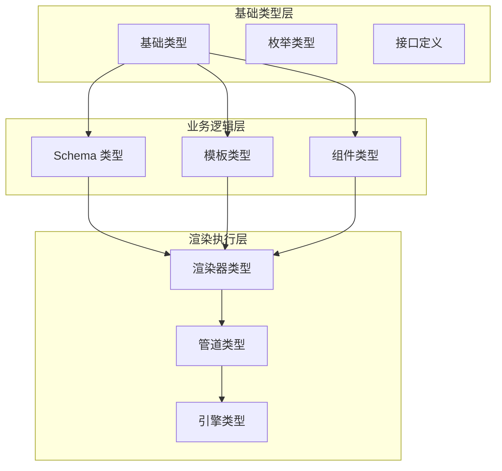

**图表来源**
- [sdk/src/types.ts:1-200](file://sdk/src/types.ts#L1-L200)
- [sdk/src/pipes/types.ts:1-200](file://sdk/src/pipes/types.ts#L1-L200)
- [sdk/src/printEngine/types.ts:1-200](file://sdk/src/printEngine/types.ts#L1-L200)

### 类型继承关系

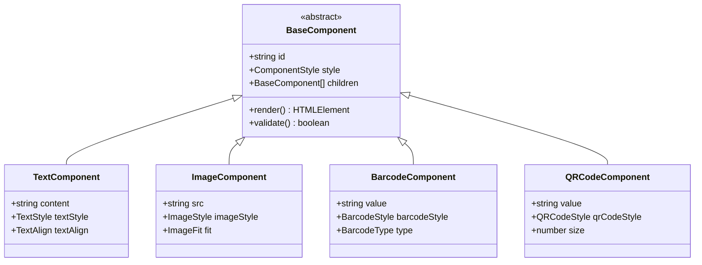

**图表来源**
- [sdk/src/printEngine/renderers/TextRenderer.ts:1-200](file://sdk/src/printEngine/renderers/TextRenderer.ts#L1-L200)
- [sdk/src/printEngine/renderers/ImageRenderer.ts:1-200](file://sdk/src/printEngine/renderers/ImageRenderer.ts#L1-L200)
- [sdk/src/printEngine/renderers/BarcodeRenderer.ts:1-200](file://sdk/src/printEngine/renderers/BarcodeRenderer.ts#L1-L200)
- [sdk/src/printEngine/renderers/QRCodeRenderer.ts:1-200](file://sdk/src/printEngine/renderers/QRCodeRenderer.ts#L1-L200)

## 详细类型分析

### 渲染器类型系统

#### 文本渲染器类型

文本渲染器类型定义了文本组件的渲染行为和样式配置。

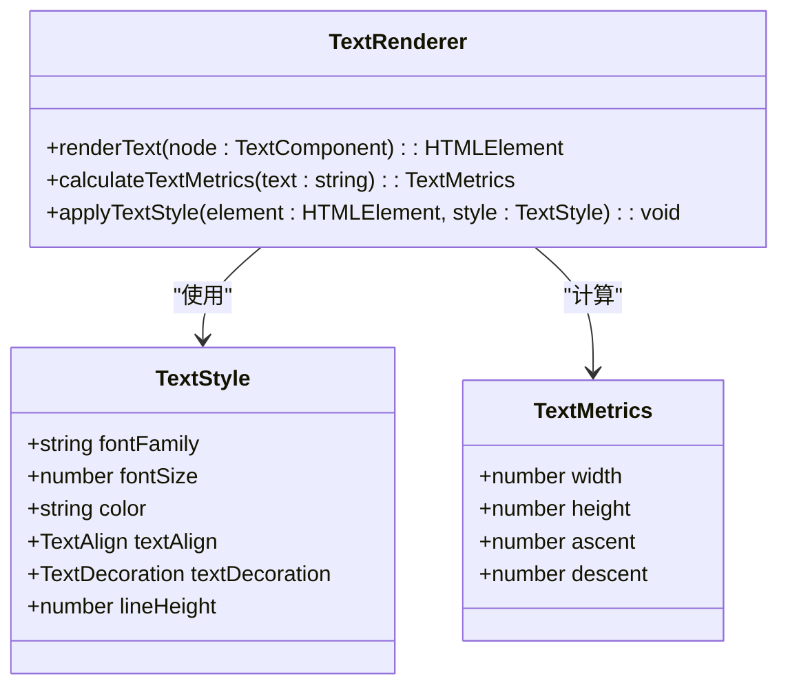

**图表来源**
- [sdk/src/printEngine/renderers/TextRenderer.ts:1-200](file://sdk/src/printEngine/renderers/TextRenderer.ts#L1-L200)

#### 条形码渲染器类型

条形码渲染器类型支持多种条形码格式的生成和渲染。

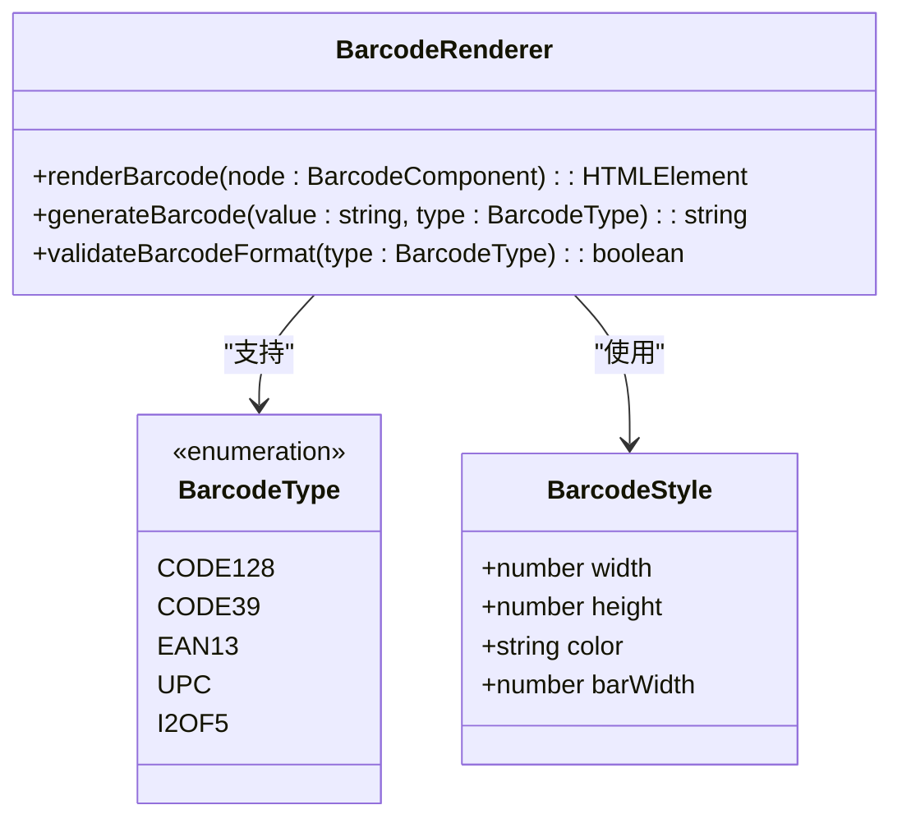

**图表来源**
- [sdk/src/printEngine/renderers/BarcodeRenderer.ts:1-200](file://sdk/src/printEngine/renderers/BarcodeRenderer.ts#L1-L200)

### 管道类型系统

#### 数据管道类型

数据管道类型定义了数据处理的标准化流程。

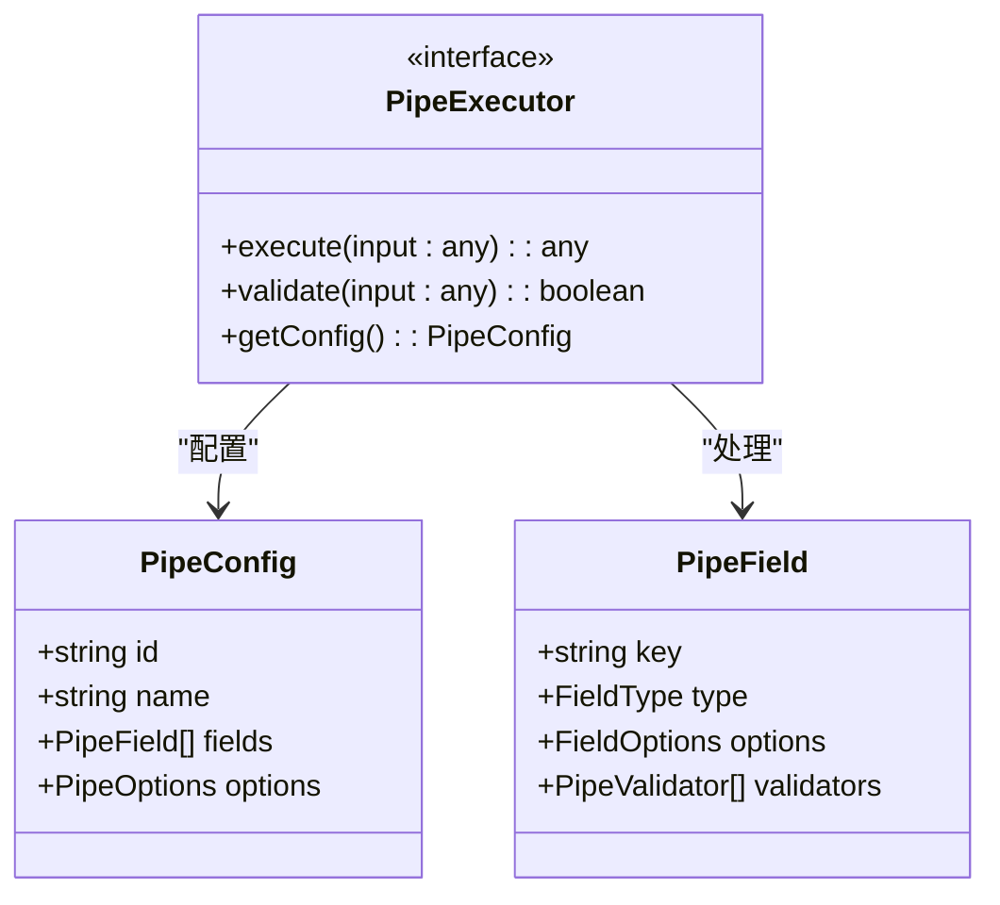

**图表来源**
- [sdk/src/pipes/types.ts:1-200](file://sdk/src/pipes/types.ts#L1-L200)
- [sdk/src/pipes/executors/ChineseNumberPipe.ts:1-200](file://sdk/src/pipes/executors/ChineseNumberPipe.ts#L1-L200)

#### 管道执行器实现

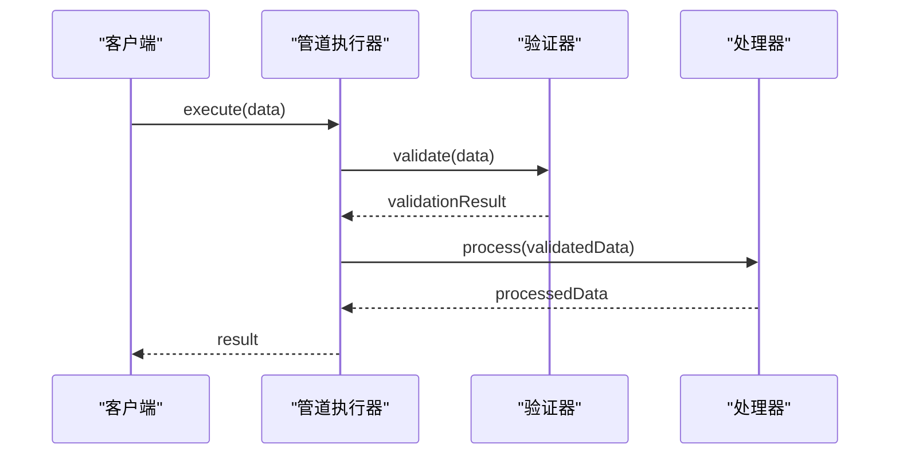

**图表来源**
- [sdk/src/pipes/executors/CurrencyPipe.ts:1-200](file://sdk/src/pipes/executors/CurrencyPipe.ts#L1-L200)
- [sdk/src/pipes/executors/DatePipe.ts:1-200](file://sdk/src/pipes/executors/DatePipe.ts#L1-L200)

**章节来源**
- [sdk/src/pipes/types.ts:1-200](file://sdk/src/pipes/types.ts#L1-L200)
- [sdk/src/pipes/executors/ChineseNumberPipe.ts:1-200](file://sdk/src/pipes/executors/ChineseNumberPipe.ts#L1-L200)
- [sdk/src/pipes/executors/CurrencyPipe.ts:1-200](file://sdk/src/pipes/executors/CurrencyPipe.ts#L1-L200)
- [sdk/src/pipes/executors/DatePipe.ts:1-200](file://sdk/src/pipes/executors/DatePipe.ts#L1-L200)
- [sdk/src/pipes/executors/MoneyPipe.ts:1-200](file://sdk/src/pipes/executors/MoneyPipe.ts#L1-L200)

### 配置选项类型

#### 模板配置类型

模板配置类型定义了打印模板的各种配置选项。

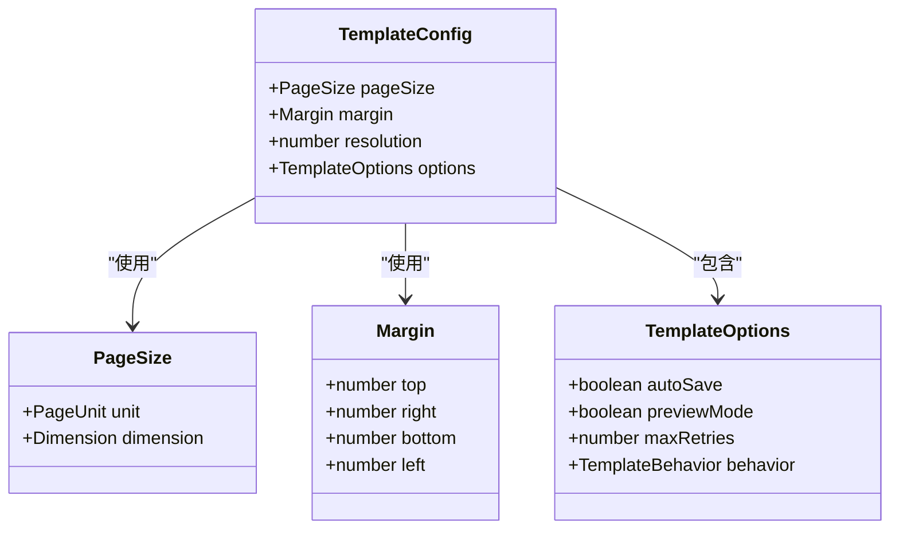

**图表来源**
- [sdk/src/printEngine/types.ts:1-200](file://sdk/src/printEngine/types.ts#L1-L200)

#### 组件属性类型

组件属性类型定义了各种组件的可配置属性。

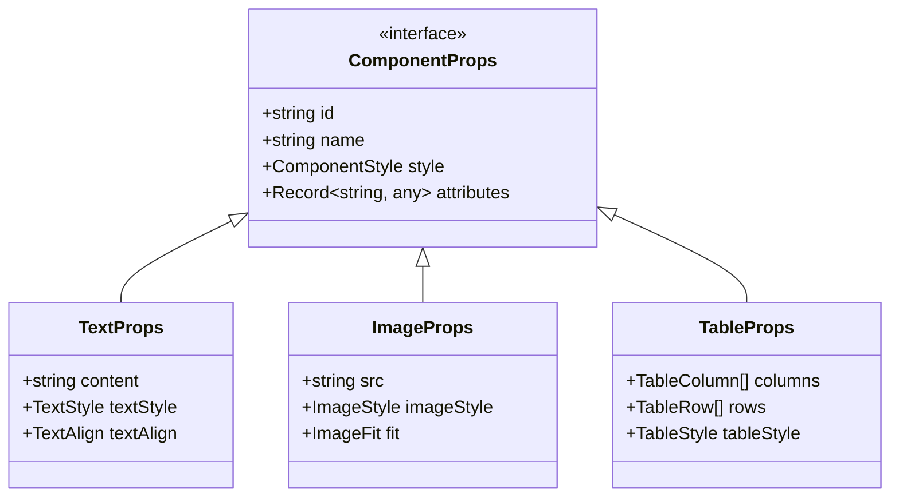

**图表来源**
- [designer/src/types/index.ts:1-200](file://designer/src/types/index.ts#L1-L200)

**章节来源**
- [sdk/src/printEngine/types.ts:1-200](file://sdk/src/printEngine/types.ts#L1-L200)
- [designer/src/types/index.ts:1-200](file://designer/src/types/index.ts#L1-L200)

## 依赖关系分析

### 类型依赖图

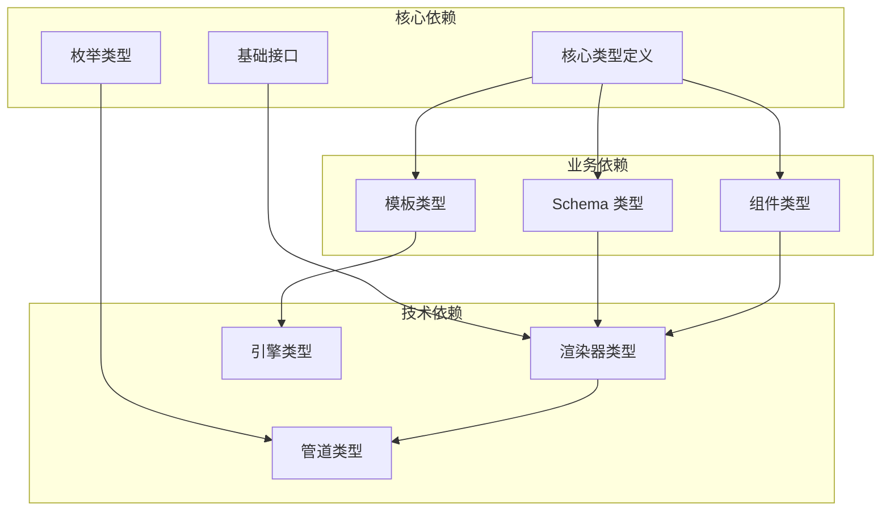

**图表来源**
- [designer/src/types/index.ts:1-200](file://designer/src/types/index.ts#L1-L200)
- [sdk/src/types.ts:1-200](file://sdk/src/types.ts#L1-L200)
- [sdk/src/printEngine/types.ts:1-200](file://sdk/src/printEngine/types.ts#L1-L200)

### 循环依赖检测

项目采用单向依赖结构，避免了循环依赖问题：

- 设计器层只依赖 SDK 的类型定义
- SDK 层内部模块间通过接口通信
- 类型定义文件之间无直接导入关系

**章节来源**
- [designer/src/types/index.ts:1-200](file://designer/src/types/index.ts#L1-L200)
- [sdk/src/types.ts:1-200](file://sdk/src/types.ts#L1-L200)

## 性能考虑

### 类型检查优化

1. **增量编译**：利用 TypeScript 的增量编译功能，减少重复类型检查时间
2. **模块拆分**：将大型类型定义拆分为多个小文件，提高编译效率
3. **泛型约束**：合理使用泛型约束，避免过度宽泛的类型定义

### 运行时性能

1. **类型擦除**：编译后的 JavaScript 不包含类型信息，不影响运行时性能
2. **接口合并**：通过接口合并减少对象创建开销
3. **枚举优化**：使用数字枚举替代字符串枚举以获得更好的性能

## 故障排除指南

### 常见类型错误

#### 类型不匹配错误

当组件属性类型与预期不符时，TypeScript 会抛出类型错误。解决方法：

1. 检查组件属性的类型定义
2. 确认传入参数是否符合接口要求
3. 使用类型断言时要谨慎

#### 泛型类型推断失败

当 TypeScript 无法正确推断泛型类型时：

1. 显式指定泛型参数
2. 提供足够的上下文信息
3. 检查函数签名中的类型注解

**章节来源**
- [designer/src/types/index.ts:1-200](file://designer/src/types/index.ts#L1-L200)
- [sdk/src/types.ts:1-200](file://sdk/src/types.ts#L1-L200)

## 结论

本项目建立了完整的 TypeScript 类型定义体系，涵盖了从基础类型到复杂业务逻辑的所有层面。通过合理的类型设计和严格的类型检查，确保了代码质量和开发效率。

主要特点包括：

1. **层次清晰**：从基础类型到业务类型，层次分明
2. **扩展性强**：支持自定义组件和管道的类型定义
3. **性能友好**：优化的类型设计不影响运行时性能
4. **文档完善**：每个类型都有明确的用途和使用场景

## 附录

### 版本变更记录

由于当前代码库未包含版本控制信息，无法提供具体的版本变更记录。

### 最佳实践建议

1. **类型优先**：在编写新功能时，先定义类型再实现逻辑
2. **接口分离**：将复杂接口拆分为多个小接口
3. **类型守卫**：使用类型守卫进行运行时类型检查
4. **泛型约束**：合理使用泛型约束提高类型安全性

### 类型扩展指南

#### 自定义组件类型扩展

1. 在 `ComponentNode` 接口基础上添加新的组件类型
2. 定义对应的渲染器类和样式类型
3. 在组件注册表中注册新的组件类型

#### 自定义管道类型扩展

1. 实现 `PipeExecutor` 接口
2. 定义管道配置类型和字段定义
3. 在管道注册表中注册新的管道类型