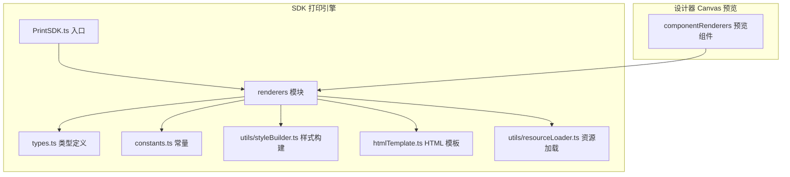
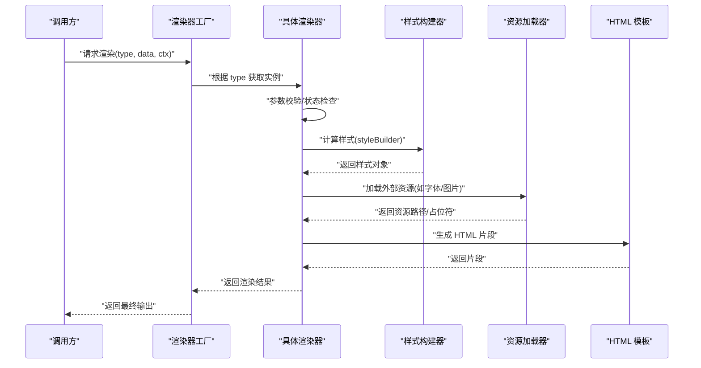
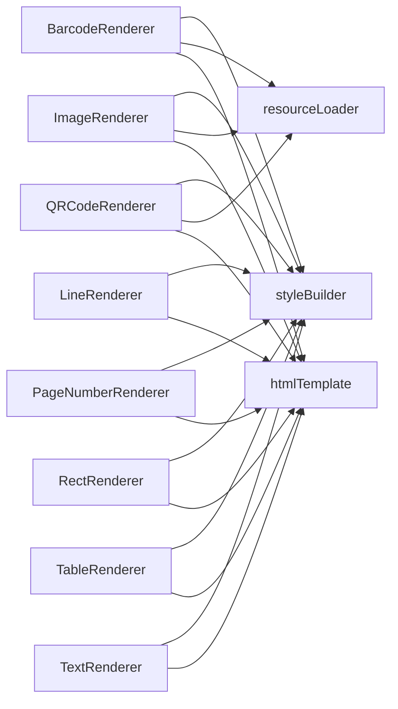
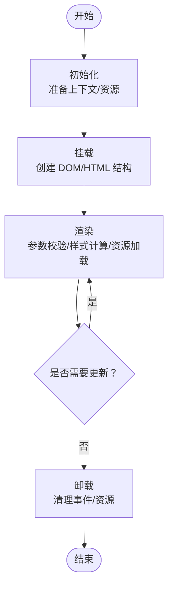
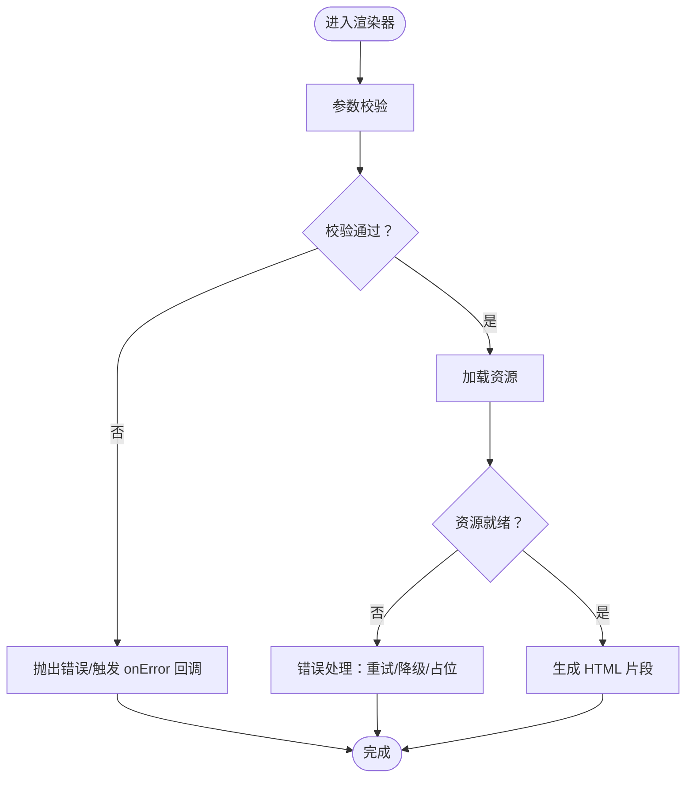

# 渲染器接口规范

<cite>
**本文引用的文件**
- [BarcodeRenderer.ts](file://sdk/src/printEngine/renderers/BarcodeRenderer.ts)
- [ImageRenderer.ts](file://sdk/src/printEngine/renderers/ImageRenderer.ts)
- [LineRenderer.ts](file://sdk/src/printEngine/renderers/LineRenderer.ts)
- [PageNumberRenderer.ts](file://sdk/src/printEngine/renderers/PageNumberRenderer.ts)
- [QRCodeRenderer.ts](file://sdk/src/printEngine/renderers/QRCodeRenderer.ts)
- [RectRenderer.ts](file://sdk/src/printEngine/renderers/RectRenderer.ts)
- [TableRenderer.ts](file://sdk/src/printEngine/renderers/TableRenderer.ts)
- [TextRenderer.ts](file://sdk/src/printEngine/renderers/TextRenderer.ts)
- [renderers/index.ts](file://sdk/src/printEngine/renderers/index.ts)
- [types.ts](file://sdk/src/printEngine/types.ts)
- [constants.ts](file://sdk/src/printEngine/constants.ts)
- [styleBuilder.ts](file://sdk/src/printEngine/utils/styleBuilder.ts)
- [resourceLoader.ts](file://sdk/src/utils/resourceLoader.ts)
- [PrintSDK.ts](file://sdk/src/PrintSDK.ts)
- [htmlTemplate.ts](file://sdk/src/printEngine/htmlTemplate.ts)
- [BarcodePreview.tsx](file://designer/src/pages/Designer/components/Canvas/componentRenderers/BarcodePreview.tsx)
- [ImagePreview.tsx](file://designer/src/pages/Designer/components/Canvas/componentRenderers/ImagePreview.tsx)
- [LinePreview.tsx](file://designer/src/pages/Designer/components/Canvas/componentRenderers/LinePreview.tsx)
- [QRCodePreview.tsx](file://designer/src/pages/Designer/components/Canvas/componentRenderers/QRCodePreview.tsx)
- [RectPreview.tsx](file://designer/src/pages/Designer/components/Canvas/componentRenderers/RectPreview.tsx)
- [TablePreview.tsx](file://designer/src/pages/Designer/components/Canvas/componentRenderers/TablePreview.tsx)
- [TextPreview.tsx](file://designer/src/pages/Designer/components/Canvas/componentRenderers/TextPreview.tsx)
- [index.ts](file://designer/src/pages/Designer/components/Canvas/componentRenderers/index.ts)
</cite>

## 目录
1. [简介](#简介)
2. [项目结构](#项目结构)
3. [核心组件](#核心组件)
4. [架构总览](#架构总览)
5. [详细组件分析](#详细组件分析)
6. [依赖关系分析](#依赖关系分析)
7. [性能考虑](#性能考虑)
8. [故障排查指南](#故障排查指南)
9. [结论](#结论)
10. [附录](#附录)

## 简介
本规范面向“打印引擎渲染器”接口，系统性梳理渲染器的职责边界、生命周期、事件回调与状态管理、参数校验与错误处理、异常恢复策略、类型定义与参数说明、性能指标与监控接口使用方式，以及调试与测试最佳实践。目标是为扩展新的渲染器或维护既有渲染器提供统一、可操作的工程化指导。

## 项目结构
渲染器位于 SDK 的打印引擎模块中，按组件类型划分具体实现；同时在设计器中提供对应的预览组件，用于设计期可视化。

**图表来源**
- [renderers/index.ts](file://sdk/src/printEngine/renderers/index.ts)
- [types.ts](file://sdk/src/printEngine/types.ts)
- [constants.ts](file://sdk/src/printEngine/constants.ts)
- [styleBuilder.ts](file://sdk/src/printEngine/utils/styleBuilder.ts)
- [htmlTemplate.ts](file://sdk/src/printEngine/htmlTemplate.ts)
- [resourceLoader.ts](file://sdk/src/utils/resourceLoader.ts)
- [PrintSDK.ts](file://sdk/src/PrintSDK.ts)
- [index.ts](file://designer/src/pages/Designer/components/Canvas/componentRenderers/index.ts)

**章节来源**
- [renderers/index.ts](file://sdk/src/printEngine/renderers/index.ts)
- [types.ts](file://sdk/src/printEngine/types.ts)
- [constants.ts](file://sdk/src/printEngine/constants.ts)
- [styleBuilder.ts](file://sdk/src/printEngine/utils/styleBuilder.ts)
- [htmlTemplate.ts](file://sdk/src/printEngine/htmlTemplate.ts)
- [resourceLoader.ts](file://sdk/src/utils/resourceLoader.ts)
- [PrintSDK.ts](file://sdk/src/PrintSDK.ts)
- [index.ts](file://designer/src/pages/Designer/components/Canvas/componentRenderers/index.ts)

## 核心组件
- 渲染器集合：包含条形码、图片、直线、页码、二维码、矩形、表格、文本等渲染器，分别负责将数据模型转换为可打印的 HTML 片段或 DOM 结构。
- 类型与常量：集中定义渲染器通用的数据结构、枚举、默认样式与阈值等。
- 工具链：样式构建器、资源加载器、HTML 模板生成器等辅助能力。
- 入口与导出：通过统一索引导出渲染器工厂与类型，便于上层调用。

**章节来源**
- [renderers/index.ts](file://sdk/src/printEngine/renderers/index.ts)
- [types.ts](file://sdk/src/printEngine/types.ts)
- [constants.ts](file://sdk/src/printEngine/constants.ts)

## 架构总览
渲染器遵循“数据驱动 + 工厂注册 + 统一模板”的架构模式。上层传入组件数据与上下文，渲染器根据类型选择对应实现，执行参数校验与样式计算，最终输出 HTML 片段或 DOM 片段，交由打印引擎整合。

**图表来源**
- [PrintSDK.ts](file://sdk/src/PrintSDK.ts)
- [renderers/index.ts](file://sdk/src/printEngine/renderers/index.ts)
- [styleBuilder.ts](file://sdk/src/printEngine/utils/styleBuilder.ts)
- [resourceLoader.ts](file://sdk/src/utils/resourceLoader.ts)
- [htmlTemplate.ts](file://sdk/src/printEngine/htmlTemplate.ts)

## 详细组件分析

### 接口与类型定义
- 渲染器基类/接口（约定）
  - 必备方法
    - 初始化：接收上下文、配置、回调等初始化资源
    - 渲染：输入组件数据，输出 HTML 或 DOM 片段
    - 销毁：释放资源、清理事件、回收内存
  - 生命周期
    - mount：挂载阶段，建立 DOM/HTML 结构
    - update：更新阶段，增量刷新样式/内容
    - unmount：卸载阶段，移除监听与资源
  - 事件回调
    - onRenderStart/onRenderEnd：渲染开始/结束事件
    - onError：错误事件
    - onWarn：告警事件
  - 状态管理
    - 内部状态：渲染状态、资源加载状态、缓存状态
    - 外部状态：通过回调暴露给上层
  - 参数校验
    - 输入参数类型、范围、必填项校验
    - 数据一致性与完整性校验
  - 错误处理与异常恢复
    - 可恢复错误：重试、降级、回退到默认值
    - 不可恢复错误：抛出并阻断流程，记录日志
  - 性能指标
    - 渲染耗时、资源加载耗时、内存占用趋势
    - 可选监控上报接口
  - 调试与测试
    - 提供最小可运行示例与断言点
    - 支持单元测试与集成测试

- 关键类型（约定）
  - 渲染上下文：包含页面尺寸、缩放、主题、语言等
  - 组件数据：包含位置、尺寸、样式、业务数据等
  - 渲染结果：HTML 字符串、DOM 片段、占位符映射
  - 错误对象：包含错误码、消息、建议修复方案

**章节来源**
- [types.ts](file://sdk/src/printEngine/types.ts)
- [constants.ts](file://sdk/src/printEngine/constants.ts)

### 条形码渲染器
- 职责：将编码数据渲染为条形码图像或矢量图形，并应用样式与定位。
- 关键点
  - 编码算法与格式支持（EAN、Code128 等）
  - 样式计算：宽高比、颜色、边距、字体大小
  - 资源加载：字体、图标、占位图
  - 输出：HTML 图像标签或 SVG 片段
- 生命周期：初始化 -> 渲染 -> 销毁
- 事件：onRenderStart/onRenderEnd/onError
- 参数校验：编码内容非空、长度限制、字符集校验
- 错误处理：不支持的编码格式、渲染失败回退为占位提示

**章节来源**
- [BarcodeRenderer.ts](file://sdk/src/printEngine/renderers/BarcodeRenderer.ts)
- [BarcodePreview.tsx](file://designer/src/pages/Designer/components/Canvas/componentRenderers/BarcodePreview.tsx)

### 图片渲染器
- 职责：将图片数据渲染为可打印的图像元素。
- 关键点
  - 图片格式与尺寸：支持 JPEG/PNG/WebP 等，自动适配容器
  - 样式计算：裁剪、圆角、阴影、边框
  - 资源加载：跨域、缓存、降级加载
  - 输出：img 标签或内联 base64（受大小限制）
- 生命周期：初始化 -> 渲染 -> 销毁
- 事件：onRenderStart/onRenderEnd/onError
- 参数校验：URL/数据合法性、尺寸范围、安全白名单
- 错误处理：加载失败显示占位图，网络异常重试

**章节来源**
- [ImageRenderer.ts](file://sdk/src/printEngine/renderers/ImageRenderer.ts)
- [ImagePreview.tsx](file://designer/src/pages/Designer/components/Canvas/componentRenderers/ImagePreview.tsx)

### 直线渲染器
- 职责：绘制方向性线条，支持多种样式与方向。
- 关键点
  - 方向：水平/垂直
  - 样式：粗细、颜色、虚线/实线、端点装饰
  - 输出：div 边框或 canvas 线条
- 生命周期：初始化 -> 渲染 -> 销毁
- 事件：onRenderStart/onRenderEnd/onError
- 参数校验：方向合法、尺寸与颜色有效
- 错误处理：无效方向回退为默认样式

**章节来源**
- [LineRenderer.ts](file://sdk/src/printEngine/renderers/LineRenderer.ts)
- [LinePreview.tsx](file://designer/src/pages/Designer/components/Canvas/componentRenderers/LinePreview.tsx)

### 页码渲染器
- 职责：渲染当前页码与总页数信息。
- 关键点
  - 文本内容：页码格式化（阿拉伯数字、罗马数字等）
  - 样式：对齐、字号、颜色、字体族
  - 输出：span 文本节点
- 生命周期：初始化 -> 渲染 -> 销毁
- 事件：onRenderStart/onRenderEnd/onError
- 参数校验：页码范围、格式化规则
- 错误处理：页码越界回退为占位文本

**章节来源**
- [PageNumberRenderer.ts](file://sdk/src/printEngine/renderers/PageNumberRenderer.ts)

### 二维码渲染器
- 职责：将数据渲染为二维码图像。
- 关键点
  - 编码与容错：支持多种容错级别
  - 样式：尺寸、前景色、背景色
  - 输出：canvas 或 img
- 生命周期：初始化 -> 渲染 -> 销毁
- 事件：onRenderStart/onRenderEnd/onError
- 参数校验：数据长度、字符集、尺寸范围
- 错误处理：编码失败显示占位图

**章节来源**
- [QRCodeRenderer.ts](file://sdk/src/printEngine/renderers/QRCodeRenderer.ts)
- [QRCodePreview.tsx](file://designer/src/pages/Designer/components/Canvas/componentRenderers/QRCodePreview.tsx)

### 矩形渲染器
- 职责：绘制填充与描边的矩形区域。
- 关键点
  - 样式：背景色、边框、圆角、阴影
  - 输出：div 或 canvas
- 生命周期：初始化 -> 渲染 -> 销毁
- 事件：onRenderStart/onRenderEnd/onError
- 参数校验：颜色与尺寸有效
- 错误处理：非法颜色回退默认色

**章节来源**
- [RectRenderer.ts](file://sdk/src/printEngine/renderers/RectRenderer.ts)
- [RectPreview.tsx](file://designer/src/pages/Designer/components/Canvas/componentRenderers/RectPreview.tsx)

### 表格渲染器
- 职责：渲染二维表格，支持行列合并、表头、边框等。
- 关键点
  - 数据结构：二维数组或结构化数据
  - 样式：列宽、行高、表头样式、边框
  - 输出：table 元素
- 生命周期：初始化 -> 渲染 -> 销毁
- 事件：onRenderStart/onRenderEnd/onError
- 参数校验：行列数量、数据类型一致性
- 错误处理：数据越界或类型不匹配时截断或跳过

**章节来源**
- [TableRenderer.ts](file://sdk/src/printEngine/renderers/TableRenderer.ts)
- [TablePreview.tsx](file://designer/src/pages/Designer/components/Canvas/componentRenderers/TablePreview.tsx)

### 文本渲染器
- 职责：渲染多行文本，支持换行、对齐、字体与颜色。
- 关键点
  - 文本处理：转义、截断、省略号
  - 样式：字体族、字号、行高、颜色、对齐
  - 输出：p/span/div 等
- 生命周期：初始化 -> 渲染 -> 销毁
- 事件：onRenderStart/onRenderEnd/onError
- 参数校验：文本非空、长度限制、字体可用性
- 错误处理：不可见字符替换、超长文本分页或截断

**章节来源**
- [TextRenderer.ts](file://sdk/src/printEngine/renderers/TextRenderer.ts)
- [TextPreview.tsx](file://designer/src/pages/Designer/components/Canvas/componentRenderers/TextPreview.tsx)

### 设计器预览组件
- 职责：在设计期展示各渲染器效果，便于交互与调试。
- 关键点
  - 与渲染器一一对应，传递相同数据与上下文
  - 支持拖拽、缩放、对齐等编辑行为
  - 与打印引擎保持一致的样式与布局逻辑
- 与渲染器的关系：预览组件是对渲染器在浏览器中的轻量复现，便于开发与测试

**章节来源**
- [BarcodePreview.tsx](file://designer/src/pages/Designer/components/Canvas/componentRenderers/BarcodePreview.tsx)
- [ImagePreview.tsx](file://designer/src/pages/Designer/components/Canvas/componentRenderers/ImagePreview.tsx)
- [LinePreview.tsx](file://designer/src/pages/Designer/components/Canvas/componentRenderers/LinePreview.tsx)
- [QRCodePreview.tsx](file://designer/src/pages/Designer/components/Canvas/componentRenderers/QRCodePreview.tsx)
- [RectPreview.tsx](file://designer/src/pages/Designer/components/Canvas/componentRenderers/RectPreview.tsx)
- [TablePreview.tsx](file://designer/src/pages/Designer/components/Canvas/componentRenderers/TablePreview.tsx)
- [TextPreview.tsx](file://designer/src/pages/Designer/components/Canvas/componentRenderers/TextPreview.tsx)

## 依赖关系分析
渲染器之间无直接耦合，通过统一的工厂与类型系统协作；公共依赖包括样式构建器、资源加载器与 HTML 模板生成器。

**图表来源**
- [BarcodeRenderer.ts](file://sdk/src/printEngine/renderers/BarcodeRenderer.ts)
- [ImageRenderer.ts](file://sdk/src/printEngine/renderers/ImageRenderer.ts)
- [LineRenderer.ts](file://sdk/src/printEngine/renderers/LineRenderer.ts)
- [PageNumberRenderer.ts](file://sdk/src/printEngine/renderers/PageNumberRenderer.ts)
- [QRCodeRenderer.ts](file://sdk/src/printEngine/renderers/QRCodeRenderer.ts)
- [RectRenderer.ts](file://sdk/src/printEngine/renderers/RectRenderer.ts)
- [TableRenderer.ts](file://sdk/src/printEngine/renderers/TableRenderer.ts)
- [TextRenderer.ts](file://sdk/src/printEngine/renderers/TextRenderer.ts)
- [styleBuilder.ts](file://sdk/src/printEngine/utils/styleBuilder.ts)
- [resourceLoader.ts](file://sdk/src/utils/resourceLoader.ts)
- [htmlTemplate.ts](file://sdk/src/printEngine/htmlTemplate.ts)

**章节来源**
- [renderers/index.ts](file://sdk/src/printEngine/renderers/index.ts)

## 性能考虑
- 渲染耗时
  - 使用微基准测试统计渲染时间，避免在主线程长时间阻塞
  - 对高频组件（文本、表格）采用虚拟滚动或分页策略
- 资源加载
  - 图片与字体采用懒加载与缓存策略，减少重复请求
  - 大体积资源优先使用 CDN 与压缩
- 内存占用
  - 及时销毁不再使用的 DOM 与事件监听
  - 合理使用对象池与复用策略
- 监控与上报
  - 在渲染器中暴露可选的监控接口，采集关键指标并上报
  - 通过回调或事件通道向调用方传递性能数据

[本节为通用性能建议，无需特定文件来源]

## 故障排查指南
- 常见问题
  - 参数缺失或类型错误：检查输入数据结构与必填字段
  - 资源加载失败：确认 URL 可达性、CORS 设置、缓存策略
  - 样式异常：核对样式构建器输出与浏览器兼容性
  - 渲染崩溃：捕获异常并降级为占位内容
- 定位手段
  - 开启调试日志，记录渲染开始/结束与关键中间态
  - 使用断点与单元测试覆盖边界条件
  - 对比设计器预览与实际打印效果差异
- 恢复策略
  - 可恢复错误：重试、回退默认值、降级渲染
  - 不可恢复错误：终止流程并上报错误详情

**章节来源**
- [types.ts](file://sdk/src/printEngine/types.ts)
- [constants.ts](file://sdk/src/printEngine/constants.ts)

## 结论
渲染器接口规范以“统一工厂 + 明确生命周期 + 强约束参数与错误处理”为核心，辅以样式构建、资源加载与模板生成的工具链，确保渲染质量与稳定性。遵循本规范可快速扩展新渲染器并保证与现有系统的兼容性。

## 附录

### 渲染器生命周期与事件流程

[本图为概念流程示意，无需图表来源]

### 渲染器参数校验与错误处理流程

[本图为概念流程示意，无需图表来源]