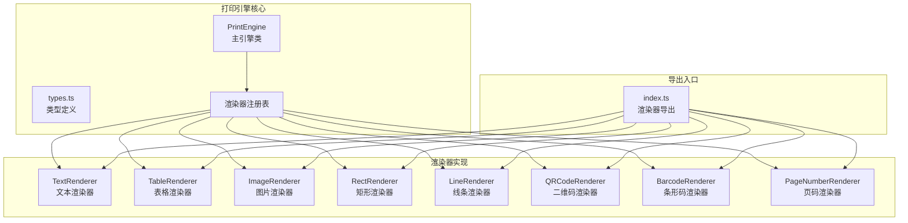
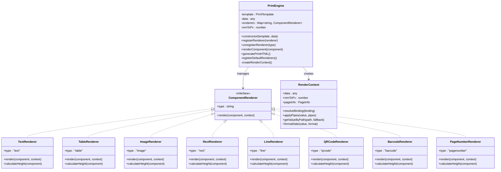
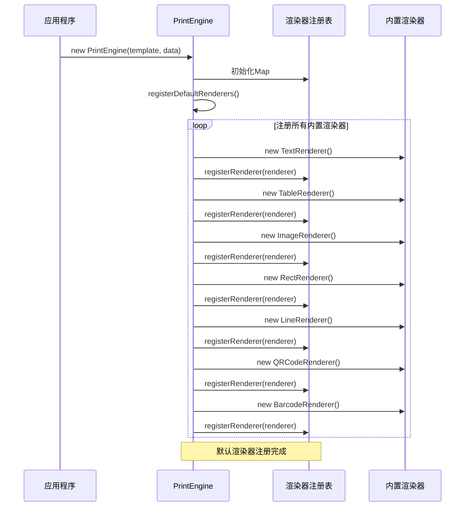
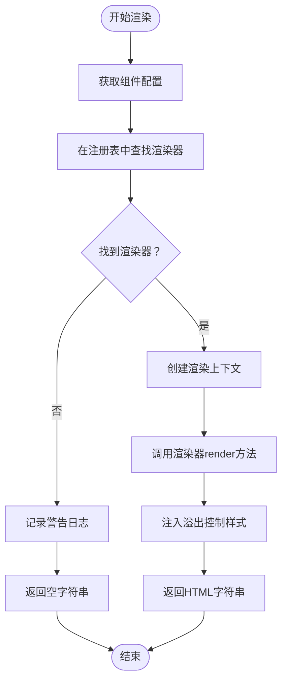
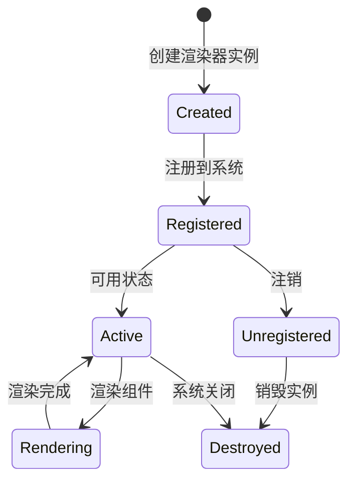
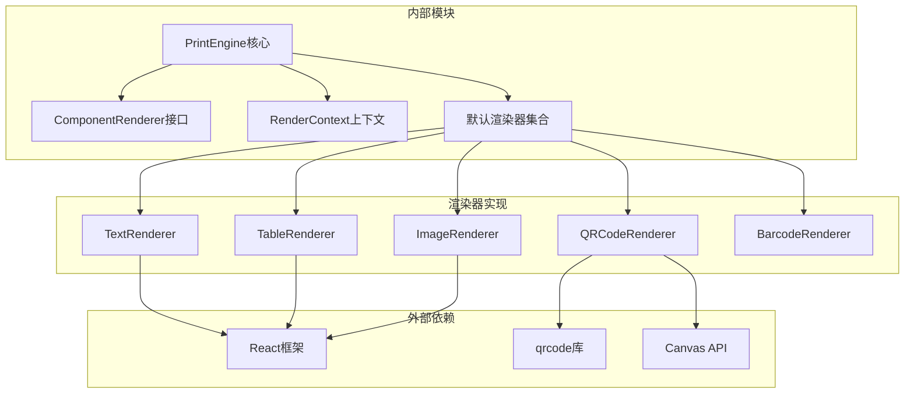
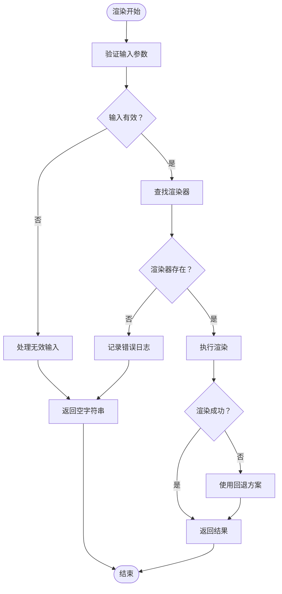
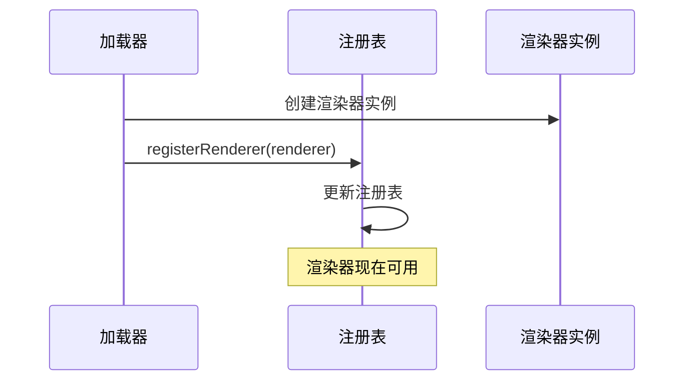
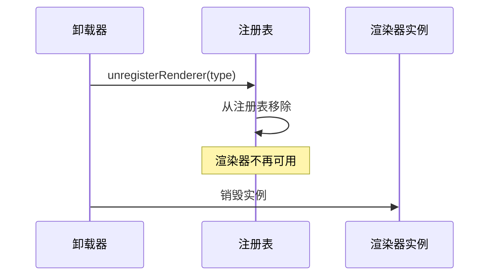

# 渲染器注册系统

<cite>
**本文档引用的文件**
- [printEngine.ts](file://sdk/src/printEngine.ts)
- [types.ts](file://sdk/src/printEngine/types.ts)
- [index.ts](file://sdk/src/printEngine/renderers/index.ts)
- [TextRenderer.ts](file://sdk/src/printEngine/renderers/TextRenderer.ts)
- [TableRenderer.ts](file://sdk/src/printEngine/renderers/TableRenderer.ts)
- [ImageRenderer.ts](file://sdk/src/printEngine/renderers/ImageRenderer.ts)
- [RectRenderer.ts](file://sdk/src/printEngine/renderers/RectRenderer.ts)
- [LineRenderer.ts](file://sdk/src/printEngine/renderers/LineRenderer.ts)
- [QRCodeRenderer.ts](file://sdk/src/printEngine/renderers/QRCodeRenderer.ts)
- [BarcodeRenderer.ts](file://sdk/src/printEngine/renderers/BarcodeRenderer.ts)
- [PageNumberRenderer.ts](file://sdk/src/printEngine/renderers/PageNumberRenderer.ts)
- [技术架构文档(仅参考).md](file://docs/技术架构文档(仅参考).md)
</cite>

## 目录
1. [简介](#简介)
2. [项目结构](#项目结构)
3. [核心组件](#核心组件)
4. [架构概览](#架构概览)
5. [详细组件分析](#详细组件分析)
6. [依赖分析](#依赖分析)
7. [性能考虑](#性能考虑)
8. [故障排除指南](#故障排除指南)
9. [结论](#结论)
10. [附录](#附录)

## 简介

渲染器注册系统是打印引擎插件化架构的核心组成部分，负责管理各种组件渲染器的注册、查找和执行。该系统采用基于 Map 的注册表机制，支持动态注册和注销自定义渲染器，实现了渲染器的可扩展性和灵活性。

系统的主要目标包括：
- 提供统一的渲染器接口规范
- 支持多种组件类型的渲染
- 实现渲染器的动态注册和管理
- 确保渲染器的生命周期管理
- 提供错误处理和回退机制

## 项目结构

渲染器注册系统主要分布在以下目录结构中：



**图表来源**
- [printEngine.ts:30-72](file://sdk/src/printEngine.ts#L30-L72)
- [index.ts:1-12](file://sdk/src/printEngine/renderers/index.ts#L1-L12)

**章节来源**
- [printEngine.ts:1-1095](file://sdk/src/printEngine.ts#L1-L1095)
- [index.ts:1-12](file://sdk/src/printEngine/renderers/index.ts#L1-L12)

## 核心组件

### RendererRegistry 类

RendererRegistry 是渲染器注册系统的核心类，负责管理所有渲染器实例。其主要职责包括：

#### 主要属性
- `renderers: Map<string, ComponentRenderer>`: 存储已注册渲染器的映射表
- `template: PrintTemplate`: 打印模板配置
- `data: any`: 业务数据对象
- `mmToPx: number`: mm到px的转换系数

#### 核心方法

##### registerRenderer(renderer: ComponentRenderer): void
- **功能**: 注册新的渲染器实例
- **参数**: ComponentRenderer - 渲染器实例
- **实现**: 将渲染器存储在Map中，键为渲染器的type属性
- **特点**: 不支持重复注册同类型渲染器

##### unregisterRenderer(type: string): void
- **功能**: 注销指定类型的渲染器
- **参数**: string - 渲染器类型标识
- **实现**: 从Map中删除对应类型的渲染器

##### renderComponent(component: ComponentNode): string
- **功能**: 渲染单个组件
- **参数**: ComponentNode - 组件配置
- **实现**: 查找对应类型的渲染器并调用其render方法

**章节来源**
- [printEngine.ts:30-72](file://sdk/src/printEngine.ts#L30-L72)
- [printEngine.ts:48-72](file://sdk/src/printEngine.ts#L48-L72)
- [printEngine.ts:196-213](file://sdk/src/printEngine.ts#L196-L213)

### ComponentRenderer 接口

ComponentRenderer 定义了所有渲染器必须实现的标准接口：

#### 接口规范
- `readonly type: string`: 组件类型标识符
- `render(component: ComponentNode, context: RenderContext): string`: 渲染方法

#### RenderContext 上下文对象

RenderContext 提供渲染器所需的环境信息和工具方法：

##### 数据访问方法
- `resolveBinding(binding?: DataBinding): string`: 解析数据绑定
- `getValueByPath(path: string, fallback?: string): any`: 根据路径获取数据值
- `applyPipes(value: any, pipes?: PipeConfig[]): any`: 应用管道转换

##### 格式化方法
- `formatDate(value: any, format: string): string`: 日期格式化
- `mmToPx: number`: mm到px转换系数

##### 页面信息
- `pageInfo?: { widthMm, heightMm, marginMm }`: 页面尺寸和边距信息

**章节来源**
- [types.ts:57-73](file://sdk/src/printEngine/types.ts#L57-L73)
- [types.ts:7-55](file://sdk/src/printEngine/types.ts#L7-L55)

## 架构概览

渲染器注册系统采用插件化架构设计，实现了清晰的职责分离和扩展性：



**图表来源**
- [printEngine.ts:30-72](file://sdk/src/printEngine.ts#L30-L72)
- [types.ts:57-73](file://sdk/src/printEngine/types.ts#L57-L73)
- [TextRenderer.ts:10-38](file://sdk/src/printEngine/renderers/TextRenderer.ts#L10-L38)
- [TableRenderer.ts](file://sdk/src/printEngine/renderers/TableRenderer.ts)
- [ImageRenderer.ts](file://sdk/src/printEngine/renderers/ImageRenderer.ts)
- [RectRenderer.ts:10-38](file://sdk/src/printEngine/renderers/RectRenderer.ts#L10-L38)
- [LineRenderer.ts](file://sdk/src/printEngine/renderers/LineRenderer.ts)
- [QRCodeRenderer.ts](file://sdk/src/printEngine/renderers/QRCodeRenderer.ts)
- [BarcodeRenderer.ts](file://sdk/src/printEngine/renderers/BarcodeRenderer.ts)
- [PageNumberRenderer.ts](file://sdk/src/printEngine/renderers/PageNumberRenderer.ts)

## 详细组件分析

### 默认渲染器注册流程

系统启动时会自动注册所有内置渲染器，形成完整的渲染器生态系统：



**图表来源**
- [printEngine.ts:36-56](file://sdk/src/printEngine.ts#L36-L56)
- [printEngine.ts:48-56](file://sdk/src/printEngine.ts#L48-L56)

**章节来源**
- [printEngine.ts:48-56](file://sdk/src/printEngine.ts#L48-L56)

### 渲染器查找和执行机制

当需要渲染特定组件时，系统会执行以下查找和执行流程：



**图表来源**
- [printEngine.ts:196-213](file://sdk/src/printEngine.ts#L196-L213)

**章节来源**
- [printEngine.ts:196-213](file://sdk/src/printEngine.ts#L196-L213)

### 自定义渲染器注册示例

以下是注册自定义渲染器的完整流程：

#### 步骤1：实现自定义渲染器
```typescript
class CustomRenderer implements ComponentRenderer {
  readonly type = 'custom';
  
  render(component: ComponentNode, context: RenderContext): string {
    // 实现自定义渲染逻辑
    return '<div>自定义组件内容</div>';
  }
}
```

#### 步骤2：注册自定义渲染器
```typescript
const customRenderer = new CustomRenderer();
engine.registerRenderer(customRenderer);
```

#### 步骤3：使用自定义渲染器
在组件配置中使用自定义类型：
```json
{
  "type": "custom",
  "props": {
    "content": "自定义内容"
  }
}
```

**章节来源**
- [printEngine.ts:62-64](file://sdk/src/printEngine.ts#L62-L64)
- [printEngine.ts:1084-1085](file://sdk/src/printEngine.ts#L1084-L1085)

### 渲染器命名约定

系统对渲染器类型名称有明确的命名约定：

#### 命名规则
- 使用小写字母和连字符的组合
- 语义化命名，描述组件功能
- 避免使用保留关键字
- 保持命名的一致性和可读性

#### 推荐命名示例
- `text` - 文本组件
- `table` - 表格组件  
- `image` - 图片组件
- `rect` - 矩形组件
- `line` - 线条组件
- `qrcode` - 二维码组件
- `barcode` - 条形码组件
- `pagenumber` - 页码组件

**章节来源**
- [TextRenderer.ts](file://sdk/src/printEngine/renderers/TextRenderer.ts#L11)
- [TableRenderer.ts](file://sdk/src/printEngine/renderers/TableRenderer.ts)
- [ImageRenderer.ts](file://sdk/src/printEngine/renderers/ImageRenderer.ts)
- [RectRenderer.ts](file://sdk/src/printEngine/renderers/RectRenderer.ts#L11)
- [LineRenderer.ts](file://sdk/src/printEngine/renderers/LineRenderer.ts)
- [QRCodeRenderer.ts](file://sdk/src/printEngine/renderers/QRCodeRenderer.ts)
- [BarcodeRenderer.ts](file://sdk/src/printEngine/renderers/BarcodeRenderer.ts)
- [PageNumberRenderer.ts](file://sdk/src/printEngine/renderers/PageNumberRenderer.ts)

### 渲染器生命周期管理

渲染器的生命周期包括创建、注册、使用和销毁四个阶段：

#### 生命周期流程


#### 最佳实践
- 在应用启动时注册所有必要的渲染器
- 避免在运行时频繁注册和注销渲染器
- 确保渲染器实例的正确销毁
- 处理渲染过程中的异常情况

**章节来源**
- [printEngine.ts:62-72](file://sdk/src/printEngine.ts#L62-L72)

## 依赖分析

渲染器注册系统具有清晰的依赖关系和模块化设计：



**图表来源**
- [printEngine.ts:15-24](file://sdk/src/printEngine.ts#L15-L24)
- [QRCodeRenderer.ts](file://sdk/src/printEngine/renderers/QRCodeRenderer.ts)
- [TextRenderer.ts](file://sdk/src/printEngine/renderers/TextRenderer.ts)

**章节来源**
- [printEngine.ts:15-24](file://sdk/src/printEngine.ts#L15-L24)

## 性能考虑

渲染器注册系统在设计时充分考虑了性能优化：

### 性能特性
- **O(1) 查找复杂度**: 使用Map存储渲染器，查找时间为常数级别
- **内存效率**: 渲染器实例按需创建和销毁
- **缓存友好**: 渲染器注册表在内存中连续存储
- **延迟初始化**: 默认渲染器在构造函数中一次性注册

### 优化建议
- 避免在热路径中频繁注册和注销渲染器
- 复用渲染器实例而不是重复创建
- 合理使用渲染上下文，避免不必要的数据拷贝
- 对于大量组件渲染场景，考虑批量处理策略

## 故障排除指南

### 常见问题及解决方案

#### 问题1：找不到渲染器
**症状**: 控制台出现"未找到渲染器"警告
**原因**: 组件类型与注册的渲染器类型不匹配
**解决方案**: 
- 检查组件配置中的type字段
- 确认渲染器已正确注册
- 验证渲染器类型名称的大小写

#### 问题2：渲染器覆盖
**症状**: 自定义渲染器被系统默认渲染器覆盖
**原因**: 后注册的渲染器会覆盖先前注册的同类型渲染器
**解决方案**:
- 在注册自定义渲染器前检查是否已存在
- 使用唯一且不冲突的渲染器类型名称
- 避免重复注册同一类型的渲染器

#### 问题3：渲染上下文访问异常
**症状**: 数据绑定解析失败或格式化错误
**原因**: RenderContext配置不正确或数据结构不符合预期
**解决方案**:
- 验证业务数据结构
- 检查数据绑定路径的有效性
- 确认管道转换配置的正确性

**章节来源**
- [printEngine.ts:199-202](file://sdk/src/printEngine.ts#L199-L202)

### 错误处理策略

系统采用渐进式错误处理策略：

#### 错误处理流程


**图表来源**
- [printEngine.ts:196-213](file://sdk/src/printEngine.ts#L196-L213)

**章节来源**
- [printEngine.ts:196-213](file://sdk/src/printEngine.ts#L196-L213)

## 结论

渲染器注册系统通过其精心设计的架构和规范化的接口，为打印引擎提供了强大的扩展能力和灵活的渲染机制。系统的主要优势包括：

1. **清晰的接口规范**: ComponentRenderer接口确保了渲染器的一致性和可预测性
2. **高效的注册机制**: 基于Map的注册表提供了O(1)的查找性能
3. **完善的生命周期管理**: 从创建到销毁的完整生命周期保障了资源的有效利用
4. **强大的扩展性**: 支持动态注册和注销自定义渲染器
5. **健壮的错误处理**: 提供了多层次的错误处理和回退机制

该系统为开发者提供了构建复杂打印应用的强大基础，同时保持了良好的性能表现和可维护性。

## 附录

### 渲染器配置验证清单

在注册自定义渲染器时，请确保满足以下要求：

#### 必需配置
- [ ] 实现ComponentRenderer接口
- [ ] 设置唯一的type属性
- [ ] 实现render方法
- [ ] 正确处理RenderContext参数

#### 最佳实践
- [ ] 使用语义化的类型名称
- [ ] 实现calculateHeight方法（如适用）
- [ ] 处理边界情况和异常输入
- [ ] 提供适当的错误处理
- [ ] 确保渲染输出的HTML有效性

### 动态加载机制

系统支持渲染器的动态加载和管理：

#### 动态注册流程


#### 动态注销流程


**图表来源**
- [printEngine.ts:62-72](file://sdk/src/printEngine.ts#L62-L72)

**章节来源**
- [printEngine.ts:62-72](file://sdk/src/printEngine.ts#L62-L72)