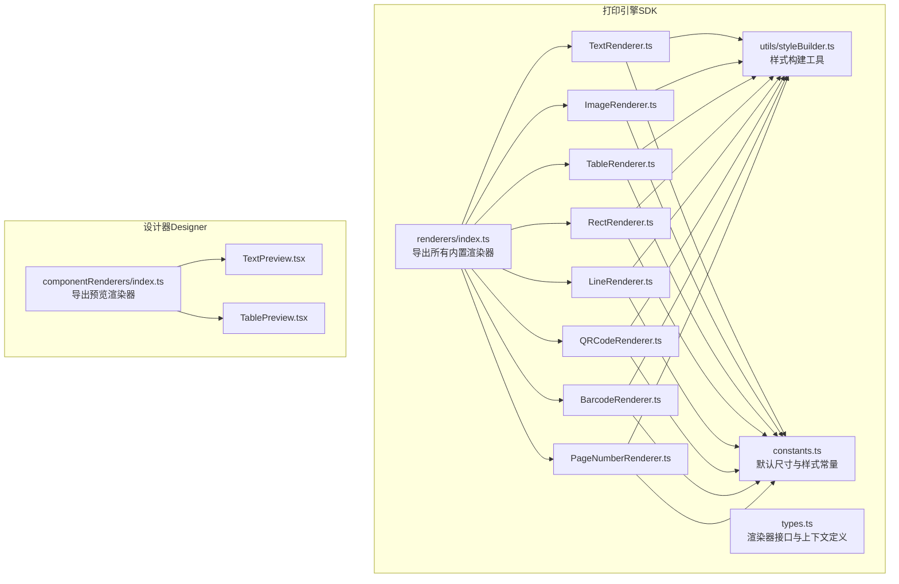
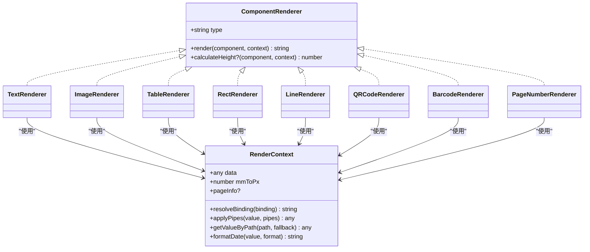
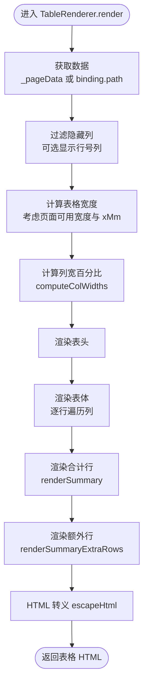
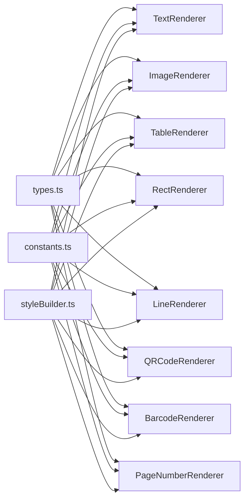

# 组件渲染器接口

<cite>
**本文引用的文件**
- [renderers/index.ts](file://sdk/src/printEngine/renderers/index.ts)
- [types.ts](file://sdk/src/printEngine/types.ts)
- [constants.ts](file://sdk/src/printEngine/constants.ts)
- [styleBuilder.ts](file://sdk/src/printEngine/utils/styleBuilder.ts)
- [TextRenderer.ts](file://sdk/src/printEngine/renderers/TextRenderer.ts)
- [ImageRenderer.ts](file://sdk/src/printEngine/renderers/ImageRenderer.ts)
- [TableRenderer.ts](file://sdk/src/printEngine/renderers/TableRenderer.ts)
- [RectRenderer.ts](file://sdk/src/printEngine/renderers/RectRenderer.ts)
- [LineRenderer.ts](file://sdk/src/printEngine/renderers/LineRenderer.ts)
- [QRCodeRenderer.ts](file://sdk/src/printEngine/renderers/QRCodeRenderer.ts)
- [BarcodeRenderer.ts](file://sdk/src/printEngine/renderers/BarcodeRenderer.ts)
- [PageNumberRenderer.ts](file://sdk/src/printEngine/renderers/PageNumberRenderer.ts)
- [componentRenderers/index.ts](file://designer/src/pages/Designer/components/Canvas/componentRenderers/index.ts)
- [TextPreview.tsx](file://designer/src/pages/Designer/components/Canvas/componentRenderers/TextPreview.tsx)
- [TablePreview.tsx](file://designer/src/pages/Designer/components/Canvas/componentRenderers/TablePreview.tsx)
</cite>

## 目录
1. [简介](#简介)
2. [项目结构](#项目结构)
3. [核心组件](#核心组件)
4. [架构总览](#架构总览)
5. [详细组件分析](#详细组件分析)
6. [依赖关系分析](#依赖关系分析)
7. [性能考量](#性能考量)
8. [故障排查指南](#故障排查指南)
9. [结论](#结论)
10. [附录](#附录)

## 简介
本文件面向组件渲染器系统，提供完整的接口规范与实现说明，涵盖内置渲染器（TextRenderer、ImageRenderer、TableRenderer、RectRenderer、LineRenderer、QRCodeRenderer、BarcodeRenderer、PageNumberRenderer）的属性配置、样式选项、数据绑定方式、生命周期与回调约定，以及渲染器注册机制与扩展指南。同时给出渲染性能优化建议与缓存策略，并提供自定义渲染器开发步骤与示例路径。

## 项目结构
渲染器体系分为两部分：
- 打印引擎渲染器（SDK）：负责将组件节点渲染为 HTML 字符串，供打印输出。
- 设计器预览渲染器（Designer）：负责在设计器画布中进行组件预览与交互。

图表来源
- [renderers/index.ts:1-13](file://sdk/src/printEngine/renderers/index.ts#L1-L13)
- [types.ts:57-82](file://sdk/src/printEngine/types.ts#L57-L82)
- [constants.ts:13-46](file://sdk/src/printEngine/constants.ts#L13-L46)
- [styleBuilder.ts:13-53](file://sdk/src/printEngine/utils/styleBuilder.ts#L13-L53)
- [TextRenderer.ts:10-59](file://sdk/src/printEngine/renderers/TextRenderer.ts#L10-L59)
- [ImageRenderer.ts:10-54](file://sdk/src/printEngine/renderers/ImageRenderer.ts#L10-L54)
- [TableRenderer.ts:147-327](file://sdk/src/printEngine/renderers/TableRenderer.ts#L147-L327)
- [RectRenderer.ts:10-38](file://sdk/src/printEngine/renderers/RectRenderer.ts#L10-L38)
- [LineRenderer.ts:10-58](file://sdk/src/printEngine/renderers/LineRenderer.ts#L10-L58)
- [QRCodeRenderer.ts:12-62](file://sdk/src/printEngine/renderers/QRCodeRenderer.ts#L12-L62)
- [BarcodeRenderer.ts:12-62](file://sdk/src/printEngine/renderers/BarcodeRenderer.ts#L12-L62)
- [PageNumberRenderer.ts:14-104](file://sdk/src/printEngine/renderers/PageNumberRenderer.ts#L14-L104)
- [componentRenderers/index.ts:1-11](file://designer/src/pages/Designer/components/Canvas/componentRenderers/index.ts#L1-L11)
- [TextPreview.tsx:10-30](file://designer/src/pages/Designer/components/Canvas/componentRenderers/TextPreview.tsx#L10-L30)
- [TablePreview.tsx:69-174](file://designer/src/pages/Designer/components/Canvas/componentRenderers/TablePreview.tsx#L69-L174)

章节来源
- [renderers/index.ts:1-13](file://sdk/src/printEngine/renderers/index.ts#L1-L13)
- [componentRenderers/index.ts:1-11](file://designer/src/pages/Designer/components/Canvas/componentRenderers/index.ts#L1-L11)

## 核心组件
- 渲染器接口与上下文
  - 接口定义：ComponentRenderer
    - 必需属性：type（只读字符串，组件类型标识）
    - 必需方法：render(component, context): string
    - 可选方法：calculateHeight?(component, context): number（用于分页估算）
  - 上下文定义：RenderContext
    - 数据访问：data、getValueByPath(path, fallback)
    - 绑定解析：resolveBinding(binding)
    - 管道应用：applyPipes(value, pipes)
    - 日期格式化：formatDate(value, format)
    - 单位换算：mmToPx（默认 3.78）
    - 页面信息：pageInfo（widthMm、heightMm、marginMm）

- 样式工具
  - buildStyleString(styles): 将样式对象转换为 CSS 字符串
  - buildPositionStyle(xMm, yMm, widthMm?, heightMm?, mmToPx?): 生成绝对定位样式对象

- 默认常量
  - 单位换算：MM_TO_PX = 3.78
  - 组件默认尺寸（mm）：TEXT、IMAGE、RECT、LINE、QRCODE、BARCODE、TABLE
  - 样式默认值：字体、颜色、对齐、行高、边框、背景
  - 表格默认尺寸与样式：表头高度、行高、单元格内边距、边框颜色、表头背景

章节来源
- [types.ts:57-82](file://sdk/src/printEngine/types.ts#L57-L82)
- [types.ts:11-55](file://sdk/src/printEngine/types.ts#L11-L55)
- [styleBuilder.ts:13-53](file://sdk/src/printEngine/utils/styleBuilder.ts#L13-L53)
- [constants.ts:8](file://sdk/src/printEngine/constants.ts#L8)
- [constants.ts:13-46](file://sdk/src/printEngine/constants.ts#L13-L46)
- [constants.ts:63-78](file://sdk/src/printEngine/constants.ts#L63-L78)
- [constants.ts:83-92](file://sdk/src/printEngine/constants.ts#L83-L92)

## 架构总览
渲染器遵循“接口统一 + 工具复用”的设计，所有内置渲染器实现 ComponentRenderer 接口，通过 RenderContext 获取数据与上下文，使用 styleBuilder 统一构建样式，借助 constants 提供默认值与约束。设计器侧提供对应的预览组件，保证设计期与运行期的一致性体验。

图表来源
- [types.ts:57-82](file://sdk/src/printEngine/types.ts#L57-L82)
- [TextRenderer.ts:10-59](file://sdk/src/printEngine/renderers/TextRenderer.ts#L10-L59)
- [ImageRenderer.ts:10-54](file://sdk/src/printEngine/renderers/ImageRenderer.ts#L10-L54)
- [TableRenderer.ts:147-327](file://sdk/src/printEngine/renderers/TableRenderer.ts#L147-L327)
- [RectRenderer.ts:10-38](file://sdk/src/printEngine/renderers/RectRenderer.ts#L10-L38)
- [LineRenderer.ts:10-58](file://sdk/src/printEngine/renderers/LineRenderer.ts#L10-L58)
- [QRCodeRenderer.ts:12-62](file://sdk/src/printEngine/renderers/QRCodeRenderer.ts#L12-L62)
- [BarcodeRenderer.ts:12-62](file://sdk/src/printEngine/renderers/BarcodeRenderer.ts#L12-L62)
- [PageNumberRenderer.ts:14-104](file://sdk/src/printEngine/renderers/PageNumberRenderer.ts#L14-L104)

## 详细组件分析

### 文本渲染器 TextRenderer
- 类型标识：text
- 渲染逻辑要点
  - 数据绑定：优先使用 context.resolveBinding(binding)，其次使用 props.text；支持 props.label 前缀拼接。
  - 定位样式：基于 buildPositionStyle，将 mm 转 px 并使用绝对定位。
  - 文本样式：支持 fontSize、color、fontWeight；通过 flex 布局实现 textAlign 的视觉对齐（center/right 映射为 justifyContent）。
  - 行高与换行：lineHeight、whiteSpace、wordBreak、overflow 控制文本展示。
- 高度计算：calculateHeight 返回布局高度或默认文本高度。
- 关键实现路径
  - [TextRenderer.render:13-53](file://sdk/src/printEngine/renderers/TextRenderer.ts#L13-L53)
  - [TextRenderer.calculateHeight:55-58](file://sdk/src/printEngine/renderers/TextRenderer.ts#L55-L58)

章节来源
- [TextRenderer.ts:10-59](file://sdk/src/printEngine/renderers/TextRenderer.ts#L10-L59)
- [constants.ts:13-17](file://sdk/src/printEngine/constants.ts#L13-L17)
- [styleBuilder.ts:31-53](file://sdk/src/printEngine/utils/styleBuilder.ts#L31-L53)

### 图片渲染器 ImageRenderer
- 类型标识：image
- 渲染逻辑要点
  - 数据绑定：优先使用 binding 值作为 src，否则回退到 props.src。
  - 容器样式：使用 buildPositionStyle 设置绝对定位与尺寸。
  - 图片样式：object-fit 由 props.objectFit 控制；严格按容器尺寸渲染，避免自适应破坏布局。
  - 占位符：当无图片时显示“暂无图片”提示。
- 高度计算：calculateHeight 返回布局高度或默认图片高度。
- 关键实现路径
  - [ImageRenderer.render:13-49](file://sdk/src/printEngine/renderers/ImageRenderer.ts#L13-L49)
  - [ImageRenderer.calculateHeight:51-53](file://sdk/src/printEngine/renderers/ImageRenderer.ts#L51-L53)

章节来源
- [ImageRenderer.ts:10-54](file://sdk/src/printEngine/renderers/ImageRenderer.ts#L10-L54)
- [constants.ts:19-22](file://sdk/src/printEngine/constants.ts#L19-L22)
- [styleBuilder.ts:31-53](file://sdk/src/printEngine/utils/styleBuilder.ts#L31-L53)

### 表格渲染器 TableRenderer
- 类型标识：table
- 渲染逻辑要点
  - 数据来源：优先使用 props._pageData（分页数据），其次使用 binding.path 获取完整数据。
  - 列配置：过滤 hidden 列；可选显示行号列（showRowNumber）。
  - 表头控制：支持 props.showHeader 与分页标记 props._showHeader；表头高度固定。
  - 边框与内边距：由 props.border* 与 TABLE_STYLE_DEFAULT 控制。
  - 宽度计算：computeColWidths 根据固定宽度与剩余空间动态分配百分比，确保总和为 100%，并处理溢出与最小宽度保护。
  - 位置与溢出：根据 pageInfo.widthMm、marginMm.right 与 layout.xMm 检查并自动调整宽度，避免溢出。
  - 合计行：支持 showSummary、summaryMode（page/total）、summaryLabel、summaryStyle；合计值使用 decimal.js 精确计算并支持管道格式化。
  - 额外行：summaryExtraRows 支持多行附加统计，可叠加多个管道。
  - XSS 防护：escapeHtml 防止注入。
- 高度计算：calculateHeight 基于 showHeader、数据行数、合计行与额外行估算高度。
- 关键实现路径
  - [TableRenderer.render:150-327](file://sdk/src/printEngine/renderers/TableRenderer.ts#L150-L327)
  - [TableRenderer.computeColWidths:51-125](file://sdk/src/printEngine/renderers/TableRenderer.ts#L51-L125)
  - [TableRenderer.renderSummary:332-385](file://sdk/src/printEngine/renderers/TableRenderer.ts#L332-L385)
  - [TableRenderer.calculateSummary:390-463](file://sdk/src/printEngine/renderers/TableRenderer.ts#L390-L463)
  - [TableRenderer.renderSummaryExtraRows:513-579](file://sdk/src/printEngine/renderers/TableRenderer.ts#L513-L579)
  - [TableRenderer.calculateHeight:581-600](file://sdk/src/printEngine/renderers/TableRenderer.ts#L581-L600)

图表来源
- [TableRenderer.ts:150-327](file://sdk/src/printEngine/renderers/TableRenderer.ts#L150-L327)
- [TableRenderer.ts:51-125](file://sdk/src/printEngine/renderers/TableRenderer.ts#L51-L125)
- [TableRenderer.ts:332-385](file://sdk/src/printEngine/renderers/TableRenderer.ts#L332-L385)
- [TableRenderer.ts:513-579](file://sdk/src/printEngine/renderers/TableRenderer.ts#L513-L579)

章节来源
- [TableRenderer.ts:147-601](file://sdk/src/printEngine/renderers/TableRenderer.ts#L147-L601)
- [constants.ts:51-58](file://sdk/src/printEngine/constants.ts#L51-L58)
- [constants.ts:83-92](file://sdk/src/printEngine/constants.ts#L83-L92)

### 矩形渲染器 RectRenderer
- 类型标识：rect
- 渲染逻辑要点
  - 使用 buildPositionStyle 设置绝对定位与尺寸。
  - 样式：border、background 由 style 覆盖默认值。
- 高度计算：calculateHeight 返回布局高度或默认矩形高度。
- 关键实现路径
  - [RectRenderer.render:13-32](file://sdk/src/printEngine/renderers/RectRenderer.ts#L13-L32)
  - [RectRenderer.calculateHeight:35-37](file://sdk/src/printEngine/renderers/RectRenderer.ts#L35-L37)

章节来源
- [RectRenderer.ts:10-38](file://sdk/src/printEngine/renderers/RectRenderer.ts#L10-L38)
- [constants.ts:24-27](file://sdk/src/printEngine/constants.ts#L24-L27)

### 线条渲染器 LineRenderer
- 类型标识：line
- 渲染逻辑要点
  - 方向：horizontal 或 vertical，分别使用 borderTop 或 borderLeft。
  - 容器：使用 flex 居中放置线条，容器尺寸由 layout.widthMm/heightMm 决定。
  - 线条粗细、颜色、样式：由 style.borderTop* 控制。
- 高度计算：calculateHeight 返回外层容器高度。
- 关键实现路径
  - [LineRenderer.render:13-51](file://sdk/src/printEngine/renderers/LineRenderer.ts#L13-L51)
  - [LineRenderer.calculateHeight:53-57](file://sdk/src/printEngine/renderers/LineRenderer.ts#L53-L57)

章节来源
- [LineRenderer.ts:10-58](file://sdk/src/printEngine/renderers/LineRenderer.ts#L10-L58)
- [constants.ts:29-32](file://sdk/src/printEngine/constants.ts#L29-L32)

### 二维码渲染器 QRCodeRenderer
- 类型标识：qrcode
- 渲染逻辑要点
  - 数据绑定：优先使用 binding 值，否则使用 props.content，默认内容来自常量。
  - 生成：在内存 canvas 上同步生成二维码，立即转为 base64，返回 img 标签。
  - 错误兜底：生成失败时返回带边框的占位提示。
- 高度计算：calculateHeight 返回布局高度或默认二维码尺寸。
- 关键实现路径
  - [QRCodeRenderer.render:15-56](file://sdk/src/printEngine/renderers/QRCodeRenderer.ts#L15-L56)
  - [QRCodeRenderer.calculateHeight:59-61](file://sdk/src/printEngine/renderers/QRCodeRenderer.ts#L59-L61)

章节来源
- [QRCodeRenderer.ts:12-62](file://sdk/src/printEngine/renderers/QRCodeRenderer.ts#L12-L62)
- [constants.ts:34-35](file://sdk/src/printEngine/constants.ts#L34-L35)

### 条形码渲染器 BarcodeRenderer
- 类型标识：barcode
- 渲染逻辑要点
  - 数据绑定：优先使用 binding 值，否则使用 props.content 与 props.format，默认来自常量。
  - 生成：在内存 canvas 上同步生成条形码，立即转为 base64，返回 img 标签。
  - 错误兜底：生成失败时返回带边框的占位提示。
- 高度计算：calculateHeight 返回布局高度或默认条形码尺寸。
- 关键实现路径
  - [BarcodeRenderer.render:15-56](file://sdk/src/printEngine/renderers/BarcodeRenderer.ts#L15-L56)
  - [BarcodeRenderer.calculateHeight:59-61](file://sdk/src/printEngine/renderers/BarcodeRenderer.ts#L59-L61)

章节来源
- [BarcodeRenderer.ts:12-62](file://sdk/src/printEngine/renderers/BarcodeRenderer.ts#L12-L62)
- [constants.ts:37-40](file://sdk/src/printEngine/constants.ts#L37-L40)

### 页码渲染器 PageNumberRenderer
- 类型标识：pageNumber
- 渲染逻辑要点
  - 数据来源：使用 props._currentPage 与 _totalPages（由打印引擎注入）。
  - 格式：支持 simple、text、slash 三种格式，可配置前缀、后缀与分隔符。
  - 对齐：根据 props.align（left/center/right）映射为 flex 的 justifyContent。
  - 安全：对输出文本进行 HTML 转义。
- 高度计算：calculateHeight 返回布局高度或默认文本高度。
- 关键实现路径
  - [PageNumberRenderer.render:17-56](file://sdk/src/printEngine/renderers/PageNumberRenderer.ts#L17-L56)
  - [PageNumberRenderer.formatPageNumber:66-94](file://sdk/src/printEngine/renderers/PageNumberRenderer.ts#L66-L94)
  - [PageNumberRenderer.calculateHeight:59-61](file://sdk/src/printEngine/renderers/PageNumberRenderer.ts#L59-L61)

章节来源
- [PageNumberRenderer.ts:14-104](file://sdk/src/printEngine/renderers/PageNumberRenderer.ts#L14-L104)
- [constants.ts:13-17](file://sdk/src/printEngine/constants.ts#L13-L17)

### 设计器预览渲染器
- 文本预览 TextPreview
  - 作用：在设计器中预览文本组件，支持 textAlign 与省略显示。
  - 关键实现路径
    - [TextPreview:10-30](file://designer/src/pages/Designer/components/Canvas/componentRenderers/TextPreview.tsx#L10-L30)
- 表格预览 TablePreview
  - 作用：在设计器中预览表格组件，支持列宽拖拽、最大宽度限制、表头显示控制。
  - 关键实现路径
    - [TablePreview:69-174](file://designer/src/pages/Designer/components/Canvas/componentRenderers/TablePreview.tsx#L69-L174)

章节来源
- [TextPreview.tsx:10-30](file://designer/src/pages/Designer/components/Canvas/componentRenderers/TextPreview.tsx#L10-L30)
- [TablePreview.tsx:69-174](file://designer/src/pages/Designer/components/Canvas/componentRenderers/TablePreview.tsx#L69-L174)

## 依赖关系分析
- 内置渲染器依赖
  - 统一依赖：types.ts（接口与上下文）、constants.ts（默认值）、styleBuilder.ts（样式构建）。
  - 特定依赖：TableRenderer 依赖 decimal.js、pipes 注册器；QRCodeRenderer/BarcodeRenderer 依赖 qrcode/jsbarcode。
- 导出与注册
  - SDK 通过 renderers/index.ts 统一导出所有内置渲染器，便于上层按需引入或集中管理。
  - 设计器通过 componentRenderers/index.ts 导出预览渲染器，与打印引擎渲染器一一对应。
- 循环依赖
  - 当前结构清晰，无循环依赖迹象。

图表来源
- [types.ts:57-82](file://sdk/src/printEngine/types.ts#L57-L82)
- [constants.ts:13-46](file://sdk/src/printEngine/constants.ts#L13-L46)
- [styleBuilder.ts:13-53](file://sdk/src/printEngine/utils/styleBuilder.ts#L13-L53)
- [TextRenderer.ts:10-59](file://sdk/src/printEngine/renderers/TextRenderer.ts#L10-L59)
- [ImageRenderer.ts:10-54](file://sdk/src/printEngine/renderers/ImageRenderer.ts#L10-L54)
- [TableRenderer.ts:147-327](file://sdk/src/printEngine/renderers/TableRenderer.ts#L147-L327)
- [RectRenderer.ts:10-38](file://sdk/src/printEngine/renderers/RectRenderer.ts#L10-L38)
- [LineRenderer.ts:10-58](file://sdk/src/printEngine/renderers/LineRenderer.ts#L10-L58)
- [QRCodeRenderer.ts:12-62](file://sdk/src/printEngine/renderers/QRCodeRenderer.ts#L12-L62)
- [BarcodeRenderer.ts:12-62](file://sdk/src/printEngine/renderers/BarcodeRenderer.ts#L12-L62)
- [PageNumberRenderer.ts:14-104](file://sdk/src/printEngine/renderers/PageNumberRenderer.ts#L14-L104)

章节来源
- [renderers/index.ts:1-13](file://sdk/src/printEngine/renderers/index.ts#L1-L13)
- [componentRenderers/index.ts:1-11](file://designer/src/pages/Designer/components/Canvas/componentRenderers/index.ts#L1-L11)

## 性能考量
- 渲染性能
  - 避免重复 DOM 操作：渲染器直接输出 HTML 字符串，减少中间对象开销。
  - 管道与格式化：TableRenderer 的合计计算使用 decimal.js 保证精度，避免浮点误差导致的布局抖动。
  - 列宽计算：computeColWidths 一次性计算百分比，避免多次重排。
- 缓存机制
  - 设计器侧：TablePreview 使用本地状态缓存当前拖拽宽度，mouseup 时批量提交，降低 store 写入频率。
  - 打印引擎侧：可结合业务场景对静态资源（如二维码/条形码）进行缓存（建议在上层业务层实现）。
- 内存与安全
  - QRCodeRenderer/BarcodeRenderer 在内存 canvas 上生成图片，避免 DOM 泄漏。
  - TableRenderer 对输出内容进行 HTML 转义，防止 XSS。

[本节为通用性能指导，无需具体文件引用]

## 故障排查指南
- 表格宽度溢出
  - 现象：控制台警告或错误日志提示 xMm 超过右页边距，表格无法正常显示。
  - 处理：调整组件 xMm 或减少列宽，确保 xMm + widthMm ≤ 页面可用宽度。
  - 参考路径
    - [TableRenderer 渲染逻辑中的溢出检查:195-228](file://sdk/src/printEngine/renderers/TableRenderer.ts#L195-L228)
- 合计计算异常
  - 现象：合计行显示“计算错误”或“-”。
  - 处理：检查 summary.type 与 precision 配置，确认数据路径可正确解析为数值。
  - 参考路径
    - [TableRenderer.calculateSummary:390-463](file://sdk/src/printEngine/renderers/TableRenderer.ts#L390-L463)
- 二维码/条形码生成失败
  - 现象：返回占位提示。
  - 处理：检查输入内容与格式，确认运行环境具备生成能力。
  - 参考路径
    - [QRCodeRenderer.render:32-56](file://sdk/src/printEngine/renderers/QRCodeRenderer.ts#L32-L56)
    - [BarcodeRenderer.render:34-56](file://sdk/src/printEngine/renderers/BarcodeRenderer.ts#L34-L56)
- 预览与打印不一致
  - 现象：设计器预览与最终打印效果差异。
  - 处理：核对设计器预览渲染器与打印引擎渲染器的样式与行为一致性（例如 TablePreview 与 TableRenderer 的列宽算法）。
  - 参考路径
    - [TablePreview 列宽计算与拖拽:69-174](file://designer/src/pages/Designer/components/Canvas/componentRenderers/TablePreview.tsx#L69-L174)

章节来源
- [TableRenderer.ts:195-228](file://sdk/src/printEngine/renderers/TableRenderer.ts#L195-L228)
- [TableRenderer.ts:390-463](file://sdk/src/printEngine/renderers/TableRenderer.ts#L390-L463)
- [QRCodeRenderer.ts:32-56](file://sdk/src/printEngine/renderers/QRCodeRenderer.ts#L32-L56)
- [BarcodeRenderer.ts:34-56](file://sdk/src/printEngine/renderers/BarcodeRenderer.ts#L34-L56)
- [TablePreview.tsx:69-174](file://designer/src/pages/Designer/components/Canvas/componentRenderers/TablePreview.tsx#L69-L174)

## 结论
组件渲染器系统以统一接口为核心，配合样式工具与默认常量，实现了高内聚、低耦合的渲染能力。内置渲染器覆盖文本、图片、表格、几何图形、二维识别码与页码等常用组件，满足打印场景需求。通过 RenderContext 提供的数据与上下文能力，渲染器可灵活接入业务数据与管道转换。设计器预览渲染器确保设计期与运行期的一致性体验。建议在扩展新渲染器时遵循现有接口与工具规范，并关注性能与安全。

[本节为总结性内容，无需具体文件引用]

## 附录

### 渲染器注册机制与扩展接口
- 注册方式
  - SDK 通过 renderers/index.ts 统一导出内置渲染器，便于集中管理与按需引入。
  - 扩展渲染器：实现 ComponentRenderer 接口（type、render、可选 calculateHeight），并在上层注册中心或渲染调度处加入。
- 扩展清单
  - 新增渲染器类：实现 render(component, context) 与 calculateHeight（如需）。
  - 导出入口：在 renderers/index.ts 中添加导出，保持统一风格。
  - 设计器预览：在 componentRenderers/index.ts 中添加对应预览组件，保持命名与职责一致。
- 示例路径（不含代码内容）
  - [自定义渲染器接口实现示例路径:10-59](file://sdk/src/printEngine/renderers/TextRenderer.ts#L10-L59)
  - [自定义渲染器导出示例路径:5-12](file://sdk/src/printEngine/renderers/index.ts#L5-L12)

章节来源
- [renderers/index.ts:1-13](file://sdk/src/printEngine/renderers/index.ts#L1-L13)
- [types.ts:57-82](file://sdk/src/printEngine/types.ts#L57-L82)