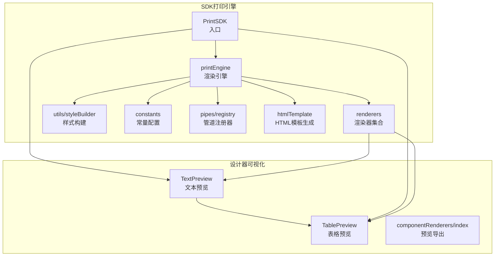
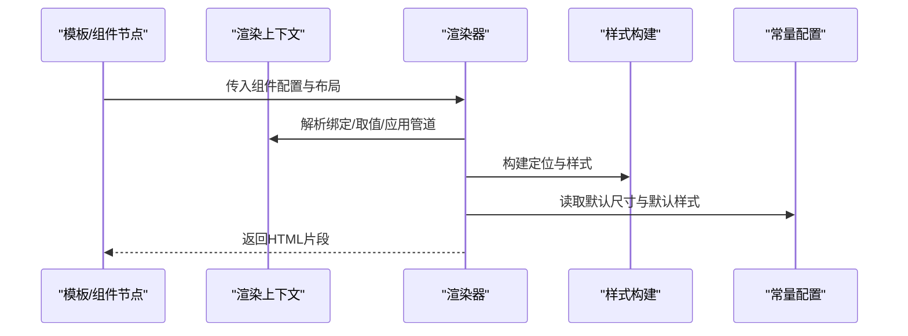
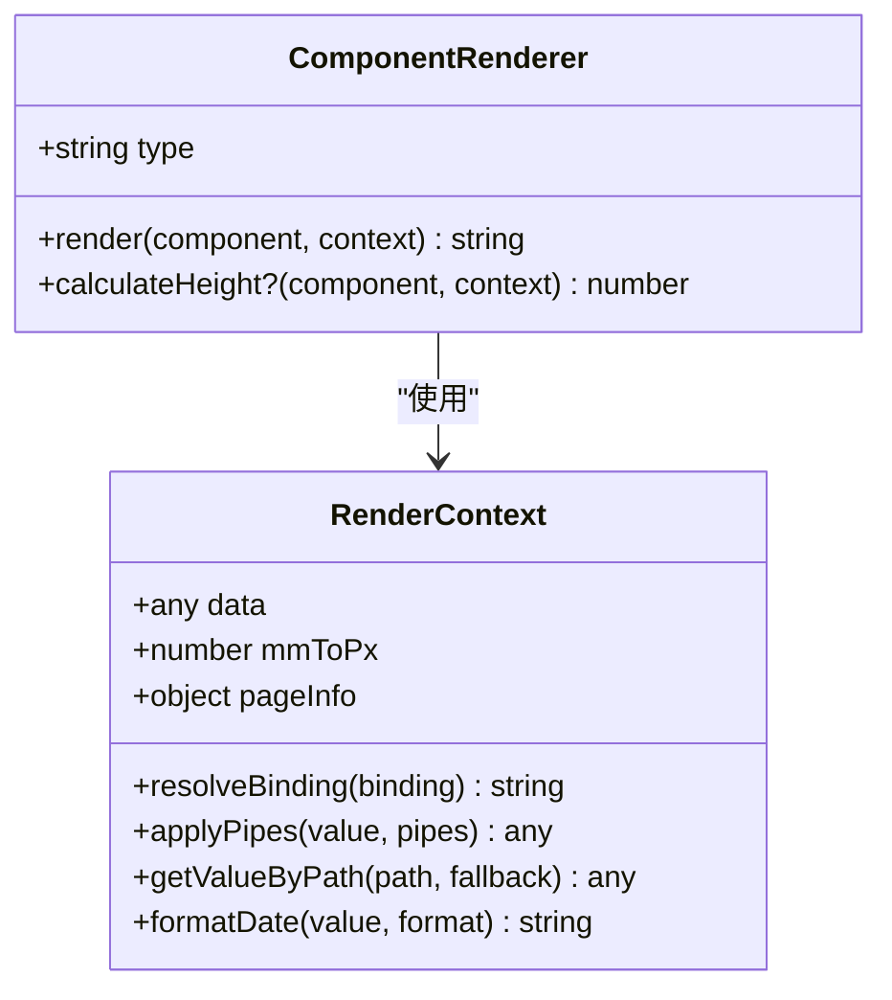
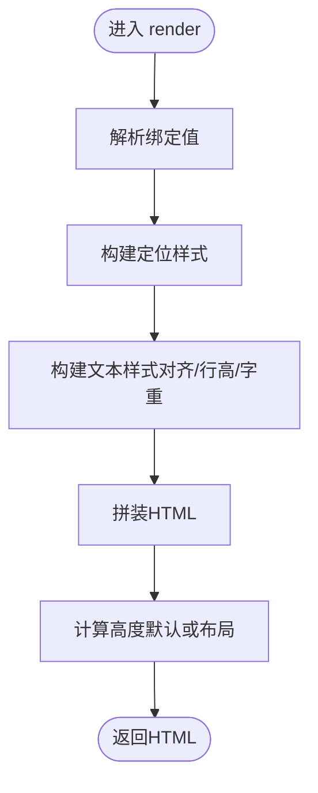
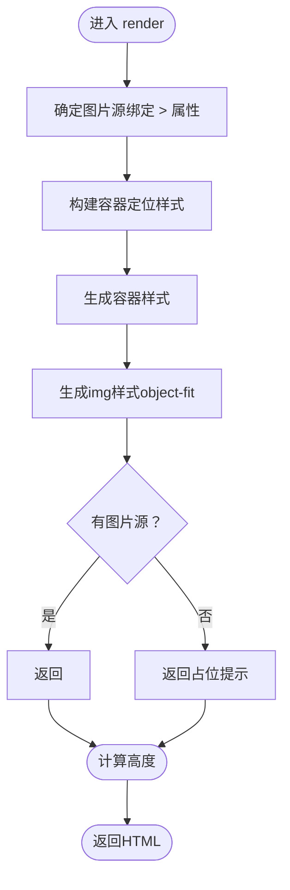
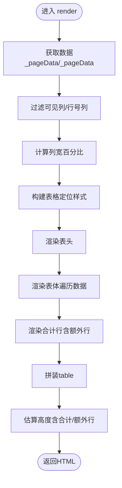
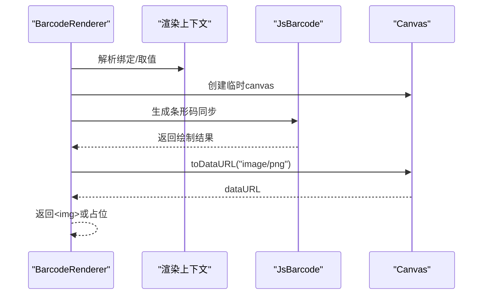
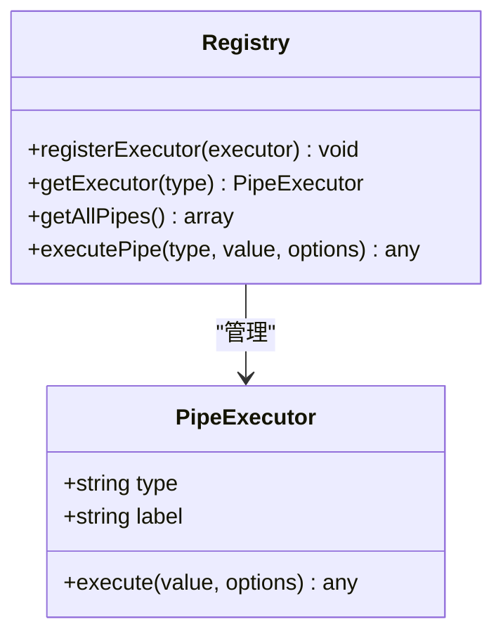
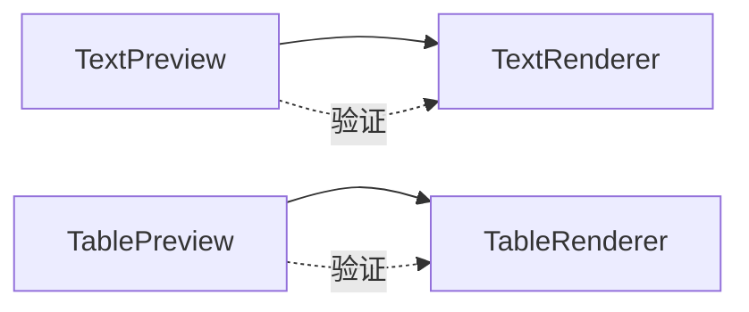
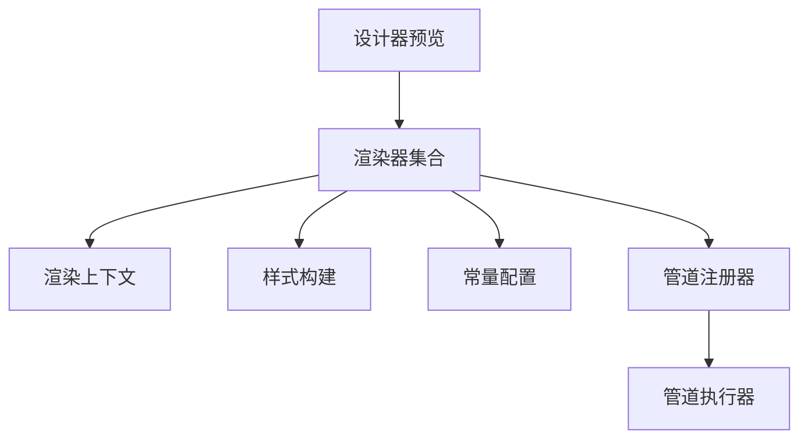

# 自定义渲染器开发

<cite>
**本文引用的文件**
- [renderers/index.ts](file://sdk/src/printEngine/renderers/index.ts)
- [TextRenderer.ts](file://sdk/src/printEngine/renderers/TextRenderer.ts)
- [ImageRenderer.ts](file://sdk/src/printEngine/renderers/ImageRenderer.ts)
- [TableRenderer.ts](file://sdk/src/printEngine/renderers/TableRenderer.ts)
- [BarcodeRenderer.ts](file://sdk/src/printEngine/renderers/BarcodeRenderer.ts)
- [types.ts](file://sdk/src/printEngine/types.ts)
- [constants.ts](file://sdk/src/printEngine/constants.ts)
- [styleBuilder.ts](file://sdk/src/printEngine/utils/styleBuilder.ts)
- [htmlTemplate.ts](file://sdk/src/printEngine/htmlTemplate.ts)
- [registry.ts](file://sdk/src/pipes/registry.ts)
- [ChineseNumberPipe.ts](file://sdk/src/pipes/executors/ChineseNumberPipe.ts)
- [CurrencyPipe.ts](file://sdk/src/pipes/executors/CurrencyPipe.ts)
- [designer TextPreview.tsx](file://designer/src/pages/Designer/components/Canvas/componentRenderers/TextPreview.tsx)
- [designer TablePreview.tsx](file://designer/src/pages/Designer/components/Canvas/componentRenderers/TablePreview.tsx)
- [designer componentRenderers/index.ts](file://designer/src/pages/Designer/components/Canvas/componentRenderers/index.ts)
- [SDK 入口](file://sdk/src/PrintSDK.ts)
- [SDK 打印引擎入口](file://sdk/src/printEngine.ts)
- [SDK 包配置](file://sdk/package.json)
- [设计器包配置](file://designer/package.json)
</cite>

## 目录
1. [简介](#简介)
2. [项目结构](#项目结构)
3. [核心组件](#核心组件)
4. [架构总览](#架构总览)
5. [详细组件分析](#详细组件分析)
6. [依赖关系分析](#依赖关系分析)
7. [性能考量](#性能考量)
8. [故障排除指南](#故障排除指南)
9. [结论](#结论)
10. [附录](#附录)

## 简介
本指南面向需要在现有打印系统中扩展“自定义渲染器”的开发者，目标是提供从零开始创建新组件渲染器的完整流程、模板与最佳实践。文档基于仓库中的打印引擎与渲染器实现，涵盖：
- 渲染器接口与职责边界
- 配置项定义与数据处理逻辑
- 输出格式规范与样式构建
- 测试、调试与性能优化建议
- 常见问题与故障排除
- 打包、发布与版本管理流程

## 项目结构
打印系统由两部分组成：
- SDK（打印引擎与渲染器）：负责将模板与数据渲染为可打印的 HTML，并提供样式模板与分页能力
- 设计器（可视化设计界面）：提供组件预览与交互，预览逻辑与渲染器保持一致

**图表来源**
- [renderers/index.ts:1-13](file://sdk/src/printEngine/renderers/index.ts#L1-L13)
- [styleBuilder.ts:1-54](file://sdk/src/printEngine/utils/styleBuilder.ts#L1-L54)
- [constants.ts:1-113](file://sdk/src/printEngine/constants.ts#L1-L113)
- [registry.ts:1-65](file://sdk/src/pipes/registry.ts#L1-L65)
- [htmlTemplate.ts:1-281](file://sdk/src/printEngine/htmlTemplate.ts#L1-L281)
- [designer componentRenderers/index.ts:1-11](file://designer/src/pages/Designer/components/Canvas/componentRenderers/index.ts#L1-L11)
- [designer TextPreview.tsx:1-31](file://designer/src/pages/Designer/components/Canvas/componentRenderers/TextPreview.tsx#L1-L31)
- [designer TablePreview.tsx:1-175](file://designer/src/pages/Designer/components/Canvas/componentRenderers/TablePreview.tsx#L1-L175)

**章节来源**
- [renderers/index.ts:1-13](file://sdk/src/printEngine/renderers/index.ts#L1-L13)
- [designer componentRenderers/index.ts:1-11](file://designer/src/pages/Designer/components/Canvas/componentRenderers/index.ts#L1-L11)

## 核心组件
- 渲染器接口：所有渲染器需实现统一接口，包含类型标识、渲染方法与可选高度计算
- 渲染上下文：提供数据解析、管道应用、路径取值、日期格式化、单位换算等能力
- 样式构建：提供样式对象到 CSS 字符串的转换与绝对定位样式生成
- 常量与默认值：统一管理组件默认尺寸、表格默认尺寸、样式默认值等
- 管道系统：通过注册器集中管理管道执行器，支持链式转换
- HTML 模板：生成打印页面样式与完整 HTML 文档

**章节来源**
- [types.ts:57-82](file://sdk/src/printEngine/types.ts#L57-L82)
- [types.ts:11-55](file://sdk/src/printEngine/types.ts#L11-L55)
- [styleBuilder.ts:13-53](file://sdk/src/printEngine/utils/styleBuilder.ts#L13-L53)
- [constants.ts:13-113](file://sdk/src/printEngine/constants.ts#L13-L113)
- [registry.ts:12-65](file://sdk/src/pipes/registry.ts#L12-L65)
- [htmlTemplate.ts:26-281](file://sdk/src/printEngine/htmlTemplate.ts#L26-L281)

## 架构总览
渲染器遵循“组件节点 -> 渲染上下文 -> HTML 片段”的标准流程，结合样式构建与常量配置，输出符合打印规范的 HTML。

**图表来源**
- [types.ts:11-55](file://sdk/src/printEngine/types.ts#L11-L55)
- [styleBuilder.ts:31-53](file://sdk/src/printEngine/utils/styleBuilder.ts#L31-L53)
- [constants.ts:13-92](file://sdk/src/printEngine/constants.ts#L13-L92)

## 详细组件分析

### 渲染器接口与职责
- 接口要求：type、render(component, context)、calculateHeight?(component, context)
- 上下文能力：resolveBinding、applyPipes、getValueByPath、formatDate、mmToPx、pageInfo
- 设计原则：单一职责、可扩展、可测试

**图表来源**
- [types.ts:61-82](file://sdk/src/printEngine/types.ts#L61-L82)
- [types.ts:11-55](file://sdk/src/printEngine/types.ts#L11-L55)

**章节来源**
- [types.ts:57-82](file://sdk/src/printEngine/types.ts#L57-L82)
- [types.ts:11-55](file://sdk/src/printEngine/types.ts#L11-L55)

### 文本渲染器（TextRenderer）
- 输入：组件布局、样式、属性与绑定
- 处理：解析绑定值、支持 label 前缀、计算定位样式、构建文本样式（flex 布局、对齐、行高）
- 输出：HTML div 片段
- 高度估算：使用默认高度或布局高度

**图表来源**
- [TextRenderer.ts:13-58](file://sdk/src/printEngine/renderers/TextRenderer.ts#L13-L58)

**章节来源**
- [TextRenderer.ts:10-59](file://sdk/src/printEngine/renderers/TextRenderer.ts#L10-L59)

### 图片渲染器（ImageRenderer）
- 输入：组件布局、样式、属性与绑定
- 处理：优先使用绑定值作为图片源，容器使用绝对定位，img 使用 object-fit 控制填充
- 输出：带容器的 img 或占位提示
- 高度估算：默认高度或布局高度

**图表来源**
- [ImageRenderer.ts:13-53](file://sdk/src/printEngine/renderers/ImageRenderer.ts#L13-L53)

**章节来源**
- [ImageRenderer.ts:10-54](file://sdk/src/printEngine/renderers/ImageRenderer.ts#L10-L54)

### 表格渲染器（TableRenderer）
- 输入：组件布局、样式、属性（列、边框、合计）、绑定数据
- 处理：列宽计算（均分/固定/溢出缩放）、表头/表体/合计行渲染、合计值计算（Decimal.js）、管道应用
- 输出：HTML table（包含 thead/tbody/tfoot）
- 高度估算：根据表头、行高、合计行与额外行估算

**图表来源**
- [TableRenderer.ts:150-327](file://sdk/src/printEngine/renderers/TableRenderer.ts#L150-L327)
- [TableRenderer.ts:51-125](file://sdk/src/printEngine/renderers/TableRenderer.ts#L51-L125)

**章节来源**
- [TableRenderer.ts:147-601](file://sdk/src/printEngine/renderers/TableRenderer.ts#L147-L601)

### 条形码渲染器（BarcodeRenderer）
- 输入：组件布局、属性（格式/内容）、绑定
- 处理：使用 JsBarcode 同步生成 canvas 并转为 base64，再以 img 嵌入
- 输出：img 或错误占位
- 高度估算：默认高度或布局高度

**图表来源**
- [BarcodeRenderer.ts:15-57](file://sdk/src/printEngine/renderers/BarcodeRenderer.ts#L15-L57)

**章节来源**
- [BarcodeRenderer.ts:12-62](file://sdk/src/printEngine/renderers/BarcodeRenderer.ts#L12-L62)

### 管道系统与注册器
- 注册器：集中注册与获取执行器，提供执行与枚举
- 内置执行器：日期、货币、金额、大写中文、切片、默认值、大小写等
- 使用方式：渲染器在需要时调用注册器获取执行器并执行

**图表来源**
- [registry.ts:12-65](file://sdk/src/pipes/registry.ts#L12-L65)
- [ChineseNumberPipe.ts:99-138](file://sdk/src/pipes/executors/ChineseNumberPipe.ts#L99-L138)
- [CurrencyPipe.ts:7-17](file://sdk/src/pipes/executors/CurrencyPipe.ts#L7-L17)

**章节来源**
- [registry.ts:1-65](file://sdk/src/pipes/registry.ts#L1-L65)
- [ChineseNumberPipe.ts:1-138](file://sdk/src/pipes/executors/ChineseNumberPipe.ts#L1-L138)
- [CurrencyPipe.ts:1-17](file://sdk/src/pipes/executors/CurrencyPipe.ts#L1-L17)

### 设计器预览一致性
- 文本预览：与渲染器一致的样式计算（对齐、flex、省略）
- 表格预览：列宽计算与拖拽调整列宽，与 SDK 保持一致

**图表来源**
- [designer TextPreview.tsx:10-30](file://designer/src/pages/Designer/components/Canvas/componentRenderers/TextPreview.tsx#L10-L30)
- [designer TablePreview.tsx:69-175](file://designer/src/pages/Designer/components/Canvas/componentRenderers/TablePreview.tsx#L69-L175)
- [TextRenderer.ts:13-58](file://sdk/src/printEngine/renderers/TextRenderer.ts#L13-L58)
- [TableRenderer.ts:150-327](file://sdk/src/printEngine/renderers/TableRenderer.ts#L150-L327)

**章节来源**
- [designer TextPreview.tsx:1-31](file://designer/src/pages/Designer/components/Canvas/componentRenderers/TextPreview.tsx#L1-L31)
- [designer TablePreview.tsx:1-175](file://designer/src/pages/Designer/components/Canvas/componentRenderers/TablePreview.tsx#L1-L175)

## 依赖关系分析
- 渲染器依赖：渲染上下文、样式构建工具、常量配置
- 管道依赖：注册器与执行器
- 设计器依赖：SDK 渲染器与预览组件保持一致

**图表来源**
- [renderers/index.ts:5-12](file://sdk/src/printEngine/renderers/index.ts#L5-L12)
- [types.ts:11-55](file://sdk/src/printEngine/types.ts#L11-L55)
- [styleBuilder.ts:13-53](file://sdk/src/printEngine/utils/styleBuilder.ts#L13-L53)
- [constants.ts:13-113](file://sdk/src/printEngine/constants.ts#L13-L113)
- [registry.ts:12-65](file://sdk/src/pipes/registry.ts#L12-L65)

**章节来源**
- [renderers/index.ts:1-13](file://sdk/src/printEngine/renderers/index.ts#L1-L13)

## 性能考量
- 样式构建：避免重复对象创建，合并样式键值
- 列宽计算：表格渲染前先计算列宽，减少运行时开销
- 合计计算：使用高精度库（Decimal.js）避免浮点误差，缓存中间结果
- 管道执行：尽量复用执行器实例，避免频繁注册
- 预览一致性：设计器与渲染器使用相同算法，减少差异导致的重排

[本节为通用指导，无需特定文件引用]

## 故障排除指南
- 表格宽度溢出：当 xMm + widthMm 超过右页边距时会自动调整并告警
- 表格位置错误：xMm 不得超过右页边距，否则会报错
- 表格宽度过小：小于阈值会被强制提升至最小宽度
- 合计计算异常：捕获异常并返回友好提示，避免中断渲染
- 条形码生成失败：回退为占位提示，避免空白影响排版

**章节来源**
- [TableRenderer.ts:195-234](file://sdk/src/printEngine/renderers/TableRenderer.ts#L195-L234)
- [TableRenderer.ts:223-228](file://sdk/src/printEngine/renderers/TableRenderer.ts#L223-L228)
- [TableRenderer.ts:429-439](file://sdk/src/printEngine/renderers/TableRenderer.ts#L429-L439)
- [BarcodeRenderer.ts:52-56](file://sdk/src/printEngine/renderers/BarcodeRenderer.ts#L52-L56)

## 结论
通过统一的渲染器接口、渲染上下文与样式构建工具，系统实现了可扩展、可维护的组件渲染体系。新增自定义渲染器只需遵循接口约定、合理使用上下文与工具函数，并在设计器中保持预览一致性即可快速集成。

[本节为总结性内容，无需特定文件引用]

## 附录

### 开发模板与最佳实践
- 新增渲染器步骤
  1) 定义类并实现接口：type、render、calculateHeight?
  2) 导出并在渲染器集合中注册
  3) 在设计器中提供预览组件，保持算法一致
- 配置项定义
  - 布局：xMm/yMm/widthMm/heightMm/zIndex
  - 样式：字体、颜色、对齐、边框等
  - 绑定：数据路径、管道链、回退值
  - 属性：组件特有参数（如表格列、条形码格式）
- 数据处理逻辑
  - 优先使用绑定值，其次使用属性值
  - 使用上下文解析路径与应用管道
  - 对外部输入进行安全校验（如 HTML 转义）
- 输出格式规范
  - 绝对定位：使用样式构建工具生成 left/top/width/height
  - 字体与对齐：flex 布局下的 justifyContent 映射
  - 表格：thead/tbody/tfoot 结构，单元格最小高度与边框
- 测试与调试
  - 单元测试：模拟渲染上下文，断言输出 HTML 片段
  - 预览对比：设计器预览与渲染器输出一致
  - 性能测试：大数据量表格的列宽计算与渲染耗时
- 打包、发布与版本管理
  - SDK 包配置：rollup 打包、tsconfig、入口导出
  - 设计器包配置：React/Vite 环境、样式与资源
  - 版本策略：语义化版本、变更日志、发布说明

**章节来源**
- [renderers/index.ts:5-12](file://sdk/src/printEngine/renderers/index.ts#L5-L12)
- [designer componentRenderers/index.ts:4-10](file://designer/src/pages/Designer/components/Canvas/componentRenderers/index.ts#L4-L10)
- [SDK 包配置](file://sdk/package.json)
- [设计器包配置](file://designer/package.json)