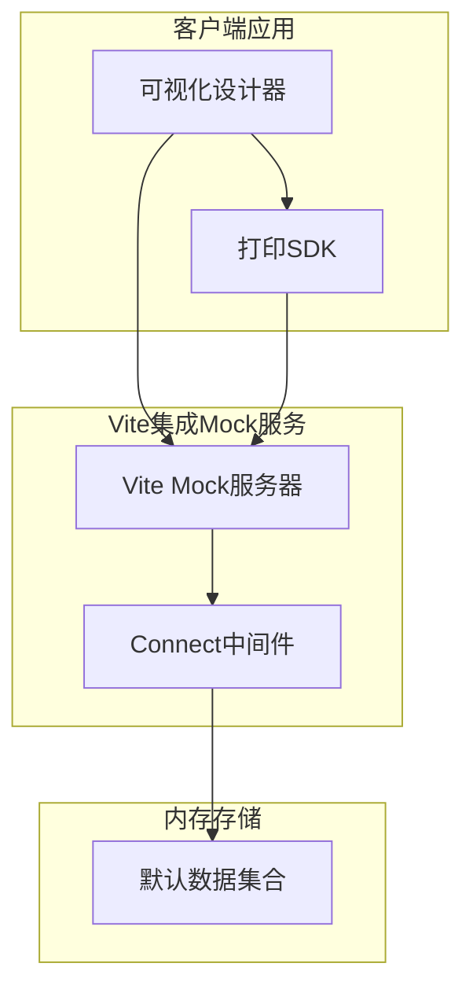
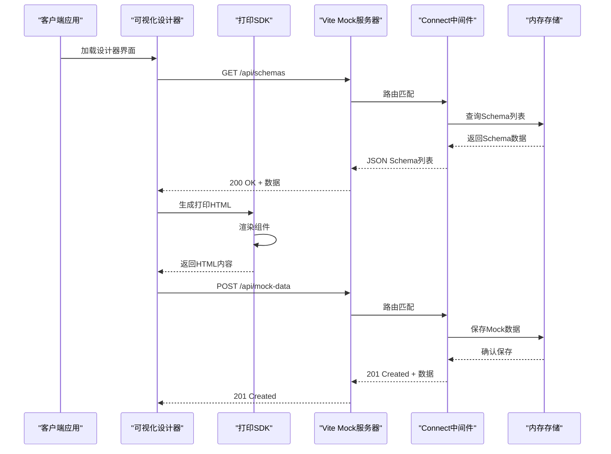
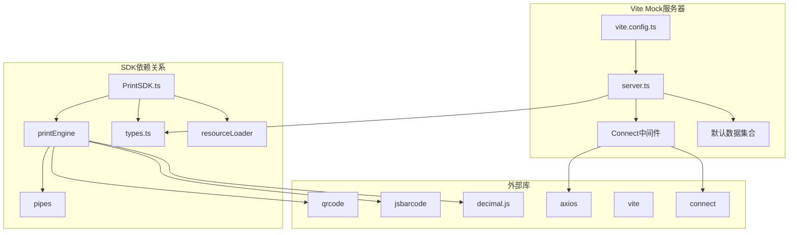

# API参考文档

<cite>
**本文档引用的文件**
- [api.ts](file://designer/src/services/api.ts)
- [index.ts](file://sdk/src/index.ts)
- [sdk.ts](file://sdk/src/sdk.ts)
- [PrintSDK.ts](file://sdk/src/PrintSDK.ts)
- [types.ts](file://sdk/src/types.ts)
- [server.ts](file://designer/mock/server.ts)
- [index.ts](file://designer/mock/index.ts)
- [vite.config.ts](file://designer/vite.config.ts)
- [types.ts](file://designer/mock/types.ts)
- [schemas.ts](file://designer/mock/schemas.ts)
- [templates.ts](file://designer/mock/templates.ts)
- [mockData.ts](file://designer/mock/mockData.ts)
- [package.json](file://sdk/package.json)
- [example.html](file://sdk/example.html)
- [README.md](file://README.md)
</cite>

## 更新摘要
**变更内容**
- 更新API架构说明，反映Vite集成mock服务器替代原有RESTful API
- 新增Mock服务器插件系统的技术细节
- 更新API客户端配置为动态baseURL和统一端点
- 添加Vite插件配置和mock服务器实现说明

## 目录
1. [简介](#简介)
2. [项目结构](#项目结构)
3. [核心组件](#核心组件)
4. [架构概览](#架构概览)
5. [详细组件分析](#详细组件分析)
6. [依赖关系分析](#依赖关系分析)
7. [性能考虑](#性能考虑)
8. [故障排除指南](#故障排除指南)
9. [结论](#结论)
10. [附录](#附录)

## 简介

打印服务平台是一个基于Web的可视化打印解决方案，包含三个主要组件：可视化设计器、打印SDK和集成的Mock数据服务。该平台提供了完整的打印模板设计、数据绑定和打印功能，支持多种组件类型、管道系统和高级打印特性。

**更新** 平台现已采用现代化的Vite集成mock服务器架构，替代了原有的独立RESTful API服务，提供更好的开发体验和性能表现。

## 项目结构

打印平台采用模块化架构，分为三个主要部分：



**图表来源**
- [api.ts:1-115](file://designer/src/services/api.ts#L1-L115)
- [server.ts:1-268](file://designer/mock/server.ts#L1-L268)
- [vite.config.ts:1-19](file://designer/vite.config.ts#L1-L19)

**章节来源**
- [README.md:191-234](file://README.md#L191-L234)

## 核心组件

### 设计器API服务

设计器通过统一的API客户端与Vite集成的Mock服务器进行通信，支持Schema、模板和Mock数据的CRUD操作。API客户端配置为动态baseURL，支持开发和生产环境的不同配置。

### 打印SDK

SDK提供独立的打印功能，无需配置即可使用，支持直接打印、预览打印和批量打印。SDK完全解耦设计，直接接收模板数据进行渲染。

### Vite集成Mock服务器

基于Vite插件系统的新一代Mock服务器，提供完整的CRUD API支持，包括Schema管理、模板管理和Mock数据管理。服务器从默认数据集合初始化内存存储，支持完整的RESTful API接口。

**章节来源**
- [api.ts:1-115](file://designer/src/services/api.ts#L1-L115)
- [server.ts:1-268](file://designer/mock/server.ts#L1-L268)
- [sdk.ts:1-63](file://sdk/src/sdk.ts#L1-L63)

## 架构概览



**图表来源**
- [api.ts:15-114](file://designer/src/services/api.ts#L15-L114)
- [server.ts:49-267](file://designer/mock/server.ts#L49-L267)

## 详细组件分析

### 设计器API接口规范

#### Schema管理API

| 接口 | 方法 | URL | 请求参数 | 响应数据 | 描述 |
|------|------|-----|----------|----------|------|
| Schema列表 | GET | `/api/schemas` | `name?: string` | `SchemaDictionary[]` | 获取Schema列表，支持按名称过滤 |
| Schema详情 | GET | `/api/schemas/:id` | 无 | `SchemaDictionary` | 获取指定Schema详情 |
| 创建Schema | POST | `/api/schemas` | `SchemaDictionary` | `SchemaDictionary` | 创建新的Schema |
| 更新Schema | PUT | `/api/schemas/:id` | `SchemaDictionary` | `SchemaDictionary` | 更新现有Schema |
| 删除Schema | DELETE | `/api/schemas/:id` | 无 | 204 No Content | 删除指定Schema |

**章节来源**
- [api.ts:26-50](file://designer/src/services/api.ts#L26-L50)
- [server.ts:79-130](file://designer/mock/server.ts#L79-L130)

#### 模板管理API

| 接口 | 方法 | URL | 请求参数 | 响应数据 | 描述 |
|------|------|-----|----------|----------|------|
| 模板列表 | GET | `/api/templates` | `name?: string`<br>`schemaId?: string` | `PrintTemplate[]` | 获取模板列表，支持多参数过滤 |
| 模板详情 | GET | `/api/templates/:id` | 无 | `PrintTemplate` | 获取指定模板详情 |
| 创建模板 | POST | `/api/templates` | `PrintTemplate` | `PrintTemplate` | 创建新的打印模板 |
| 更新模板 | PUT | `/api/templates/:id` | `PrintTemplate` | `PrintTemplate` | 更新现有模板 |
| 删除模板 | DELETE | `/api/templates/:id` | 无 | 204 No Content | 删除指定模板 |

**章节来源**
- [api.ts:56-80](file://designer/src/services/api.ts#L56-L80)
- [server.ts:132-186](file://designer/mock/server.ts#L132-L186)

#### Mock数据API

| 接口 | 方法 | URL | 请求参数 | 响应数据 | 描述 |
|------|------|-----|----------|----------|------|
| Mock数据列表 | GET | `/api/mock-data` | `name?: string`<br>`schemaId?: string`<br>`templateId?: string` | `MockData[]` | 获取Mock数据列表，支持多参数过滤 |
| Mock数据详情 | GET | `/api/mock-data/:id` | 无 | `MockData` | 获取指定Mock数据详情 |
| 创建Mock数据 | POST | `/api/mock-data` | `MockData` | `MockData` | 创建新的Mock数据 |
| 更新Mock数据 | PUT | `/api/mock-data/:id` | `MockData` | `MockData` | 更新现有Mock数据 |
| 删除Mock数据 | DELETE | `/api/mock-data/:id` | 无 | 204 No Content | 删除指定Mock数据 |

**章节来源**
- [api.ts:86-114](file://designer/src/services/api.ts#L86-L114)
- [server.ts:188-245](file://designer/mock/server.ts#L188-L245)

### SDK API方法参考

#### createPrintSDK方法

**功能描述**: 创建PrintSDK实例，无需任何配置参数，完全解耦设计。

**返回值**: `PrintSDK`实例对象

**使用示例**:
```typescript
import { createPrintSDK } from '@jcyao/print-sdk';

const sdk = createPrintSDK();
```

**章节来源**
- [sdk.ts:6-7](file://sdk/src/sdk.ts#L6-L7)
- [index.ts:12-12](file://sdk/src/index.ts#L12-L12)

#### PrintSDK类方法

##### print方法

**功能描述**: 执行打印操作，支持直接打印和预览打印两种模式。

**参数**:
- `options`: `PrintOptions`接口
  - `template`: `PrintTemplate` - 打印模板数据
  - `data`: `any` - 打印数据对象
  - `preview`: `boolean` - 是否预览模式（默认false）

**返回值**: `Promise<void>`

**异常处理**:
- 预览模式无法打开新窗口时抛出错误
- iframe文档访问失败时抛出错误

**章节来源**
- [PrintSDK.ts:81-143](file://sdk/src/PrintSDK.ts#L81-L143)

##### printDirect方法

**功能描述**: 快捷打印方法，直接打印模式。

**参数**:
- `template`: `PrintTemplate` - 打印模板数据
- `data`: `any` - 打印数据对象

**返回值**: `Promise<void>`

**章节来源**
- [PrintSDK.ts:150-152](file://sdk/src/PrintSDK.ts#L150-L152)

##### printWithPreview方法

**功能描述**: 快捷预览打印方法，预览模式。

**参数**:
- `template`: `PrintTemplate` - 打印模板数据
- `data`: `any` - 打印数据对象

**返回值**: `Promise<void>`

**章节来源**
- [PrintSDK.ts:159-161](file://sdk/src/PrintSDK.ts#L159-L161)

##### generateHTML方法

**功能描述**: 仅生成HTML内容，不执行打印操作。

**参数**:
- `template`: `PrintTemplate` - 打印模板数据
- `data`: `any` - 打印数据对象

**返回值**: `Promise<string>` - HTML字符串

**章节来源**
- [PrintSDK.ts:169-172](file://sdk/src/PrintSDK.ts#L169-L172)

##### printMultiple方法

**功能描述**: 批量打印方法，支持同模板多数据的批量处理。

**参数**:
- `template`: `PrintTemplate` - 打印模板数据
- `dataList`: `any[]` - 数据对象数组
- `options`: `BatchPrintOptions` - 批量打印选项
  - `preview`: `boolean` - 是否预览模式（默认false）
  - `onProgress`: `(progress: BatchPrintProgress) => void` - 进度回调函数

**返回值**: `Promise<void>`

**进度对象结构**:
- `total`: `number` - 总任务数
- `completed`: `number` - 已完成数
- `failed`: `number` - 失败数
- `currentIndex`: `number` - 当前处理的索引（-1表示未开始/已结束）

**章节来源**
- [PrintSDK.ts:181-289](file://sdk/src/PrintSDK.ts#L181-L289)

### 数据模型定义

#### SchemaDictionary接口

| 字段 | 类型 | 必填 | 描述 |
|------|------|------|------|
| id | `string` | 是 | Schema唯一标识符 |
| name | `string` | 是 | Schema名称 |
| rootType | `'object' \| 'array'` | 是 | 根类型（对象或数组） |
| root | `SchemaField` | 是 | 根字段定义 |
| version | `string` | 否 | 版本号 |
| description | `string` | 否 | 描述信息 |

#### PrintTemplate接口

| 字段 | 类型 | 必填 | 描述 |
|------|------|------|------|
| id | `string` | 是 | 模板唯一标识符 |
| name | `string` | 是 | 模板名称 |
| version | `string` | 是 | 模板版本 |
| description | `string` | 否 | 模板描述 |
| schemaId | `string` | 是 | 关联的Schema ID |
| page | `PageConfig` | 是 | 页面配置 |
| layoutMode | `'absolute' \| 'flow'` | 是 | 布局模式 |
| components | `ComponentNode[]` | 是 | 组件列表 |

#### ComponentNode接口

| 字段 | 类型 | 必填 | 描述 |
|------|------|------|------|
| id | `string` | 是 | 组件唯一标识符 |
| type | `ComponentType` | 是 | 组件类型 |
| layout | `LayoutConfig` | 是 | 布局配置 |
| style | `Record<string, any>` | 否 | 样式配置 |
| binding | `DataBinding` | 否 | 数据绑定配置 |
| props | `Record<string, any>` | 否 | 组件属性 |
| children | `ComponentNode[]` | 否 | 子组件列表 |

**章节来源**
- [types.ts:21-171](file://sdk/src/types.ts#L21-L171)

## 依赖关系分析



**图表来源**
- [package.json:49-53](file://sdk/package.json#L49-L53)
- [vite.config.ts:1-19](file://designer/vite.config.ts#L1-L19)
- [server.ts:5-9](file://designer/mock/server.ts#L5-L9)

**章节来源**
- [package.json:1-60](file://sdk/package.json#L1-L60)
- [vite.config.ts:1-19](file://designer/vite.config.ts#L1-L19)

## 性能考虑

### 打印性能优化

1. **图片资源管理**: SDK提供图片加载等待功能，确保所有图片资源加载完成后再执行打印
2. **批量打印优化**: 批量打印时会合并HTML内容，减少多次打印的开销
3. **内存管理**: 打印完成后及时清理iframe元素，避免内存泄漏

### Mock服务器性能优化

1. **内存存储**: 使用内存存储替代数据库，提供更快的读写性能
2. **默认数据初始化**: 从默认数据集合初始化，减少首次启动时间
3. **CORS优化**: 统一设置CORS头部，避免预检请求开销
4. **路由匹配**: 使用正则表达式进行高效的路由匹配

### API性能优化

1. **查询过滤**: 支持多参数过滤查询，减少不必要的数据传输
2. **分页处理**: 大数据量时建议使用分页查询
3. **缓存策略**: 设计器端可以实现适当的缓存机制

### 内存优化

1. **无状态设计**: SDK完全无状态，避免内存累积
2. **及时清理**: 打印完成后自动清理DOM元素
3. **资源释放**: 及时释放图片和二维码等资源

## 故障排除指南

### 常见错误处理

#### Mock服务器错误

| 错误码 | HTTP状态码 | 描述 | 处理建议 |
|--------|------------|------|----------|
| `NOT_FOUND` | 404 | 资源未找到 | 确认ID是否正确，检查内存存储状态 |
| `INTERNAL_ERROR` | 500 | 服务器内部错误 | 检查Vite插件配置，查看控制台错误日志 |

#### 客户端错误

| 错误类型 | 描述 | 处理建议 |
|----------|------|----------|
| `Failed to open print window` | 预览窗口无法打开 | 检查浏览器弹窗设置，允许弹窗 |
| `Failed to access iframe document` | iframe文档访问失败 | 检查同源策略，确保域名一致 |

#### 打印错误

| 错误类型 | 描述 | 处理建议 |
|----------|------|----------|
| `图片加载失败` | 外部图片无法加载 | 检查图片URL，使用base64编码 |
| `数据绑定错误` | 数据路径不存在 | 检查Schema配置和数据结构 |
| `模板解析错误` | 模板格式不正确 | 验证模板JSON格式 |

**章节来源**
- [server.ts:94-128](file://designer/mock/server.ts#L94-L128)
- [PrintSDK.ts:89-110](file://sdk/src/PrintSDK.ts#L89-L110)

### 调试建议

1. **启用详细日志**: 在开发环境中启用详细的控制台日志
2. **检查网络请求**: 使用浏览器开发者工具检查API请求和响应
3. **验证数据结构**: 确保传递给SDK的数据结构符合Schema定义
4. **测试环境隔离**: 在独立的测试环境中验证打印功能
5. **Mock服务器监控**: 查看Vite插件控制台输出，确认Mock服务器正常启动

### 性能监控

1. **打印时间监控**: 记录从生成HTML到完成打印的时间
2. **内存使用监控**: 监控iframe和DOM元素的内存使用情况
3. **错误率统计**: 统计各种错误的发生频率和类型
4. **Mock服务器性能**: 监控内存存储的读写性能

## 结论

打印服务平台提供了完整的打印解决方案，具有以下特点：

1. **现代化架构**: 采用Vite集成mock服务器，替代传统RESTful API，提供更好的开发体验
2. **模块化设计**: 清晰的模块划分，便于维护和扩展
3. **无状态架构**: SDK完全无状态，易于集成和部署
4. **丰富的功能**: 支持多种组件类型、管道系统和高级打印特性
5. **优秀的性能**: 优化的渲染和打印流程，支持批量处理
6. **完善的错误处理**: 全面的错误处理机制和调试支持

该平台适合需要在Web环境中实现复杂打印需求的应用场景，特别是需要可视化模板设计和灵活数据绑定的业务系统。

## 附录

### API调用示例

#### 基础打印调用

```typescript
import { createPrintSDK } from '@jcyao/print-sdk';

const sdk = createPrintSDK();

// 直接打印
await sdk.print({
  template: templateData,
  data: businessData,
  preview: false
});

// 预览打印
await sdk.print({
  template: templateData,
  data: businessData,
  preview: true
});
```

#### 批量打印调用

```typescript
const dataList = [data1, data2, data3, data4, data5];

await sdk.printMultiple(templateData, dataList, {
  preview: true,
  onProgress: (progress) => {
    console.log(`进度: ${progress.completed}/${progress.total}`);
  }
});
```

### Mock服务器配置

#### Vite插件配置

```typescript
import { defineConfig } from 'vite'
import react from '@vitejs/plugin-react'
import path from 'path'
import { mockServerPlugin } from './mock/server'

export default defineConfig({
  plugins: [
    react(),
    mockServerPlugin(),  // Mock API 服务插件
  ],
  resolve: {
    alias: {
      // 本地 SDK 路径映射，用于开发和调试
      '@jcyao/print-sdk': path.resolve(__dirname, '../sdk/src/index.ts'),
    },
  },
})
```

#### API客户端配置

```typescript
/**
 * 后端 API 基础地址
 * 开发环境：使用 Vite 集成的 Mock API（同源，无需指定域名）
 * 生产环境：可通过环境变量 VITE_API_BASE_URL 配置
 */
const API_BASE_URL = import.meta.env.VITE_API_BASE_URL || '/api';

/**
 * Axios 实例配置
 * 统一设置 baseURL 和请求头
 */
const apiClient = axios.create({
  baseURL: API_BASE_URL,
  headers: {
    'Content-Type': 'application/json',
  },
})
```

### 参数验证规则

1. **必填字段验证**: 所有接口的必填字段必须提供
2. **数据类型验证**: 确保数据类型与接口定义一致
3. **范围验证**: 对数值类型的字段进行范围检查
4. **格式验证**: 对特殊格式的字段进行格式校验

### 最佳实践

1. **模板设计**: 在设计器中充分测试模板效果
2. **数据准备**: 确保业务数据结构与Schema定义一致
3. **错误处理**: 实现完善的错误处理和用户反馈
4. **性能优化**: 在大数据量场景下考虑分批处理
5. **兼容性测试**: 在不同浏览器环境下测试打印功能
6. **Mock服务器使用**: 利用集成的Mock服务器进行快速原型开发