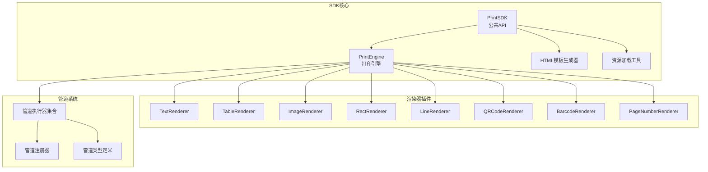
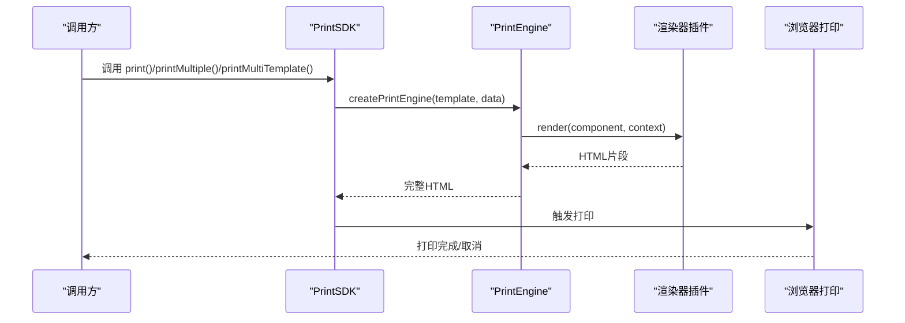
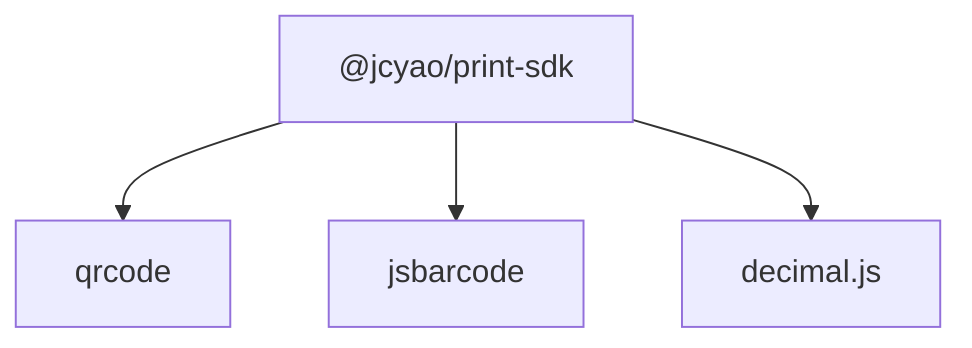

# API参考文档

<cite>
**本文档引用的文件**
- [PrintSDK.ts](file://sdk/src/PrintSDK.ts)
- [sdk.ts](file://sdk/src/sdk.ts)
- [types.ts](file://sdk/src/types.ts)
- [index.ts](file://sdk/src/index.ts)
- [printEngine.ts](file://sdk/src/printEngine.ts)
- [renderers/index.ts](file://sdk/src/printEngine/renderers/index.ts)
- [TextRenderer.ts](file://sdk/src/printEngine/renderers/TextRenderer.ts)
- [pipes/index.ts](file://sdk/src/pipes/index.ts)
- [executors/index.ts](file://sdk/src/pipes/executors/index.ts)
- [htmlTemplate.ts](file://sdk/src/printEngine/htmlTemplate.ts)
- [types.ts](file://sdk/src/printEngine/types.ts)
- [constants.ts](file://sdk/src/printEngine/constants.ts)
- [resourceLoader.ts](file://sdk/src/utils/resourceLoader.ts)
- [package.json](file://sdk/package.json)
- [README.md](file://README.md)
</cite>

## 目录
1. [简介](#简介)
2. [项目结构](#项目结构)
3. [核心组件](#核心组件)
4. [架构概览](#架构概览)
5. [详细组件分析](#详细组件分析)
6. [依赖分析](#依赖分析)
7. [性能考虑](#性能考虑)
8. [故障排除指南](#故障排除指南)
9. [结论](#结论)
10. [附录](#附录)

## 简介
本文件为打印服务平台的完整API参考文档，聚焦于PrintSDK类及其相关组件的公开接口，涵盖以下内容：
- PrintSDK类的所有公共方法：print、printBatch、printMultiTemplate等核心API的参数定义、返回值类型与使用示例
- 渲染器接口、管道执行器接口与管道配置器接口的完整规范
- 打印引擎与HTML模板生成器的内部机制说明
- 错误处理策略、认证方法与安全考虑
- 协议特定示例、调试工具与监控方法
- 迁移指南与向后兼容性说明

本SDK采用纯客户端实现，无需配置与外部服务依赖，支持浏览器打印与批量打印，并提供插件化渲染器与管道系统。

**章节来源**
- [README.md: 318-337:318-337](file://README.md#L318-L337)

## 项目结构
SDK采用模块化设计，核心目录与职责如下：
- sdk/src/PrintSDK.ts：PrintSDK类与公共API入口
- sdk/src/printEngine.ts：打印引擎核心，负责数据绑定、管道转换与虚拟分页
- sdk/src/printEngine/renderers/*：组件渲染器插件（文本、表格、图片、矩形、线条、二维码、条形码、页码）
- sdk/src/pipes/*：管道系统（执行器、注册器、类型定义）
- sdk/src/printEngine/htmlTemplate.ts：HTML与样式生成器
- sdk/src/printEngine/types.ts：渲染上下文与接口定义
- sdk/src/printEngine/constants.ts：常量配置（单位换算、默认尺寸、样式默认值等）
- sdk/src/utils/resourceLoader.ts：资源加载工具（图片、二维码、条形码等异步资源）
- sdk/src/types.ts：全局类型定义（模板、组件、数据绑定、页码配置等）

**图表来源**
- [sdk.ts: 6-66:6-66](file://sdk/src/sdk.ts#L6-L66)
- [printEngine.ts: 15-28:15-28](file://sdk/src/printEngine.ts#L15-L28)
- [renderers/index.ts: 1-13:1-13](file://sdk/src/printEngine/renderers/index.ts#L1-L13)
- [pipes/index.ts: 1-9:1-9](file://sdk/src/pipes/index.ts#L1-L9)

**章节来源**
- [README.md: 369-406:369-406](file://README.md#L369-L406)

## 核心组件
本节概述PrintSDK类及其相关组件的职责与交互关系。

- PrintSDK：提供打印、批量打印、多模板打印等API，内部通过PrintEngine生成HTML并触发浏览器打印
- PrintEngine：负责数据绑定、管道转换、组件渲染与虚拟分页计算
- 渲染器插件：实现ComponentRenderer接口，将组件节点渲染为HTML字符串
- 管道系统：提供数据转换能力（日期、货币、金额、中文大写、大小写、截取、默认值等）
- HTML模板生成器：生成打印页面样式与完整HTML文档
- 资源加载工具：等待图片、二维码、条形码等异步资源加载完成

**章节来源**
- [sdk.ts: 6-66:6-66](file://sdk/src/sdk.ts#L6-L66)
- [printEngine.ts: 30-72:30-72](file://sdk/src/printEngine.ts#L30-L72)
- [types.ts: 57-82:57-82](file://sdk/src/printEngine/types.ts#L57-L82)

## 架构概览
PrintSDK通过PrintEngine将模板与数据转换为可打印的HTML文档，再通过浏览器打印API输出。渲染器插件化设计便于扩展新组件类型，管道系统提供数据格式化能力。

**图表来源**
- [PrintSDK.ts: 110-172:110-172](file://sdk/src/PrintSDK.ts#L110-L172)
- [printEngine.ts: 196-213:196-213](file://sdk/src/printEngine.ts#L196-L213)

**章节来源**
- [PrintSDK.ts: 100-468:100-468](file://sdk/src/PrintSDK.ts#L100-L468)
- [printEngine.ts: 30-191:30-191](file://sdk/src/printEngine.ts#L30-L191)

## 详细组件分析

### PrintSDK类API参考
PrintSDK提供以下公共方法，均返回Promise<void>或Promise<string>，具体行为取决于方法用途。

- print(options: PrintOptions): Promise<void>
  - 功能：执行打印或预览
  - 参数：
    - template: PrintTemplate（模板数据）
    - data: any（打印数据）
    - preview?: boolean（是否预览，默认false）
  - 返回：Promise<void>
  - 行为：预览模式打开新窗口；直接打印模式在隐藏iframe中打印，等待图片资源加载后触发打印
  - 异常：无法打开打印窗口或访问iframe文档时抛出错误
  - 使用示例路径：[PrintSDK.ts: 110-172:110-172](file://sdk/src/PrintSDK.ts#L110-L172)

- printDirect(template: PrintTemplate, data: any): Promise<void>
  - 功能：快捷打印（不预览）
  - 参数：template与data
  - 返回：Promise<void>
  - 使用示例路径：[PrintSDK.ts: 179-181:179-181](file://sdk/src/PrintSDK.ts#L179-L181)

- printWithPreview(template: PrintTemplate, data: any): Promise<void>
  - 功能：预览后打印
  - 参数：template与data
  - 返回：Promise<void>
  - 使用示例路径：[PrintSDK.ts: 188-190:188-190](file://sdk/src/PrintSDK.ts#L188-L190)

- generateHTML(template: PrintTemplate, data: any): Promise<string>
  - 功能：仅生成HTML（不打印）
  - 参数：template与data
  - 返回：Promise<string>（HTML字符串）
  - 使用示例路径：[PrintSDK.ts: 198-201:198-201](file://sdk/src/PrintSDK.ts#L198-L201)

- printMultiple(template: PrintTemplate, dataList: any[], options?: BatchPrintOptions): Promise<void>
  - 功能：同模板多数据批量打印（一次确认）
  - 参数：
    - template：模板数据
    - dataList：数据数组
    - options.preview?: boolean
    - options.onProgress?: (progress: BatchPrintProgress) => void
  - 返回：Promise<void>
  - 行为：逐条生成HTML片段，提取<body>内容，组装完整文档，支持预览与直接打印
  - 进度回调：BatchPrintProgress包含total、completed、failed、currentIndex
  - 使用示例路径：[PrintSDK.ts: 210-322:210-322](file://sdk/src/PrintSDK.ts#L210-L322)

- printMultiTemplate(groups: PrintTemplateGroup[], options?: MultiTemplatePrintOptions): Promise<void>
  - 功能：多模板批量打印（一次确认）
  - 参数：
    - groups：PrintTemplateGroup[]（模板+数据组）
    - options.preview?: boolean
    - options.onProgress?: (progress: MultiTemplatePrintProgress) => void
  - 返回：Promise<void>
  - 行为：遍历各模板与数据，生成HTML片段，统一组装后打印
  - 进度回调：MultiTemplatePrintProgress包含totalGroups、completedGroups、totalDataItems、completedDataItems、failed、currentGroupIndex、currentDataIndex
  - 使用示例路径：[PrintSDK.ts: 332-467:332-467](file://sdk/src/PrintSDK.ts#L332-L467)

- createPrintSDK(): PrintSDK
  - 功能：创建SDK实例（无需配置）
  - 返回：PrintSDK实例
  - 使用示例路径：[PrintSDK.ts: 474-476:474-476](file://sdk/src/PrintSDK.ts#L474-L476)

**章节来源**
- [PrintSDK.ts: 47-98:47-98](file://sdk/src/PrintSDK.ts#L47-L98)
- [PrintSDK.ts: 100-476:100-476](file://sdk/src/PrintSDK.ts#L100-L476)

### 渲染器接口规范
- ComponentRenderer接口
  - type: string（组件类型标识）
  - render(component: ComponentNode, context: RenderContext): string
  - calculateHeight?(component: ComponentNode, context: RenderContext): number（可选）
- RenderContext上下文
  - data: any（业务数据）
  - resolveBinding(binding): string
  - applyPipes(value, pipes?): any
  - getValueByPath(path, fallback?): any
  - formatDate(value, format): string
  - mmToPx: number（单位换算系数）
  - pageInfo?: { widthMm, heightMm, marginMm }

- TextRenderer示例
  - type: 'text'
  - render：根据布局与样式生成文本HTML
  - calculateHeight：返回组件高度（mm）

**章节来源**
- [types.ts: 57-82:57-82](file://sdk/src/printEngine/types.ts#L57-L82)
- [types.ts: 11-55:11-55](file://sdk/src/printEngine/types.ts#L11-L55)
- [TextRenderer.ts: 10-59:10-59](file://sdk/src/printEngine/renderers/TextRenderer.ts#L10-L59)

### 管道执行器与配置器接口规范
- 管道执行器（PipeExecutor）
  - type: string（管道类型）
  - label: string（显示名称）
  - execute(value: any, options?: Record<string, any>): any
- 内置执行器
  - uppercase、lowercase、slice、default（简单管道）
  - DatePipe、CurrencyPipe、MoneyPipe、ChineseNumberPipe（复杂管道）
- 管道配置器（UI）
  - 设计器提供可视化配置器，用于DatePipe、CurrencyPipe、MoneyPipe、ChineseNumberPipe等

**章节来源**
- [executors/index.ts: 16-44:16-44](file://sdk/src/pipes/executors/index.ts#L16-L44)
- [executors/index.ts: 6-10:6-10](file://sdk/src/pipes/executors/index.ts#L6-L10)
- [pipes/index.ts: 1-9:1-9](file://sdk/src/pipes/index.ts#L1-L9)

### HTML模板生成器
- generatePrintPageStyles(config: PrintStyleConfig): string
  - 生成预览模式页面样式（标准分页与连续纸）
- generateBatchPrintStyles(config: PrintStyleConfig): string
  - 生成批量打印样式（直接打印模式）
- generatePrintHTML(options: { title, styles, bodyContent }): string
  - 生成完整HTML文档
- getPageSizeFromConfig(page: PageConfig): { widthMm, heightMm }
  - 从页面配置提取尺寸信息

**章节来源**
- [htmlTemplate.ts: 81-279:81-279](file://sdk/src/printEngine/htmlTemplate.ts#L81-L279)

### 数据模型与类型定义
- PrintTemplate：模板结构（id、name、version、schemaId、page、layoutMode、components、headerComponents、footerComponents）
- ComponentNode：组件节点（id、type、layout、style、binding、props、children、_section）
- DataBinding：数据绑定（path、pipes、fallback）
- PipeConfig：管道配置（type、options）
- PageConfig：页面配置（size、widthMm、heightMm、orientation、marginMm、pageNumber、headerEnabled、headerHeight、footerEnabled、footerHeight）
- PageNumberConfig：页码配置（enabled、position、format、prefix、suffix、separator、offsetX、offsetY、style）
- TableProps、TableColumn、TablePaginationConfig、TableColumnSummary、SummaryExtraRow等表格相关类型

**章节来源**
- [types.ts: 48-227:48-227](file://sdk/src/types.ts#L48-L227)

### 资源加载与等待工具
- waitForImagesLoaded(doc: Document, timeout?: number): Promise<void>
  - 等待文档中所有图片加载完成，支持超时与错误统计
- waitForPrintResourcesReady(doc: Document, timeout?: number): Promise<void>
  - 等待打印所需资源（目前主要等待图片）

**章节来源**
- [resourceLoader.ts: 12-89:12-89](file://sdk/src/utils/resourceLoader.ts#L12-L89)

## 依赖分析
SDK对外部依赖较少，核心依赖包括：
- qrcode：二维码生成
- jsbarcode：条形码生成
- decimal.js：高精度数值计算

**图表来源**
- [package.json: 49-53:49-53](file://sdk/package.json#L49-L53)

**章节来源**
- [package.json: 1-61:1-61](file://sdk/package.json#L1-L61)

## 性能考虑
- 虚拟分页与相对间距模型：按设计时相对间距累加高度，支持表格跨页拆分与表头重复，减少布局抖动
- 渲染后测量：表格行高与表头、合计行高度通过真实DOM测量，避免估算误差导致的分页截断
- 资源加载等待：图片、二维码、条形码等异步资源加载完成后才触发打印，保证打印质量
- 连续纸模式：宽度固定、高度不限，适合卷式票据打印
- iframe生命周期：监听afterprint事件并在5秒后兜底清理，避免内存泄漏

**章节来源**
- [printEngine.ts: 418-620:418-620](file://sdk/src/printEngine.ts#L418-L620)
- [resourceLoader.ts: 12-89:12-89](file://sdk/src/utils/resourceLoader.ts#L12-L89)
- [PrintSDK.ts: 156-171:156-171](file://sdk/src/PrintSDK.ts#L156-L171)

## 故障排除指南
- 打印窗口无法打开
  - 现象：调用printWithPreview时报错
  - 原因：浏览器阻止弹窗或禁用新窗口
  - 处理：检查浏览器设置，允许弹窗；或改为printDirect模式
  - 参考：[PrintSDK.ts: 114-127:114-127](file://sdk/src/PrintSDK.ts#L114-L127)
- iframe文档访问失败
  - 现象：无法访问iframe.contentWindow.document
  - 原因：跨域或安全策略限制
  - 处理：确保同源策略，或在受信任环境下使用
  - 参考：[PrintSDK.ts: 136-143:136-143](file://sdk/src/PrintSDK.ts#L136-L143)
- 图片加载超时或失败
  - 现象：waitForImagesLoaded超时或部分图片加载失败
  - 处理：检查图片URL有效性、网络状况与CORS策略；适当提高timeout
  - 参考：[resourceLoader.ts: 23-72:23-72](file://sdk/src/utils/resourceLoader.ts#L23-L72)
- 表格分页异常
  - 现象：表格被截断或跨页后定位错误
  - 处理：确认表格数据与列宽配置；使用渲染后测量方案；避免组件重叠导致的布局异常
  - 参考：[printEngine.ts: 762-800:762-800](file://sdk/src/printEngine.ts#L762-L800)
- 页头/页脚高度计算
  - 现象：页头/页脚高度变化导致分页不准确
  - 处理：使用contentTop/contentBottom边界计算，确保header/footer高度参与分页
  - 参考：[printEngine.ts: 426-445:426-445](file://sdk/src/printEngine.ts#L426-L445)

**章节来源**
- [PrintSDK.ts: 114-171:114-171](file://sdk/src/PrintSDK.ts#L114-L171)
- [resourceLoader.ts: 23-72:23-72](file://sdk/src/utils/resourceLoader.ts#L23-L72)
- [printEngine.ts: 426-445:426-445](file://sdk/src/printEngine.ts#L426-L445)
- [printEngine.ts: 762-800:762-800](file://sdk/src/printEngine.ts#L762-L800)

## 结论
本SDK提供了完整的客户端打印解决方案，具备以下优势：
- 无状态、解耦设计，无需配置与外部服务
- 插件化渲染器与管道系统，易于扩展与定制
- 高精度分页与表格跨页拆分，满足复杂打印场景
- 批量打印与多模板打印，提升批量处理效率
- 资源加载等待与打印生命周期管理，保障打印质量与稳定性

建议在生产环境中结合业务场景选择合适的打印模式（预览/直接打印），并合理配置页头/页脚与表格参数，以获得最佳打印效果。

[无章节来源——本节为总结性内容]

## 附录

### API使用示例路径
- 打印：[PrintSDK.ts: 110-172:110-172](file://sdk/src/PrintSDK.ts#L110-L172)
- 仅生成HTML：[PrintSDK.ts: 198-201:198-201](file://sdk/src/PrintSDK.ts#L198-L201)
- 批量打印：[PrintSDK.ts: 210-322:210-322](file://sdk/src/PrintSDK.ts#L210-L322)
- 多模板批量打印：[PrintSDK.ts: 332-467:332-467](file://sdk/src/PrintSDK.ts#L332-L467)

### 迁移指南与向后兼容性
- v1.5.0：页头/页脚功能增强，分页精度提升，连续纸模式下自动禁用页头/页脚
  - 影响：旧模板若使用页头/页脚，需重新评估高度与布局
  - 参考：[README.md: 25-42:25-42](file://README.md#L25-L42)
- v1.4.0：表格列宽自定义、行号列宽度自定义、表格边框自定义
  - 影响：表格组件新增width、borderStyle、borderColor、borderWidth等属性
  - 参考：[README.md: 46-64:46-64](file://README.md#L46-L64)
- v1.3.0：表格合计额外行、行号列
  - 影响：表格组件新增summaryExtraRows、showRowNumber等属性
  - 参考：[README.md: 68-82:68-82](file://README.md#L68-L82)
- v1.2.0：ChineseNumberPipe增强、MoneyPipe中文大写金额
  - 影响：管道系统新增更多格式化选项
  - 参考：[README.md: 95-107:95-107](file://README.md#L95-L107)
- v1.1.3：多模板批量打印
  - 影响：新增printMultiTemplate方法
  - 参考：[README.md: 128-133:128-133](file://README.md#L128-L133)

**章节来源**
- [README.md: 23-133:23-133](file://README.md#L23-L133)