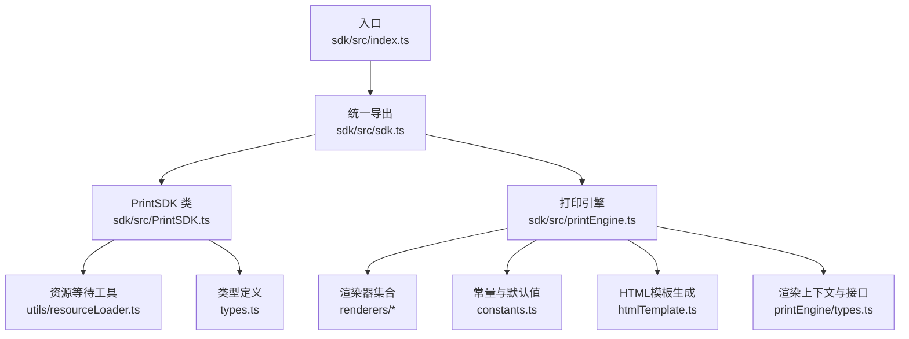
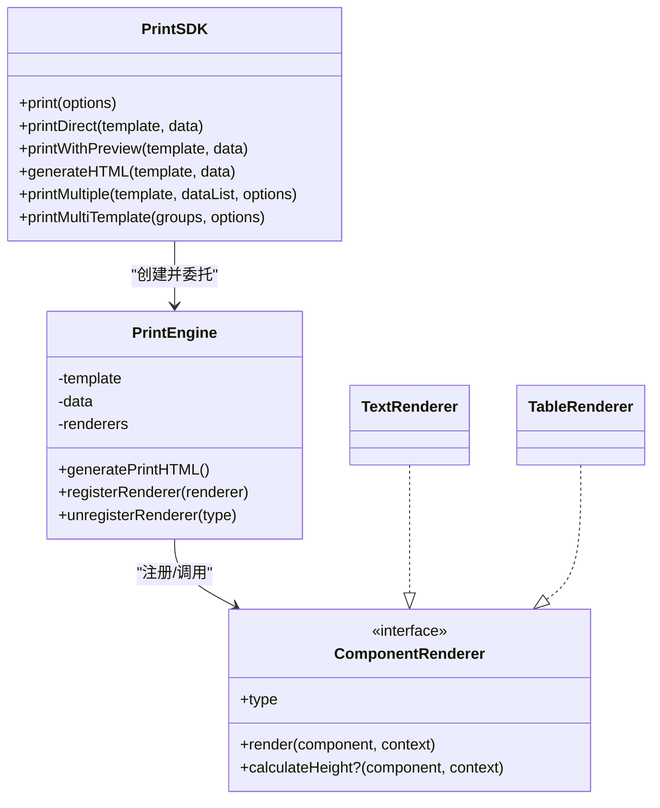
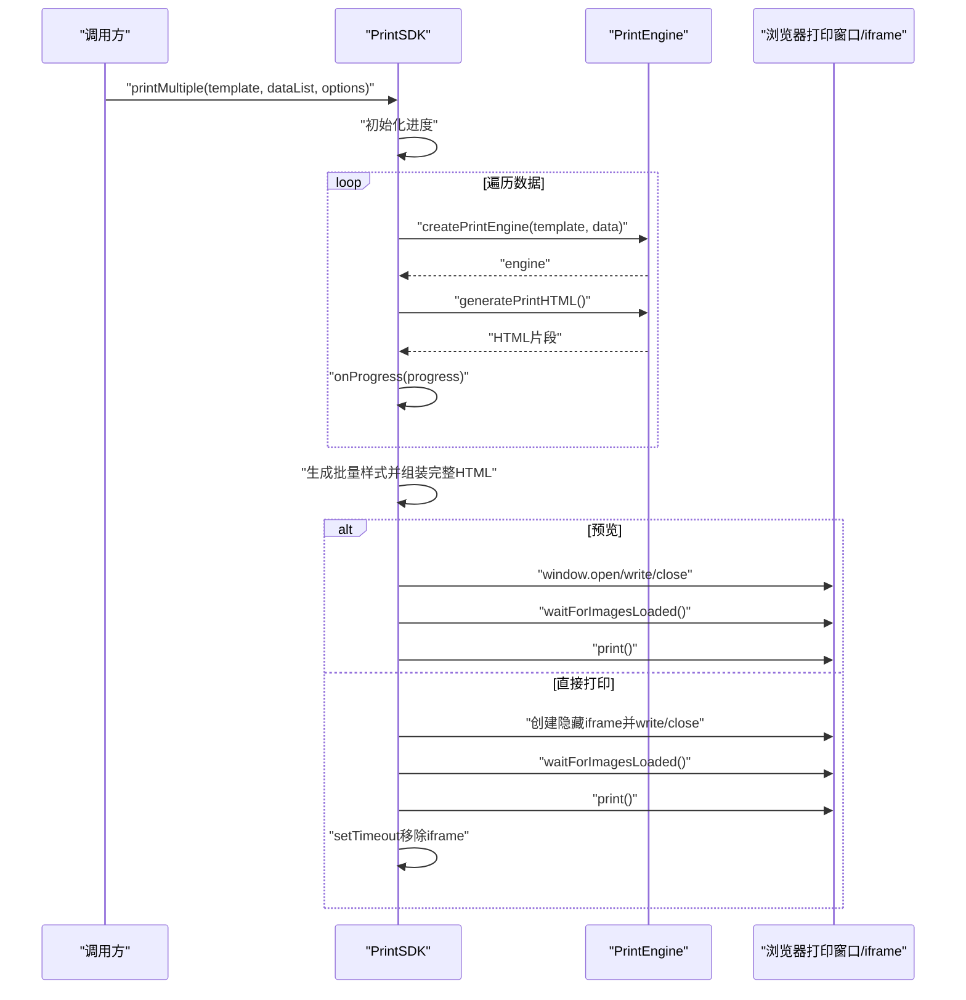
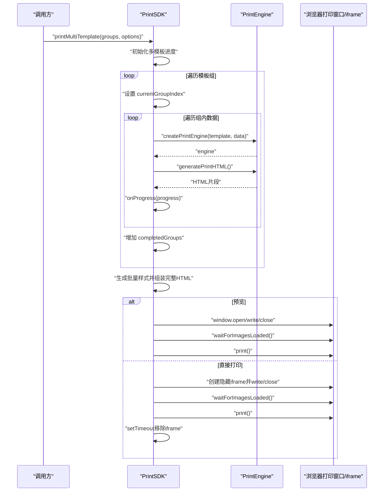
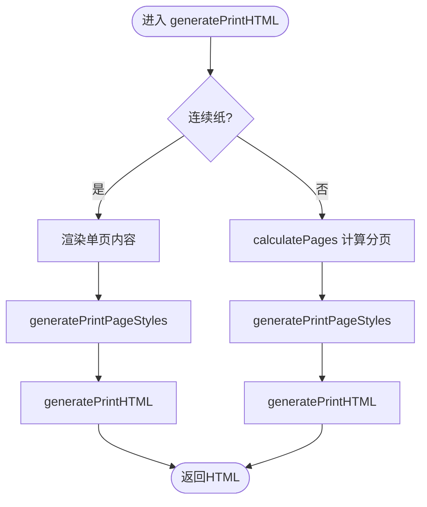
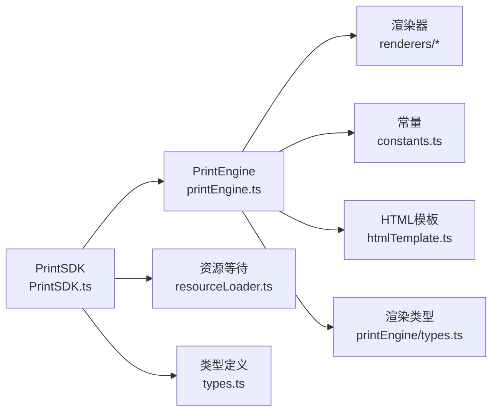

# SDK API

<cite>
**本文引用的文件**
- [sdk/src/index.ts](file://sdk/src/index.ts)
- [sdk/src/sdk.ts](file://sdk/src/sdk.ts)
- [sdk/src/types.ts](file://sdk/src/types.ts)
- [sdk/src/PrintSDK.ts](file://sdk/src/PrintSDK.ts)
- [sdk/src/printEngine.ts](file://sdk/src/printEngine.ts)
- [sdk/src/printEngine/types.ts](file://sdk/src/printEngine/types.ts)
- [sdk/src/printEngine/constants.ts](file://sdk/src/printEngine/constants.ts)
- [sdk/src/printEngine/htmlTemplate.ts](file://sdk/src/printEngine/htmlTemplate.ts)
- [sdk/src/printEngine/renderers/TextRenderer.ts](file://sdk/src/printEngine/renderers/TextRenderer.ts)
- [sdk/src/printEngine/renderers/TableRenderer.ts](file://sdk/src/printEngine/renderers/TableRenderer.ts)
- [sdk/src/utils/resourceLoader.ts](file://sdk/src/utils/resourceLoader.ts)
- [sdk/example.html](file://sdk/example.html)
- [sdk/package.json](file://sdk/package.json)
- [sdk/README.md](file://sdk/README.md)
</cite>

## 目录
1. [简介](#简介)
2. [项目结构](#项目结构)
3. [核心组件](#核心组件)
4. [架构总览](#架构总览)
5. [详细组件分析](#详细组件分析)
6. [依赖关系分析](#依赖关系分析)
7. [性能考量](#性能考量)
8. [故障排查指南](#故障排查指南)
9. [结论](#结论)
10. [附录](#附录)

## 简介
本文件为打印SDK的完整API参考文档，聚焦于createPrintSDK工厂方法、PrintSDK实例的核心方法、类型定义与使用示例。SDK采用"完全解耦、数据驱动"的设计理念，直接接收模板与数据，无需模板服务或初始化配置；打印流程支持预览与直接打印两种模式，并提供批量打印能力与进度回调。渲染层采用插件化组件渲染器，内置文本、表格、图片、矩形、线条、二维码、条形码等组件，支持数据绑定、管道转换与页码渲染。

**更新** 新增printMultiTemplate多模板批量打印API，支持一次打印操作组合多个不同模板及各自对应的数据列表，提供完整的类型定义和使用示例。

## 项目结构
SDK位于sdk目录，核心模块包括：
- 入口与导出：index.ts、sdk.ts
- 核心类：PrintSDK.ts（对外API）、printEngine.ts（渲染引擎）
- 类型定义：types.ts（模板与数据类型）、printEngine/types.ts（渲染上下文与渲染器接口）
- 渲染器：renderers/*（文本、表格、图片、矩形、线条、二维码、条形码）
- 常量与HTML模板：constants.ts、htmlTemplate.ts
- 工具：resourceLoader.ts（资源加载等待）

**图表来源**
- [sdk/src/index.ts:1-22](file://sdk/src/index.ts#L1-L22)
- [sdk/src/sdk.ts:1-63](file://sdk/src/sdk.ts#L1-L63)
- [sdk/src/PrintSDK.ts:1-253](file://sdk/src/PrintSDK.ts#L1-L253)
- [sdk/src/printEngine.ts:1-757](file://sdk/src/printEngine.ts#L1-L757)

**章节来源**
- [sdk/src/index.ts:1-22](file://sdk/src/index.ts#L1-L22)
- [sdk/src/sdk.ts:1-63](file://sdk/src/sdk.ts#L1-L63)

## 核心组件
- 工厂方法：createPrintSDK() 返回PrintSDK实例，无需配置。
- 打印引擎：createPrintEngine(template, data) 返回可调用generatePrintHTML、registerRenderer、unregisterRenderer的对象。
- PrintSDK实例：提供print、printDirect、printWithPreview、generateHTML、printMultiple、printMultiTemplate等方法。
- 渲染器：插件化组件渲染器，包含TextRenderer、TableRenderer等，支持calculateHeight用于分页估算。
- 类型体系：PrintTemplate、ComponentNode、SchemaDictionary、SchemaField、PageConfig、TableProps、DataBinding、PipeConfig等。

**更新** 新增PrintTemplateGroup、MultiTemplatePrintOptions、MultiTemplatePrintProgress类型定义。

**章节来源**
- [sdk/src/sdk.ts:6-63](file://sdk/src/sdk.ts#L6-L63)
- [sdk/src/PrintSDK.ts:43-253](file://sdk/src/PrintSDK.ts#L43-L253)
- [sdk/src/printEngine.ts:31-757](file://sdk/src/printEngine.ts#L31-L757)
- [sdk/src/types.ts:1-171](file://sdk/src/types.ts#L1-L171)

## 架构总览
SDK采用"工厂+引擎+渲染器插件"的架构：
- 工厂方法createPrintSDK创建PrintSDK实例，内部通过createPrintEngine生成渲染引擎。
- 渲染引擎负责：解析数据绑定、应用管道、计算分页、生成HTML。
- 渲染器插件负责具体组件的HTML生成与高度估算。
- HTML模板生成器负责页面样式与文档骨架。
- 资源等待工具确保图片等异步资源加载完成再触发打印。

**图表来源**
- [sdk/src/PrintSDK.ts:43-253](file://sdk/src/PrintSDK.ts#L43-L253)
- [sdk/src/printEngine.ts:31-757](file://sdk/src/printEngine.ts#L31-L757)
- [sdk/src/printEngine/types.ts:57-82](file://sdk/src/printEngine/types.ts#L57-L82)
- [sdk/src/printEngine/renderers/TextRenderer.ts:10-60](file://sdk/src/printEngine/renderers/TextRenderer.ts#L10-L60)
- [sdk/src/printEngine/renderers/TableRenderer.ts:11-275](file://sdk/src/printEngine/renderers/TableRenderer.ts#L11-L275)

## 详细组件分析

### 工厂方法 createPrintSDK
- 功能：创建PrintSDK实例，无需任何配置参数。
- 返回：PrintSDK实例，可直接调用其打印方法。
- 设计理念：完全解耦，不依赖模板服务或全局状态。

**章节来源**
- [sdk/src/PrintSDK.ts:246-253](file://sdk/src/PrintSDK.ts#L246-L253)

### PrintSDK 类与核心方法

#### print(options)
- 参数
  - template: PrintTemplate（模板数据，直接传入）
  - data: 任意对象（业务数据）
  - preview?: boolean（是否预览，默认false）
- 行为
  - preview=true：打开新窗口显示HTML并等待图片加载后打印。
  - preview=false：在隐藏iframe中写入HTML并打印，完成后移除iframe。
- 异步与错误处理
  - 若无法打开新窗口或访问iframe文档，抛出错误。
  - 图片加载超时会发出警告但仍继续。
- 返回：Promise<void>

**章节来源**
- [sdk/src/PrintSDK.ts:53-97](file://sdk/src/PrintSDK.ts#L53-L97)
- [sdk/src/utils/resourceLoader.ts:12-73](file://sdk/src/utils/resourceLoader.ts#L12-L73)

#### printDirect(template, data)
- 快捷方法：等价于print({ template, data, preview: false })。

**章节来源**
- [sdk/src/PrintSDK.ts:104-106](file://sdk/src/PrintSDK.ts#L104-L106)

#### printWithPreview(template, data)
- 快捷方法：等价于print({ template, data, preview: true })。

**章节来源**
- [sdk/src/PrintSDK.ts:113-115](file://sdk/src/PrintSDK.ts#L113-L115)

#### generateHTML(template, data)
- 功能：仅生成HTML字符串，不触发打印。
- 返回：Promise<string>

**章节来源**
- [sdk/src/PrintSDK.ts:123-126](file://sdk/src/PrintSDK.ts#L123-L126)

#### printMultiple(template, dataList, options?)
- 功能：批量打印（同模板多数据），生成完整打印文档，仅需用户确认一次打印。
- 参数
  - template: PrintTemplate
  - dataList: any[]（数据数组）
  - options?: BatchPrintOptions
    - preview?: boolean（默认false）
    - onProgress?: (progress: BatchPrintProgress) => void（进度回调）
- 行为
  - 逐条生成HTML片段，提取<body>内容拼接。
  - 生成批量样式并组装完整HTML。
  - 预览或直接打印，打印完成后移除iframe。
- 进度回调
  - total/completed/failed/currentIndex
  - currentIndex=-1表示开始/结束
- 错误处理
  - 单条数据处理异常不影响整体流程，计入failed并继续。

**图表来源**
- [sdk/src/PrintSDK.ts:135-243](file://sdk/src/PrintSDK.ts#L135-L243)
- [sdk/src/printEngine.ts:731-756](file://sdk/src/printEngine.ts#L731-L756)
- [sdk/src/utils/resourceLoader.ts:12-73](file://sdk/src/utils/resourceLoader.ts#L12-L73)

**章节来源**
- [sdk/src/PrintSDK.ts:135-243](file://sdk/src/PrintSDK.ts#L135-L243)

#### printMultiTemplate(groups, options?)
- 功能：多模板批量打印，支持多个模板各自绑定数据列表，一次打印确认。
- 参数
  - groups: PrintTemplateGroup[]（模板+数据组数组）
  - options?: MultiTemplatePrintOptions
    - preview?: boolean（默认false）
    - onProgress?: (progress: MultiTemplatePrintProgress) => void（进度回调）
- 行为
  - 逐个遍历模板组，对每个数据项生成HTML片段。
  - 提取<body>内容并拼接为完整文档。
  - 生成批量样式并组装完整HTML。
  - 预览或直接打印，打印完成后移除iframe。
- 进度回调
  - totalGroups/completedGroups/totalDataItems/completedDataItems/failed/currentGroupIndex/currentDataIndex
  - currentGroupIndex=-1 或 currentDataIndex=-1 表示开始/结束
- 错误处理
  - 单条数据处理异常不影响整体流程，计入failed并继续。
- 已知限制
  - 所有模板必须使用相同的纸张尺寸和边距设置。混合纸张尺寸暂不支持。

**更新** 新增多模板批量打印功能，支持复杂的业务场景。

**图表来源**
- [sdk/src/PrintSDK.ts:324-467](file://sdk/src/PrintSDK.ts#L324-L467)
- [sdk/src/printEngine.ts:731-756](file://sdk/src/printEngine.ts#L731-L756)
- [sdk/src/utils/resourceLoader.ts:12-73](file://sdk/src/utils/resourceLoader.ts#L12-L73)

**章节来源**
- [sdk/src/PrintSDK.ts:324-467](file://sdk/src/PrintSDK.ts#L324-L467)

### 打印引擎 PrintEngine
- 职责：数据绑定、管道转换、虚拟分页、HTML生成。
- 插件化渲染器：默认注册TextRenderer、TableRenderer、ImageRenderer、RectRenderer、LineRenderer、QRCodeRenderer、BarcodeRenderer。
- 关键能力
  - resolveBinding：解析DataBinding，支持路径与回退值，支持管道链式转换。
  - applyPipes：执行管道（通过管道注册表）。
  - calculatePages：基于绝对布局与相对间距的虚拟分页，支持表格跨页拆分与合计行。
  - renderPageNumber：根据PageNumberConfig渲染页码。
  - generatePrintHTML：生成完整HTML文档。

**图表来源**
- [sdk/src/printEngine.ts:668-725](file://sdk/src/printEngine.ts#L668-L725)
- [sdk/src/printEngine/htmlTemplate.ts:81-170](file://sdk/src/printEngine/htmlTemplate.ts#L81-L170)

**章节来源**
- [sdk/src/printEngine.ts:31-757](file://sdk/src/printEngine.ts#L31-L757)

### 渲染器插件
- TextRenderer
  - 类型：text
  - 特性：支持label前缀、flex布局对齐、默认样式继承。
  - 高度估算：使用布局高度或默认值。
- TableRenderer
  - 类型：table
  - 特性：支持列过滤、边框、表头重复、合计行（page/total模式）、Decimal.js高精度计算。
  - 高度估算：表头+行数*行高+合计行高度。

**章节来源**
- [sdk/src/printEngine/renderers/TextRenderer.ts:10-60](file://sdk/src/printEngine/renderers/TextRenderer.ts#L10-L60)
- [sdk/src/printEngine/renderers/TableRenderer.ts:11-275](file://sdk/src/printEngine/renderers/TableRenderer.ts#L11-L275)

### 类型定义

#### PrintTemplate
- 字段：id、name、version、description、schemaId、page、layoutMode、components
- 说明：模板根对象，包含页面配置与组件树。

**章节来源**
- [sdk/src/types.ts:151-160](file://sdk/src/types.ts#L151-L160)

#### ComponentNode
- 字段：id、type、layout（mode、xMm、yMm、widthMm、heightMm、zIndex）、style、binding、props、children
- 说明：组件节点，支持绝对布局与流式布局，支持数据绑定与属性透传。

**章节来源**
- [sdk/src/types.ts:134-149](file://sdk/src/types.ts#L134-L149)

#### SchemaDictionary 与 SchemaField
- SchemaDictionary：id、name、rootType、root、version、description
- SchemaField：key、label、type、description、children、enum、format
- 说明：用于描述数据结构与字段约束，便于设计器与校验。

**章节来源**
- [sdk/src/types.ts:21-28](file://sdk/src/types.ts#L21-L28)
- [sdk/src/types.ts:11-19](file://sdk/src/types.ts#L11-L19)

#### PageConfig 与 PageNumberConfig
- PageConfig：size、widthMm、heightMm、minHeightMm、orientation、marginMm、pageNumber
- PageNumberConfig：enabled、position、format、prefix、suffix、separator、offsetX、offsetY、style(fontSize,color,fontWeight)

**章节来源**
- [sdk/src/types.ts:49-62](file://sdk/src/types.ts#L49-L62)
- [sdk/src/types.ts:30-46](file://sdk/src/types.ts#L30-L46)

#### TableProps 与 TableColumn
- TableProps：columns、showHeader、bordered、repeatHeader、showSummary、summaryMode、summaryLabel、summaryStyle、_pageData、_showHeader、_isLastPage、_totalData
- TableColumn：dataIndex、title、width、align、hidden、summary

**章节来源**
- [sdk/src/types.ts:118-132](file://sdk/src/types.ts#L118-L132)
- [sdk/src/types.ts:90-98](file://sdk/src/types.ts#L90-L98)

#### DataBinding 与 PipeConfig
- DataBinding：path、pipes、fallback
- PipeConfig：type、options
- 说明：数据绑定与管道链式转换。

**章节来源**
- [sdk/src/types.ts:71-75](file://sdk/src/types.ts#L71-L75)
- [sdk/src/types.ts:66-69](file://sdk/src/types.ts#L66-L69)

#### RenderContext 与 ComponentRenderer
- RenderContext：data、resolveBinding、applyPipes、getValueByPath、formatDate、mmToPx、pageInfo
- ComponentRenderer：type、render、calculateHeight?

**章节来源**
- [sdk/src/printEngine/types.ts:11-55](file://sdk/src/printEngine/types.ts#L11-L55)
- [sdk/src/printEngine/types.ts:57-82](file://sdk/src/printEngine/types.ts#L57-L82)

#### PrintTemplateGroup
- 字段：template: PrintTemplate、dataList: any[]
- 说明：模板+数据组，用于printMultiTemplate方法的参数结构。

**新增** 多模板批量打印的核心类型定义。

**章节来源**
- [sdk/src/PrintSDK.ts:74-77](file://sdk/src/PrintSDK.ts#L74-L77)

#### MultiTemplatePrintOptions 与 MultiTemplatePrintProgress
- MultiTemplatePrintOptions：preview?: boolean、onProgress?: (progress: MultiTemplatePrintProgress) => void
- MultiTemplatePrintProgress：totalGroups、completedGroups、totalDataItems、completedDataItems、failed、currentGroupIndex、currentDataIndex
- 说明：多模板批量打印的选项与进度回调参数。

**新增** 多模板批量打印的类型定义。

**章节来源**
- [sdk/src/PrintSDK.ts:82-98](file://sdk/src/PrintSDK.ts#L82-L98)

### 使用示例

#### 基本打印
- 步骤
  - 通过createPrintSDK创建实例
  - 准备模板数据与业务数据
  - 调用print或printDirect
- 参考路径
  - [sdk/example.html:130-199](file://sdk/example.html#L130-L199)

**章节来源**
- [sdk/example.html:89-127](file://sdk/example.html#L89-L127)
- [sdk/example.html:130-199](file://sdk/example.html#L130-L199)

#### 批量打印
- 步骤
  - 准备模板与数据列表
  - 调用printMultiple，传入onProgress回调
- 参考路径
  - [sdk/src/PrintSDK.ts:135-243](file://sdk/src/PrintSDK.ts#L135-L243)
  - [sdk/example.html:122-126](file://sdk/example.html#L122-L126)

**章节来源**
- [sdk/src/PrintSDK.ts:135-243](file://sdk/src/PrintSDK.ts#L135-L243)
- [sdk/example.html:122-126](file://sdk/example.html#L122-L126)

#### 多模板批量打印
- 步骤
  - 准备多个模板与各自的数据列表
  - 调用printMultiTemplate，传入onProgress回调
  - 注意：所有模板必须使用相同的纸张尺寸和边距设置
- 参考路径
  - [sdk/README.md:146-186](file://sdk/README.md#L146-L186)

**新增** 多模板批量打印的使用示例。

**章节来源**
- [sdk/README.md:146-186](file://sdk/README.md#L146-L186)

#### 自定义样式与组件
- 通过props向组件注入样式与行为
- 通过registerRenderer扩展自定义渲染器
- 参考路径
  - [sdk/src/printEngine.ts:63-73](file://sdk/src/printEngine.ts#L63-L73)
  - [sdk/src/printEngine/renderers/TextRenderer.ts:13-53](file://sdk/src/printEngine/renderers/TextRenderer.ts#L13-L53)
  - [sdk/src/printEngine/renderers/TableRenderer.ts:14-151](file://sdk/src/printEngine/renderers/TableRenderer.ts#L14-L151)

**章节来源**
- [sdk/src/printEngine.ts:63-73](file://sdk/src/printEngine.ts#L63-L73)
- [sdk/src/printEngine/renderers/TextRenderer.ts:13-53](file://sdk/src/printEngine/renderers/TextRenderer.ts#L13-L53)
- [sdk/src/printEngine/renderers/TableRenderer.ts:14-151](file://sdk/src/printEngine/renderers/TableRenderer.ts#L14-L151)

## 依赖关系分析

**图表来源**
- [sdk/src/PrintSDK.ts:7-14](file://sdk/src/PrintSDK.ts#L7-L14)
- [sdk/src/printEngine.ts:6-29](file://sdk/src/printEngine.ts#L6-L29)

**章节来源**
- [sdk/src/PrintSDK.ts:7-14](file://sdk/src/PrintSDK.ts#L7-L14)
- [sdk/src/printEngine.ts:6-29](file://sdk/src/printEngine.ts#L6-L29)

## 性能考量
- 虚拟分页策略：基于绝对布局与相对间距，避免复杂DOM测量，提升分页稳定性与性能。
- 表格跨页拆分：按行高与表头高度精确计算，避免"只有表头"的空页。
- 合计行优化：使用Decimal.js保证数值精度，减少浮点误差。
- 资源等待：仅等待外部图片资源，二维码与条形码已同步生成为base64，降低异步等待成本。
- 连续纸：单页渲染，避免多次分页计算。
- 建议
  - 控制模板组件数量与复杂度，避免过多绝对定位导致溢出与重排。
  - 合理设置表格列宽与对齐，避免文本换行造成高度估算偏差。
  - 批量打印时合理设置onProgress频率，避免频繁UI更新。
  - 多模板打印时注意模板数量和数据量的平衡，避免生成过大的HTML文档。

**更新** 多模板打印可能产生更大的HTML文档，需要注意内存使用和性能影响。

**章节来源**
- [sdk/src/printEngine.ts:396-541](file://sdk/src/printEngine.ts#L396-L541)
- [sdk/src/printEngine/renderers/TableRenderer.ts:205-257](file://sdk/src/printEngine/renderers/TableRenderer.ts#L205-L257)
- [sdk/src/utils/resourceLoader.ts:75-89](file://sdk/src/utils/resourceLoader.ts#L75-L89)

## 故障排查指南
- 无法打开打印窗口
  - 现象：抛出"Failed to open print window"错误。
  - 排查：检查浏览器弹窗拦截设置，确认用户交互触发。
  - 参考路径：[sdk/src/PrintSDK.ts:60-62](file://sdk/src/PrintSDK.ts#L60-L62)
- 无法访问iframe文档
  - 现象：抛出"Failed to access iframe document"错误。
  - 排查：检查同源策略与iframe可见性，确认写入与关闭流程正确。
  - 参考路径：[sdk/src/PrintSDK.ts:81-83](file://sdk/src/PrintSDK.ts#L81-L83)
- 图片加载超时或失败
  - 现象：控制台出现超时或失败警告。
  - 排查：检查图片URL有效性与网络状况，适当提高超时阈值。
  - 参考路径：[sdk/src/utils/resourceLoader.ts:28-42](file://sdk/src/utils/resourceLoader.ts#L28-L42)
- 表格高度异常
  - 现象：表格接近页面高度或跨页分割不合理。
  - 排查：检查表格列宽与行高配置，避免溢出与过度换行。
  - 参考路径：[sdk/src/printEngine.ts:446-451](file://sdk/src/printEngine.ts#L446-L451)
- 页码不显示
  - 现象：PageNumberConfig启用但未渲染。
  - 排查：确认pageNumber.enabled与格式配置正确，检查渲染上下文。
  - 参考路径：[sdk/src/printEngine.ts:274-362](file://sdk/src/printEngine.ts#L274-L362)
- 多模板打印失败
  - 现象：printMultiTemplate执行异常或部分数据未打印。
  - 排查：检查模板组参数格式，确认所有模板使用相同纸张尺寸，查看控制台错误信息。
  - 参考路径：[sdk/src/PrintSDK.ts:338-341](file://sdk/src/PrintSDK.ts#L338-L341)
- 混合纸张尺寸限制
  - 现象：多模板打印结果不符合预期。
  - 排查：确认所有模板使用相同的PageConfig配置，特别是size、widthMm、heightMm、marginMm。
  - 参考路径：[sdk/src/PrintSDK.ts:328](file://sdk/src/PrintSDK.ts#L328)

**更新** 新增多模板打印相关的故障排查指南。

**章节来源**
- [sdk/src/PrintSDK.ts:60-62](file://sdk/src/PrintSDK.ts#L60-L62)
- [sdk/src/PrintSDK.ts:81-83](file://sdk/src/PrintSDK.ts#L81-L83)
- [sdk/src/utils/resourceLoader.ts:28-42](file://sdk/src/utils/resourceLoader.ts#L28-L42)
- [sdk/src/printEngine.ts:446-451](file://sdk/src/printEngine.ts#L446-L451)
- [sdk/src/printEngine.ts:274-362](file://sdk/src/printEngine.ts#L274-L362)
- [sdk/src/PrintSDK.ts:338-341](file://sdk/src/PrintSDK.ts#L338-L341)
- [sdk/src/PrintSDK.ts:328](file://sdk/src/PrintSDK.ts#L328)

## 结论
本SDK以"零配置、数据驱动、插件化渲染"为核心，提供稳定高效的打印能力。通过清晰的类型定义、完善的错误处理与性能优化策略，满足从单页打印到批量打印的多种场景需求。**最新版本新增的printMultiTemplate多模板批量打印功能，进一步扩展了SDK的应用场景，特别适用于需要组合多个不同类型模板进行批量打印的业务场景。**建议在实际项目中结合设计器生成的模板与Mock数据，充分利用数据绑定与管道转换，实现灵活的业务定制。

**更新** 多模板批量打印功能为SDK增加了强大的组合打印能力，建议在需要复杂业务场景时优先考虑使用此功能。

## 附录

### API一览（方法与类型）
- 工厂方法
  - createPrintSDK(): PrintSDK
- PrintSDK
  - print(options): Promise<void>
  - printDirect(template, data): Promise<void>
  - printWithPreview(template, data): Promise<void>
  - generateHTML(template, data): Promise<string>
  - printMultiple(template, dataList, options?): Promise<void>
  - printMultiTemplate(groups, options?): Promise<void>
- 打印引擎
  - createPrintEngine(template, data): { generatePrintHTML(), registerRenderer(), unregisterRenderer() }
- 类型
  - PrintTemplate、ComponentNode、SchemaDictionary、SchemaField、PageConfig、PageNumberConfig、TableProps、TableColumn、DataBinding、PipeConfig、RenderContext、ComponentRenderer
  - PrintTemplateGroup、MultiTemplatePrintOptions、MultiTemplatePrintProgress

**更新** 新增多模板批量打印相关的类型定义。

**章节来源**
- [sdk/src/sdk.ts:6-63](file://sdk/src/sdk.ts#L6-L63)
- [sdk/src/PrintSDK.ts:43-253](file://sdk/src/PrintSDK.ts#L43-L253)
- [sdk/src/printEngine.ts:731-756](file://sdk/src/printEngine.ts#L731-L756)
- [sdk/src/types.ts:1-171](file://sdk/src/types.ts#L1-L171)
- [sdk/src/printEngine/types.ts:11-116](file://sdk/src/printEngine/types.ts#L11-L116)

### 示例页面
- 示例页面展示了SDK初始化、打印调用与状态反馈，可作为快速集成参考。
- 参考路径：[sdk/example.html:1-202](file://sdk/example.html#L1-L202)

**章节来源**
- [sdk/example.html:1-202](file://sdk/example.html#L1-L202)

### 版本更新说明
- v1.1.3 新增功能
  - ✨ **多模板批量打印**：新增 `printMultiTemplate` 方法，支持一次打印操作组合多个不同模板及各自对应的数据列表（一客一模板场景）
  - ✨ **设计器多模板模式**：打印预览弹窗新增「多模板模式」，可自由组合已保存模板和当前画布模板进行混合打印

**新增** 版本更新说明，展示SDK的演进历程。

**章节来源**
- [sdk/README.md:10-13](file://sdk/README.md#L10-L13)