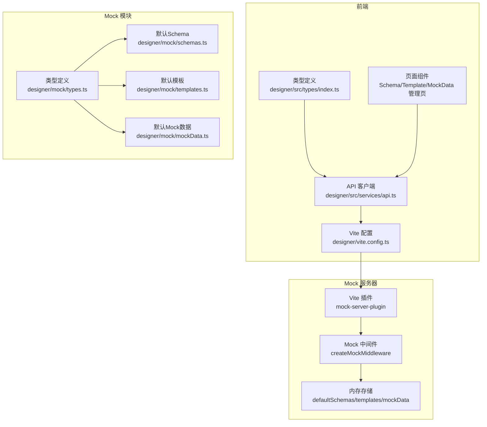
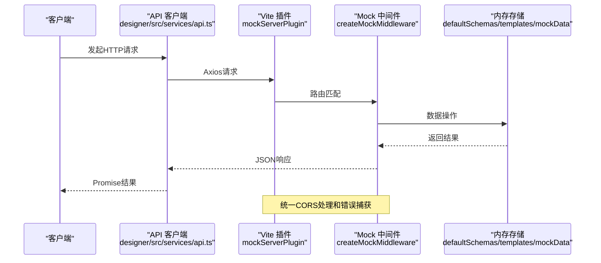
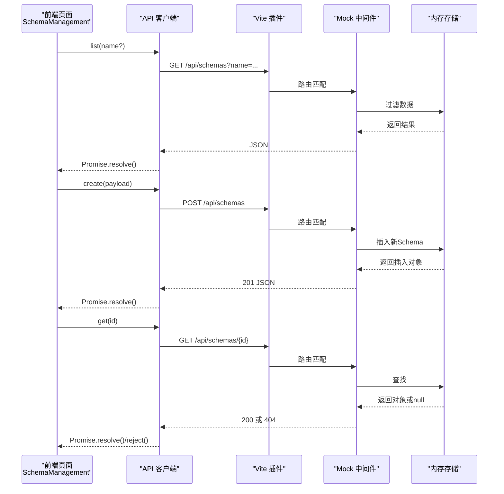
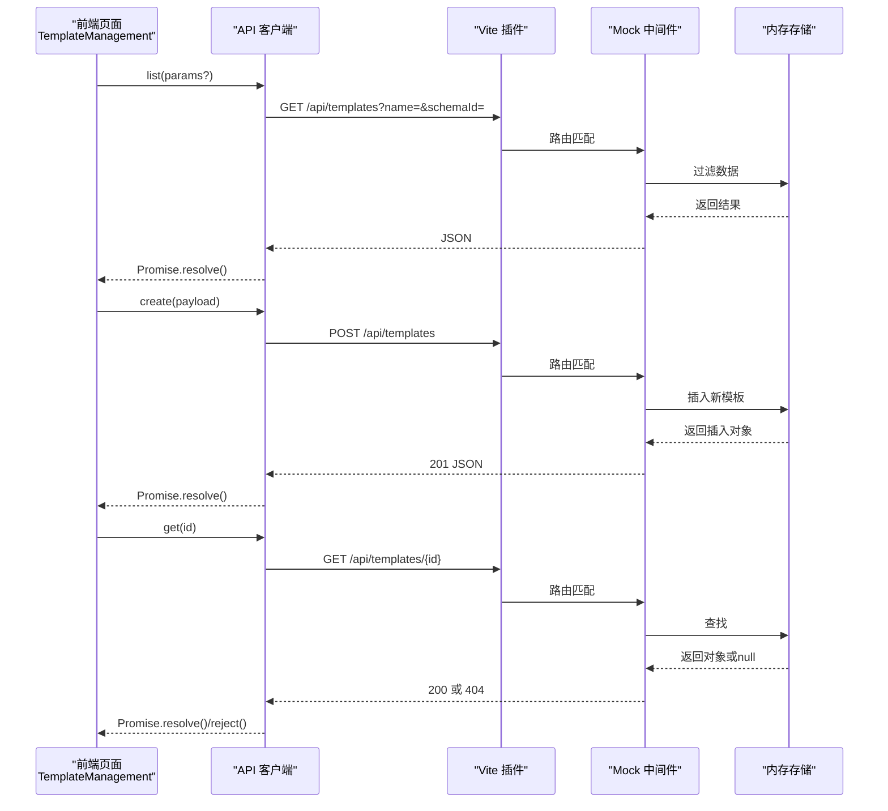
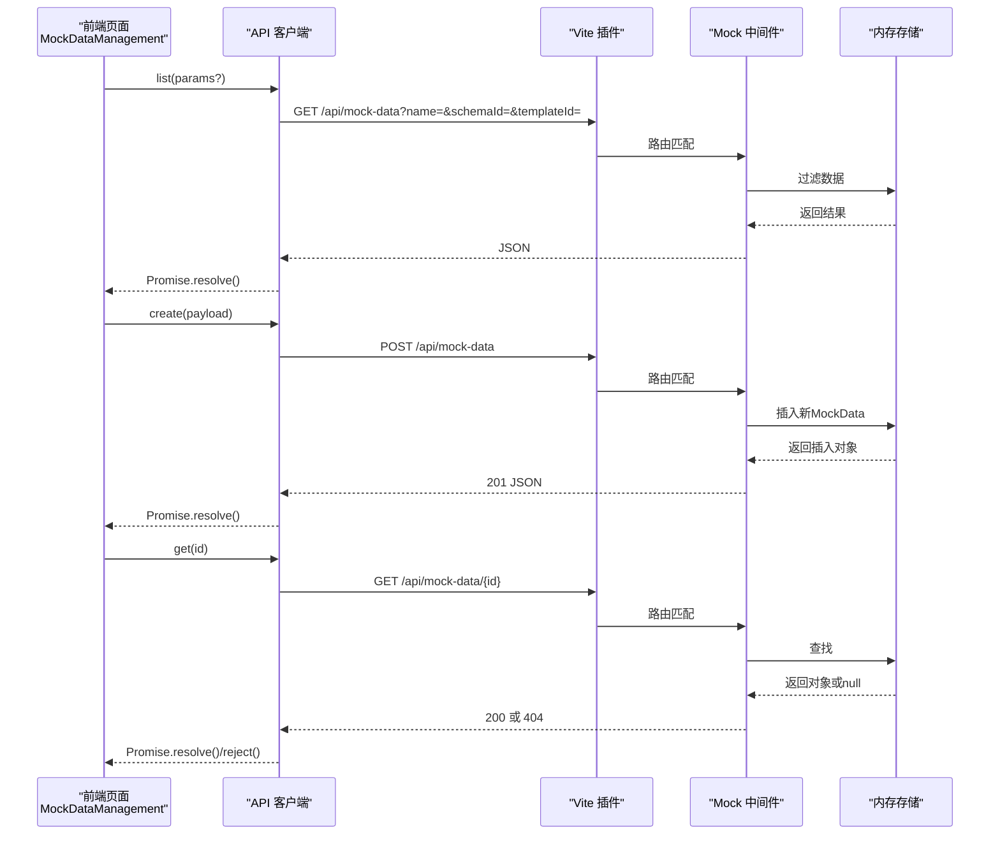
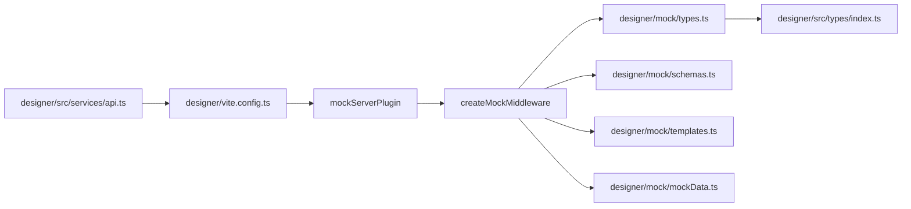

# 设计器API

<cite>
**本文档引用的文件**
- [designer/mock/server.ts](file://designer/mock/server.ts)
- [designer/mock/types.ts](file://designer/mock/types.ts)
- [designer/mock/schemas.ts](file://designer/mock/schemas.ts)
- [designer/mock/templates.ts](file://designer/mock/templates.ts)
- [designer/mock/mockData.ts](file://designer/mock/mockData.ts)
- [designer/mock/index.ts](file://designer/mock/index.ts)
- [designer/vite.config.ts](file://designer/vite.config.ts)
- [designer/src/services/api.ts](file://designer/src/services/api.ts)
- [designer/src/types/index.ts](file://designer/src/types/index.ts)
- [designer/src/pages/SchemaManagement/index.tsx](file://designer/src/pages/SchemaManagement/index.tsx)
- [designer/src/pages/MockDataManagement/index.tsx](file://designer/src/pages/MockDataManagement/index.tsx)
- [designer/src/pages/TemplateManagement/index.tsx](file://designer/src/pages/TemplateManagement/index.tsx)
</cite>

## 更新摘要
**所做更改**
- 更新架构概述以反映从Express路由到Vite插件系统的迁移
- 新增Vite插件系统和Mock中间件的实现细节
- 扩展类型定义文档，包含完整的Schema、Template、MockData接口
- 更新API客户端实现，展示新的Vite集成方式
- 增强错误处理和CORS支持说明
- 更新项目结构图以反映新的架构

## 目录
1. [简介](#简介)
2. [项目结构](#项目结构)
3. [核心组件](#核心组件)
4. [架构概览](#架构概览)
5. [详细组件分析](#详细组件分析)
6. [依赖关系分析](#依赖关系分析)
7. [性能考虑](#性能考虑)
8. [故障排查指南](#故障排查指南)
9. [结论](#结论)
10. [附录](#附录)

## 简介
本文件为"打印设计器"项目的API文档，覆盖以下三大模块：
- Schema管理API：用于管理数据结构Schema，支持列表查询、详情获取、创建、更新、删除。
- Template管理API：用于管理打印模板，支持列表查询、详情获取、创建、更新、删除。
- MockData管理API：用于管理模拟数据，支持多条件查询、详情获取、创建、更新、删除。

**更新** 本项目已从传统的Express路由实现迁移到Vite插件系统，提供更高效的开发体验和更好的热重载支持。

文档包含：
- 接口规范与请求/响应格式
- 参数说明与验证规则
- 错误码定义
- 请求示例与最佳实践
- 常见问题与排错建议

## 项目结构
项目采用Vite插件架构，通过mock-server-plugin提供完整的CRUD API功能。前端通过Axios封装统一的API客户端，分别对应三个资源域：
- /api/schemas：Schema管理
- /api/templates：模板管理
- /api/mock-data：Mock数据管理



**图表来源**
- [designer/vite.config.ts:1-19](file://designer/vite.config.ts#L1-L19)
- [designer/mock/server.ts:256-267](file://designer/mock/server.ts#L256-L267)
- [designer/src/services/api.ts:1-115](file://designer/src/services/api.ts#L1-L115)
- [designer/src/types/index.ts:1-317](file://designer/src/types/index.ts#L1-L317)

**章节来源**
- [designer/vite.config.ts:1-19](file://designer/vite.config.ts#L1-L19)
- [designer/mock/server.ts:1-268](file://designer/mock/server.ts#L1-L268)
- [designer/src/services/api.ts:1-115](file://designer/src/services/api.ts#L1-L115)

## 核心组件
- **Schema管理**：维护数据结构定义，支持树形字段结构、枚举、格式化等能力。
- **Template管理**：维护打印模板，包含页面配置、布局模式、组件树及数据绑定。
- **MockData管理**：维护测试数据，支持与Schema关联，便于模板调试与预览。
- **Vite插件系统**：提供Mock API服务，支持CORS、JSON解析、UUID生成等核心功能。

**更新** 核心组件现在通过Vite插件系统提供，替代了传统的Express路由实现，提供更好的开发体验。

**章节来源**
- [designer/mock/types.ts:1-317](file://designer/mock/types.ts#L1-L317)
- [designer/mock/server.ts:49-254](file://designer/mock/server.ts#L49-L254)

## 架构概览
项目采用Vite插件架构，通过mockServerPlugin在开发环境中提供完整的Mock API服务。所有接口返回标准JSON，支持CORS跨域访问，错误统一处理。



**图表来源**
- [designer/src/services/api.ts:15-20](file://designer/src/services/api.ts#L15-L20)
- [designer/mock/server.ts:259-267](file://designer/mock/server.ts#L259-L267)
- [designer/mock/server.ts:55-253](file://designer/mock/server.ts#L55-L253)

## 详细组件分析

### Schema管理API

- **基础路径**：/api/schemas
- **支持方法**：
  - GET /api/schemas：列表查询（支持name过滤）
  - GET /api/schemas/:id：详情获取
  - POST /api/schemas：创建
  - PUT /api/schemas/:id：更新
  - DELETE /api/schemas/:id：删除

- **查询参数**
  - name：字符串，按名称模糊过滤

- **请求体字段（创建/更新）**
  - id：字符串，可选；若为空则后端生成UUID
  - name：字符串，必填
  - version：字符串，可选
  - description：字符串，可选
  - rootType：'object' | 'array'，必填
  - root：SchemaField对象，必填

- **SchemaField字段**
  - key：字符串，必填
  - label：字符串，必填
  - type：'string' | 'number' | 'boolean' | 'date' | 'datetime' | 'object' | 'array'
  - description：字符串，可选
  - children：SchemaField[]，可选（当type为object或array时）
  - enum：枚举数组，可选
  - format：'date' | 'datetime' | 'money' | 'percent'，可选

- **响应**
  - 成功：返回对应SchemaDictionary对象
  - 404：当资源不存在时返回通用错误结构
  - 500：服务器内部错误

- **请求示例**
  - 创建
    - 方法：POST /api/schemas
    - Content-Type：application/json
    - Body：包含name、version、description、rootType、root
  - 更新
    - 方法：PUT /api/schemas/{id}
    - Body：同上
  - 删除
    - 方法：DELETE /api/schemas/{id}

- **响应示例**
  - 成功：返回完整的SchemaDictionary对象
  - 404：{"code":"NOT_FOUND","message":"Schema not found"}
  - 500：{"code":"INTERNAL_ERROR","message":"Internal server error"}

- **参数验证规则**
  - root.key必须为"root"
  - root.type必须为"object"
  - name为必填
  - rootType为必填且合法

- **错误码**
  - NOT_FOUND：资源不存在
  - INTERNAL_ERROR：服务器内部错误

- **最佳实践**
  - 创建Schema时确保root为object且key为"root"
  - 更新前先GET确认存在性
  - 使用name参数进行列表过滤
  - 建议为每个Schema提供清晰的description



**图表来源**
- [designer/src/pages/SchemaManagement/index.tsx:120-131](file://designer/src/pages/SchemaManagement/index.tsx#L120-L131)
- [designer/src/services/api.ts:26-50](file://designer/src/services/api.ts#L26-L50)
- [designer/mock/server.ts:78-130](file://designer/mock/server.ts#L78-L130)

**章节来源**
- [designer/mock/server.ts:78-130](file://designer/mock/server.ts#L78-L130)
- [designer/src/services/api.ts:26-50](file://designer/src/services/api.ts#L26-L50)
- [designer/src/pages/SchemaManagement/index.tsx:120-131](file://designer/src/pages/SchemaManagement/index.tsx#L120-L131)

### Template管理API

- **基础路径**：/api/templates
- **支持方法**：
  - GET /api/templates：列表查询（支持name、schemaId过滤）
  - GET /api/templates/:id：详情获取
  - POST /api/templates：创建
  - PUT /api/templates/:id：更新
  - DELETE /api/templates/:id：删除

- **查询参数**
  - name：字符串，按名称模糊过滤
  - schemaId：字符串，按关联Schema过滤

- **请求体字段（创建/更新）**
  - id：字符串，可选；若为空则后端生成UUID
  - name：字符串，必填
  - version：字符串，必填
  - description：字符串，可选
  - schemaId：字符串，可选
  - page：PageConfig，必填
  - layoutMode：'absolute' | 'flow'，必填
  - components：ComponentNode[]，必填

- **PageConfig字段**
  - size：'A4' | 'A5' | 'CUSTOM' | 'CONTINUOUS'
  - widthMm/heightMm：数字，当size为CUSTOM时必填
  - minHeightMm：数字，当size为CONTINUOUS时必填
  - orientation：'portrait' | 'landscape'
  - marginMm：{top,right,bottom,left}，必填
  - pageNumber：PageNumberConfig，可选

- **PageNumberConfig字段**
  - enabled：boolean，是否显示页码
  - position：'bottom-center' | 'bottom-right' | 'bottom-left' | 'top-center' | 'top-right' | 'top-left'
  - format：'simple' | 'text' | 'slash'
  - prefix/suffix：字符串，页码前后缀
  - separator：字符串，分隔符
  - offsetX/offsetY：数字，X/Y轴偏移量
  - style：{fontSize,color,fontWeight}

- **ComponentNode字段**
  - id：字符串，必填
  - type：'text' | 'image' | 'rect' | 'container' | 'table' | 'line' | 'qrcode' | 'barcode'
  - layout：{mode,xMm,yMm,widthMm,heightMm,zIndex}
  - style：Record<string, any>
  - binding：DataBinding，可选
  - props：Record<string, any>
  - children：ComponentNode[]，可选

- **DataBinding字段**
  - path：字符串，数据路径（支持点号路径）
  - pipes：PipeConfig[]，数据管道列表
  - fallback：字符串，数据缺失时的回退值

- **PipeConfig字段**
  - type：字符串，管道类型（如date、currency、money）
  - options：Record<string, any>，管道配置选项

- **响应**
  - 成功：返回对应PrintTemplate对象
  - 404：当资源不存在时返回通用错误结构
  - 500：服务器内部错误

- **请求示例**
  - 创建
    - 方法：POST /api/templates
    - Body：包含name、version、schemaId、page、layoutMode、components
  - 更新
    - 方法：PUT /api/templates/{id}
    - Body：同上
  - 删除
    - 方法：DELETE /api/templates/{id}

- **响应示例**
  - 成功：返回完整的PrintTemplate对象
  - 404：{"code":"NOT_FOUND","message":"Template not found"}
  - 500：{"code":"INTERNAL_ERROR","message":"Internal server error"}

- **参数验证规则**
  - name为必填
  - page配置需满足size与CUSTOM的约束
  - components为必填数组

- **错误码**
  - NOT_FOUND：资源不存在
  - INTERNAL_ERROR：服务器内部错误

- **最佳实践**
  - 创建模板时先确保关联的Schema存在
  - 使用schemaId进行模板分类与筛选
  - 在设计器中完成复杂布局后再导出模板



**图表来源**
- [designer/src/pages/TemplateManagement/index.tsx:54-65](file://designer/src/pages/TemplateManagement/index.tsx#L54-L65)
- [designer/src/services/api.ts:56-80](file://designer/src/services/api.ts#L56-L80)
- [designer/mock/server.ts:132-186](file://designer/mock/server.ts#L132-L186)

**章节来源**
- [designer/mock/server.ts:132-186](file://designer/mock/server.ts#L132-L186)
- [designer/src/services/api.ts:56-80](file://designer/src/services/api.ts#L56-L80)
- [designer/src/pages/TemplateManagement/index.tsx:54-65](file://designer/src/pages/TemplateManagement/index.tsx#L54-L65)

### MockData管理API

- **基础路径**：/api/mock-data
- **支持方法**：
  - GET /api/mock-data：列表查询（支持name、schemaId、templateId过滤）
  - GET /api/mock-data/:id：详情获取
  - POST /api/mock-data：创建
  - PUT /api/mock-data/:id：更新
  - DELETE /api/mock-data/:id：删除

- **查询参数**
  - name：字符串，按名称模糊过滤
  - schemaId：字符串，按关联Schema过滤
  - templateId：字符串，按关联模板过滤

- **请求体字段（创建/更新）**
  - id：字符串，可选；若为空则后端生成UUID
  - name：字符串，必填
  - schemaId：字符串，可选
  - templateId：字符串，可选
  - data：任意JSON，必填
  - description：字符串，可选

- **响应**
  - 成功：返回对应MockData对象
  - 404：当资源不存在时返回通用错误结构
  - 500：服务器内部错误

- **请求示例**
  - 创建
    - 方法：POST /api/mock-data
    - Body：包含name、schemaId、templateId、data、description
  - 更新
    - 方法：PUT /api/mock-data/{id}
    - Body：同上
  - 删除
    - 方法：DELETE /api/mock-data/{id}

- **响应示例**
  - 成功：返回完整的MockData对象
  - 404：{"code":"NOT_FOUND","message":"Mock data not found"}
  - 500：{"code":"INTERNAL_ERROR","message":"Internal server error"}

- **参数验证规则**
  - name为必填
  - data为必填且为有效JSON
  - schemaId/templateId为可选，用于关联

- **错误码**
  - NOT_FOUND：资源不存在
  - INTERNAL_ERROR：服务器内部错误

- **最佳实践**
  - 为MockData提供清晰的name与description
  - 与Schema关联可提升可维护性
  - 使用批量导出/导入便于迁移



**图表来源**
- [designer/src/pages/MockDataManagement/index.tsx:61-74](file://designer/src/pages/MockDataManagement/index.tsx#L61-L74)
- [designer/src/services/api.ts:86-114](file://designer/src/services/api.ts#L86-L114)
- [designer/mock/server.ts:188-245](file://designer/mock/server.ts#L188-L245)

**章节来源**
- [designer/mock/server.ts:188-245](file://designer/mock/server.ts#L188-L245)
- [designer/src/services/api.ts:86-114](file://designer/src/services/api.ts#L86-L114)
- [designer/src/pages/MockDataManagement/index.tsx:61-74](file://designer/src/pages/MockDataManagement/index.tsx#L61-L74)

## 依赖关系分析



**图表来源**
- [designer/src/services/api.ts:1-115](file://designer/src/services/api.ts#L1-L115)
- [designer/vite.config.ts:1-19](file://designer/vite.config.ts#L1-L19)
- [designer/mock/server.ts:256-267](file://designer/mock/server.ts#L256-L267)
- [designer/src/types/index.ts:1-317](file://designer/src/types/index.ts#L1-L317)

**章节来源**
- [designer/src/services/api.ts:1-115](file://designer/src/services/api.ts#L1-L115)
- [designer/vite.config.ts:1-19](file://designer/vite.config.ts#L1-L19)
- [designer/src/types/index.ts:1-317](file://designer/src/types/index.ts#L1-L317)

## 性能考虑
- **内存存储**：当前Vite插件使用内存数组存储数据，适合开发/测试环境；生产环境建议替换为持久化存储（数据库）。
- **过滤策略**：列表查询支持多条件过滤，建议在大数据量场景下增加分页与索引优化。
- **并发控制**：当前未实现并发写锁，高并发场景建议引入队列或事务机制。
- **前端缓存**：建议在前端对Schema/Template/MockData进行本地缓存，减少重复请求。
- **CORS优化**：Vite插件已内置CORS支持，无需额外配置即可跨域访问。

**更新** 性能考虑现在主要针对Vite插件架构的特点，包括内存存储、CORS支持等优势。

## 故障排查指南
- **404 Not Found**
  - 现象：访问不存在的资源ID
  - 处理：确认ID正确性；先GET再PUT/DELETE
- **500 Internal Server Error**
  - 现象：服务器异常
  - 处理：查看浏览器控制台日志；检查请求体格式；确保必填字段齐全
- **CORS问题**
  - 现象：跨域请求被拒绝
  - 处理：确认Vite插件已正确配置；检查浏览器开发者工具中的网络请求
- **参数校验失败**
  - Schema：root.key必须为"root"，root.type必须为"object"
  - Template：page.size为CUSTOM时需提供widthMm/heightMm，CONTINUOUS时需提供minHeightMm
  - MockData：data必须为有效JSON
- **Vite插件问题**
  - 现象：Mock API不可用
  - 处理：确认vite.config.ts中已正确导入mockServerPlugin；重启Vite开发服务器

**更新** 故障排查指南现在包含了Vite插件特有的问题和解决方案。

**章节来源**
- [designer/mock/server.ts:249-252](file://designer/mock/server.ts#L249-L252)
- [designer/vite.config.ts:8-10](file://designer/vite.config.ts#L8-L10)

## 结论
本API文档覆盖了Schema、Template、MockData三大核心资源的完整生命周期管理。通过Vite插件系统提供的Mock API服务，实现了更高效、更便捷的开发体验。新的架构具有以下优势：
- **开发效率**：Vite热重载和Mock API一体化
- **类型安全**：完整的TypeScript类型定义
- **易于扩展**：模块化的插件架构
- **跨域友好**：内置CORS支持

建议在生产环境中替换内存存储、增强参数校验与错误处理，并引入分页与缓存机制以提升性能与稳定性。

## 附录

### API调用最佳实践
- 使用name参数进行列表过滤，避免一次性拉取全部数据
- 创建前先GET确认资源不存在，避免重复ID
- 更新时携带完整字段，避免部分字段丢失
- 与Schema关联MockData，便于后续维护
- 使用批量导出/导入进行迁移与备份
- **Vite插件使用**：确保mockServerPlugin正确配置在vite.config.ts中

### 常见问题与解决方案
- **问**：如何确保Schema结构正确？
  - **答**：遵循root.key="root"且root.type="object"的约定
- **问**：模板导出后如何导入？
  - **答**：支持单条与批量导入，注意保留必要字段
- **问**：MockData与Schema的关系？
  - **答**：可选关联，有助于数据一致性与筛选
- **问**：Vite插件如何工作？
  - **答**：mockServerPlugin通过createMockMiddleware提供完整的CRUD API，支持CORS和JSON解析
- **问**：如何配置自定义API基础URL？
  - **答**：在环境变量中设置VITE_API_BASE_URL，或直接修改API_BASE_URL常量

### Vite插件配置示例
```typescript
// vite.config.ts
import { defineConfig } from 'vite'
import react from '@vitejs/plugin-react'
import { mockServerPlugin } from './mock/server'

export default defineConfig({
  plugins: [
    react(),
    mockServerPlugin(),  // Mock API 服务插件
  ],
})
```

**章节来源**
- [designer/vite.config.ts:1-19](file://designer/vite.config.ts#L1-L19)
- [designer/mock/server.ts:256-267](file://designer/mock/server.ts#L256-L267)