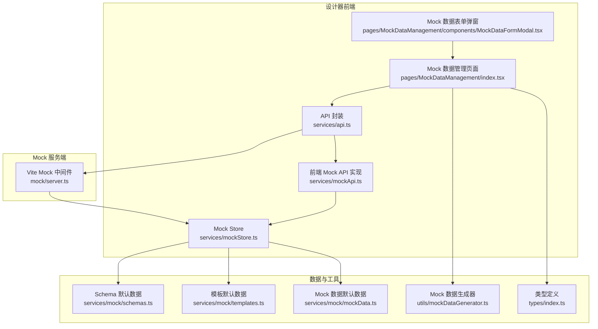
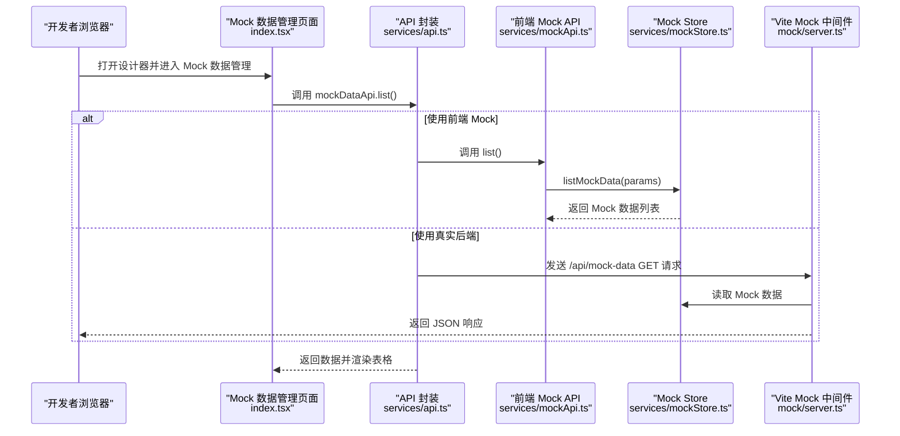
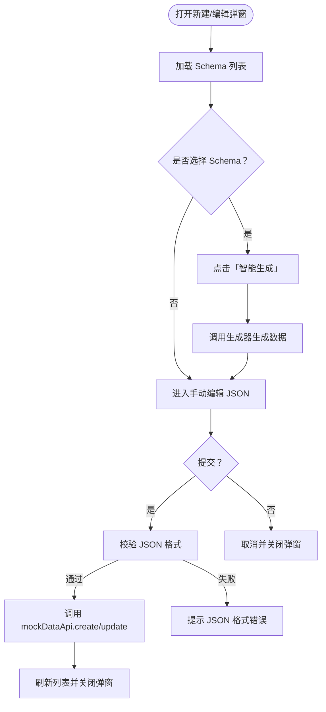
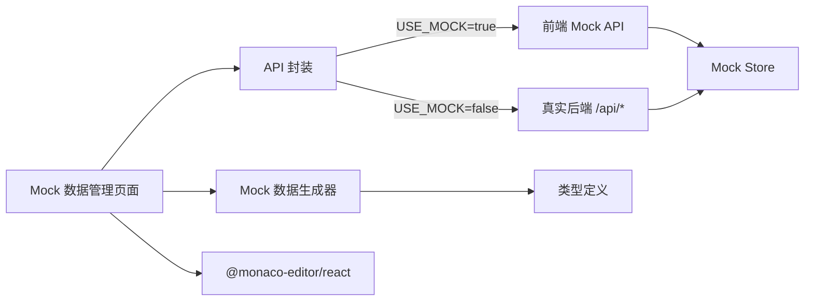

# Mock 数据管理

<cite>
**本文档引用的文件**
- [mock/index.ts](file://designer/mock/index.ts)
- [mock/server.ts](file://designer/mock/server.ts)
- [services/mockStore.ts](file://designer/src/services/mockStore.ts)
- [services/mock/schemas.ts](file://designer/src/services/mock/schemas.ts)
- [services/mock/templates.ts](file://designer/src/services/mock/templates.ts)
- [services/mock/mockData.ts](file://designer/src/services/mock/mockData.ts)
- [utils/mockDataGenerator.ts](file://designer/src/utils/mockDataGenerator.ts)
- [types/index.ts](file://designer/src/types/index.ts)
- [pages/MockDataManagement/index.tsx](file://designer/src/pages/MockDataManagement/index.tsx)
- [pages/MockDataManagement/components/MockDataFormModal.tsx](file://designer/src/pages/MockDataManagement/components/MockDataFormModal.tsx)
- [services/api.ts](file://designer/src/services/api.ts)
- [services/mockApi.ts](file://designer/src/services/mockApi.ts)
- [vite.config.ts](file://designer/vite.config.ts)
</cite>

## 目录
1. [简介](#简介)
2. [项目结构](#项目结构)
3. [核心组件](#核心组件)
4. [架构总览](#架构总览)
5. [详细组件分析](#详细组件分析)
6. [依赖分析](#依赖分析)
7. [性能考虑](#性能考虑)
8. [故障排查指南](#故障排查指南)
9. [结论](#结论)
10. [附录](#附录)

## 简介
本文件为“Mock 数据管理”使用文档，面向设计器使用者与开发者，系统性介绍 Mock 数据在开发与测试阶段的作用、生成规则、数据类型支持、自动生成机制、创建/编辑/删除/导入导出流程，以及与 Schema 的绑定关系和数据渲染过程。同时提供设计器中的使用方法、调试技巧、最佳实践与常见问题解决方案，并给出丰富的使用示例与实际应用场景。

## 项目结构
Mock 数据管理相关代码主要分布在以下模块：
- 设计器前端页面：Mock 数据管理界面、表单弹窗、API 封装与 Mock 实现
- Mock 服务端中间件：Vite 集成的开发期 Mock API
- 数据模型与工具：Schema、模板、默认内置数据、Mock 数据生成器
- 类型定义：统一的数据结构与约束

**图表来源**
- [pages/MockDataManagement/index.tsx:1-338](file://designer/src/pages/MockDataManagement/index.tsx#L1-L338)
- [pages/MockDataManagement/components/MockDataFormModal.tsx:1-129](file://designer/src/pages/MockDataManagement/components/MockDataFormModal.tsx#L1-L129)
- [services/api.ts:1-134](file://designer/src/services/api.ts#L1-L134)
- [services/mockApi.ts:1-103](file://designer/src/services/mockApi.ts#L1-L103)
- [services/mockStore.ts:1-135](file://designer/src/services/mockStore.ts#L1-L135)
- [mock/server.ts:1-193](file://designer/mock/server.ts#L1-L193)
- [services/mock/schemas.ts:1-147](file://designer/src/services/mock/schemas.ts#L1-L147)
- [services/mock/templates.ts:1-800](file://designer/src/services/mock/templates.ts#L1-L800)
- [services/mock/mockData.ts:1-639](file://designer/src/services/mock/mockData.ts#L1-L639)
- [utils/mockDataGenerator.ts:1-113](file://designer/src/utils/mockDataGenerator.ts#L1-L113)
- [types/index.ts:1-378](file://designer/src/types/index.ts#L1-L378)

**章节来源**
- [mock/index.ts:1-7](file://designer/mock/index.ts#L1-L7)
- [mock/server.ts:1-193](file://designer/mock/server.ts#L1-L193)
- [services/mockStore.ts:1-135](file://designer/src/services/mockStore.ts#L1-L135)
- [services/mock/schemas.ts:1-147](file://designer/src/services/mock/schemas.ts#L1-L147)
- [services/mock/templates.ts:1-800](file://designer/src/services/mock/templates.ts#L1-L800)
- [services/mock/mockData.ts:1-639](file://designer/src/services/mock/mockData.ts#L1-L639)
- [utils/mockDataGenerator.ts:1-113](file://designer/src/utils/mockDataGenerator.ts#L1-L113)
- [types/index.ts:1-378](file://designer/src/types/index.ts#L1-L378)
- [pages/MockDataManagement/index.tsx:1-338](file://designer/src/pages/MockDataManagement/index.tsx#L1-L338)
- [pages/MockDataManagement/components/MockDataFormModal.tsx:1-129](file://designer/src/pages/MockDataManagement/components/MockDataFormModal.tsx#L1-L129)
- [services/api.ts:1-134](file://designer/src/services/api.ts#L1-L134)
- [services/mockApi.ts:1-103](file://designer/src/services/mockApi.ts#L1-L103)
- [vite.config.ts:1-29](file://designer/vite.config.ts#L1-L29)

## 核心组件
- Mock 数据管理页面：提供 Mock 数据的增删改查、筛选、导入导出、智能生成等功能入口
- Mock 数据表单弹窗：提供手动编辑 JSON 与智能生成两种方式
- API 封装与 Mock 实现：根据环境变量决定走前端内存 Mock 还是真实后端 API
- Vite Mock 中间件：在开发期提供 /api 路由的 CRUD 接口
- Mock Store：统一的内存数据存储与 CRUD 操作
- Schema/模板/默认 Mock 数据：内置示例，支撑设计器与打印渲染
- Mock 数据生成器：基于 Schema 自动推断生成合理测试数据

**章节来源**
- [pages/MockDataManagement/index.tsx:1-338](file://designer/src/pages/MockDataManagement/index.tsx#L1-L338)
- [pages/MockDataManagement/components/MockDataFormModal.tsx:1-129](file://designer/src/pages/MockDataManagement/components/MockDataFormModal.tsx#L1-L129)
- [services/api.ts:1-134](file://designer/src/services/api.ts#L1-L134)
- [services/mockApi.ts:1-103](file://designer/src/services/mockApi.ts#L1-L103)
- [mock/server.ts:1-193](file://designer/mock/server.ts#L1-L193)
- [services/mockStore.ts:1-135](file://designer/src/services/mockStore.ts#L1-L135)
- [services/mock/schemas.ts:1-147](file://designer/src/services/mock/schemas.ts#L1-L147)
- [services/mock/templates.ts:1-800](file://designer/src/services/mock/templates.ts#L1-L800)
- [services/mock/mockData.ts:1-639](file://designer/src/services/mock/mockData.ts#L1-L639)
- [utils/mockDataGenerator.ts:1-113](file://designer/src/utils/mockDataGenerator.ts#L1-L113)

## 架构总览
Mock 数据管理采用“前端内存 Mock + Vite 开发期中间件”的双层架构：
- 开发期：Vite 插件注入 Mock 中间件，拦截 /api/* 请求，交由 mockStore 处理
- 生产期：通过 api.ts 的环境变量切换，走真实后端 HTTP 接口
- 前端页面通过统一的 API 封装调用，屏蔽底层实现差异

**图表来源**
- [services/api.ts:127-134](file://designer/src/services/api.ts#L127-L134)
- [services/mockApi.ts:75-102](file://designer/src/services/mockApi.ts#L75-L102)
- [services/mockStore.ts:98-110](file://designer/src/services/mockStore.ts#L98-L110)
- [mock/server.ts:133-169](file://designer/mock/server.ts#L133-L169)

**章节来源**
- [services/api.ts:1-134](file://designer/src/services/api.ts#L1-L134)
- [services/mockApi.ts:1-103](file://designer/src/services/mockApi.ts#L1-L103)
- [services/mockStore.ts:1-135](file://designer/src/services/mockStore.ts#L1-L135)
- [mock/server.ts:1-193](file://designer/mock/server.ts#L1-L193)

## 详细组件分析

### Mock 数据管理页面（MockDataManagement）
职责与特性：
- 加载 Schema 列表与 Mock 数据列表
- 支持按 Schema 筛选 Mock 数据
- 提供新建、编辑、删除、导出、批量导出、刷新等操作
- 集成智能生成：根据所选 Schema 自动生成合理 Mock 数据
- 支持导入 JSON 文件到表单编辑器

交互流程（新建/编辑）：

**图表来源**
- [pages/MockDataManagement/index.tsx:72-210](file://designer/src/pages/MockDataManagement/index.tsx#L72-L210)
- [pages/MockDataManagement/components/MockDataFormModal.tsx:19-125](file://designer/src/pages/MockDataManagement/components/MockDataFormModal.tsx#L19-L125)
- [utils/mockDataGenerator.ts:1-113](file://designer/src/utils/mockDataGenerator.ts#L1-L113)

**章节来源**
- [pages/MockDataManagement/index.tsx:1-338](file://designer/src/pages/MockDataManagement/index.tsx#L1-L338)
- [pages/MockDataManagement/components/MockDataFormModal.tsx:1-129](file://designer/src/pages/MockDataManagement/components/MockDataFormModal.tsx#L1-L129)
- [utils/mockDataGenerator.ts:1-113](file://designer/src/utils/mockDataGenerator.ts#L1-L113)

### Mock 数据表单弹窗（MockDataFormModal）
功能要点：
- 左侧表单：名称、关联 Schema、描述
- 右侧编辑区：Monaco 编辑器支持 JSON 手动编辑
- 智能生成标签页：根据 Schema 自动生成测试数据
- 弹窗宽度适配，支持编辑器懒加载

**章节来源**
- [pages/MockDataManagement/components/MockDataFormModal.tsx:1-129](file://designer/src/pages/MockDataManagement/components/MockDataFormModal.tsx#L1-L129)

### API 封装与 Mock 实现
- 环境变量 USE_MOCK 决定走前端内存 Mock 还是真实后端
- 基础地址 API_BASE_URL 默认指向 /api，开发期由 Vite Mock 中间件接管
- mockApi.ts 提供与真实后端一致的 CRUD 方法，内部委托 mockStore

**章节来源**
- [services/api.ts:1-134](file://designer/src/services/api.ts#L1-L134)
- [services/mockApi.ts:1-103](file://designer/src/services/mockApi.ts#L1-L103)

### Vite Mock 中间件（开发期 API）
- 中间件挂载在 /api，解析 schemas/templates/mock-data 的 CRUD 请求
- 支持 CORS 预检与标准响应头
- 错误处理返回统一结构，404/500 场景清晰

**章节来源**
- [mock/server.ts:1-193](file://designer/mock/server.ts#L1-L193)
- [mock/index.ts:1-7](file://designer/mock/index.ts#L1-L7)

### Mock Store（内存数据）
- 统一管理 schemas、templates、mockDataStore 三类数据
- 提供 list/get/create/update/delete 方法，支持过滤参数
- 初始化时从默认内置数据克隆

**章节来源**
- [services/mockStore.ts:1-135](file://designer/src/services/mockStore.ts#L1-L135)

### Schema/模板/默认 Mock 数据
- Schema：定义字段类型、枚举、格式化等元数据
- 模板：定义页面配置、组件布局、绑定关系
- 默认 Mock 数据：覆盖多种业务场景（销售出库单、批量打印、嵌套对象、不同纸张）

**章节来源**
- [services/mock/schemas.ts:1-147](file://designer/src/services/mock/schemas.ts#L1-L147)
- [services/mock/templates.ts:1-800](file://designer/src/services/mock/templates.ts#L1-L800)
- [services/mock/mockData.ts:1-639](file://designer/src/services/mock/mockData.ts#L1-L639)

### Mock 数据生成器
- 根据字段类型与键名关键字推断内容（如 name、phone、email、code、url、status、price、quantity、amount、date、datetime、percent 等）
- 对象/数组递归生成，数组长度 2-5 条
- 日期默认返回日期字符串，时间返回完整时间字符串

**章节来源**
- [utils/mockDataGenerator.ts:1-113](file://designer/src/utils/mockDataGenerator.ts#L1-L113)

### 类型定义（Mock 数据、Schema、模板）
- MockData：id、name、schemaId、templateId、data、description
- SchemaDictionary：id、name、rootType、root、version、description
- PrintTemplate：id、name、version、schemaId、page、layoutMode、components、headerComponents、footerComponents
- SchemaField：key、label、type、children、enum、format

**章节来源**
- [types/index.ts:1-378](file://designer/src/types/index.ts#L1-L378)

## 依赖分析
- 页面依赖 API 封装，API 封装在运行时决定使用 mockApi 还是真实后端
- mockApi 依赖 mockStore，负责内存数据的 CRUD
- Vite Mock 中间件依赖 mockStore，提供 /api/* 的 HTTP 接口
- 页面依赖 Monaco 编辑器进行 JSON 编辑
- 生成器依赖 Schema 定义进行智能推断

**图表来源**
- [services/api.ts:127-134](file://designer/src/services/api.ts#L127-L134)
- [services/mockApi.ts:1-103](file://designer/src/services/mockApi.ts#L1-L103)
- [services/mockStore.ts:1-135](file://designer/src/services/mockStore.ts#L1-L135)
- [mock/server.ts:1-193](file://designer/mock/server.ts#L1-L193)
- [pages/MockDataManagement/index.tsx:1-338](file://designer/src/pages/MockDataManagement/index.tsx#L1-L338)
- [utils/mockDataGenerator.ts:1-113](file://designer/src/utils/mockDataGenerator.ts#L1-L113)
- [types/index.ts:1-378](file://designer/src/types/index.ts#L1-L378)

**章节来源**
- [services/api.ts:1-134](file://designer/src/services/api.ts#L1-L134)
- [services/mockApi.ts:1-103](file://designer/src/services/mockApi.ts#L1-L103)
- [services/mockStore.ts:1-135](file://designer/src/services/mockStore.ts#L1-L135)
- [mock/server.ts:1-193](file://designer/mock/server.ts#L1-L193)
- [pages/MockDataManagement/index.tsx:1-338](file://designer/src/pages/MockDataManagement/index.tsx#L1-L338)
- [utils/mockDataGenerator.ts:1-113](file://designer/src/utils/mockDataGenerator.ts#L1-L113)
- [types/index.ts:1-378](file://designer/src/types/index.ts#L1-L378)

## 性能考虑
- 前端 Mock 模式下，API 调用带有轻微延迟（约 80ms），以模拟网络开销；创建操作延迟更长（约 150ms）
- 列表查询支持按 name/schemaId/templateId 过滤，建议在大数据量时使用筛选条件
- 导入/导出为纯前端操作，避免网络往返，适合离线编辑
- Monaco 编辑器懒加载，首次打开弹窗时会短暂等待

[本节为通用指导，无需列出具体文件来源]

## 故障排查指南
- “Schema 不存在”：确保在新建/编辑前选择了正确的 Schema
- “JSON 格式错误”：检查编辑器中的 JSON 语法，确保可被 JSON.parse 正确解析
- “Mock 数据未找到”：确认 id 是否正确，或尝试刷新页面重新加载
- “跨域/404”：开发期请确认 Vite Mock 中间件已启用且路由为 /api/*
- “导入失败”：确认文件为合法 JSON，至少包含 name 与 data 字段

**章节来源**
- [pages/MockDataManagement/index.tsx:101-118](file://designer/src/pages/MockDataManagement/index.tsx#L101-L118)
- [pages/MockDataManagement/index.tsx:150-180](file://designer/src/pages/MockDataManagement/index.tsx#L150-L180)
- [services/mockApi.ts:9-14](file://designer/src/services/mockApi.ts#L9-L14)
- [mock/server.ts:171-178](file://designer/mock/server.ts#L171-L178)

## 结论
本 Mock 数据管理体系通过“前端内存 Mock + Vite 开发期中间件”的组合，在开发与测试阶段提供了高效、可控、可扩展的测试数据支持。配合 Schema 的元数据驱动与智能生成器，用户可以快速构建符合业务语义的测试数据，并与模板绑定完成打印渲染验证。生产环境可无缝切换到真实后端，保证一致性与可维护性。

[本节为总结性内容，无需列出具体文件来源]

## 附录

### Mock 数据的作用与使用场景
- 开发阶段：快速搭建测试数据，验证设计器与打印引擎渲染效果
- 测试阶段：覆盖边界场景（空数据、超大数据量、嵌套对象、批量打印等）
- 设计阶段：与 Schema/模板联动，验证字段映射与布局合理性

### 数据类型支持与生成规则
- 字符串：根据键名关键字推断（name、phone、email、address、code、url、status 等）
- 数字：根据键名关键字推断（price、amount、quantity、count、age、percent 等）
- 布尔：随机布尔值
- 日期/时间：日期字符串或完整时间字符串
- 对象/数组：递归生成，数组长度 2-5 条

**章节来源**
- [utils/mockDataGenerator.ts:1-113](file://designer/src/utils/mockDataGenerator.ts#L1-L113)

### 创建/编辑/删除/导入导出操作指南
- 创建：打开新建弹窗，填写基本信息，选择 Schema 后点击“智能生成”，或直接在 JSON 编辑器中编写，最后保存
- 编辑：在列表中点击“编辑”，修改名称/描述/Schema 关联或 JSON 数据，保存
- 删除：在列表中点击“删除”，确认后移除
- 导入：支持单条 JSON 导入（至少包含 name 与 data），或批量导入（待实现）
- 导出：支持单条导出与批量导出

**章节来源**
- [pages/MockDataManagement/index.tsx:72-210](file://designer/src/pages/MockDataManagement/index.tsx#L72-L210)
- [pages/MockDataManagement/components/MockDataFormModal.tsx:19-125](file://designer/src/pages/MockDataManagement/components/MockDataFormModal.tsx#L19-L125)

### 与 Schema 的绑定关系与数据渲染
- Mock 数据可选择性关联 Schema，以便使用智能生成器与筛选管理
- 渲染时，模板中的组件通过绑定路径（如 items、customer.name、summary.finalAmount）从 Mock 数据中提取数据
- 嵌套对象路径（如 product.name）在表格列 dataIndex 中直接支持

**章节来源**
- [services/mock/templates.ts:1-800](file://designer/src/services/mock/templates.ts#L1-L800)
- [services/mock/schemas.ts:1-147](file://designer/src/services/mock/schemas.ts#L1-L147)

### 设计器中的使用方法与调试技巧
- 使用“筛选 Schema”快速定位 Mock 数据
- 使用“智能生成”快速获得符合 Schema 的测试数据
- 使用“手动编辑”微调字段值，结合 Monaco 编辑器的语法高亮与校验
- 使用“刷新”按钮同步最新数据
- 开发期通过 Vite Mock 中间件访问 /api/*，便于联调

**章节来源**
- [pages/MockDataManagement/index.tsx:1-338](file://designer/src/pages/MockDataManagement/index.tsx#L1-L338)
- [vite.config.ts:1-29](file://designer/vite.config.ts#L1-L29)
- [mock/server.ts:1-193](file://designer/mock/server.ts#L1-L193)

### 最佳实践
- 为常用业务场景建立对应的 Schema 与模板，复用 Mock 数据
- 使用“智能生成”作为起点，再进行人工微调
- 对于大批量数据，优先使用默认内置数据中的示例，减少生成时间
- 导出重要数据快照，便于团队共享与回归测试

[本节为通用指导，无需列出具体文件来源]

### 实际应用场景示例
- 销售出库单：标准字段、明细列表、汇总信息、二维码/条形码
- 月度销售汇总表：大数据量表格渲染与分页
- 简单测试单：最小数据集，快速验证
- 批量打印测试：多份不同订单数据
- 嵌套对象演示：表格列使用嵌套路径（如 product.name）
- 二分纸/不同纸张：A5/A4/连续纸模板的测试数据

**章节来源**
- [services/mock/mockData.ts:1-639](file://designer/src/services/mock/mockData.ts#L1-L639)
- [services/mock/templates.ts:1-800](file://designer/src/services/mock/templates.ts#L1-L800)