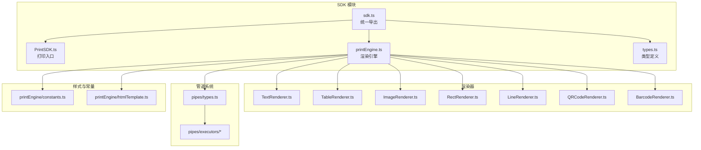
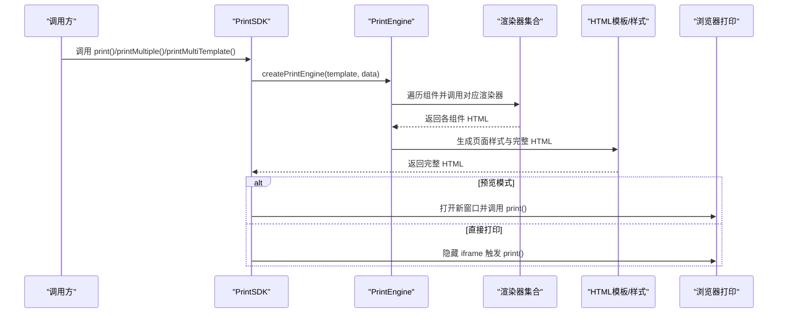
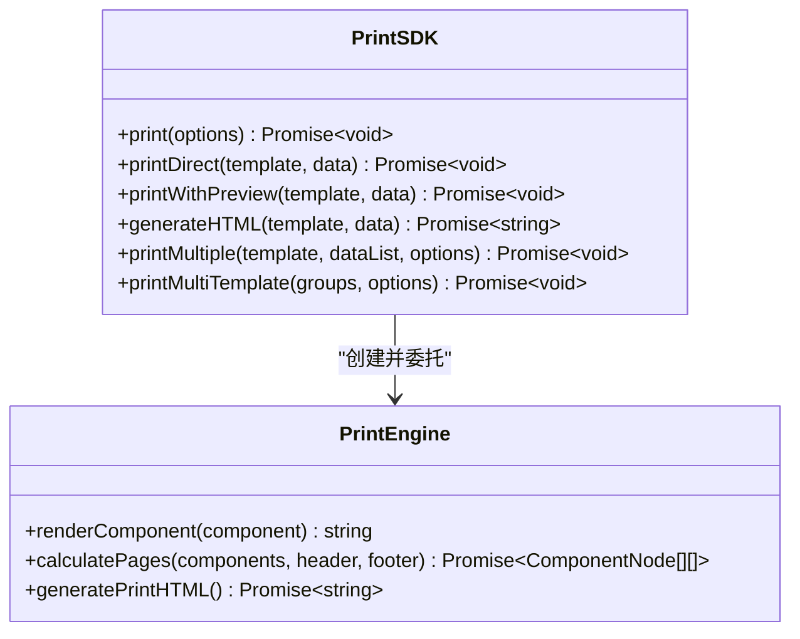
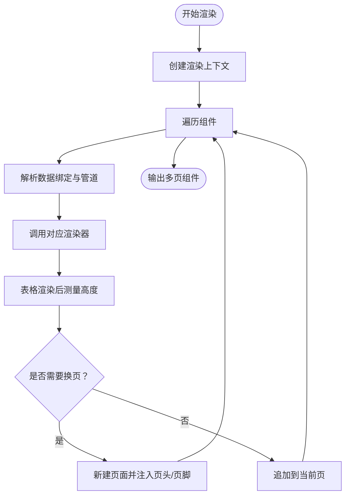
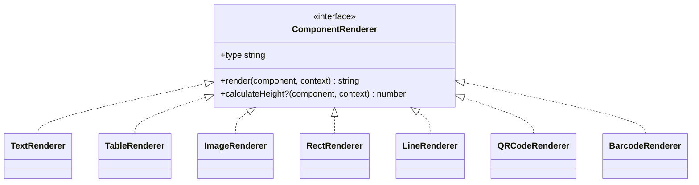
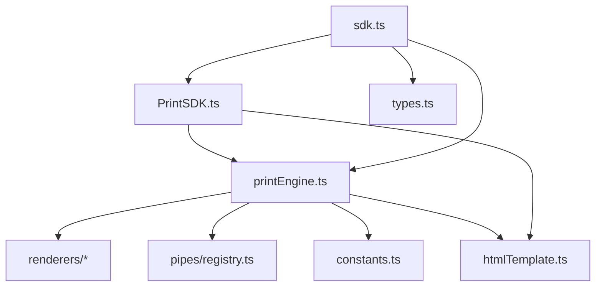

# SDK 开发指南

<cite>
**本文引用的文件**
- [PrintSDK.ts](file://sdk/src/PrintSDK.ts)
- [printEngine.ts](file://sdk/src/printEngine.ts)
- [sdk.ts](file://sdk/src/sdk.ts)
- [types.ts](file://sdk/src/types.ts)
- [printEngine/types.ts](file://sdk/src/printEngine/types.ts)
- [printEngine/constants.ts](file://sdk/src/printEngine/constants.ts)
- [printEngine/htmlTemplate.ts](file://sdk/src/printEngine/htmlTemplate.ts)
- [printEngine/renderers/index.ts](file://sdk/src/printEngine/renderers/index.ts)
- [printEngine/renderers/TextRenderer.ts](file://sdk/src/printEngine/renderers/TextRenderer.ts)
- [pipes/types.ts](file://sdk/src/pipes/types.ts)
- [pipes/executors/ChineseNumberPipe.ts](file://sdk/src/pipes/executors/ChineseNumberPipe.ts)
- [package.json](file://sdk/package.json)
- [README.md](file://sdk/README.md)
- [example.html](file://sdk/example.html)
</cite>

## 目录
1. [简介](#简介)
2. [项目结构](#项目结构)
3. [核心组件](#核心组件)
4. [架构总览](#架构总览)
5. [详细组件分析](#详细组件分析)
6. [依赖关系分析](#依赖关系分析)
7. [性能考虑](#性能考虑)
8. [故障排查指南](#故障排查指南)
9. [结论](#结论)
10. [附录](#附录)

## 简介
本指南面向希望在前端集成“零配置打印”能力的开发者，系统讲解 Print SDK 的设计理念、架构设计与使用方法。SDK 的核心思想是“零配置打印”，即直接接收模板数据与业务数据，无需模板服务或额外配置，即可完成从模板渲染到浏览器打印的全流程。PrintSDK 类提供 print()、printMultiple()、printMultiTemplate() 等核心接口；PrintEngine 负责插件化渲染、数据绑定、管道转换与虚拟分页；HTML 模板与样式生成器负责输出可打印的完整 HTML；渲染器与管道系统支持扩展与定制。

## 项目结构
SDK 位于 sdk 目录，采用模块化与插件化设计：
- SDK 入口与导出：sdk.ts
- 核心类：PrintSDK.ts、printEngine.ts
- 类型定义：types.ts、printEngine/types.ts
- 渲染器：printEngine/renderers/*
- 管道系统：pipes/*
- 常量与样式：printEngine/constants.ts、printEngine/htmlTemplate.ts
- 示例与打包：example.html、package.json

图表来源
- [sdk.ts:1-66](file://sdk/src/sdk.ts#L1-L66)
- [PrintSDK.ts:100-477](file://sdk/src/PrintSDK.ts#L100-L477)
- [printEngine.ts:30-28](file://sdk/src/printEngine.ts#L30-L28)
- [printEngine/renderers/index.ts:1-13](file://sdk/src/printEngine/renderers/index.ts#L1-L13)
- [pipes/types.ts:1-30](file://sdk/src/pipes/types.ts#L1-L30)
- [printEngine/constants.ts:1-113](file://sdk/src/printEngine/constants.ts#L1-L113)
- [printEngine/htmlTemplate.ts:1-281](file://sdk/src/printEngine/htmlTemplate.ts#L1-L281)

章节来源
- [sdk.ts:1-66](file://sdk/src/sdk.ts#L1-L66)
- [package.json:1-61](file://sdk/package.json#L1-L61)

## 核心组件
- PrintSDK：对外 API 的唯一入口，提供 print()、printMultiple()、printMultiTemplate()、generateHTML() 等方法，支持预览与直接打印两种模式，内置进度回调与错误兜底。
- PrintEngine：插件化渲染引擎，负责数据绑定、管道转换、组件渲染、虚拟分页与页头/页脚注入，支持表格跨页拆分与渲染后测量。
- 渲染器：TextRenderer、TableRenderer、ImageRenderer、RectRenderer、LineRenderer、QRCodeRenderer、BarcodeRenderer，统一实现 ComponentRenderer 接口。
- 管道系统：PipeExecutor 接口与内置执行器（如 ChineseNumberPipe），支持链式转换。
- HTML 模板与样式：generatePrintPageStyles、generateBatchPrintStyles、generatePrintHTML、getPageSizeFromConfig，统一输出可打印的完整 HTML。
- 类型系统：PrintTemplate、ComponentNode、PageConfig、PipeConfig、TableProps 等，确保模板与数据结构的强类型约束。

章节来源
- [PrintSDK.ts:100-477](file://sdk/src/PrintSDK.ts#L100-L477)
- [printEngine.ts:30-28](file://sdk/src/printEngine.ts#L30-L28)
- [types.ts:185-217](file://sdk/src/types.ts#L185-L217)
- [printEngine/types.ts:57-82](file://sdk/src/printEngine/types.ts#L57-L82)
- [printEngine/htmlTemplate.ts:81-281](file://sdk/src/printEngine/htmlTemplate.ts#L81-L281)

## 架构总览
SDK 采用“零配置”的设计理念：模板数据与业务数据直接传入，PrintSDK 内部创建 PrintEngine 并生成可打印 HTML，再通过浏览器打印 API 或隐藏 iframe 触发打印。渲染器与管道系统通过插件化扩展，支持多种组件与数据格式化。

图表来源
- [PrintSDK.ts:110-172](file://sdk/src/PrintSDK.ts#L110-L172)
- [printEngine.ts:196-213](file://sdk/src/printEngine.ts#L196-L213)
- [printEngine/htmlTemplate.ts:230-252](file://sdk/src/printEngine/htmlTemplate.ts#L230-L252)

## 详细组件分析

### PrintSDK 类与核心接口
- print(options)：支持 preview 预览与直接打印；预览模式打开新窗口，直接打印模式使用隐藏 iframe；内置图片加载等待与 afterprint 清理。
- printDirect(template, data)：快捷直连打印。
- printWithPreview(template, data)：快捷预览后打印。
- generateHTML(template, data)：仅生成 HTML 字符串，不触发打印。
- printMultiple(template, dataList, options)：同模板多数据批量打印，支持进度回调与预览。
- printMultiTemplate(groups, options)：多模板多数据批量打印，要求所有模板纸张尺寸一致。

图表来源
- [PrintSDK.ts:100-477](file://sdk/src/PrintSDK.ts#L100-L477)
- [printEngine.ts:30-28](file://sdk/src/printEngine.ts#L30-L28)

章节来源
- [PrintSDK.ts:100-477](file://sdk/src/PrintSDK.ts#L100-L477)

### PrintEngine 工作原理与渲染流程
- 插件化注册：构造时注册默认渲染器，支持动态注册/注销。
- 数据绑定：getValueByPath 支持嵌套路径与智能前缀去除；resolveBinding 结合管道链执行。
- 渲染上下文：提供 mmToPx、pageInfo、resolveBinding、applyPipes 等能力。
- 虚拟分页：按 yMm 排序与相对间距累加，表格跨页拆分采用“渲染后测量”策略，确保分页精度。
- 页头/页脚：根据配置注入 headerComponents/footerComponents，并统一设置 overflow: hidden。

图表来源
- [printEngine.ts:418-620](file://sdk/src/printEngine.ts#L418-L620)
- [printEngine.ts:762-800](file://sdk/src/printEngine.ts#L762-L800)

章节来源
- [printEngine.ts:30-28](file://sdk/src/printEngine.ts#L30-L28)
- [printEngine.ts:169-191](file://sdk/src/printEngine.ts#L169-L191)
- [printEngine.ts:418-620](file://sdk/src/printEngine.ts#L418-L620)
- [printEngine.ts:762-800](file://sdk/src/printEngine.ts#L762-L800)

### 渲染器体系
- TextRenderer：支持 label 前缀、flex 布局与文本对齐，计算高度使用默认值。
- TableRenderer：复杂表格渲染，支持列宽、边框、合计、跨页重复表头、行号列、合计额外行等。
- ImageRenderer、RectRenderer、LineRenderer、QRCodeRenderer、BarcodeRenderer：分别渲染对应组件。

图表来源
- [printEngine/types.ts:57-82](file://sdk/src/printEngine/types.ts#L57-L82)
- [printEngine/renderers/TextRenderer.ts:10-59](file://sdk/src/printEngine/renderers/TextRenderer.ts#L10-L59)
- [printEngine/renderers/index.ts:1-13](file://sdk/src/printEngine/renderers/index.ts#L1-L13)

章节来源
- [printEngine/types.ts:57-82](file://sdk/src/printEngine/types.ts#L57-L82)
- [printEngine/renderers/TextRenderer.ts:10-59](file://sdk/src/printEngine/renderers/TextRenderer.ts#L10-L59)

### 管道系统与数据转换
- PipeExecutor 接口：type、label、execute(value, options)。
- 内置执行器：ChineseNumberPipe（中文大写数字/小数/负数支持）、CurrencyPipe、MoneyPipe、DatePipe 等。
- 使用方式：在组件 DataBinding.pipes 中配置，按顺序执行。

图表来源
- [pipes/types.ts:11-29](file://sdk/src/pipes/types.ts#L11-L29)
- [pipes/executors/ChineseNumberPipe.ts:99-138](file://sdk/src/pipes/executors/ChineseNumberPipe.ts#L99-L138)

章节来源
- [pipes/types.ts:1-30](file://sdk/src/pipes/types.ts#L1-L30)
- [pipes/executors/ChineseNumberPipe.ts:1-138](file://sdk/src/pipes/executors/ChineseNumberPipe.ts#L1-L138)

### HTML 模板与样式生成
- generatePrintPageStyles：预览模式样式，支持连续纸与标准分页。
- generateBatchPrintStyles：批量打印样式，适配直接打印与屏幕预览。
- generatePrintHTML：输出完整 HTML 文档。
- getPageSizeFromConfig：根据 PageConfig 推导页面宽高与方向。

章节来源
- [printEngine/htmlTemplate.ts:81-281](file://sdk/src/printEngine/htmlTemplate.ts#L81-L281)

## 依赖关系分析
- PrintSDK 依赖 PrintEngine 与 HTML 模板工具。
- PrintEngine 依赖渲染器集合、管道注册器、常量与样式工具。
- 渲染器依赖样式构建工具与常量。
- 管道系统依赖类型定义与执行器实现。
- SDK 统一导出入口集中暴露 API 与类型。

图表来源
- [sdk.ts:1-66](file://sdk/src/sdk.ts#L1-L66)
- [PrintSDK.ts:7-14](file://sdk/src/PrintSDK.ts#L7-L14)
- [printEngine.ts:6-28](file://sdk/src/printEngine.ts#L6-L28)

章节来源
- [sdk.ts:1-66](file://sdk/src/sdk.ts#L1-L66)

## 性能考虑
- 图片加载等待：在预览与直接打印前等待图片资源加载完成，避免打印内容缺失。
- 渲染后测量：表格跨页采用“渲染后测量”策略，提高分页精度，减少截断风险。
- 连续纸模式：连续纸高度为 Infinity，样式与分页逻辑特殊处理。
- 页头/页脚溢出控制：统一注入 overflow: hidden，避免内容溢出。
- afterprint 事件与兜底清理：监听打印完成事件并在超时后清理隐藏 iframe，避免内存泄漏。
- 常量换算：MM_TO_PX 为 3.78（96 DPI），统一单位换算，减少误差累积。

章节来源
- [PrintSDK.ts:125-171](file://sdk/src/PrintSDK.ts#L125-L171)
- [printEngine.ts:626-756](file://sdk/src/printEngine.ts#L626-L756)
- [printEngine.ts:427-429](file://sdk/src/printEngine.ts#L427-L429)
- [printEngine.ts:208-210](file://sdk/src/printEngine.ts#L208-L210)
- [printEngine/constants.ts:8-8](file://sdk/src/printEngine/constants.ts#L8-L8)

## 故障排查指南
- 打开新窗口失败：预览模式下 window.open 返回空，抛出错误。检查浏览器弹窗策略与权限。
- iframe 访问失败：隐藏 iframe 的 contentWindow/document 不存在，抛出错误。检查跨域与安全策略。
- afterprint 未触发：用户取消打印或浏览器不支持，提供 5 秒兜底清理。
- 正则提取 body 失败：DOMParser 解析失败时回退到正则提取，仍失败则返回 null。
- 表格高度异常：组件高度接近页面可用高度时发出警告，建议调整布局或数据。
- 多模板尺寸不一致：printMultiTemplate 要求所有模板使用相同纸张尺寸，否则行为不可预测。

章节来源
- [PrintSDK.ts:117-120](file://sdk/src/PrintSDK.ts#L117-L120)
- [PrintSDK.ts:138-140](file://sdk/src/PrintSDK.ts#L138-L140)
- [PrintSDK.ts:157-170](file://sdk/src/PrintSDK.ts#L157-L170)
- [PrintSDK.ts:21-42](file://sdk/src/PrintSDK.ts#L21-L42)
- [printEngine.ts:492-496](file://sdk/src/printEngine.ts#L492-L496)
- [README.md:223-224](file://sdk/README.md#L223-L224)

## 结论
Print SDK 通过“零配置打印”的理念，将模板数据与业务数据直接转化为可打印 HTML，结合插件化渲染器与管道系统，满足多样化的打印需求。其架构清晰、扩展性强，适合快速集成到各类前端项目中。建议在生产环境中关注图片加载、连续纸与页头/页脚溢出控制、以及 afterprint 事件的兜底清理。

## 附录

### 安装与集成
- NPM 安装：使用包名 @jcyao/print-sdk。
- ESM/CJS 导入：通过统一导出入口导入 createPrintSDK、PrintEngine、常量与类型。
- 基本使用：创建实例后调用 print()/printMultiple()/printMultiTemplate()，或仅生成 HTML。

章节来源
- [package.json:1-61](file://sdk/package.json#L1-L61)
- [sdk.ts:1-66](file://sdk/src/sdk.ts#L1-L66)
- [README.md:84-136](file://sdk/README.md#L84-L136)

### API 一览与参数说明
- print(options)
  - template: PrintTemplate
  - data: any
  - preview?: boolean
- printMultiple(template, dataList, options)
  - preview?: boolean
  - onProgress?: (progress) => void
- printMultiTemplate(groups, options)
  - preview?: boolean
  - onProgress?: (progress) => void
- generateHTML(template, data): Promise<string>
- printDirect/templateWithPreview: 快捷方法

章节来源
- [PrintSDK.ts:47-98](file://sdk/src/PrintSDK.ts#L47-L98)
- [README.md:138-221](file://sdk/README.md#L138-L221)

### 配置选项与类型
- PageConfig：size、orientation、marginMm、pageNumber、header/footer 区域配置。
- ComponentNode：id、type、layout、style、binding、props、children、_section。
- PipeConfig：type、options。
- TableProps：columns、showHeader、bordered、showSummary、summaryMode、showRowNumber、rowNumberWidth、summaryExtraRows 等。

章节来源
- [types.ts:49-217](file://sdk/src/types.ts#L49-L217)
- [printEngine/types.ts:11-55](file://sdk/src/printEngine/types.ts#L11-L55)

### 错误处理与最佳实践
- 预览失败：检查浏览器弹窗策略与权限。
- 打印失败：确认 afterprint 事件与兜底清理逻辑。
- 多模板限制：确保所有模板纸张尺寸一致。
- 表格跨页：合理设置 repeatHeader 与列宽，避免截断。
- 数据绑定：使用嵌套路径时注意 root 前缀自动去除逻辑。

章节来源
- [PrintSDK.ts:117-171](file://sdk/src/PrintSDK.ts#L117-L171)
- [README.md:223-224](file://sdk/README.md#L223-L224)
- [printEngine.ts:773-774](file://sdk/src/printEngine.ts#L773-L774)

### 高级用法与扩展开发
- 自定义渲染器：实现 ComponentRenderer 接口并注册到 PrintEngine。
- 自定义管道：实现 PipeExecutor 接口并接入管道系统。
- 自定义样式：通过 styleBuilder 与 constants.ts 调整默认样式与尺寸。
- 扩展组件：在 renderers 目录新增组件渲染器，并在统一导出中暴露。

章节来源
- [printEngine/types.ts:57-82](file://sdk/src/printEngine/types.ts#L57-L82)
- [pipes/types.ts:11-29](file://sdk/src/pipes/types.ts#L11-L29)
- [printEngine/constants.ts:13-46](file://sdk/src/printEngine/constants.ts#L13-L46)
- [sdk.ts:40-49](file://sdk/src/sdk.ts#L40-L49)

### 实际业务场景应用示例
- 订单小票：文本组件展示订单号、时间、收货人信息；表格组件展示商品明细；二维码组件展示订单二维码。
- 财务报表：表格组件展示收支明细与合计；合计额外行展示金额大写；页码配置支持多页定位。
- 出入库单据：图片组件插入公司 Logo；线条组件绘制分割线；矩形组件绘制边框。

章节来源
- [README.md:225-454](file://sdk/README.md#L225-L454)