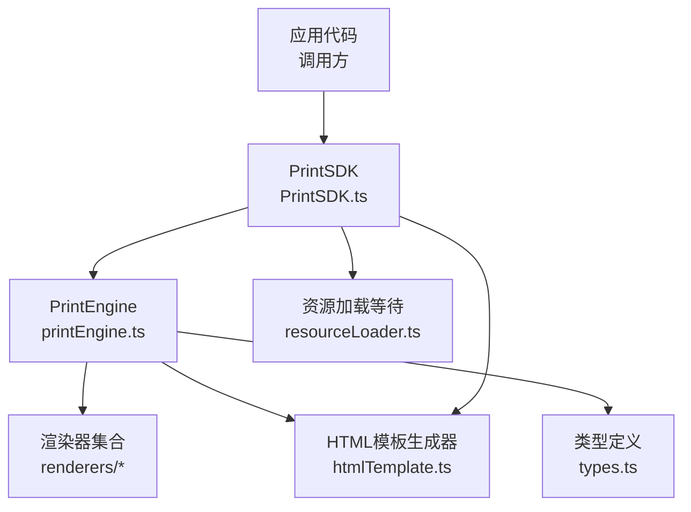
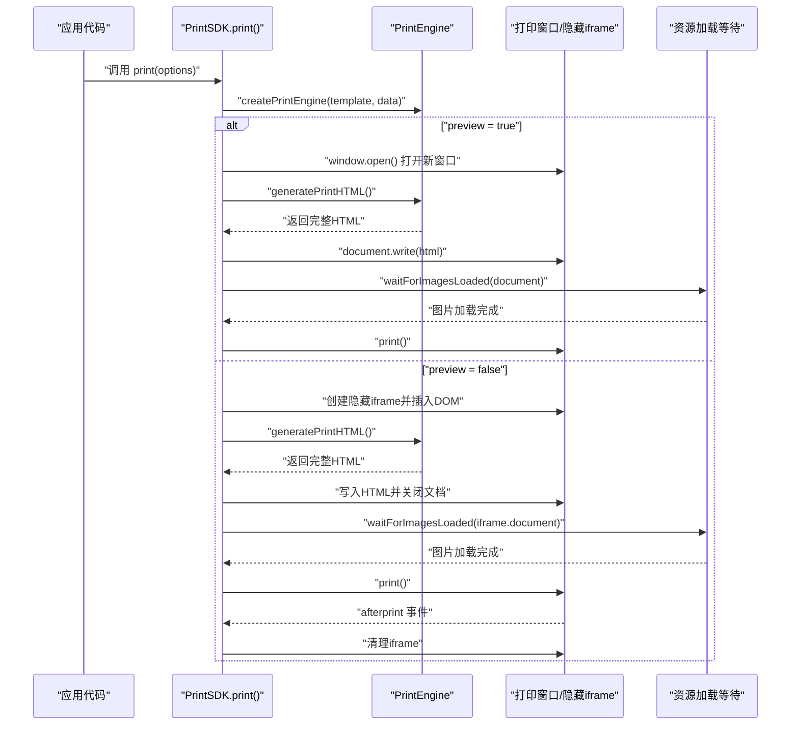
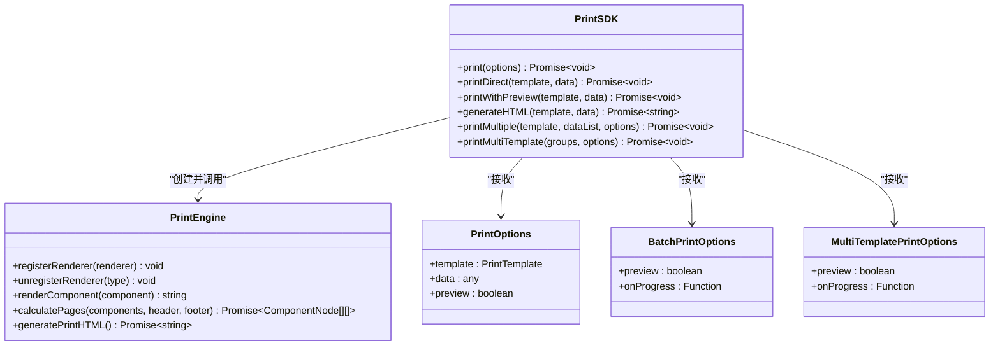
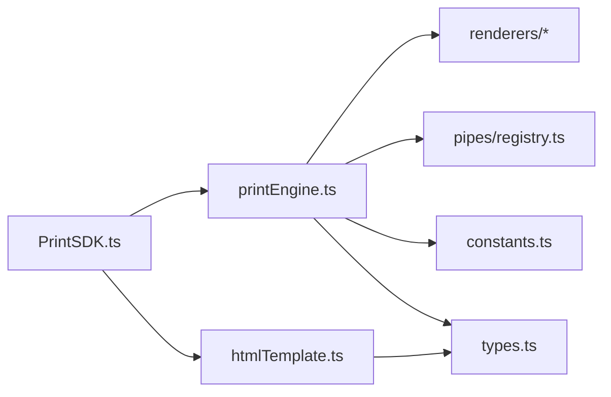

# 基础使用

<cite>
**本文引用的文件**
- [PrintSDK.ts](file://sdk/src/PrintSDK.ts)
- [printEngine.ts](file://sdk/src/printEngine.ts)
- [htmlTemplate.ts](file://sdk/src/printEngine/htmlTemplate.ts)
- [types.ts](file://sdk/src/types.ts)
- [sdk.ts](file://sdk/src/sdk.ts)
- [example.html](file://sdk/example.html)
- [package.json](file://sdk/package.json)
- [README.md](file://sdk/README.md)
</cite>

## 目录
1. [简介](#简介)
2. [项目结构](#项目结构)
3. [核心组件](#核心组件)
4. [架构概览](#架构概览)
5. [详细组件分析](#详细组件分析)
6. [依赖分析](#依赖分析)
7. [性能考虑](#性能考虑)
8. [故障排查指南](#故障排查指南)
9. [结论](#结论)
10. [附录](#附录)

## 简介
本指南面向首次使用打印 SDK 的开发者，聚焦 PrintSDK 类的基础用法与常见业务场景，帮助你快速完成从“准备模板与业务数据”到“发起打印”的全流程。内容涵盖：
- 如何创建 PrintSDK 实例
- print() 方法的使用与 printOptions 参数详解
- printDirect() 与 printWithPreview() 的区别与适用场景
- generateHTML() 生成 HTML 的用法
- 批量打印与多模板批量打印的流程与注意事项
- 错误处理与异常情况的应对策略
- 常见业务场景的实现思路与示例路径

## 项目结构
SDK 采用“解耦设计”，PrintSDK 不依赖模板服务，直接接收模板数据进行打印。核心模块关系如下：

图表来源
- [PrintSDK.ts:100-172](file://sdk/src/PrintSDK.ts#L100-L172)
- [printEngine.ts:30-65](file://sdk/src/printEngine.ts#L30-L65)
- [htmlTemplate.ts:227-252](file://sdk/src/printEngine/htmlTemplate.ts#L227-L252)

章节来源
- [sdk.ts:6-39](file://sdk/src/sdk.ts#L6-L39)
- [package.json:1-61](file://sdk/package.json#L1-L61)

## 核心组件
- PrintSDK：对外暴露的打印入口，负责打印流程编排、预览与直接打印、HTML 生成、批量打印与多模板批量打印。
- PrintEngine：内部打印引擎，负责模板解析、数据绑定、管道转换、组件渲染与分页计算。
- HTML 模板生成器：统一生成页面样式与完整 HTML 文档，支持预览与直接打印两种模式。
- 类型系统：提供模板、组件节点、分页、页码、表格等完整类型定义。

章节来源
- [PrintSDK.ts:100-190](file://sdk/src/PrintSDK.ts#L100-L190)
- [printEngine.ts:30-65](file://sdk/src/printEngine.ts#L30-L65)
- [types.ts:48-217](file://sdk/src/types.ts#L48-L217)

## 架构概览
下面的序列图展示了 print() 的典型调用链路，包括预览与直接打印两种路径。

图表来源
- [PrintSDK.ts:110-172](file://sdk/src/PrintSDK.ts#L110-L172)
- [htmlTemplate.ts:227-252](file://sdk/src/printEngine/htmlTemplate.ts#L227-L252)

## 详细组件分析

### PrintSDK 类与基本用法
- 创建实例：通过工厂函数创建 SDK 实例，无需任何初始化配置。
- 基本打印：print(options) 接收模板与业务数据，并根据 preview 决定行为。
- 快捷方法：
  - printDirect(template, data)：直接打印（preview=false）。
  - printWithPreview(template, data)：预览后打印（preview=true）。
- 仅生成 HTML：generateHTML(template, data) 返回完整 HTML 字符串，便于调试或二次处理。
- 批量打印：printMultiple(template, dataList, options) 将多条数据合并为一份文档，减少用户确认次数。
- 多模板批量打印：printMultiTemplate(groups, options) 支持多个模板各自绑定数据列表，一次打印确认。

章节来源
- [PrintSDK.ts:100-190](file://sdk/src/PrintSDK.ts#L100-L190)
- [PrintSDK.ts:210-322](file://sdk/src/PrintSDK.ts#L210-L322)
- [PrintSDK.ts:332-467](file://sdk/src/PrintSDK.ts#L332-L467)
- [sdk.ts:6-15](file://sdk/src/sdk.ts#L6-L15)

### printOptions 参数详解
- template：打印模板数据，包含页面配置与组件树。
- data：业务数据对象，用于数据绑定与管道转换。
- preview：是否预览（默认 false）。true 时在新窗口打开打印预览；false 时在隐藏 iframe 中直接打印。

章节来源
- [PrintSDK.ts:47-51](file://sdk/src/PrintSDK.ts#L47-L51)
- [types.ts:204-217](file://sdk/src/types.ts#L204-L217)

### printDirect() 与 printWithPreview() 的区别与使用场景
- printDirect：适合后台批量打印、自动化流程，无需用户交互。
- printWithPreview：适合人工核对场景，用户可在预览窗口确认内容后再打印。

章节来源
- [PrintSDK.ts:179-190](file://sdk/src/PrintSDK.ts#L179-L190)

### generateHTML() 的用法
- 用途：仅生成 HTML 字符串，不触发打印，适用于调试、截图、二次处理等场景。
- 返回：完整 HTML 文档字符串（包含样式与页面结构）。

章节来源
- [PrintSDK.ts:198-201](file://sdk/src/PrintSDK.ts#L198-L201)
- [htmlTemplate.ts:227-252](file://sdk/src/printEngine/htmlTemplate.ts#L227-L252)

### 批量打印 printMultiple() 与多模板批量打印 printMultiTemplate()
- printMultiple：
  - 将同一模板下的多条数据渲染为多个页面片段，再统一生成完整 HTML。
  - 支持进度回调 onProgress，便于前端展示处理状态。
  - 支持 preview 与直接打印两种模式。
- printMultiTemplate：
  - 支持多个模板各自绑定数据列表，一次打印确认。
  - 注意：所有模板需使用相同纸张尺寸与边距设置，混合尺寸暂不支持。

章节来源
- [PrintSDK.ts:210-322](file://sdk/src/PrintSDK.ts#L210-L322)
- [PrintSDK.ts:332-467](file://sdk/src/PrintSDK.ts#L332-L467)
- [htmlTemplate.ts:178-225](file://sdk/src/printEngine/htmlTemplate.ts#L178-L225)

### 打印流程与数据绑定
- PrintEngine 负责：
  - 注册默认渲染器（文本、表格、图片、矩形、线条、二维码、条形码）。
  - 解析数据绑定路径，支持嵌套访问与智能前缀处理。
  - 应用管道转换（日期、货币、中文大写、大小写、切片、默认值等）。
  - 计算分页与表格跨页拆分，支持页头/页脚区域注入。
- HTML 模板生成器：
  - 预览模式样式：带页面间隔与阴影，媒体查询区分屏幕与打印。
  - 直接打印样式：媒体查询控制打印页尺寸与分页。
  - 组件基础样式：统一各组件定位与显示规则。

章节来源
- [printEngine.ts:30-65](file://sdk/src/printEngine.ts#L30-L65)
- [printEngine.ts:74-125](file://sdk/src/printEngine.ts#L74-L125)
- [printEngine.ts:196-213](file://sdk/src/printEngine.ts#L196-L213)
- [printEngine.ts:418-620](file://sdk/src/printEngine.ts#L418-L620)
- [htmlTemplate.ts:26-75](file://sdk/src/printEngine/htmlTemplate.ts#L26-L75)
- [htmlTemplate.ts:81-172](file://sdk/src/printEngine/htmlTemplate.ts#L81-L172)
- [htmlTemplate.ts:178-225](file://sdk/src/printEngine/htmlTemplate.ts#L178-L225)

### 类与接口关系图

图表来源
- [PrintSDK.ts:100-190](file://sdk/src/PrintSDK.ts#L100-L190)
- [PrintSDK.ts:210-322](file://sdk/src/PrintSDK.ts#L210-L322)
- [PrintSDK.ts:332-467](file://sdk/src/PrintSDK.ts#L332-L467)
- [printEngine.ts:30-65](file://sdk/src/printEngine.ts#L30-L65)
- [types.ts:47-98](file://sdk/src/types.ts#L47-L98)

## 依赖分析
- PrintSDK 依赖 PrintEngine 与 HTML 模板生成器，以及资源加载等待工具。
- PrintEngine 依赖渲染器插件、管道注册表与常量配置。
- 类型系统贯穿于模板、组件、表格、页码等定义。

图表来源
- [PrintSDK.ts:7-14](file://sdk/src/PrintSDK.ts#L7-L14)
- [printEngine.ts:6-28](file://sdk/src/printEngine.ts#L6-L28)
- [sdk.ts:17-49](file://sdk/src/sdk.ts#L17-L49)

章节来源
- [sdk.ts:6-66](file://sdk/src/sdk.ts#L6-L66)

## 性能考虑
- 图片资源加载：打印前等待图片加载完成，避免白屏或缺图。二维码与条形码已同步生成为 base64，主要等待外部图片资源。
- 打印完成清理：优先监听 afterprint 事件清理隐藏 iframe；若未触发则设置兜底定时器，避免内存泄漏。
- 批量打印：将多条数据渲染为页面片段后统一生成 HTML，减少多次打印确认，提高用户体验。
- 分页计算：采用“渲染后测量”方案，提升表格跨页分页精度，避免长文本换行导致的截断问题。

章节来源
- [PrintSDK.ts:125-171](file://sdk/src/PrintSDK.ts#L125-L171)
- [PrintSDK.ts:295-321](file://sdk/src/PrintSDK.ts#L295-L321)
- [printEngine.ts:626-756](file://sdk/src/printEngine.ts#L626-L756)

## 故障排查指南
- 无法打开打印窗口（预览模式）：检查浏览器弹窗拦截设置，确保 window.open() 成功。
- 无法访问 iframe 文档：检查跨域与安全策略，确保在受信任环境下运行。
- afterprint 事件未触发：SDK 已提供兜底清理逻辑（5 秒后清理），若仍出现残留，检查浏览器策略或手动清理。
- 批量打印进度异常：确认 onProgress 回调正确传递，注意失败项会增加 failed 并推进 completed。
- 多模板打印失败：确保所有模板使用相同纸张尺寸与边距设置，混合尺寸暂不支持。

章节来源
- [PrintSDK.ts:117-119](file://sdk/src/PrintSDK.ts#L117-L119)
- [PrintSDK.ts:138-140](file://sdk/src/PrintSDK.ts#L138-L140)
- [PrintSDK.ts:156-170](file://sdk/src/PrintSDK.ts#L156-L170)
- [PrintSDK.ts:252-257](file://sdk/src/PrintSDK.ts#L252-L257)
- [PrintSDK.ts:338-341](file://sdk/src/PrintSDK.ts#L338-L341)

## 结论
PrintSDK 以“解耦设计”为核心，提供从模板数据到打印输出的一站式能力。通过 print()、printDirect()、printWithPreview()、generateHTML() 与批量打印系列方法，可覆盖大多数业务场景。结合类型系统与渲染器插件化架构，SDK 具备良好的扩展性与稳定性。建议在生产环境中关注浏览器兼容性、图片资源加载与打印完成清理等细节，以获得最佳用户体验。

## 附录

### 快速开始与示例路径
- 安装与导入：参考包管理与导出入口。
- 基本打印：参考示例页面中的按钮与全局测试函数。
- 打印预览与直接打印：参考示例页面中的预览与直接打印按钮与状态提示。

章节来源
- [package.json:86-88](file://sdk/package.json#L86-L88)
- [sdk.ts:6-15](file://sdk/src/sdk.ts#L6-L15)
- [example.html:88-127](file://sdk/example.html#L88-L127)
- [example.html:170-198](file://sdk/example.html#L170-L198)

### 常见业务场景实现思路
- 订单面单打印：准备订单模板与订单数据，调用 printWithPreview() 进行预览核对，确认无误后调用 printDirect()。
- 批量发货面单：准备同一模板与多个订单数据，调用 printMultiple()，在 onProgress 中展示进度。
- 多模板混合打印：准备多个模板与各自数据列表，调用 printMultiTemplate()，确保模板纸张尺寸一致。
- 仅生成 HTML：调用 generateHTML() 获取完整 HTML 字符串，用于调试或二次处理。

章节来源
- [PrintSDK.ts:179-190](file://sdk/src/PrintSDK.ts#L179-L190)
- [PrintSDK.ts:210-322](file://sdk/src/PrintSDK.ts#L210-L322)
- [PrintSDK.ts:332-467](file://sdk/src/PrintSDK.ts#L332-L467)
- [PrintSDK.ts:198-201](file://sdk/src/PrintSDK.ts#L198-L201)