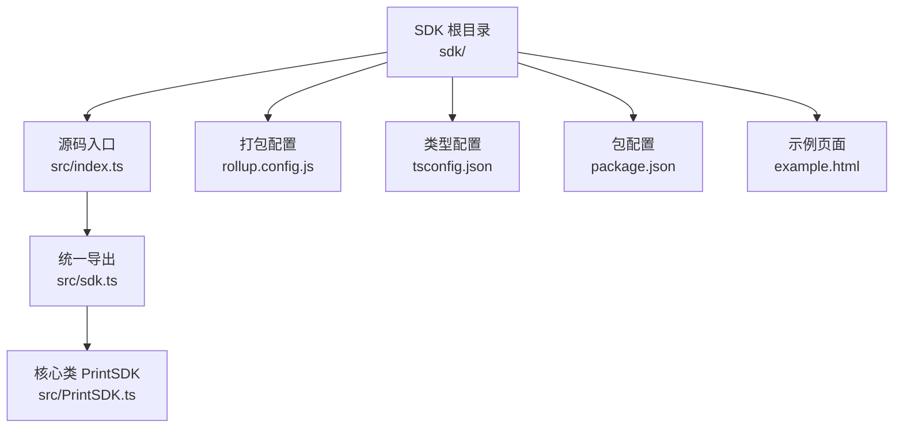
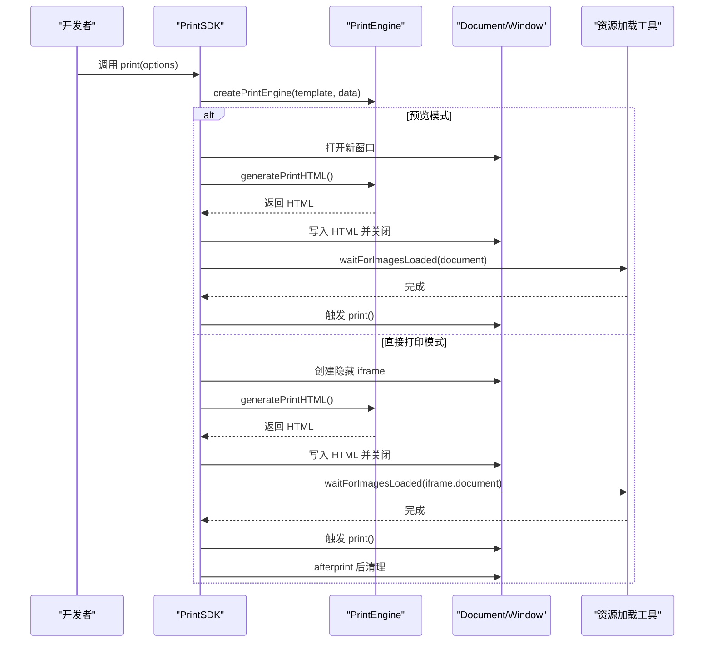
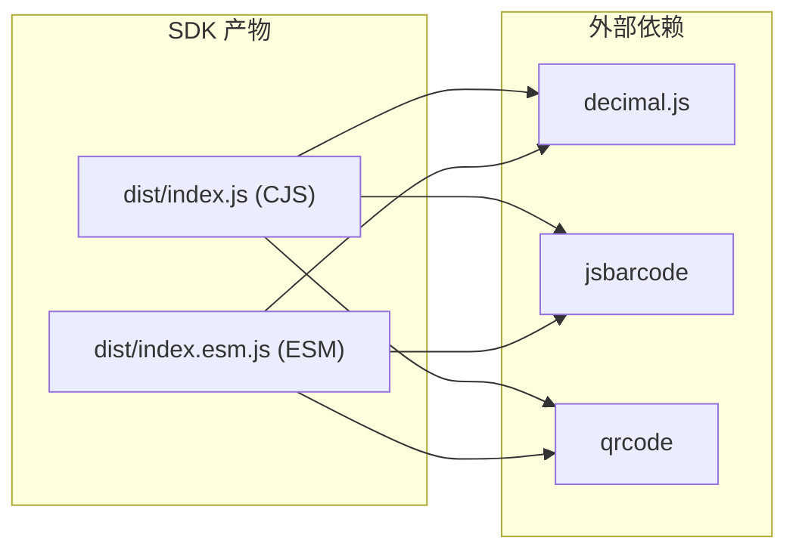

# 安装与配置

<cite>
**本文引用的文件**
- [sdk/package.json](file://sdk/package.json)
- [sdk/README.md](file://sdk/README.md)
- [sdk/example.html](file://sdk/example.html)
- [sdk/src/index.ts](file://sdk/src/index.ts)
- [sdk/src/sdk.ts](file://sdk/src/sdk.ts)
- [sdk/src/PrintSDK.ts](file://sdk/src/PrintSDK.ts)
- [sdk/tsconfig.json](file://sdk/tsconfig.json)
- [sdk/rollup.config.js](file://sdk/rollup.config.js)
- [designer/package.json](file://designer/package.json)
- [package.json](file://package.json)
</cite>

## 目录
1. [简介](#简介)
2. [项目结构](#项目结构)
3. [核心组件](#核心组件)
4. [架构总览](#架构总览)
5. [详细组件分析](#详细组件分析)
6. [依赖分析](#依赖分析)
7. [性能考虑](#性能考虑)
8. [故障排查指南](#故障排查指南)
9. [结论](#结论)
10. [附录](#附录)

## 简介
本指南面向希望在前端项目中集成打印 SDK 的开发者，覆盖以下主题：
- NPM 安装命令与版本选择
- 不同模块系统（ESM import 与 CJS require）的使用方式
- HTML 页面通过 CDN 引入 SDK 的完整示例
- SDK 的依赖与浏览器兼容性
- 常见安装问题排查与解决方案
- package.json 配置示例与主流构建工具集成要点

## 项目结构
SDK 位于 sdk 目录，对外提供 ESM/CJS 双格式产物，内部通过 Rollup 打包并以 external 形式保留 qrcode、jsbarcode、decimal.js 三个依赖，避免重复打包。

图表来源
- [sdk/src/index.ts:1-22](file://sdk/src/index.ts#L1-L22)
- [sdk/src/sdk.ts:1-66](file://sdk/src/sdk.ts#L1-L66)
- [sdk/src/PrintSDK.ts:1-477](file://sdk/src/PrintSDK.ts#L1-L477)
- [sdk/rollup.config.js:1-25](file://sdk/rollup.config.js#L1-L25)
- [sdk/tsconfig.json:1-17](file://sdk/tsconfig.json#L1-L17)
- [sdk/package.json:1-61](file://sdk/package.json#L1-L61)
- [sdk/example.html:1-202](file://sdk/example.html#L1-L202)

章节来源
- [sdk/package.json:1-61](file://sdk/package.json#L1-L61)
- [sdk/rollup.config.js:1-25](file://sdk/rollup.config.js#L1-L25)
- [sdk/tsconfig.json:1-17](file://sdk/tsconfig.json#L1-L17)
- [sdk/src/index.ts:1-22](file://sdk/src/index.ts#L1-L22)
- [sdk/src/sdk.ts:1-66](file://sdk/src/sdk.ts#L1-L66)
- [sdk/src/PrintSDK.ts:1-477](file://sdk/src/PrintSDK.ts#L1-L477)
- [sdk/example.html:1-202](file://sdk/example.html#L1-L202)

## 核心组件
- SDK 入口与导出
  - 入口文件导出 SDK 主类、打印引擎、常量、HTML 模板工具、渲染器以及类型定义，便于按需使用。
- 核心类 PrintSDK
  - 提供 print、printDirect、printWithPreview、generateHTML、printMultiple、printMultiTemplate 等方法，支持预览与直接打印、批量打印与多模板批量打印。
- 打印引擎与渲染器
  - 通过 createPrintEngine 将模板与数据转换为可打印的 HTML，内部包含多种组件渲染器（文本、表格、图片、二维码、条形码、线条、矩形等）。
- 资源加载工具
  - 提供图片等异步资源加载等待能力，确保打印前资源就绪。

章节来源
- [sdk/src/index.ts:1-22](file://sdk/src/index.ts#L1-L22)
- [sdk/src/sdk.ts:1-66](file://sdk/src/sdk.ts#L1-L66)
- [sdk/src/PrintSDK.ts:100-477](file://sdk/src/PrintSDK.ts#L100-L477)

## 架构总览
SDK 采用“数据驱动 + 渲染器扩展”的架构，核心流程如下：
- 输入：模板数据与业务数据
- 处理：打印引擎根据模板生成 HTML
- 输出：预览窗口或隐藏 iframe 触发打印
- 资源：二维码、条形码等异步资源在打印前完成加载

图表来源
- [sdk/src/PrintSDK.ts:110-172](file://sdk/src/PrintSDK.ts#L110-L172)
- [sdk/src/PrintSDK.ts:121-127](file://sdk/src/PrintSDK.ts#L121-L127)
- [sdk/src/PrintSDK.ts:136-171](file://sdk/src/PrintSDK.ts#L136-L171)
- [sdk/src/utils/resourceLoader.ts:12-43](file://sdk/src/utils/resourceLoader.ts#L12-L43)

章节来源
- [sdk/src/PrintSDK.ts:100-477](file://sdk/src/PrintSDK.ts#L100-L477)
- [sdk/src/utils/resourceLoader.ts:1-43](file://sdk/src/utils/resourceLoader.ts#L1-L43)

## 详细组件分析

### 安装与版本选择
- 使用 NPM 安装
  - 命令：npm install @jcyao/print-sdk
  - 版本：当前 SDK 发布版本为 1.5.1；README 中标注当前版本为 v1.5.0，二者一致，可按需选择最新稳定版
- 产物格式
  - CJS：dist/index.js
  - ESM：dist/index.esm.js
- 依赖声明
  - 依赖：decimal.js、jsbarcode、qrcode
  - 外部依赖（external）：Rollup 将上述三方库标记为 external，避免打包进 SDK

章节来源
- [sdk/package.json:1-61](file://sdk/package.json#L1-L61)
- [sdk/README.md:84-88](file://sdk/README.md#L84-L88)
- [sdk/rollup.config.js:17-18](file://sdk/rollup.config.js#L17-L18)

### 模块系统使用方式
- ESM 导入
  - 从 SDK 导出统一入口导入所需 API
  - 示例路径：[sdk/src/index.ts:11-22](file://sdk/src/index.ts#L11-L22)
- CJS 导入
  - 通过 require 加载 CJS 产物
  - 示例路径：[sdk/package.json:6-8](file://sdk/package.json#L6-L8)
- 类型定义
  - SDK 提供完整的 TypeScript 类型定义，可在 TS 项目中直接使用
  - 示例路径：[sdk/src/sdk.ts:52-66](file://sdk/src/sdk.ts#L52-L66)

章节来源
- [sdk/src/index.ts:1-22](file://sdk/src/index.ts#L1-L22)
- [sdk/src/sdk.ts:1-66](file://sdk/src/sdk.ts#L1-L66)
- [sdk/package.json:5-8](file://sdk/package.json#L5-L8)

### HTML 页面集成（CDN 方式）
- 通过 script type="module" 引入 ESM 产物
- 示例页面展示了如何在浏览器中初始化 SDK 并调用打印方法
- 示例路径：[sdk/example.html:130-199](file://sdk/example.html#L130-L199)

章节来源
- [sdk/example.html:1-202](file://sdk/example.html#L1-L202)

### 依赖要求与浏览器兼容性
- 依赖
  - decimal.js：高精度数值计算
  - jsbarcode：条形码生成
  - qrcode：二维码生成
- 浏览器兼容性
  - SDK 目标编译到 ES2017，依赖 DOM API
  - 具体浏览器支持取决于目标运行环境的 ES2017/DOM 支持情况
- 外部依赖处理
  - 由于依赖被标记为 external，需确保在最终应用中提供这些依赖（例如通过 bundler 注入或 CDN）

章节来源
- [sdk/package.json:49-53](file://sdk/package.json#L49-L53)
- [sdk/rollup.config.js:17-18](file://sdk/rollup.config.js#L17-L18)
- [sdk/tsconfig.json:2-5](file://sdk/tsconfig.json#L2-L5)

### 构建工具集成指南
- Vite（ESM）
  - 在 Vite 项目中可直接 import SDK，无需额外配置
  - 示例路径：[designer/package.json](file://designer/package.json#L15)
- Webpack/Rollup（CJS/ESM）
  - 若使用 CJS，可 require SDK；若使用 ESM，可 import
  - 注意 external 依赖需在最终 bundle 中可用
  - 示例路径：[sdk/rollup.config.js:17-18](file://sdk/rollup.config.js#L17-L18)
- TypeScript
  - 使用 SDK 的类型定义，确保类型安全
  - 示例路径：[sdk/src/sdk.ts:52-66](file://sdk/src/sdk.ts#L52-L66)

章节来源
- [designer/package.json:1-46](file://designer/package.json#L1-L46)
- [sdk/rollup.config.js:1-25](file://sdk/rollup.config.js#L1-L25)
- [sdk/src/sdk.ts:52-66](file://sdk/src/sdk.ts#L52-L66)

## 依赖分析
SDK 的依赖关系与打包策略如下：

图表来源
- [sdk/rollup.config.js:17-18](file://sdk/rollup.config.js#L17-L18)
- [sdk/package.json:49-53](file://sdk/package.json#L49-L53)

章节来源
- [sdk/rollup.config.js:1-25](file://sdk/rollup.config.js#L1-L25)
- [sdk/package.json:49-53](file://sdk/package.json#L49-L53)

## 性能考虑
- 资源加载
  - SDK 在打印前会等待图片等异步资源加载完成，避免打印空白
  - 示例路径：[sdk/src/utils/resourceLoader.ts:12-43](file://sdk/src/utils/resourceLoader.ts#L12-L43)
- 打印时机
  - 预览模式与直接模式均在资源就绪后触发 print，确保内容完整
  - 示例路径：[sdk/src/PrintSDK.ts:121-171](file://sdk/src/PrintSDK.ts#L121-L171)
- 打印后清理
  - 直接模式下监听 afterprint 事件清理隐藏 iframe，兜底使用定时器防止泄漏
  - 示例路径：[sdk/src/PrintSDK.ts:149-171](file://sdk/src/PrintSDK.ts#L149-L171)

章节来源
- [sdk/src/utils/resourceLoader.ts:1-43](file://sdk/src/utils/resourceLoader.ts#L1-L43)
- [sdk/src/PrintSDK.ts:100-171](file://sdk/src/PrintSDK.ts#L100-L171)

## 故障排查指南
- 无法打开打印窗口
  - 现象：预览模式抛出无法打开打印窗口的错误
  - 排查：检查浏览器弹窗拦截设置，确认用户交互触发
  - 示例路径：[sdk/src/PrintSDK.ts:114-119](file://sdk/src/PrintSDK.ts#L114-L119)
- 无法访问 iframe 文档
  - 现象：直接模式下无法访问 iframe.document
  - 排查：确认同源策略与 iframe 插入 DOM 成功
  - 示例路径：[sdk/src/PrintSDK.ts:136-141](file://sdk/src/PrintSDK.ts#L136-L141)
- 图片加载超时或失败
  - 现象：图片加载超时警告或部分图片未显示
  - 排查：检查图片地址可访问性、跨域策略；适当延长超时时间
  - 示例路径：[sdk/src/utils/resourceLoader.ts:28-42](file://sdk/src/utils/resourceLoader.ts#L28-L42)
- 二维码/条形码未显示
  - 现象：二维码或条形码空白
  - 排查：确认外部依赖 qrcode/jsbarcode 正确注入；检查模板数据中绑定字段是否存在
  - 示例路径：[sdk/package.json:49-53](file://sdk/package.json#L49-L53)

章节来源
- [sdk/src/PrintSDK.ts:110-171](file://sdk/src/PrintSDK.ts#L110-L171)
- [sdk/src/utils/resourceLoader.ts:1-43](file://sdk/src/utils/resourceLoader.ts#L1-L43)
- [sdk/package.json:49-53](file://sdk/package.json#L49-L53)

## 结论
- SDK 提供零配置、数据驱动的打印能力，支持预览与直接打印、批量打印与多模板批量打印
- 通过 ESM/CJS 双产物与 external 依赖策略，适配多种构建与运行环境
- 建议在项目中明确注入 decimal.js、jsbarcode、qrcode 依赖，并结合资源加载与打印事件清理机制，获得稳定的打印体验

## 附录

### 安装命令与版本选择
- 安装命令：npm install @jcyao/print-sdk
- 版本参考：当前 SDK 发布版本为 1.5.1；README 标注当前版本为 v1.5.0

章节来源
- [sdk/README.md:84-88](file://sdk/README.md#L84-L88)
- [sdk/package.json:2-4](file://sdk/package.json#L2-L4)

### 模块系统使用示例路径
- ESM 导入入口：[sdk/src/index.ts:11-22](file://sdk/src/index.ts#L11-L22)
- CJS 导入入口：[sdk/package.json:6-8](file://sdk/package.json#L6-L8)
- 类型定义导出：[sdk/src/sdk.ts:52-66](file://sdk/src/sdk.ts#L52-L66)

章节来源
- [sdk/src/index.ts:1-22](file://sdk/src/index.ts#L1-L22)
- [sdk/src/sdk.ts:1-66](file://sdk/src/sdk.ts#L1-L66)
- [sdk/package.json:5-8](file://sdk/package.json#L5-L8)

### HTML 页面集成示例路径
- 完整示例页面（含 ESM 引入与打印调用）：[sdk/example.html:130-199](file://sdk/example.html#L130-L199)

章节来源
- [sdk/example.html:1-202](file://sdk/example.html#L1-L202)

### 依赖与打包配置参考
- 外部依赖声明：[sdk/rollup.config.js:17-18](file://sdk/rollup.config.js#L17-L18)
- 依赖清单：[sdk/package.json:49-53](file://sdk/package.json#L49-L53)
- 目标编译配置：[sdk/tsconfig.json:2-5](file://sdk/tsconfig.json#L2-L5)

章节来源
- [sdk/rollup.config.js:1-25](file://sdk/rollup.config.js#L1-L25)
- [sdk/package.json:49-53](file://sdk/package.json#L49-L53)
- [sdk/tsconfig.json:1-17](file://sdk/tsconfig.json#L1-L17)

### 构建工具集成参考
- Vite 项目中使用 SDK 的依赖声明：[designer/package.json](file://designer/package.json#L15)
- 顶层脚本（构建 SDK 与设计器）：[package.json:4-8](file://package.json#L4-L8)

章节来源
- [designer/package.json:1-46](file://designer/package.json#L1-L46)
- [package.json:1-10](file://package.json#L1-L10)