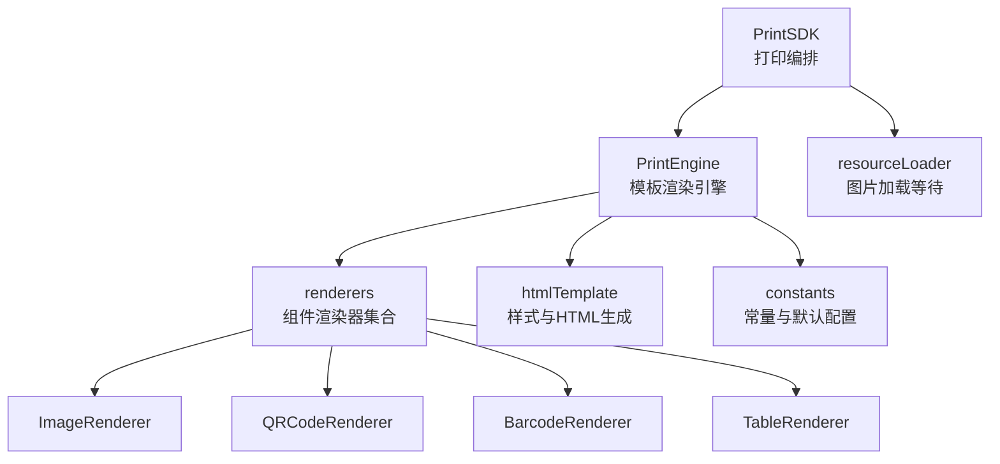
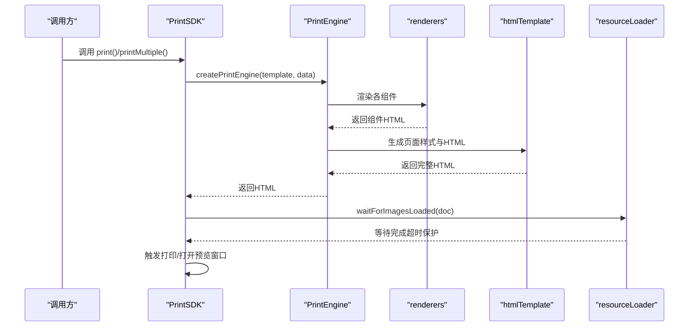
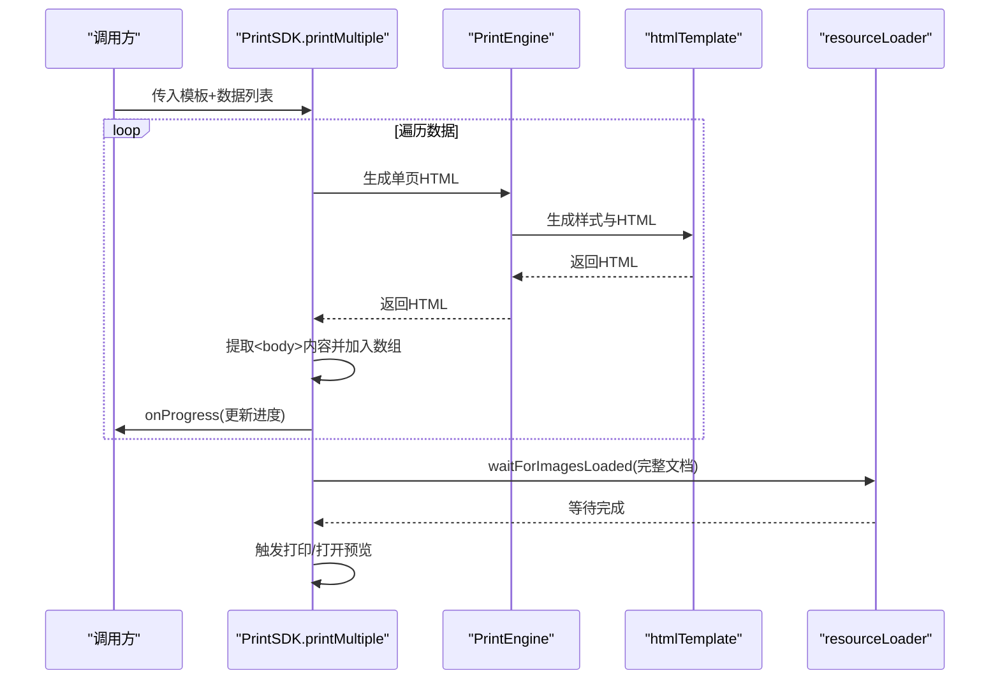
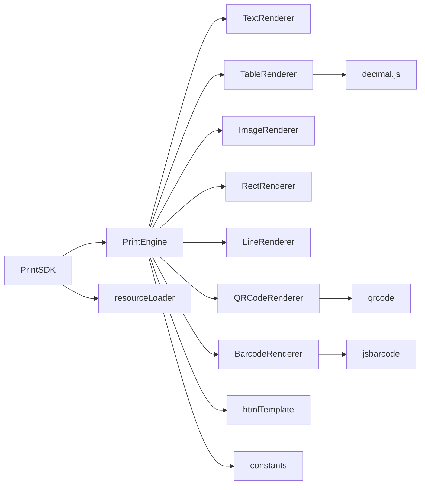

# 性能优化

<cite>
**本文引用的文件**
- [PrintSDK.ts](file://sdk/src/PrintSDK.ts)
- [resourceLoader.ts](file://sdk/src/utils/resourceLoader.ts)
- [printEngine.ts](file://sdk/src/printEngine.ts)
- [htmlTemplate.ts](file://sdk/src/printEngine/htmlTemplate.ts)
- [ImageRenderer.ts](file://sdk/src/printEngine/renderers/ImageRenderer.ts)
- [QRCodeRenderer.ts](file://sdk/src/printEngine/renderers/QRCodeRenderer.ts)
- [BarcodeRenderer.ts](file://sdk/src/printEngine/renderers/BarcodeRenderer.ts)
- [TableRenderer.ts](file://sdk/src/printEngine/renderers/TableRenderer.ts)
- [constants.ts](file://sdk/src/printEngine/constants.ts)
- [package.json](file://sdk/package.json)
</cite>

## 目录
1. [简介](#简介)
2. [项目结构](#项目结构)
3. [核心组件](#核心组件)
4. [架构总览](#架构总览)
5. [详细组件分析](#详细组件分析)
6. [依赖分析](#依赖分析)
7. [性能考虑](#性能考虑)
8. [故障排查指南](#故障排查指南)
9. [结论](#结论)
10. [附录](#附录)

## 简介
本指南面向使用打印 SDK 的开发者，聚焦以下目标：
- 图片资源加载优化：正确使用 waitForImagesLoaded 与异步加载策略
- 大数据量打印的内存管理与性能优化
- 批量打印的并发控制与进度处理
- HTML 生成与渲染优化
- 浏览器兼容性与性能差异处理
- 性能监控与调试方法
- 大数据量场景的最佳实践与注意事项
- 性能测试与基准测试方法

## 项目结构
SDK 采用“渲染器插件化 + 引擎 + 工具”的分层设计：
- PrintSDK：对外 API，负责打印流程编排、预览/直接打印、批量打印与进度上报
- PrintEngine：模板解析、数据绑定、管道转换、虚拟分页、组件渲染
- renderers：各类组件渲染器（文本、表格、图片、矩形、线条、二维码、条形码）
- htmlTemplate：统一生成打印样式与 HTML 结构
- resourceLoader：资源加载等待工具（图片、二维码、条形码已同步生成为 base64）



图表来源
- [PrintSDK.ts:100-477](file://sdk/src/PrintSDK.ts#L100-L477)
- [printEngine.ts:30-280](file://sdk/src/printEngine.ts#L30-L280)
- [htmlTemplate.ts:1-281](file://sdk/src/printEngine/htmlTemplate.ts#L1-L281)
- [resourceLoader.ts:1-90](file://sdk/src/utils/resourceLoader.ts#L1-L90)
- [ImageRenderer.ts:1-55](file://sdk/src/printEngine/renderers/ImageRenderer.ts#L1-L55)
- [QRCodeRenderer.ts:1-63](file://sdk/src/printEngine/renderers/QRCodeRenderer.ts#L1-L63)
- [BarcodeRenderer.ts:1-63](file://sdk/src/printEngine/renderers/BarcodeRenderer.ts#L1-L63)
- [TableRenderer.ts:1-200](file://sdk/src/printEngine/renderers/TableRenderer.ts#L1-L200)
- [constants.ts:1-113](file://sdk/src/printEngine/constants.ts#L1-L113)

章节来源
- [PrintSDK.ts:100-477](file://sdk/src/PrintSDK.ts#L100-L477)
- [printEngine.ts:30-280](file://sdk/src/printEngine.ts#L30-L280)
- [htmlTemplate.ts:1-281](file://sdk/src/printEngine/htmlTemplate.ts#L1-L281)
- [resourceLoader.ts:1-90](file://sdk/src/utils/resourceLoader.ts#L1-L90)

## 核心组件
- PrintSDK：提供 print、printMultiple、printMultiTemplate、generateHTML 等 API；内置预览/直接打印分支；批量打印聚合 HTML 并一次性触发打印；使用 waitForImagesLoaded 等待图片资源加载完成再打印。
- PrintEngine：注册默认渲染器、创建渲染上下文、解析数据绑定、应用管道、虚拟分页、渲染单页与页码。
- renderers：各组件渲染器实现，其中二维码与条形码在浏览器端同步生成 base64，图片渲染器负责定位与裁切，表格渲染器负责列宽计算与跨页拆分。
- htmlTemplate：生成页面样式与完整 HTML 文档，支持连续纸与标准分页两种模式。
- resourceLoader：等待文档中所有图片加载完成，支持超时与错误统计。

章节来源
- [PrintSDK.ts:100-477](file://sdk/src/PrintSDK.ts#L100-L477)
- [printEngine.ts:30-280](file://sdk/src/printEngine.ts#L30-L280)
- [ImageRenderer.ts:10-55](file://sdk/src/printEngine/renderers/ImageRenderer.ts#L10-L55)
- [QRCodeRenderer.ts:12-63](file://sdk/src/printEngine/renderers/QRCodeRenderer.ts#L12-L63)
- [BarcodeRenderer.ts:12-63](file://sdk/src/printEngine/renderers/BarcodeRenderer.ts#L12-L63)
- [TableRenderer.ts:147-200](file://sdk/src/printEngine/renderers/TableRenderer.ts#L147-L200)
- [htmlTemplate.ts:81-281](file://sdk/src/printEngine/htmlTemplate.ts#L81-L281)
- [resourceLoader.ts:12-90](file://sdk/src/utils/resourceLoader.ts#L12-L90)

## 架构总览
SDK 的调用链路如下：PrintSDK -> PrintEngine -> renderers -> htmlTemplate；资源等待贯穿预览与直接打印流程。



图表来源
- [PrintSDK.ts:110-172](file://sdk/src/PrintSDK.ts#L110-L172)
- [PrintSDK.ts:210-322](file://sdk/src/PrintSDK.ts#L210-L322)
- [printEngine.ts:389-420](file://sdk/src/printEngine.ts#L389-L420)
- [htmlTemplate.ts:230-252](file://sdk/src/printEngine/htmlTemplate.ts#L230-L252)
- [resourceLoader.ts:12-73](file://sdk/src/utils/resourceLoader.ts#L12-L73)

## 详细组件分析

### 图片资源加载与 waitForImagesLoaded 使用
- 作用：等待文档中所有  加载完成，支持超时与错误计数，避免打印时图片未加载导致的空白或布局错乱。
- 使用场景：
  - 预览模式：在写入新窗口文档后，等待图片加载再触发打印。
  - 直接打印模式：在隐藏 iframe 中写入文档后，等待图片加载再触发打印，并监听 afterprint 清理。
- 优化要点：
  - 二维码与条形码已同步生成为 base64，无需等待；waitForImagesLoaded 主要等待外部图片资源。
  - 设置合理超时时间，避免长时间阻塞；对失败图片记录日志以便排查。

```mermaid
flowchart TD
Start(["进入打印流程"]) --> Gen["生成HTML"]
Gen --> Write["写入文档(预览/iframe)"]
Write --> Wait["waitForImagesLoaded(doc)"]
Wait --> Done{"全部加载完成？"}
Done --> |是| Print["触发打印"]
Done --> |否(超时)| Print
Print --> Cleanup["afterprint清理或兜底清理"]
Cleanup --> End(["结束"])
```

图表来源
- [PrintSDK.ts:121-171](file://sdk/src/PrintSDK.ts#L121-L171)
- [PrintSDK.ts:295-321](file://sdk/src/PrintSDK.ts#L295-L321)
- [resourceLoader.ts:12-73](file://sdk/src/utils/resourceLoader.ts#L12-L73)

章节来源
- [PrintSDK.ts:121-171](file://sdk/src/PrintSDK.ts#L121-L171)
- [PrintSDK.ts:295-321](file://sdk/src/PrintSDK.ts#L295-L321)
- [resourceLoader.ts:12-73](file://sdk/src/utils/resourceLoader.ts#L12-L73)

### 大数据量打印的内存管理与性能优化
- 分页与跨页拆分：
  - 使用虚拟分页与相对间距累加，避免一次性渲染所有页面导致内存峰值过高。
  - 表格跨页拆分时，先测量表头、行、合计的实际高度，再决定分页，减少重排与溢出。
- 组件复制与布局：
  - 渲染过程中对组件进行浅拷贝，避免污染原始模板数据，降低副作用带来的内存问题。
- 连续纸模式：
  - 连续纸不分页，适合长票据打印，减少分页计算与 DOM 数量。
- 建议：
  - 控制单次渲染的数据规模，必要时分批生成 HTML 片段再拼接。
  - 避免在模板中嵌入超大图片，优先使用压缩后的 base64 或 CDN 地址。
  - 合理设置页边距与组件尺寸，减少不必要的重绘与回流。

章节来源
- [printEngine.ts:418-620](file://sdk/src/printEngine.ts#L418-L620)
- [printEngine.ts:762-800](file://sdk/src/printEngine.ts#L762-L800)

### 批量打印的并发控制与进度处理
- 打印流程：
  - 逐条生成 HTML 片段，提取 <body> 内容，汇总为完整 HTML，一次性触发打印。
  - 提供 onProgress 回调，报告总任务、已完成、失败与当前索引。
- 并发控制：
  - 默认串行生成，避免高并发导致的内存与 CPU 峰值。
  - 如需加速，可在业务侧对数据分片并行生成，再合并为完整 HTML（需自行实现）。
- 进度处理：
  - 初始化进度后逐项推进，异常时增加失败计数并继续。
  - 多模板场景提供分组与数据项双层进度。



图表来源
- [PrintSDK.ts:210-322](file://sdk/src/PrintSDK.ts#L210-L322)
- [htmlTemplate.ts:230-252](file://sdk/src/printEngine/htmlTemplate.ts#L230-L252)
- [resourceLoader.ts:12-73](file://sdk/src/utils/resourceLoader.ts#L12-L73)

章节来源
- [PrintSDK.ts:210-322](file://sdk/src/PrintSDK.ts#L210-L322)
- [PrintSDK.ts:332-467](file://sdk/src/PrintSDK.ts#L332-L467)

### HTML 生成与渲染优化
- 统一样式生成：
  - 通过 generatePrintPageStyles/generateBatchPrintStyles 生成页面样式，避免重复计算与冗余 CSS。
  - 连续纸与标准分页分别生成不同样式，保证打印一致性。
- 组件样式：
  - 统一的基础组件样式（文本、表格、图片、矩形、线条、二维码、条形码）集中维护，减少重复定义。
- 渲染策略：
  - 二维码与条形码在浏览器端同步生成 base64，避免异步等待；图片渲染严格按模板尺寸，避免自适应导致的排版抖动。
  - 表格列宽计算与溢出检测，确保在有限宽度内合理分配。

章节来源
- [htmlTemplate.ts:81-225](file://sdk/src/printEngine/htmlTemplate.ts#L81-L225)
- [ImageRenderer.ts:13-49](file://sdk/src/printEngine/renderers/ImageRenderer.ts#L13-L49)
- [QRCodeRenderer.ts:15-56](file://sdk/src/printEngine/renderers/QRCodeRenderer.ts#L15-L56)
- [BarcodeRenderer.ts:15-56](file://sdk/src/printEngine/renderers/BarcodeRenderer.ts#L15-L56)
- [TableRenderer.ts:51-125](file://sdk/src/printEngine/renderers/TableRenderer.ts#L51-L125)

### 浏览器兼容性与性能差异处理
- 二维码/条形码生成：
  - 使用浏览器端同步生成，避免异步等待；失败时返回占位图，保证可打印性。
- 打印事件与清理：
  - 优先监听 afterprint 事件清理 iframe；若未触发则设置兜底清理，提升兼容性。
- 连续纸与分页：
  - 连续纸模式下不进行分页计算，减少复杂度与性能损耗。
- 媒体查询：
  - @media print 与 @media screen 分别控制屏幕预览与打印样式，避免样式冲突。

章节来源
- [PrintSDK.ts:156-171](file://sdk/src/PrintSDK.ts#L156-L171)
- [PrintSDK.ts:454-466](file://sdk/src/PrintSDK.ts#L454-L466)
- [htmlTemplate.ts:135-224](file://sdk/src/printEngine/htmlTemplate.ts#L135-L224)

## 依赖分析
- 外部依赖：
  - qrcode：生成二维码
  - jsbarcode：生成条形码
  - decimal.js：高精度数值计算（表格渲染器中使用）
- 内部模块关系：
  - PrintSDK 依赖 PrintEngine 与 resourceLoader
  - PrintEngine 依赖 renderers、htmlTemplate、constants
  - renderers 依赖 constants 与 styleBuilder（内部工具）



图表来源
- [PrintSDK.ts:7-14](file://sdk/src/PrintSDK.ts#L7-L14)
- [printEngine.ts:15-28](file://sdk/src/printEngine.ts#L15-L28)
- [package.json:49-53](file://sdk/package.json#L49-L53)

章节来源
- [package.json:49-53](file://sdk/package.json#L49-L53)
- [PrintSDK.ts:7-14](file://sdk/src/PrintSDK.ts#L7-L14)
- [printEngine.ts:15-28](file://sdk/src/printEngine.ts#L15-L28)

## 性能考虑
- 图片加载
  - 仅等待外部图片资源；二维码/条形码已同步生成为 base64，无需等待。
  - 设置合理超时时间，避免长时间阻塞；对失败图片记录日志。
- 批量打印
  - 串行生成 HTML 片段，避免高并发内存峰值；如需加速可在业务侧分片并行。
  - 使用 onProgress 回调反馈进度，便于前端交互与用户感知。
- HTML 生成
  - 统一样式与模板生成，减少重复计算；避免在模板中使用超大图片。
- 渲染器
  - 二维码/条形码同步生成；图片严格按模板尺寸渲染；表格列宽计算与溢出检测。
- 连续纸
  - 不进行分页计算，减少复杂度与性能损耗。
- 打印事件
  - 优先 afterprint 清理；兜底清理避免内存泄漏。

章节来源
- [resourceLoader.ts:12-89](file://sdk/src/utils/resourceLoader.ts#L12-L89)
- [PrintSDK.ts:210-322](file://sdk/src/PrintSDK.ts#L210-L322)
- [htmlTemplate.ts:81-225](file://sdk/src/printEngine/htmlTemplate.ts#L81-L225)
- [ImageRenderer.ts:13-49](file://sdk/src/printEngine/renderers/ImageRenderer.ts#L13-L49)
- [QRCodeRenderer.ts:15-56](file://sdk/src/printEngine/renderers/QRCodeRenderer.ts#L15-L56)
- [BarcodeRenderer.ts:15-56](file://sdk/src/printEngine/renderers/BarcodeRenderer.ts#L15-L56)
- [printEngine.ts:426-429](file://sdk/src/printEngine.ts#L426-L429)
- [PrintSDK.ts:156-171](file://sdk/src/PrintSDK.ts#L156-L171)

## 故障排查指南
- 图片未加载
  - 现象：打印时出现空白或布局错乱
  - 排查：确认图片地址有效；检查 waitForImagesLoaded 是否超时；查看控制台错误日志
- 二维码/条形码异常
  - 现象：打印结果为占位图
  - 排查：确认内容与尺寸参数；检查浏览器 canvas 支持；查看生成异常日志
- 打印后未清理
  - 现象：页面残留隐藏 iframe
  - 排查：确认 afterprint 事件是否触发；若未触发检查兜底清理逻辑
- 大数据量卡顿
  - 现象：批量打印耗时过长
  - 排查：分批生成 HTML；减少图片体积；避免复杂表格与重排

章节来源
- [resourceLoader.ts:28-43](file://sdk/src/utils/resourceLoader.ts#L28-L43)
- [QRCodeRenderer.ts:52-56](file://sdk/src/printEngine/renderers/QRCodeRenderer.ts#L52-L56)
- [BarcodeRenderer.ts:52-56](file://sdk/src/printEngine/renderers/BarcodeRenderer.ts#L52-L56)
- [PrintSDK.ts:156-171](file://sdk/src/PrintSDK.ts#L156-L171)

## 结论
通过合理的资源等待、分页与跨页拆分、统一样式生成与渲染器策略，以及对浏览器兼容性的处理，SDK 能够在大数据量场景下保持稳定与高效。建议在业务侧配合分片与进度反馈，进一步优化用户体验与系统性能。

## 附录

### 大数据量场景最佳实践
- 分片与并行：将数据分批生成 HTML 片段，合并后再触发打印，避免单次内存峰值过高。
- 图片优化：使用压缩后的图片或 CDN 地址；避免在模板中嵌入超大图片。
- 表格优化：合理设置列宽与行高；避免过多合计行与复杂单元格。
- 事件清理：确保 afterprint 事件清理与兜底清理机制生效。

### 性能监控与调试
- 使用 onProgress 回调观察批量打印进度，定位耗时环节。
- 在资源等待阶段记录超时与失败数量，定位网络或资源问题。
- 通过浏览器开发者工具的性能面板观察渲染与打印阶段的耗时与内存变化。

### 性能测试与基准测试方法
- 基准测试：准备固定模板与不同规模的数据集，记录生成 HTML 与打印耗时，对比不同策略（串行 vs 并行分片）。
- 回归测试：在不同浏览器（Chrome/Firefox/Safari/Edge）验证打印一致性与资源等待行为。
- 压力测试：逐步增大数据规模，观察内存峰值与响应时间，确定分片阈值与超时参数。