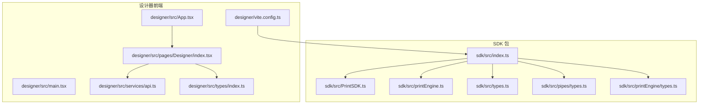
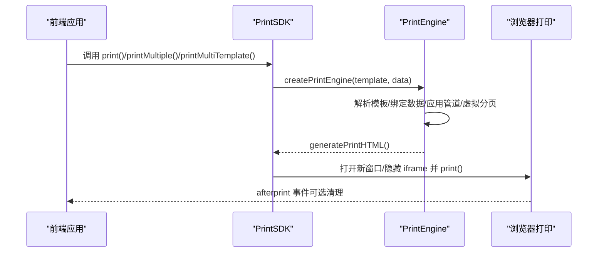
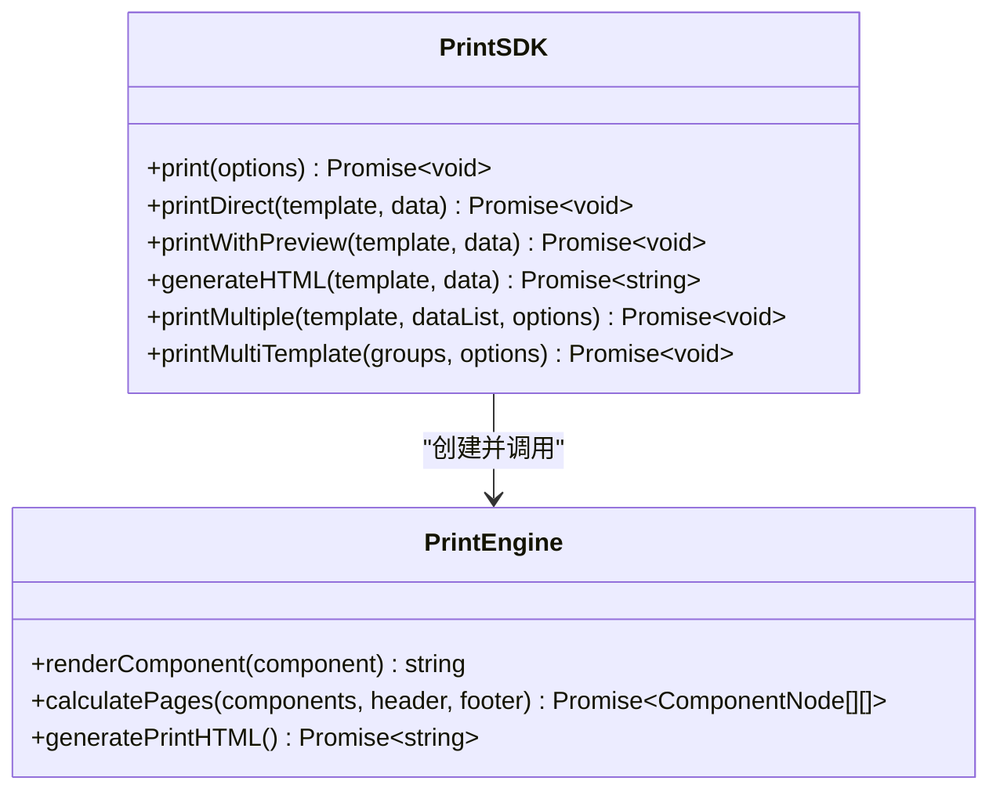
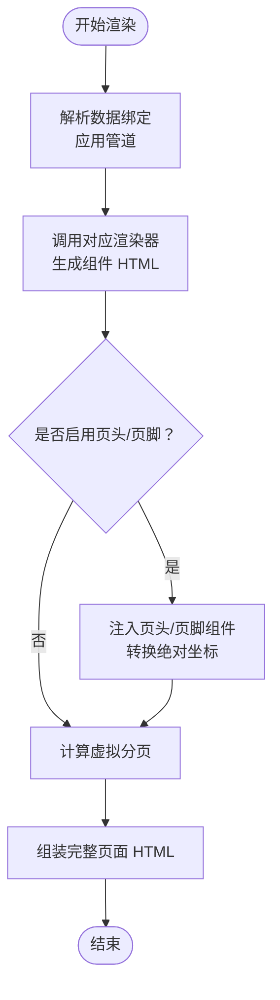
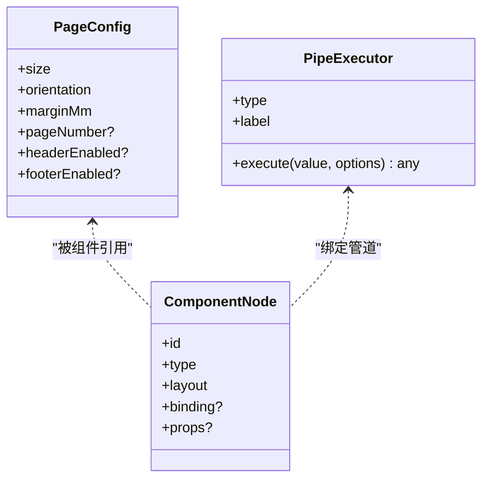
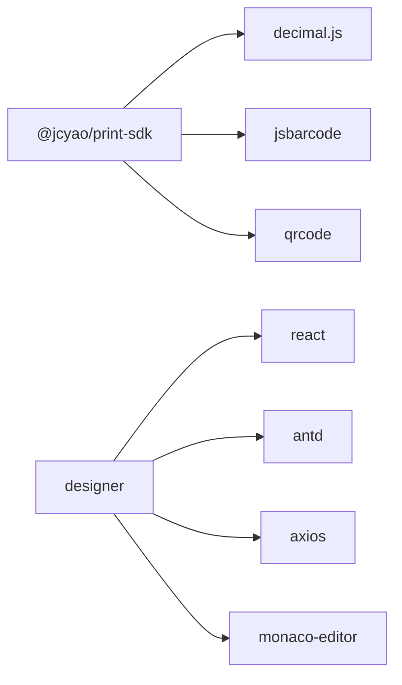

# 集成示例

<cite>
**本文引用的文件**   
- [sdk/src/index.ts](file://sdk/src/index.ts)
- [sdk/src/PrintSDK.ts](file://sdk/src/PrintSDK.ts)
- [sdk/src/printEngine.ts](file://sdk/src/printEngine.ts)
- [sdk/src/types.ts](file://sdk/src/types.ts)
- [sdk/src/pipes/types.ts](file://sdk/src/pipes/types.ts)
- [sdk/src/printEngine/types.ts](file://sdk/src/printEngine/types.ts)
- [sdk/README.md](file://sdk/README.md)
- [sdk/package.json](file://sdk/package.json)
- [sdk/example.html](file://sdk/example.html)
- [designer/package.json](file://designer/package.json)
- [designer/src/services/api.ts](file://designer/src/services/api.ts)
- [designer/src/types/index.ts](file://designer/src/types/index.ts)
- [designer/src/App.tsx](file://designer/src/App.tsx)
- [designer/src/main.tsx](file://designer/src/main.tsx)
- [designer/vite.config.ts](file://designer/vite.config.ts)
- [designer/src/pages/Designer/index.tsx](file://designer/src/pages/Designer/index.tsx)
</cite>

## 目录
1. [简介](#简介)
2. [项目结构](#项目结构)
3. [核心组件](#核心组件)
4. [架构总览](#架构总览)
5. [详细组件分析](#详细组件分析)
6. [依赖分析](#依赖分析)
7. [性能考虑](#性能考虑)
8. [故障排查指南](#故障排查指南)
9. [结论](#结论)
10. [附录](#附录)

## 简介
本文件面向希望在前端与后端项目中集成打印 SDK 的工程师，提供从零到一的完整集成示例与最佳实践。内容覆盖：
- 前端三大框架（Vue、React、Angular）的集成要点与注意事项
- Node.js 后端的使用示例与 API 设计建议
- 前后端分离架构下的数据对接与模板管理方案
- TypeScript 项目中的类型使用与类型安全保证
- 实际业务场景（发票打印、标签打印、报表打印）的模板与数据对接思路
- 与现有业务系统的集成方式与数据对接方案
- 完整项目结构示例与代码模板路径指引

## 项目结构
该仓库采用“SDK 包 + 设计器前端 + 文档”的组织方式：
- sdk：打印 SDK 源码与发布产物，提供核心打印能力与类型定义
- designer：可视化模板设计器前端工程，演示如何与 SDK 集成
- docs：技术文档与架构说明
- 根目录 README：项目概览与快速开始

**图表来源**
- [sdk/src/index.ts:1-22](file://sdk/src/index.ts#L1-L22)
- [sdk/src/PrintSDK.ts:1-477](file://sdk/src/PrintSDK.ts#L1-L477)
- [sdk/src/printEngine.ts:1-800](file://sdk/src/printEngine.ts#L1-L800)
- [sdk/src/types.ts:1-228](file://sdk/src/types.ts#L1-L228)
- [sdk/src/pipes/types.ts:1-30](file://sdk/src/pipes/types.ts#L1-L30)
- [sdk/src/printEngine/types.ts:1-116](file://sdk/src/printEngine/types.ts#L1-L116)
- [designer/src/App.tsx:1-31](file://designer/src/App.tsx#L1-L31)
- [designer/src/main.tsx:1-8](file://designer/src/main.tsx#L1-L8)
- [designer/vite.config.ts:1-29](file://designer/vite.config.ts#L1-L29)
- [designer/src/services/api.ts:1-134](file://designer/src/services/api.ts#L1-L134)
- [designer/src/pages/Designer/index.tsx:1-200](file://designer/src/pages/Designer/index.tsx#L1-L200)
- [designer/src/types/index.ts:1-378](file://designer/src/types/index.ts#L1-L378)

**章节来源**
- [sdk/src/index.ts:1-22](file://sdk/src/index.ts#L1-L22)
- [designer/src/App.tsx:1-31](file://designer/src/App.tsx#L1-L31)
- [designer/src/main.tsx:1-8](file://designer/src/main.tsx#L1-L8)
- [designer/vite.config.ts:1-29](file://designer/vite.config.ts#L1-L29)

## 核心组件
- PrintSDK：对外暴露的打印入口，支持直接打印、预览后打印、仅生成 HTML、批量打印、多模板批量打印等能力
- PrintEngine：插件化渲染引擎，负责模板解析、数据绑定、管道转换、虚拟分页与 HTML 生成
- 类型系统：统一的模板、组件、表格、页码、管道等类型定义，保障 TypeScript 项目中的类型安全
- 管道系统：内置多种数据转换器（日期、货币、金额大写、中文大写等），支持链式组合

关键能力与类型参考：
- 打印 API：[sdk/src/PrintSDK.ts:100-477](file://sdk/src/PrintSDK.ts#L100-L477)
- 引擎接口与上下文：[sdk/src/printEngine/types.ts:1-116](file://sdk/src/printEngine/types.ts#L1-L116)
- 模板与组件类型：[sdk/src/types.ts:48-228](file://sdk/src/types.ts#L48-L228)
- 管道执行器接口：[sdk/src/pipes/types.ts:1-30](file://sdk/src/pipes/types.ts#L1-L30)

**章节来源**
- [sdk/src/PrintSDK.ts:100-477](file://sdk/src/PrintSDK.ts#L100-L477)
- [sdk/src/printEngine/types.ts:1-116](file://sdk/src/printEngine/types.ts#L1-L116)
- [sdk/src/types.ts:48-228](file://sdk/src/types.ts#L48-L228)
- [sdk/src/pipes/types.ts:1-30](file://sdk/src/pipes/types.ts#L1-L30)

## 架构总览
SDK 采用“完全解耦、数据驱动”的设计：前端直接将模板 JSON 与业务数据交给 SDK，SDK 通过引擎渲染并触发浏览器打印。设计器前端负责模板设计与管理，后端可提供模板与数据的持久化服务。

**图表来源**
- [sdk/src/PrintSDK.ts:110-172](file://sdk/src/PrintSDK.ts#L110-L172)
- [sdk/src/printEngine.ts:30-620](file://sdk/src/printEngine.ts#L30-L620)

**章节来源**
- [sdk/src/PrintSDK.ts:110-172](file://sdk/src/PrintSDK.ts#L110-L172)
- [sdk/src/printEngine.ts:30-620](file://sdk/src/printEngine.ts#L30-L620)

## 详细组件分析

### PrintSDK 类与 API
- print(options)：支持 preview 预览模式与直接打印模式，内部使用 DOMParser 提取 body 内容，等待图片资源加载后触发打印
- printMultiple：同模板多数据批量打印，生成完整 HTML 后一次性打印
- printMultiTemplate：多模板混合打印，要求所有模板纸张尺寸一致
- generateHTML：仅生成 HTML 字符串，便于二次处理或预览

**图表来源**
- [sdk/src/PrintSDK.ts:100-477](file://sdk/src/PrintSDK.ts#L100-L477)
- [sdk/src/printEngine.ts:30-120](file://sdk/src/printEngine.ts#L30-L120)

**章节来源**
- [sdk/src/PrintSDK.ts:100-477](file://sdk/src/PrintSDK.ts#L100-L477)

### PrintEngine 插件化架构
- 渲染器注册：内置文本、表格、图片、矩形、线条、二维码、条形码渲染器
- 数据绑定与管道：支持路径访问、回退值、管道链式转换
- 虚拟分页：基于相对间距的流式布局，表格跨页拆分与表头重复
- 页头/页脚：三区域布局，自动注入并转换坐标

**图表来源**
- [sdk/src/printEngine.ts:169-620](file://sdk/src/printEngine.ts#L169-L620)

**章节来源**
- [sdk/src/printEngine.ts:169-620](file://sdk/src/printEngine.ts#L169-L620)

### 类型系统与数据管道
- 模板与组件：PageConfig、ComponentNode、TableProps、PageNumberConfig 等
- 管道执行器：PipeExecutor 接口，支持自定义扩展
- 设计器类型：与 SDK 类型保持一致，便于前后端共享

**图表来源**
- [sdk/src/types.ts:48-228](file://sdk/src/types.ts#L48-L228)
- [sdk/src/pipes/types.ts:11-30](file://sdk/src/pipes/types.ts#L11-L30)

**章节来源**
- [sdk/src/types.ts:48-228](file://sdk/src/types.ts#L48-L228)
- [sdk/src/pipes/types.ts:11-30](file://sdk/src/pipes/types.ts#L11-L30)

### 前端框架集成要点

- React 集成
  - 在组件中导入 SDK 并创建实例
  - 通过 API 服务获取模板与数据，调用 SDK.print 或 printMultiple
  - 预览模式建议使用新窗口，直接打印使用隐藏 iframe
  - 参考：[designer/src/pages/Designer/index.tsx:1-200](file://designer/src/pages/Designer/index.tsx#L1-L200)、[designer/src/services/api.ts:1-134](file://designer/src/services/api.ts#L1-L134)

- Vue 集成
  - 在 Vue 组件中导入 SDK，使用 Composition API 管理模板与数据状态
  - 通过 axios 或 fetch 获取模板，调用 SDK.print
  - 注意：Vue 3 + TS 环境下，确保类型导入与模块声明正确

- Angular 集成
  - 在服务中封装 SDK 调用，通过 HttpClient 获取模板与数据
  - 在组件中订阅服务，调用打印方法
  - 使用 Angular 的生命周期钩子确保 DOM 可用后再触发打印

- TypeScript 类型安全
  - 使用 PrintTemplate、ComponentNode、TableProps 等类型
  - 管道配置使用 PipeConfig，避免运行时错误
  - 参考：[sdk/src/types.ts:48-228](file://sdk/src/types.ts#L48-L228)、[sdk/src/pipes/types.ts:1-30](file://sdk/src/pipes/types.ts#L1-L30)

**章节来源**
- [designer/src/pages/Designer/index.tsx:1-200](file://designer/src/pages/Designer/index.tsx#L1-L200)
- [designer/src/services/api.ts:1-134](file://designer/src/services/api.ts#L1-L134)
- [sdk/src/types.ts:48-228](file://sdk/src/types.ts#L48-L228)
- [sdk/src/pipes/types.ts:1-30](file://sdk/src/pipes/types.ts#L1-L30)

### 后端 Node.js 使用示例
- 模板与数据存储：可使用数据库或文件系统存储模板 JSON 与 Mock 数据
- API 设计建议：
  - GET /api/templates：返回模板列表
  - GET /api/templates/:id：返回指定模板
  - GET /api/mock-data：返回测试数据
- 前端通过 axios 或 fetch 获取模板与数据，再调用 SDK.print
- 参考：[designer/src/services/api.ts:1-134](file://designer/src/services/api.ts#L1-L134)

**章节来源**
- [designer/src/services/api.ts:1-134](file://designer/src/services/api.ts#L1-L134)

### 前后端分离架构下的集成方案
- 模板管理：设计器前端保存模板到后端，前端通过 API 获取模板 JSON
- 数据对接：前端通过 API 获取 Mock 数据或业务数据，SDK 直接消费
- 预览与打印：前端调用 SDK.print，浏览器触发打印；后端不参与打印流程
- 参考：[designer/src/App.tsx:1-31](file://designer/src/App.tsx#L1-L31)、[designer/vite.config.ts:1-29](file://designer/vite.config.ts#L1-L29)

**章节来源**
- [designer/src/App.tsx:1-31](file://designer/src/App.tsx#L1-L31)
- [designer/vite.config.ts:1-29](file://designer/vite.config.ts#L1-L29)

### 实际业务场景示例

- 发票打印
  - 模板：页头区域放置公司信息与发票标题，内容区域放置订单明细表格，页脚区域放置税额与金额大写
  - 数据：订单号、客户信息、商品明细、金额、税率、合计
  - 管道：金额使用 money 管道，金额大写使用 chineseNumber 管道
  - 参考：[sdk/README.md:235-304](file://sdk/README.md#L235-L304)

- 标签打印
  - 模板：小尺寸连续纸，放置条形码与二维码组件，文本组件显示编号与说明
  - 数据：编号、名称、规格、条码/二维码内容
  - 参考：[sdk/src/types.ts:72-228](file://sdk/src/types.ts#L72-L228)

- 报表打印
  - 模板：A4 纵向，表格跨页重复表头，合计行与额外行（如金额大写）
  - 数据：多条记录，按页统计或总计
  - 参考：[sdk/README.md:305-392](file://sdk/README.md#L305-L392)

**章节来源**
- [sdk/README.md:235-392](file://sdk/README.md#L235-L392)
- [sdk/src/types.ts:72-228](file://sdk/src/types.ts#L72-228)

### 与现有业务系统的集成方式
- 模板中心：将设计器生成的模板 JSON 存储在业务系统的模板库中，前端按需拉取
- 数据中心：前端通过统一 API 获取业务数据，SDK 直接渲染打印
- 权限与鉴权：在 API 层面做权限校验，SDK 仅负责渲染与打印
- 参考：[designer/src/services/api.ts:1-134](file://designer/src/services/api.ts#L1-L134)

**章节来源**
- [designer/src/services/api.ts:1-134](file://designer/src/services/api.ts#L1-L134)

## 依赖分析
- SDK 依赖
  - decimal.js：高精度数值计算
  - jsbarcode、qrcode：条形码与二维码生成
  - 参考：[sdk/package.json:49-53](file://sdk/package.json#L49-L53)

- 设计器前端依赖
  - React、Ant Design、axios、monaco-editor 等
  - 参考：[designer/package.json:13-30](file://designer/package.json#L13-L30)

**图表来源**
- [sdk/package.json:49-53](file://sdk/package.json#L49-L53)
- [designer/package.json:13-30](file://designer/package.json#L13-L30)

**章节来源**
- [sdk/package.json:49-53](file://sdk/package.json#L49-L53)
- [designer/package.json:13-30](file://designer/package.json#L13-L30)

## 性能考虑
- 图片资源：打印前等待图片加载，避免内容缺失
- 批量打印：合并为完整 HTML 后一次性打印，减少用户确认次数
- 虚拟分页：基于相对间距与表格渲染后测量，提高分页准确性
- 连续纸：宽度固定、高度不限，适合标签与收据打印
- 参考：[sdk/src/PrintSDK.ts:125-171](file://sdk/src/PrintSDK.ts#L125-L171)、[sdk/src/printEngine.ts:418-620](file://sdk/src/printEngine.ts#L418-L620)

**章节来源**
- [sdk/src/PrintSDK.ts:125-171](file://sdk/src/PrintSDK.ts#L125-L171)
- [sdk/src/printEngine.ts:418-620](file://sdk/src/printEngine.ts#L418-L620)

## 故障排查指南
- 打不开打印窗口：检查浏览器弹窗策略，确保用户交互后触发
- 打印内容偏移：确认模板边距与页面配置一致，避免媒体查询覆盖问题
- 批量打印边距异常：检查 generateBatchPrintStyles 的 padding 设置
- 二维码/条形码不显示：确认资源加载完成后再触发打印
- 参考：[sdk/README.md:67-73](file://sdk/README.md#L67-L73)

**章节来源**
- [sdk/README.md:67-73](file://sdk/README.md#L67-L73)

## 结论
本集成示例文档提供了从前端到后端、从类型安全到业务场景的完整落地指南。SDK 以“完全解耦、数据驱动”为核心理念，结合插件化渲染引擎与丰富的类型系统，能够满足发票、标签、报表等多种打印需求。通过设计器前端与后端 API 的协作，可快速构建可维护的打印能力。

## 附录

### 快速开始（TypeScript）
- 安装 SDK：[sdk/README.md:84-89](file://sdk/README.md#L84-L89)
- 基本打印示例：[sdk/README.md:90-137](file://sdk/README.md#L90-L137)
- 批量打印示例：[sdk/README.md:162-179](file://sdk/README.md#L162-L179)
- 多模板批量打印示例：[sdk/README.md:181-197](file://sdk/README.md#L181-L197)

### 前端项目模板路径
- React 集成入口：[designer/src/App.tsx:1-31](file://designer/src/App.tsx#L1-L31)
- 主入口渲染：[designer/src/main.tsx:1-8](file://designer/src/main.tsx#L1-L8)
- 开发配置与 Mock：[designer/vite.config.ts:1-29](file://designer/vite.config.ts#L1-L29)
- 设计器页面与 API：[designer/src/pages/Designer/index.tsx:1-200](file://designer/src/pages/Designer/index.tsx#L1-L200)、[designer/src/services/api.ts:1-134](file://designer/src/services/api.ts#L1-L134)

### HTML 示例
- 静态 HTML 示例页面：[sdk/example.html:1-202](file://sdk/example.html#L1-L202)