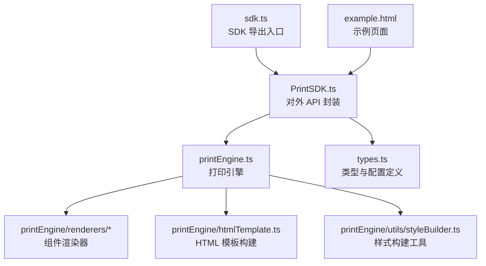
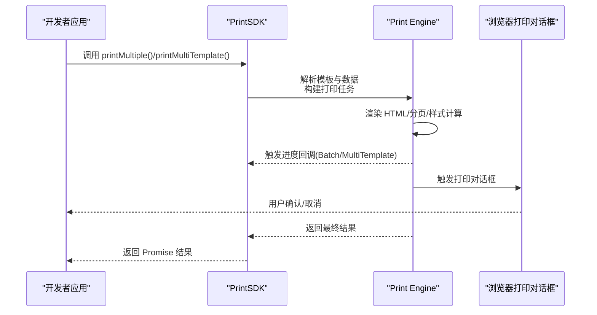
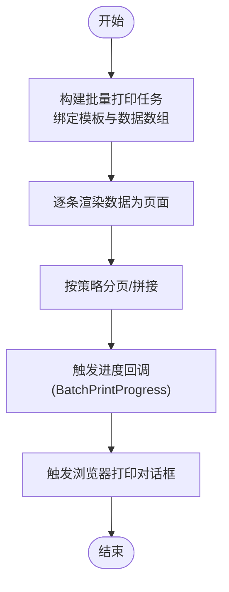
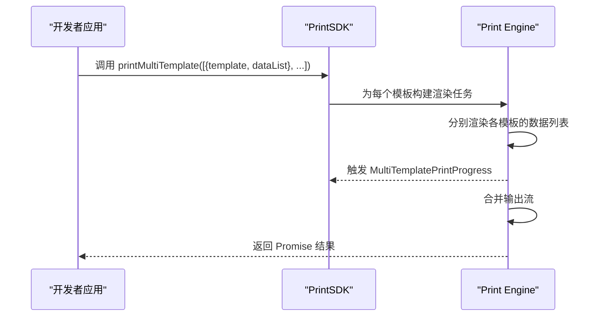
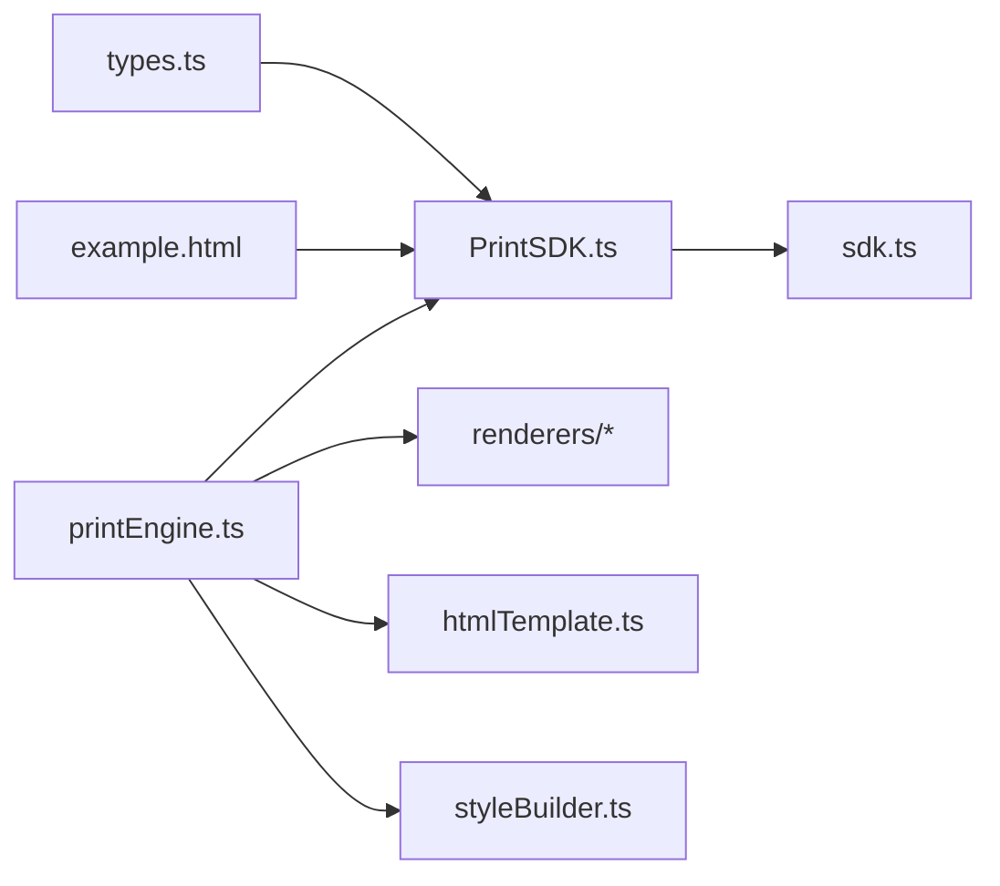

# 高级功能

<cite>
**本文引用的文件**
- [sdk/src/printEngine.ts](file://sdk/src/printEngine.ts)
- [sdk/src/PrintSDK.ts](file://sdk/src/PrintSDK.ts)
- [sdk/src/types.ts](file://sdk/src/types.ts)
- [sdk/src/sdk.ts](file://sdk/src/sdk.ts)
- [sdk/example.html](file://sdk/example.html)
</cite>

## 目录
1. [简介](#简介)
2. [项目结构](#项目结构)
3. [核心组件](#核心组件)
4. [架构总览](#架构总览)
5. [详细组件分析](#详细组件分析)
6. [依赖关系分析](#依赖关系分析)
7. [性能考虑](#性能考虑)
8. [故障排查指南](#故障排查指南)
9. [结论](#结论)
10. [附录](#附录)

## 简介
本指南面向需要在浏览器端实现“高级打印能力”的开发者，聚焦于打印 SDK 的批量打印与多模板打印能力，涵盖以下主题：
- 批量打印：printMultiple() 的使用与“同模板多数据”的批量处理模式
- 多模板批量打印：printMultiTemplate() 的使用与“多模板各自绑定数据列表”的模式
- 进度回调机制：BatchPrintProgress 与 MultiTemplatePrintProgress 的用法
- printOptions 及其关键配置项：连续纸张、页面尺寸、边距、分页策略等
- 性能优化建议与最佳实践
- 复杂业务场景的实现思路与流程图

## 项目结构
SDK 核心位于 sdk/src 目录，关键文件如下：
- PrintSDK.ts：对外暴露的打印入口类，封装 printMultiple 与 printMultiTemplate 等高级接口
- printEngine.ts：打印引擎实现，负责模板渲染、HTML 构建、分页与打印调度
- types.ts：类型定义，包含 printOptions、进度回调类型、模板与数据结构等
- sdk.ts：SDK 入口导出，统一对外暴露 API
- example.html：示例页面，演示如何调用批量打印与多模板打印

图表来源
- [sdk/src/PrintSDK.ts](file://sdk/src/PrintSDK.ts)
- [sdk/src/printEngine.ts](file://sdk/src/printEngine.ts)
- [sdk/src/types.ts](file://sdk/src/types.ts)
- [sdk/src/sdk.ts](file://sdk/src/sdk.ts)

章节来源
- [sdk/src/PrintSDK.ts](file://sdk/src/PrintSDK.ts)
- [sdk/src/printEngine.ts](file://sdk/src/printEngine.ts)
- [sdk/src/types.ts](file://sdk/src/types.ts)
- [sdk/src/sdk.ts](file://sdk/src/sdk.ts)
- [sdk/example.html](file://sdk/example.html)

## 核心组件
- PrintSDK：对外 API 类，提供批量打印与多模板打印的高层封装
- Print Engine：负责模板解析、数据绑定、HTML 渲染、分页与打印任务调度
- 类型系统：printOptions、进度回调类型（BatchPrintProgress、MultiTemplatePrintProgress）等
- 示例页面：展示如何组织模板与数据、如何传入 printOptions 并监听进度

章节来源
- [sdk/src/PrintSDK.ts](file://sdk/src/PrintSDK.ts)
- [sdk/src/printEngine.ts](file://sdk/src/printEngine.ts)
- [sdk/src/types.ts](file://sdk/src/types.ts)
- [sdk/example.html](file://sdk/example.html)

## 架构总览
下图展示了从调用到打印完成的关键交互：

图表来源
- [sdk/src/PrintSDK.ts](file://sdk/src/PrintSDK.ts)
- [sdk/src/printEngine.ts](file://sdk/src/printEngine.ts)

## 详细组件分析

### 批量打印：printMultiple()
- 使用场景
  - 同一模板对多条数据进行批量打印，适合“标签/小票/清单”等重复性内容
- 调用要点
  - 输入：模板对象、数据数组（每条数据生成一页）
  - 输出：Promise，包含打印结果与进度回调
- 进度回调
  - 使用 BatchPrintProgress，可获知当前页索引、总页数、当前数据索引等
- 关键配置
  - printOptions 中的分页策略、连续纸张、页面尺寸、边距等会影响渲染与打印行为

图表来源
- [sdk/src/PrintSDK.ts](file://sdk/src/PrintSDK.ts)
- [sdk/src/printEngine.ts](file://sdk/src/printEngine.ts)

章节来源
- [sdk/src/PrintSDK.ts](file://sdk/src/PrintSDK.ts)
- [sdk/src/printEngine.ts](file://sdk/src/printEngine.ts)
- [sdk/src/types.ts](file://sdk/src/types.ts)

### 多模板批量打印：printMultiTemplate()
- 使用场景
  - 多个不同模板各自绑定一组数据，一次性输出多个模板的打印内容
- 调用要点
  - 输入：模板-数据列表的映射集合
  - 输出：Promise，包含整体进度与各模板进度
- 进度回调
  - 使用 MultiTemplatePrintProgress，可获知当前模板索引、当前模板已处理的数据索引、总数据量等
- 关键配置
  - printOptions 的页面尺寸、连续纸张、分页策略等影响各模板的渲染与拼接

图表来源
- [sdk/src/PrintSDK.ts](file://sdk/src/PrintSDK.ts)
- [sdk/src/printEngine.ts](file://sdk/src/printEngine.ts)

章节来源
- [sdk/src/PrintSDK.ts](file://sdk/src/PrintSDK.ts)
- [sdk/src/printEngine.ts](file://sdk/src/printEngine.ts)
- [sdk/src/types.ts](file://sdk/src/types.ts)

### 进度回调机制
- BatchPrintProgress
  - 适用：printMultiple() 场景
  - 提供：当前页索引、总页数、当前数据索引、模板标识等
- MultiTemplatePrintProgress
  - 适用：printMultiTemplate() 场景
  - 提供：当前模板索引、当前模板已处理数据索引、该模板总数据量、整体进度等
- 使用建议
  - 在 UI 层显示“正在打印第 X 页/共 Y 页”或“模板 A 已处理 M/N”
  - 对于长任务，建议节流回调频率，避免频繁重绘

章节来源
- [sdk/src/types.ts](file://sdk/src/types.ts)
- [sdk/src/PrintSDK.ts](file://sdk/src/PrintSDK.ts)

### printOptions 与高级配置
- 页面尺寸与方向
  - 支持自定义宽度/高度与方向，确保与标签尺寸匹配
- 边距控制
  - 上下左右边距，避免内容被裁切
- 连续纸张打印
  - 控制是否以连续纸张模式输出，避免自动分页导致的错位
- 分页策略
  - 控制组件/表格跨页行为，避免内容被截断
- 字体与资源加载
  - 预加载字体与图片，减少渲染时的闪烁与等待
- 打印份数与双面打印
  - 通过浏览器打印对话框设置，SDK 提供可控的 HTML 结构以提升兼容性

章节来源
- [sdk/src/types.ts](file://sdk/src/types.ts)
- [sdk/src/printEngine.ts](file://sdk/src/printEngine.ts)

### 渲染与分页实现要点
- 组件渲染器
  - 文本、表格、二维码、条形码等组件按需渲染，保证样式与布局正确
- HTML 模板构建
  - 基于模板与数据生成最终 HTML，注入样式与必要的脚本
- 分页与样式计算
  - 计算元素在页面中的位置，必要时插入分页符，确保跨页内容完整
- 打印调度
  - 触发浏览器打印对话框前，确保所有资源已就绪

章节来源
- [sdk/src/printEngine.ts](file://sdk/src/printEngine.ts)
- [sdk/src/printEngine/renderers/index.ts](file://sdk/src/printEngine/renderers/index.ts)
- [sdk/src/printEngine/htmlTemplate.ts](file://sdk/src/printEngine/htmlTemplate.ts)
- [sdk/src/printEngine/utils/styleBuilder.ts](file://sdk/src/printEngine/utils/styleBuilder.ts)

## 依赖关系分析
- PrintSDK 依赖 Print Engine 与类型系统
- Print Engine 内部依赖渲染器、HTML 模板构建与样式工具
- SDK 导出入口统一对外暴露 API
- 示例页面依赖 SDK 并演示调用方式

图表来源
- [sdk/src/PrintSDK.ts](file://sdk/src/PrintSDK.ts)
- [sdk/src/printEngine.ts](file://sdk/src/printEngine.ts)
- [sdk/src/types.ts](file://sdk/src/types.ts)
- [sdk/src/sdk.ts](file://sdk/src/sdk.ts)
- [sdk/example.html](file://sdk/example.html)

章节来源
- [sdk/src/PrintSDK.ts](file://sdk/src/PrintSDK.ts)
- [sdk/src/printEngine.ts](file://sdk/src/printEngine.ts)
- [sdk/src/types.ts](file://sdk/src/types.ts)
- [sdk/src/sdk.ts](file://sdk/src/sdk.ts)
- [sdk/example.html](file://sdk/example.html)

## 性能考虑
- 数据批量化处理
  - 将大量数据分批渲染，避免一次性占用主线程
- 资源预加载
  - 提前加载字体、图片等静态资源，减少渲染阻塞
- 分页策略优化
  - 合理设置分页策略，减少跨页计算与重排
- 进度回调节流
  - 对高频进度事件进行节流，降低 UI 更新开销
- 浏览器打印对话框
  - 尽量简化 HTML 结构与样式，减少打印渲染时间
- 多模板合并
  - 合理安排模板顺序与数据规模，避免内存峰值过高

## 故障排查指南
- 打印内容被裁剪
  - 检查 printOptions 的页面尺寸与边距设置，确保内容在可见区域内
- 跨页内容丢失
  - 调整分页策略，避免表格或组件被强制拆分
- 进度回调不触发
  - 确认回调函数传入方式与作用域，检查 SDK 版本与示例一致
- 字体未生效
  - 确保字体资源已加载，或使用 base64 内联字体
- 多模板输出顺序异常
  - 校验模板与数据列表的映射关系，确保索引与回调参数一致

章节来源
- [sdk/src/types.ts](file://sdk/src/types.ts)
- [sdk/src/PrintSDK.ts](file://sdk/src/PrintSDK.ts)
- [sdk/src/printEngine.ts](file://sdk/src/printEngine.ts)

## 结论
通过 PrintSDK 的批量打印与多模板打印能力，开发者可以高效地实现从“同模板多数据”到“多模板多数据”的复杂打印需求。结合合理的 printOptions 与进度回调机制，可在保证用户体验的同时获得稳定的打印效果。建议在实际项目中遵循性能优化与最佳实践，针对业务场景选择合适的分页策略与资源加载方案。

## 附录
- 示例页面
  - 参考 [sdk/example.html](file://sdk/example.html)，了解如何组织模板与数据、如何传入 printOptions 并监听进度
- 类型定义
  - 参考 [sdk/src/types.ts](file://sdk/src/types.ts)，了解 printOptions、进度回调类型与数据结构
- API 封装
  - 参考 [sdk/src/PrintSDK.ts](file://sdk/src/PrintSDK.ts) 与 [sdk/src/sdk.ts](file://sdk/src/sdk.ts)，了解对外 API 的使用方式