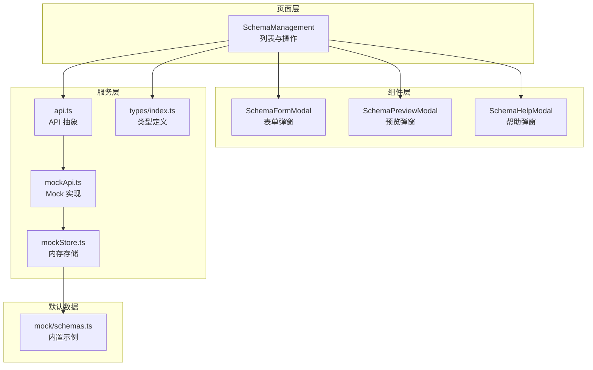
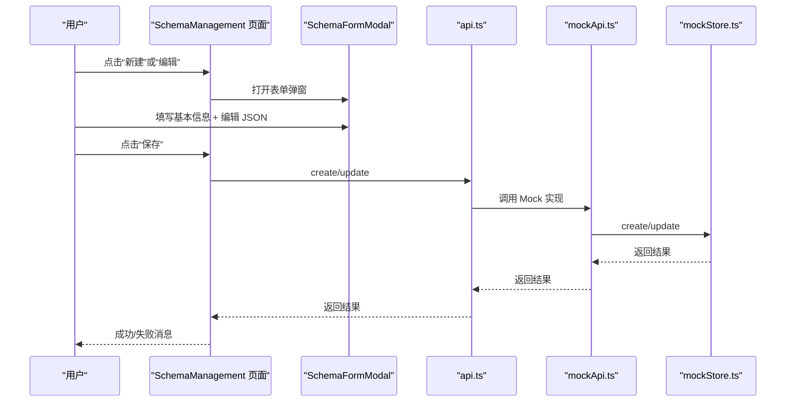
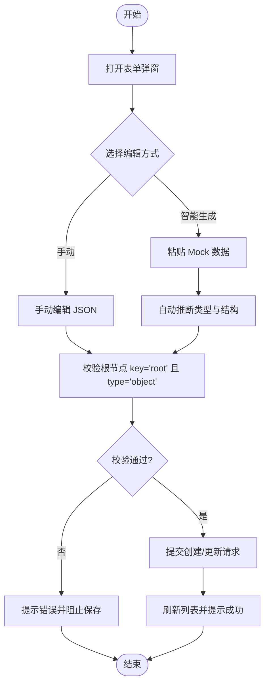
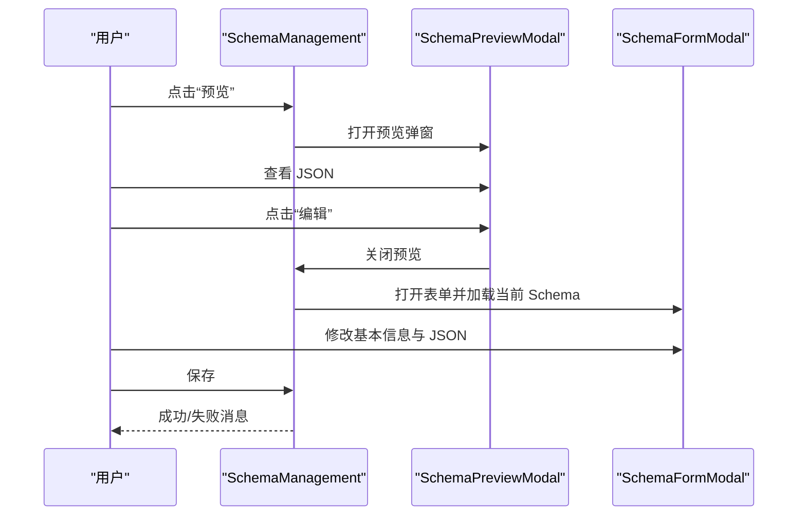
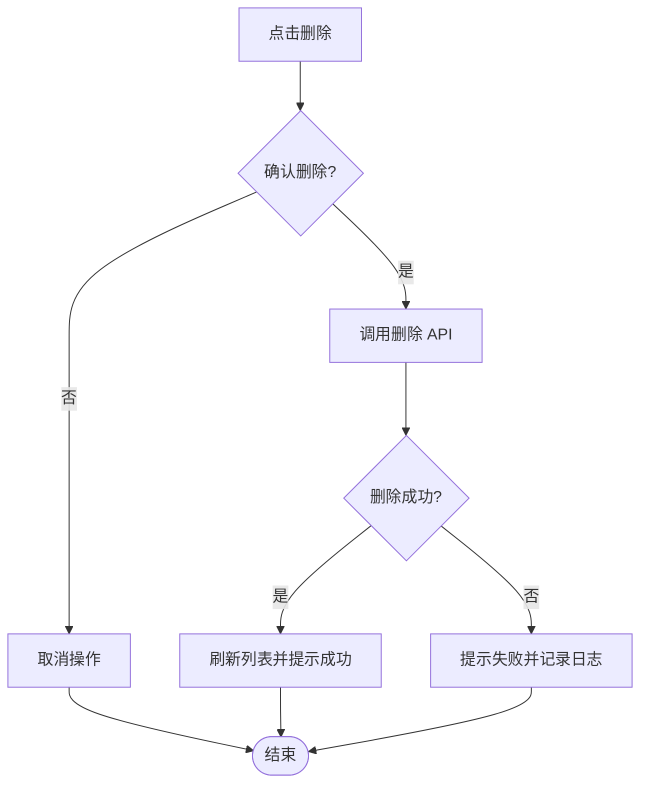
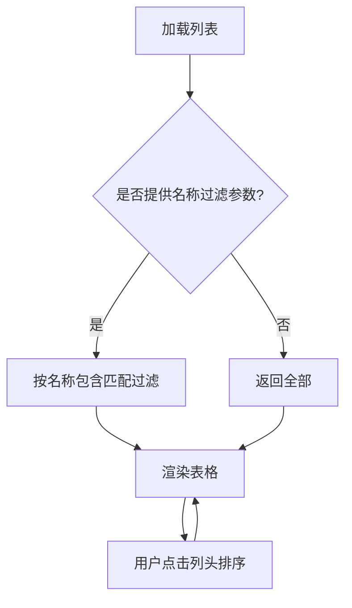
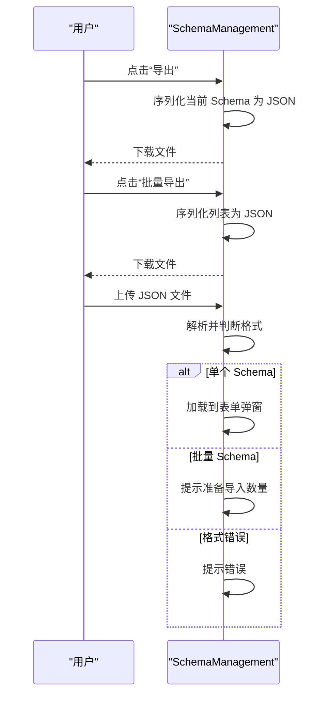
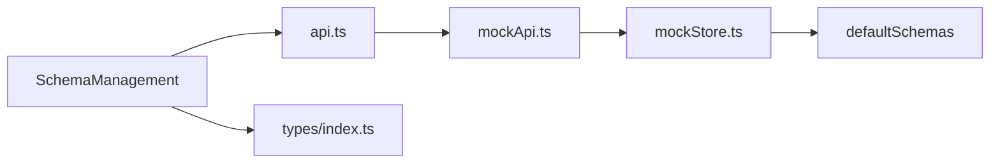
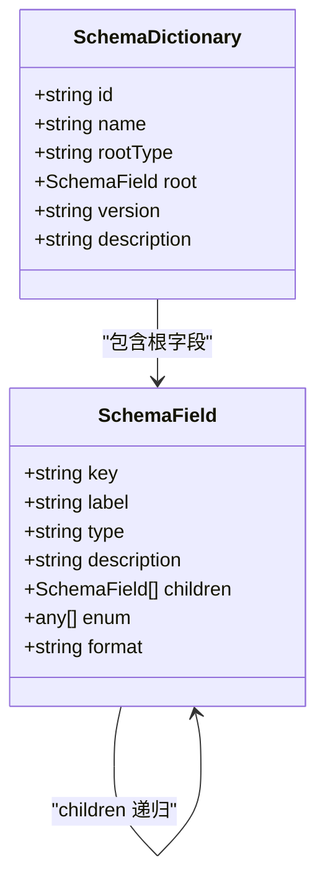

# Schema CRUD 操作

<cite>
**本文引用的文件**
- [index.tsx](file://designer/src/pages/SchemaManagement/index.tsx)
- [SchemaFormModal.tsx](file://designer/src/pages/SchemaManagement/components/SchemaFormModal.tsx)
- [SchemaHelpModal.tsx](file://designer/src/pages/SchemaManagement/components/SchemaHelpModal.tsx)
- [SchemaPreviewModal.tsx](file://designer/src/pages/SchemaManagement/components/SchemaPreviewModal.tsx)
- [api.ts](file://designer/src/services/api.ts)
- [mockApi.ts](file://designer/src/services/mockApi.ts)
- [mockStore.ts](file://designer/src/services/mockStore.ts)
- [schemas.ts](file://designer/src/services/mock/schemas.ts)
- [index.ts](file://designer/src/types/index.ts)
</cite>

## 目录
1. [简介](#简介)
2. [项目结构](#项目结构)
3. [核心组件](#核心组件)
4. [架构概览](#架构概览)
5. [详细组件分析](#详细组件分析)
6. [依赖分析](#依赖分析)
7. [性能考虑](#性能考虑)
8. [故障排除指南](#故障排除指南)
9. [结论](#结论)
10. [附录](#附录)

## 简介
本指南面向使用 Schema 管理系统的用户与开发者，提供 Schema 字典的完整 CRUD 操作说明。内容涵盖：
- Schema 字典的创建流程（表单字段配置、验证规则、预设值）
- 编辑功能（字段增删改查、类型修改、约束调整）
- 删除操作与安全确认机制
- 列表展示、搜索过滤与排序
- 导入导出功能
- 状态管理与批量操作
- 操作流程图与错误处理指南
- 实际操作示例与常见问题解决方案

## 项目结构
Schema 管理模块位于设计器前端工程的 SchemaManagement 页面中，采用“页面 + 组件 + 服务层”的分层设计：
- 页面层：负责列表展示、交互控制与状态管理
- 组件层：表单弹窗、帮助弹窗、预览弹窗
- 服务层：API 抽象（真实后端或前端 Mock）

**图表来源**
- [index.tsx:1-551](file://designer/src/pages/SchemaManagement/index.tsx#L1-L551)
- [SchemaFormModal.tsx:1-154](file://designer/src/pages/SchemaManagement/components/SchemaFormModal.tsx#L1-L154)
- [SchemaPreviewModal.tsx:1-96](file://designer/src/pages/SchemaManagement/components/SchemaPreviewModal.tsx#L1-L96)
- [SchemaHelpModal.tsx:1-25](file://designer/src/pages/SchemaManagement/components/SchemaHelpModal.tsx#L1-L25)
- [api.ts:1-134](file://designer/src/services/api.ts#L1-L134)
- [mockApi.ts:1-103](file://designer/src/services/mockApi.ts#L1-L103)
- [mockStore.ts:1-135](file://designer/src/services/mockStore.ts#L1-L135)
- [schemas.ts:1-147](file://designer/src/services/mock/schemas.ts#L1-L147)
- [index.ts:1-378](file://designer/src/types/index.ts#L1-L378)

**章节来源**
- [index.tsx:1-551](file://designer/src/pages/SchemaManagement/index.tsx#L1-L551)
- [api.ts:1-134](file://designer/src/services/api.ts#L1-L134)

## 核心组件
- SchemaManagement 页面：负责 Schema 列表渲染、新增/编辑/删除、导入导出、刷新、帮助弹窗等。
- SchemaFormModal 表单弹窗：提供基本信息（名称、版本、描述）与两种 Schema 编辑方式（手动 JSON 编辑、基于 Mock 数据智能生成）。
- SchemaPreviewModal 预览弹窗：展示 Schema 的基本信息与完整 JSON 结构，并支持导出与直接编辑。
- SchemaHelpModal 帮助弹窗：提供字段类型说明与示例。
- API 抽象层：根据环境变量选择真实后端或前端 Mock；统一暴露 list/get/create/update/delete 等方法。
- Mock 存储：在前端内存中维护 Schema 列表，支持 CRUD 与过滤查询。
- 类型定义：SchemaDictionary、SchemaField 等核心类型，确保前后端数据结构一致。

**章节来源**
- [index.tsx:1-551](file://designer/src/pages/SchemaManagement/index.tsx#L1-L551)
- [SchemaFormModal.tsx:1-154](file://designer/src/pages/SchemaManagement/components/SchemaFormModal.tsx#L1-L154)
- [SchemaPreviewModal.tsx:1-96](file://designer/src/pages/SchemaManagement/components/SchemaPreviewModal.tsx#L1-L96)
- [SchemaHelpModal.tsx:1-25](file://designer/src/pages/SchemaManagement/components/SchemaHelpModal.tsx#L1-L25)
- [api.ts:1-134](file://designer/src/services/api.ts#L1-L134)
- [mockApi.ts:1-103](file://designer/src/services/mockApi.ts#L1-L103)
- [mockStore.ts:1-135](file://designer/src/services/mockStore.ts#L1-L135)
- [index.ts:1-378](file://designer/src/types/index.ts#L1-L378)

## 架构概览
Schema 管理的调用链路如下：
- 用户在页面触发操作（新建、编辑、删除、导入、导出、刷新）
- 页面通过 API 抽象层调用真实后端或 Mock 实现
- Mock 实现访问内存存储进行 CRUD
- 页面根据结果更新本地状态并反馈消息

**图表来源**
- [index.tsx:113-411](file://designer/src/pages/SchemaManagement/index.tsx#L113-L411)
- [api.ts:37-61](file://designer/src/services/api.ts#L37-L61)
- [mockApi.ts:19-42](file://designer/src/services/mockApi.ts#L19-L42)
- [mockStore.ts:43-54](file://designer/src/services/mockStore.ts#L43-L54)

## 详细组件分析

### 创建 Schema 流程
- 打开表单弹窗，清空编辑状态，初始化 JSON 编辑器为根对象结构
- 提供两种编辑方式：
  - 手动编辑：使用 Monaco 编辑器直接编写 JSON
  - 智能生成：粘贴 Mock 数据，系统自动推断类型与结构
- 保存时进行关键校验：
  - 根节点必须存在且 key 为 "root"
  - 根节点类型必须为 "object"
  - JSON 格式必须合法
- 成功后刷新列表并提示消息

**图表来源**
- [index.tsx:126-137](file://designer/src/pages/SchemaManagement/index.tsx#L126-L137)
- [index.tsx:162-226](file://designer/src/pages/SchemaManagement/index.tsx#L162-L226)
- [index.tsx:365-411](file://designer/src/pages/SchemaManagement/index.tsx#L365-L411)
- [SchemaFormModal.tsx:68-144](file://designer/src/pages/SchemaManagement/components/SchemaFormModal.tsx#L68-L144)

**章节来源**
- [index.tsx:126-137](file://designer/src/pages/SchemaManagement/index.tsx#L126-L137)
- [index.tsx:162-226](file://designer/src/pages/SchemaManagement/index.tsx#L162-L226)
- [index.tsx:365-411](file://designer/src/pages/SchemaManagement/index.tsx#L365-L411)
- [SchemaFormModal.tsx:68-144](file://designer/src/pages/SchemaManagement/components/SchemaFormModal.tsx#L68-L144)

### 编辑 Schema 功能
- 预览模式：点击“预览”打开预览弹窗，查看基本信息与完整 JSON
- 编辑模式：点击“编辑”将当前 Schema 加载到表单弹窗，允许修改基本信息与 JSON 结构
- 字段增删改查：通过 JSON 结构直接增删子字段，或修改字段类型、枚举、描述等
- 类型修改：支持 string/number/boolean/date/object/array 等类型切换
- 约束调整：通过 children 字段定义对象/数组的子结构，通过 enum 定义枚举值集合

**图表来源**
- [index.tsx:98-102](file://designer/src/pages/SchemaManagement/index.tsx#L98-L102)
- [index.tsx:139-149](file://designer/src/pages/SchemaManagement/index.tsx#L139-L149)
- [SchemaPreviewModal.tsx:34-41](file://designer/src/pages/SchemaManagement/components/SchemaPreviewModal.tsx#L34-L41)
- [SchemaFormModal.tsx:20-31](file://designer/src/pages/SchemaManagement/components/SchemaFormModal.tsx#L20-L31)

**章节来源**
- [index.tsx:98-102](file://designer/src/pages/SchemaManagement/index.tsx#L98-L102)
- [index.tsx:139-149](file://designer/src/pages/SchemaManagement/index.tsx#L139-L149)
- [SchemaPreviewModal.tsx:34-41](file://designer/src/pages/SchemaManagement/components/SchemaPreviewModal.tsx#L34-L41)
- [SchemaFormModal.tsx:20-31](file://designer/src/pages/SchemaManagement/components/SchemaFormModal.tsx#L20-L31)

### 删除 Schema 操作与安全确认
- 列表中提供“删除”按钮，使用 Popconfirm 进行二次确认
- 确认后调用 API 删除，成功后刷新列表并提示成功；失败则提示失败并输出日志

**图表来源**
- [index.tsx:469-477](file://designer/src/pages/SchemaManagement/index.tsx#L469-L477)
- [index.tsx:151-160](file://designer/src/pages/SchemaManagement/index.tsx#L151-L160)

**章节来源**
- [index.tsx:469-477](file://designer/src/pages/SchemaManagement/index.tsx#L469-L477)
- [index.tsx:151-160](file://designer/src/pages/SchemaManagement/index.tsx#L151-L160)

### 列表展示、搜索过滤与排序
- 列表字段：名称、版本、字段数、创建时间、操作按钮
- 搜索过滤：支持按名称过滤（Mock 实现中对 name 字段进行包含匹配）
- 排序：Ant Design Table 默认支持列排序
- 分页：每页显示固定数量条目

**图表来源**
- [index.tsx:113-124](file://designer/src/pages/SchemaManagement/index.tsx#L113-L124)
- [mockStore.ts:31-36](file://designer/src/services/mockStore.ts#L31-L36)
- [index.tsx:409-481](file://designer/src/pages/SchemaManagement/index.tsx#L409-L481)

**章节来源**
- [index.tsx:113-124](file://designer/src/pages/SchemaManagement/index.tsx#L113-L124)
- [mockStore.ts:31-36](file://designer/src/services/mockStore.ts#L31-L36)
- [index.tsx:409-481](file://designer/src/pages/SchemaManagement/index.tsx#L409-L481)

### 导入导出功能
- 单个导出：点击“导出”，将当前 Schema 序列化为 JSON 文件下载
- 批量导出：点击“批量导出”，将当前列表序列化为 JSON 文件下载
- 单个导入：上传 JSON 文件，若为对象且包含 name/root 字段，则加载到表单弹窗
- 批量导入：上传 JSON 文件，若为数组则提示准备导入数量（当前未实现具体导入逻辑）

**图表来源**
- [index.tsx:228-256](file://designer/src/pages/SchemaManagement/index.tsx#L228-L256)
- [index.tsx:258-289](file://designer/src/pages/SchemaManagement/index.tsx#L258-L289)

**章节来源**
- [index.tsx:228-256](file://designer/src/pages/SchemaManagement/index.tsx#L228-L256)
- [index.tsx:258-289](file://designer/src/pages/SchemaManagement/index.tsx#L258-L289)

### 状态管理与批量操作
- 状态管理：页面使用 useState 管理列表数据、加载状态、弹窗状态、表单状态等
- 批量操作：当前实现支持批量导出；批量导入预留接口（需扩展具体导入逻辑）
- Mock 数据：内置示例 Schema 作为默认数据源，便于快速体验

**章节来源**
- [index.tsx:41-51](file://designer/src/pages/SchemaManagement/index.tsx#L41-L51)
- [schemas.ts:1-147](file://designer/src/services/mock/schemas.ts#L1-L147)

## 依赖分析
- 页面依赖服务层 API 抽象，通过环境变量决定真实后端或 Mock 实现
- Mock 实现依赖内存存储，提供 CRUD 与过滤能力
- 类型定义贯穿全链路，确保前后端一致性

**图表来源**
- [index.tsx:32-36](file://designer/src/pages/SchemaManagement/index.tsx#L32-L36)
- [api.ts:131-134](file://designer/src/services/api.ts#L131-L134)
- [mockApi.ts:1-103](file://designer/src/services/mockApi.ts#L1-L103)
- [mockStore.ts:1-135](file://designer/src/services/mockStore.ts#L1-L135)
- [schemas.ts:1-147](file://designer/src/services/mock/schemas.ts#L1-L147)
- [index.ts:1-378](file://designer/src/types/index.ts#L1-L378)

**章节来源**
- [index.tsx:32-36](file://designer/src/pages/SchemaManagement/index.tsx#L32-L36)
- [api.ts:131-134](file://designer/src/services/api.ts#L131-L134)
- [mockApi.ts:1-103](file://designer/src/services/mockApi.ts#L1-L103)
- [mockStore.ts:1-135](file://designer/src/services/mockStore.ts#L1-L135)
- [schemas.ts:1-147](file://designer/src/services/mock/schemas.ts#L1-L147)
- [index.ts:1-378](file://designer/src/types/index.ts#L1-L378)

## 性能考虑
- Mock 实现使用内存存储，读写复杂度为 O(n)，适合小规模数据
- 列表分页减少 DOM 渲染压力
- 表单弹窗使用 Monaco 编辑器，建议在大体量 JSON 场景下注意编辑器性能
- 导入导出为前端操作，避免网络传输，响应迅速

## 故障排除指南
- JSON 格式错误
  - 现象：保存时报错“JSON 格式错误”
  - 原因：表单提交时 JSON 解析失败
  - 处理：检查 JSON 语法，确保根节点 key 为 "root" 且 type 为 "object"
- 根节点校验失败
  - 现象：保存时报错“顶层节点的 key 必须为 'root'”或“顶层节点必须是 object 类型”
  - 原因：根节点不符合约定
  - 处理：确保根节点为对象且 key 为 "root"
- Mock 数据格式错误
  - 现象：智能生成失败，提示“Mock 数据格式错误”
  - 原因：粘贴的 Mock 数据不是合法 JSON
  - 处理：检查 Mock 数据格式，确保为对象或数组
- 删除失败
  - 现象：删除后提示失败
  - 原因：后端或 Mock 层未找到对应 ID
  - 处理：确认 ID 正确，刷新列表后重试
- 导入文件格式不正确
  - 现象：导入后提示“文件格式不正确”
  - 原因：上传文件不是期望的对象或数组
  - 处理：确保上传文件为合法 JSON，且包含 name/root 字段

**章节来源**
- [index.tsx:403-411](file://designer/src/pages/SchemaManagement/index.tsx#L403-L411)
- [index.tsx:169-173](file://designer/src/pages/SchemaManagement/index.tsx#L169-L173)
- [index.tsx:280-282](file://designer/src/pages/SchemaManagement/index.tsx#L280-L282)
- [index.tsx:156-159](file://designer/src/pages/SchemaManagement/index.tsx#L156-L159)
- [index.tsx:280-282](file://designer/src/pages/SchemaManagement/index.tsx#L280-L282)

## 结论
本指南覆盖了 Schema 字典的完整 CRUD 生命周期：从创建、编辑、删除，到列表展示、搜索过滤、导入导出与状态管理。通过清晰的流程图与错误处理指引，用户可以高效地完成 Schema 管理任务。建议在生产环境中结合真实后端 API 使用，并根据业务需求扩展批量导入与状态变更等功能。

## 附录

### Schema 字典数据模型

**图表来源**
- [index.ts:18-52](file://designer/src/types/index.ts#L18-L52)