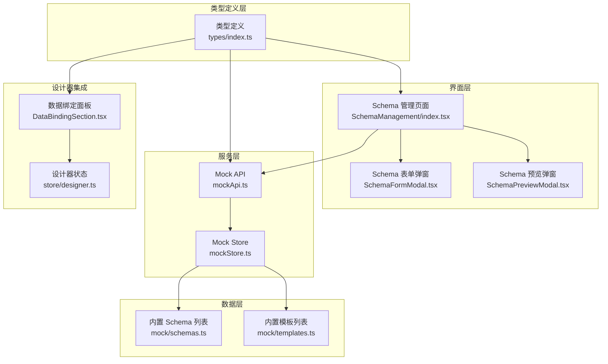
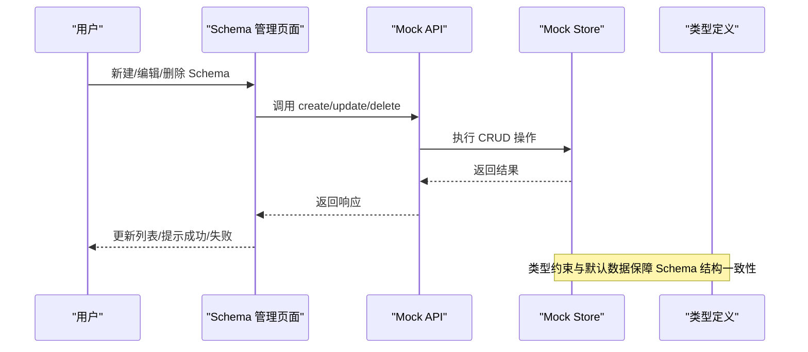
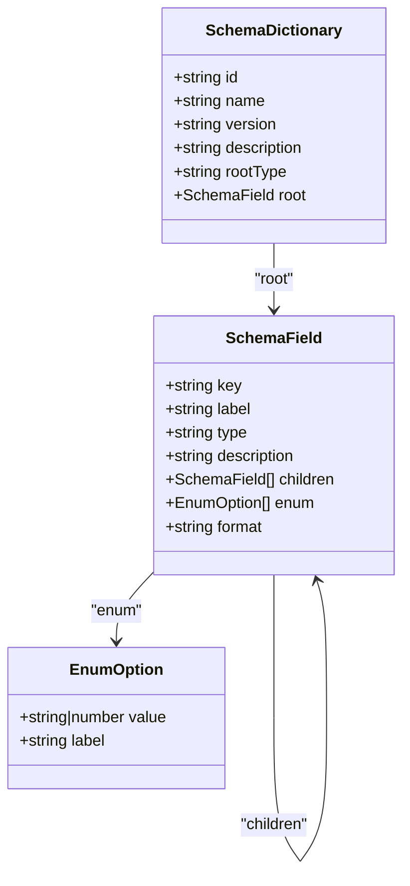
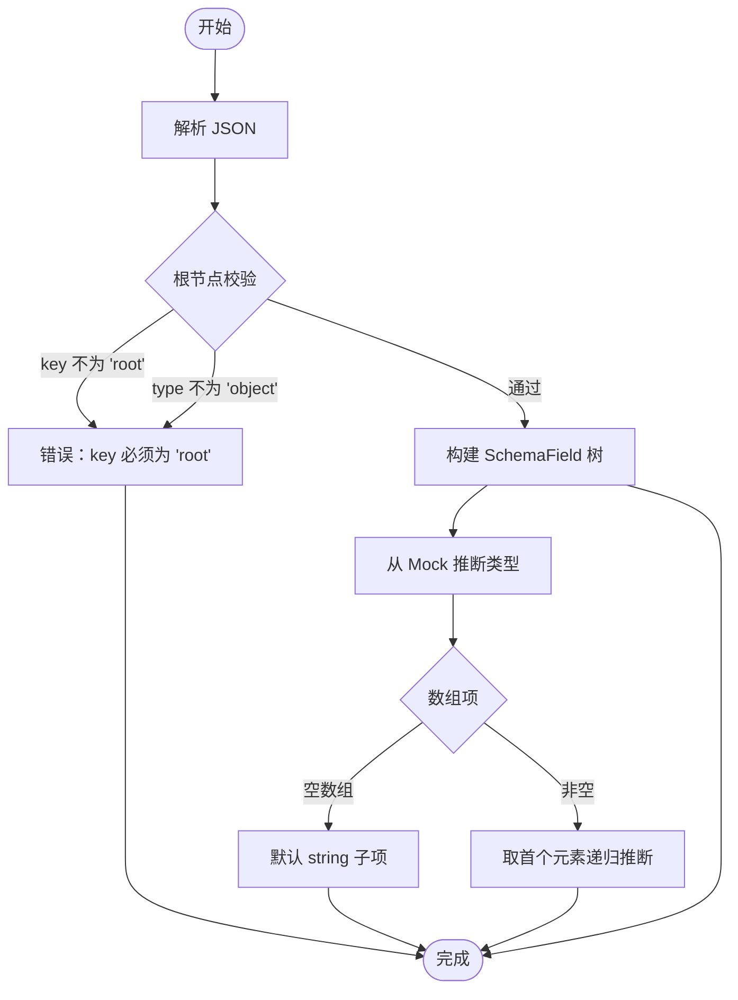
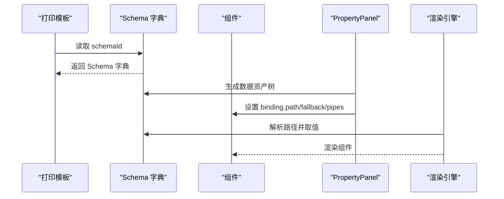
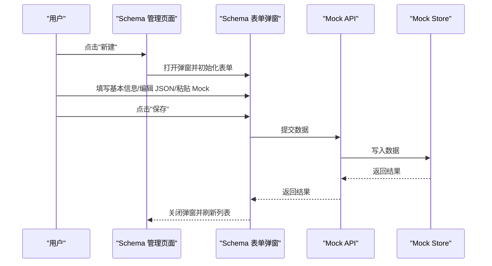
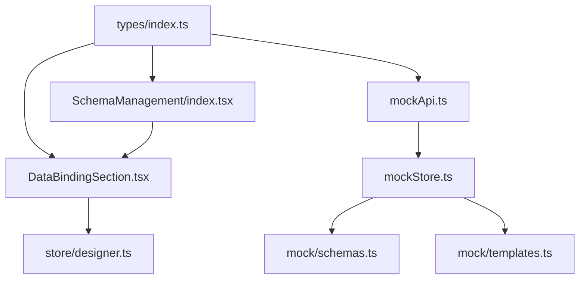

# Schema 字典管理

<cite>
**本文引用的文件**
- [designer/src/types/index.ts](file://designer/src/types/index.ts)
- [designer/src/services/mock/schemas.ts](file://designer/src/services/mock/schemas.ts)
- [designer/src/pages/SchemaManagement/index.tsx](file://designer/src/pages/SchemaManagement/index.tsx)
- [designer/src/pages/SchemaManagement/components/SchemaFormModal.tsx](file://designer/src/pages/SchemaManagement/components/SchemaFormModal.tsx)
- [designer/src/pages/SchemaManagement/components/SchemaPreviewModal.tsx](file://designer/src/pages/SchemaManagement/components/SchemaPreviewModal.tsx)
- [designer/src/services/mockApi.ts](file://designer/src/services/mockApi.ts)
- [designer/src/services/mockStore.ts](file://designer/src/services/mockStore.ts)
- [designer/src/services/mock/templates.ts](file://designer/src/services/mock/templates.ts)
- [designer/src/pages/Designer/components/PropertyPanel/DataBindingSection.tsx](file://designer/src/pages/Designer/components/PropertyPanel/DataBindingSection.tsx)
- [designer/src/store/designer.ts](file://designer/src/store/designer.ts)
</cite>

## 更新摘要
**所做更改**
- 更新了所有文件路径引用，从原来的 '.qoder/repowiki/knowledge/zh/打印模板设计与管理平台/Schema 字典管理/' 移动到 '字典管理/' 目录
- 保持了文档内容的完整性，仅更新了文件路径引用
- 所有代码示例和架构图仍然准确反映当前代码库结构

## 目录
1. [简介](#简介)
2. [项目结构](#项目结构)
3. [核心组件](#核心组件)
4. [架构概览](#架构概览)
5. [详细组件分析](#详细组件分析)
6. [依赖分析](#依赖分析)
7. [性能考虑](#性能考虑)
8. [故障排除指南](#故障排除指南)
9. [结论](#结论)
10. [附录](#附录)

## 简介
本文件为 Schema 字典管理系统的技术文档，面向设计器使用者与开发者，系统性阐述 Schema 字典的设计理念、数据模型定义规范、字段类型系统、数据验证机制、嵌套对象支持、Schema 与模板的绑定关系与数据流向，并提供创建、编辑、删除操作指南、版本管理与迁移策略、设计器使用方法与最佳实践、常见问题解决方案以及实际业务场景应用示例。

## 项目结构
Schema 管理系统由以下模块构成：
- 类型定义层：统一定义 Schema 字典、字段、模板、组件等核心类型，确保前后端契约一致。
- Mock 数据与 API 层：提供 Schema 的增删改查接口与默认内置数据，便于开发调试。
- 界面交互层：Schema 管理页面、表单弹窗、预览弹窗，支持手动编辑与从 Mock 数据智能生成。
- 设计器集成层：PropertyPanel 的数据绑定区域，将组件与 Schema 字段路径进行绑定，实现数据驱动渲染。
- 模板绑定层：打印模板通过 schemaId 关联 Schema，形成"Schema → 模板 → 组件"的数据流。

**图表来源**
- [designer/src/pages/SchemaManagement/index.tsx:1-551](file://designer/src/pages/SchemaManagement/index.tsx#L1-L551)
- [designer/src/pages/SchemaManagement/components/SchemaFormModal.tsx:1-154](file://designer/src/pages/SchemaManagement/components/SchemaFormModal.tsx#L1-L154)
- [designer/src/pages/SchemaManagement/components/SchemaPreviewModal.tsx:1-96](file://designer/src/pages/SchemaManagement/components/SchemaPreviewModal.tsx#L1-L96)
- [designer/src/services/mockApi.ts:1-103](file://designer/src/services/mockApi.ts#L1-L103)
- [designer/src/services/mockStore.ts:1-135](file://designer/src/services/mockStore.ts#L1-L135)
- [designer/src/services/mock/schemas.ts:1-147](file://designer/src/services/mock/schemas.ts#L1-L147)
- [designer/src/services/mock/templates.ts:1-800](file://designer/src/services/mock/templates.ts#L1-L800)
- [designer/src/types/index.ts:1-422](file://designer/src/types/index.ts#L1-L422)
- [designer/src/pages/Designer/components/PropertyPanel/DataBindingSection.tsx:1-128](file://designer/src/pages/Designer/components/PropertyPanel/DataBindingSection.tsx#L1-L128)
- [designer/src/store/designer.ts:1-782](file://designer/src/store/designer.ts#L1-L782)

**章节来源**
- [designer/src/pages/SchemaManagement/index.tsx:1-551](file://designer/src/pages/SchemaManagement/index.tsx#L1-L551)
- [designer/src/services/mockApi.ts:1-103](file://designer/src/services/mockApi.ts#L1-L103)
- [designer/src/services/mockStore.ts:1-135](file://designer/src/services/mockStore.ts#L1-L135)
- [designer/src/services/mock/schemas.ts:1-147](file://designer/src/services/mock/schemas.ts#L1-L147)
- [designer/src/services/mock/templates.ts:1-800](file://designer/src/services/mock/templates.ts#L1-L800)
- [designer/src/types/index.ts:1-422](file://designer/src/types/index.ts#L1-L422)
- [designer/src/pages/Designer/components/PropertyPanel/DataBindingSection.tsx:1-128](file://designer/src/pages/Designer/components/PropertyPanel/DataBindingSection.tsx#L1-L128)
- [designer/src/store/designer.ts:1-782](file://designer/src/store/designer.ts#L1-L782)

## 核心组件
- Schema 字典模型：包含 id、name、version、description、rootType、root 等字段，root 为 SchemaField 根节点，强制 key 为 'root'，type 为 'object'。
- Schema 字段模型：支持基础类型 string/number/boolean/date/datetime 与复合类型 object/array；支持 children、enum、format 等扩展属性。
- Schema 管理页面：提供列表展示、新建、编辑、删除、导出、批量导出、导入、预览、从 Mock 生成等功能。
- Mock API 与 Store：提供 list/get/create/update/delete 接口，基于内存存储默认内置数据。
- 设计器数据绑定：PropertyPanel 的数据绑定区域支持绑定路径、默认值与数据管道配置。

**章节来源**
- [designer/src/types/index.ts:5-52](file://designer/src/types/index.ts#L5-L52)
- [designer/src/pages/SchemaManagement/index.tsx:113-411](file://designer/src/pages/SchemaManagement/index.tsx#L113-L411)
- [designer/src/services/mockApi.ts:19-42](file://designer/src/services/mockApi.ts#L19-L42)
- [designer/src/services/mockStore.ts:29-60](file://designer/src/services/mockStore.ts#L29-L60)
- [designer/src/pages/Designer/components/PropertyPanel/DataBindingSection.tsx:20-125](file://designer/src/pages/Designer/components/PropertyPanel/DataBindingSection.tsx#L20-L125)

## 架构概览
Schema 管理系统采用"类型定义 → Mock API/Store → 界面交互 → 设计器集成"的分层架构。Schema 作为数据模型契约，被模板引用并通过组件绑定路径驱动渲染。

**图表来源**
- [designer/src/pages/SchemaManagement/index.tsx:365-411](file://designer/src/pages/SchemaManagement/index.tsx#L365-L411)
- [designer/src/services/mockApi.ts:19-42](file://designer/src/services/mockApi.ts#L19-L42)
- [designer/src/services/mockStore.ts:43-60](file://designer/src/services/mockStore.ts#L43-L60)
- [designer/src/types/index.ts:39-52](file://designer/src/types/index.ts#L39-L52)

## 详细组件分析

### 数据模型定义规范
- Schema 字典
  - id/name/version/description：唯一标识、名称、版本、描述
  - rootType：根类型，限定为 'object' 或 'array'
  - root：SchemaField 根节点，key 必须为 'root'，type 必须为 'object'
- Schema 字段
  - key/label/type/description：键名、显示名、类型、描述
  - children：仅在 object/array 类型时存在
  - enum：枚举选项集合，用于 string/number
  - format：格式化类型，如 date/datetime/money/percent
- 嵌套对象与数组
  - object：通过 children 定义子字段树
  - array：通过 children 定义数组项结构，支持数组项为 object/array
- 日期与数值格式
  - date/datetime：通过 format 指定显示格式
  - money/percent：通过 format 指定货币/百分比显示

**图表来源**
- [designer/src/types/index.ts:5-52](file://designer/src/types/index.ts#L5-L52)

**章节来源**
- [designer/src/types/index.ts:5-52](file://designer/src/types/index.ts#L5-L52)

### 字段类型系统与数据验证
- 字段类型
  - 基础类型：string/number/boolean/date/datetime
  - 复合类型：object/array
- 验证规则
  - 根节点校验：key 必须为 'root'，type 必须为 'object'
  - JSON 格式校验：提交时进行 JSON 解析与结构校验
  - 枚举校验：enum 选项需包含合法 value/label
- 智能生成
  - 从 Mock 数据推断类型：数组优先取首个元素，对象递归推断，字符串尝试匹配日期格式

**图表来源**
- [designer/src/pages/SchemaManagement/index.tsx:175-226](file://designer/src/pages/SchemaManagement/index.tsx#L175-L226)
- [designer/src/pages/SchemaManagement/index.tsx:365-411](file://designer/src/pages/SchemaManagement/index.tsx#L365-L411)

**章节来源**
- [designer/src/pages/SchemaManagement/index.tsx:175-226](file://designer/src/pages/SchemaManagement/index.tsx#L175-L226)
- [designer/src/pages/SchemaManagement/index.tsx:365-411](file://designer/src/pages/SchemaManagement/index.tsx#L365-L411)

### Schema 与模板的绑定关系与数据流向
- 绑定关系
  - PrintTemplate 通过 schemaId 关联 SchemaDictionary
  - 组件的 DataBinding.path 支持点号路径（如 'customer.name'、'items.0.amount'）
- 数据流向
  - 模板加载时读取 schemaId，设计器根据 Schema 字典生成数据资产树
  - PropertyPanel 的数据绑定区域允许用户选择 Schema 字段路径
  - 渲染引擎依据绑定路径与数据管道对组件进行数据填充

**图表来源**
- [designer/src/types/index.ts:337-358](file://designer/src/types/index.ts#L337-L358)
- [designer/src/pages/Designer/components/PropertyPanel/DataBindingSection.tsx:20-125](file://designer/src/pages/Designer/components/PropertyPanel/DataBindingSection.tsx#L20-L125)
- [designer/src/services/mock/templates.ts:6-177](file://designer/src/services/mock/templates.ts#L6-L177)

**章节来源**
- [designer/src/types/index.ts:337-358](file://designer/src/types/index.ts#L337-L358)
- [designer/src/pages/Designer/components/PropertyPanel/DataBindingSection.tsx:20-125](file://designer/src/pages/Designer/components/PropertyPanel/DataBindingSection.tsx#L20-L125)
- [designer/src/services/mock/templates.ts:6-177](file://designer/src/services/mock/templates.ts#L6-L177)

### Schema 管理页面与操作流程
- 列表与操作
  - 新建：打开表单弹窗，清空表单，初始化 root 为 object 类型
  - 编辑：回填基本信息与 root JSON，支持手动编辑与智能生成
  - 删除：调用 API 删除，刷新列表
  - 导出/批量导出：下载 JSON 文件
  - 导入：支持单个/批量导入 JSON
  - 预览：弹窗展示 Schema 基本信息与 JSON 原文
- 表单弹窗
  - 基本信息：名称、版本、描述
  - JSON 编辑器：手动编辑 root JSON
  - 智能生成：粘贴 Mock 数据，自动推断类型与结构
- 预览弹窗
  - 展示名称、版本、ID、描述与完整 JSON

**图表来源**
- [designer/src/pages/SchemaManagement/index.tsx:126-169](file://designer/src/pages/SchemaManagement/index.tsx#L126-L169)
- [designer/src/pages/SchemaManagement/index.tsx:365-411](file://designer/src/pages/SchemaManagement/index.tsx#L365-L411)
- [designer/src/pages/SchemaManagement/components/SchemaFormModal.tsx:20-154](file://designer/src/pages/SchemaManagement/components/SchemaFormModal.tsx#L20-L154)
- [designer/src/services/mockApi.ts:30-41](file://designer/src/services/mockApi.ts#L30-L41)
- [designer/src/services/mockStore.ts:43-47](file://designer/src/services/mockStore.ts#L43-L47)

**章节来源**
- [designer/src/pages/SchemaManagement/index.tsx:126-169](file://designer/src/pages/SchemaManagement/index.tsx#L126-L169)
- [designer/src/pages/SchemaManagement/index.tsx:365-411](file://designer/src/pages/SchemaManagement/index.tsx#L365-L411)
- [designer/src/pages/SchemaManagement/components/SchemaFormModal.tsx:20-154](file://designer/src/pages/SchemaManagement/components/SchemaFormModal.tsx#L20-L154)
- [designer/src/services/mockApi.ts:30-41](file://designer/src/services/mockApi.ts#L30-L41)
- [designer/src/services/mockStore.ts:43-47](file://designer/src/services/mockStore.ts#L43-L47)

### 设计器中的使用方法与最佳实践
- 数据绑定最佳实践
  - 使用点号路径表达嵌套字段，如 'customer.name'、'items.0.price'
  - 为关键字段配置 fallback，避免空数据导致的渲染异常
  - 使用数据管道对日期、金额等进行格式化，提升可读性
- Schema 设计最佳实践
  - 根节点固定为 'root'，类型为 'object'
  - 为每个字段提供清晰的 label，便于设计师与业务人员协作
  - 对枚举类字段提供 enum 选项，减少后期维护成本
  - 对数组字段明确子项结构，避免渲染时出现歧义
- 模板与 Schema 绑定
  - 模板创建时选择正确的 schemaId
  - 表格组件的 columns.dataIndex 应与 Schema 字段路径一致

**章节来源**
- [designer/src/pages/Designer/components/PropertyPanel/DataBindingSection.tsx:20-125](file://designer/src/pages/Designer/components/PropertyPanel/DataBindingSection.tsx#L20-L125)
- [designer/src/types/index.ts:157-164](file://designer/src/types/index.ts#L157-L164)
- [designer/src/services/mock/templates.ts:6-177](file://designer/src/services/mock/templates.ts#L6-L177)

### 版本管理与数据迁移策略
- 版本管理
  - SchemaDictionary 提供 version 字段，建议采用语义化版本（如 1.0.0）
  - 模板 PrintTemplate 也具备 version 字段，模板与 Schema 的版本应保持一致或遵循兼容策略
- 迁移策略
  - 向后兼容：新增字段时保持默认值或提供 fallback
  - 枚举扩展：新增枚举值时保留旧值，避免破坏既有绑定
  - 结构变更：若 root 结构发生重大变化，建议创建新版本并逐步迁移模板
  - 导出备份：每次重大变更前导出当前 Schema 与模板，便于回滚

**章节来源**
- [designer/src/types/index.ts:48-51](file://designer/src/types/index.ts#L48-L51)
- [designer/src/types/index.ts:342-343](file://designer/src/types/index.ts#L342-L343)

### 实际业务场景应用示例
- 销售出库单
  - 包含标题、客户信息、明细列表、汇总信息等字段，支持数组明细与嵌套对象
  - 模板通过 'customer.name'、'items.0.name' 等路径绑定数据
- 采购订单（嵌套路径）
  - 商品信息位于嵌套对象 product 中，模板通过 'product.name' 绑定
  - 适用于复杂业务对象的表格渲染场景
- 快递面单与产品标签
  - 通过小尺寸页面与紧凑布局展示关键字段，结合条形码/二维码组件提升识别效率

**章节来源**
- [designer/src/services/mock/schemas.ts:6-146](file://designer/src/services/mock/schemas.ts#L6-L146)
- [designer/src/services/mock/templates.ts:6-177](file://designer/src/services/mock/templates.ts#L6-L177)
- [designer/src/services/mock/templates.ts:178-720](file://designer/src/services/mock/templates.ts#L178-L720)

## 依赖分析
- 类型依赖
  - SchemaManagement 依赖 SchemaDictionary、SchemaField 类型
  - Mock API 依赖 SchemaDictionary 接口
  - PropertyPanel 依赖 DataBinding、PipeConfig 类型
- 运行时依赖
  - SchemaManagement 依赖 mockApi 与 mockStore
  - 设计器状态 store 与模板/组件绑定相关
- 外部依赖
  - Ant Design 组件库用于界面交互
  - Monaco Editor 用于 JSON 编辑与智能生成

**图表来源**
- [designer/src/types/index.ts:1-422](file://designer/src/types/index.ts#L1-L422)
- [designer/src/pages/SchemaManagement/index.tsx:32-36](file://designer/src/pages/SchemaManagement/index.tsx#L32-L36)
- [designer/src/services/mockApi.ts:1-103](file://designer/src/services/mockApi.ts#L1-L103)
- [designer/src/services/mockStore.ts:1-135](file://designer/src/services/mockStore.ts#L1-L135)
- [designer/src/services/mock/schemas.ts:1-147](file://designer/src/services/mock/schemas.ts#L1-L147)
- [designer/src/services/mock/templates.ts:1-800](file://designer/src/services/mock/templates.ts#L1-L800)
- [designer/src/pages/Designer/components/PropertyPanel/DataBindingSection.tsx:9-11](file://designer/src/pages/Designer/components/PropertyPanel/DataBindingSection.tsx#L9-L11)
- [designer/src/store/designer.ts:1-782](file://designer/src/store/designer.ts#L1-L782)

**章节来源**
- [designer/src/types/index.ts:1-422](file://designer/src/types/index.ts#L1-L422)
- [designer/src/pages/SchemaManagement/index.tsx:32-36](file://designer/src/pages/SchemaManagement/index.tsx#L32-L36)
- [designer/src/services/mockApi.ts:1-103](file://designer/src/services/mockApi.ts#L1-L103)
- [designer/src/services/mockStore.ts:1-135](file://designer/src/services/mockStore.ts#L1-L135)
- [designer/src/services/mock/schemas.ts:1-147](file://designer/src/services/mock/schemas.ts#L1-L147)
- [designer/src/services/mock/templates.ts:1-800](file://designer/src/services/mock/templates.ts#L1-L800)
- [designer/src/pages/Designer/components/PropertyPanel/DataBindingSection.tsx:9-11](file://designer/src/pages/Designer/components/PropertyPanel/DataBindingSection.tsx#L9-L11)
- [designer/src/store/designer.ts:1-782](file://designer/src/store/designer.ts#L1-L782)

## 性能考虑
- 内存存储优化
  - mockStore 使用内存数组存储，适合开发环境；生产环境建议替换为持久化存储
- 编辑器性能
  - Monaco Editor 在大数据量 JSON 场景下可通过禁用 minimap、限制滚动等方式优化
- 模板渲染
  - 大数组渲染时建议分页或虚拟化，减少一次性渲染压力
- 版本控制
  - 频繁变更的 Schema 建议启用版本号与变更日志，便于追踪与回滚

## 故障排除指南
- 根节点校验失败
  - 现象：保存时报错"顶层节点的 key 必须为 'root'"
  - 处理：确保 root 节点 key 为 'root'，type 为 'object'
- JSON 格式错误
  - 现象：保存时报错"JSON 格式错误"
  - 处理：检查 JSON 语法，确保为有效对象
- Mock 数据格式错误
  - 现象：智能生成失败
  - 处理：确保 Mock 数据为合法 JSON，字段命名清晰
- 删除失败
  - 现象：删除报错
  - 处理：确认资源是否存在，检查权限与网络状态
- 数据绑定无效
  - 现象：组件未显示数据
  - 处理：检查 binding.path 是否与 Schema 字段一致，是否设置了 fallback

**章节来源**
- [designer/src/pages/SchemaManagement/index.tsx:370-410](file://designer/src/pages/SchemaManagement/index.tsx#L370-L410)
- [designer/src/pages/SchemaManagement/index.tsx:162-173](file://designer/src/pages/SchemaManagement/index.tsx#L162-L173)
- [designer/src/services/mockApi.ts:9-14](file://designer/src/services/mockApi.ts#L9-L14)
- [designer/src/pages/Designer/components/PropertyPanel/DataBindingSection.tsx:50-69](file://designer/src/pages/Designer/components/PropertyPanel/DataBindingSection.tsx#L50-L69)

## 结论
Schema 字典管理系统通过标准化的数据模型、严格的类型与验证机制、完善的编辑与预览能力，以及与模板和设计器的深度集成，实现了从数据建模到可视化渲染的全链路闭环。遵循版本管理与迁移策略、采用最佳实践设计 Schema，能够显著提升系统的可维护性与扩展性。

## 附录
- 快速上手
  - 在 Schema 管理页面新建 Schema，填写名称与版本
  - 选择"手动编辑"或"智能生成"，完善 root 与字段定义
  - 保存后在模板中选择对应的 schemaId 并在 PropertyPanel 中绑定路径
- 常用字段类型
  - string/number/boolean/date/datetime/object/array
- 常用格式化
  - date/datetime/money/percent