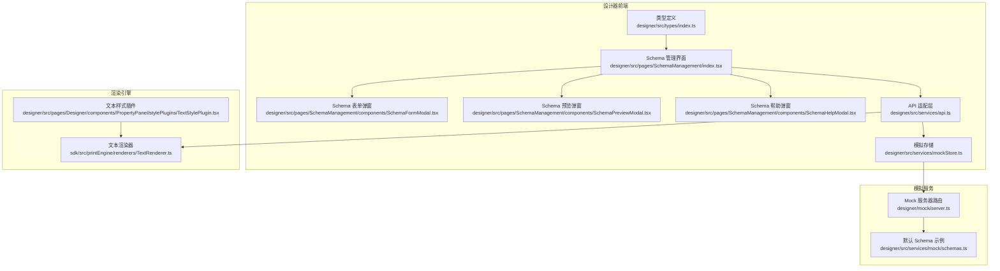
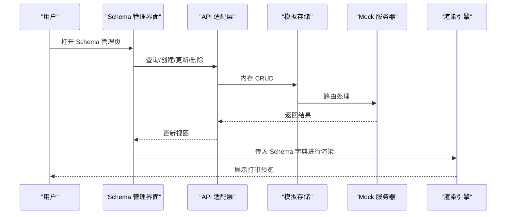
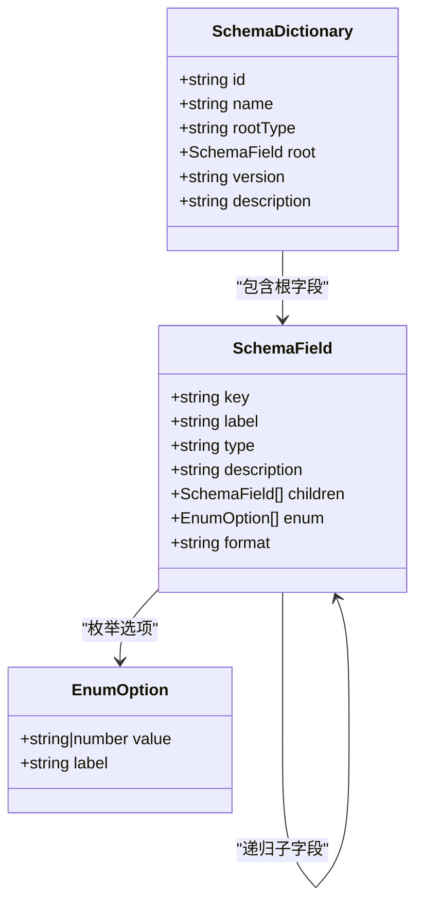
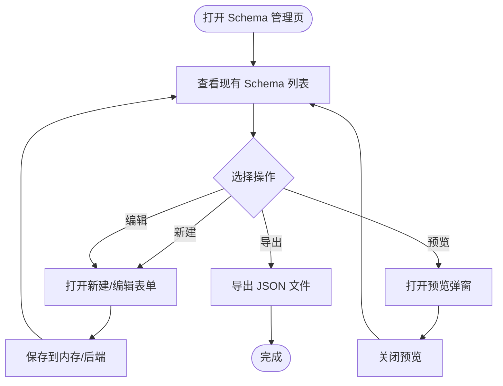
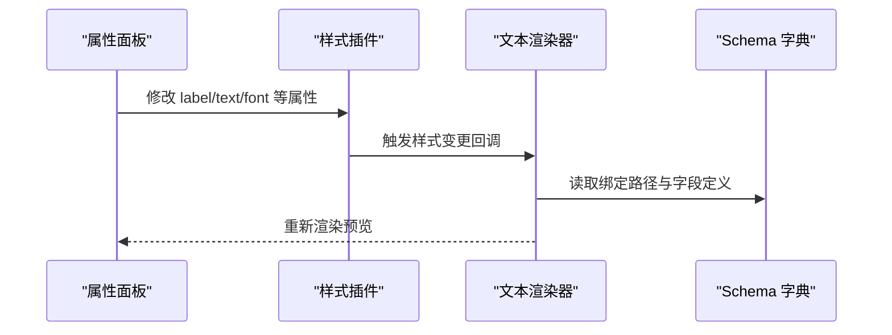
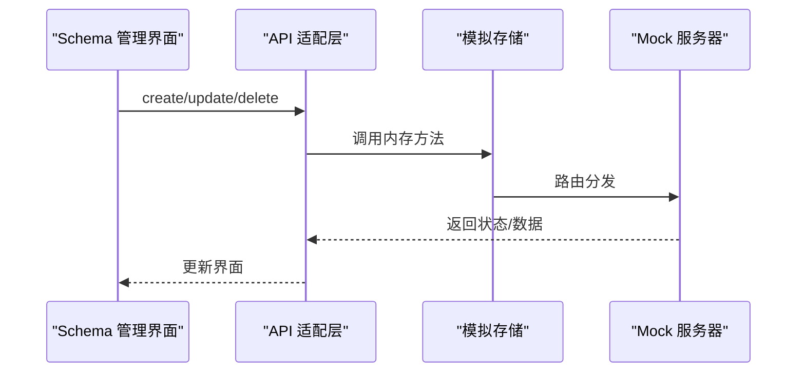
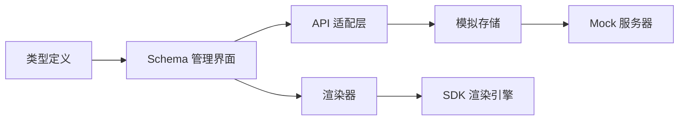

# Schema 定义规范

<cite>
**本文引用的文件**
- [designer/src/types/index.ts](file://designer/src/types/index.ts)
- [designer/src/pages/SchemaManagement/index.tsx](file://designer/src/pages/SchemaManagement/index.tsx)
- [designer/src/pages/SchemaManagement/components/SchemaFormModal.tsx](file://designer/src/pages/SchemaManagement/components/SchemaFormModal.tsx)
- [designer/src/pages/SchemaManagement/components/SchemaPreviewModal.tsx](file://designer/src/pages/SchemaManagement/components/SchemaPreviewModal.tsx)
- [designer/src/pages/SchemaManagement/components/SchemaHelpModal.tsx](file://designer/src/pages/SchemaManagement/components/SchemaHelpModal.tsx)
- [designer/src/services/mock/schemas.ts](file://designer/src/services/mock/schemas.ts)
- [designer/src/services/api.ts](file://designer/src/services/api.ts)
- [designer/mock/server.ts](file://designer/mock/server.ts)
- [designer/src/services/mockStore.ts](file://designer/src/services/mockStore.ts)
- [sdk/src/printEngine/renderers/TextRenderer.ts](file://sdk/src/printEngine/renderers/TextRenderer.ts)
- [designer/src/pages/Designer/components/PropertyPanel/stylePlugins/TextStylePlugin.tsx](file://designer/src/pages/Designer/components/PropertyPanel/stylePlugins/TextStylePlugin.tsx)
</cite>

## 目录
1. [引言](#引言)
2. [项目结构](#项目结构)
3. [核心组件](#核心组件)
4. [架构总览](#架构总览)
5. [详细组件分析](#详细组件分析)
6. [依赖关系分析](#依赖关系分析)
7. [性能考量](#性能考量)
8. [故障排查指南](#故障排查指南)
9. [结论](#结论)
10. [附录](#附录)

## 引言
本规范面向“打印设计器”项目中的 Schema 定义与使用，系统性阐述 Schema 字典的数据模型设计原则、字段类型体系、约束规则、嵌套结构、显示样式与标签配置，并结合实际代码路径给出可操作的设计模式与最佳实践。读者无需深入源码即可理解如何在设计器中构建与维护可复用的业务数据模型。

## 项目结构
围绕 Schema 的实现，主要涉及以下模块：
- 类型定义：统一的 Schema 字段与字典接口，确保前后端一致的数据契约
- 管理界面：Schema 列表、新增/编辑、预览、导入导出、帮助说明
- 模拟服务：本地内存存储与 HTTP 接口，支撑前端开发与演示
- 渲染引擎：在打印渲染阶段消费 Schema 绑定的数据与样式

**图表来源**
- [designer/src/types/index.ts:1-52](file://designer/src/types/index.ts#L1-L52)
- [designer/src/pages/SchemaManagement/index.tsx:1-550](file://designer/src/pages/SchemaManagement/index.tsx#L1-L550)
- [designer/src/pages/SchemaManagement/components/SchemaFormModal.tsx](file://designer/src/pages/SchemaManagement/components/SchemaFormModal.tsx)
- [designer/src/pages/SchemaManagement/components/SchemaPreviewModal.tsx:1-95](file://designer/src/pages/SchemaManagement/components/SchemaPreviewModal.tsx#L1-L95)
- [designer/src/pages/SchemaManagement/components/SchemaHelpModal.tsx](file://designer/src/pages/SchemaManagement/components/SchemaHelpModal.tsx)
- [designer/src/services/api.ts:83-133](file://designer/src/services/api.ts#L83-L133)
- [designer/mock/server.ts:82-123](file://designer/mock/server.ts#L82-L123)
- [designer/src/services/mockStore.ts:84-134](file://designer/src/services/mockStore.ts#L84-L134)
- [sdk/src/printEngine/renderers/TextRenderer.ts:1-34](file://sdk/src/printEngine/renderers/TextRenderer.ts#L1-L34)
- [designer/src/pages/Designer/components/PropertyPanel/stylePlugins/TextStylePlugin.tsx:1-85](file://designer/src/pages/Designer/components/PropertyPanel/stylePlugins/TextStylePlugin.tsx#L1-L85)

**章节来源**
- [designer/src/types/index.ts:1-52](file://designer/src/types/index.ts#L1-L52)
- [designer/src/pages/SchemaManagement/index.tsx:1-550](file://designer/src/pages/SchemaManagement/index.tsx#L1-L550)

## 核心组件
本节聚焦于 Schema 的数据模型与字段类型系统，以及在设计器中的呈现与使用。

- 字段类型体系
  - 支持类型：字符串、数字、布尔值、日期、日期时间、对象、数组
  - 用途：作为 Schema 字典根类型或字段类型的声明，决定渲染器与校验策略
  - 参考路径：[designer/src/types/index.ts:5-12](file://designer/src/types/index.ts#L5-L12)

- 字段定义 SchemaField
  - 关键字段：键名、显示名称、类型、描述、子字段、枚举、格式化类型
  - 子字段 children：用于 object/array 类型的递归嵌套
  - 枚举 enum：限定 string/number 的可选值集合
  - 格式化 format：date/datetime/money/percent 等展示形态
  - 参考路径：[designer/src/types/index.ts:18-33](file://designer/src/types/index.ts#L18-L33)

- 字典定义 SchemaDictionary
  - 关键字段：唯一标识、名称、根类型（object/array）、根字段、版本、描述
  - 作用：完整业务数据模型的载体，驱动模板渲染与数据绑定
  - 参考路径：[designer/src/types/index.ts:39-52](file://designer/src/types/index.ts#L39-L52)

- 字段约束与校验
  - 必填：通过字段是否可空体现（由上层业务约定）
  - 长度限制：可通过枚举或业务规则约束
  - 数值范围：通过枚举或业务规则约束
  - 格式验证：format 字段指示日期/金额/百分比等格式化显示
  - 参考路径：[designer/src/types/index.ts:29-32](file://designer/src/types/index.ts#L29-L32)

- 显示样式与标签
  - 标签 label：用于组件属性面板与渲染时的前缀显示
  - 样式 style：字体大小、字重、对齐、颜色等
  - 参考路径：[designer/src/pages/Designer/components/PropertyPanel/stylePlugins/TextStylePlugin.tsx:19-81](file://designer/src/pages/Designer/components/PropertyPanel/stylePlugins/TextStylePlugin.tsx#L19-L81)

**章节来源**
- [designer/src/types/index.ts:5-52](file://designer/src/types/index.ts#L5-L52)
- [designer/src/pages/Designer/components/PropertyPanel/stylePlugins/TextStylePlugin.tsx:19-81](file://designer/src/pages/Designer/components/PropertyPanel/stylePlugins/TextStylePlugin.tsx#L19-L81)

## 架构总览
Schema 在系统中的流转链路如下：
- 设计器前端通过 Schema 管理界面进行增删改查
- 使用 API 适配层对接本地内存或真实后端
- 渲染引擎根据 Schema 字典解析数据绑定与样式，生成最终打印内容

**图表来源**
- [designer/src/pages/SchemaManagement/index.tsx:1-550](file://designer/src/pages/SchemaManagement/index.tsx#L1-L550)
- [designer/src/services/api.ts:83-133](file://designer/src/services/api.ts#L83-L133)
- [designer/src/services/mockStore.ts:84-134](file://designer/src/services/mockStore.ts#L84-L134)
- [designer/mock/server.ts:82-123](file://designer/mock/server.ts#L82-L123)
- [sdk/src/printEngine/renderers/TextRenderer.ts:1-34](file://sdk/src/printEngine/renderers/TextRenderer.ts#L1-L34)

## 详细组件分析

### 组件一：Schema 字典与字段类型系统
- 设计原则
  - 单一职责：SchemaDictionary 描述完整数据模型；SchemaField 描述单个字段
  - 可扩展性：children 支持任意层级嵌套；enum 支持枚举约束
  - 可渲染性：format 与 children 共同决定渲染器选择与展示逻辑
- 复杂度与性能
  - 递归遍历：渲染器需深度优先遍历 children，注意避免重复渲染与死循环
  - 枚举匹配：format 与 enum 用于快速分支，提升渲染效率
- 错误处理
  - 缺失字段：校验 rootType 与 root 是否存在
  - 类型不匹配：校验 type 与 children 的一致性
- 最佳实践
  - 为每个字段提供 label 与 description，便于属性面板与帮助文档
  - 使用 enum 限定可选值，减少渲染歧义
  - 对日期/金额使用 format，保持展示一致性

**图表来源**
- [designer/src/types/index.ts:18-52](file://designer/src/types/index.ts#L18-L52)

**章节来源**
- [designer/src/types/index.ts:5-52](file://designer/src/types/index.ts#L5-L52)

### 组件二：Schema 管理界面与工作流
- 功能概览
  - 列表展示：名称、版本、ID、描述
  - 新增/编辑：SchemaFormModal 提供字段级配置
  - 预览：SchemaPreviewModal 展示 JSON 原文
  - 帮助：SchemaHelpModal 提供使用说明
  - 导入导出：支持 JSON 文件导入与导出
- 用户流程

**图表来源**
- [designer/src/pages/SchemaManagement/index.tsx:1-550](file://designer/src/pages/SchemaManagement/index.tsx#L1-L550)
- [designer/src/pages/SchemaManagement/components/SchemaFormModal.tsx](file://designer/src/pages/SchemaManagement/components/SchemaFormModal.tsx)
- [designer/src/pages/SchemaManagement/components/SchemaPreviewModal.tsx:1-95](file://designer/src/pages/SchemaManagement/components/SchemaPreviewModal.tsx#L1-L95)
- [designer/src/pages/SchemaManagement/components/SchemaHelpModal.tsx](file://designer/src/pages/SchemaManagement/components/SchemaHelpModal.tsx)

**章节来源**
- [designer/src/pages/SchemaManagement/index.tsx:1-550](file://designer/src/pages/SchemaManagement/index.tsx#L1-L550)

### 组件三：渲染引擎中的 Schema 使用
- 文本渲染器
  - 解析绑定值与 props.label，拼接显示文本
  - 应用布局与样式（位置、对齐、字号、颜色等）
- 样式插件
  - 提供 label、text、fontSize、fontWeight、textAlign、color 等属性面板项
  - 与渲染器联动，实时预览效果

**图表来源**
- [sdk/src/printEngine/renderers/TextRenderer.ts:13-34](file://sdk/src/printEngine/renderers/TextRenderer.ts#L13-L34)
- [designer/src/pages/Designer/components/PropertyPanel/stylePlugins/TextStylePlugin.tsx:19-81](file://designer/src/pages/Designer/components/PropertyPanel/stylePlugins/TextStylePlugin.tsx#L19-L81)

**章节来源**
- [sdk/src/printEngine/renderers/TextRenderer.ts:1-34](file://sdk/src/printEngine/renderers/TextRenderer.ts#L1-L34)
- [designer/src/pages/Designer/components/PropertyPanel/stylePlugins/TextStylePlugin.tsx:19-81](file://designer/src/pages/Designer/components/PropertyPanel/stylePlugins/TextStylePlugin.tsx#L19-L81)

### 组件四：API 与存储
- API 适配层
  - 根据环境变量选择内存 Mock 或真实 HTTP
  - 提供 CRUD 方法：list/get/create/update/delete
- 模拟存储
  - 内存数组维护 Schema 列表
  - 支持按 ID 删除与更新
- Mock 服务器
  - 路由处理 GET/POST/PUT/DELETE
  - 与模拟存储交互

**图表来源**
- [designer/src/services/api.ts:83-133](file://designer/src/services/api.ts#L83-L133)
- [designer/src/services/mockStore.ts:84-134](file://designer/src/services/mockStore.ts#L84-L134)
- [designer/mock/server.ts:82-123](file://designer/mock/server.ts#L82-L123)

**章节来源**
- [designer/src/services/api.ts:83-133](file://designer/src/services/api.ts#L83-L133)
- [designer/src/services/mockStore.ts:84-134](file://designer/src/services/mockStore.ts#L84-L134)
- [designer/mock/server.ts:82-123](file://designer/mock/server.ts#L82-L123)

## 依赖关系分析
- 类型定义是所有模块的契约基础
- 管理界面依赖 API 适配层与弹窗组件
- 渲染引擎依赖 SDK 中的渲染器与样式工具
- 模拟服务与存储为前端开发提供离线能力

**图表来源**
- [designer/src/types/index.ts:1-52](file://designer/src/types/index.ts#L1-L52)
- [designer/src/pages/SchemaManagement/index.tsx:1-550](file://designer/src/pages/SchemaManagement/index.tsx#L1-L550)
- [designer/src/services/api.ts:83-133](file://designer/src/services/api.ts#L83-L133)
- [designer/src/services/mockStore.ts:84-134](file://designer/src/services/mockStore.ts#L84-L134)
- [designer/mock/server.ts:82-123](file://designer/mock/server.ts#L82-L123)
- [sdk/src/printEngine/renderers/TextRenderer.ts:1-34](file://sdk/src/printEngine/renderers/TextRenderer.ts#L1-L34)

**章节来源**
- [designer/src/types/index.ts:1-52](file://designer/src/types/index.ts#L1-L52)
- [designer/src/pages/SchemaManagement/index.tsx:1-550](file://designer/src/pages/SchemaManagement/index.tsx#L1-L550)

## 性能考量
- 渲染性能
  - 避免深层嵌套与大量节点同时重绘
  - 使用 format 与 enum 减少条件判断分支
- 数据访问
  - 合理缓存绑定路径解析结果
  - 控制 children 遍历次数
- 界面响应
  - 表单输入采用防抖与批量更新
  - 预览弹窗延迟加载大体积 JSON

## 故障排查指南
- 常见问题
  - 字段缺失：检查 rootType 与 root 是否存在
  - 类型不匹配：确认 type 与 children 的一致性
  - 绑定路径错误：核对 props.label 与 binding.path
- 排查步骤
  - 打开预览弹窗查看 JSON 原文
  - 检查 API 返回状态与模拟存储状态
  - 在属性面板调整样式并观察渲染变化
- 相关路径
  - 预览弹窗：[designer/src/pages/SchemaManagement/components/SchemaPreviewModal.tsx:1-95](file://designer/src/pages/SchemaManagement/components/SchemaPreviewModal.tsx#L1-L95)
  - API 适配层：[designer/src/services/api.ts:83-133](file://designer/src/services/api.ts#L83-L133)
  - 模拟存储：[designer/src/services/mockStore.ts:84-134](file://designer/src/services/mockStore.ts#L84-L134)
  - Mock 服务器：[designer/mock/server.ts:82-123](file://designer/mock/server.ts#L82-L123)

**章节来源**
- [designer/src/pages/SchemaManagement/components/SchemaPreviewModal.tsx:1-95](file://designer/src/pages/SchemaManagement/components/SchemaPreviewModal.tsx#L1-L95)
- [designer/src/services/api.ts:83-133](file://designer/src/services/api.ts#L83-L133)
- [designer/src/services/mockStore.ts:84-134](file://designer/src/services/mockStore.ts#L84-L134)
- [designer/mock/server.ts:82-123](file://designer/mock/server.ts#L82-L123)

## 结论
本规范以类型定义为核心，结合管理界面、API 与渲染引擎，形成从“定义—管理—渲染”的闭环。通过明确字段类型、约束与显示样式，配合枚举与格式化选项，能够高效支撑复杂业务场景下的数据模型设计与打印输出。

## 附录

### 字段类型与配置速查
- 类型：string、number、boolean、date、datetime、object、array
- 字段：key、label、type、description、children、enum、format
- 字典：id、name、rootType、root、version、description

**章节来源**
- [designer/src/types/index.ts:5-52](file://designer/src/types/index.ts#L5-L52)

### JSON 结构示例（路径指引）
- Schema 字典示例：[designer/src/services/mock/schemas.ts](file://designer/src/services/mock/schemas.ts)
- 预览弹窗 JSON 输出：[designer/src/pages/SchemaManagement/components/SchemaPreviewModal.tsx:84-85](file://designer/src/pages/SchemaManagement/components/SchemaPreviewModal.tsx#L84-L85)

### 最佳实践清单
- 为每个字段提供清晰的 label 与 description
- 使用 enum 限定可选值，减少渲染歧义
- 对日期/金额使用 format，统一展示风格
- 合理拆分子字段，避免单一对象过深嵌套
- 在属性面板提供 label、text、字体、对齐、颜色等直观配置项

**章节来源**
- [designer/src/pages/Designer/components/PropertyPanel/stylePlugins/TextStylePlugin.tsx:19-81](file://designer/src/pages/Designer/components/PropertyPanel/stylePlugins/TextStylePlugin.tsx#L19-L81)
- [designer/src/types/index.ts:29-32](file://designer/src/types/index.ts#L29-L32)