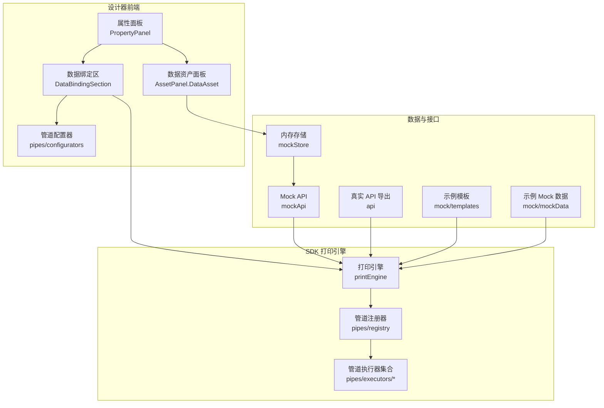
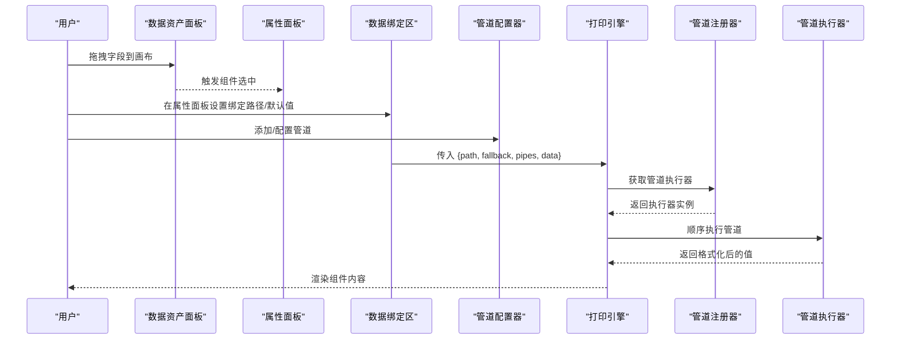
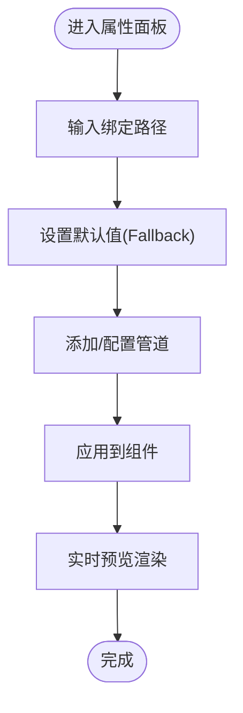
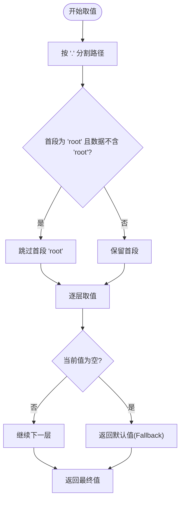
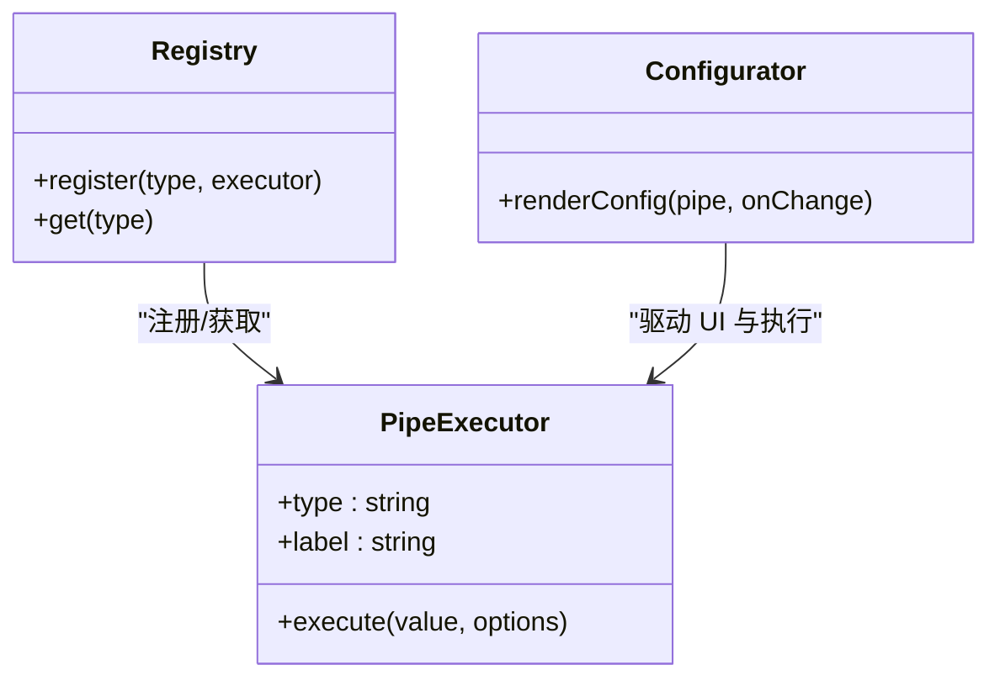
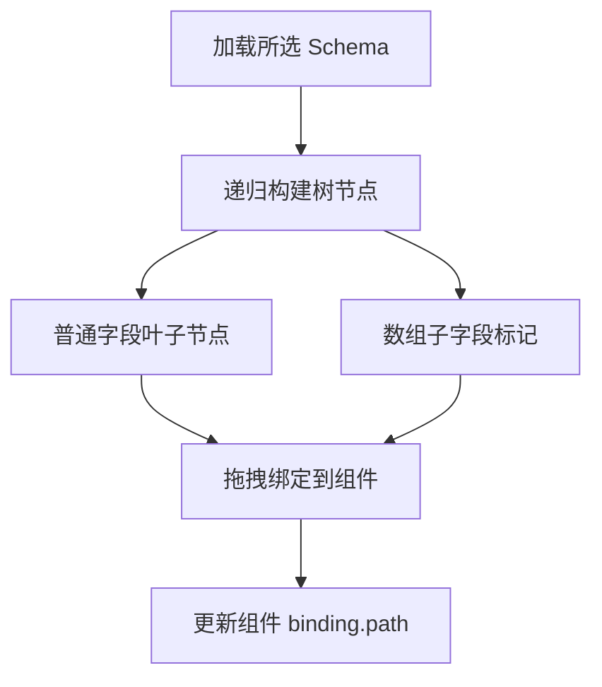
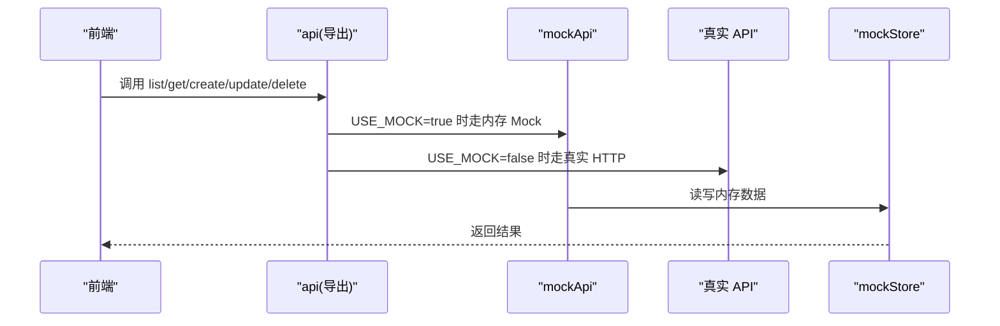
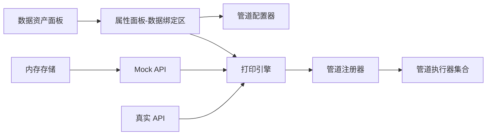

# Schema 数据绑定

<cite>
**本文引用的文件**
- [DataBindingSection.tsx](file://designer/src/pages/Designer/components/PropertyPanel/DataBindingSection.tsx)
- [index.tsx](file://designer/src/pages/Designer/components/PropertyPanel/index.tsx)
- [index.tsx](file://designer/src/pages/Designer/components/AssetPanel/DataAsset/index.tsx)
- [printEngine.ts](file://sdk/src/printEngine.ts)
- [registry.ts](file://sdk/src/pipes/registry.ts)
- [index.ts](file://sdk/src/pipes/executors/index.ts)
- [DatePipe.ts](file://sdk/src/pipes/executors/DatePipe.ts)
- [CurrencyPipe.ts](file://sdk/src/pipes/executors/CurrencyPipe.ts)
- [ChineseNumberPipe.ts](file://sdk/src/pipes/executors/ChineseNumberPipe.ts)
- [MoneyPipe.ts](file://sdk/src/pipes/executors/MoneyPipe.ts)
- [index.ts](file://designer/src/pipes/configurators/index.ts)
- [DatePipeConfigurator.tsx](file://designer/src/pipes/configurators/DatePipeConfigurator.tsx)
- [CurrencyPipeConfigurator.tsx](file://designer/src/pipes/configurators/CurrencyPipeConfigurator.tsx)
- [ChineseNumberPipeConfigurator.tsx](file://designer/src/pipes/configurators/ChineseNumberPipeConfigurator.tsx)
- [MoneyPipeConfigurator.tsx](file://designer/src/pipes/configurators/MoneyPipeConfigurator.tsx)
- [mockStore.ts](file://designer/src/services/mockStore.ts)
- [mockApi.ts](file://designer/src/services/mockApi.ts)
- [api.ts](file://designer/src/services/api.ts)
- [templates.ts](file://designer/src/services/mock/templates.ts)
- [mockData.ts](file://designer/src/services/mock/mockData.ts)
- [技术架构文档(仅参考).md](file://docs/技术架构文档(仅参考).md)
</cite>

## 目录
1. [引言](#引言)
2. [项目结构](#项目结构)
3. [核心组件](#核心组件)
4. [架构总览](#架构总览)
5. [详细组件分析](#详细组件分析)
6. [依赖分析](#依赖分析)
7. [性能考虑](#性能考虑)
8. [故障排查指南](#故障排查指南)
9. [结论](#结论)
10. [附录](#附录)

## 引言
本文件围绕 Schema 数据绑定机制进行系统性技术说明，涵盖绑定原理、数据流向、配置界面使用、动态/静态绑定差异、嵌套字段与路径表达式、优先级与覆盖规则、复杂结构绑定示例与最佳实践、调试方法与性能优化建议。目标是帮助设计师与开发者高效、稳定地完成打印模板的数据绑定工作。

## 项目结构
围绕数据绑定的关键模块分布如下：
- 设计器前端（PropertyPanel、AssetPanel、pipes/configurators）
- SDK 打印引擎（printEngine、pipes/registry、executors）
- Mock 与真实 API（mockStore、mockApi、api）

图表来源
- [index.tsx:120-151](file://designer/src/pages/Designer/components/PropertyPanel/index.tsx#L120-L151)
- [DataBindingSection.tsx:1-127](file://designer/src/pages/Designer/components/PropertyPanel/DataBindingSection.tsx#L1-L127)
- [index.tsx:48-172](file://designer/src/pages/Designer/components/AssetPanel/DataAsset/index.tsx#L48-L172)
- [printEngine.ts:82-134](file://sdk/src/printEngine.ts#L82-L134)
- [registry.ts](file://sdk/src/pipes/registry.ts)
- [index.ts](file://sdk/src/pipes/executors/index.ts)
- [mockStore.ts:1-134](file://designer/src/services/mockStore.ts#L1-L134)
- [mockApi.ts:1-102](file://designer/src/services/mockApi.ts#L1-L102)
- [api.ts:83-133](file://designer/src/services/api.ts#L83-L133)
- [templates.ts:706-753](file://designer/src/services/mock/templates.ts#L706-L753)
- [mockData.ts:1-34](file://designer/src/services/mock/mockData.ts#L1-L34)

章节来源
- [index.tsx:120-151](file://designer/src/pages/Designer/components/PropertyPanel/index.tsx#L120-L151)
- [DataBindingSection.tsx:1-127](file://designer/src/pages/Designer/components/PropertyPanel/DataBindingSection.tsx#L1-L127)
- [index.tsx:48-172](file://designer/src/pages/Designer/components/AssetPanel/DataAsset/index.tsx#L48-L172)
- [printEngine.ts:82-134](file://sdk/src/printEngine.ts#L82-L134)
- [mockStore.ts:1-134](file://designer/src/services/mockStore.ts#L1-L134)
- [mockApi.ts:1-102](file://designer/src/services/mockApi.ts#L1-L102)
- [api.ts:83-133](file://designer/src/services/api.ts#L83-L133)
- [templates.ts:706-753](file://designer/src/services/mock/templates.ts#L706-L753)
- [mockData.ts:1-34](file://designer/src/services/mock/mockData.ts#L1-L34)

## 核心组件
- 数据绑定配置区（PropertyPanel.DataBindingSection）
  - 提供绑定路径输入、默认值（Fallback）、管道（Pipes）添加/移除/配置。
  - 支持从数据资产面板拖拽字段直接填充绑定路径。
- 打印引擎（SDK.printEngine）
  - 负责根据绑定路径从数据源安全取值、应用管道链、处理默认值。
  - 支持智能跳过顶层 root 前缀（当数据不含 root 时）。
- 管道系统（SDK.registry + executors + designer/configurators）
  - 插件化注册器 + 执行器 + 配置器三段式设计，便于扩展新管道。
- 数据资产面板（AssetPanel.DataAsset）
  - 将 Schema 字段树转换为可拖拽的 UI，辅助构建绑定路径。
- Mock 与真实 API（mockStore、mockApi、api）
  - 提供 Schema/模板/Mock 数据的 CRUD，支持开发态与生产态切换。

章节来源
- [DataBindingSection.tsx:1-127](file://designer/src/pages/Designer/components/PropertyPanel/DataBindingSection.tsx#L1-L127)
- [index.tsx:120-151](file://designer/src/pages/Designer/components/PropertyPanel/index.tsx#L120-L151)
- [index.tsx:48-172](file://designer/src/pages/Designer/components/AssetPanel/DataAsset/index.tsx#L48-L172)
- [printEngine.ts:82-134](file://sdk/src/printEngine.ts#L82-L134)
- [registry.ts](file://sdk/src/pipes/registry.ts)
- [index.ts](file://sdk/src/pipes/executors/index.ts)
- [mockStore.ts:1-134](file://designer/src/services/mockStore.ts#L1-L134)
- [mockApi.ts:1-102](file://designer/src/services/mockApi.ts#L1-L102)
- [api.ts:83-133](file://designer/src/services/api.ts#L83-L133)

## 架构总览
数据绑定从“设计期”到“运行时”的整体流程如下：

图表来源
- [index.tsx:48-172](file://designer/src/pages/Designer/components/AssetPanel/DataAsset/index.tsx#L48-L172)
- [DataBindingSection.tsx:1-127](file://designer/src/pages/Designer/components/PropertyPanel/DataBindingSection.tsx#L1-L127)
- [printEngine.ts:82-134](file://sdk/src/printEngine.ts#L82-L134)
- [registry.ts](file://sdk/src/pipes/registry.ts)
- [index.ts](file://sdk/src/pipes/executors/index.ts)

## 详细组件分析

### 数据绑定配置区（PropertyPanel.DataBindingSection）
- 功能要点
  - 绑定路径输入：支持点号路径与数组索引，如 “a.b”、“items.0.title”。
  - 默认值（Fallback）：当取值为空/未定义时回退显示。
  - 管道（Pipes）：按顺序执行，支持添加/删除与选项配置。
- 交互流程
  - 用户在属性面板修改 path/fallback/pipes，触发上层回调更新组件绑定配置。
  - 管道配置器负责渲染具体配置 UI 并回传选项变更。

图表来源
- [DataBindingSection.tsx:45-127](file://designer/src/pages/Designer/components/PropertyPanel/DataBindingSection.tsx#L45-L127)

章节来源
- [DataBindingSection.tsx:1-127](file://designer/src/pages/Designer/components/PropertyPanel/DataBindingSection.tsx#L1-L127)
- [index.tsx:120-151](file://designer/src/pages/Designer/components/PropertyPanel/index.tsx#L120-L151)

### 打印引擎（SDK.printEngine）
- 路径解析与取值
  - 支持点号路径与数组索引，逐层安全取值；遇到 null/undefined 即返回默认值。
  - 智能跳过顶层 root：若数据对象不含 root 属性，则自动忽略路径中的 root 前缀。
- 管道应用
  - 按顺序执行管道链，前一输出作为后一输入。
  - 执行器通过注册器统一调度，确保扩展性与一致性。
- 默认值处理
  - 若最终值为 null/undefined，返回 fallback；若无 fallback 则返回空字符串。

图表来源
- [printEngine.ts:82-134](file://sdk/src/printEngine.ts#L82-L134)

章节来源
- [printEngine.ts:82-134](file://sdk/src/printEngine.ts#L82-L134)

### 管道系统（注册器 + 执行器 + 配置器）
- 注册器（SDK.registry）
  - 统一注册与获取管道执行器，保证类型安全与可扩展。
- 执行器（SDK.pipes/executors）
  - 已内置多种执行器（日期、货币、中文大写、金额），可按需扩展。
- 配置器（designer/pipes/configurators）
  - 为每个管道类型提供可视化配置 UI，并将配置回传给绑定区。

图表来源
- [registry.ts](file://sdk/src/pipes/registry.ts)
- [index.ts](file://sdk/src/pipes/executors/index.ts)
- [index.ts](file://designer/src/pipes/configurators/index.ts)

章节来源
- [registry.ts](file://sdk/src/pipes/registry.ts)
- [index.ts](file://sdk/src/pipes/executors/index.ts)
- [index.ts](file://designer/src/pipes/configurators/index.ts)
- [DatePipeConfigurator.tsx](file://designer/src/pipes/configurators/DatePipeConfigurator.tsx)
- [CurrencyPipeConfigurator.tsx](file://designer/src/pipes/configurators/CurrencyPipeConfigurator.tsx)
- [ChineseNumberPipeConfigurator.tsx](file://designer/src/pipes/configurators/ChineseNumberPipeConfigurator.tsx)
- [MoneyPipeConfigurator.tsx](file://designer/src/pipes/configurators/MoneyPipeConfigurator.tsx)

### 数据资产面板（AssetPanel.DataAsset）
- 将 Schema 字段树转换为带图标的树形结构，支持拖拽绑定。
- 能识别数组子字段路径，辅助用户正确填写绑定路径。
- 提供字段类型图标与标签，提升可读性与易用性。

图表来源
- [index.tsx:48-172](file://designer/src/pages/Designer/components/AssetPanel/DataAsset/index.tsx#L48-L172)

章节来源
- [index.tsx:48-172](file://designer/src/pages/Designer/components/AssetPanel/DataAsset/index.tsx#L48-L172)

### 数据与接口（Mock 与真实 API）
- 内存存储（mockStore）
  - 维护 Schema/模板/Mock 数据的内存副本，支持 CRUD 与筛选。
- Mock API（mockApi）
  - 对外暴露 list/get/create/update/delete 接口，模拟网络延迟与错误。
- 真实 API（api）
  - 根据环境变量导出对应实现（USE_MOCK 控制），统一调用入口。

图表来源
- [mockStore.ts:1-134](file://designer/src/services/mockStore.ts#L1-L134)
- [mockApi.ts:1-102](file://designer/src/services/mockApi.ts#L1-L102)
- [api.ts:83-133](file://designer/src/services/api.ts#L83-L133)

章节来源
- [mockStore.ts:1-134](file://designer/src/services/mockStore.ts#L1-L134)
- [mockApi.ts:1-102](file://designer/src/services/mockApi.ts#L1-L102)
- [api.ts:83-133](file://designer/src/services/api.ts#L83-L133)

## 依赖分析
- 组件耦合
  - 属性面板依赖管道配置器与打印引擎；数据资产面板依赖 Schema 数据与组件选中状态。
  - 打印引擎依赖管道注册器与执行器，形成稳定的插件化扩展点。
- 外部依赖
  - 管道系统通过注册器解耦执行器与配置器，便于新增/替换管道。
  - 数据接口通过 api.ts 统一导出，支持开发态与生产态无缝切换。

图表来源
- [DataBindingSection.tsx:1-127](file://designer/src/pages/Designer/components/PropertyPanel/DataBindingSection.tsx#L1-L127)
- [index.tsx:48-172](file://designer/src/pages/Designer/components/AssetPanel/DataAsset/index.tsx#L48-L172)
- [printEngine.ts:82-134](file://sdk/src/printEngine.ts#L82-L134)
- [registry.ts](file://sdk/src/pipes/registry.ts)
- [index.ts](file://sdk/src/pipes/executors/index.ts)
- [mockStore.ts:1-134](file://designer/src/services/mockStore.ts#L1-L134)
- [mockApi.ts:1-102](file://designer/src/services/mockApi.ts#L1-L102)
- [api.ts:83-133](file://designer/src/services/api.ts#L83-L133)

章节来源
- [DataBindingSection.tsx:1-127](file://designer/src/pages/Designer/components/PropertyPanel/DataBindingSection.tsx#L1-L127)
- [index.tsx:48-172](file://designer/src/pages/Designer/components/AssetPanel/DataAsset/index.tsx#L48-L172)
- [printEngine.ts:82-134](file://sdk/src/printEngine.ts#L82-L134)
- [registry.ts](file://sdk/src/pipes/registry.ts)
- [index.ts](file://sdk/src/pipes/executors/index.ts)
- [mockStore.ts:1-134](file://designer/src/services/mockStore.ts#L1-L134)
- [mockApi.ts:1-102](file://designer/src/services/mockApi.ts#L1-L102)
- [api.ts:83-133](file://designer/src/services/api.ts#L83-L133)

## 性能考虑
- 路径解析
  - 逐层安全取值与短路返回，避免深层遍历带来的开销；建议路径尽量精简，减少不必要的层级。
- 管道链
  - 管道按序执行，应控制数量与复杂度；对高频字段可缓存中间结果（如日期格式化）。
- 数据源
  - 使用 Mock 数据进行开发时，建议分页/分批加载，避免一次性渲染大量组件。
- 渲染
  - 组件更新采用局部刷新策略，避免整页重绘；长列表场景建议虚拟化与懒加载。

## 故障排查指南
- 绑定路径无效
  - 检查路径是否与 Schema 字段一致；注意数组索引与对象键名。
  - 若数据不含 root 层，路径中无需以 root 开头。
- 默认值未生效
  - 确认 fallback 设置；检查取值链路中是否存在非空值覆盖。
- 管道不生效
  - 确认管道类型与配置项正确；查看配置器渲染是否正常。
- 数据为空或报错
  - 使用 Mock API 进行隔离验证；检查内存存储状态与接口返回。
- 预览不更新
  - 确保属性面板变更已触发组件更新；检查组件类型是否支持数据绑定。

章节来源
- [printEngine.ts:82-134](file://sdk/src/printEngine.ts#L82-L134)
- [DataBindingSection.tsx:1-127](file://designer/src/pages/Designer/components/PropertyPanel/DataBindingSection.tsx#L1-L127)
- [mockApi.ts:1-102](file://designer/src/services/mockApi.ts#L1-L102)
- [api.ts:83-133](file://designer/src/services/api.ts#L83-L133)

## 结论
本项目通过“设计期绑定 + 运行时渲染”的双阶段机制，结合插件化管道系统与 Mock/真实 API 的灵活切换，实现了高可用、可扩展的 Schema 数据绑定方案。遵循本文提供的路径表达式规范、优先级与覆盖规则、调试与性能建议，可在复杂业务场景中稳定落地。

## 附录

### 数据绑定配置界面使用说明
- 绑定路径
  - 支持点号路径与数组索引，如 “a.b”、“items.0.title”。可从数据资产面板拖拽字段快速填充。
- 默认值（Fallback）
  - 当取值为空/未定义时显示的占位文本。
- 管道（Pipes）
  - 通过下拉选择添加管道，点击配置器渲染的表单项调整参数；支持多管道串联。

章节来源
- [DataBindingSection.tsx:45-127](file://designer/src/pages/Designer/components/PropertyPanel/DataBindingSection.tsx#L45-L127)

### 动态数据绑定 vs 静态数据绑定
- 动态绑定
  - 通过绑定路径与管道链从数据源动态取值，适合报表、标签等需要随数据变化而变化的场景。
- 静态绑定
  - 固定文本或图片资源，不依赖数据源；适合 Logo、固定说明等场景。
- 选择建议
  - 优先使用动态绑定；对不变元素使用静态绑定以简化渲染。

### 嵌套字段绑定与路径表达式
- 路径语法
  - 支持 “a.b”、“a.0.c” 等；数组索引从 0 开始。
  - 智能跳过顶层 root：当数据对象不含 root 属性时，路径可省略 root 前缀。
- 数组子字段
  - 数据资产面板可识别数组子字段，辅助正确填写路径。

章节来源
- [printEngine.ts:82-134](file://sdk/src/printEngine.ts#L82-L134)
- [index.tsx:133-164](file://designer/src/pages/Designer/components/AssetPanel/DataAsset/index.tsx#L133-L164)

### 数据绑定优先级与覆盖规则
- 取值优先级
  - 按路径逐层取值，遇空即返回默认值；最终值为空则使用 fallback。
- 管道优先级
  - 按数组顺序依次执行，前一输出作为后一输入。
- 覆盖规则
  - 属性面板的 path/fallback/pipes 更新会立即覆盖旧配置，确保预览与渲染一致。

章节来源
- [printEngine.ts:82-134](file://sdk/src/printEngine.ts#L82-L134)
- [DataBindingSection.tsx:1-127](file://designer/src/pages/Designer/components/PropertyPanel/DataBindingSection.tsx#L1-L127)

### 复杂数据结构绑定示例与最佳实践
- 示例来源
  - 模板示例中包含日期格式化、嵌套对象访问等典型场景。
- 最佳实践
  - 合理拆分 Schema 字段，避免过深嵌套；
  - 对高频格式化（如日期、货币）使用管道复用；
  - 使用 Mock 数据进行端到端验证，逐步替换为真实数据源。

章节来源
- [templates.ts:706-753](file://designer/src/services/mock/templates.ts#L706-L753)
- [mockData.ts:1-34](file://designer/src/services/mock/mockData.ts#L1-L34)

### 调试方法与常见问题
- 调试步骤
  - 在属性面板确认 path/fallback/pipes；
  - 使用 Mock API 查看数据源与接口响应；
  - 检查打印引擎取值链路与管道执行顺序。
- 常见问题
  - 路径拼写错误、数组索引越界、管道参数缺失、默认值未设置导致空白显示。

章节来源
- [DataBindingSection.tsx:1-127](file://designer/src/pages/Designer/components/PropertyPanel/DataBindingSection.tsx#L1-L127)
- [mockApi.ts:1-102](file://designer/src/services/mockApi.ts#L1-L102)
- [api.ts:83-133](file://designer/src/services/api.ts#L83-L133)

### 管道系统扩展指南
- 新增管道三步法
  - 创建执行器（实现类型与执行逻辑）；
  - 创建配置器（渲染配置 UI 并回传选项）；
  - 在注册器中注册执行器。
- 内置执行器参考
  - 日期、货币、中文大写、金额等执行器可作为扩展参考。

章节来源
- [registry.ts](file://sdk/src/pipes/registry.ts)
- [index.ts](file://sdk/src/pipes/executors/index.ts)
- [DatePipe.ts](file://sdk/src/pipes/executors/DatePipe.ts)
- [CurrencyPipe.ts](file://sdk/src/pipes/executors/CurrencyPipe.ts)
- [ChineseNumberPipe.ts](file://sdk/src/pipes/executors/ChineseNumberPipe.ts)
- [MoneyPipe.ts](file://sdk/src/pipes/executors/MoneyPipe.ts)
- [技术架构文档(仅参考).md](file://docs/技术架构文档(仅参考).md#L83-L124)