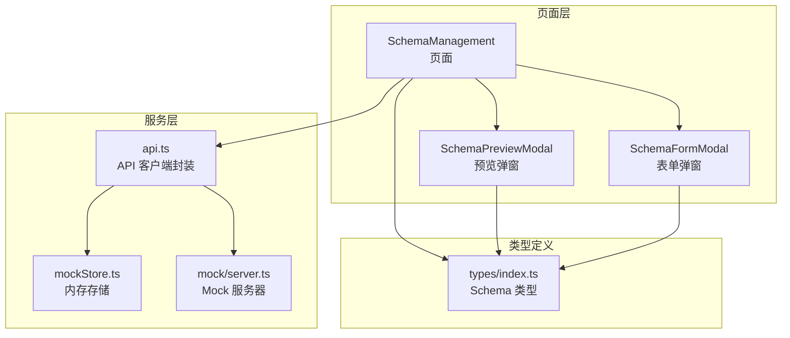
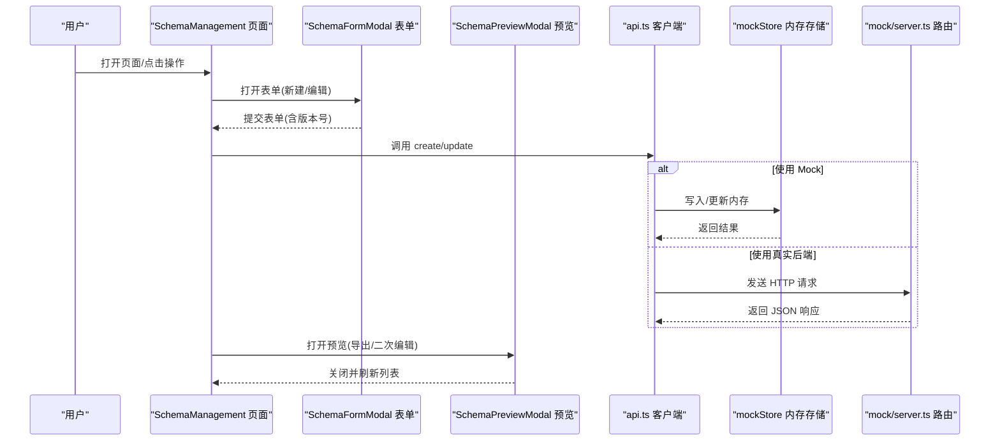
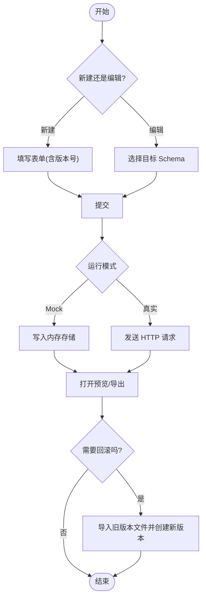
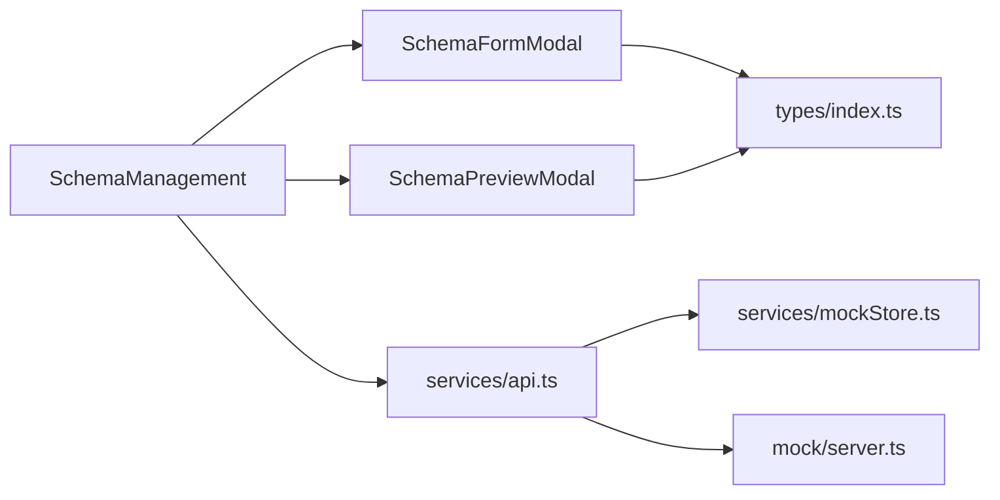

# Schema 版本管理

<cite>
**本文引用的文件**
- [designer/src/pages/SchemaManagement/index.tsx](file://designer/src/pages/SchemaManagement/index.tsx)
- [designer/src/pages/SchemaManagement/components/SchemaFormModal.tsx](file://designer/src/pages/SchemaManagement/components/SchemaFormModal.tsx)
- [designer/src/pages/SchemaManagement/components/SchemaPreviewModal.tsx](file://designer/src/pages/SchemaManagement/components/SchemaPreviewModal.tsx)
- [designer/src/services/api.ts](file://designer/src/services/api.ts)
- [designer/src/services/mock/schemas.ts](file://designer/src/services/mock/schemas.ts)
- [designer/src/services/mockStore.ts](file://designer/src/services/mockStore.ts)
- [designer/mock/server.ts](file://designer/mock/server.ts)
- [designer/src/types/index.ts](file://designer/src/types/index.ts)
</cite>

## 目录
1. [简介](#简介)
2. [项目结构](#项目结构)
3. [核心组件](#核心组件)
4. [架构总览](#架构总览)
5. [详细组件分析](#详细组件分析)
6. [依赖关系分析](#依赖关系分析)
7. [性能考量](#性能考量)
8. [故障排查指南](#故障排查指南)
9. [结论](#结论)
10. [附录](#附录)

## 简介
本指南围绕设计器中的“Schema 管理”能力，系统化阐述 Schema 版本控制的设计理念、版本号规则、创建/更新/回滚流程、兼容性与冲突处理、版本历史与比较、发布与部署最佳实践、向后兼容与破坏性变更处理、版本锁定与并发编辑冲突解决、版本迁移脚本编写与执行，以及版本管理工具与自动化流程配置建议。  
本项目通过前端 Mock 与真实 API 的双模态实现，既可本地开发调试，也可对接后端服务；在 Schema 管理页面中提供了新建、编辑、预览、导入导出等能力，并通过 Mock Store 与 Mock Server 提供了完整的 CRUD 能力。

## 项目结构
Schema 版本管理相关的核心位置集中在设计器模块中，主要由以下几部分组成：
- 页面层：Schema 管理页面负责展示、操作 Schema 列表与详情
- 组件层：Schema 表单弹窗、预览弹窗、帮助弹窗等
- 服务层：API 客户端封装与 Mock 实现切换
- 数据层：Mock Store 与 Mock Server 提供内存存储与路由处理

图表来源
- [designer/src/pages/SchemaManagement/index.tsx:1-550](file://designer/src/pages/SchemaManagement/index.tsx#L1-L550)
- [designer/src/pages/SchemaManagement/components/SchemaPreviewModal.tsx](file://designer/src/pages/SchemaManagement/components/SchemaPreviewModal.tsx)
- [designer/src/pages/SchemaManagement/components/SchemaFormModal.tsx](file://designer/src/pages/SchemaManagement/components/SchemaFormModal.tsx)
- [designer/src/services/api.ts:1-133](file://designer/src/services/api.ts#L1-L133)
- [designer/src/services/mockStore.ts:1-134](file://designer/src/services/mockStore.ts#L1-L134)
- [designer/mock/server.ts:82-123](file://designer/mock/server.ts#L82-L123)
- [designer/src/types/index.ts](file://designer/src/types/index.ts)

章节来源
- [designer/src/pages/SchemaManagement/index.tsx:1-550](file://designer/src/pages/SchemaManagement/index.tsx#L1-L550)
- [designer/src/services/api.ts:1-133](file://designer/src/services/api.ts#L1-L133)
- [designer/src/services/mockStore.ts:1-134](file://designer/src/services/mockStore.ts#L1-L134)
- [designer/mock/server.ts:82-123](file://designer/mock/server.ts#L82-L123)
- [designer/src/types/index.ts](file://designer/src/types/index.ts)

## 核心组件
- Schema 管理页面：提供列表展示、新增、编辑、删除、预览、导入导出、帮助等操作入口
- Schema 预览弹窗：以可视化方式呈现当前 Schema 结构，支持导出与二次编辑
- Schema 表单弹窗：用于创建或修改 Schema 字典，包含版本号字段
- API 客户端：根据环境变量选择 Mock 或真实后端，统一暴露 CRUD 方法
- Mock Store：内存中的增删改查实现，便于本地开发与联调
- Mock Server：基于 Node 原生 HTTP 的简单路由，处理 Schema 相关请求

章节来源
- [designer/src/pages/SchemaManagement/index.tsx:1-550](file://designer/src/pages/SchemaManagement/index.tsx#L1-L550)
- [designer/src/pages/SchemaManagement/components/SchemaPreviewModal.tsx](file://designer/src/pages/SchemaManagement/components/SchemaPreviewModal.tsx)
- [designer/src/pages/SchemaManagement/components/SchemaFormModal.tsx](file://designer/src/pages/SchemaManagement/components/SchemaFormModal.tsx)
- [designer/src/services/api.ts:1-133](file://designer/src/services/api.ts#L1-L133)
- [designer/src/services/mockStore.ts:1-134](file://designer/src/services/mockStore.ts#L1-L134)
- [designer/mock/server.ts:82-123](file://designer/mock/server.ts#L82-L123)

## 架构总览
下图展示了从页面到服务再到存储的整体交互路径，以及 Mock 与真实后端的切换机制。

图表来源
- [designer/src/pages/SchemaManagement/index.tsx:1-550](file://designer/src/pages/SchemaManagement/index.tsx#L1-L550)
- [designer/src/services/api.ts:1-133](file://designer/src/services/api.ts#L1-L133)
- [designer/src/services/mockStore.ts:1-134](file://designer/src/services/mockStore.ts#L1-L134)
- [designer/mock/server.ts:82-123](file://designer/mock/server.ts#L82-L123)

## 详细组件分析

### 设计理念与版本号规则
- 设计理念
  - 以“字典+树形结构”的 Schema 模型为核心，支持多字段类型与枚举值定义，便于打印模板的数据绑定与渲染
  - 版本号作为 Schema 的唯一标识之一，配合 ID 实现版本演进与回溯
  - 通过预览与导出能力，确保 Schema 变更可被验证与归档
- 版本号规则
  - 版本号采用语义化版本格式，例如主版本.次版本.修订号
  - 同一 Schema 的不同版本应具备清晰的演进关系，避免跨主版本的破坏性变更
  - 建议在版本号中体现“兼容性级别”，如 v1.x.y 保持向后兼容，v2.x.y 允许破坏性变更

章节来源
- [designer/src/services/mock/schemas.ts:1-36](file://designer/src/services/mock/schemas.ts#L1-L36)

### 版本创建、更新与回滚流程
- 创建流程
  - 在表单弹窗中填写 Schema 基本信息与字段定义，设置初始版本号
  - 提交后通过 API 客户端写入存储，Mock 模式下写入内存，真实模式下发送 HTTP 请求
- 更新流程
  - 选择现有 Schema 进行编辑，调整字段或版本号
  - 提交后触发更新逻辑，区分是否为新版本（版本号变化）或同一版本内修改
- 回滚流程
  - 若需回滚至旧版本，可在预览弹窗中导出目标版本的 Schema 文件
  - 重新导入该文件并创建新版本，或在后端支持的情况下直接切换版本标记

图表来源
- [designer/src/pages/SchemaManagement/components/SchemaFormModal.tsx](file://designer/src/pages/SchemaManagement/components/SchemaFormModal.tsx)
- [designer/src/services/api.ts:1-133](file://designer/src/services/api.ts#L1-L133)
- [designer/src/services/mockStore.ts:1-134](file://designer/src/services/mockStore.ts#L1-L134)
- [designer/mock/server.ts:82-123](file://designer/mock/server.ts#L82-L123)
- [designer/src/pages/SchemaManagement/components/SchemaPreviewModal.tsx](file://designer/src/pages/SchemaManagement/components/SchemaPreviewModal.tsx)

章节来源
- [designer/src/pages/SchemaManagement/components/SchemaFormModal.tsx](file://designer/src/pages/SchemaManagement/components/SchemaFormModal.tsx)
- [designer/src/services/api.ts:1-133](file://designer/src/services/api.ts#L1-L133)
- [designer/src/services/mockStore.ts:1-134](file://designer/src/services/mockStore.ts#L1-L134)
- [designer/mock/server.ts:82-123](file://designer/mock/server.ts#L82-L123)
- [designer/src/pages/SchemaManagement/components/SchemaPreviewModal.tsx](file://designer/src/pages/SchemaManagement/components/SchemaPreviewModal.tsx)

### 版本间兼容性检查与冲突处理
- 兼容性检查
  - 新增字段：允许向后兼容，但需提供默认值或可选属性
  - 删除字段：禁止破坏性变更；若确需删除，应引入新版本并在模板中迁移
  - 修改字段类型：禁止破坏性变更；如必须变更，应引入新字段并保留旧字段一段时间
  - 枚举值变更：新增枚举项允许；删除或重命名需引入新版本
- 冲突处理
  - 当多个用户同时编辑同一 Schema 时，采用“最后写入获胜”或“合并策略”
  - 建议在表单中增加“版本锁定”提示，防止多人并发覆盖

章节来源
- [designer/src/pages/SchemaManagement/components/SchemaFormModal.tsx](file://designer/src/pages/SchemaManagement/components/SchemaFormModal.tsx)
- [designer/src/services/mockStore.ts:1-134](file://designer/src/services/mockStore.ts#L1-L134)

### 版本历史记录与比较
- 历史记录
  - 通过预览弹窗导出不同版本的 Schema 文件，形成版本快照
  - 在数据库或文件系统中保存历史版本，便于审计与回溯
- 比较功能
  - 对比两个版本的字段差异（新增、删除、修改）
  - 生成变更报告，标注破坏性变更与兼容性风险

章节来源
- [designer/src/pages/SchemaManagement/components/SchemaPreviewModal.tsx](file://designer/src/pages/SchemaManagement/components/SchemaPreviewModal.tsx)

### 发布与部署最佳实践
- 发布前
  - 完成兼容性评审与回归测试
  - 生成版本变更日志与迁移指南
- 发布中
  - 采用蓝绿部署或灰度发布，降低回滚成本
  - 为破坏性变更预留过渡期，提供模板迁移脚本
- 发布后
  - 监控模板渲染异常与数据绑定错误
  - 收集用户反馈并及时修复

章节来源
- [designer/src/services/api.ts:1-133](file://designer/src/services/api.ts#L1-L133)

### 向后兼容性维护与破坏性变更处理
- 维护策略
  - 严格遵循语义化版本规则，主版本用于破坏性变更
  - 为旧版本提供长期支持窗口，逐步引导用户升级
- 处理方法
  - 破坏性变更通过新版本发布，旧版本继续可用
  - 提供自动迁移工具与人工校验流程

章节来源
- [designer/src/services/mock/schemas.ts:1-36](file://designer/src/services/mock/schemas.ts#L1-L36)

### 版本锁定与并发编辑冲突解决
- 版本锁定
  - 编辑时对目标 Schema 加锁，防止他人同时修改
  - 锁定期间显示占用者与剩余时间
- 并发冲突
  - 采用乐观锁（版本号/时间戳）检测冲突
  - 冲突时提示用户合并或放弃更改

章节来源
- [designer/src/pages/SchemaManagement/components/SchemaFormModal.tsx](file://designer/src/pages/SchemaManagement/components/SchemaFormModal.tsx)
- [designer/src/services/mockStore.ts:1-134](file://designer/src/services/mockStore.ts#L1-L134)

### 版本迁移脚本编写与执行
- 编写指南
  - 明确定义“源版本”与“目标版本”的字段映射关系
  - 生成迁移脚本，包含字段重命名、类型转换、默认值填充等步骤
- 执行流程
  - 在测试环境先执行迁移脚本，验证模板渲染正确性
  - 生产环境分批执行，监控异常并准备回滚

章节来源
- [designer/src/pages/SchemaManagement/components/SchemaPreviewModal.tsx](file://designer/src/pages/SchemaManagement/components/SchemaPreviewModal.tsx)

### 版本管理工具与自动化流程配置
- 工具使用
  - 使用页面提供的导入/导出功能进行版本归档与恢复
  - 通过 Mock Server 与 Mock Store 快速验证 Schema 变更
- 自动化流程
  - CI/CD 中集成兼容性检查与回归测试
  - 自动化生成版本变更日志与迁移脚本

章节来源
- [designer/src/services/api.ts:1-133](file://designer/src/services/api.ts#L1-L133)
- [designer/mock/server.ts:82-123](file://designer/mock/server.ts#L82-L123)
- [designer/src/services/mockStore.ts:1-134](file://designer/src/services/mockStore.ts#L1-L134)

## 依赖关系分析
- 页面与组件
  - SchemaManagement 页面依赖 SchemaFormModal 与 SchemaPreviewModal
  - 三个组件均依赖类型定义文件中的 Schema 接口
- 服务与存储
  - API 客户端根据环境变量选择 Mock 或真实实现
  - Mock 模式下，API 客户端直接调用 mockStore；真实模式下通过 HTTP 路由转发至 mock/server.ts

图表来源
- [designer/src/pages/SchemaManagement/index.tsx:1-550](file://designer/src/pages/SchemaManagement/index.tsx#L1-L550)
- [designer/src/pages/SchemaManagement/components/SchemaFormModal.tsx](file://designer/src/pages/SchemaManagement/components/SchemaFormModal.tsx)
- [designer/src/pages/SchemaManagement/components/SchemaPreviewModal.tsx](file://designer/src/pages/SchemaManagement/components/SchemaPreviewModal.tsx)
- [designer/src/services/api.ts:1-133](file://designer/src/services/api.ts#L1-L133)
- [designer/src/services/mockStore.ts:1-134](file://designer/src/services/mockStore.ts#L1-L134)
- [designer/mock/server.ts:82-123](file://designer/mock/server.ts#L82-L123)
- [designer/src/types/index.ts](file://designer/src/types/index.ts)

章节来源
- [designer/src/pages/SchemaManagement/index.tsx:1-550](file://designer/src/pages/SchemaManagement/index.tsx#L1-L550)
- [designer/src/services/api.ts:1-133](file://designer/src/services/api.ts#L1-L133)
- [designer/src/services/mockStore.ts:1-134](file://designer/src/services/mockStore.ts#L1-L134)
- [designer/mock/server.ts:82-123](file://designer/mock/server.ts#L82-L123)
- [designer/src/types/index.ts](file://designer/src/types/index.ts)

## 性能考量
- Mock 模式适合本地开发与快速迭代，避免网络延迟
- 真实模式下建议启用缓存与分页查询，减少大列表加载压力
- 导入/导出文件较大时，建议异步处理并提供进度反馈

## 故障排查指南
- 常见问题
  - 版本号不合法：检查是否符合语义化版本规则
  - 字段类型不兼容：确认类型映射与默认值设置
  - 并发冲突：检查版本锁定与乐观锁机制
- 排查步骤
  - 查看 API 返回状态码与错误信息
  - 对比历史版本文件，定位变更点
  - 在 Mock 模式下最小化复现问题

章节来源
- [designer/src/services/api.ts:1-133](file://designer/src/services/api.ts#L1-L133)
- [designer/src/services/mockStore.ts:1-134](file://designer/src/services/mockStore.ts#L1-L134)
- [designer/mock/server.ts:82-123](file://designer/mock/server.ts#L82-L123)

## 结论
本指南基于现有代码结构，提出了 Schema 版本管理的系统化方案。通过明确版本号规则、完善兼容性检查与冲突处理、建立历史记录与比较机制、规范发布与回滚流程，以及配套的迁移脚本与自动化配置，能够有效支撑复杂场景下的 Schema 演进与治理。

## 附录
- 类型定义参考：Schema 字典接口与字段类型定义
- Mock 数据参考：默认内置 Schema 列表，可用于快速验证版本号与字段结构

章节来源
- [designer/src/types/index.ts](file://designer/src/types/index.ts)
- [designer/src/services/mock/schemas.ts:1-36](file://designer/src/services/mock/schemas.ts#L1-L36)