# 可视化设计器系统

<cite>
**本文档引用的文件**
- [designer/src/App.tsx](file://designer/src/App.tsx)
- [designer/src/main.tsx](file://designer/src/main.tsx)
- [designer/src/layouts/MainLayout.tsx](file://designer/src/layouts/MainLayout.tsx)
- [designer/src/pages/Designer/index.tsx](file://designer/src/pages/Designer/index.tsx)
- [designer/src/store/designer.ts](file://designer/src/store/designer.ts)
- [designer/src/pages/Designer/components/AssetPanel/index.tsx](file://designer/src/pages/Designer/components/AssetPanel/index.tsx)
- [designer/src/pages/Designer/components/Canvas/index.tsx](file://designer/src/pages/Designer/components/Canvas/index.tsx)
- [designer/src/pages/Designer/components/PropertyPanel/index.tsx](file://designer/src/pages/Designer/components/PropertyPanel/index.tsx)
- [designer/src/pages/Designer/components/Canvas/AlignmentGuides.tsx](file://designer/src/pages/Designer/components/Canvas/AlignmentGuides.tsx)
- [designer/src/pages/Designer/components/Canvas/alignmentDetector.ts](file://designer/src/pages/Designer/components/Canvas/alignmentDetector.ts)
- [designer/src/utils/grid.ts](file://designer/src/utils/grid.ts)
- [designer/src/types/index.ts](file://designer/src/types/index.ts)
- [designer/src/services/api.ts](file://designer/src/services/api.ts)
- [designer/src/constants/index.ts](file://designer/src/constants/index.ts)
- [designer/package.json](file://designer/package.json)
</cite>

## 目录
1. [简介](#简介)
2. [项目结构](#项目结构)
3. [核心组件](#核心组件)
4. [架构总览](#架构总览)
5. [详细组件分析](#详细组件分析)
6. [依赖分析](#依赖分析)
7. [性能考虑](#性能考虑)
8. [故障排除指南](#故障排除指南)
9. [结论](#结论)
10. [附录](#附录)

## 简介
本系统是一个面向打印模板的可视化设计器，采用三栏布局（左侧数据资产树、中间画布编辑器、右侧属性面板），结合组件库、画布编辑系统、属性面板系统与模板管理系统，提供网格对齐、智能对齐参考线、撤销/重做、缩放、区域移动、层级管理等核心能力。系统通过状态管理集中维护模板、页面配置、组件集合与用户交互状态，并通过统一的 API 接口对接后端服务或前端 Mock。

## 项目结构
- 应用入口与路由：App 负责路由配置，MainLayout 提供管理侧页面的菜单与布局。
- 设计器页面：Designer 页面组织三栏布局，集成画布、属性面板与组件树。
- 状态管理：Zustand Store 统一管理组件集合、选中状态、页面配置、历史记录与工具方法。
- 组件层：AssetPanel（数据资产/组件库）、Canvas（画布编辑器）、PropertyPanel（属性面板）等。
- 工具与类型：网格吸附、对齐检测、页面尺寸换算、类型定义与 API 适配。
- SDK 集成：打印渲染引擎与组件渲染器位于 SDK 目录，设计器通过 PrintPreview 组件进行预览。

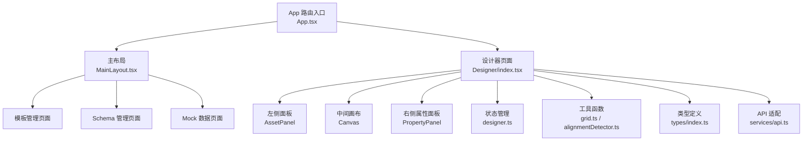

**图表来源**
- [designer/src/App.tsx:1-31](file://designer/src/App.tsx#L1-L31)
- [designer/src/layouts/MainLayout.tsx:1-56](file://designer/src/layouts/MainLayout.tsx#L1-L56)
- [designer/src/pages/Designer/index.tsx:1-365](file://designer/src/pages/Designer/index.tsx#L1-L365)
- [designer/src/store/designer.ts:1-773](file://designer/src/store/designer.ts#L1-L773)

**章节来源**
- [designer/src/App.tsx:1-31](file://designer/src/App.tsx#L1-L31)
- [designer/src/main.tsx:1-8](file://designer/src/main.tsx#L1-L8)
- [designer/src/layouts/MainLayout.tsx:1-56](file://designer/src/layouts/MainLayout.tsx#L1-L56)
- [designer/src/pages/Designer/index.tsx:1-365](file://designer/src/pages/Designer/index.tsx#L1-L365)

## 核心组件
- 三栏布局与交互
  - 左侧：数据资产树（Schema 字段拖拽生成组件）与组件库（预设组件拖拽到画布）。
  - 中间：画布编辑器，支持拖拽、缩放、网格吸附、智能对齐参考线、区域移动、键盘快捷键、上下文菜单。
  - 右侧：属性面板，按组件类型拆分为布局、数据绑定、样式与表格列管理等区域。
- 状态管理（Zustand）
  - 组件集合：内容区、页头区、页脚区三部分，支持增删改、复制/粘贴/克隆、层级管理。
  - 选中与多选：单选、多选、清空选中。
  - 模板与页面：模板信息、页面配置（尺寸、方向、边距、页头/页脚开关与高度）。
  - 工具：网格开关与大小、缩放、撤销/重做、对齐与分布。
- 工具与算法
  - 网格吸附：统一的 snapToGrid 工具，支持按住 Shift 临时禁用。
  - 智能对齐：基于毫米单位的对齐检测，输出参考线并在拖拽时吸附。
  - 页面尺寸换算：mm↔px 换算，支持 A4/A5/CUSTOM/CONTINUOUS 与横竖版。
- API 适配
  - 支持前端 Mock 与真实后端，通过环境变量切换，统一 Schema、模板、Mock 数据的 CRUD。

**章节来源**
- [designer/src/pages/Designer/index.tsx:24-48](file://designer/src/pages/Designer/index.tsx#L24-L48)
- [designer/src/store/designer.ts:9-90](file://designer/src/store/designer.ts#L9-L90)
- [designer/src/utils/grid.ts:1-36](file://designer/src/utils/grid.ts#L1-L36)
- [designer/src/pages/Designer/components/Canvas/alignmentDetector.ts:1-127](file://designer/src/pages/Designer/components/Canvas/alignmentDetector.ts#L1-L127)
- [designer/src/services/api.ts:1-134](file://designer/src/services/api.ts#L1-L134)

## 架构总览
系统采用“页面 + 组件 + 状态 + 工具 + API”的分层架构：
- 页面层：Designer 主页面组织三栏布局与悬浮工具。
- 组件层：AssetPanel、Canvas、PropertyPanel 等模块化组件。
- 状态层：Zustand Store 维护模板与画布状态，提供历史快照与区域感知操作。
- 工具层：网格、对齐、页面尺寸换算等通用工具。
- API 层：统一的 schema/template/mock-data API，支持 Mock 与真实后端。

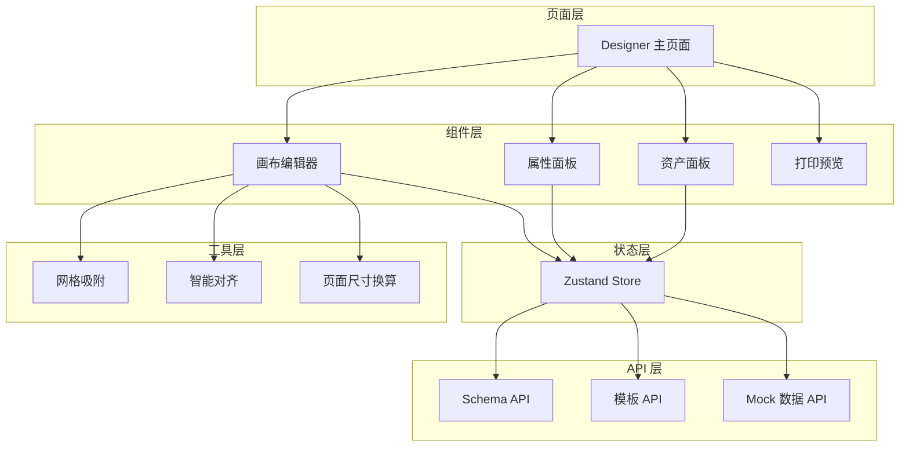

**图表来源**
- [designer/src/pages/Designer/index.tsx:1-365](file://designer/src/pages/Designer/index.tsx#L1-L365)
- [designer/src/store/designer.ts:108-773](file://designer/src/store/designer.ts#L108-L773)
- [designer/src/pages/Designer/components/Canvas/index.tsx:1-800](file://designer/src/pages/Designer/components/Canvas/index.tsx#L1-L800)
- [designer/src/services/api.ts:1-134](file://designer/src/services/api.ts#L1-L134)

## 详细组件分析

### 三栏布局与交互机制
- 左侧面板折叠/展开：通过固定按钮控制，支持左右两侧面板独立折叠。
- 中央画布：提供缩放控制（放大/缩小/重置）、打印预览、页面设置、保存模板等。
- 右侧面板：标签页切换“组件树”和“属性配置”，属性面板按组件类型拆分多个区域。

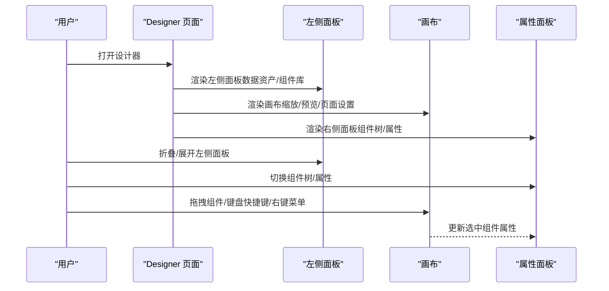

**图表来源**
- [designer/src/pages/Designer/index.tsx:54-365](file://designer/src/pages/Designer/index.tsx#L54-L365)

**章节来源**
- [designer/src/pages/Designer/index.tsx:54-365](file://designer/src/pages/Designer/index.tsx#L54-L365)

### 状态管理模式
- 设计器 Store 提供以下能力：
  - 组件管理：新增、更新、删除、复制/粘贴/克隆、移动到区域、层级管理（置顶/置底/上移/下移）。
  - 选中与多选：单选、多选、清空选中。
  - 模板与页面：设置模板信息、页面配置（含页头/页脚开关与高度推断）。
  - 工具：网格开关/大小、缩放、撤销/重做（最多 20 步快照）。
  - 对齐与分布：水平/垂直对齐、水平/垂直分布（区域感知，禁止跨区域）。
- 历史记录：每次变更保存全量状态快照，支持 canUndo/canRedo 查询。

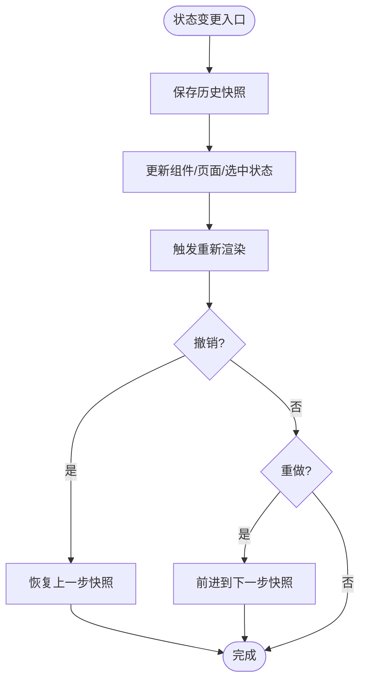

**图表来源**
- [designer/src/store/designer.ts:92-106](file://designer/src/store/designer.ts#L92-L106)
- [designer/src/store/designer.ts:508-548](file://designer/src/store/designer.ts#L508-L548)

**章节来源**
- [designer/src/store/designer.ts:9-90](file://designer/src/store/designer.ts#L9-L90)
- [designer/src/store/designer.ts:508-771](file://designer/src/store/designer.ts#L508-L771)

### 组件库系统
- 组件库提供多种打印组件（文本、图片、矩形、线条、二维码、条形码、表格等），拖拽到画布后自动吸附到网格并进入选中状态。
- 表格组件限制：不允许放入页头/页脚区域；拖拽时进行区域校验与提示。

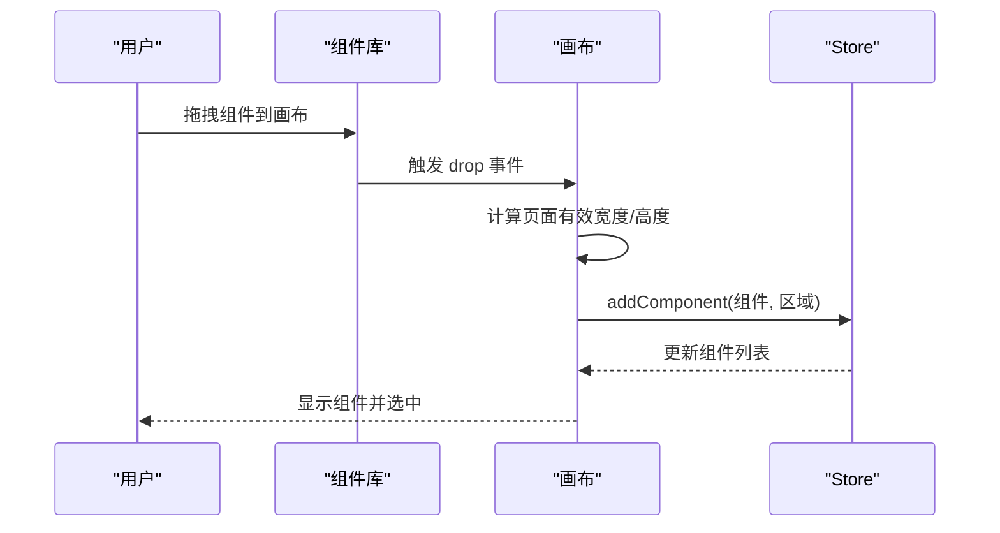

**图表来源**
- [designer/src/pages/Designer/components/AssetPanel/index.tsx:1-32](file://designer/src/pages/Designer/components/AssetPanel/index.tsx#L1-L32)
- [designer/src/pages/Designer/components/Canvas/index.tsx:281-479](file://designer/src/pages/Designer/components/Canvas/index.tsx#L281-L479)

**章节来源**
- [designer/src/pages/Designer/components/AssetPanel/index.tsx:1-32](file://designer/src/pages/Designer/components/AssetPanel/index.tsx#L1-L32)
- [designer/src/pages/Designer/components/Canvas/index.tsx:281-479](file://designer/src/pages/Designer/components/Canvas/index.tsx#L281-L479)

### 画布编辑系统
- 拖拽与吸附：支持单选与多选拖拽，网格吸附与智能对齐参考线联动。
- 区域移动：拖拽组件跨页头/内容/页脚区域时，自动计算目标区域并移动。
- 键盘快捷键：Delete/Backspace 删除、Ctrl+C/V/D 复制/粘贴/克隆、Ctrl++/-/0 缩放、Ctrl+Z/Shift+Z 撤销/重做。
- 上下文菜单：右键菜单提供复制、克隆、层级操作等。
- 区域高度拖拽：页头/页脚区域高度拖拽手柄，支持网格吸附与最小高度约束。

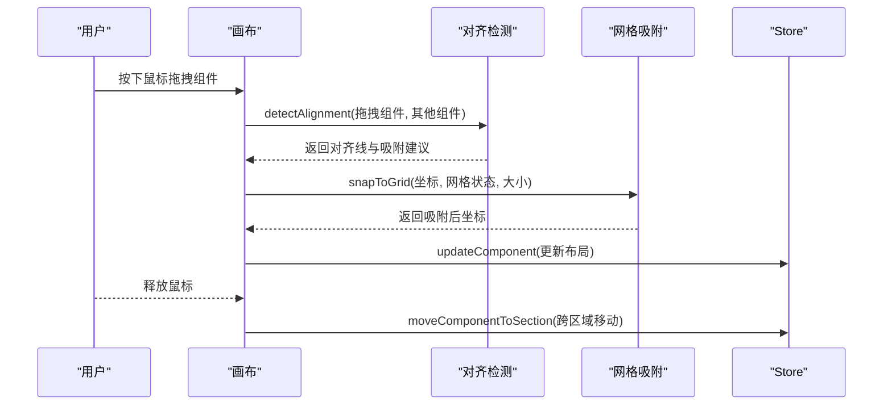

**图表来源**
- [designer/src/pages/Designer/components/Canvas/index.tsx:538-699](file://designer/src/pages/Designer/components/Canvas/index.tsx#L538-L699)
- [designer/src/pages/Designer/components/Canvas/alignmentDetector.ts:31-126](file://designer/src/pages/Designer/components/Canvas/alignmentDetector.ts#L31-L126)
- [designer/src/utils/grid.ts:12-15](file://designer/src/utils/grid.ts#L12-L15)

**章节来源**
- [designer/src/pages/Designer/components/Canvas/index.tsx:145-220](file://designer/src/pages/Designer/components/Canvas/index.tsx#L145-L220)
- [designer/src/pages/Designer/components/Canvas/index.tsx:538-699](file://designer/src/pages/Designer/components/Canvas/index.tsx#L538-L699)
- [designer/src/pages/Designer/components/Canvas/AlignmentGuides.tsx:1-66](file://designer/src/pages/Designer/components/Canvas/AlignmentGuides.tsx#L1-L66)
- [designer/src/pages/Designer/components/Canvas/alignmentDetector.ts:1-127](file://designer/src/pages/Designer/components/Canvas/alignmentDetector.ts#L1-L127)

### 属性面板系统
- 动态装配：根据选中组件类型装配布局、数据绑定、样式与表格列管理等区域。
- 变更处理：统一通过 updateComponent 更新布局、样式、props、binding。
- 区域展示：在启用页头/页脚时，展示组件所属区域（页头/内容/页脚）。

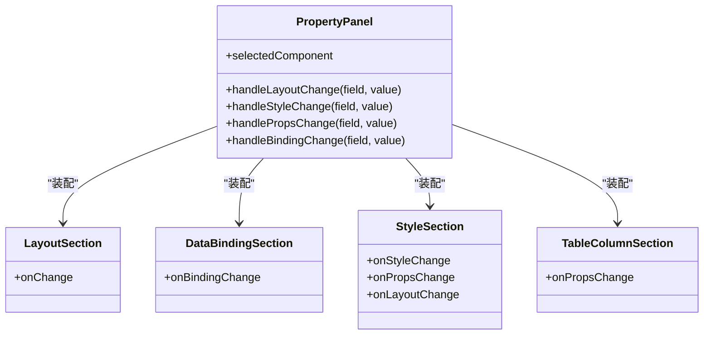

**图表来源**
- [designer/src/pages/Designer/components/PropertyPanel/index.tsx:17-149](file://designer/src/pages/Designer/components/PropertyPanel/index.tsx#L17-L149)

**章节来源**
- [designer/src/pages/Designer/components/PropertyPanel/index.tsx:17-149](file://designer/src/pages/Designer/components/PropertyPanel/index.tsx#L17-L149)

### 模板管理系统
- 模板加载：通过 URL 参数 templateId 加载模板，调用 templateApi.get 并 loadTemplate。
- 模板生成：generateTemplate 输出完整模板 JSON（名称、版本、schemaId、页面配置、布局模式、组件集合）。
- 页面配置：支持 A4/A5/CUSTOM/CONTINUOUS 尺寸、横竖版、边距、页头/页脚开关与高度推断。

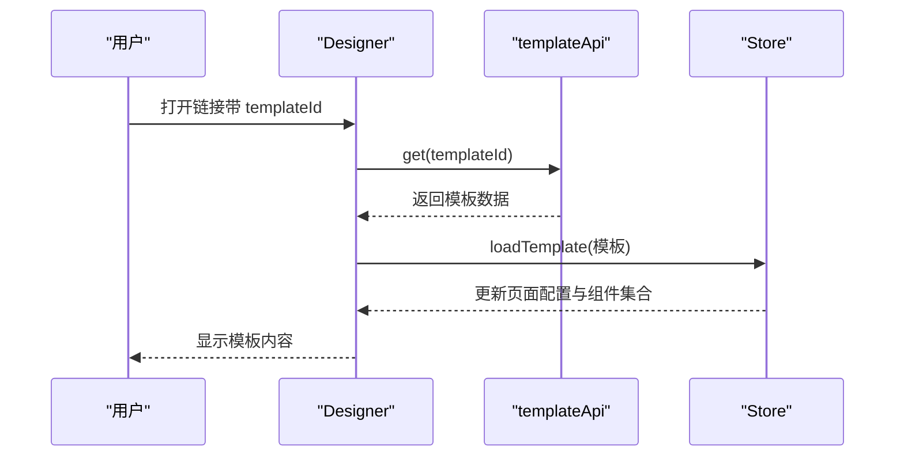

**图表来源**
- [designer/src/pages/Designer/index.tsx:26-46](file://designer/src/pages/Designer/index.tsx#L26-L46)
- [designer/src/store/designer.ts:203-250](file://designer/src/store/designer.ts#L203-L250)
- [designer/src/services/api.ts:73-76](file://designer/src/services/api.ts#L73-L76)

**章节来源**
- [designer/src/pages/Designer/index.tsx:26-46](file://designer/src/pages/Designer/index.tsx#L26-L46)
- [designer/src/store/designer.ts:189-201](file://designer/src/store/designer.ts#L189-L201)
- [designer/src/store/designer.ts:203-250](file://designer/src/store/designer.ts#L203-L250)

### 网格对齐与智能对齐参考线
- 网格吸附：统一 snapToGrid，支持按住 Shift 临时禁用。
- 智能对齐：detectAlignment 基于毫米单位检测对齐关系，输出垂直/水平参考线与吸附建议，参考线渲染由 AlignmentGuides 组件负责。

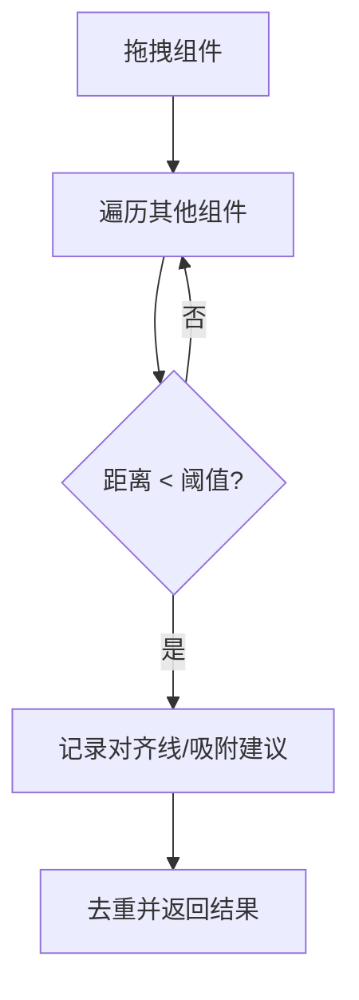

**图表来源**
- [designer/src/pages/Designer/components/Canvas/alignmentDetector.ts:31-126](file://designer/src/pages/Designer/components/Canvas/alignmentDetector.ts#L31-L126)
- [designer/src/pages/Designer/components/Canvas/AlignmentGuides.tsx:21-63](file://designer/src/pages/Designer/components/Canvas/AlignmentGuides.tsx#L21-L63)
- [designer/src/utils/grid.ts:12-15](file://designer/src/utils/grid.ts#L12-L15)

**章节来源**
- [designer/src/pages/Designer/components/Canvas/alignmentDetector.ts:1-127](file://designer/src/pages/Designer/components/Canvas/alignmentDetector.ts#L1-L127)
- [designer/src/pages/Designer/components/Canvas/AlignmentGuides.tsx:1-66](file://designer/src/pages/Designer/components/Canvas/AlignmentGuides.tsx#L1-L66)
- [designer/src/utils/grid.ts:1-36](file://designer/src/utils/grid.ts#L1-L36)

### 撤销/重做技术实现
- 快照策略：每次变更保存全量状态快照，最多保留 20 步。
- 撤销/重做：通过 historyIndex 指针前后移动，恢复对应快照。
- 选中状态：撤销/重做时清空选中，避免状态错乱。

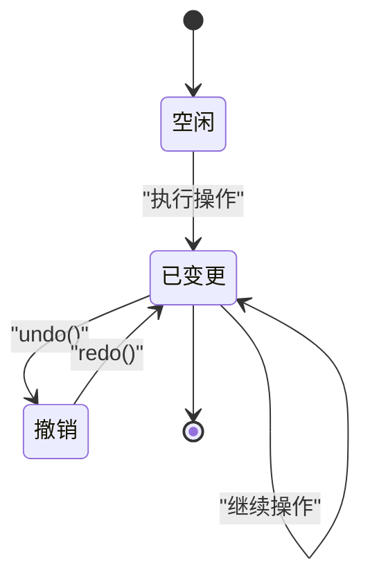

**图表来源**
- [designer/src/store/designer.ts:508-548](file://designer/src/store/designer.ts#L508-L548)

**章节来源**
- [designer/src/store/designer.ts:92-106](file://designer/src/store/designer.ts#L92-L106)
- [designer/src/store/designer.ts:508-548](file://designer/src/store/designer.ts#L508-L548)

### 设计器 API 接口说明
- Schema 字典管理
  - GET /schemas → 列表
  - GET /schemas/:id → 详情
  - POST /schemas → 创建
  - PUT /schemas/:id → 更新
  - DELETE /schemas/:id → 删除
- 打印模板管理
  - GET /templates → 列表
  - GET /templates/:id → 详情
  - POST /templates → 创建
  - PUT /templates/:id → 更新
  - DELETE /templates/:id → 删除
- Mock 数据管理
  - GET /mock-data → 列表
  - GET /mock-data/:id → 详情
  - POST /mock-data → 创建
  - PUT /mock-data/:id → 更新
  - DELETE /mock-data/:id → 删除
- 环境配置
  - VITE_USE_MOCK=true：启用前端 Mock
  - VITE_API_BASE_URL：后端 API 基础地址（默认 /api）

**章节来源**
- [designer/src/services/api.ts:37-125](file://designer/src/services/api.ts#L37-L125)
- [designer/src/services/api.ts:131-134](file://designer/src/services/api.ts#L131-L134)

### 扩展指南
- 新增组件类型
  - 在类型定义中扩展 ComponentType 与组件属性接口。
  - 在画布拖拽分支中添加新类型的默认属性与行为。
  - 在组件渲染器中实现对应渲染逻辑（SDK 侧）。
- 新增样式插件
  - 在属性面板样式区域添加插件入口，按组件类型动态装配。
- 新增数据管道
  - 在数据绑定区域扩展管道配置器，支持格式化链路。
- 新增页面尺寸
  - 在 PageConfig 中扩展尺寸枚举与默认宽高，更新尺寸换算逻辑。

**章节来源**
- [designer/src/types/index.ts:129-140](file://designer/src/types/index.ts#L129-L140)
- [designer/src/types/index.ts:91-123](file://designer/src/types/index.ts#L91-L123)
- [designer/src/pages/Designer/components/Canvas/index.tsx:315-386](file://designer/src/pages/Designer/components/Canvas/index.tsx#L315-L386)

## 依赖分析
- 前端框架与 UI：React 18、Ant Design 6、Ant Design Icons。
- 状态管理：Zustand（轻量、易组合）。
- 网络请求：Axios，支持 Mock 与真实后端切换。
- 编辑器与渲染：Monaco Editor、打印 SDK（@jcyao/print-sdk）。
- 工具库：二维码、条形码、HTTP 请求等。

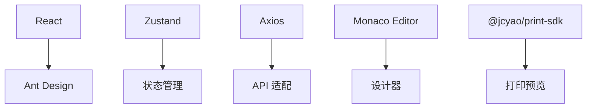

**图表来源**
- [designer/package.json:13-29](file://designer/package.json#L13-L29)
- [designer/src/services/api.ts:26-31](file://designer/src/services/api.ts#L26-L31)

**章节来源**
- [designer/package.json:1-46](file://designer/package.json#L1-L46)
- [designer/src/services/api.ts:1-134](file://designer/src/services/api.ts#L1-L134)

## 性能考虑
- 状态快照：撤销/重做保存全量快照，建议控制操作粒度与历史步数上限，避免内存膨胀。
- 事件监听：拖拽与键盘事件使用 useRef 缓存状态，减少闭包与重绑监听器带来的开销。
- 渲染优化：组件按需渲染，属性面板根据选中组件类型装配，避免不必要的重渲染。
- 网格与对齐：对齐检测在毫米层面进行，避免缩放影响；吸附与参考线渲染按需触发。

## 故障排除指南
- 模板加载失败
  - 检查 templateId 是否正确，确认后端接口可达或启用前端 Mock。
  - 查看控制台错误信息与消息提示。
- 组件无法拖入页头/页脚
  - 表格组件不支持放入页头/页脚，拖拽时会提示。
- 缩放无效
  - 确认 Ctrl/Cmd + +/-/0 快捷键未被输入框拦截，且焦点不在可编辑元素中。
- 撤销/重做不可用
  - 检查历史步数与 canUndo/canRedo 状态，确保操作序列有效。
- 区域高度拖拽异常
  - 确保页头/页脚最小高度与内容区域保留高度约束满足。

**章节来源**
- [designer/src/pages/Designer/index.tsx:34-46](file://designer/src/pages/Designer/index.tsx#L34-L46)
- [designer/src/pages/Designer/components/Canvas/index.tsx:298-302](file://designer/src/pages/Designer/components/Canvas/index.tsx#L298-L302)
- [designer/src/pages/Designer/components/Canvas/index.tsx:146-220](file://designer/src/pages/Designer/components/Canvas/index.tsx#L146-L220)
- [designer/src/store/designer.ts:543-548](file://designer/src/store/designer.ts#L543-L548)
- [designer/src/pages/Designer/components/Canvas/index.tsx:714-731](file://designer/src/pages/Designer/components/Canvas/index.tsx#L714-L731)

## 结论
本可视化设计器以清晰的三栏布局与模块化组件为核心，配合统一的状态管理与工具函数，实现了网格对齐、智能对齐参考线、撤销/重做、缩放与区域移动等关键能力。通过类型系统与 API 适配，系统具备良好的扩展性与可维护性，适合进一步扩展组件类型、样式插件与数据管道，满足多样化的打印模板设计需求。

## 附录
- 常量定义：连续纸默认宽度、最小高度、mm↔px 换算系数。
- 类型定义：Schema 字段、页面配置、组件节点、打印模板等核心类型。

**章节来源**
- [designer/src/constants/index.ts:1-20](file://designer/src/constants/index.ts#L1-L20)
- [designer/src/types/index.ts:18-52](file://designer/src/types/index.ts#L18-L52)
- [designer/src/types/index.ts:91-123](file://designer/src/types/index.ts#L91-L123)
- [designer/src/types/index.ts:303-331](file://designer/src/types/index.ts#L303-L331)
- [designer/src/types/index.ts:337-358](file://designer/src/types/index.ts#L337-L358)