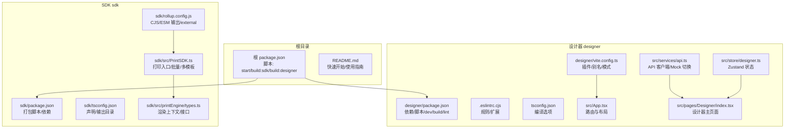
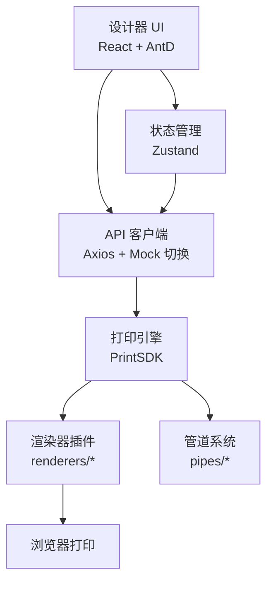
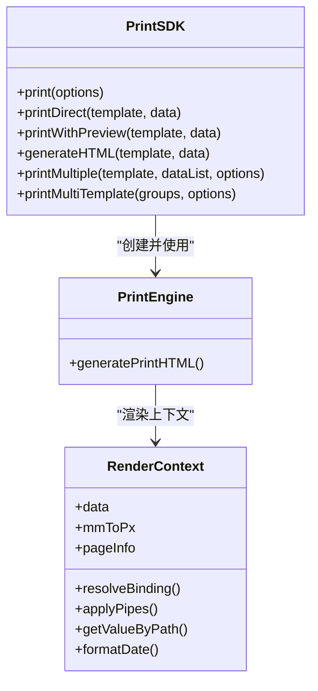
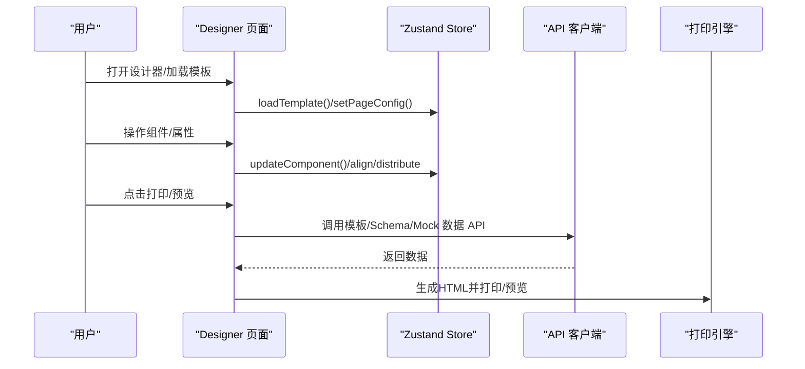
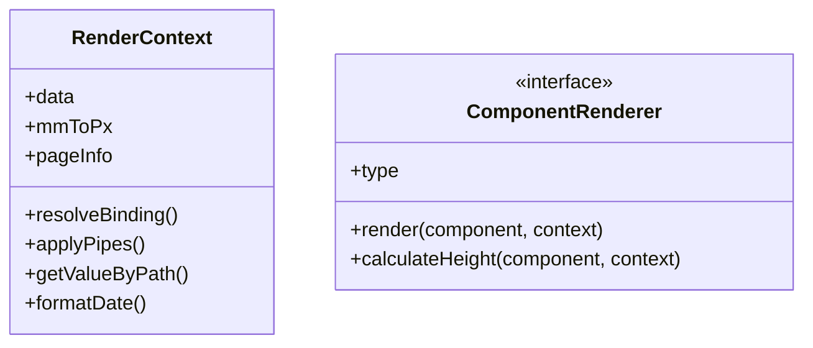
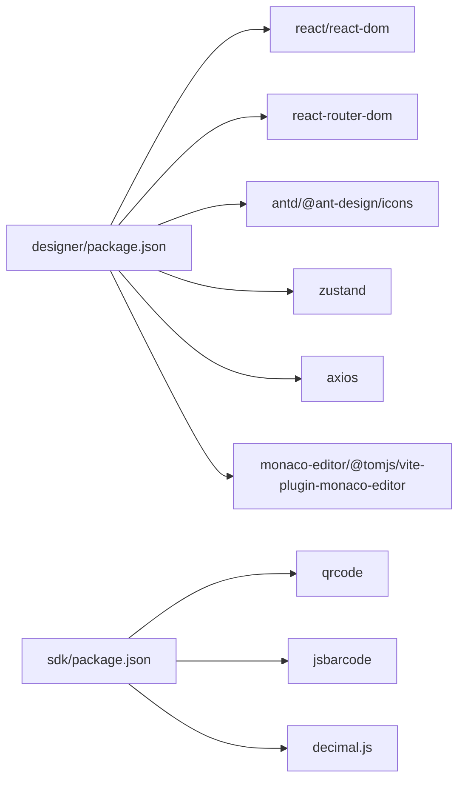

# 开发指南

<cite>
**本文引用的文件**
- [package.json](file://package.json)
- [README.md](file://README.md)
- [designer/package.json](file://designer/package.json)
- [designer/vite.config.ts](file://designer/vite.config.ts)
- [designer/.eslintrc.cjs](file://designer/.eslintrc.cjs)
- [designer/tsconfig.json](file://designer/tsconfig.json)
- [designer/src/App.tsx](file://designer/src/App.tsx)
- [designer/src/services/api.ts](file://designer/src/services/api.ts)
- [designer/src/store/designer.ts](file://designer/src/store/designer.ts)
- [designer/src/pages/Designer/index.tsx](file://designer/src/pages/Designer/index.tsx)
- [sdk/package.json](file://sdk/package.json)
- [sdk/rollup.config.js](file://sdk/rollup.config.js)
- [sdk/tsconfig.json](file://sdk/tsconfig.json)
- [sdk/src/PrintSDK.ts](file://sdk/src/PrintSDK.ts)
- [sdk/src/printEngine/types.ts](file://sdk/src/printEngine/types.ts)
</cite>

## 目录
1. [简介](#简介)
2. [项目结构](#项目结构)
3. [核心组件](#核心组件)
4. [架构总览](#架构总览)
5. [详细组件分析](#详细组件分析)
6. [依赖分析](#依赖分析)
7. [性能考量](#性能考量)
8. [故障排除指南](#故障排除指南)
9. [结论](#结论)
10. [附录](#附录)

## 简介
本开发指南面向参与打印服务平台的前端与SDK开发者，目标是帮助团队快速搭建开发环境、理解代码结构、遵循统一规范、编写高质量测试、完成构建与部署，并掌握调试与性能分析方法。平台由“可视化设计器”和“独立打印SDK”两部分组成，采用React + TypeScript + Vite作为前端技术栈，Rollup负责SDK打包，Zustand管理状态，Ant Design提供UI组件。

## 项目结构
- 根目录提供顶层脚本与说明文档，便于一键启动与构建。
- designer：可视化设计器，包含页面、组件、状态管理、服务层与Mock API。
- sdk：独立打印SDK，包含打印引擎、管道系统、渲染器插件与打包配置。
- docs：技术文档与需求文档（参考）。

图表来源
- [package.json:1-10](file://package.json#L1-L10)
- [designer/package.json:1-46](file://designer/package.json#L1-L46)
- [designer/vite.config.ts:1-29](file://designer/vite.config.ts#L1-L29)
- [designer/.eslintrc.cjs:1-19](file://designer/.eslintrc.cjs#L1-L19)
- [designer/tsconfig.json:1-26](file://designer/tsconfig.json#L1-L26)
- [designer/src/App.tsx:1-31](file://designer/src/App.tsx#L1-L31)
- [designer/src/services/api.ts:1-134](file://designer/src/services/api.ts#L1-L134)
- [designer/src/store/designer.ts:1-773](file://designer/src/store/designer.ts#L1-L773)
- [designer/src/pages/Designer/index.tsx:1-365](file://designer/src/pages/Designer/index.tsx#L1-L365)
- [sdk/package.json:1-61](file://sdk/package.json#L1-L61)
- [sdk/rollup.config.js:1-25](file://sdk/rollup.config.js#L1-L25)
- [sdk/tsconfig.json:1-17](file://sdk/tsconfig.json#L1-L17)
- [sdk/src/PrintSDK.ts:1-477](file://sdk/src/PrintSDK.ts#L1-L477)
- [sdk/src/printEngine/types.ts:1-116](file://sdk/src/printEngine/types.ts#L1-L116)

章节来源
- [README.md:369-406](file://README.md#L369-L406)

## 核心组件
- 打印SDK：提供打印、预览、批量打印、多模板打印能力，内部通过打印引擎生成HTML并触发浏览器打印。
- 设计器：基于React + Zustand的状态管理，提供三区域画布（页头/内容/页脚）、组件树、属性面板、打印预览与Mock API切换。
- 构建与打包：Vite用于设计器开发与构建；Rollup用于SDK的CJS/ESM打包，外部依赖不内联。

章节来源
- [sdk/src/PrintSDK.ts:100-477](file://sdk/src/PrintSDK.ts#L100-L477)
- [designer/src/store/designer.ts:108-773](file://designer/src/store/designer.ts#L108-L773)
- [designer/src/services/api.ts:131-134](file://designer/src/services/api.ts#L131-L134)

## 架构总览
设计器通过Axios客户端访问后端API或前端Mock，状态由Zustand集中管理；SDK独立于设计器，接收模板与数据，生成HTML并调用浏览器打印。

图表来源
- [designer/src/services/api.ts:131-134](file://designer/src/services/api.ts#L131-L134)
- [sdk/src/PrintSDK.ts:100-477](file://sdk/src/PrintSDK.ts#L100-L477)
- [sdk/src/printEngine/types.ts:57-82](file://sdk/src/printEngine/types.ts#L57-L82)

## 详细组件分析

### 打印SDK（PrintSDK）
- 能力概览
  - 单次打印：可直接打印或预览。
  - 仅生成HTML：用于外部集成。
  - 批量打印：同模板多数据，生成完整文档，一次确认。
  - 多模板打印：支持多个模板各自绑定数据列表，一次确认。
- 关键流程
  - 创建打印引擎 -> 生成HTML -> 预览或打印 -> 清理iframe/窗口。
  - 批量/多模板：抽取body内容，拼接批量样式，再执行打印。
- 错误处理
  - 打开打印窗口失败、访问iframe文档失败、afterprint事件兜底清理等。

图表来源
- [sdk/src/PrintSDK.ts:100-477](file://sdk/src/PrintSDK.ts#L100-L477)
- [sdk/src/printEngine/types.ts:11-55](file://sdk/src/printEngine/types.ts#L11-L55)

章节来源
- [sdk/src/PrintSDK.ts:110-322](file://sdk/src/PrintSDK.ts#L110-L322)
- [sdk/src/PrintSDK.ts:332-467](file://sdk/src/PrintSDK.ts#L332-L467)

### 设计器（页面与状态）
- 页面结构
  - 主布局：左侧面板（素材/组件库）、中间画布、右侧面板（组件树/属性）。
  - 工具栏：缩放、返回、调试抽屉。
- 状态管理
  - 组件增删改、多选、复制粘贴、撤销/重做、网格与缩放、对齐/分布、跨区域移动。
  - 生成/加载模板、页头/页脚开关与高度推断。
- API与Mock
  - 通过环境变量切换真实HTTP或前端内存Mock，统一API接口。

图表来源
- [designer/src/pages/Designer/index.tsx:17-365](file://designer/src/pages/Designer/index.tsx#L17-L365)
- [designer/src/store/designer.ts:108-773](file://designer/src/store/designer.ts#L108-L773)
- [designer/src/services/api.ts:131-134](file://designer/src/services/api.ts#L131-L134)
- [sdk/src/PrintSDK.ts:110-190](file://sdk/src/PrintSDK.ts#L110-L190)

章节来源
- [designer/src/pages/Designer/index.tsx:54-365](file://designer/src/pages/Designer/index.tsx#L54-L365)
- [designer/src/store/designer.ts:189-250](file://designer/src/store/designer.ts#L189-L250)
- [designer/src/services/api.ts:9-21](file://designer/src/services/api.ts#L9-L21)

### 打印引擎类型与渲染器接口
- 渲染上下文：提供数据解析、管道应用、路径取值、日期格式化、mm→px系数与页面信息。
- 组件渲染器接口：统一的渲染方法与可选高度计算，便于扩展新组件。

图表来源
- [sdk/src/printEngine/types.ts:11-55](file://sdk/src/printEngine/types.ts#L11-L55)
- [sdk/src/printEngine/types.ts:61-82](file://sdk/src/printEngine/types.ts#L61-L82)

章节来源
- [sdk/src/printEngine/types.ts:1-116](file://sdk/src/printEngine/types.ts#L1-L116)

## 依赖分析
- 设计器依赖
  - React、ReactDOM、React Router、Ant Design、Zustand、Monaco Editor、Axios等。
  - Vite插件：React、Monaco本地化、Mock服务插件。
- SDK依赖
  - 外部依赖：qrcode、jsbarcode、decimal.js（Rollup打包时不内联）。
  - 打印SDK作为独立包发布，模块格式为ESM与CommonJS。

图表来源
- [designer/package.json:13-30](file://designer/package.json#L13-L30)
- [sdk/package.json:49-53](file://sdk/package.json#L49-L53)

章节来源
- [designer/package.json:1-46](file://designer/package.json#L1-L46)
- [sdk/package.json:1-61](file://sdk/package.json#L1-L61)

## 性能考量
- 打印前等待图片加载：避免打印空白或裁切异常。
- iframe生命周期管理：监听afterprint事件并在超时后兜底清理，减少内存泄漏。
- 批量打印：先生成各页面HTML片段，再统一注入样式与拼接，减少多次打印确认。
- 分页精度：表格渲染后测量真实高度，避免估算误差导致的分页截断。
- 打印引擎外部依赖不内联，减小SDK体积，提高加载速度。

章节来源
- [sdk/src/PrintSDK.ts:125-171](file://sdk/src/PrintSDK.ts#L125-L171)
- [sdk/src/PrintSDK.ts:295-321](file://sdk/src/PrintSDK.ts#L295-L321)
- [sdk/src/PrintSDK.ts:446-466](file://sdk/src/PrintSDK.ts#L446-L466)
- [README.md:162-187](file://README.md#L162-L187)

## 故障排除指南
- 打开打印窗口失败
  - 现象：抛出“无法打开打印窗口”的错误。
  - 排查：检查浏览器弹窗拦截设置，确认用户手势触发。
  - 参考：[sdk/src/PrintSDK.ts:117-120](file://sdk/src/PrintSDK.ts#L117-L120)
- 访问iframe文档失败
  - 现象：无法写入或关闭iframe文档。
  - 排查：检查同源策略与跨域限制，确认contentWindow有效。
  - 参考：[sdk/src/PrintSDK.ts:137-143](file://sdk/src/PrintSDK.ts#L137-L143)
- afterprint事件未触发
  - 现象：用户取消打印后iframe未清理。
  - 处理：设置超时兜底清理，避免内存泄漏。
  - 参考：[sdk/src/PrintSDK.ts:156-170](file://sdk/src/PrintSDK.ts#L156-L170)
- Mock模式未生效
  - 现象：构建演示站点时仍走真实HTTP。
  - 处理：确保通过Vite模式注入环境变量或在构建命令中设置。
  - 参考：[designer/vite.config.ts:8-14](file://designer/vite.config.ts#L8-L14)，[designer/src/services/api.ts:10-20](file://designer/src/services/api.ts#L10-L20)
- ESLint报错
  - 现象：规则冲突或未使用导出。
  - 处理：根据规则调整代码风格或使用允许常量导出的配置。
  - 参考：[designer/.eslintrc.cjs:12-16](file://designer/.eslintrc.cjs#L12-L16)

章节来源
- [sdk/src/PrintSDK.ts:117-170](file://sdk/src/PrintSDK.ts#L117-L170)
- [designer/vite.config.ts:8-14](file://designer/vite.config.ts#L8-L14)
- [designer/src/services/api.ts:10-20](file://designer/src/services/api.ts#L10-L20)
- [designer/.eslintrc.cjs:12-16](file://designer/.eslintrc.cjs#L12-L16)

## 结论
本指南提供了从环境搭建、代码规范、测试策略、构建与部署到调试与故障排除的完整开发实践。建议团队在日常开发中严格遵循TypeScript与React规范，利用Zustand与Axios的清晰边界，配合SDK的插件化架构与打印引擎的高精度分页能力，持续提升开发效率与打印质量。

## 附录

### 开发环境搭建
- 环境要求
  - Node.js与包管理器（推荐使用pnpm，仓库中存在pnpm相关锁定文件）。
  - 现代浏览器（支持ES模块与TypeScript）。
- 依赖安装
  - 根目录脚本提供一键启动与构建入口。
  - 设计器与SDK分别进入对应目录安装依赖。
- 开发服务器
  - 设计器：使用Vite开发服务器，默认端口由Vite决定。
  - Mock API：通过Vite插件集成，无需单独启动后端服务。
- 构建产物
  - 设计器：TypeScript编译与Vite打包。
  - SDK：Rollup生成CJS与ESM两种格式。

章节来源
- [package.json:4-8](file://package.json#L4-L8)
- [designer/package.json:6-12](file://designer/package.json#L6-L12)
- [designer/vite.config.ts:1-29](file://designer/vite.config.ts#L1-L29)
- [sdk/rollup.config.js:4-16](file://sdk/rollup.config.js#L4-L16)

### 代码规范
- TypeScript
  - 严格模式、未使用变量/参数检查、switch穷举检查。
  - bundler模式解析，JSX使用react-jsx。
- React组件
  - 函数组件为主，合理拆分页面、面板与渲染器。
  - 使用Ant Design组件，保持一致的UI风格。
- 命名约定
  - 文件与组件采用帕斯卡命名法；模块导出使用明确语义。
- 代码注释
  - 公共API与复杂逻辑提供清晰注释，解释设计意图与边界条件。

章节来源
- [designer/tsconfig.json:17-21](file://designer/tsconfig.json#L17-L21)
- [designer/.eslintrc.cjs:4-8](file://designer/.eslintrc.cjs#L4-L8)

### 测试策略
- 单元测试
  - 针对工具函数（如资源加载、网格吸附、列宽计算）编写测试。
- 集成测试
  - 验证Zustand状态变更与组件渲染联动。
- 端到端测试
  - 使用Mock API验证模板加载、属性配置与打印预览流程。
- 性能测试
  - 大数据表格渲染与批量打印的耗时监控与优化。

（本节为通用指导，不直接分析具体文件）

### 构建与部署
- 开发构建
  - 设计器：Vite开发模式，热更新与Mock集成。
- 生产构建
  - 设计器：TypeScript编译后Vite打包，产物位于dist。
  - SDK：Rollup生成CJS与ESM，external声明qrcode、jsbarcode、decimal.js。
- SDK打包流程
  - 进入sdk目录，执行构建脚本，生成dist目录产物。

章节来源
- [designer/package.json:8-11](file://designer/package.json#L8-L11)
- [sdk/package.json:13-16](file://sdk/package.json#L13-L16)
- [sdk/rollup.config.js:1-25](file://sdk/rollup.config.js#L1-25)

### 调试配置与性能分析
- 调试
  - 设计器：使用Monaco Editor进行代码编辑与调试。
  - 打印预览：通过预览模式在新窗口查看HTML结构与样式。
- 性能分析
  - 使用浏览器开发者工具的时间线与内存面板，关注打印前图片加载与iframe生命周期。
  - 批量打印时关注HTML拼接与样式注入的性能瓶颈。

章节来源
- [designer/vite.config.ts:15-18](file://designer/vite.config.ts#L15-L18)
- [sdk/src/PrintSDK.ts:125-171](file://sdk/src/PrintSDK.ts#L125-L171)

### 贡献指南与代码审查
- 提交规范
  - 使用清晰的提交信息描述变更内容与影响范围。
- 代码审查
  - 关注打印引擎的分页精度、状态管理的不可变更新、API客户端的Mock切换逻辑。
- 评审清单
  - 是否满足TypeScript严格模式？
  - 是否有必要的注释与边界处理？
  - 是否通过了Lint与构建？

（本节为通用指导，不直接分析具体文件）