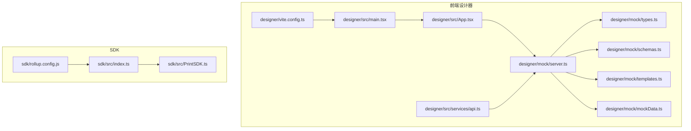
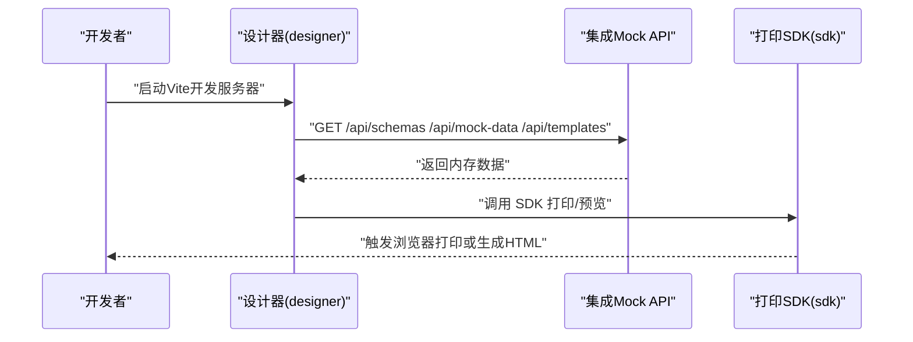
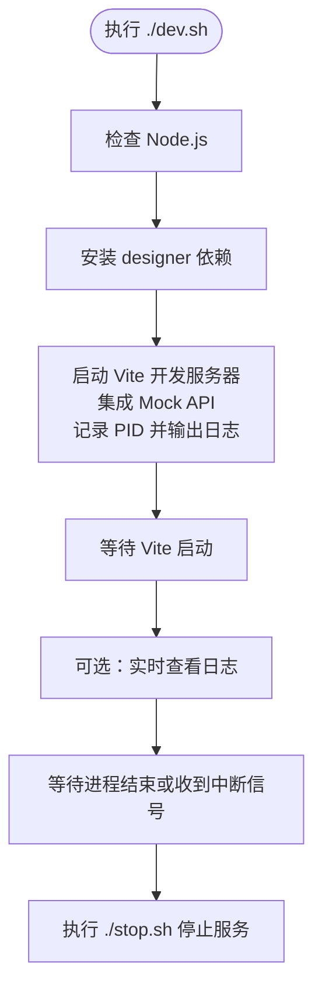
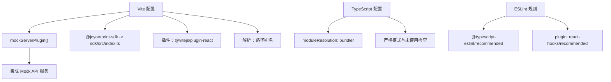
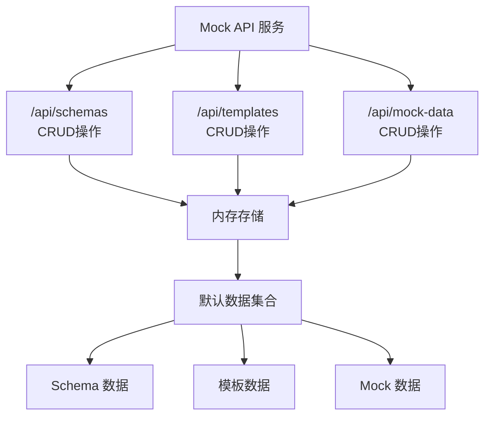
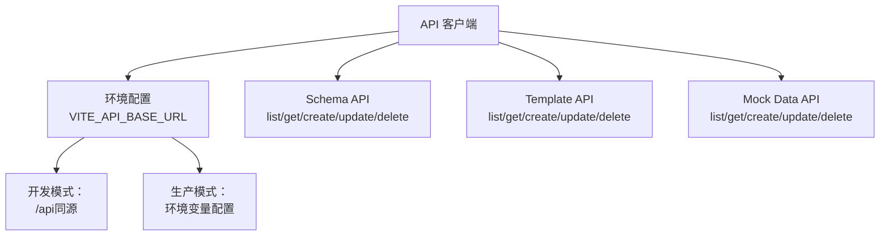
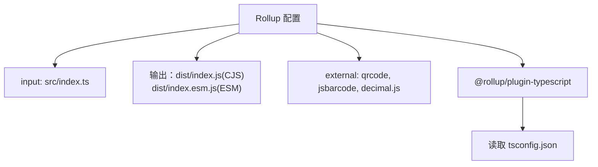
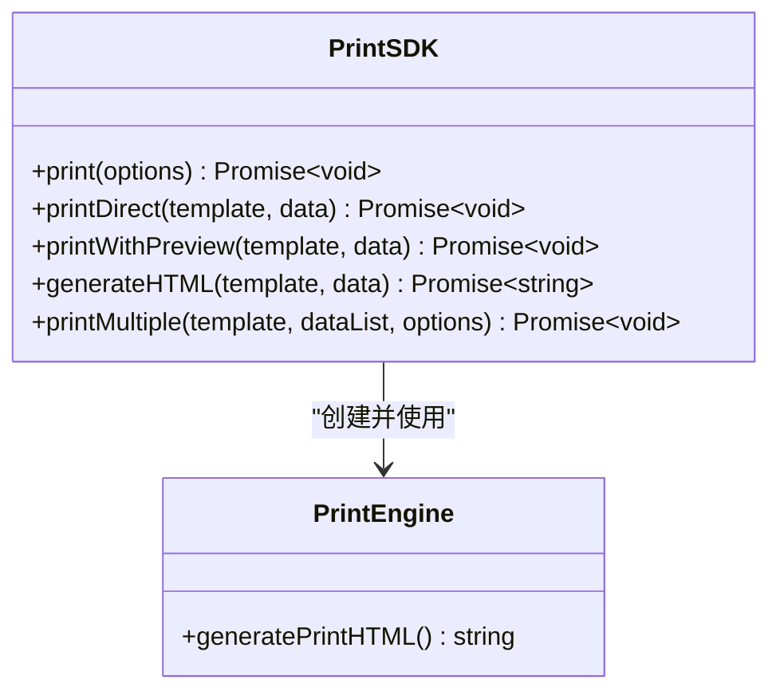

# 开发者指南

<cite>
**本文引用的文件**
- [dev.sh](file://dev.sh)
- [stop.sh](file://stop.sh)
- [vite.config.ts](file://designer/vite.config.ts)
- [server.ts](file://designer/mock/server.ts)
- [api.ts](file://designer/src/services/api.ts)
- [types.ts](file://designer/mock/types.ts)
- [schemas.ts](file://designer/mock/schemas.ts)
- [templates.ts](file://designer/mock/templates.ts)
- [mockData.ts](file://designer/mock/mockData.ts)
- [package.json（designer）](file://designer/package.json)
- [rollup.config.js](file://sdk/rollup.config.js)
- [package.json（sdk）](file://sdk/package.json)
- [App.tsx（designer）](file://designer/src/App.tsx)
- [index.ts（sdk）](file://sdk/src/index.ts)
- [PrintSDK.ts](file://sdk/src/PrintSDK.ts)
</cite>

## 更新摘要
**所做变更**
- 更新了开发环境搭建章节，反映完全移除独立后端服务的架构变更
- 更新了Vite配置章节，新增mockServerPlugin集成说明
- 更新了Mock API服务章节，详细说明集成到Vite的实现
- 更新了API客户端章节，说明与集成Mock API的交互
- 更新了部署章节，移除对独立后端服务的依赖
- 更新了故障排查指南，针对新的架构调整问题定位方法

## 目录
1. [简介](#简介)
2. [项目结构](#项目结构)
3. [核心组件](#核心组件)
4. [架构总览](#架构总览)
5. [详细组件分析](#详细组件分析)
6. [依赖分析](#依赖分析)
7. [性能考量](#性能考量)
8. [故障排查指南](#故障排查指南)
9. [结论](#结论)
10. [附录](#附录)

## 简介
本指南面向参与打印平台开发与维护的工程师，覆盖开发环境搭建、依赖安装、单一Vite开发服务器启动与调试、构建配置（前端Vite与SDK Rollup）、开发调试技巧与最佳实践、部署流程（生产构建、服务端部署、Docker容器化建议）、版本管理与发布流程。文档基于重构后的代码结构进行说明，重点介绍新的单进程开发模式和集成的mock API服务。

## 项目结构
项目采用多包结构，包含两个主要模块：
- designer：可视化设计器（React + Vite），提供模板设计与预览，集成mock API服务
- sdk：独立打印SDK（Rollup打包），提供浏览器端打印能力

**更新** 移除了独立的服务端模块，现在使用Vite集成的mock API服务替代传统后端服务

图表来源
- [vite.config.ts:1-21](file://designer/vite.config.ts#L1-L21)
- [server.ts:1-268](file://designer/mock/server.ts#L1-L268)
- [api.ts:1-115](file://designer/src/services/api.ts#L1-L115)
- [types.ts:1-317](file://designer/mock/types.ts#L1-L317)
- [schemas.ts:1-147](file://designer/mock/schemas.ts#L1-L147)
- [templates.ts:1-800](file://designer/mock/templates.ts#L1-L800)
- [mockData.ts:1-424](file://designer/mock/mockData.ts#L1-L424)
- [App.tsx:1-31](file://designer/src/App.tsx#L1-L31)
- [index.ts（sdk）:1-19](file://sdk/src/index.ts#L1-L19)
- [PrintSDK.ts:1-303](file://sdk/src/PrintSDK.ts#L1-L303)
- [rollup.config.js:1-25](file://sdk/rollup.config.js#L1-L25)

章节来源
- [README.md:191-234](file://README.md#L191-L234)
- [dev.sh:1-84](file://dev.sh#L1-L84)

## 核心组件
- 前端设计器（designer）
  - React + TypeScript + Vite，使用单一开发服务器
  - 集成mock API服务，提供完整的CRUD接口
  - ESLint 规则启用 TS 推荐规则与 React Hooks 规则
  - 通过别名将 SDK 源码映射到本地开发，便于联调
- 打印SDK（sdk）
  - Rollup 打包，输出 CommonJS 与 ESM 两套产物
  - 外部依赖声明（qrcode、jsbarcode、decimal.js），不内嵌
  - 提供 PrintSDK 类，支持直接打印、预览、批量打印与HTML生成

**更新** 移除了独立的后端服务，现在使用Vite插件形式的mock API服务

章节来源
- [vite.config.ts:1-21](file://designer/vite.config.ts#L1-L21)
- [server.ts:1-268](file://designer/mock/server.ts#L1-L268)
- [api.ts:1-115](file://designer/src/services/api.ts#L1-L115)
- [package.json（designer）:1-45](file://designer/package.json#L1-L45)
- [rollup.config.js（sdk）:1-25](file://sdk/rollup.config.js#L1-L25)
- [package.json（sdk）:1-61](file://sdk/package.json#L1-L61)
- [index.ts（sdk）:1-19](file://sdk/src/index.ts#L1-L19)
- [PrintSDK.ts:1-303](file://sdk/src/PrintSDK.ts#L1-L303)

## 架构总览
整体为"设计器 + SDK"的简化架构，mock API服务集成在Vite开发服务器中：
- 设计器负责模板设计与数据资产管理，通过集成的mock API与本地交互
- SDK 提供浏览器端打印能力，可独立使用
- mock API服务提供数据与模板管理接口，支持CRUD操作

**更新** 架构从"设计器 + SDK + 服务端"简化为"设计器 + SDK"，mock API集成在Vite中

图表来源
- [server.ts:79-130](file://designer/mock/server.ts#L79-L130)
- [App.tsx:1-31](file://designer/src/App.tsx#L1-L31)
- [PrintSDK.ts:53-97](file://sdk/src/PrintSDK.ts#L53-L97)

## 详细组件分析

### 开发环境与一键启动
- 一键启动脚本会检查 Node.js、安装依赖、启动Vite开发服务器，并输出日志到 logs 目录
- 停止脚本通过 PID 文件清理Vite开发服务器进程
- 建议在首次启动前确保端口 5173（Vite开发服务器）未被占用

**更新** 移除了对独立后端服务的依赖，现在只启动单一Vite开发服务器

图表来源
- [dev.sh:1-84](file://dev.sh#L1-L84)
- [stop.sh:1-37](file://stop.sh#L1-L37)

章节来源
- [dev.sh:17-40](file://dev.sh#L17-L40)
- [stop.sh:12-29](file://stop.sh#L12-L29)

### Vite配置与集成Mock API
- Vite配置新增mockServerPlugin插件，集成完整的mock API服务
- 别名配置将 @jcyao/print-sdk 指向本地 SDK 源码，便于本地联调
- TypeScript 编译器选项采用 bundler 模式，严格模式开启，利于早期发现潜在问题
- ESLint 集成 TS 与 React Hooks 推荐规则，配合 react-refresh 插件提升开发体验

**更新** 新增了mockServerPlugin插件，将mock API集成到Vite开发服务器中

图表来源
- [vite.config.ts:1-21](file://designer/vite.config.ts#L1-L21)
- [server.ts:259-268](file://designer/mock/server.ts#L259-L268)

章节来源
- [vite.config.ts:8-12](file://designer/vite.config.ts#L8-L12)
- [server.ts:259-268](file://designer/mock/server.ts#L259-L268)

### Mock API服务与数据模型
- mock API服务提供完整的CRUD接口，支持schemas、templates、mock-data三个资源
- 内存数据存储，支持JSON请求体解析和响应
- CORS支持，处理OPTIONS预检请求
- 提供默认的Schema、模板和Mock数据集合

**更新** 新增了完整的mock API服务，替代原有的独立后端服务

图表来源
- [server.ts:49-254](file://designer/mock/server.ts#L49-L254)
- [types.ts:1-317](file://designer/mock/types.ts#L1-L317)
- [schemas.ts:1-147](file://designer/mock/schemas.ts#L1-L147)
- [templates.ts:1-800](file://designer/mock/templates.ts#L1-L800)
- [mockData.ts:1-424](file://designer/mock/mockData.ts#L1-L424)

章节来源
- [server.ts:79-130](file://designer/mock/server.ts#L79-L130)
- [server.ts:132-186](file://designer/mock/server.ts#L132-L186)
- [server.ts:188-245](file://designer/mock/server.ts#L188-L245)

### API客户端与环境配置
- API基础地址支持环境变量配置，开发环境默认使用同源API
- 统一的Axios实例配置，包含baseURL和Content-Type头部
- 提供Schema、模板、Mock数据的完整API封装

**更新** API客户端现在指向集成的mock API服务

图表来源
- [api.ts:1-115](file://designer/src/services/api.ts#L1-L115)

章节来源
- [api.ts:4-10](file://designer/src/services/api.ts#L4-L10)
- [api.ts:26-50](file://designer/src/services/api.ts#L26-L50)
- [api.ts:56-80](file://designer/src/services/api.ts#L56-L80)
- [api.ts:86-114](file://designer/src/services/api.ts#L86-L114)

### SDK Rollup配置与构建产物
- 输入为 src/index.ts，输出同时生成 CommonJS 与 ESM 两套产物，均带 SourceMap
- external 声明 qrcode、jsbarcode、decimal.js 不打入包体，由使用者提供
- 使用 @rollup/plugin-typescript 进行编译，tsconfig 由插件读取

图表来源
- [rollup.config.js（sdk）:1-25](file://sdk/rollup.config.js#L1-L25)
- [package.json（sdk）:6-8](file://sdk/package.json#L6-L8)

章节来源
- [rollup.config.js（sdk）:4-18](file://sdk/rollup.config.js#L4-L18)
- [package.json（sdk）:13-17](file://sdk/package.json#L13-L17)

### 打印SDK核心类与打印流程
- PrintSDK 提供 print、printDirect、printWithPreview、generateHTML、printMultiple 等方法
- 预览与直接打印两种模式：预览通过新窗口打开，直接打印通过隐藏 iframe 触发打印
- 批量打印将多个数据生成的页面拼接为完整 HTML，减少用户确认次数

图表来源
- [PrintSDK.ts:43-244](file://sdk/src/PrintSDK.ts#L43-L244)

章节来源
- [PrintSDK.ts:43-244](file://sdk/src/PrintSDK.ts#L43-L244)

## 依赖分析
- 设计器依赖
  - 运行时：React、Ant Design、Monaco Editor、Zustand、Axios、QRCode/BarCode 等
  - 开发时：Vite、TypeScript、ESLint、React Hooks/Refresh 插件、mock API插件
- SDK 依赖
  - 运行时：qrcode、jsbarcode、decimal.js
  - 开发时：Rollup、@rollup/plugin-typescript、TypeScript
- 移除了独立的服务端依赖

**更新** 移除了服务端相关依赖，新增了mock API相关的类型定义和数据结构

章节来源
- [package.json（designer）:12-28](file://designer/package.json#L12-L28)
- [package.json（sdk）:49-53](file://sdk/package.json#L49-L53)

## 性能考量
- 打印资源加载
  - SDK 在打印前等待图片资源加载完成，避免部分图片未渲染导致的打印缺失
- 批量打印
  - 将多个数据的页面 HTML 拼接为单一文档，减少用户确认次数
- 代码质量与构建
  - TypeScript 严格模式与 ESLint 规则有助于提前发现潜在性能与可维护性问题
  - Vite 开发服务器热更新与按需编译，提升开发效率
  - Rollup 输出两套产物，满足不同运行时需求
- Mock API性能
  - 内存数据存储，响应速度快
  - 支持查询参数过滤，提高数据检索效率

**更新** 新增了Mock API的性能考量

章节来源
- [PrintSDK.ts:68-70](file://sdk/src/PrintSDK.ts#L68-L70)
- [PrintSDK.ts:216-218](file://sdk/src/PrintSDK.ts#L216-L218)
- [server.ts:79-130](file://designer/mock/server.ts#L79-L130)

## 故障排查指南
- 端口冲突
  - Vite开发服务器：修改 Vite 配置中的 server.port 或使用环境变量
- 依赖安装失败
  - 确认 Node.js 版本满足要求；优先使用 pnpm 或确保网络稳定
- 无法访问mock API接口
  - 检查Vite开发服务器是否正常启动；确认mock API插件已正确配置
- 日志过大
  - 删除 logs 目录下的日志文件
- 停止服务异常
  - 使用 stop.sh 脚本；若仍存在残留进程，可手动查找并终止

**更新** 更新了端口冲突和API访问相关的故障排查指南

章节来源
- [dev.sh:46-48](file://dev.sh#L46-L48)
- [stop.sh:31-33](file://stop.sh#L31-L33)

## 结论
本指南基于重构后的代码结构，提供了从开发环境搭建到构建、调试、部署与版本管理的全流程说明。新的单进程开发模式简化了开发流程，集成的mock API服务提供了完整的数据管理能力。建议在开发过程中遵循代码规范与性能优化建议，结合日志与错误处理机制进行问题定位，确保打印平台的稳定性与可维护性。

## 附录

### 开发调试最佳实践
- 使用 Vite 的热更新与 React Refresh 提升迭代速度
- 在 TypeScript 中开启严格模式，利用 ESLint 规则约束代码风格
- 对 SDK 的 printMultiple 等批量能力进行充分测试，关注进度回调与异常处理
- 利用集成的mock API进行前后端联调，无需启动独立后端服务

**更新** 新增了mock API相关的开发调试建议

章节来源
- [vite.config.ts:10](file://designer/vite.config.ts#L10)
- [server.ts:259-268](file://designer/mock/server.ts#L259-L268)
- [api.ts:15-20](file://designer/src/services/api.ts#L15-L20)

### 部署与容器化建议
- 生产构建
  - 设计器：使用 Vite 进行生产构建，输出静态资源
  - SDK：使用 Rollup 生成 CJS 与 ESM 产物，注意 external 依赖在目标环境中提供
- 服务端部署
  - Vite开发服务器仅用于开发环境，生产环境建议使用静态资源服务器
- Docker 容器化
  - 建议将构建后的静态资源部署到Nginx或其他静态资源服务器
  - 容器内确保端口映射与日志目录挂载

**更新** 更新了部署建议，移除了对独立后端服务的依赖

章节来源
- [package.json（designer）:8-10](file://designer/package.json#L8-L10)
- [rollup.config.js（sdk）:5-16](file://sdk/rollup.config.js#L5-L16)

### 版本管理与发布流程
- 版本号与发布说明
  - 通过 package.json 与 README 中的版本信息进行版本管理
- 发布准备
  - 确保 SDK 构建产物齐全（CJS/ESM），并在目标环境验证 external 依赖可用
- 发布渠道
  - SDK 已配置公开发布配置，可在 npmjs.org 发布

章节来源
- [package.json（sdk）:9-12](file://sdk/package.json#L9-L12)
- [README.md:1-11](file://README.md#L1-L11)