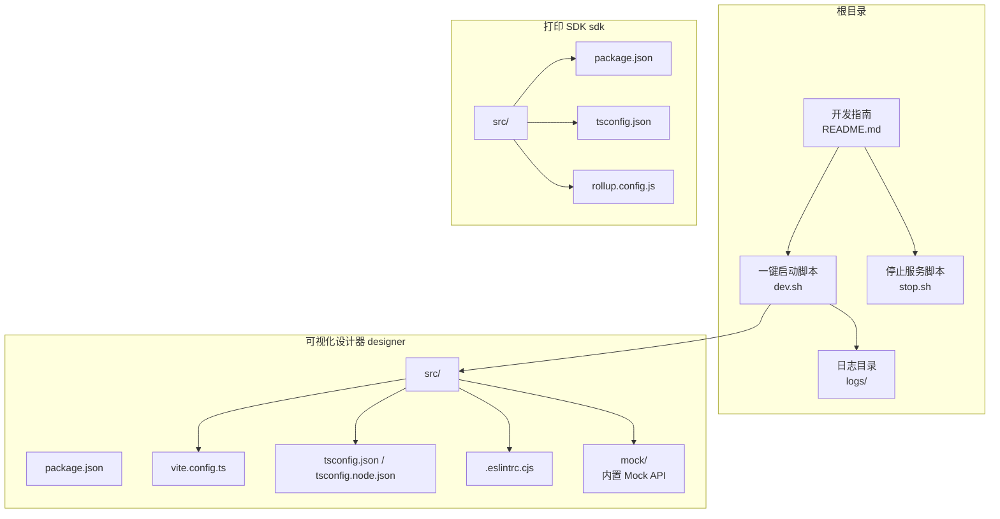

# 环境搭建

<cite>
**本文引用的文件**
- [dev.sh](file://dev.sh)
- [stop.sh](file://stop.sh)
- [designer/vite.config.ts](file://designer/vite.config.ts)
- [designer/package.json](file://designer/package.json)
- [designer/tsconfig.json](file://designer/tsconfig.json)
- [designer/tsconfig.node.json](file://designer/tsconfig.node.json)
- [designer/.eslintrc.cjs](file://designer/.eslintrc.cjs)
- [designer/mock/server.ts](file://designer/mock/server.ts)
- [designer/mock/index.ts](file://designer/mock/index.ts)
- [sdk/package.json](file://sdk/package.json)
- [sdk/tsconfig.json](file://sdk/tsconfig.json)
- [sdk/rollup.config.js](file://sdk/rollup.config.js)
- [README.md](file://README.md)
</cite>

## 更新摘要
**所做更改**
- 更新架构说明：从多模块架构改为单进程开发模式，移除独立后端服务依赖
- 更新开发脚本：简化为仅启动前端设计器，Mock API 已集成到 Vite
- 更新服务地址：后端 API 地址改为前端本地端口，无需独立启动
- 更新环境变量：移除后端端口配置，保留前端端口配置
- 更新依赖关系：SDK 作为本地路径映射而非远程依赖

## 目录
1. [简介](#简介)
2. [项目结构](#项目结构)
3. [前置条件与系统依赖](#前置条件与系统依赖)
4. [依赖安装流程](#依赖安装流程)
5. [开发服务器启动方法](#开发服务器启动方法)
6. [开发环境配置选项](#开发环境配置选项)
7. [常见环境问题排查](#常见环境问题排查)
8. [结论](#结论)

## 简介
本指南面向参与打印平台项目的开发者，提供从零开始搭建开发环境的完整步骤。项目采用单进程开发模式，移除了对独立后端服务的依赖，所有 API 均通过 Vite Mock 服务提供。项目包含可视化设计器（designer）与打印 SDK（sdk）两个核心模块，提供一键启动脚本以提升开发效率。

## 项目结构
项目采用单进程架构，核心模块与职责如下：
- designer：基于 React + TypeScript + Vite 的可视化设计器，内置 Mock API 服务，提供模板设计与预览能力。
- sdk：基于 Rollup 的独立打印 SDK，提供纯浏览器端打印能力。

**图表来源**
- [README.md:191-228](file://README.md#L191-L228)
- [dev.sh:43-45](file://dev.sh#L43-L45)
- [designer/vite.config.ts:1-19](file://designer/vite.config.ts#L1-L19)
- [designer/tsconfig.json:1-26](file://designer/tsconfig.json#L1-L26)
- [designer/tsconfig.node.json:1-12](file://designer/tsconfig.node.json#L1-L12)
- [designer/.eslintrc.cjs:1-19](file://designer/.eslintrc.cjs#L1-L19)
- [sdk/package.json:1-61](file://sdk/package.json#L1-L61)
- [sdk/tsconfig.json:1-17](file://sdk/tsconfig.json#L1-L17)
- [sdk/rollup.config.js:1-25](file://sdk/rollup.config.js#L1-L25)

**章节来源**
- [README.md:191-228](file://README.md#L191-L228)

## 前置条件与系统依赖
- Node.js
  - 开发脚本会检测 Node.js 是否安装；若未安装，需先安装 Node.js 并确保命令可用。
  - 一键启动脚本会在启动前检查 Node.js 版本并输出版本信息。
- 包管理器
  - 项目使用 npm 作为各模块的包管理器进行安装与脚本执行。
  - 若你更偏好 pnpm，可在满足依赖的前提下自行切换，但仓库内脚本与配置均以 npm 为准。
- 系统依赖
  - 无需额外系统级依赖，但需确保网络可访问 npm 仓库以下载依赖。
  - 若需要在受限网络环境下安装，建议配置合适的 npm registry 或代理。

**章节来源**
- [dev.sh:20-25](file://dev.sh#L20-L25)
- [README.md:163-171](file://README.md#L163-L171)

## 依赖安装流程
本节介绍 designer、sdk 两个模块的依赖安装步骤。推荐使用 npm 进行安装，也可根据个人偏好使用 pnpm（需自行调整命令）。

- designer 模块
  - 进入 designer 目录，执行安装命令以安装依赖。
  - 安装完成后可直接运行开发脚本启动前端设计器。
  - 依赖中包含本地 SDK 路径映射，无需单独安装 SDK。
- sdk 模块
  - 进入 sdk 目录，执行安装命令以安装依赖。
  - 安装完成后可直接运行构建脚本生成 SDK 产物。

提示
- 一键启动脚本会自动检测并安装 designer 的依赖，无需手动执行安装命令。
- 若需要单独安装或更新依赖，可在对应模块目录下执行安装命令。

**章节来源**
- [dev.sh:27-31](file://dev.sh#L27-L31)
- [README.md:260-277](file://README.md#L260-L277)

## 开发服务器启动方法
项目提供两种启动方式：一键启动与分步启动。

- 一键启动（推荐）
  - 在项目根目录执行一键启动脚本，该脚本会：
    - 检查并安装 designer 的依赖；
    - 后台启动前端设计器（默认端口 5173）；
    - Mock API 已集成到 Vite，无需单独启动后端；
    - 输出日志到 logs/ 目录，并记录进程 ID 文件。
  - 停止服务可通过停止脚本或在运行终端按 Ctrl+C 后执行停止命令。
- 分步启动（手动）
  - 启动前端设计器：在新终端进入 designer 目录，安装依赖后运行开发脚本。
  - 查看日志：通过 tail -f 实时查看 logs/designer.log。

服务地址
- 前端设计器：http://localhost:5173
- Mock API：http://localhost:5173/api/*

**章节来源**
- [dev.sh:1-84](file://dev.sh#L1-L84)
- [README.md:260-268](file://README.md#L260-L268)

## 开发环境配置选项
本节说明与开发相关的关键配置项，帮助你在不同场景下调整开发体验。

- Vite 开发服务器配置（designer）
  - 默认开发端口：5173。
  - Mock API 集成：通过 mockServerPlugin() 将 Mock 服务集成到 Vite 开发服务器。
  - 本地 SDK 路径映射：通过别名将 @jcyao/print-sdk 指向本地 sdk/src/index.ts，便于本地联调。
  - 如需修改端口，可在配置文件中调整 server.port。
- TypeScript 编译配置
  - designer
    - tsconfig.json：目标语言、模块解析策略、严格模式、JSX 策略等。
    - tsconfig.node.json：Vite 配置文件的编译设置。
  - sdk
    - tsconfig.json：目标语言、模块格式、声明文件生成、严格模式等。
- 环境变量
  - 前端端口：如需修改，可在 Vite 配置中调整 server.port。
  - Mock API：已集成到 Vite，无需额外环境变量配置。

**章节来源**
- [designer/vite.config.ts:1-19](file://designer/vite.config.ts#L1-L19)
- [designer/tsconfig.json:1-26](file://designer/tsconfig.json#L1-L26)
- [designer/tsconfig.node.json:1-12](file://designer/tsconfig.node.json#L1-L12)
- [sdk/tsconfig.json:1-17](file://sdk/tsconfig.json#L1-L17)

## 常见环境问题排查
- 端口被占用
  - 前端端口：修改 Vite 配置中的 server.port。
- 如何添加更多默认数据
  - Schema：编辑 designer/mock/schemas.ts 中的默认数组。
  - Mock 数据：编辑 designer/mock/mockData.ts 中的默认数组。
  - 模板数据：编辑 designer/mock/templates.ts 中的默认数组。
- 日志文件过大
  - 删除 logs 目录下的日志文件即可清理。
- 依赖安装失败或缓慢
  - 确认网络可达 npm 仓库，必要时配置 registry 或代理。
  - 若使用 pnpm，需自行调整命令与锁文件策略，但仓库内脚本以 npm 为准。

**章节来源**
- [README.md:163-171](file://README.md#L163-L171)

## 结论
通过本指南，你可以快速完成打印平台项目的开发环境搭建。项目采用单进程开发模式，移除了对独立后端服务的依赖，所有 API 均通过 Vite Mock 服务提供。建议优先使用一键启动脚本以获得最简流程，同时掌握分步启动与配置调整方法以便深入调试。遇到问题时，可依据"常见环境问题排查"章节进行定位与解决。