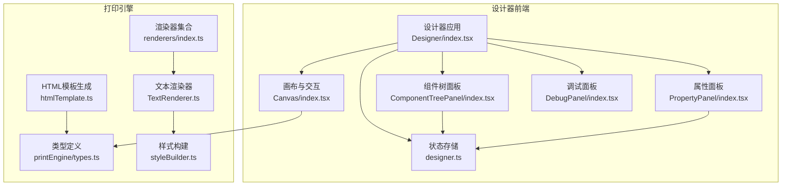
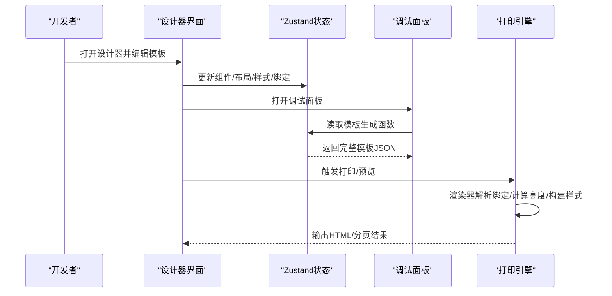
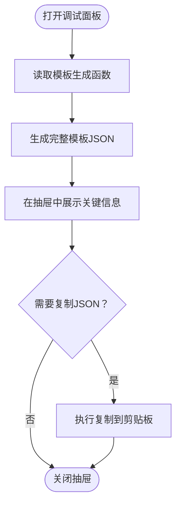
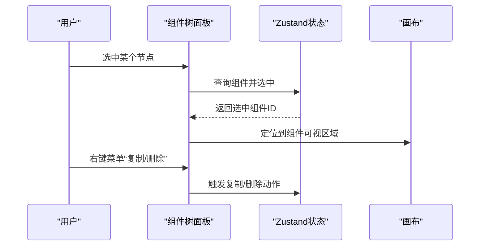
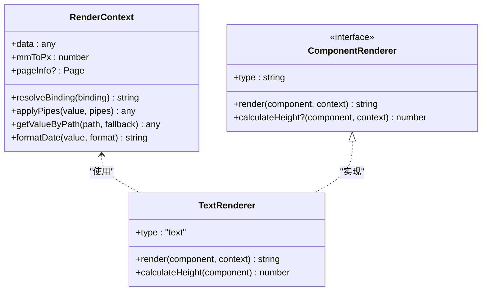
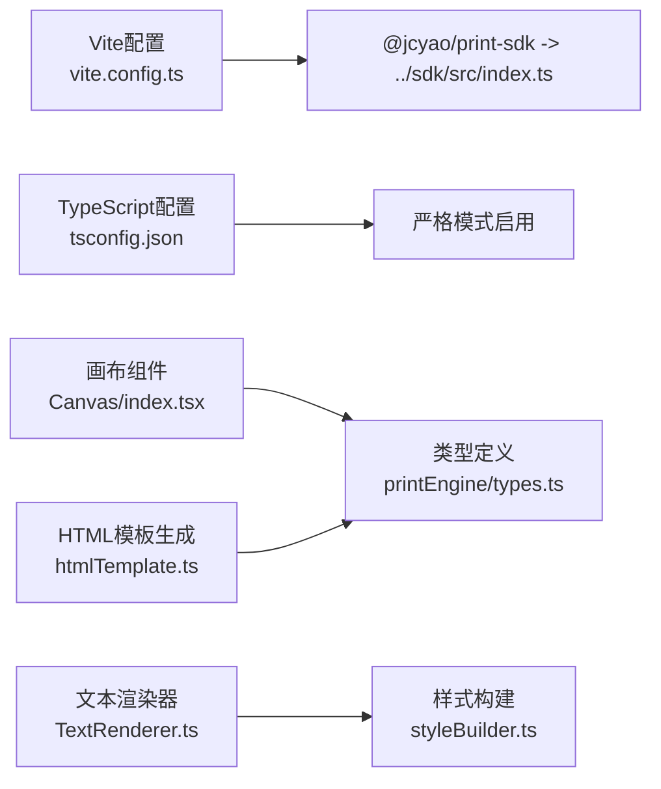

# 调试技巧

<cite>
**本文引用的文件**   
- [调试面板组件](file://designer/src/pages/Designer/components/DebugPanel/index.tsx)
- [设计器主界面](file://designer/src/pages/Designer/index.tsx)
- [设计器状态存储（Zustand）](file://designer/src/store/designer.ts)
- [组件树面板](file://designer/src/pages/Designer/components/ComponentTreePanel/index.tsx)
- [属性面板](file://designer/src/pages/Designer/components/PropertyPanel/index.tsx)
- [画布区域与交互](file://designer/src/pages/Designer/components/Canvas/index.tsx)
- [Vite 开发配置（本地SDK映射）](file://designer/vite.config.ts)
- [TypeScript 编译配置](file://designer/tsconfig.json)
- [打印引擎类型定义](file://sdk/src/printEngine/types.ts)
- [渲染器导出入口](file://sdk/src/printEngine/renderers/index.ts)
- [文本渲染器](file://sdk/src/printEngine/renderers/TextRenderer.ts)
- [样式构建工具](file://sdk/src/printEngine/utils/styleBuilder.ts)
- [打印HTML模板生成器](file://sdk/src/printEngine/htmlTemplate.ts)
</cite>

## 目录
1. [简介](#简介)
2. [项目结构](#项目结构)
3. [核心组件](#核心组件)
4. [架构总览](#架构总览)
5. [详细组件分析](#详细组件分析)
6. [依赖关系分析](#依赖关系分析)
7. [性能考量](#性能考量)
8. [故障排查指南](#故障排查指南)
9. [结论](#结论)
10. [附录](#附录)

## 简介
本指南面向React开发者，聚焦于打印平台的设计器与打印引擎的调试实践，涵盖以下主题：
- React开发者工具使用：组件树检查、状态查看、性能分析
- TypeScript调试配置：断点设置、变量监视、调用栈分析
- 设计器调试面板：状态监控、组件信息查看、渲染性能分析
- 打印引擎调试：分页计算、渲染器行为、数据绑定
- 常见问题排查：组件渲染异常、数据绑定错误、打印效果偏差

## 项目结构
该仓库采用“多包”结构：
- designer：可视化设计器前端（React + Zustand）
- sdk：打印引擎与渲染器（TypeScript）
- server：后端路由与中间件（示例）
- docs：需求与技术文档

图表来源
- [设计器主界面:17-279](file://designer/src/pages/Designer/index.tsx#L17-L279)
- [设计器状态存储（Zustand）:85-539](file://designer/src/store/designer.ts#L85-L539)
- [画布区域与交互:20-800](file://designer/src/pages/Designer/components/Canvas/index.tsx#L20-L800)
- [组件树面板:74-176](file://designer/src/pages/Designer/components/ComponentTreePanel/index.tsx#L74-L176)
- [属性面板:16-129](file://designer/src/pages/Designer/components/PropertyPanel/index.tsx#L16-L129)
- [调试面板组件:9-74](file://designer/src/pages/Designer/components/DebugPanel/index.tsx#L9-L74)
- [打印引擎类型定义:11-116](file://sdk/src/printEngine/types.ts#L11-L116)
- [渲染器导出入口:5-13](file://sdk/src/printEngine/renderers/index.ts#L5-L13)
- [文本渲染器:10-60](file://sdk/src/printEngine/renderers/TextRenderer.ts#L10-L60)
- [样式构建工具:13-53](file://sdk/src/printEngine/utils/styleBuilder.ts#L13-L53)
- [打印HTML模板生成器:81-274](file://sdk/src/printEngine/htmlTemplate.ts#L81-L274)

章节来源
- [设计器主界面:17-279](file://designer/src/pages/Designer/index.tsx#L17-L279)
- [设计器状态存储（Zustand）:85-539](file://designer/src/store/designer.ts#L85-L539)

## 核心组件
- 设计器状态存储（Zustand）：集中管理组件列表、选中状态、模板信息、撤销/重做、网格与对齐、页面配置等。提供模板生成能力，便于调试输出完整模板结构。
- 调试面板：以抽屉形式展示模板名称、Schema ID、组件数量与完整模板JSON，支持一键复制，便于快速比对与分享。
- 组件树面板：以树形结构展示组件层级，支持选中定位与右键菜单操作（复制、删除），便于快速定位组件与验证数据绑定路径。
- 属性面板：按布局、样式、数据绑定、表格列等模块化展示组件属性，支持实时修改与联动更新。
- 画布区域：负责组件拖拽、缩放、对齐、快捷键、网格吸附、边界检测、打印预览等交互逻辑。

章节来源
- [设计器状态存储（Zustand）:85-539](file://designer/src/store/designer.ts#L85-L539)
- [调试面板组件:9-74](file://designer/src/pages/Designer/components/DebugPanel/index.tsx#L9-L74)
- [组件树面板:74-176](file://designer/src/pages/Designer/components/ComponentTreePanel/index.tsx#L74-L176)
- [属性面板:16-129](file://designer/src/pages/Designer/components/PropertyPanel/index.tsx#L16-L129)
- [画布区域与交互:20-800](file://designer/src/pages/Designer/components/Canvas/index.tsx#L20-L800)

## 架构总览
设计器通过Zustand集中管理状态，组件树与属性面板作为UI入口，调试面板提供模板快照；打印引擎通过类型定义与渲染器实现组件到HTML的转换，并由HTML模板生成器统一注入样式与分页策略。

图表来源
- [设计器主界面:24-48](file://designer/src/pages/Designer/index.tsx#L24-L48)
- [设计器状态存储（Zustand）:138-148](file://designer/src/store/designer.ts#L138-L148)
- [调试面板组件:13-17](file://designer/src/pages/Designer/components/DebugPanel/index.tsx#L13-L17)
- [打印引擎类型定义:11-82](file://sdk/src/printEngine/types.ts#L11-L82)
- [文本渲染器:13-53](file://sdk/src/printEngine/renderers/TextRenderer.ts#L13-L53)

## 详细组件分析

### 调试面板（模板快照与复制）
- 功能要点
  - 固定悬浮按钮触发抽屉，展示模板名称、Schema ID、组件数量
  - 一键复制完整模板JSON，便于对比与回放
- 调试价值
  - 快速核对模板结构与数据一致性
  - 与后端/SDK进行模板一致性校验
- 使用建议
  - 在关键操作（新增/删除/复制/粘贴/撤销/重做）后打开抽屉核对模板JSON
  - 将JSON粘贴至测试脚本或SDK示例中验证渲染

图表来源
- [调试面板组件:9-74](file://designer/src/pages/Designer/components/DebugPanel/index.tsx#L9-L74)
- [设计器状态存储（Zustand）:138-148](file://designer/src/store/designer.ts#L138-L148)

章节来源
- [调试面板组件:9-74](file://designer/src/pages/Designer/components/DebugPanel/index.tsx#L9-L74)
- [设计器状态存储（Zustand）:138-148](file://designer/src/store/designer.ts#L138-L148)

### 组件树面板（层级与定位）
- 功能要点
  - 树形展示组件类型与索引，支持右键菜单（复制、删除）
  - 选中节点自动滚动到画布可视区域，便于定位
- 调试价值
  - 快速识别组件层级与绑定路径
  - 定位复杂布局下的组件归属
- 使用建议
  - 在组件渲染异常时，优先检查组件树中绑定路径与类型
  - 结合属性面板确认props与style是否符合预期

图表来源
- [组件树面板:74-176](file://designer/src/pages/Designer/components/ComponentTreePanel/index.tsx#L74-L176)
- [设计器状态存储（Zustand）:108-125](file://designer/src/store/designer.ts#L108-L125)

章节来源
- [组件树面板:74-176](file://designer/src/pages/Designer/components/ComponentTreePanel/index.tsx#L74-L176)
- [设计器状态存储（Zustand）:108-125](file://designer/src/store/designer.ts#L108-L125)

### 属性面板（布局/样式/数据绑定）
- 功能要点
  - 分模块展示布局、样式、数据绑定、表格列等
  - 实时更新组件属性，联动Zustand状态
- 调试价值
  - 快速验证布局参数（x/y/宽高/z-index）
  - 检查样式与props对渲染的影响
- 使用建议
  - 修改布局后观察画布中组件变化
  - 修改数据绑定后结合调试面板核对模板JSON

章节来源
- [属性面板:16-129](file://designer/src/pages/Designer/components/PropertyPanel/index.tsx#L16-L129)
- [设计器状态存储（Zustand）:93-99](file://designer/src/store/designer.ts#L93-L99)

### 画布区域（交互与边界）
- 功能要点
  - 组件拖拽、缩放、对齐、分布、快捷键（复制/粘贴/撤销/重做/删除/克隆）
  - 网格吸附、智能对齐、边界检测、连续纸模式
  - 打开打印预览
- 调试价值
  - 定位组件越界、吸附异常、对齐偏差
  - 验证页面配置（尺寸、方向、边距）对布局的影响
- 使用建议
  - 使用“Shift+拖拽”临时禁用网格吸附，验证对齐逻辑
  - 在连续纸模式下关注内容高度与最小高度配置

章节来源
- [画布区域与交互:20-800](file://designer/src/pages/Designer/components/Canvas/index.tsx#L20-L800)
- [设计器状态存储（Zustand）:231-236](file://designer/src/store/designer.ts#L231-L236)

### 打印引擎（渲染器与分页）
- 类型与接口
  - RenderContext：提供数据绑定解析、管道应用、路径取值、日期格式化、mm→px系数、页面信息
  - ComponentRenderer：组件渲染器接口，统一render/calculateHeight
- 渲染器示例
  - 文本渲染器：解析绑定值、拼接label、构建定位与文本样式、返回HTML字符串
- 样式与模板
  - 样式构建工具：将样式对象转为CSS字符串，构建绝对定位样式
  - HTML模板生成器：生成打印样式（预览/批量）、页面尺寸提取、完整HTML文档

图表来源
- [打印引擎类型定义:11-82](file://sdk/src/printEngine/types.ts#L11-L82)
- [文本渲染器:10-60](file://sdk/src/printEngine/renderers/TextRenderer.ts#L10-L60)

章节来源
- [打印引擎类型定义:11-82](file://sdk/src/printEngine/types.ts#L11-L82)
- [渲染器导出入口:5-13](file://sdk/src/printEngine/renderers/index.ts#L5-L13)
- [文本渲染器:10-60](file://sdk/src/printEngine/renderers/TextRenderer.ts#L10-L60)
- [样式构建工具:13-53](file://sdk/src/printEngine/utils/styleBuilder.ts#L13-L53)
- [打印HTML模板生成器:81-274](file://sdk/src/printEngine/htmlTemplate.ts#L81-L274)

## 依赖关系分析
- 设计器前端
  - Vite别名将@jcyao/print-sdk指向本地SDK源码，便于开发联调
  - TypeScript严格模式开启，提升类型安全
- 打印引擎
  - 渲染器依赖类型定义与样式构建工具
  - HTML模板生成器统一注入组件基础样式与分页策略

图表来源
- [Vite 开发配置（本地SDK映射）:6-14](file://designer/vite.config.ts#L6-L14)
- [TypeScript 编译配置:1-26](file://designer/tsconfig.json#L1-L26)
- [画布区域与交互:20-800](file://designer/src/pages/Designer/components/Canvas/index.tsx#L20-L800)
- [打印引擎类型定义:11-82](file://sdk/src/printEngine/types.ts#L11-L82)
- [文本渲染器:10-60](file://sdk/src/printEngine/renderers/TextRenderer.ts#L10-L60)
- [样式构建工具:13-53](file://sdk/src/printEngine/utils/styleBuilder.ts#L13-L53)
- [打印HTML模板生成器:81-274](file://sdk/src/printEngine/htmlTemplate.ts#L81-L274)

章节来源
- [Vite 开发配置（本地SDK映射）:6-14](file://designer/vite.config.ts#L6-L14)
- [TypeScript 编译配置:1-26](file://designer/tsconfig.json#L1-L26)

## 性能考量
- 设计器侧
  - 使用Zustand集中状态管理，减少不必要的重渲染
  - 画布拖拽与对齐检测在移动事件中应避免频繁写入状态，必要时节流
  - 组件树与属性面板按需渲染，避免大列表全量更新
- 打印引擎侧
  - 渲染器尽量复用样式构建与模板生成逻辑
  - 分页计算时优先使用calculateHeight估算高度，减少真实DOM测量
  - 连续纸模式下注意内容高度动态计算的成本

## 故障排查指南

### React开发者工具使用
- 组件树检查
  - 定位组件层级与渲染次数，识别异常重复渲染
  - 结合组件树面板与属性面板，确认props与state一致性
- 状态查看
  - 在Zustand状态中查看components、selectedComponentId、pageConfig等关键字段
  - 关注历史记录（撤销/重做）与网格/对齐状态
- 性能分析
  - 使用时间线查看渲染耗时，关注拖拽与对齐过程中的重绘
  - 在连续纸模式下观察内容高度变化导致的重排

章节来源
- [组件树面板:74-176](file://designer/src/pages/Designer/components/ComponentTreePanel/index.tsx#L74-L176)
- [属性面板:16-129](file://designer/src/pages/Designer/components/PropertyPanel/index.tsx#L16-L129)
- [设计器状态存储（Zustand）:85-539](file://designer/src/store/designer.ts#L85-L539)

### TypeScript调试配置
- 断点设置
  - 在Zustand动作（如updateComponent、alignComponents）中设置断点，观察状态变更轨迹
  - 在渲染器render/calculateHeight中设置断点，检查绑定解析与样式构建
- 变量监视
  - 监视RenderContext中的data、pageInfo、mmToPx等关键变量
  - 观察组件布局与样式对象在styleBuilder中的转换
- 调用栈分析
  - 在画布拖拽事件中查看调用链，定位越界、吸附、对齐异常的根因

章节来源
- [设计器状态存储（Zustand）:93-99](file://designer/src/store/designer.ts#L93-L99)
- [文本渲染器:13-53](file://sdk/src/printEngine/renderers/TextRenderer.ts#L13-L53)
- [样式构建工具:13-53](file://sdk/src/printEngine/utils/styleBuilder.ts#L13-L53)
- [画布区域与交互:434-562](file://designer/src/pages/Designer/components/Canvas/index.tsx#L434-L562)

### 设计器调试面板使用
- 状态监控
  - 通过模板名称、Schema ID、组件数量快速判断模板状态
- 组件信息查看
  - 复制模板JSON后，在SDK示例或测试脚本中运行，验证渲染一致性
- 渲染性能分析
  - 在组件数量较多时，观察调试面板JSON体积与复制耗时
  - 对比不同页面配置（尺寸、方向、边距）对模板结构的影响

章节来源
- [调试面板组件:9-74](file://designer/src/pages/Designer/components/DebugPanel/index.tsx#L9-L74)
- [设计器状态存储（Zustand）:138-148](file://designer/src/store/designer.ts#L138-L148)

### 打印引擎调试技巧
- 分页计算调试
  - 在渲染器中设置断点，检查calculateHeight返回值与实际布局
  - 使用HTML模板生成器的页面尺寸配置，验证分页边界
- 渲染器调试
  - 文本渲染器：检查resolveBinding、label拼接、样式构建
  - 样式构建：确认buildStyleString输出的CSS字符串正确性
- 数据绑定调试
  - 在RenderContext中验证resolveBinding与applyPipes的行为
  - 检查getValueByPath与formatDate的路径与格式化结果

章节来源
- [打印引擎类型定义:11-82](file://sdk/src/printEngine/types.ts#L11-L82)
- [文本渲染器:13-53](file://sdk/src/printEngine/renderers/TextRenderer.ts#L13-L53)
- [样式构建工具:13-53](file://sdk/src/printEngine/utils/styleBuilder.ts#L13-L53)
- [打印HTML模板生成器:81-274](file://sdk/src/printEngine/htmlTemplate.ts#L81-L274)

### 常见问题排查步骤
- 组件渲染问题
  - 检查组件树中绑定路径是否存在
  - 在属性面板中调整样式与props，观察画布变化
  - 使用调试面板复制模板JSON，验证渲染器输入
- 数据绑定异常
  - 在RenderContext中验证路径解析与fallback
  - 检查管道配置（pipes）是否正确
- 打印效果问题
  - 校验页面配置（尺寸、方向、边距）与HTML模板生成
  - 在连续纸模式下检查最小高度与内容高度

章节来源
- [组件树面板:74-176](file://designer/src/pages/Designer/components/ComponentTreePanel/index.tsx#L74-L176)
- [属性面板:16-129](file://designer/src/pages/Designer/components/PropertyPanel/index.tsx#L16-L129)
- [调试面板组件:9-74](file://designer/src/pages/Designer/components/DebugPanel/index.tsx#L9-L74)
- [打印HTML模板生成器:81-274](file://sdk/src/printEngine/htmlTemplate.ts#L81-L274)

## 结论
通过结合React开发者工具、Zustand状态检查、调试面板快照与打印引擎渲染器，可以系统性地定位与解决设计器与打印过程中的问题。建议在关键流程（增删改、对齐、分页）后使用调试面板核对模板JSON，并在渲染器与样式构建处设置断点进行深入分析。

## 附录
- 开发环境
  - Vite本地SDK映射：@jcyao/print-sdk → ../sdk/src/index.ts
  - TypeScript严格模式：提升类型安全与早期错误发现
- 推荐工作流
  - 新增组件后立即打开调试面板核对模板JSON
  - 修改布局/样式后在画布中观察变化
  - 出现异常时逐步缩小范围：组件树→属性面板→渲染器→样式构建→HTML模板