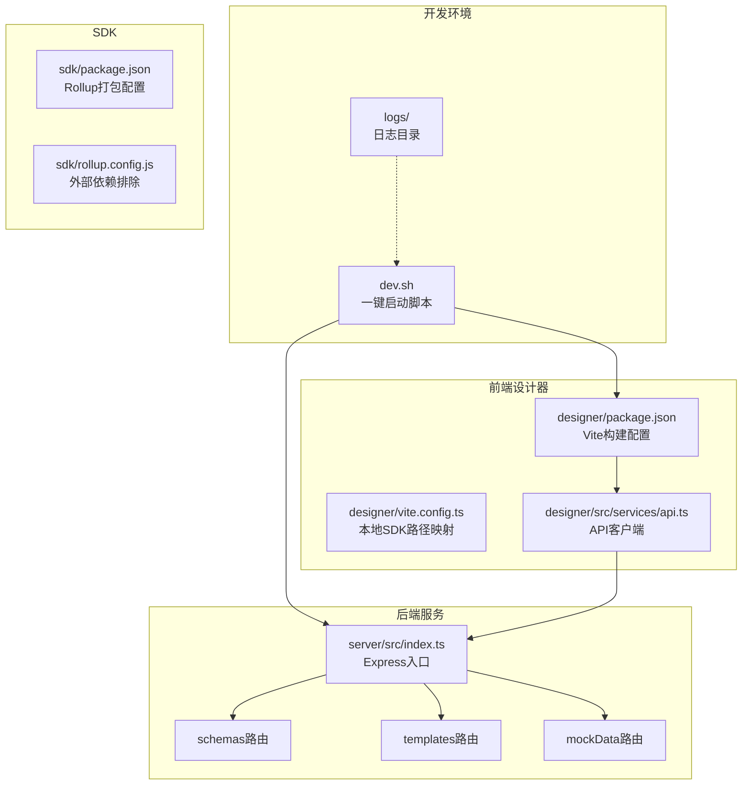
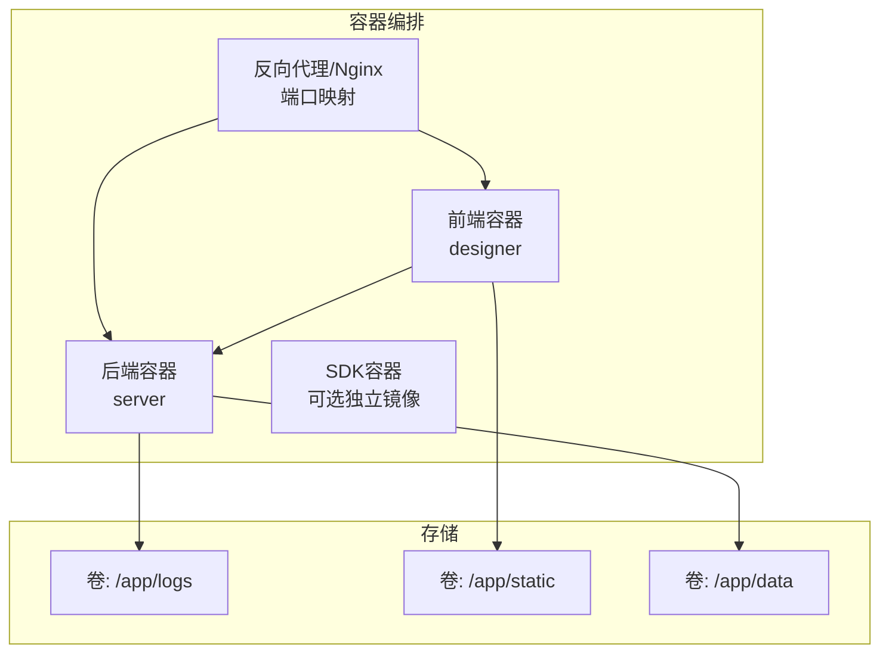
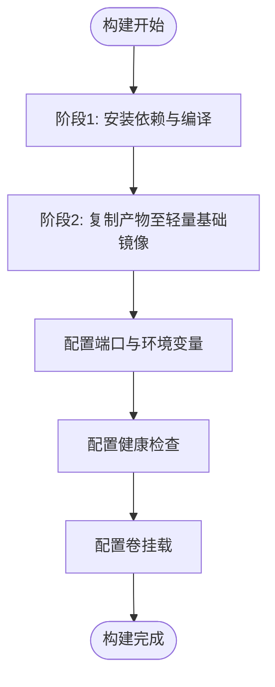
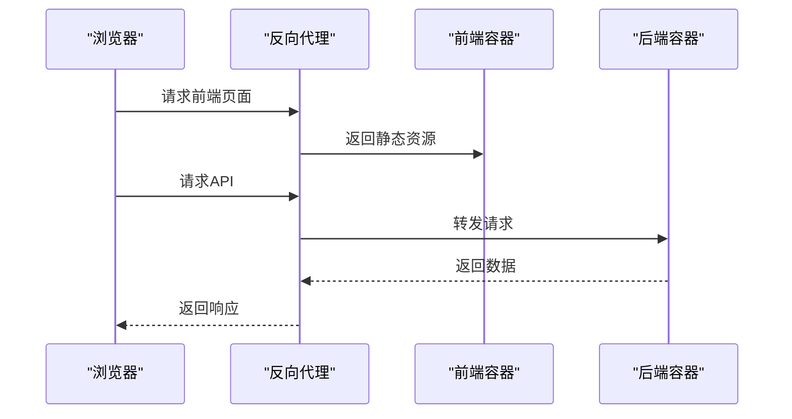
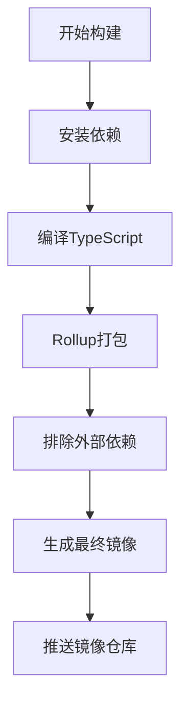
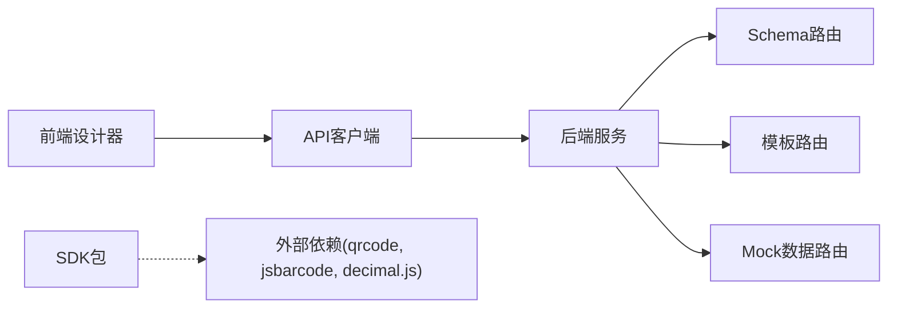

# Docker容器化部署

<cite>
**本文档引用的文件**
- [README.md](file://README.md)
- [DEV_README.md](file://DEV_README.md)
- [dev.sh](file://dev.sh)
- [server/src/index.ts](file://server/src/index.ts)
- [server/src/routes/schemas.ts](file://server/src/routes/schemas.ts)
- [server/src/routes/templates.ts](file://server/src/routes/templates.ts)
- [server/src/routes/mockData.ts](file://server/src/routes/mockData.ts)
- [designer/package.json](file://designer/package.json)
- [designer/vite.config.ts](file://designer/vite.config.ts)
- [designer/src/services/api.ts](file://designer/src/services/api.ts)
- [server/package.json](file://server/package.json)
- [sdk/package.json](file://sdk/package.json)
- [sdk/rollup.config.js](file://sdk/rollup.config.js)
- [designer/tsconfig.json](file://designer/tsconfig.json)
</cite>

## 目录
1. [简介](#简介)
2. [项目结构](#项目结构)
3. [核心组件](#核心组件)
4. [架构概览](#架构概览)
5. [详细组件分析](#详细组件分析)
6. [依赖关系分析](#依赖关系分析)
7. [性能考量](#性能考量)
8. [故障排除指南](#故障排除指南)
9. [结论](#结论)
10. [附录](#附录)

## 简介
本文件为打印平台提供完整的Docker容器化部署方案，涵盖Dockerfile编写指南（多阶段构建与镜像体积优化）、Docker Compose编排配置（服务定义、网络与卷挂载）、容器间通信与数据持久化、生产环境最佳实践（资源限制、健康检查、日志收集）、监控与日志管理、升级与回滚策略，以及Kubernetes部署配置与集群管理建议。

## 项目结构
打印平台由三个主要模块组成：
- 设计器前端（React + Vite）
- 后端服务（Node.js + Express）
- SDK（独立的打印SDK包）

开发环境通过一键脚本同时启动前端与后端，并输出日志到本地目录；生产环境建议通过容器编排进行部署与管理。

**图表来源**
- [dev.sh:1-102](file://dev.sh#L1-L102)
- [server/src/index.ts:1-25](file://server/src/index.ts#L1-L25)
- [designer/package.json:1-43](file://designer/package.json#L1-L43)
- [designer/vite.config.ts:1-15](file://designer/vite.config.ts#L1-L15)
- [designer/src/services/api.ts:1-97](file://designer/src/services/api.ts#L1-L97)
- [sdk/rollup.config.js:1-25](file://sdk/rollup.config.js#L1-L25)

**章节来源**
- [README.md:191-234](file://README.md#L191-L234)
- [DEV_README.md:27-52](file://DEV_README.md#L27-L52)
- [dev.sh:1-102](file://dev.sh#L1-L102)

## 核心组件
- 后端服务（server）
  - 基于Express框架，提供REST API接口，支持Schema、模板与Mock数据管理。
  - 默认监听端口可通过环境变量配置。
- 前端设计器（designer）
  - 基于React + Vite，提供可视化模板设计器与打印预览。
  - 本地开发时通过Vite配置将SDK路径映射到本地源码，便于调试。
- SDK（sdk）
  - 独立的打印SDK包，使用Rollup打包，对外部依赖采用外部化策略，减少包体体积。

**章节来源**
- [server/src/index.ts:1-25](file://server/src/index.ts#L1-L25)
- [server/src/routes/schemas.ts:1-178](file://server/src/routes/schemas.ts#L1-L178)
- [server/src/routes/templates.ts:1-1081](file://server/src/routes/templates.ts#L1-L1081)
- [server/src/routes/mockData.ts:1-448](file://server/src/routes/mockData.ts#L1-L448)
- [designer/package.json:1-43](file://designer/package.json#L1-L43)
- [designer/vite.config.ts:1-15](file://designer/vite.config.ts#L1-L15)
- [sdk/package.json:1-60](file://sdk/package.json#L1-L60)
- [sdk/rollup.config.js:1-25](file://sdk/rollup.config.js#L1-L25)

## 架构概览
容器化部署采用多阶段构建策略，后端与前端分别构建镜像，通过反向代理或直接暴露端口提供服务。容器间通信通过内部网络与服务名解析实现，数据持久化通过卷挂载实现。

[此图为概念性架构示意，无需图表来源]

## 详细组件分析

### 后端服务容器化（server）
- 多阶段构建
  - 阶段1：使用Node.js官方镜像安装依赖并编译TypeScript源码。
  - 阶段2：使用更小的基础镜像（如Alpine），仅复制编译产物，减少镜像体积。
- 端口与环境变量
  - 默认监听端口3000，可通过环境变量覆盖。
- 健康检查
  - 提供HTTP健康检查端点，定期探测服务可用性。
- 日志与卷挂载
  - 将日志目录映射到宿主机卷，便于采集与持久化。

[此图为流程图示意，无需图表来源]

**章节来源**
- [server/src/index.ts:1-25](file://server/src/index.ts#L1-L25)
- [server/package.json:1-25](file://server/package.json#L1-L25)

### 前端设计器容器化（designer）
- 多阶段构建
  - 阶段1：安装依赖并构建静态资源。
  - 阶段2：使用Nginx或轻量Web服务器提供静态文件服务。
- 端口与反向代理
  - 前端容器暴露静态资源端口，通过反向代理转发API请求至后端容器。
- 开发与生产差异
  - 开发模式使用Vite热更新，生产模式使用构建后的静态文件。

**图表来源**
- [designer/src/services/api.ts:1-97](file://designer/src/services/api.ts#L1-L97)
- [designer/vite.config.ts:1-15](file://designer/vite.config.ts#L1-L15)

**章节来源**
- [designer/package.json:1-43](file://designer/package.json#L1-L43)
- [designer/vite.config.ts:1-15](file://designer/vite.config.ts#L1-L15)
- [designer/src/services/api.ts:1-97](file://designer/src/services/api.ts#L1-L97)

### SDK容器化（sdk）
- 多阶段构建
  - 阶段1：使用Node.js镜像进行TypeScript编译与Rollup打包。
  - 阶段2：复制打包产物至最小化运行时环境。
- 外部依赖处理
  - 通过Rollup配置将外部依赖排除，减少最终包体积。
- 使用场景
  - 可作为独立容器提供SDK服务，或直接集成到其他应用中。

**图表来源**
- [sdk/rollup.config.js:1-25](file://sdk/rollup.config.js#L1-L25)
- [sdk/package.json:1-60](file://sdk/package.json#L1-L60)

**章节来源**
- [sdk/rollup.config.js:1-25](file://sdk/rollup.config.js#L1-L25)
- [sdk/package.json:1-60](file://sdk/package.json#L1-L60)

## 依赖关系分析
- 前端依赖后端API，通过硬编码的API基础URL进行通信。
- 后端内部模块之间通过路由模块解耦，便于容器化部署。
- SDK作为独立包，通过外部依赖策略降低体积。

**图表来源**
- [designer/src/services/api.ts:1-97](file://designer/src/services/api.ts#L1-L97)
- [server/src/index.ts:1-25](file://server/src/index.ts#L1-L25)
- [server/src/routes/schemas.ts:1-178](file://server/src/routes/schemas.ts#L1-L178)
- [server/src/routes/templates.ts:1-1081](file://server/src/routes/templates.ts#L1-L1081)
- [server/src/routes/mockData.ts:1-448](file://server/src/routes/mockData.ts#L1-L448)
- [sdk/rollup.config.js:1-25](file://sdk/rollup.config.js#L1-L25)

**章节来源**
- [designer/src/services/api.ts:1-97](file://designer/src/services/api.ts#L1-L97)
- [server/src/index.ts:1-25](file://server/src/index.ts#L1-L25)

## 性能考量
- 镜像体积优化
  - 使用多阶段构建，仅复制必要文件。
  - 排除开发依赖与源码，减少镜像层数与体积。
- 启动性能
  - 后端使用生产模式启动，避免开发工具带来的额外开销。
  - 前端使用静态资源服务器，减少动态处理开销。
- 资源限制
  - 为容器设置CPU与内存限制，防止资源争用。
  - 合理配置并发数与连接池大小。

[本节为通用指导，无需章节来源]

## 故障排除指南
- 端口冲突
  - 若端口3000或5173被占用，可在环境变量中调整端口。
- 日志排查
  - 开发环境日志输出到本地logs目录，生产环境建议通过容器日志驱动收集。
- API连通性
  - 确认前端API基础URL与后端服务地址一致，容器网络中使用服务名进行解析。

**章节来源**
- [DEV_README.md:128-149](file://DEV_README.md#L128-L149)
- [designer/src/services/api.ts:1-97](file://designer/src/services/api.ts#L1-L97)

## 结论
通过多阶段构建与合理的镜像分层策略，打印平台可以在保证功能完整性的同时显著降低镜像体积。结合容器编排与卷挂载，能够实现稳定的生产部署与便捷的日志收集。配合健康检查与资源限制，可进一步提升系统的可靠性与可维护性。

[本节为总结，无需章节来源]

## 附录

### Dockerfile编写指南
- 后端Dockerfile要点
  - 使用多阶段构建，第一阶段安装依赖并编译，第二阶段仅复制编译产物。
  - 设置工作目录与非root用户运行，提升安全性。
  - 配置环境变量与健康检查。
- 前端Dockerfile要点
  - 使用Nginx或轻量Web服务器提供静态资源。
  - 将构建产物复制到只读目录，确保安全性。
- SDK Dockerfile要点
  - 采用与生产环境一致的打包流程，排除外部依赖。

**章节来源**
- [server/package.json:1-25](file://server/package.json#L1-L25)
- [designer/package.json:1-43](file://designer/package.json#L1-L43)
- [sdk/rollup.config.js:1-25](file://sdk/rollup.config.js#L1-L25)

### Docker Compose编排配置
- 服务定义
  - server：暴露端口3000，挂载日志与数据卷。
  - designer：暴露端口5173，通过反向代理访问后端API。
  - 可选：SDK服务（独立镜像）。
- 网络配置
  - 使用自定义桥接网络，容器间通过服务名解析。
- 卷挂载
  - logs：持久化后端日志。
  - static：持久化前端静态资源（如需）。
  - data：持久化后端数据（如需）。

**章节来源**
- [dev.sh:46-87](file://dev.sh#L46-L87)

### 容器间通信与数据持久化
- 通信
  - 前端通过反向代理访问后端API，后端内部模块通过路由解耦。
- 数据持久化
  - 日志与数据通过卷挂载到宿主机，便于备份与迁移。

**章节来源**
- [designer/src/services/api.ts:1-97](file://designer/src/services/api.ts#L1-L97)
- [dev.sh:46-87](file://dev.sh#L46-L87)

### 生产环境最佳实践
- 资源限制
  - 为容器设置CPU与内存限制，避免资源争用。
- 健康检查
  - 配置HTTP健康检查端点，定期探测服务可用性。
- 日志收集
  - 使用容器日志驱动（如JSON驱动），结合集中式日志系统（如ELK/Fluentd）。
- 安全加固
  - 使用非root用户运行容器，最小权限原则。
  - 禁用不必要的网络端口，启用网络安全组。

**章节来源**
- [server/src/index.ts:1-25](file://server/src/index.ts#L1-L25)

### 监控与日志管理
- 监控指标
  - CPU、内存、磁盘、网络使用率。
  - 应用指标：请求量、响应时间、错误率。
- 日志管理
  - 标准化日志格式，集中收集与索引。
  - 日志轮转与保留策略。

**章节来源**
- [dev.sh:98-101](file://dev.sh#L98-L101)

### 升级与回滚策略
- 灰度发布
  - 逐步替换容器实例，观察指标与日志。
- 回滚策略
  - 保留前一版本镜像，快速回滚。
  - 配置滚动更新参数，确保零停机。

**章节来源**
- [README.md:265-293](file://README.md#L265-L293)

### Kubernetes部署配置与集群管理
- Deployment与Service
  - 使用Deployment管理副本数与滚动更新。
  - 使用Service暴露服务，支持负载均衡。
- ConfigMap与Secret
  - 将配置与敏感信息通过ConfigMap/Secret注入。
- 存储
  - 使用PersistentVolume与PersistentVolumeClaim管理数据卷。
- 健康检查
  - 配置livenessProbe与readinessProbe。
- 资源管理
  - 设置requests与limits，合理分配资源。

**章节来源**
- [server/src/index.ts:1-25](file://server/src/index.ts#L1-L25)
- [designer/src/services/api.ts:1-97](file://designer/src/services/api.ts#L1-L97)