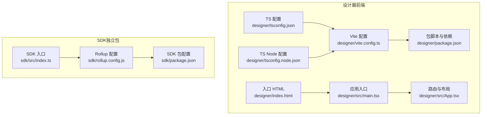
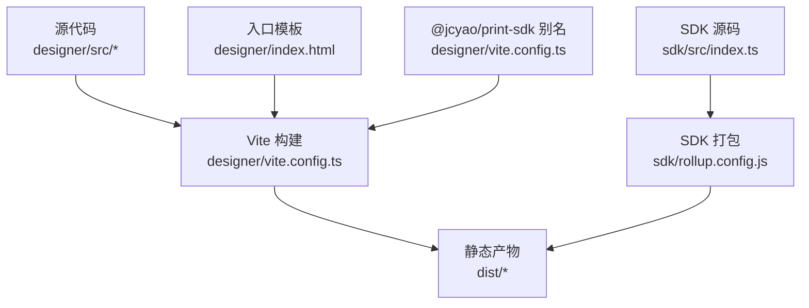
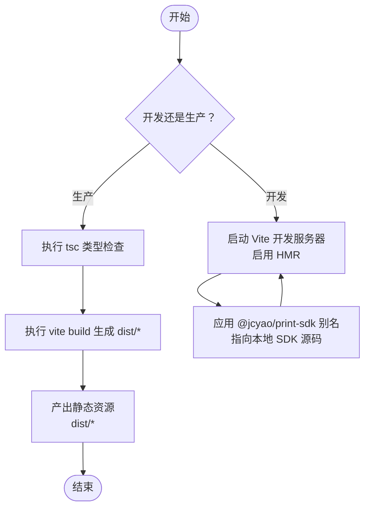
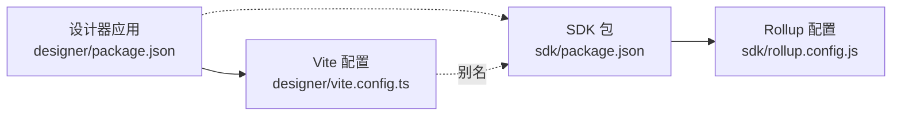

# 前端静态部署

<cite>
**本文引用的文件**
- [designer/vite.config.ts](file://designer/vite.config.ts)
- [designer/package.json](file://designer/package.json)
- [designer/index.html](file://designer/index.html)
- [designer/src/main.tsx](file://designer/src/main.tsx)
- [designer/src/App.tsx](file://designer/src/App.tsx)
- [designer/src/vite-env.d.ts](file://designer/src/vite-env.d.ts)
- [designer/tsconfig.json](file://designer/tsconfig.json)
- [designer/tsconfig.node.json](file://designer/tsconfig.node.json)
- [sdk/rollup.config.js](file://sdk/rollup.config.js)
- [sdk/package.json](file://sdk/package.json)
- [sdk/src/index.ts](file://sdk/src/index.ts)
- [README.md](file://README.md)
</cite>

## 目录
1. [简介](#简介)
2. [项目结构](#项目结构)
3. [核心组件](#核心组件)
4. [架构总览](#架构总览)
5. [详细组件分析](#详细组件分析)
6. [依赖分析](#依赖分析)
7. [性能考量](#性能考量)
8. [故障排查指南](#故障排查指南)
9. [结论](#结论)
10. [附录](#附录)

## 简介
本指南面向打印平台前端应用的静态部署，聚焦于 Vite 构建配置与产物生成流程，覆盖开发与生产差异、静态资源部署选项（Nginx/Apache/云存储）、CDN 与缓存策略、域名与 HTTPS、PWA 与离线缓存、部署验证与性能优化建议。本文所有技术要点均基于仓库中的实际配置与源码进行提炼与说明。

## 项目结构
- 前端设计器位于 designer 目录，采用 Vite + React + TypeScript 技术栈。
- SDK 位于 sdk 目录，采用 Rollup 打包，提供 ESM 与 CJS 两种格式，供外部集成使用。
- 顶层 README 提供整体架构、模块划分与快速开始说明。

图表来源
- [designer/vite.config.ts:1-15](file://designer/vite.config.ts#L1-L15)
- [designer/package.json:1-43](file://designer/package.json#L1-L43)
- [designer/index.html:1-14](file://designer/index.html#L1-L14)
- [designer/src/main.tsx:1-8](file://designer/src/main.tsx#L1-L8)
- [designer/src/App.tsx:1-31](file://designer/src/App.tsx#L1-L31)
- [designer/tsconfig.json:1-26](file://designer/tsconfig.json#L1-L26)
- [designer/tsconfig.node.json:1-12](file://designer/tsconfig.node.json#L1-L12)
- [sdk/rollup.config.js:1-25](file://sdk/rollup.config.js#L1-L25)
- [sdk/package.json:1-60](file://sdk/package.json#L1-L60)
- [sdk/src/index.ts:1-22](file://sdk/src/index.ts#L1-L22)

章节来源
- [README.md:191-234](file://README.md#L191-L234)

## 核心组件
- Vite 构建配置与别名映射：通过 Vite 配置为本地 SDK 提供路径别名，便于开发调试时直接引用本地源码。
- 包脚本与依赖：包含 dev/build/preview/lint 等常用命令；生产构建需先执行类型检查再进行打包。
- 应用入口与路由：React 应用通过 main.tsx 渲染根节点，App.tsx 定义路由与主布局。
- TypeScript 配置：采用 bundler 模式，确保与 Vite 的模块解析兼容。
- SDK 打包：Rollup 输出 ESM 与 CJS 两份产物，并将外部依赖保留为外部模块，减少体积。

章节来源
- [designer/vite.config.ts:1-15](file://designer/vite.config.ts#L1-L15)
- [designer/package.json:6-11](file://designer/package.json#L6-L11)
- [designer/src/main.tsx:1-8](file://designer/src/main.tsx#L1-L8)
- [designer/src/App.tsx:1-31](file://designer/src/App.tsx#L1-L31)
- [designer/tsconfig.json:9-15](file://designer/tsconfig.json#L9-L15)
- [sdk/rollup.config.js:1-25](file://sdk/rollup.config.js#L1-L25)
- [sdk/package.json:6-8](file://sdk/package.json#L6-L8)

## 架构总览
下图展示了从源码到静态产物的关键路径，以及与 SDK 的关系：

图表来源
- [designer/vite.config.ts:8-12](file://designer/vite.config.ts#L8-L12)
- [designer/index.html:1-14](file://designer/index.html#L1-L14)
- [sdk/src/index.ts:1-22](file://sdk/src/index.ts#L1-L22)
- [sdk/rollup.config.js:1-25](file://sdk/rollup.config.js#L1-L25)

## 详细组件分析

### Vite 构建配置与开发/生产差异
- 开发环境
  - 使用 Vite 内置的开发服务器，HMR 提升迭代效率。
  - 通过路径别名将 @jcyao/print-sdk 指向本地 SDK 源码，便于联调。
- 生产环境
  - 构建脚本顺序：先执行类型检查，再执行 Vite 打包，确保类型安全后再产出静态资源。
  - 产物目录为 Vite 默认的 dist，包含 HTML、JS、CSS、媒体等静态资源。
- 路由与入口
  - index.html 作为 SPA 入口，应用通过 main.tsx 渲染到 #root。
  - App.tsx 使用 BrowserRouter，支持前端路由。

图表来源
- [designer/package.json:8-10](file://designer/package.json#L8-L10)
- [designer/vite.config.ts:8-12](file://designer/vite.config.ts#L8-L12)
- [designer/index.html:1-14](file://designer/index.html#L1-L14)
- [designer/src/main.tsx:1-8](file://designer/src/main.tsx#L1-L8)
- [designer/src/App.tsx:1-31](file://designer/src/App.tsx#L1-L31)

章节来源
- [designer/package.json:6-11](file://designer/package.json#L6-L11)
- [designer/vite.config.ts:1-15](file://designer/vite.config.ts#L1-L15)
- [designer/index.html:1-14](file://designer/index.html#L1-L14)
- [designer/src/main.tsx:1-8](file://designer/src/main.tsx#L1-L8)
- [designer/src/App.tsx:1-31](file://designer/src/App.tsx#L1-L31)

### TypeScript 与类型检查
- 采用 bundler 模式，确保与 Vite 的模块解析一致。
- 顶层 tsconfig 引用 tsconfig.node.json，保证 Vite 配置文件也能被正确解析。

章节来源
- [designer/tsconfig.json:9-15](file://designer/tsconfig.json#L9-L15)
- [designer/tsconfig.node.json:1-12](file://designer/tsconfig.node.json#L1-L12)

### SDK 打包与外部依赖
- Rollup 输出 ESM 与 CJS 两份产物，保留外部依赖（如 qrcode、jsbarcode、decimal.js）为外部模块，减小体积并避免重复打包。
- SDK 包配置声明 main/module/types 字段，适配不同环境消费方式。

章节来源
- [sdk/rollup.config.js:1-25](file://sdk/rollup.config.js#L1-L25)
- [sdk/package.json:6-8](file://sdk/package.json#L6-L8)

### 静态资源部署选项
- Nginx
  - 将 dist 目录作为静态站点根目录，开启 gzip/br 压缩与缓存头。
  - 对 JS/CSS 设置较长缓存，对 HTML 设置较短缓存或 no-cache。
- Apache
  - 使用 .htaccess 或虚拟主机配置，启用压缩与缓存头。
  - 对静态资源设置 Expires/Cache-Control，对 HTML 设置 no-cache。
- 云存储服务（对象存储/CDN）
  - 将 dist 上传至对象存储桶，开启静态网站托管或 CDN 加速。
  - 配置缓存头与压缩，合理设置对象前缀与索引页。

说明
- 以上为通用实践建议，具体参数请结合业务与监控指标调整。

### CDN 配置与缓存策略
- 资源优化
  - 启用 Gzip/Brotli 压缩；开启 HTTP/2 或 HTTP/3。
  - 对 JS/CSS 进行分块与懒加载，减少首屏阻塞。
- 版本控制
  - 使用内容哈希命名文件（如 main.[contenthash].js），配合长期缓存。
  - HTML 不参与长缓存，或使用 no-cache/no-store。
- CDN 缓存
  - 静态资源：max-age 较长，s-maxage 较长。
  - 动态资源：短缓存或不缓存。

说明
- 本节为通用指导，未直接对应具体文件。

### 域名配置与 HTTPS 证书
- 域名解析
  - 将域名指向静态站点地址或 CDN 分发地址。
- HTTPS
  - 使用 Let’s Encrypt 或商业证书，配置自动续期。
  - 强制 HTTPS 重定向，启用 HSTS。

说明
- 本节为通用指导，未直接对应具体文件。

### PWA 与离线缓存策略
- Manifest 与 Service Worker
  - 生成 Web App Manifest，注册 Service Worker。
  - 缓存策略：静态资源走网络优先或缓存优先，HTML 走网络优先。
- 离线页面
  - 提供简化的离线页面，提示用户网络状态。

说明
- 本节为通用指导，未直接对应具体文件。

## 依赖分析
- 前端应用依赖 React、Ant Design、Monaco Editor、Zustand 等，构建由 Vite 驱动。
- SDK 依赖 qrcode、jsbarcode、decimal.js，通过 Rollup 打包为 ESM/CJS，外部依赖不内嵌。
- 开发阶段通过 Vite 别名将 @jcyao/print-sdk 指向本地 SDK 源码，便于联调。

图表来源
- [designer/package.json:12-28](file://designer/package.json#L12-L28)
- [sdk/package.json:49-53](file://sdk/package.json#L49-L53)
- [sdk/rollup.config.js:17-18](file://sdk/rollup.config.js#L17-L18)
- [designer/vite.config.ts:8-12](file://designer/vite.config.ts#L8-L12)

章节来源
- [designer/package.json:12-28](file://designer/package.json#L12-L28)
- [sdk/package.json:49-53](file://sdk/package.json#L49-L53)
- [sdk/rollup.config.js:17-18](file://sdk/rollup.config.js#L17-L18)
- [designer/vite.config.ts:8-12](file://designer/vite.config.ts#L8-L12)

## 性能考量
- 构建优化
  - 使用 Vite 的原生 ESM 与按需编译，提升开发与构建速度。
  - 合理拆分代码，利用动态 import 实现懒加载。
- 资源优化
  - 启用压缩与分块；对图片与字体进行压缩与格式优化。
  - 使用长缓存与内容哈希，结合 CDN 加速。
- 运行时优化
  - 减少不必要的重渲染，合理使用状态管理。
  - 对大列表使用虚拟滚动（如后续实现）。

说明
- 本节为通用指导，未直接对应具体文件。

## 故障排查指南
- 构建失败
  - 确认先执行类型检查再执行打包。
  - 检查 Vite 配置与别名是否正确指向本地 SDK。
- 路由 404
  - 确保服务器配置支持前端路由回退到 index.html。
- 资源加载错误
  - 检查静态资源路径与 CDN/对象存储的访问权限。
- HTTPS 问题
  - 确认证书安装与自动续期配置正确，强制 HTTPS。

章节来源
- [designer/package.json:8-10](file://designer/package.json#L8-L10)
- [designer/vite.config.ts:8-12](file://designer/vite.config.ts#L8-L12)
- [designer/index.html:1-14](file://designer/index.html#L1-L14)

## 结论
本指南基于仓库中的 Vite 与 Rollup 配置，梳理了从开发到生产的完整流程，并提供了静态部署、CDN 缓存、域名与 HTTPS、PWA 等实践建议。建议在生产环境中结合监控指标持续优化缓存与资源加载策略，确保最佳用户体验。

## 附录
- 快速开始与模块说明可参考顶层 README 的“快速开始”与“技术架构”部分。

章节来源
- [README.md:265-283](file://README.md#L265-L283)
- [README.md:163-187](file://README.md#L163-L187)