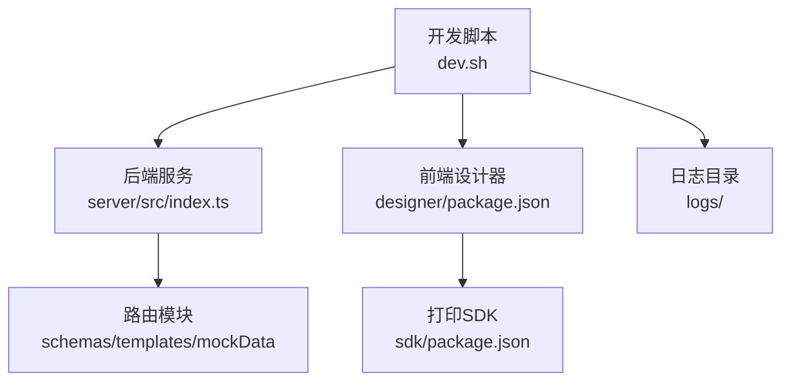
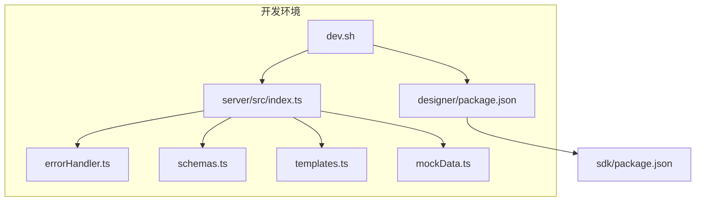
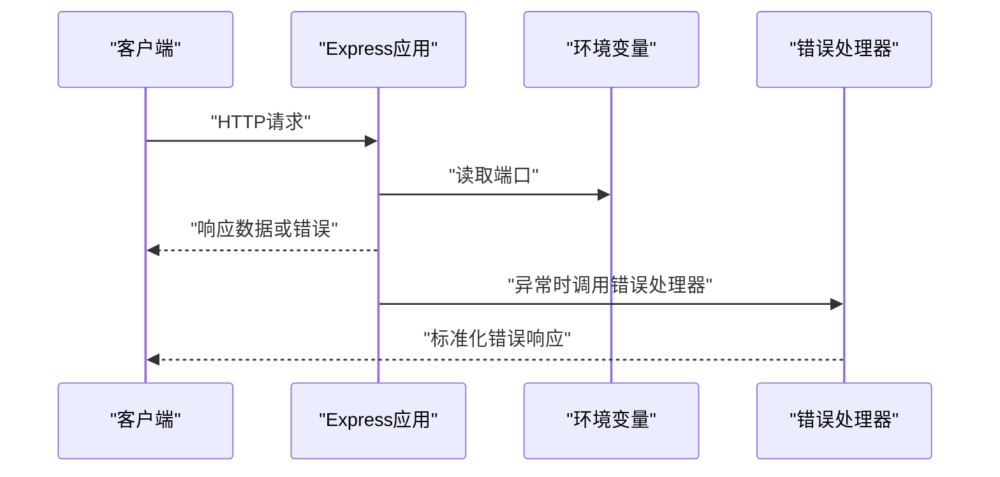
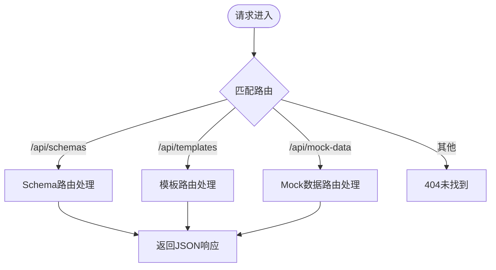
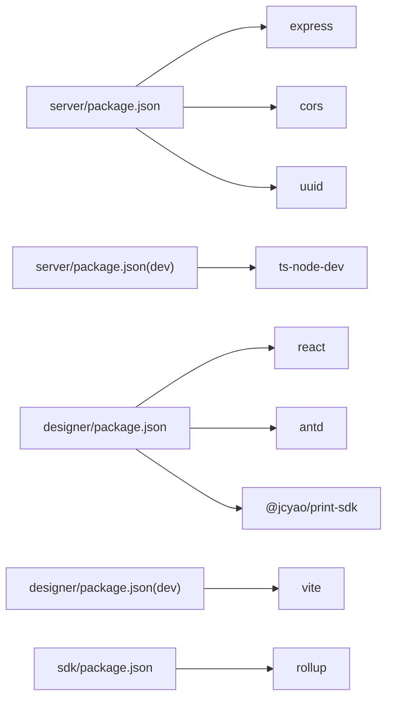
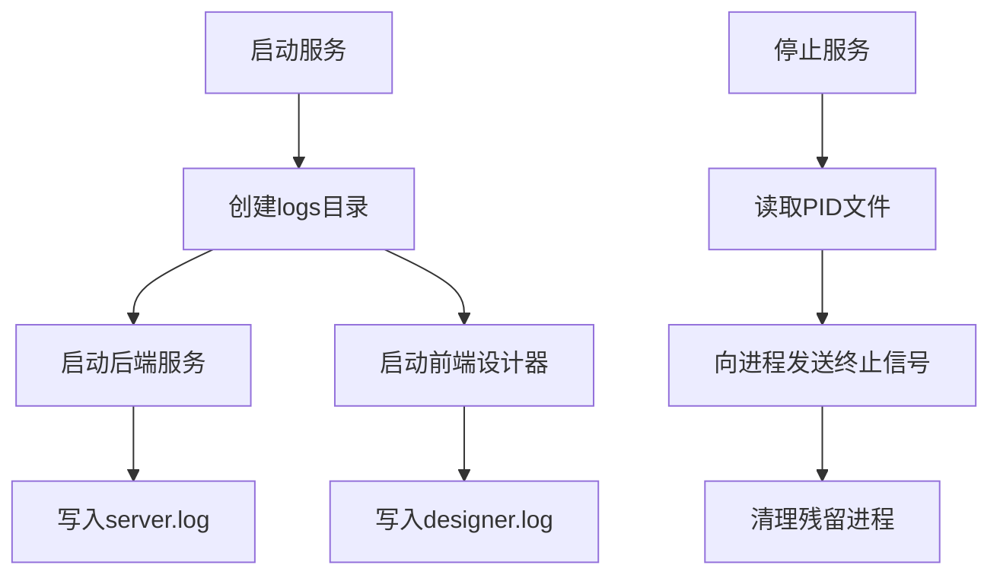

# 环境配置

<cite>
**本文引用的文件**
- [dev.sh](file://dev.sh)
- [stop.sh](file://stop.sh)
- [server/package.json](file://server/package.json)
- [designer/package.json](file://designer/package.json)
- [sdk/package.json](file://sdk/package.json)
- [server/src/index.ts](file://server/src/index.ts)
- [server/src/middlewares/errorHandler.ts](file://server/src/middlewares/errorHandler.ts)
- [.gitignore](file://.gitignore)
- [server/src/routes/schemas.ts](file://server/src/routes/schemas.ts)
- [server/src/routes/templates.ts](file://server/src/routes/templates.ts)
- [server/src/routes/mockData.ts](file://server/src/routes/mockData.ts)
- [sdk/src/printEngine/renderers/TableRenderer.ts](file://sdk/src/printEngine/renderers/TableRenderer.ts)
</cite>

## 目录
1. [简介](#简介)
2. [项目结构](#项目结构)
3. [核心组件](#核心组件)
4. [架构总览](#架构总览)
5. [详细组件分析](#详细组件分析)
6. [依赖关系分析](#依赖关系分析)
7. [性能考虑](#性能考虑)
8. [故障排查指南](#故障排查指南)
9. [结论](#结论)
10. [附录](#附录)

## 简介
本指南面向打印平台的运维与开发团队，提供从开发、测试到生产的环境配置方法与最佳实践。内容涵盖：
- 环境变量与配置差异
- 数据库连接、API密钥与日志级别的设置建议
- 进程管理与监控（含PM2配置思路）
- SSL证书与HTTPS部署要点
- 数据库连接池与缓存策略
- 日志与监控指标配置
- 配置文件管理与敏感信息保护

说明：当前仓库未包含数据库连接、缓存、日志框架与PM2配置等具体实现文件，因此本指南以“现有代码”为基础，结合通用工程实践给出可落地的配置建议与流程图示。

## 项目结构
打印平台采用前后端分离架构：
- server：基于Express的后端服务，提供Schema、模板与Mock数据的REST接口
- designer：基于Vite的前端设计器
- sdk：打印SDK，提供浏览器端打印能力
- dev.sh/stop.sh：一键启动与停止脚本，负责日志输出与进程管理

图表来源
- [dev.sh:1-102](file://dev.sh#L1-L102)
- [server/src/index.ts:1-25](file://server/src/index.ts#L1-L25)
- [designer/package.json:1-43](file://designer/package.json#L1-L43)
- [sdk/package.json:1-60](file://sdk/package.json#L1-L60)

章节来源
- [dev.sh:1-102](file://dev.sh#L1-L102)
- [server/src/index.ts:1-25](file://server/src/index.ts#L1-L25)
- [designer/package.json:1-43](file://designer/package.json#L1-L43)
- [sdk/package.json:1-60](file://sdk/package.json#L1-L60)

## 核心组件
- 后端服务入口：监听端口并挂载路由，统一错误处理
- 路由模块：提供Schema、模板与Mock数据的增删改查接口
- 前端设计器：本地开发使用Vite，构建产物用于预览与部署
- 打印SDK：提供渲染器与工具函数，支持表格汇总计算等

章节来源
- [server/src/index.ts:1-25](file://server/src/index.ts#L1-L25)
- [server/src/routes/schemas.ts:1-178](file://server/src/routes/schemas.ts#L1-L178)
- [server/src/routes/templates.ts:1-1081](file://server/src/routes/templates.ts#L1-L1081)
- [server/src/routes/mockData.ts:380-447](file://server/src/routes/mockData.ts#L380-L447)
- [designer/package.json:1-43](file://designer/package.json#L1-L43)
- [sdk/package.json:1-60](file://sdk/package.json#L1-L60)

## 架构总览
后端服务通过Express提供REST API，前端设计器通过Vite进行开发与构建，SDK作为客户端依赖集成到设计器或业务页面。

图表来源
- [server/src/index.ts:1-25](file://server/src/index.ts#L1-L25)
- [server/src/middlewares/errorHandler.ts:1-10](file://server/src/middlewares/errorHandler.ts#L1-L10)
- [server/src/routes/schemas.ts:1-178](file://server/src/routes/schemas.ts#L1-L178)
- [server/src/routes/templates.ts:1-1081](file://server/src/routes/templates.ts#L1-L1081)
- [server/src/routes/mockData.ts:380-447](file://server/src/routes/mockData.ts#L380-L447)
- [designer/package.json:1-43](file://designer/package.json#L1-L43)
- [sdk/package.json:1-60](file://sdk/package.json#L1-L60)

## 详细组件分析

### 后端服务与端口配置
- 端口：默认监听端口来自环境变量，若未设置则使用固定端口
- 中间件：启用CORS与JSON解析
- 错误处理：统一捕获异常并返回标准错误响应

图表来源
- [server/src/index.ts:1-25](file://server/src/index.ts#L1-L25)
- [server/src/middlewares/errorHandler.ts:1-10](file://server/src/middlewares/errorHandler.ts#L1-L10)

章节来源
- [server/src/index.ts:1-25](file://server/src/index.ts#L1-L25)
- [server/src/middlewares/errorHandler.ts:1-10](file://server/src/middlewares/errorHandler.ts#L1-L10)

### 路由与数据模型
- Schema路由：支持Schema字典的增删改查，内置示例Schema
- 模板路由：定义页面配置、组件节点与绑定规则
- Mock数据路由：支持按名称、SchemaID、模板ID过滤查询

图表来源
- [server/src/routes/schemas.ts:1-178](file://server/src/routes/schemas.ts#L1-L178)
- [server/src/routes/templates.ts:1-1081](file://server/src/routes/templates.ts#L1-L1081)
- [server/src/routes/mockData.ts:380-447](file://server/src/routes/mockData.ts#L380-L447)

章节来源
- [server/src/routes/schemas.ts:1-178](file://server/src/routes/schemas.ts#L1-L178)
- [server/src/routes/templates.ts:1-1081](file://server/src/routes/templates.ts#L1-L1081)
- [server/src/routes/mockData.ts:380-447](file://server/src/routes/mockData.ts#L380-L447)

### 前端设计器与SDK
- 设计器：使用Vite进行开发与构建，依赖React、Ant Design与打印SDK
- SDK：提供渲染器与工具函数，示例HTML用于演示

章节来源
- [designer/package.json:1-43](file://designer/package.json#L1-L43)
- [sdk/package.json:1-60](file://sdk/package.json#L1-L60)

## 依赖关系分析
- server依赖Express、CORS与UUID；开发期使用ts-node-dev热重载
- designer依赖React、Ant Design、打印SDK与Vite
- sdk为独立包，提供渲染器与工具

图表来源
- [server/package.json:1-25](file://server/package.json#L1-L25)
- [designer/package.json:1-43](file://designer/package.json#L1-L43)
- [sdk/package.json:1-60](file://sdk/package.json#L1-L60)

章节来源
- [server/package.json:1-25](file://server/package.json#L1-L25)
- [designer/package.json:1-43](file://designer/package.json#L1-L43)
- [sdk/package.json:1-60](file://sdk/package.json#L1-L60)

## 性能考虑
- 表格汇总计算：使用高精度数值库进行求和、平均、最值与计数，避免浮点误差
- 渲染缓存：QRCode渲染使用缓存键减少重复计算
- 服务器端口：通过环境变量动态配置端口，便于容器化与多实例部署

章节来源
- [sdk/src/printEngine/renderers/TableRenderer.ts:233-269](file://sdk/src/printEngine/renderers/TableRenderer.ts#L233-L269)
- [server/src/index.ts:20-24](file://server/src/index.ts#L20-L24)

## 故障排查指南
- 统一错误处理：后端对未捕获异常进行记录并返回标准错误响应
- 日志位置：dev.sh会创建logs目录并输出后端与前端日志文件
- 进程停止：stop.sh根据PID文件停止服务，并清理残留进程

图表来源
- [dev.sh:46-102](file://dev.sh#L46-L102)
- [stop.sh:12-37](file://stop.sh#L12-L37)
- [server/src/middlewares/errorHandler.ts:1-10](file://server/src/middlewares/errorHandler.ts#L1-L10)

章节来源
- [dev.sh:46-102](file://dev.sh#L46-L102)
- [stop.sh:12-37](file://stop.sh#L12-L37)
- [server/src/middlewares/errorHandler.ts:1-10](file://server/src/middlewares/errorHandler.ts#L1-L10)

## 结论
本指南基于现有代码梳理了打印平台的环境配置要点，并提供了可操作的流程与图示。对于未在仓库中出现的数据库、缓存、日志与PM2等组件，建议参考附录中的通用实践进行落地。

## 附录

### 环境变量与配置差异（建议）
- 开发环境
  - 端口：3000
  - 日志级别：DEBUG
  - CORS：允许任意来源
  - 数据库：本地或内存数据库
- 测试环境
  - 端口：3001
  - 日志级别：INFO
  - CORS：白名单域名
  - 数据库：独立测试库
- 生产环境
  - 端口：443/8443
  - 日志级别：WARN/ERROR
  - CORS：严格白名单
  - 数据库：主从复制、只读副本
  - HTTPS：启用SSL/TLS

### 数据库连接与连接池（建议）
- 连接池参数
  - 最小/最大连接数
  - 连接超时与空闲回收
  - 事务隔离级别
- 缓存策略
  - Redis/Memcached用于热点数据
  - 模板与Schema缓存
  - 缓存失效策略与降级

### 日志与监控（建议）
- 日志
  - 分环境输出至不同文件
  - JSON格式便于采集
  - 关键链路埋点
- 监控指标
  - QPS、响应时间、错误率
  - 连接池使用率
  - 缓存命中率

### 进程管理与PM2（建议）
- 应用名称与脚本
- 进程数与负载均衡
- 日志轮转与错误重启
- 健康检查与自动恢复

### SSL证书与HTTPS（建议）
- 证书申请与续期
- Nginx/Apache反向代理
- 强制HTTPS跳转
- 安全头部配置

### 配置文件管理与敏感信息保护（建议）
- 配置文件
  - 环境区分：.env.development、.env.test、.env.production
  - 忽略提交：.gitignore中加入.env*
- 敏感信息
  - 密钥与密码使用密钥管理服务
  - 禁止硬编码在源码中
  - 定期轮换与审计