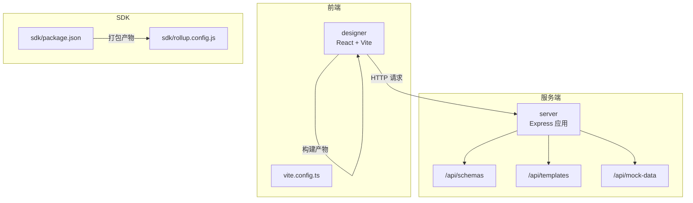
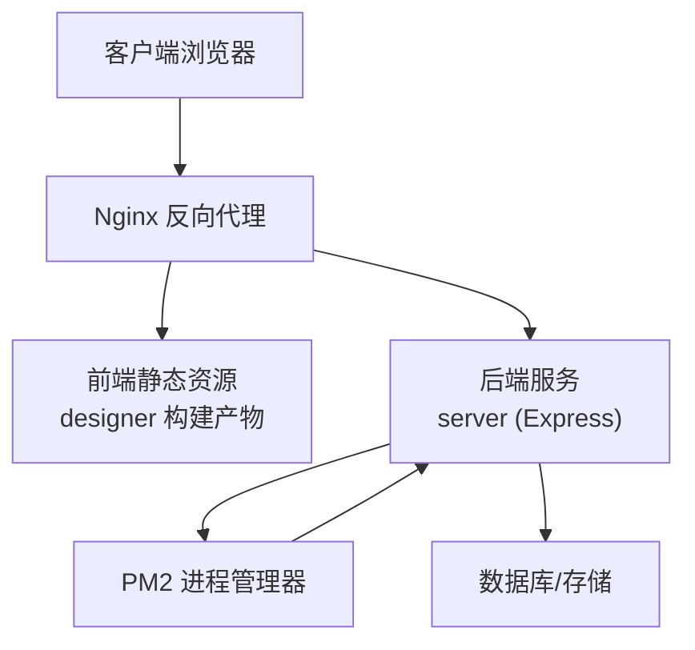
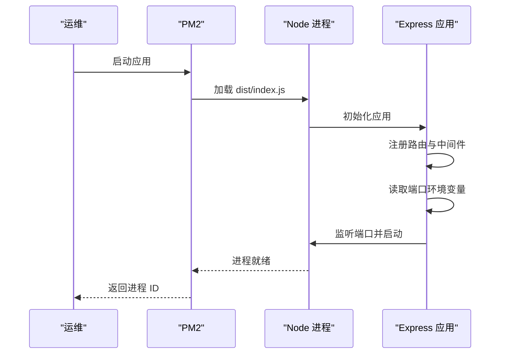
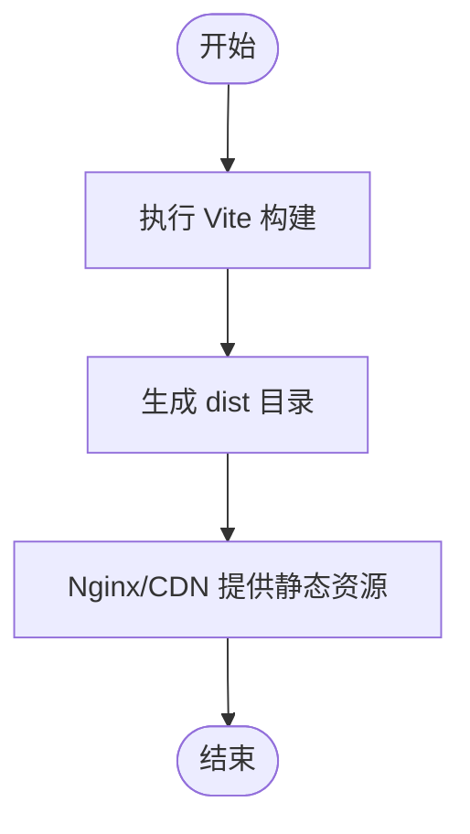
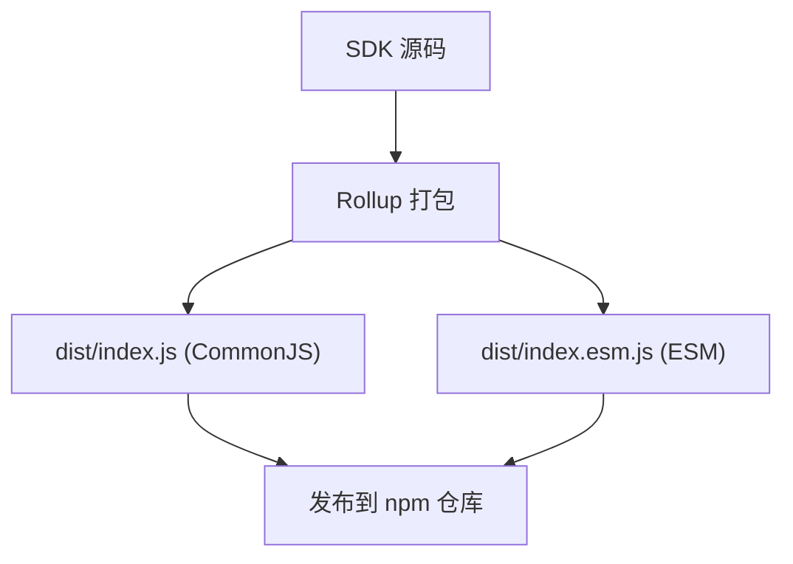
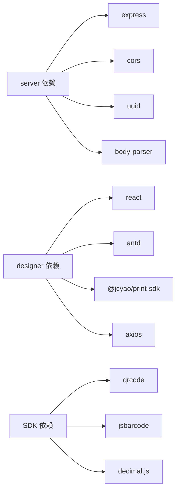

# 生产环境部署

<cite>
**本文引用的文件**
- [README.md](file://README.md)
- [server/package.json](file://server/package.json)
- [server/src/index.ts](file://server/src/index.ts)
- [server/src/routes/schemas.ts](file://server/src/routes/schemas.ts)
- [server/src/routes/templates.ts](file://server/src/routes/templates.ts)
- [server/src/middlewares/errorHandler.ts](file://server/src/middlewares/errorHandler.ts)
- [designer/package.json](file://designer/package.json)
- [designer/vite.config.ts](file://designer/vite.config.ts)
- [sdk/package.json](file://sdk/package.json)
- [sdk/rollup.config.js](file://sdk/rollup.config.js)
- [dev.sh](file://dev.sh)
- [stop.sh](file://stop.sh)
</cite>

## 目录
1. [简介](#简介)
2. [项目结构](#项目结构)
3. [核心组件](#核心组件)
4. [架构总览](#架构总览)
5. [详细组件分析](#详细组件分析)
6. [依赖关系分析](#依赖关系分析)
7. [性能考量](#性能考量)
8. [故障排查指南](#故障排查指南)
9. [结论](#结论)
10. [附录](#附录)

## 简介
本指南面向生产环境部署“打印服务平台”，覆盖后端服务（Node.js + Express）、前端设计器（React + Vite）与打印 SDK（Rollup 打包）。内容包括：Node.js 环境与依赖安装、PM2 进程管理与守护、服务端部署（API 服务启动、端口配置、进程 ID 管理）、前端静态资源部署（Vite 构建产物、静态文件服务与 CDN 策略）、环境变量配置（数据库、API 密钥、日志级别）、SSL 证书与 HTTPS 部署、以及部署后的健康检查与性能监控建议。

## 项目结构
项目采用多包结构，包含服务端模板管理服务、可视化设计器与独立打印 SDK：
- server：Node.js + Express 模板管理服务，提供 REST API。
- designer：React + Vite 可视化设计器，提供模板设计与预览。
- sdk：独立打印 SDK，Rollup 打包，供浏览器或前端集成使用。

图表来源
- [server/src/index.ts:1-25](file://server/src/index.ts#L1-L25)
- [server/src/routes/schemas.ts:1-178](file://server/src/routes/schemas.ts#L1-L178)
- [server/src/routes/templates.ts:1-120](file://server/src/routes/templates.ts#L1-L120)
- [designer/vite.config.ts:1-15](file://designer/vite.config.ts#L1-L15)
- [sdk/package.json:1-60](file://sdk/package.json#L1-L60)
- [sdk/rollup.config.js:1-25](file://sdk/rollup.config.js#L1-L25)

章节来源
- [README.md:191-234](file://README.md#L191-L234)

## 核心组件
- 服务端（server）：基于 Express 提供 REST API，包含路由模块（schemas、templates、mockData），全局错误中间件，监听端口启动。
- 前端设计器（designer）：基于 Vite 构建，提供开发与生产构建脚本，本地开发时通过别名映射指向本地 SDK 源码。
- 打印 SDK（sdk）：Rollup 打包，输出 CommonJS 与 ES Module 两种格式，外部依赖不打包，便于在业务项目中按需引入。

章节来源
- [server/src/index.ts:1-25](file://server/src/index.ts#L1-L25)
- [server/src/routes/schemas.ts:1-178](file://server/src/routes/schemas.ts#L1-L178)
- [server/src/routes/templates.ts:1-120](file://server/src/routes/templates.ts#L1-L120)
- [designer/package.json:1-43](file://designer/package.json#L1-L43)
- [designer/vite.config.ts:1-15](file://designer/vite.config.ts#L1-L15)
- [sdk/package.json:1-60](file://sdk/package.json#L1-L60)
- [sdk/rollup.config.js:1-25](file://sdk/rollup.config.js#L1-L25)

## 架构总览
生产部署建议采用“反向代理 + 多进程守护”的架构：前端通过 Nginx 提供静态资源与反向代理；后端以 PM2 守护多实例；SDK 作为独立包发布至 npm 仓库，业务端按需拉取。

图表来源
- [server/src/index.ts:1-25](file://server/src/index.ts#L1-L25)
- [designer/package.json:1-43](file://designer/package.json#L1-L43)

## 详细组件分析

### 服务端部署（Node.js + Express）
- 环境要求
  - Node.js：建议使用长期支持版本（LTS），确保兼容 server 与 designer 的依赖生态。
  - 包管理器：推荐使用 npm 或 pnpm（仓库中存在 pnpm 锁文件，可按团队习惯选择）。
- 依赖安装
  - 进入 server 目录，安装生产依赖。
- 构建与启动
  - 使用构建脚本生成 dist 目录，然后以 Node.js 启动服务。
- 端口配置
  - 服务默认监听端口可通过环境变量覆盖。
- 进程管理与守护
  - 推荐使用 PM2 管理进程，支持自动重启、日志聚合与负载均衡。
- 进程 ID 管理
  - PM2 启动时可生成进程 ID 文件，便于停止与监控。
- 错误处理
  - 全局错误中间件统一返回 500 与标准错误结构，便于运维与监控系统采集。

图表来源
- [server/src/index.ts:1-25](file://server/src/index.ts#L1-L25)
- [server/src/middlewares/errorHandler.ts:1-10](file://server/src/middlewares/errorHandler.ts#L1-L10)

章节来源
- [server/src/index.ts:1-25](file://server/src/index.ts#L1-L25)
- [server/src/middlewares/errorHandler.ts:1-10](file://server/src/middlewares/errorHandler.ts#L1-L10)
- [server/package.json:1-25](file://server/package.json#L1-L25)

### 前端静态资源部署（Vite）
- 构建产物生成
  - 使用 Vite 生产构建，生成静态资源目录（通常为 dist），包含 HTML、JS、CSS、媒体等文件。
- 静态文件服务
  - 将 dist 目录交由 Nginx 提供静态服务，或托管于对象存储（如 OSS、CDN）。
- CDN 部署策略
  - 对静态资源启用缓存与压缩（gzip/br），对 HTML 设置较短缓存；对 JS/CSS/图片设置长缓存并带指纹。
- 开发与生产差异
  - 本地开发通过 Vite Dev Server 提供热更新；生产环境仅提供静态资源。

图表来源
- [designer/package.json:1-43](file://designer/package.json#L1-L43)
- [designer/vite.config.ts:1-15](file://designer/vite.config.ts#L1-L15)

章节来源
- [designer/package.json:1-43](file://designer/package.json#L1-L43)
- [designer/vite.config.ts:1-15](file://designer/vite.config.ts#L1-L15)

### 打印 SDK 部署（Rollup）
- 打包产物
  - 输出 CommonJS 与 ES Module 两种格式，便于在不同运行环境中使用。
- 外部依赖
  - SDK 将 qrcode、jsbarcode、decimal.js 标记为外部依赖，避免打包进 SDK，降低体积并减少冲突。
- 发布与集成
  - SDK 作为独立包发布至公共 npm 仓库，业务端通过包管理器安装后直接使用。

图表来源
- [sdk/package.json:1-60](file://sdk/package.json#L1-L60)
- [sdk/rollup.config.js:1-25](file://sdk/rollup.config.js#L1-L25)

章节来源
- [sdk/package.json:1-60](file://sdk/package.json#L1-L60)
- [sdk/rollup.config.js:1-25](file://sdk/rollup.config.js#L1-L25)

### 环境变量配置
- 服务端（server）
  - 端口：通过环境变量设置监听端口。
  - 日志：可在启动脚本或 PM2 配置中统一输出与轮转。
- 前端（designer）
  - 构建时的 API 基础地址通常通过构建参数注入（例如 Vite 的环境变量前缀），生产环境指向后端服务域名。
- SDK
  - 一般无需环境变量；如需接入后端 API，可在业务侧通过 SDK 初始化参数传入。

章节来源
- [server/src/index.ts:20-24](file://server/src/index.ts#L20-L24)
- [designer/package.json:1-43](file://designer/package.json#L1-L43)

### SSL 证书与 HTTPS 部署
- 方案一：Nginx 作为前置反向代理，配置 SSL 证书与 HTTPS，后端服务仍监听内网端口。
- 方案二：后端服务直接启用 HTTPS（需要自行准备证书与私钥），并通过反向代理暴露给公网。
- 建议
  - 使用 Let’s Encrypt 免费证书，结合自动化续期工具。
  - 在 Nginx 中开启 HTTP/2、TLS 最低版本与加密套件优化。

（本节为通用实践说明，不直接分析具体文件）

### 健康检查与性能监控
- 健康检查
  - 后端：提供 /health 接口返回服务状态；Nginx 层可配置探针。
  - 前端：静态资源可用性检查；CDN 边缘节点可用性监控。
- 性能监控
  - 后端：PM2 内置指标采集，结合 APM 工具（如 Prometheus + Grafana）。
  - 前端：CDN 带宽与延迟监控、首屏加载时间（FID/LCP）监控。
  - 日志：集中化日志收集（ELK/云审计），异常告警。

（本节为通用实践说明，不直接分析具体文件）

## 依赖关系分析
- 服务端依赖
  - express、cors、uuid、body-parser（开发依赖：ts-node-dev、typescript）。
- 前端依赖
  - React、Ant Design、Monaco Editor、@jcyao/print-sdk、axios 等。
- SDK 依赖
  - qrcode、jsbarcode、decimal.js（外部依赖，不打包）。

图表来源
- [server/package.json:1-25](file://server/package.json#L1-L25)
- [designer/package.json:1-43](file://designer/package.json#L1-L43)
- [sdk/package.json:1-60](file://sdk/package.json#L1-L60)

章节来源
- [server/package.json:1-25](file://server/package.json#L1-L25)
- [designer/package.json:1-43](file://designer/package.json#L1-L43)
- [sdk/package.json:1-60](file://sdk/package.json#L1-L60)

## 性能考量
- 服务端
  - 合理设置并发与连接数上限；启用 gzip 压缩；对静态资源请求进行缓存与限流。
- 前端
  - 启用资源压缩与持久缓存；按需加载与代码分割；CDN 加速。
- SDK
  - 外部依赖不打包，减小体积；在业务端按需引入，避免冗余加载。

（本节为通用指导，不直接分析具体文件）

## 故障排查指南
- 启动失败
  - 检查 Node.js 版本与依赖是否完整安装；查看 PM2 日志与进程状态。
- 端口占用
  - 确认端口未被占用；必要时修改端口或释放占用进程。
- 健康检查
  - 使用 curl 或浏览器访问健康检查接口；确认 Nginx 反代正常。
- 日志定位
  - 查看 PM2 日志与服务端错误中间件输出；结合统一日志系统检索。

章节来源
- [server/src/middlewares/errorHandler.ts:1-10](file://server/src/middlewares/errorHandler.ts#L1-L10)
- [dev.sh:1-102](file://dev.sh#L1-L102)
- [stop.sh:1-37](file://stop.sh#L1-L37)

## 结论
本指南提供了从环境准备、服务端与前端部署、SDK 集成到 SSL 与监控的完整生产部署路径。建议在生产环境中采用 Nginx 反向代理与 PM2 守护，并结合 CDN 与统一日志/监控体系，确保稳定性与可维护性。

## 附录

### A. PM2 进程管理与守护（建议流程）
- 安装 PM2：全局安装 PM2。
- 启动服务：使用 PM2 启动 server 的 dist/index.js，设置名称、日志路径与自动重启策略。
- 生成 PID：PM2 会输出进程 ID，可用于后续停止与管理。
- 停止服务：通过 PM2 停止指定名称的应用，或根据进程 ID 执行停止。

章节来源
- [server/src/index.ts:20-24](file://server/src/index.ts#L20-L24)
- [dev.sh:46-70](file://dev.sh#L46-L70)
- [stop.sh:12-29](file://stop.sh#L12-L29)

### B. 端口与静态资源路径（参考）
- 服务端默认端口：可通过环境变量覆盖。
- 前端静态资源：Vite 生产构建输出目录，交由 Nginx 或 CDN 提供。

章节来源
- [server/src/index.ts:20-24](file://server/src/index.ts#L20-L24)
- [designer/package.json:1-43](file://designer/package.json#L1-L43)