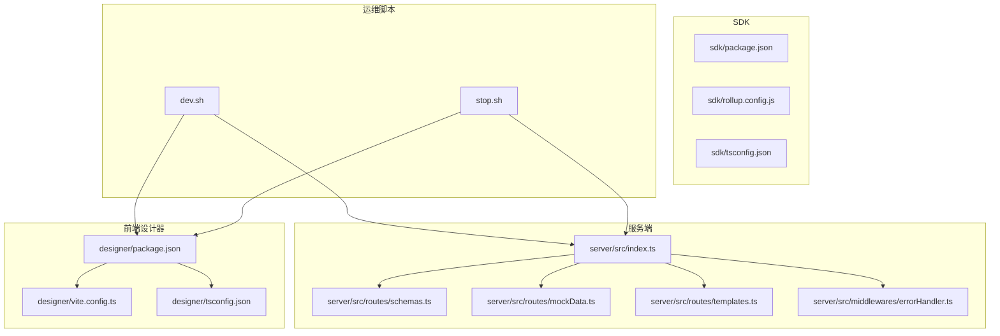
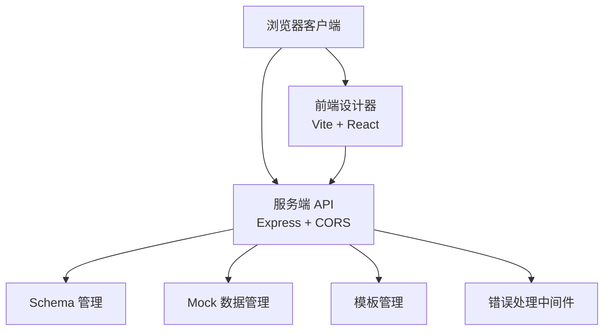
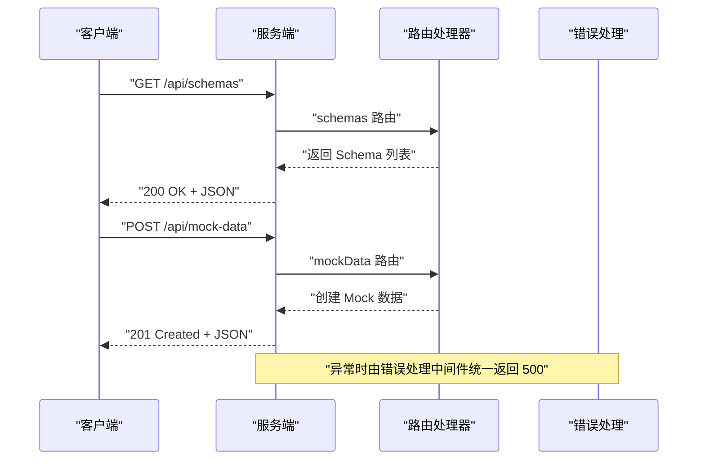
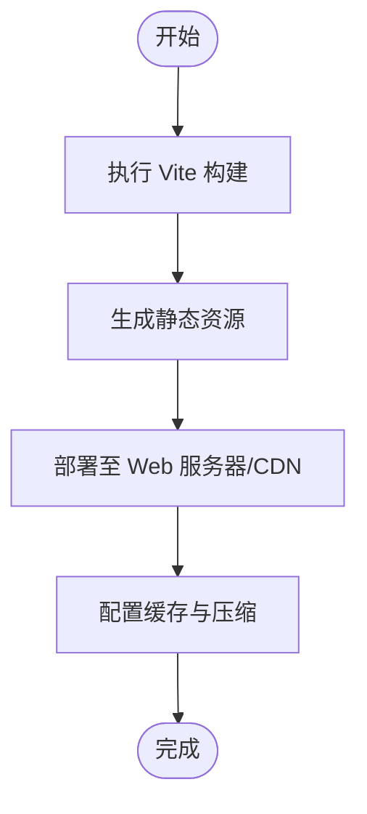
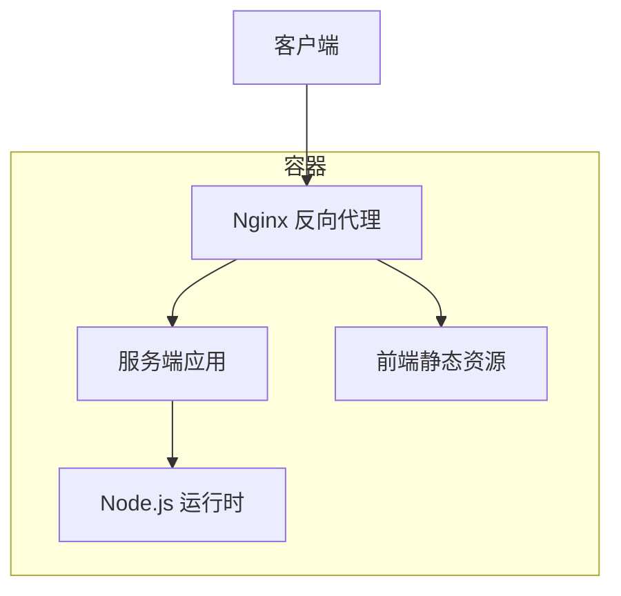
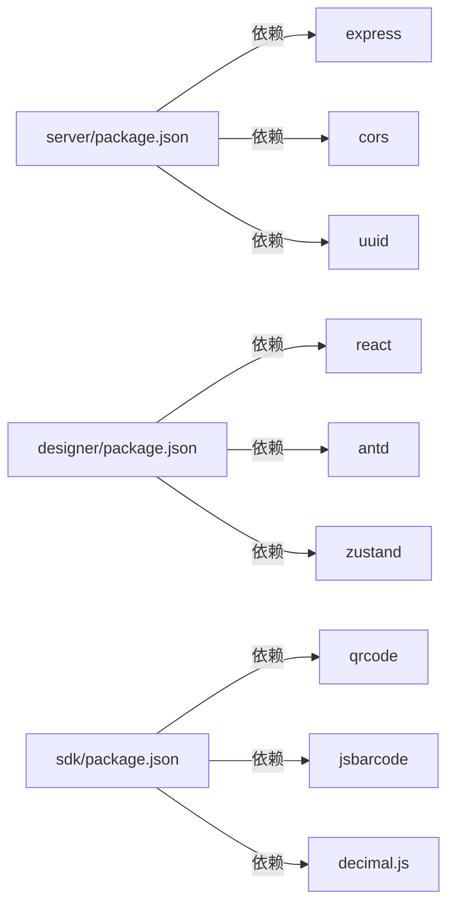

# 部署指南

<cite>
**本文档引用的文件**
- [README.md](file://README.md)
- [DEV_README.md](file://DEV_README.md)
- [designer/package.json](file://designer/package.json)
- [server/package.json](file://server/package.json)
- [sdk/package.json](file://sdk/package.json)
- [designer/vite.config.ts](file://designer/vite.config.ts)
- [server/src/index.ts](file://server/src/index.ts)
- [server/src/middlewares/errorHandler.ts](file://server/src/middlewares/errorHandler.ts)
- [server/src/routes/schemas.ts](file://server/src/routes/schemas.ts)
- [server/src/routes/mockData.ts](file://server/src/routes/mockData.ts)
- [server/src/routes/templates.ts](file://server/src/routes/templates.ts)
- [sdk/rollup.config.js](file://sdk/rollup.config.js)
- [dev.sh](file://dev.sh)
- [stop.sh](file://stop.sh)
- [designer/tsconfig.json](file://designer/tsconfig.json)
- [server/tsconfig.json](file://server/tsconfig.json)
</cite>

## 目录
1. [简介](#简介)
2. [项目结构](#项目结构)
3. [核心组件](#核心组件)
4. [架构概览](#架构概览)
5. [详细组件分析](#详细组件分析)
6. [依赖关系分析](#依赖关系分析)
7. [性能考虑](#性能考虑)
8. [故障排除指南](#故障排除指南)
9. [结论](#结论)
10. [附录](#附录)

## 简介
本指南面向生产环境部署打印平台，涵盖服务端与前端的构建、部署与运维要点，并提供容器化与环境配置建议。平台采用前后端分离架构：服务端基于 Node.js/Express 提供 REST API，前端基于 Vite + React 提供可视化设计器，SDK 以独立包形式提供客户端打印能力。

## 项目结构
项目采用多包结构，包含服务端、前端设计器与打印 SDK 三个主要模块，配合开发脚本与配置文件，形成完整的开发与部署体系。

**图表来源**
- [server/src/index.ts:1-25](file://server/src/index.ts#L1-L25)
- [server/src/routes/schemas.ts:1-178](file://server/src/routes/schemas.ts#L1-L178)
- [server/src/routes/mockData.ts:1-448](file://server/src/routes/mockData.ts#L1-L448)
- [server/src/routes/templates.ts:1-800](file://server/src/routes/templates.ts#L1-L800)
- [server/src/middlewares/errorHandler.ts:1-10](file://server/src/middlewares/errorHandler.ts#L1-L10)
- [designer/package.json:1-43](file://designer/package.json#L1-L43)
- [designer/vite.config.ts:1-15](file://designer/vite.config.ts#L1-L15)
- [designer/tsconfig.json:1-26](file://designer/tsconfig.json#L1-L26)
- [sdk/package.json:1-60](file://sdk/package.json#L1-L60)
- [sdk/rollup.config.js:1-25](file://sdk/rollup.config.js#L1-L25)
- [dev.sh:1-102](file://dev.sh#L1-L102)
- [stop.sh:1-37](file://stop.sh#L1-L37)

**章节来源**
- [README.md: 191-234:191-234](file://README.md#L191-L234)
- [DEV_README.md: 27-52:27-52](file://DEV_README.md#L27-L52)

## 核心组件
- 服务端（Node.js/Express）
  - 提供 REST API：/api/schemas、/api/mock-data、/api/templates
  - 支持 CORS 与 JSON 请求体解析
  - 默认监听端口可通过环境变量配置
- 前端设计器（Vite + React）
  - 开发时通过 Vite 启动，支持热更新
  - 构建产物用于生产部署
- SDK（Rollup 打包）
  - 输出 CommonJS 与 ES Module 两种格式
  - 外部依赖不打包，便于复用与减小体积

**章节来源**
- [server/src/index.ts: 1-25:1-25](file://server/src/index.ts#L1-L25)
- [server/src/routes/schemas.ts: 120-178:120-178](file://server/src/routes/schemas.ts#L120-L178)
- [server/src/routes/mockData.ts: 382-448:382-448](file://server/src/routes/mockData.ts#L382-L448)
- [server/src/routes/templates.ts: 60-800:60-800](file://server/src/routes/templates.ts#L60-L800)
- [designer/package.json: 6-11:6-11](file://designer/package.json#L6-L11)
- [sdk/package.json: 13-17:13-17](file://sdk/package.json#L13-L17)
- [sdk/rollup.config.js: 1-L25:1-25](file://sdk/rollup.config.js#L1-L25)

## 架构概览
服务端负责数据模型与模板管理，前端设计器提供可视化设计与预览，SDK 用于浏览器端打印集成。

**图表来源**
- [server/src/index.ts: 1-L25:1-25](file://server/src/index.ts#L1-L25)
- [server/src/routes/schemas.ts: 1-L178:1-178](file://server/src/routes/schemas.ts#L1-L178)
- [server/src/routes/mockData.ts: 1-L448:1-448](file://server/src/routes/mockData.ts#L1-L448)
- [server/src/routes/templates.ts: 1-L800:1-800](file://server/src/routes/templates.ts#L1-L800)
- [server/src/middlewares/errorHandler.ts: 1-L10:1-10](file://server/src/middlewares/errorHandler.ts#L1-L10)

## 详细组件分析

### 服务端部署配置
- 环境准备
  - Node.js 运行时要求与依赖安装
  - 端口配置：默认 3000，可通过环境变量覆盖
- 进程管理
  - 开发阶段使用 ts-node-dev，生产建议使用进程管理器（如 PM2）
- 服务监控
  - 建议结合系统监控与日志聚合
- API 路由
  - /api/schemas：Schema 的增删改查
  - /api/mock-data：Mock 数据的增删改查
  - /api/templates：模板的增删改查

**图表来源**
- [server/src/index.ts: 1-L25:1-25](file://server/src/index.ts#L1-L25)
- [server/src/routes/schemas.ts: 120-L178:120-178](file://server/src/routes/schemas.ts#L120-L178)
- [server/src/routes/mockData.ts: 382-L448:382-448](file://server/src/routes/mockData.ts#L382-L448)
- [server/src/middlewares/errorHandler.ts: 1-L10:1-10](file://server/src/middlewares/errorHandler.ts#L1-L10)

**章节来源**
- [server/src/index.ts: 1-L25:1-25](file://server/src/index.ts#L1-L25)
- [server/src/routes/schemas.ts: 1-L178:1-178](file://server/src/routes/schemas.ts#L1-L178)
- [server/src/routes/mockData.ts: 1-L448:1-448](file://server/src/routes/mockData.ts#L1-L448)
- [server/src/routes/templates.ts: 1-L800:1-800](file://server/src/routes/templates.ts#L1-L800)
- [server/src/middlewares/errorHandler.ts: 1-L10:1-10](file://server/src/middlewares/errorHandler.ts#L1-L10)

### 前端静态资源部署
- 构建产物
  - 使用 Vite 构建，生成静态资源
  - 配置别名指向本地 SDK 源码，便于开发联调
- 部署建议
  - 将构建产物部署至 Web 服务器或 CDN
  - 配置缓存策略与压缩
  - 前端路由需回退至 index.html（SPA）

**图表来源**
- [designer/package.json: 7-L10:7-10](file://designer/package.json#L7-L10)
- [designer/vite.config.ts: 6-L14:6-14](file://designer/vite.config.ts#L6-L14)

**章节来源**
- [designer/package.json: 6-L11:6-11](file://designer/package.json#L6-L11)
- [designer/vite.config.ts: 1-L15:1-15](file://designer/vite.config.ts#L1-L15)

### Docker 容器化部署方案
- 镜像构建
  - 基于 Node.js 运行时镜像
  - 安装依赖并构建服务端与前端
  - 暴露服务端端口
- 容器编排
  - 建议使用反向代理（如 Nginx）统一入口
  - 前端静态资源由反向代理提供
  - 服务端作为后端 API 提供方

[本图为概念性容器化示意，无需图表来源]

**章节来源**
- [server/package.json: 6-L10:6-10](file://server/package.json#L6-L10)
- [designer/package.json: 6-L11:6-11](file://designer/package.json#L6-L11)

### 环境变量与安全设置
- 环境变量
  - 服务端端口：通过环境变量覆盖默认端口
  - 前端开发端口：可在 Vite 配置中调整
- 安全建议
  - 生产环境启用 HTTPS
  - 配置 CORS 白名单
  - 对外暴露 API 增加鉴权与限流
  - 静态资源部署启用安全响应头

**章节来源**
- [server/src/index.ts: 20-L24:20-24](file://server/src/index.ts#L20-L24)
- [designer/vite.config.ts: 6-L14:6-14](file://designer/vite.config.ts#L6-L14)

### 部署后验证与故障排除
- 验证步骤
  - 服务端健康检查：访问 /api/schemas、/api/mock-data、/api/templates
  - 前端页面加载：确认静态资源可访问
  - 打印预览：在设计器中进行基本打印预览
- 常见问题
  - 端口占用：修改服务端或前端端口
  - 日志查看：查看服务端与前端日志文件
  - 数据重置：重启服务端以恢复内置数据

**章节来源**
- [DEV_README.md: 118-L126:118-126](file://DEV_README.md#L118-L126)
- [DEV_README.md: 130-L148:130-148](file://DEV_README.md#L130-L148)
- [dev.sh: 49-L87:49-87](file://dev.sh#L49-L87)
- [stop.sh: 12-L36:12-36](file://stop.sh#L12-L36)

## 依赖关系分析
服务端依赖 Express、CORS、UUID 等；前端依赖 React、Ant Design、Zustand 等；SDK 依赖 qrcode、jsbarcode、decimal.js 等。

**图表来源**
- [server/package.json: 11-L15:11-15](file://server/package.json#L11-L15)
- [designer/package.json: 12-L28:12-28](file://designer/package.json#L12-L28)
- [sdk/package.json: 49-L53:49-53](file://sdk/package.json#L49-L53)

**章节来源**
- [server/package.json: 1-L25:1-25](file://server/package.json#L1-L25)
- [designer/package.json: 1-L43:1-43](file://designer/package.json#L1-L43)
- [sdk/package.json: 1-L60:1-60](file://sdk/package.json#L1-L60)

## 性能考虑
- 前端构建
  - 启用压缩与 Tree Shaking
  - 静态资源 CDN 加速
- 服务端
  - 使用进程池与负载均衡
  - 合理设置请求体大小限制
  - 对大数据量模板进行分页与懒加载

[本节为通用指导，无需章节来源]

## 故障排除指南
- 端口冲突
  - 修改服务端端口或前端开发端口
- 日志排查
  - 查看服务端与前端日志文件
- 数据问题
  - 重启服务端以恢复内置数据
- 进程管理
  - 使用提供的停止脚本清理残留进程

**章节来源**
- [DEV_README.md: 130-L148:130-148](file://DEV_README.md#L130-L148)
- [dev.sh: 49-L87:49-87](file://dev.sh#L49-L87)
- [stop.sh: 12-L36:12-36](file://stop.sh#L12-L36)

## 结论
本指南提供了从开发到生产的完整部署路径：服务端基于 Express 提供 API，前端通过 Vite 构建静态资源，SDK 独立发布。建议在生产环境中启用 HTTPS、配置 CORS 白名单、使用进程管理器与反向代理，并结合监控与日志体系保障稳定性。

[本节为总结性内容，无需章节来源]

## 附录
- 开发与运维脚本
  - 一键启动与停止脚本，便于本地开发与调试
- TypeScript 配置
  - 前端与服务端分别提供 tsconfig，确保类型检查与构建一致性

**章节来源**
- [dev.sh: 1-L102:1-102](file://dev.sh#L1-L102)
- [stop.sh: 1-L37:1-37](file://stop.sh#L1-L37)
- [designer/tsconfig.json: 1-L26:1-26](file://designer/tsconfig.json#L1-L26)
- [server/tsconfig.json: 1-L13:1-13](file://server/tsconfig.json#L1-L13)