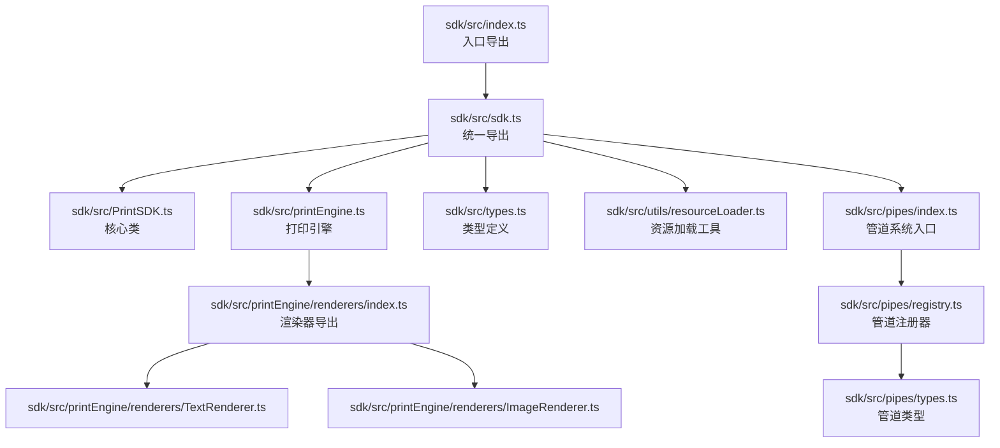
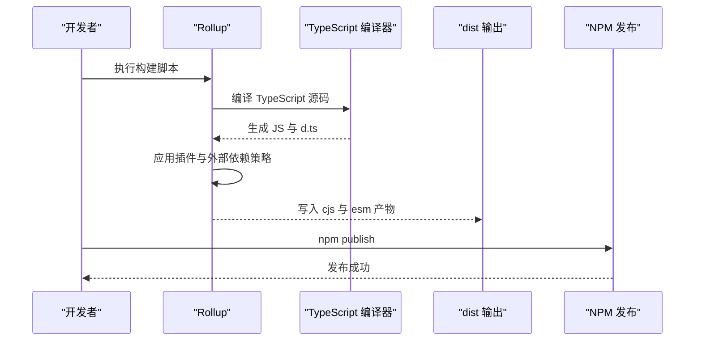
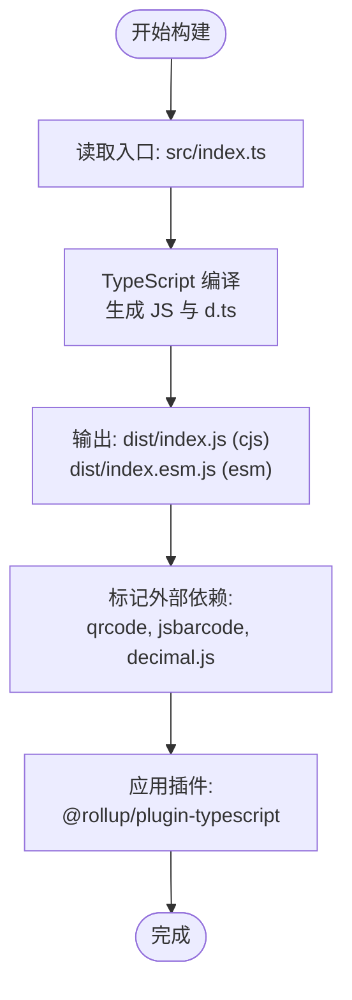
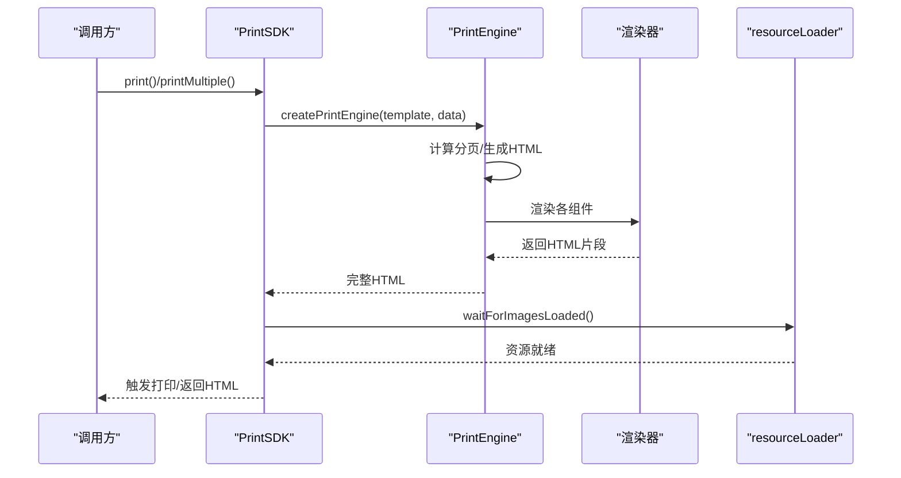
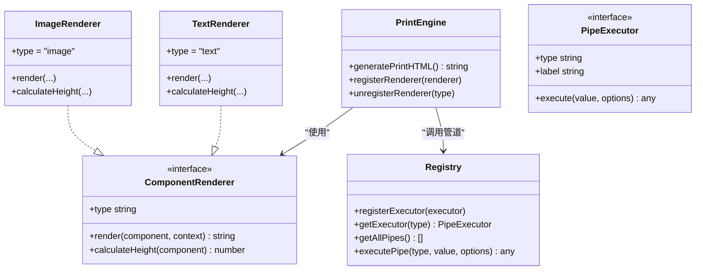
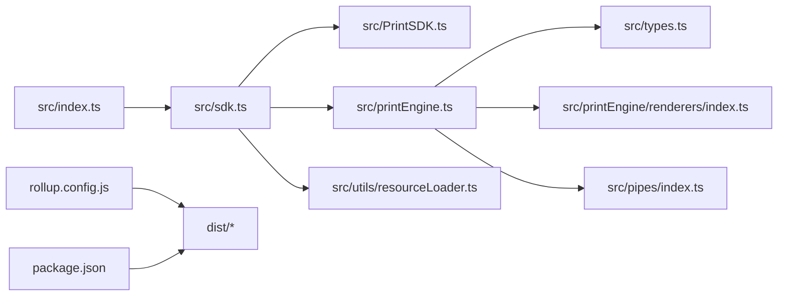

# SDK构建配置

<cite>
**本文引用的文件**
- [sdk/rollup.config.js](file://sdk/rollup.config.js)
- [sdk/package.json](file://sdk/package.json)
- [sdk/tsconfig.json](file://sdk/tsconfig.json)
- [sdk/.npmignore](file://sdk/.npmignore)
- [sdk/src/index.ts](file://sdk/src/index.ts)
- [sdk/src/sdk.ts](file://sdk/src/sdk.ts)
- [sdk/src/PrintSDK.ts](file://sdk/src/PrintSDK.ts)
- [sdk/src/printEngine.ts](file://sdk/src/printEngine.ts)
- [sdk/src/types.ts](file://sdk/src/types.ts)
- [sdk/src/utils/resourceLoader.ts](file://sdk/src/utils/resourceLoader.ts)
- [sdk/src/pipes/index.ts](file://sdk/src/pipes/index.ts)
- [sdk/src/pipes/registry.ts](file://sdk/src/pipes/registry.ts)
- [sdk/src/pipes/types.ts](file://sdk/src/pipes/types.ts)
- [sdk/src/printEngine/renderers/index.ts](file://sdk/src/printEngine/renderers/index.ts)
- [sdk/src/printEngine/renderers/TextRenderer.ts](file://sdk/src/printEngine/renderers/TextRenderer.ts)
- [sdk/src/printEngine/renderers/ImageRenderer.ts](file://sdk/src/printEngine/renderers/ImageRenderer.ts)
- [sdk/example.html](file://sdk/example.html)
</cite>

## 目录
1. [简介](#简介)
2. [项目结构](#项目结构)
3. [核心组件](#核心组件)
4. [架构总览](#架构总览)
5. [详细组件分析](#详细组件分析)
6. [依赖关系分析](#依赖关系分析)
7. [性能考量](#性能考量)
8. [故障排查指南](#故障排查指南)
9. [结论](#结论)
10. [附录](#附录)

## 简介
本指南面向打印SDK的构建与发布，围绕Rollup配置、TypeScript编译、package.json发布配置、构建优化策略以及发布与版本管理最佳实践展开。文档同时结合SDK源码结构，给出可操作的配置建议与可视化图示，帮助开发者快速搭建稳定高效的构建流水线。

## 项目结构
SDK位于仓库的sdk目录，采用“源码在src、产物在dist”的标准组织方式；构建工具采用Rollup，TypeScript编译器负责生成声明文件；发布配置通过package.json统一管理，.npmignore确保仅发布必要产物。

**图表来源**
- [sdk/src/index.ts:1-22](file://sdk/src/index.ts#L1-L22)
- [sdk/src/sdk.ts:1-63](file://sdk/src/sdk.ts#L1-L63)
- [sdk/src/PrintSDK.ts:1-253](file://sdk/src/PrintSDK.ts#L1-L253)
- [sdk/src/printEngine.ts:1-757](file://sdk/src/printEngine.ts#L1-L757)
- [sdk/src/printEngine/renderers/index.ts:1-13](file://sdk/src/printEngine/renderers/index.ts#L1-L13)
- [sdk/src/printEngine/renderers/TextRenderer.ts:1-60](file://sdk/src/printEngine/renderers/TextRenderer.ts#L1-L60)
- [sdk/src/printEngine/renderers/ImageRenderer.ts:1-55](file://sdk/src/printEngine/renderers/ImageRenderer.ts#L1-L55)
- [sdk/src/types.ts:1-171](file://sdk/src/types.ts#L1-L171)
- [sdk/src/utils/resourceLoader.ts:1-90](file://sdk/src/utils/resourceLoader.ts#L1-L90)
- [sdk/src/pipes/index.ts:1-9](file://sdk/src/pipes/index.ts#L1-L9)
- [sdk/src/pipes/registry.ts:1-64](file://sdk/src/pipes/registry.ts#L1-L64)
- [sdk/src/pipes/types.ts:1-30](file://sdk/src/pipes/types.ts#L1-L30)

**章节来源**
- [sdk/src/index.ts:1-22](file://sdk/src/index.ts#L1-L22)
- [sdk/src/sdk.ts:1-63](file://sdk/src/sdk.ts#L1-L63)

## 核心组件
- 入口与导出
  - 入口文件负责聚合导出SDK主类、打印引擎、常量、HTML模板工具、渲染器与类型定义，便于使用者按需引入。
  - 统一导出文件集中暴露API，利于未来拆分为独立包。
- 核心类与引擎
  - 核心类提供打印、预览、批量打印、HTML生成等能力；打印引擎负责数据绑定、管道转换、虚拟分页与HTML生成。
- 渲染器体系
  - 渲染器插件化，支持文本、表格、图片、矩形、线条、二维码、条形码与页码渲染。
- 管道系统
  - 管道注册器集中管理执行器，支持日期、货币、金额、大小写、切片、默认值等内置管道。
- 资源加载工具
  - 提供图片加载等待与打印资源准备工具，保障打印时机的稳定性。

**章节来源**
- [sdk/src/index.ts:1-22](file://sdk/src/index.ts#L1-L22)
- [sdk/src/sdk.ts:1-63](file://sdk/src/sdk.ts#L1-L63)
- [sdk/src/PrintSDK.ts:1-253](file://sdk/src/PrintSDK.ts#L1-L253)
- [sdk/src/printEngine.ts:1-757](file://sdk/src/printEngine.ts#L1-L757)
- [sdk/src/printEngine/renderers/index.ts:1-13](file://sdk/src/printEngine/renderers/index.ts#L1-L13)
- [sdk/src/pipes/registry.ts:1-64](file://sdk/src/pipes/registry.ts#L1-L64)
- [sdk/src/utils/resourceLoader.ts:1-90](file://sdk/src/utils/resourceLoader.ts#L1-L90)

## 架构总览
SDK构建采用Rollup打包，TypeScript生成声明文件，package.json定义发布入口与脚本，.npmignore控制发布产物范围。整体流程如下：

**图表来源**
- [sdk/rollup.config.js:1-25](file://sdk/rollup.config.js#L1-L25)
- [sdk/tsconfig.json:1-17](file://sdk/tsconfig.json#L1-L17)
- [sdk/package.json:1-60](file://sdk/package.json#L1-L60)

## 详细组件分析

### Rollup配置详解
- 入口点
  - input指向src/index.ts，确保从统一入口导出聚合所有功能。
- 输出格式
  - 生成CommonJS与ES模块两种格式，分别对应main与module字段，满足不同运行环境需求。
- 外部依赖
  - 将二维码、条形码与十进制数学库标记为external，避免打包进SDK，降低体积并避免版本冲突。
- 插件
  - 使用TypeScript插件，并指定tsconfig.json路径，保证编译一致性。

**图表来源**
- [sdk/rollup.config.js:1-25](file://sdk/rollup.config.js#L1-L25)

**章节来源**
- [sdk/rollup.config.js:1-25](file://sdk/rollup.config.js#L1-L25)

### TypeScript编译配置要点
- 目标与模块
  - target与module均设为现代目标，lib包含DOM，适配浏览器端打印场景。
- 声明文件
  - 启用declaration生成.d.ts，配合Rollup输出到dist目录。
- 输出目录与排除
  - outDir指向dist，include与exclude明确编译范围，避免无关文件进入构建。
- 严格性与兼容性
  - strict提升类型安全；esModuleInterop与skipLibCheck提升互操作性与编译稳定性。

**章节来源**
- [sdk/tsconfig.json:1-17](file://sdk/tsconfig.json#L1-L17)

### package.json发布配置
- 包元信息
  - name、version、description、author、license等基础信息。
- 入口与类型
  - main/module/types分别指向cjs/esm与声明文件，确保Node与ESM生态兼容。
- 发布配置
  - publishConfig定义公开访问与registry地址，便于发布到公共仓库。
- 脚本
  - build/dev脚本分别触发Rollup构建与监听模式。
- 依赖与侧向文件
  - dependencies声明运行时依赖，devDependencies声明构建期依赖；files仅包含dist、README与许可证，遵循最小发布原则。

**章节来源**
- [sdk/package.json:1-60](file://sdk/package.json#L1-L60)

### .npmignore发布过滤
- 仅发布dist与文档/许可证文件，排除源码、配置、开发依赖与测试文件，确保包体积最小化与安全性。

**章节来源**
- [sdk/.npmignore:1-25](file://sdk/.npmignore#L1-L25)

### SDK核心类与引擎调用链

**图表来源**
- [sdk/src/PrintSDK.ts:1-253](file://sdk/src/PrintSDK.ts#L1-L253)
- [sdk/src/printEngine.ts:1-757](file://sdk/src/printEngine.ts#L1-L757)
- [sdk/src/utils/resourceLoader.ts:1-90](file://sdk/src/utils/resourceLoader.ts#L1-L90)

**章节来源**
- [sdk/src/PrintSDK.ts:1-253](file://sdk/src/PrintSDK.ts#L1-L253)
- [sdk/src/printEngine.ts:1-757](file://sdk/src/printEngine.ts#L1-L757)
- [sdk/src/utils/resourceLoader.ts:1-90](file://sdk/src/utils/resourceLoader.ts#L1-L90)

### 渲染器与管道系统
- 渲染器
  - 文本、图片等渲染器实现统一接口，按组件类型动态选择渲染器。
- 管道
  - 管道注册器集中管理执行器，支持内置与扩展执行器，打印引擎在渲染前对数据进行管道转换。

**图表来源**
- [sdk/src/printEngine.ts:1-757](file://sdk/src/printEngine.ts#L1-L757)
- [sdk/src/printEngine/renderers/TextRenderer.ts:1-60](file://sdk/src/printEngine/renderers/TextRenderer.ts#L1-L60)
- [sdk/src/printEngine/renderers/ImageRenderer.ts:1-55](file://sdk/src/printEngine/renderers/ImageRenderer.ts#L1-L55)
- [sdk/src/pipes/registry.ts:1-64](file://sdk/src/pipes/registry.ts#L1-L64)
- [sdk/src/pipes/types.ts:1-30](file://sdk/src/pipes/types.ts#L1-L30)

**章节来源**
- [sdk/src/printEngine/renderers/index.ts:1-13](file://sdk/src/printEngine/renderers/index.ts#L1-L13)
- [sdk/src/pipes/registry.ts:1-64](file://sdk/src/pipes/registry.ts#L1-L64)
- [sdk/src/pipes/types.ts:1-30](file://sdk/src/pipes/types.ts#L1-L30)

## 依赖关系分析
- 内部依赖
  - 入口导出统一聚合，SDK主类依赖打印引擎与资源加载工具；打印引擎依赖渲染器与管道系统。
- 外部依赖
  - 二维码、条形码与十进制数学库通过external处理，避免打包进SDK，降低体积并减少版本冲突风险。
- 类型依赖
  - types.ts提供模板、组件节点、表格、页码等核心类型，被SDK主类与引擎广泛使用。

**图表来源**
- [sdk/src/index.ts:1-22](file://sdk/src/index.ts#L1-L22)
- [sdk/src/sdk.ts:1-63](file://sdk/src/sdk.ts#L1-L63)
- [sdk/src/PrintSDK.ts:1-253](file://sdk/src/PrintSDK.ts#L1-L253)
- [sdk/src/printEngine.ts:1-757](file://sdk/src/printEngine.ts#L1-L757)
- [sdk/src/types.ts:1-171](file://sdk/src/types.ts#L1-L171)
- [sdk/src/printEngine/renderers/index.ts:1-13](file://sdk/src/printEngine/renderers/index.ts#L1-L13)
- [sdk/src/pipes/index.ts:1-9](file://sdk/src/pipes/index.ts#L1-L9)
- [sdk/src/utils/resourceLoader.ts:1-90](file://sdk/src/utils/resourceLoader.ts#L1-L90)
- [sdk/rollup.config.js:1-25](file://sdk/rollup.config.js#L1-L25)
- [sdk/package.json:1-60](file://sdk/package.json#L1-L60)

**章节来源**
- [sdk/rollup.config.js:1-25](file://sdk/rollup.config.js#L1-L25)
- [sdk/package.json:1-60](file://sdk/package.json#L1-L60)

## 性能考量
- Tree Shaking
  - 使用ES模块与external策略，确保未使用的导出不会被打包进最终产物，提升按需引入效率。
- 代码压缩
  - 在生产构建中可引入压缩插件（如Terser）进一步减小体积，注意保留必要的命名以便调试。
- 外部依赖处理
  - 将二维码、条形码与十进制数学库标记为external，避免重复打包与体积膨胀；在使用方环境中由其自行提供。
- 资源加载
  - 通过资源加载工具等待图片等异步资源，避免打印时机过早导致渲染不完整。

[本节为通用指导，不直接分析具体文件]

## 故障排查指南
- 构建失败
  - 检查TypeScript配置与Rollup插件版本兼容性；确认tsconfig.json的outDir与include/exclude设置正确。
- 产物缺失类型定义
  - 确认declaration已开启，且Rollup未覆盖生成的.d.ts；检查package.json的types字段指向正确。
- 运行时报错：找不到外部依赖
  - 确认external配置与实际使用一致；在使用方环境中安装相应依赖（二维码、条形码、十进制数学库）。
- 打印资源未加载完成
  - 检查资源加载工具的超时与错误处理逻辑；确保图片URL有效且可访问。

**章节来源**
- [sdk/tsconfig.json:1-17](file://sdk/tsconfig.json#L1-L17)
- [sdk/rollup.config.js:1-25](file://sdk/rollup.config.js#L1-L25)
- [sdk/package.json:1-60](file://sdk/package.json#L1-L60)
- [sdk/src/utils/resourceLoader.ts:1-90](file://sdk/src/utils/resourceLoader.ts#L1-L90)

## 结论
通过合理的Rollup配置、TypeScript编译策略与package.json发布设置，打印SDK能够在保持体积可控的同时，提供良好的TypeScript体验与多运行时兼容性。配合external依赖与资源加载工具，可进一步提升构建效率与运行稳定性。

[本节为总结性内容，不直接分析具体文件]

## 附录

### 构建与发布流程
- 本地构建
  - 执行构建脚本生成dist产物，验证cjs与esm两份产物及声明文件。
- 版本管理
  - 升级package.json中的version字段，遵循语义化版本规范。
- 发布
  - 登录NPM账户，执行发布命令；确认publishConfig配置正确。
- 示例验证
  - 使用example.html验证SDK在浏览器中的导入与打印功能。

**章节来源**
- [sdk/package.json:1-60](file://sdk/package.json#L1-L60)
- [sdk/example.html:1-202](file://sdk/example.html#L1-L202)