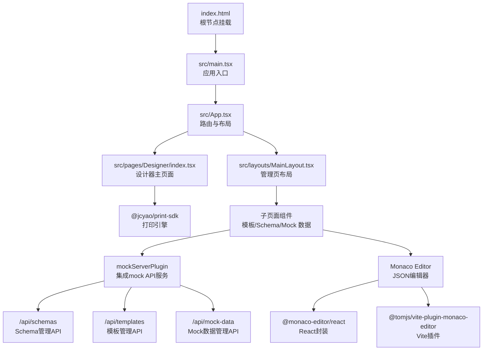
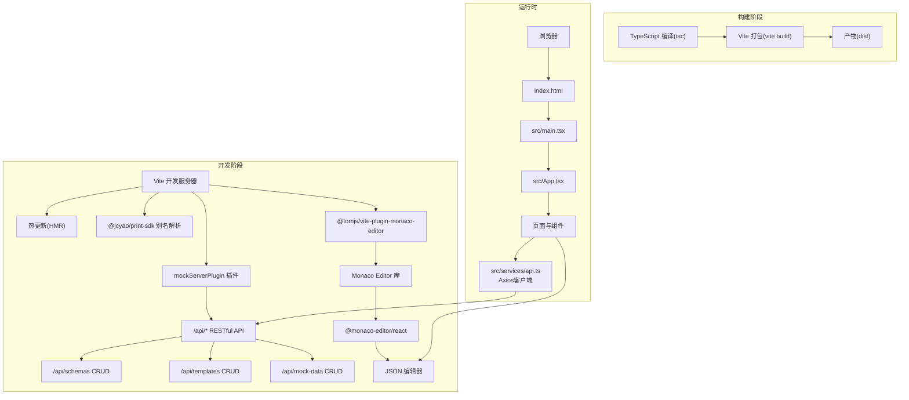
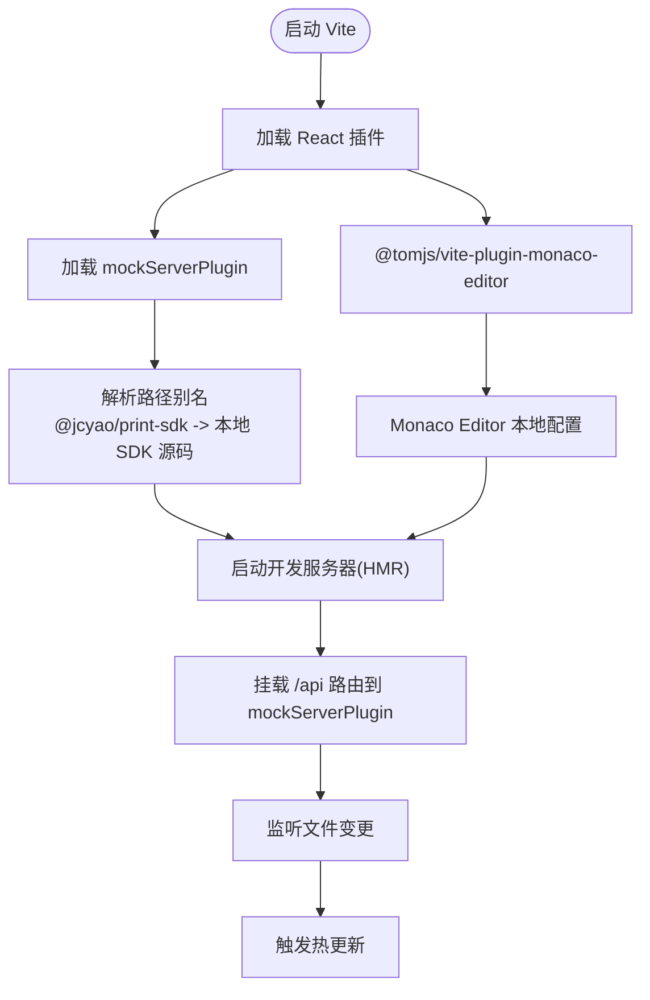
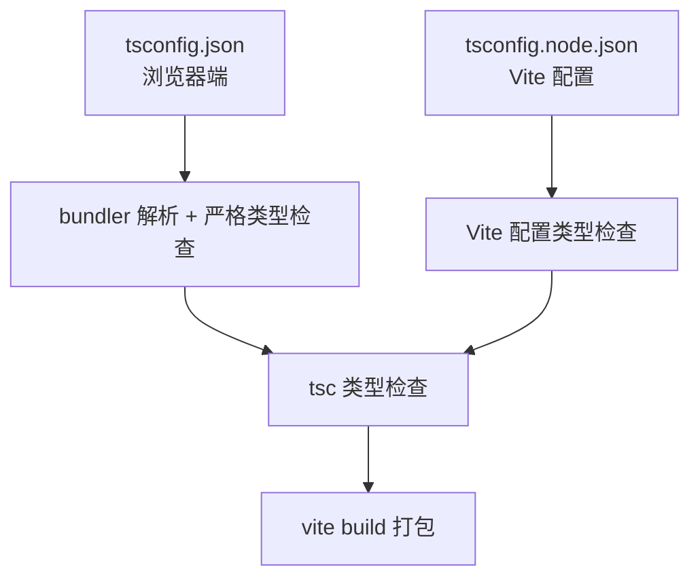
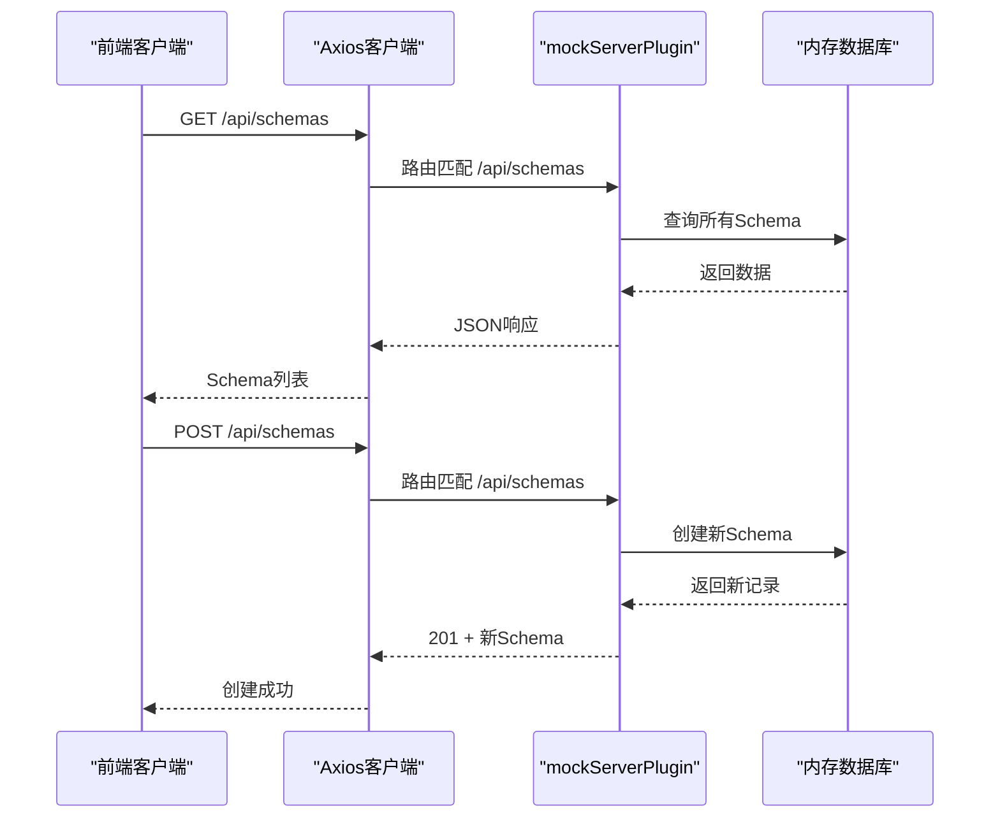
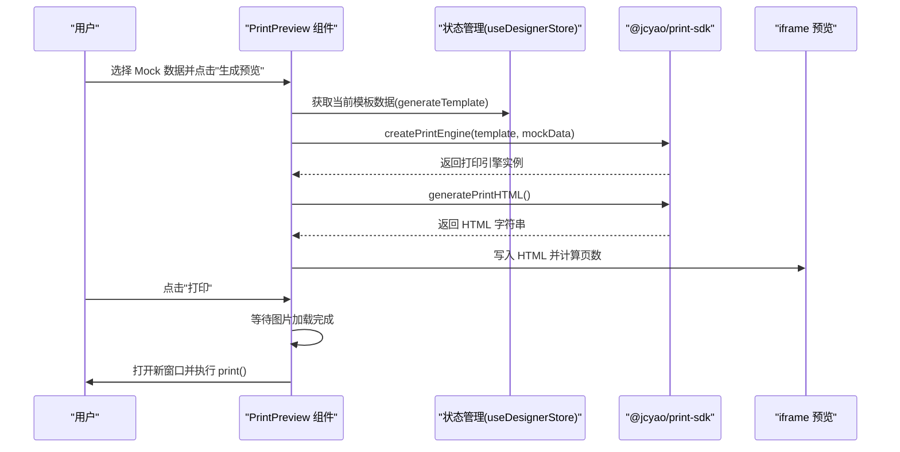
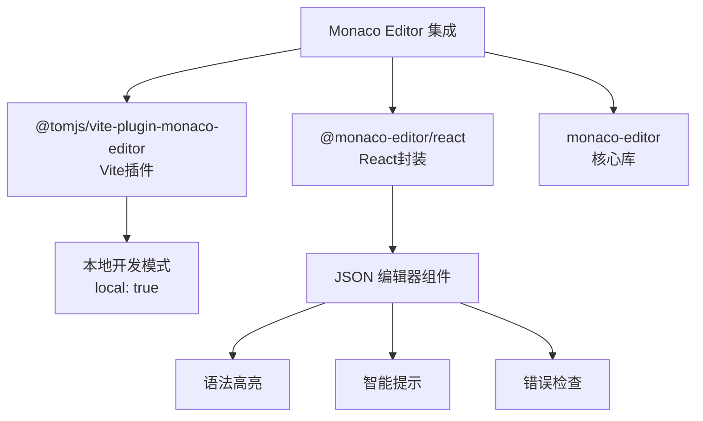
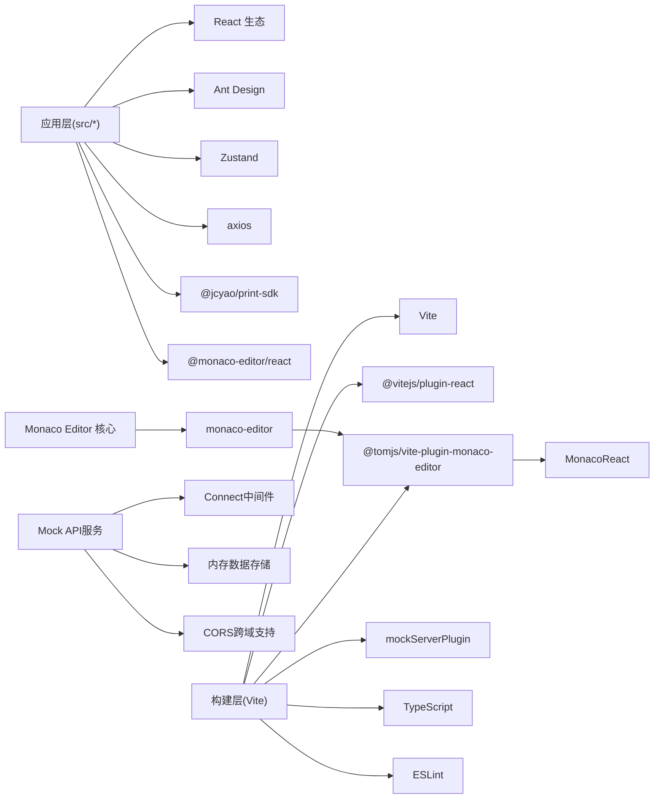

# 前端构建配置

<cite>
**本文引用的文件**
- [vite.config.ts](file://designer/vite.config.ts)
- [package.json](file://designer/package.json)
- [tsconfig.json](file://designer/tsconfig.json)
- [tsconfig.node.json](file://designer/tsconfig.node.json)
- [.eslintrc.cjs](file://designer/.eslintrc.cjs)
- [index.html](file://designer/index.html)
- [README.md](file://designer/README.md)
- [src/main.tsx](file://designer/src/main.tsx)
- [src/App.tsx](file://designer/src/App.tsx)
- [src/vite-env.d.ts](file://designer/src/vite-env.d.ts)
- [src/pages/Designer/index.tsx](file://designer/src/pages/Designer/index.tsx)
- [src/layouts/MainLayout.tsx](file://designer/src/layouts/MainLayout.tsx)
- [src/components/PrintPreview/index.tsx](file://designer/src/components/PrintPreview/index.tsx)
- [src/services/api.ts](file://designer/src/services/api.ts)
- [src/features/schema/index.tsx](file://designer/src/features/schema/index.tsx)
- [src/pages/AssetManagement/components/MockDataManagement/index.tsx](file://designer/src/pages/AssetManagement/components/MockDataManagement/index.tsx)
- [src/pages/AssetManagement/components/SchemaManagement/index.tsx](file://designer/src/pages/AssetManagement/components/SchemaManagement/index.tsx)
- [mock/server.ts](file://designer/mock/server.ts)
- [mock/index.ts](file://designer/mock/index.ts)
- [mock/types.ts](file://designer/mock/types.ts)
- [mock/templates.ts](file://designer/mock/templates.ts)
</cite>

## 更新摘要
**变更内容**
- 新增Vite集成mock API的完整配置说明
- 新增Monaco Editor集成配置，包括@tomjs/vite-plugin-monaco-editor插件和@monaco-editor/react依赖
- 移除对独立后端服务的构建配置说明
- 新增mockServerPlugin插件配置详解
- 新增完整的mock API服务端点说明
- 更新架构图以反映集成mock服务和Monaco Editor的变更

## 目录
1. [简介](#简介)
2. [项目结构](#项目结构)
3. [核心构建组件](#核心构建组件)
4. [架构总览](#架构总览)
5. [详细组件分析](#详细组件分析)
6. [Monaco Editor集成](#monaco-editor集成)
7. [依赖关系分析](#依赖关系分析)
8. [性能考量](#性能考量)
9. [故障排查指南](#故障排查指南)
10. [结论](#结论)
11. [附录](#附录)

## 简介
本文件面向打印设计器前端的构建配置，系统性解析 Vite 配置、TypeScript 编译配置、包脚本与依赖管理，并结合项目实际代码展示开发与生产构建的关键差异与优化点。文档特别关注最新的架构变更：Vite已集成mock API服务，移除了对独立后端服务的依赖，提供了完整的前端开发环境。同时，项目已集成Monaco Editor编辑器，为Schema管理和Mock数据管理提供专业的JSON编辑体验。文档同时提供开发与生产环境的构建命令示例、常见问题解决方案以及可视化图示，帮助开发者快速理解并高效维护构建体系。

## 项目结构
设计前端位于 designer 目录，采用 Vite + React + TypeScript 技术栈，入口 HTML 通过 script 标签直接引入 src/main.tsx，应用通过 React Router 进行页面路由组织，Ant Design 提供 UI 组件库支持。项目现已集成完整的mock API服务，通过mockServerPlugin插件在开发环境中提供RESTful API接口，同时集成了Monaco Editor编辑器，为用户提供专业的JSON编辑功能。

**图表来源**
- [index.html:1-14](file://designer/index.html#L1-L14)
- [src/main.tsx:1-8](file://designer/src/main.tsx#L1-L8)
- [src/App.tsx:1-31](file://designer/src/App.tsx#L1-L31)
- [src/pages/Designer/index.tsx:1-279](file://designer/src/pages/Designer/index.tsx#L1-L279)
- [src/layouts/MainLayout.tsx:1-56](file://designer/src/layouts/MainLayout.tsx#L1-L56)
- [vite.config.ts:10](file://designer/vite.config.ts#L10)
- [mock/server.ts:259-267](file://designer/mock/server.ts#L259-L267)
- [package.json:15](file://designer/package.json#L15)
- [package.json:22](file://designer/package.json#L22)
- [package.json:31](file://designer/package.json#L31)

**章节来源**
- [index.html:1-14](file://designer/index.html#L1-L14)
- [src/main.tsx:1-8](file://designer/src/main.tsx#L1-L8)
- [src/App.tsx:1-31](file://designer/src/App.tsx#L1-L31)

## 核心构建组件
- Vite 配置
  - 使用 @vitejs/plugin-react 插件启用 React 快速刷新与 JSX 转换。
  - 通过 mockServerPlugin集成完整的mock API服务，提供RESTful接口。
  - 通过 @tomjs/vite-plugin-monaco-editor插件集成Monaco Editor，支持本地开发模式。
  - 通过路径别名将 @jcyao/print-sdk 指向本地 SDK 源码，便于开发调试。
- TypeScript 配置
  - tsconfig.json 面向浏览器端，启用 bundler 模式解析、严格类型检查与 JSX 支持。
  - tsconfig.node.json 面向 Vite 配置文件，确保其被正确识别与类型检查。
- 包脚本与依赖
  - scripts 定义 dev/build/lint/preview 四类常用命令。
  - 依赖涵盖 React 生态、Ant Design、Monaco Editor、二维码/条形码等工具库。
  - 开发依赖包含 Vite、@vitejs/plugin-react、@tomjs/vite-plugin-monaco-editor、TypeScript、ESLint 及相关插件。
- ESLint 配置
  - 推荐使用类型感知规则与 React Hooks 规则，提升代码质量与一致性。
- Mock API服务
  - 完整的RESTful API：/api/schemas、/api/templates、/api/mock-data
  - 支持CRUD操作、查询过滤、CORS跨域支持
  - 内存数据存储，支持默认数据初始化
- Monaco Editor集成
  - @monaco-editor/react：React组件封装，提供JSON编辑功能
  - @tomjs/vite-plugin-monaco-editor：Vite插件，支持本地开发模式
  - monaco-editor：核心编辑器库，提供语法高亮和智能提示

**章节来源**
- [vite.config.ts:1-21](file://designer/vite.config.ts#L1-L21)
- [tsconfig.json:1-26](file://designer/tsconfig.json#L1-L26)
- [tsconfig.node.json:1-12](file://designer/tsconfig.node.json#L1-L12)
- [package.json:1-45](file://designer/package.json#L1-L45)
- [.eslintrc.cjs:1-19](file://designer/.eslintrc.cjs#L1-L19)
- [mock/server.ts:1-268](file://designer/mock/server.ts#L1-L268)

## 架构总览
下图展示了从开发到生产的典型流程：Vite 开发服务器启动后，按需加载模块；mockServerPlugin插件集成mock API服务；Monaco Editor插件提供本地开发支持；构建阶段由 Vite 将 TS/TSX 转换为 JS 并打包；TypeScript 编译器负责类型检查与声明生成（在构建前执行）。

**图表来源**
- [vite.config.ts:1-21](file://designer/vite.config.ts#L1-L21)
- [package.json:6-11](file://designer/package.json#L6-L11)
- [tsconfig.json:1-26](file://designer/tsconfig.json#L1-L26)
- [index.html:1-14](file://designer/index.html#L1-L14)
- [src/main.tsx:1-8](file://designer/src/main.tsx#L1-L8)
- [src/App.tsx:1-31](file://designer/src/App.tsx#L1-L31)
- [src/services/api.ts:9](file://designer/src/services/api.ts#L9)
- [mock/server.ts:259-267](file://designer/mock/server.ts#L259-L267)
- [package.json:15](file://designer/package.json#L15)
- [package.json:22](file://designer/package.json#L22)
- [package.json:31](file://designer/package.json#L31)

## 详细组件分析

### Vite 配置详解
- 插件与开发体验
  - @vitejs/plugin-react：启用 React 快速刷新与 JSX 转换，提升开发效率。
  - mockServerPlugin：集成完整的mock API服务，提供RESTful接口。
  - @tomjs/vite-plugin-monaco-editor：集成Monaco Editor编辑器，支持本地开发模式。
- 路径别名
  - 将 @jcyao/print-sdk 映射到本地 SDK 源码目录，便于在开发中直接调试 SDK 源码。
- 开发服务器
  - 默认监听端口与 HMR，mockServerPlugin自动挂载到 /api 路由。
  - Monaco Editor插件在开发模式下提供本地编辑器支持。
  - 无需额外配置即可获得良好的开发体验。

**图表来源**
- [vite.config.ts:1-21](file://designer/vite.config.ts#L1-L21)
- [mock/server.ts:259-267](file://designer/mock/server.ts#L259-L267)

**章节来源**
- [vite.config.ts:1-21](file://designer/vite.config.ts#L1-L21)

### TypeScript 编译配置
- 浏览器端配置（tsconfig.json）
  - 目标与模块：ES2020 + ESNext，适配现代浏览器与打包器。
  - 解析策略：bundler 模式，配合 Vite 的模块解析。
  - 类型检查：严格模式、未使用变量/参数检测、switch 不穷举检测。
  - 输出：noEmit，仅做类型检查，实际打包由 Vite 与 tsc 协作完成。
- Node 端配置（tsconfig.node.json）
  - 仅包含 Vite 配置文件，确保其被正确识别与类型检查。
- 与 Vite 的协作
  - 构建前先执行 tsc，再由 Vite 进行打包，实现"先类型检查、后打包"的双保险。

**图表来源**
- [tsconfig.json:1-26](file://designer/tsconfig.json#L1-L26)
- [tsconfig.node.json:1-12](file://designer/tsconfig.node.json#L1-L12)

**章节来源**
- [tsconfig.json:1-26](file://designer/tsconfig.json#L1-L26)
- [tsconfig.node.json:1-12](file://designer/tsconfig.node.json#L1-L12)

### 包脚本与依赖管理
- 脚本命令
  - dev：启动 Vite 开发服务器，集成mock API服务和Monaco Editor。
  - build：先执行 tsc 类型检查，再执行 vite build 打包。
  - lint：运行 ESLint 检查。
  - preview：预览构建产物。
- 依赖生态
  - React 18、React Router DOM、Ant Design、Monaco Editor、二维码/条形码工具库、Zustand 状态管理等。
  - 开发依赖包含 Vite、@vitejs/plugin-react、@tomjs/vite-plugin-monaco-editor、TypeScript、ESLint 及相关插件。
  - 依赖中包含 @jcyao/print-sdk，通过路径别名指向本地源码。
- Monaco Editor依赖
  - monaco-editor：核心编辑器库，版本0.55.1
  - @monaco-editor/react：React组件封装，版本4.7.0
  - @tomjs/vite-plugin-monaco-editor：Vite插件，版本1.1.1

**章节来源**
- [package.json:6-11](file://designer/package.json#L6-L11)
- [package.json:12-45](file://designer/package.json#L12-L45)

### ESLint 配置
- 扩展规则集：推荐规则、TypeScript ESLint 推荐规则、React Hooks 推荐规则。
- 解析器：@typescript-eslint/parser。
- 特殊规则：react-refresh 仅导出组件警告，允许常量导出。
- 项目建议：可按 README.md 中的建议启用类型感知规则与更严格的类型检查。

**章节来源**
- [.eslintrc.cjs:1-19](file://designer/.eslintrc.cjs#L1-L19)
- [README.md:10-31](file://designer/README.md#L10-L31)

### Mock API服务详解
- 服务架构
  - 基于Connect中间件的Express风格实现。
  - 支持CORS跨域请求，自动处理OPTIONS预检。
  - 内存数据存储，支持默认数据初始化。
- API端点
  - /api/schemas：Schema字典管理（CRUD）
  - /api/templates：打印模板管理（CRUD）
  - /api/mock-data：Mock数据管理（CRUD）
- 查询参数
  - 支持name、schemaId、templateId等查询过滤。
  - 支持分页和条件筛选。
- 错误处理
  - 完善的错误响应格式（code、message）。
  - HTTP状态码标准化（200、201、204、404、500）。

**图表来源**
- [src/services/api.ts:26-50](file://designer/src/services/api.ts#L26-L50)
- [mock/server.ts:79-130](file://designer/mock/server.ts#L79-L130)
- [mock/server.ts:259-267](file://designer/mock/server.ts#L259-L267)

**章节来源**
- [src/services/api.ts:1-115](file://designer/src/services/api.ts#L1-L115)
- [mock/server.ts:1-268](file://designer/mock/server.ts#L1-L268)

### 开发与生产构建差异
- 开发环境
  - 使用 Vite HMR，模块按需加载，热更新快速反馈。
  - mockServerPlugin自动集成，提供完整的RESTful API服务。
  - @tomjs/vite-plugin-monaco-editor插件集成，支持本地开发模式。
  - 路径别名指向本地 SDK 源码，便于联调。
- 生产环境
  - 先 tsc 类型检查，再 vite build 打包，产物输出至 dist。
  - mock API服务不随生产构建，需要部署独立的后端服务。
  - Monaco Editor库在生产环境中会被正确打包和优化。
  - 代码分割与资源优化由 Vite 默认策略处理；如需进一步优化，可在 vite.config.ts 中扩展插件或自定义 rollupOptions。

**章节来源**
- [package.json:6-11](file://designer/package.json#L6-L11)
- [vite.config.ts:1-21](file://designer/vite.config.ts#L1-L21)

### 关键流程图：打印预览与 SDK 集成
该流程展示了设计器如何通过 @jcyao/print-sdk 生成打印 HTML 并进行预览与打印。

**图表来源**
- [src/components/PrintPreview/index.tsx:1-325](file://designer/src/components/PrintPreview/index.tsx#L1-L325)
- [src/pages/Designer/index.tsx:1-279](file://designer/src/pages/Designer/index.tsx#L1-L279)

## Monaco Editor集成

### 集成架构
项目集成了完整的Monaco Editor编辑器生态系统，为Schema管理和Mock数据管理提供专业的JSON编辑体验。通过@tomjs/vite-plugin-monaco-editor插件，Monaco Editor在开发环境中可以正确加载和使用。

**图表来源**
- [vite.config.ts:11](file://designer/vite.config.ts#L11)
- [package.json:15](file://designer/package.json#L15)
- [package.json:22](file://designer/package.json#L22)
- [package.json:31](file://designer/package.json#L31)

### 实际应用场景
Monaco Editor在以下页面中提供专业JSON编辑功能：

#### Schema管理页面
- **手动编辑模式**：提供完整的JSON编辑器，支持语法高亮和智能提示
- **智能生成模式**：基于Mock数据自动推断Schema结构
- **字段说明**：提供Schema字段类型的详细说明和示例

#### Mock数据管理页面
- **手动编辑模式**：提供JSON编辑器用于手动编写测试数据
- **智能生成模式**：根据Schema自动生成测试数据
- **实时预览**：编辑器支持实时数据验证和格式化

**章节来源**
- [src/pages/AssetManagement/components/SchemaManagement/index.tsx:597-644](file://designer/src/pages/AssetManagement/components/SchemaManagement/index.tsx#L597-L644)
- [src/pages/AssetManagement/components/MockDataManagement/index.tsx:364-379](file://designer/src/pages/AssetManagement/components/MockDataManagement/index.tsx#L364-L379)

### 配置特点
- **本地开发模式**：通过`{ local: true }`配置，Monaco Editor在开发环境中使用本地资源
- **性能优化**：禁用minimap和滚动超出末尾的选项，提升编辑器性能
- **加载状态**：提供加载指示器，改善用户体验
- **语言支持**：专门针对JSON格式进行优化配置

**章节来源**
- [vite.config.ts:11](file://designer/vite.config.ts#L11)
- [src/pages/AssetManagement/components/SchemaManagement/index.tsx:608-612](file://designer/src/pages/AssetManagement/components/SchemaManagement/index.tsx#L608-L612)
- [src/pages/AssetManagement/components/MockDataManagement/index.tsx:375-378](file://designer/src/pages/AssetManagement/components/MockDataManagement/index.tsx#L375-L378)

## 依赖关系分析
- 应用层依赖
  - React 生态与 Ant Design 提供 UI 与交互能力。
  - Zustand 管理设计器状态。
  - axios 用于 API 请求。
  - @jcyao/print-sdk 通过路径别名指向本地源码。
  - @monaco-editor/react 提供React封装的编辑器组件。
- 构建层依赖
  - Vite 作为构建与开发服务器。
  - @vitejs/plugin-react 提供 React 快速刷新。
  - @tomjs/vite-plugin-monaco-editor 提供Monaco Editor本地开发支持。
  - mockServerPlugin 提供集成mock API服务。
  - TypeScript 与 ESLint 提供类型检查与代码规范。
- SDK 依赖
  - 通过路径别名指向本地 SDK 源码，便于联调与调试。
- Mock API依赖
  - 独立的服务端实现，提供完整的RESTful API接口。
- Monaco Editor依赖
  - monaco-editor：核心编辑器库，提供语法高亮和智能提示。
  - @monaco-editor/react：React组件封装，简化编辑器集成。
  - @tomjs/vite-plugin-monaco-editor：Vite插件，支持本地开发模式。

**图表来源**
- [package.json:12-45](file://designer/package.json#L12-L45)
- [vite.config.ts:1-21](file://designer/vite.config.ts#L1-L21)
- [mock/server.ts:49-267](file://designer/mock/server.ts#L49-L267)
- [package.json:15](file://designer/package.json#L15)
- [package.json:22](file://designer/package.json#L22)
- [package.json:31](file://designer/package.json#L31)

**章节来源**
- [package.json:12-45](file://designer/package.json#L12-L45)
- [vite.config.ts:1-21](file://designer/vite.config.ts#L1-L21)

## 性能考量
- 代码分割
  - Vite 默认按需加载模块，结合 React Router 的路由级懒加载可进一步优化首屏加载。
  - Monaco Editor组件按需加载，避免影响初始包大小。
- 资源优化
  - 图片与字体等静态资源由 Vite 自动处理；可考虑在生产环境开启压缩与缓存策略。
  - Monaco Editor库在生产环境中会被正确打包和优化。
- 缓存策略
  - 构建产物采用哈希命名，有利于浏览器缓存与长期缓存策略。
  - Monaco Editor资源可以利用浏览器缓存机制。
- 类型检查前置
  - 构建前执行 tsc，提前暴露类型错误，减少运行时风险。
- Mock API性能
  - 内存数据存储，查询性能优异。
  - 支持查询过滤，避免不必要的数据传输。
- Monaco Editor性能
  - 在开发环境中使用本地模式，加载速度快。
  - 禁用不必要的功能（如minimap）提升性能。
  - 大型JSON文件编辑时注意内存使用。

**章节来源**
- [package.json:6-11](file://designer/package.json#L6-L11)
- [tsconfig.json:1-26](file://designer/tsconfig.json#L1-L26)
- [mock/server.ts:79-130](file://designer/mock/server.ts#L79-L130)
- [vite.config.ts:11](file://designer/vite.config.ts#L11)

## 故障排查指南
- 路径别名无效
  - 确认 vite.config.ts 中的 alias 设置正确，且与实际 SDK 源码路径一致。
- 类型检查报错
  - 先执行 tsc，修复类型错误后再执行 vite build。
- ESLint 报错
  - 按 .eslintrc.cjs 的规则修正；必要时参考 README.md 中的类型感知规则建议。
- 预览空白或无法打印
  - 检查 PrintPreview 组件是否正确生成 HTML 并写入 iframe；确认图片加载完成后再触发打印。
- 开发服务器无法热更新
  - 检查 Vite 插件与依赖版本兼容性，尝试清理缓存后重启。
- Mock API请求失败
  - 确认 mockServerPlugin已正确加载，检查 /api 路由是否可用。
  - 验证CORS设置，确保前端与mock API同源或正确配置跨域。
- API端点访问异常
  - 检查URL路径格式（/api/schemas、/api/templates、/api/mock-data）。
  - 确认HTTP方法（GET、POST、PUT、DELETE）与ID参数正确传递。
- Monaco Editor加载失败
  - 确认 @tomjs/vite-plugin-monaco-editor 插件已正确安装和配置。
  - 检查网络连接，确保能够访问Monaco Editor资源。
  - 验证 @monaco-editor/react 和 monaco-editor 依赖版本兼容性。
- 编辑器功能异常
  - 检查编辑器配置选项，确保语法高亮和智能提示正常工作。
  - 确认JSON格式正确，避免编辑器报错。
  - 对于大型JSON文件，考虑分块加载或优化数据结构。

**章节来源**
- [vite.config.ts:1-21](file://designer/vite.config.ts#L1-L21)
- [tsconfig.json:1-26](file://designer/tsconfig.json#L1-L26)
- [.eslintrc.cjs:1-19](file://designer/.eslintrc.cjs#L1-L19)
- [README.md:10-31](file://designer/README.md#L10-L31)
- [src/components/PrintPreview/index.tsx:1-325](file://designer/src/components/PrintPreview/index.tsx#L1-L325)
- [src/services/api.ts:1-115](file://designer/src/services/api.ts#L1-L115)
- [mock/server.ts:1-268](file://designer/mock/server.ts#L1-L268)
- [package.json:15](file://designer/package.json#L15)
- [package.json:22](file://designer/package.json#L22)
- [package.json:31](file://designer/package.json#L31)

## 结论
本项目采用简洁高效的构建体系：Vite 提供优秀的开发体验与打包能力，TypeScript 保障类型安全，ESLint 提升代码质量。通过路径别名与严格配置，既满足开发调试需求，又能在生产环境产出高质量产物。最新的架构变更将mock API完全集成到Vite开发服务器中，移除了对独立后端服务的依赖，提供了更加完整的前端开发体验。同时，Monaco Editor的集成为Schema管理和Mock数据管理提供了专业的JSON编辑功能，显著提升了开发效率和用户体验。建议在现有基础上逐步引入更细粒度的代码分割与资源优化策略，以进一步提升性能与用户体验。

## 附录
- 构建命令示例
  - 开发：npm run dev 或 yarn dev 或 pnpm dev
  - 预览：npm run preview 或 yarn preview 或 pnpm preview
  - 构建：npm run build 或 yarn build 或 pnpm build
  - 代码检查：npm run lint 或 yarn lint 或 pnpm lint
- 重要文件定位
  - Vite 配置：designer/vite.config.ts
  - TypeScript 配置：designer/tsconfig.json、designer/tsconfig.node.json
  - 包脚本与依赖：designer/package.json
  - ESLint 配置：designer/.eslintrc.cjs
  - 应用入口：designer/src/main.tsx、designer/src/App.tsx
  - 页面与组件：designer/src/pages/Designer、designer/src/layouts/MainLayout、designer/src/components/PrintPreview
  - Mock API服务：designer/mock/server.ts、designer/mock/index.ts
  - API客户端：designer/src/services/api.ts
  - 管理页面：designer/src/pages/AssetManagement/components/SchemaManagement、designer/src/pages/AssetManagement/components/MockDataManagement
  - Monaco Editor集成：designer/src/pages/AssetManagement/components/SchemaManagement、designer/src/pages/AssetManagement/components/MockDataManagement