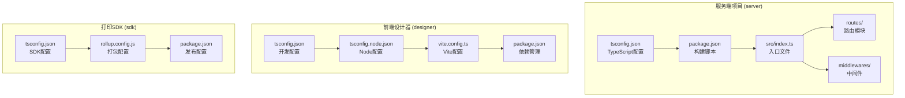
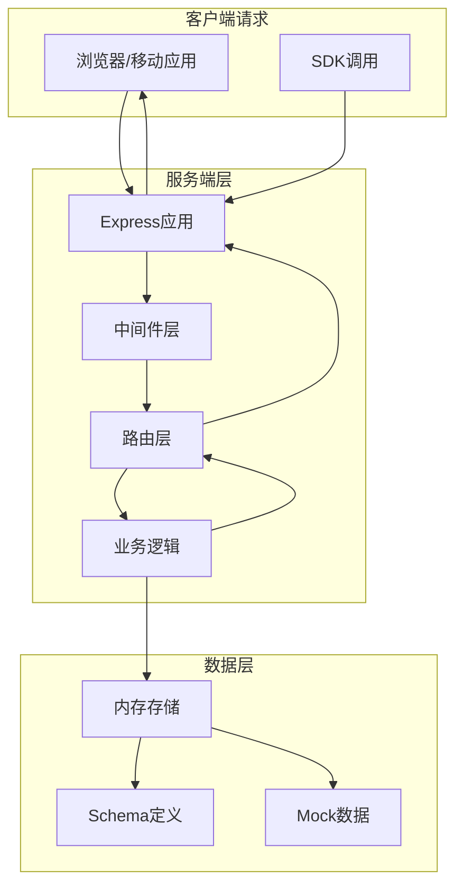
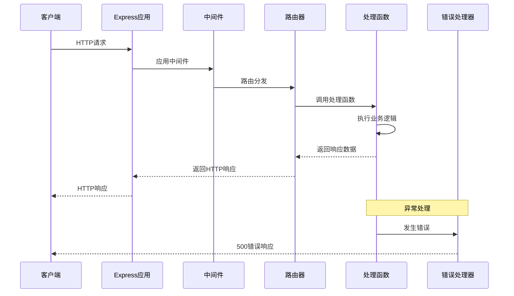
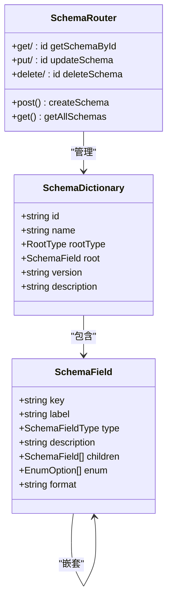
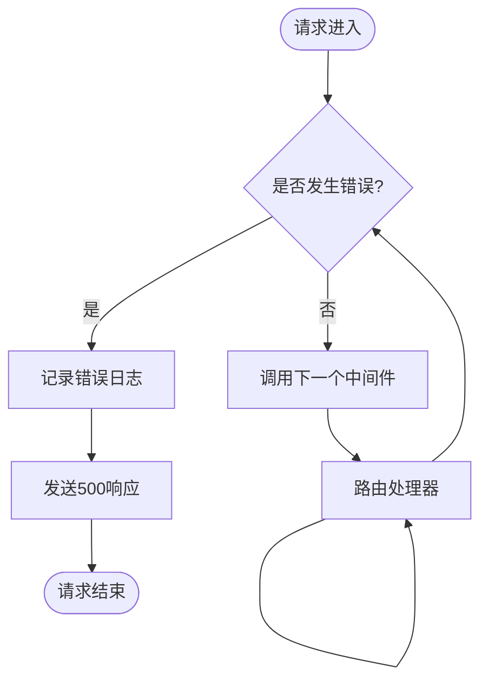
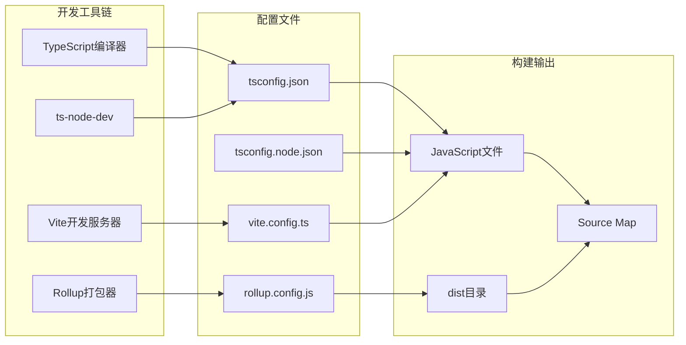

# 服务端构建配置

<cite>
**本文档引用的文件**
- [server/tsconfig.json](file://server/tsconfig.json)
- [server/package.json](file://server/package.json)
- [server/src/index.ts](file://server/src/index.ts)
- [server/src/routes/schemas.ts](file://server/src/routes/schemas.ts)
- [server/src/middlewares/errorHandler.ts](file://server/src/middlewares/errorHandler.ts)
- [designer/tsconfig.json](file://designer/tsconfig.json)
- [designer/tsconfig.node.json](file://designer/tsconfig.node.json)
- [designer/vite.config.ts](file://designer/vite.config.ts)
- [designer/package.json](file://designer/package.json)
- [sdk/tsconfig.json](file://sdk/tsconfig.json)
- [sdk/rollup.config.js](file://sdk/rollup.config.js)
- [sdk/package.json](file://sdk/package.json)
- [DEV_README.md](file://DEV_README.md)
- [dev.sh](file://dev.sh)
</cite>

## 目录
1. [简介](#简介)
2. [项目结构](#项目结构)
3. [核心组件](#核心组件)
4. [架构概览](#架构概览)
5. [详细组件分析](#详细组件分析)
6. [依赖关系分析](#依赖关系分析)
7. [性能考虑](#性能考虑)
8. [故障排除指南](#故障排除指南)
9. [结论](#结论)
10. [附录](#附录)

## 简介
本文档详细说明了打印服务端的构建配置，包括TypeScript编译配置、依赖管理、构建脚本以及Node.js环境兼容性。该服务端基于Express框架，提供Schema管理、Mock数据管理和模板管理的REST API接口。

## 项目结构
服务端采用多包架构，包含独立的服务端、前端设计器和打印SDK三个主要部分：



**图表来源**
- [server/tsconfig.json:1-13](file://server/tsconfig.json#L1-L13)
- [designer/tsconfig.json:1-26](file://designer/tsconfig.json#L1-L26)
- [sdk/tsconfig.json:1-17](file://sdk/tsconfig.json#L1-L17)

**章节来源**
- [server/tsconfig.json:1-13](file://server/tsconfig.json#L1-L13)
- [designer/tsconfig.json:1-26](file://designer/tsconfig.json#L1-L26)
- [sdk/tsconfig.json:1-17](file://sdk/tsconfig.json#L1-L17)

## 核心组件

### TypeScript编译配置
服务端使用标准的TypeScript配置，针对Node.js环境进行了专门优化：

**编译目标设置**
- 目标版本：ES2020
- 模块系统：CommonJS
- 源码目录：src
- 输出目录：dist
- 严格模式：启用
- ES模块互操作：启用
- 库检查：跳过

**关键配置说明**
- `target: "ES2020"` 确保现代JavaScript特性支持
- `module: "CommonJS"` 与Node.js运行时兼容
- `strict: true` 提供严格的类型检查
- `esModuleInterop: true` 解决CommonJS与ES模块间的互操作问题

**章节来源**
- [server/tsconfig.json:1-13](file://server/tsconfig.json#L1-L13)

### 构建脚本配置
服务端提供了完整的开发和生产构建流程：

**开发脚本**
- `dev`: 使用ts-node-dev进行热重载开发
- `build`: 编译TypeScript到JavaScript
- `start`: 运行编译后的生产代码

**开发工具链**
- ts-node-dev: 提供TypeScript热重载开发体验
- transpile-only: 仅转译不进行类型检查，提升开发速度
- respawns: 自动重启进程

**章节来源**
- [server/package.json:1-25](file://server/package.json#L1-L25)

### 依赖管理
服务端依赖管理采用生产依赖和开发依赖分离的策略：

**生产依赖**
- express: Web应用框架
- cors: 跨域资源共享中间件
- uuid: 唯一标识符生成

**开发依赖**
- @types/express: Express类型定义
- @types/cors: CORS类型定义
- @types/node: Node.js类型定义
- @types/uuid: UUID类型定义
- ts-node-dev: TypeScript开发服务器
- typescript: TypeScript编译器

**章节来源**
- [server/package.json:11-23](file://server/package.json#L11-L23)

## 架构概览

### 服务端架构设计



**图表来源**
- [server/src/index.ts:1-25](file://server/src/index.ts#L1-L25)
- [server/src/routes/schemas.ts:1-178](file://server/src/routes/schemas.ts#L1-L178)
- [server/src/middlewares/errorHandler.ts:1-10](file://server/src/middlewares/errorHandler.ts#L1-L10)

### 请求处理流程



**图表来源**
- [server/src/index.ts:1-25](file://server/src/index.ts#L1-L25)
- [server/src/middlewares/errorHandler.ts:1-10](file://server/src/middlewares/errorHandler.ts#L1-L10)

## 详细组件分析

### 入口文件分析
服务端入口文件负责初始化Express应用、配置中间件和启动服务器：

**核心功能**
- 初始化Express应用实例
- 配置CORS跨域支持
- 配置JSON请求体解析
- 注册路由处理器
- 应用全局错误处理器
- 监听端口启动服务器

**配置细节**
- 端口监听：支持环境变量PORT，默认3000
- CORS配置：允许所有来源的跨域请求
- JSON解析：支持application/json格式

**章节来源**
- [server/src/index.ts:1-25](file://server/src/index.ts#L1-L25)

### Schema路由组件



**图表来源**
- [server/src/routes/schemas.ts:6-32](file://server/src/routes/schemas.ts#L6-L32)

**功能特性**
- 完整的CRUD操作支持
- 内置默认Schema数据
- 类型安全的Schema定义
- 支持嵌套字段结构

**数据结构复杂度**
- SchemaField: O(1)访问，支持递归嵌套
- SchemaDictionary: O(n)遍历，n为Schema数量
- 查询操作：O(n)线性搜索

**章节来源**
- [server/src/routes/schemas.ts:1-178](file://server/src/routes/schemas.ts#L1-L178)

### 错误处理中间件



**图表来源**
- [server/src/middlewares/errorHandler.ts:1-10](file://server/src/middlewares/errorHandler.ts#L1-L10)

**错误处理策略**
- 统一错误捕获和处理
- 控制台错误日志记录
- 标准化的500错误响应
- 不暴露内部错误详情给客户端

**章节来源**
- [server/src/middlewares/errorHandler.ts:1-10](file://server/src/middlewares/errorHandler.ts#L1-L10)

### 开发环境配置



**图表来源**
- [designer/tsconfig.json:1-26](file://designer/tsconfig.json#L1-L26)
- [designer/tsconfig.node.json:1-12](file://designer/tsconfig.node.json#L1-L12)
- [sdk/rollup.config.js:1-25](file://sdk/rollup.config.js#L1-L25)

**章节来源**
- [designer/tsconfig.json:1-26](file://designer/tsconfig.json#L1-L26)
- [designer/tsconfig.node.json:1-12](file://designer/tsconfig.node.json#L1-L12)
- [sdk/rollup.config.js:1-25](file://sdk/rollup.config.js#L1-L25)

## 依赖关系分析

### 服务端依赖图

```mermaid
graph TB
subgraph "服务端依赖"
EXPR[express@^4.19.2]
CORS[cors@^2.8.5]
UUID[uuid@^9.0.0]
TS_NODE[ts-node-dev@^2.0.0]
TYPESCRIPT[typescript@^5.0.0]
end
subgraph "类型定义"
TEXP[@types/express]
TCOR[@types/cors]
TNOD[@types/node]
TUUID[@types/uuid]
end
EXPR --> TEXP
CORS --> TCOR
UUID --> TUUID
TS_NODE --> TYPESCRIPT
TS_NODE --> TNOD
```

**图表来源**
- [server/package.json:11-23](file://server/package.json#L11-L23)

### 前端设计器依赖集成

```mermaid
graph LR
subgraph "设计器依赖"
REACT[react@^18.2.0]
ROUTER[react-router-dom@^7.12.0]
ANT[antd@^6.2.1]
SDK[@jcyao/print-sdk]
end
subgraph "开发工具"
VITE[vite@^5.1.0]
ESLINT[eslint@^8.56.0]
TYPESCRIPT[typescript@^5.2.2]
end
subgraph "SDK路径映射"
ALIAS[@jcyao/print-sdk -> ../sdk/src/index.ts]
end
SDK --> ALIAS
VITE --> TYPESCRIPT
ESLINT --> TYPESCRIPT
```

**图表来源**
- [designer/package.json:12-41](file://designer/package.json#L12-L41)
- [designer/vite.config.ts:8-13](file://designer/vite.config.ts#L8-L13)

**章节来源**
- [server/package.json:11-23](file://server/package.json#L11-L23)
- [designer/package.json:12-41](file://designer/package.json#L12-L41)
- [designer/vite.config.ts:8-13](file://designer/vite.config.ts#L8-L13)

## 性能考虑

### 编译优化策略
服务端构建配置针对性能进行了以下优化：

**编译器优化**
- 启用严格模式确保类型安全
- ES模块互操作提升运行时性能
- 跳过库检查减少编译时间
- CommonJS模块系统与Node.js最佳匹配

**运行时优化**
- 生产环境禁用开发工具
- 合理的错误处理避免性能损耗
- 轻量级中间件栈减少请求延迟

### 开发体验优化
- 热重载开发服务器提升迭代效率
- 类型检查与编译分离
- 源码映射便于调试

## 故障排除指南

### 常见构建问题

**TypeScript编译错误**
- 检查tsconfig.json配置是否正确
- 确认类型定义依赖已安装
- 验证模块解析配置

**依赖安装问题**
- 清理node_modules和lock文件重新安装
- 检查npm/yarn/pnpm版本兼容性
- 验证package.json依赖声明

**开发服务器启动失败**
- 检查端口占用情况
- 验证环境变量配置
- 确认依赖完整性

**生产部署问题**
- 确认dist目录已正确生成
- 检查Node.js版本兼容性
- 验证生产依赖安装

### 调试技巧
- 使用source map进行源码调试
- 启用详细的日志输出
- 利用环境变量控制调试级别

**章节来源**
- [DEV_README.md:128-149](file://DEV_README.md#L128-L149)

## 结论
该服务端构建配置展现了现代化的Node.js开发实践，通过合理的TypeScript配置、清晰的依赖管理和高效的构建流程，为打印服务提供了稳定可靠的技术基础。配置重点体现了：

1. **环境适配性**：针对Node.js运行时优化的编译配置
2. **开发效率**：完善的热重载和类型检查机制
3. **生产就绪**：简洁高效的生产构建流程
4. **可维护性**：清晰的模块化架构和依赖管理

## 附录

### 构建检查清单
- [ ] TypeScript编译配置验证
- [ ] 依赖完整性检查
- [ ] 开发服务器启动测试
- [ ] API接口功能验证
- [ ] 错误处理机制测试
- [ ] 性能基准测试

### 环境要求
- Node.js版本：16.x或更高
- npm版本：8.x或更高
- TypeScript版本：5.x
- 开发工具：支持热重载的IDE

### 版本兼容性
- TypeScript: ^5.0.0
- Express: ^4.19.2
- Node.js: ES2020兼容