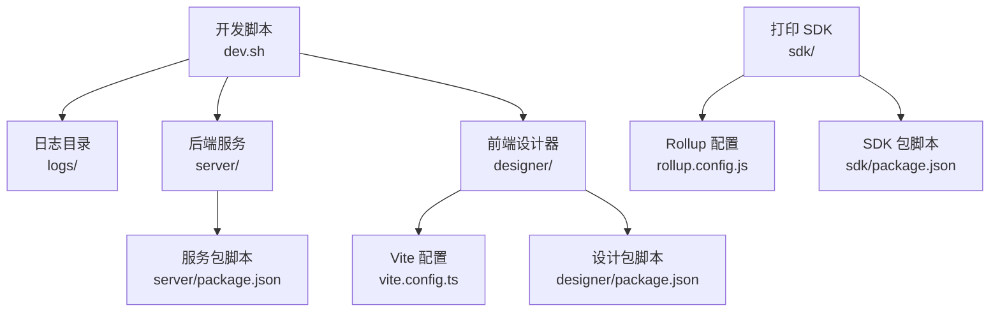
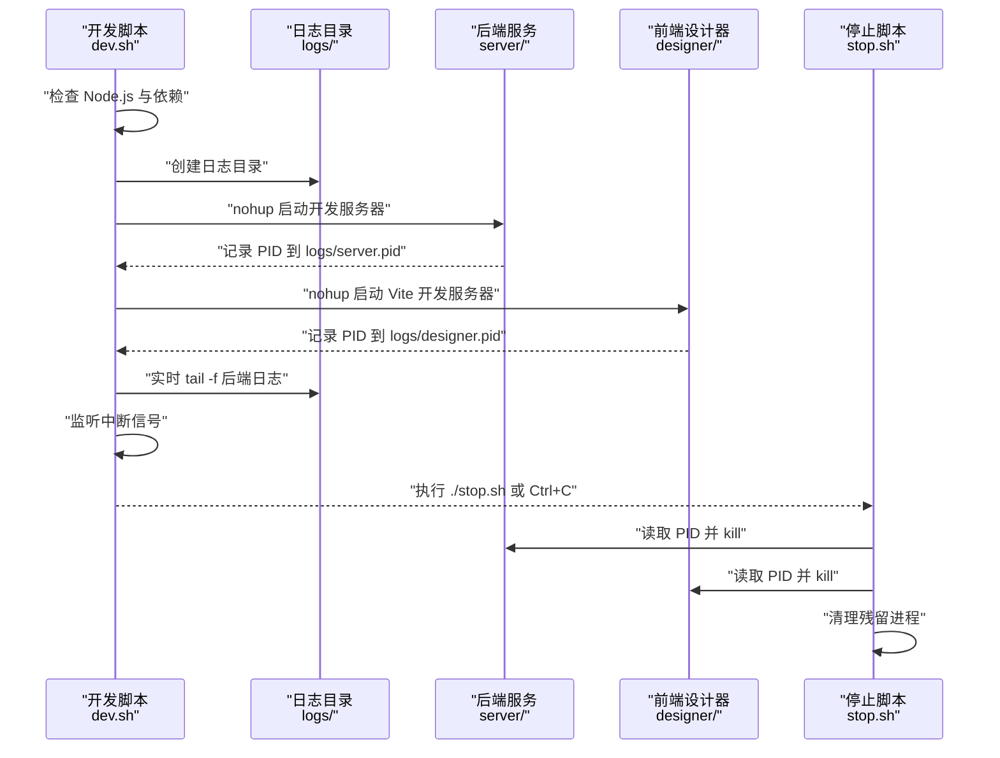
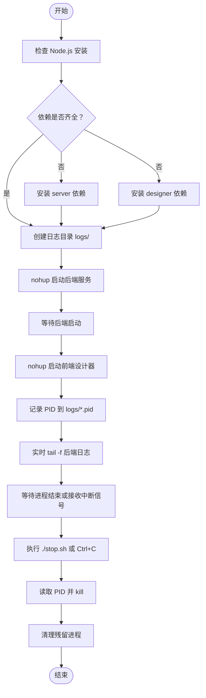
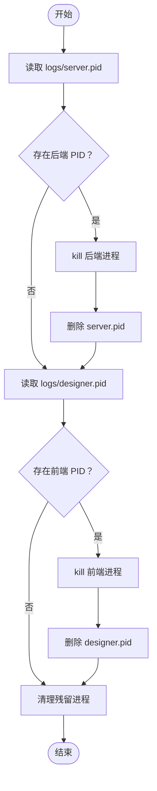
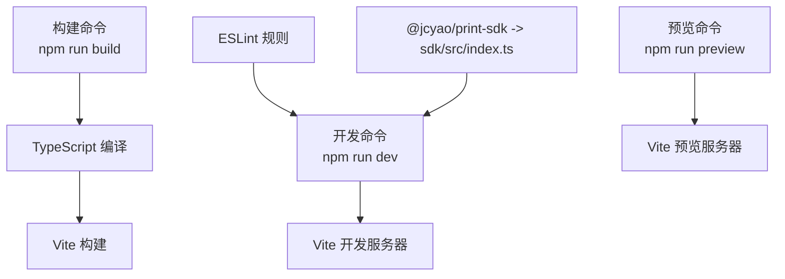
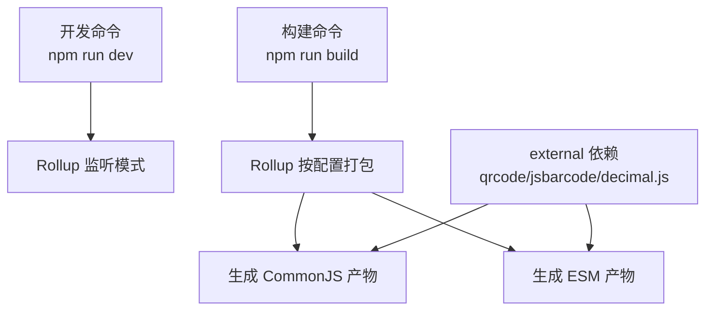
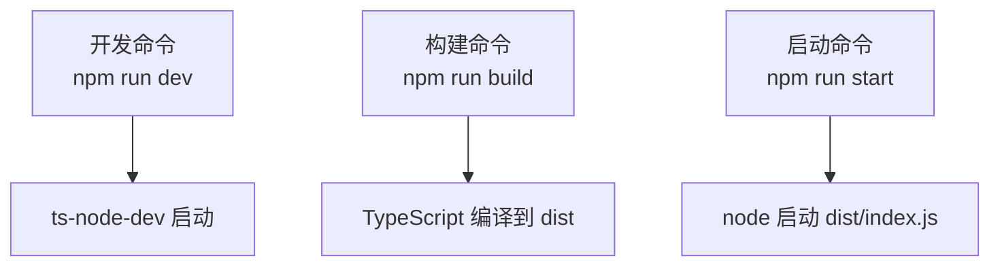
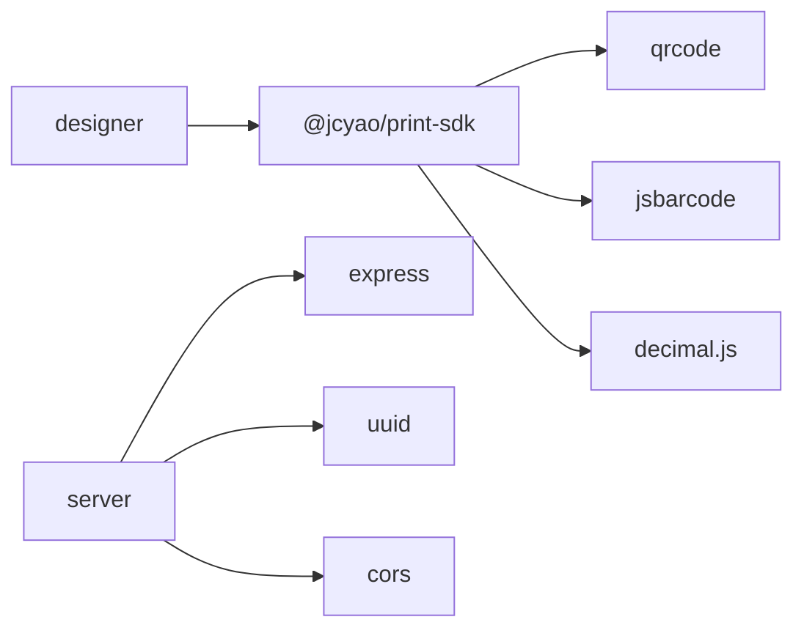

# 构建脚本与命令

<cite>
**本文引用的文件**
- [dev.sh](file://dev.sh)
- [stop.sh](file://stop.sh)
- [DEV_README.md](file://DEV_README.md)
- [designer/package.json](file://designer/package.json)
- [sdk/package.json](file://sdk/package.json)
- [server/package.json](file://server/package.json)
- [designer/vite.config.ts](file://designer/vite.config.ts)
- [sdk/rollup.config.js](file://sdk/rollup.config.js)
- [sdk/tsconfig.json](file://sdk/tsconfig.json)
- [designer/tsconfig.json](file://designer/tsconfig.json)
- [server/tsconfig.json](file://server/tsconfig.json)
</cite>

## 目录
1. [简介](#简介)
2. [项目结构](#项目结构)
3. [核心组件](#核心组件)
4. [架构总览](#架构总览)
5. [详细组件分析](#详细组件分析)
6. [依赖关系分析](#依赖关系分析)
7. [性能考虑](#性能考虑)
8. [故障排除指南](#故障排除指南)
9. [结论](#结论)
10. [附录](#附录)

## 简介
本指南聚焦于项目的构建脚本与命令，涵盖开发启动脚本 dev.sh 的功能与用法、停止脚本 stop.sh 的进程管理能力，以及各模块 package.json 中的构建脚本定义（开发、构建、预览、测试）。同时提供构建流程最佳实践（并行构建、增量构建、缓存策略），并给出常见问题的故障排除方法与性能优化建议，帮助开发者高效地启动、维护与优化整个打印服务平台的开发环境。

## 项目结构
该项目采用多包结构，包含后端服务、前端设计器与打印 SDK 三个主要子模块，并通过统一的启动脚本实现一键启动与日志输出。开发指南文档提供了详细的端口配置、默认数据与常见问题处理方式。

图表来源
- [dev.sh:1-102](file://dev.sh#L1-L102)
- [designer/vite.config.ts:1-15](file://designer/vite.config.ts#L1-L15)
- [designer/package.json:1-43](file://designer/package.json#L1-L43)
- [server/package.json:1-25](file://server/package.json#L1-L25)
- [sdk/rollup.config.js:1-25](file://sdk/rollup.config.js#L1-L25)
- [sdk/package.json:1-60](file://sdk/package.json#L1-L60)

章节来源
- [DEV_README.md:27-52](file://DEV_README.md#L27-L52)
- [dev.sh:1-102](file://dev.sh#L1-L102)

## 核心组件
- 开发启动脚本 dev.sh：负责检查依赖、安装缺失依赖、并行启动后端与前端服务、输出日志、捕获中断信号并优雅停止。
- 停止脚本 stop.sh：根据 PID 文件安全终止进程，并清理残留进程。
- 设计器（前端）：基于 Vite 的开发与构建工具链，支持热更新与本地 SDK 路径映射。
- SDK（打印 SDK）：基于 Rollup 的打包工具链，生成 CommonJS 与 ESM 双格式产物，保留外部依赖。
- 服务端（后端）：基于 TypeScript + Express，使用 ts-node-dev 提供开发期热重载。

章节来源
- [dev.sh:1-102](file://dev.sh#L1-L102)
- [stop.sh:1-37](file://stop.sh#L1-L37)
- [designer/package.json:6-11](file://designer/package.json#L6-L11)
- [sdk/package.json:13-17](file://sdk/package.json#L13-L17)
- [server/package.json:6-10](file://server/package.json#L6-L10)

## 架构总览
下图展示了开发启动脚本如何协调后端与前端服务，以及日志输出与进程管理的关系。

图表来源
- [dev.sh:46-102](file://dev.sh#L46-L102)
- [stop.sh:12-37](file://stop.sh#L12-L37)

## 详细组件分析

### 开发启动脚本 dev.sh
- 功能概览
  - 检查 Node.js 是否安装，若缺失则提示并退出。
  - 自动检测并安装 server 与 designer 的 node_modules。
  - 并行启动后端与前端服务，后台守护运行并将输出写入 logs/server.log 与 logs/designer.log。
  - 记录每个服务的进程 ID 到对应 pid 文件，便于后续停止。
  - 实时展示后端日志，支持 Ctrl+C 终止并优雅关闭两个服务。
- 关键行为
  - 使用 nohup 与重定向确保服务在后台稳定运行。
  - 通过 trap 捕获 INT/TERM 信号，保证进程组被正确清理。
  - 在启动后端后短暂等待，再启动前端，避免前端请求过早导致的连接失败。
- 环境变量与端口
  - 后端可通过环境变量 PORT 自定义端口。
  - 前端可通过修改 vite.config.ts 中的 server.port 来调整端口。
- 日志与监控
  - 日志目录 logs/ 自动生成，包含 server.log 与 designer.log。
  - 可通过 tail -f 实时查看日志。

图表来源
- [dev.sh:17-102](file://dev.sh#L17-L102)

章节来源
- [dev.sh:1-102](file://dev.sh#L1-L102)
- [DEV_README.md:128-136](file://DEV_README.md#L128-L136)

### 停止脚本 stop.sh
- 功能概览
  - 从 logs/server.pid 与 logs/designer.pid 读取进程 ID，尝试安全终止对应进程。
  - 删除对应的 pid 文件，避免重复终止。
  - 使用 pkill 清理可能残留的 vite 与 ts-node-dev 进程，确保环境干净。
- 使用场景
  - 通过 ./stop.sh 命令停止所有服务。
  - 在 dev.sh 终端按 Ctrl+C 后，也可手动执行该脚本进行收尾。

图表来源
- [stop.sh:12-37](file://stop.sh#L12-L37)

章节来源
- [stop.sh:1-37](file://stop.sh#L1-L37)

### 设计器（前端）构建脚本
- 开发命令
  - 使用 Vite 启动开发服务器，支持热更新与 React 插件。
- 构建命令
  - 先执行 TypeScript 编译，再执行 Vite 构建，生成静态资源。
- 预览命令
  - 启动本地静态预览服务器，用于验证构建产物。
- 代码质量
  - ESLint 配置严格规则，确保代码风格与潜在问题及时发现。
- 本地 SDK 路径映射
  - 在开发阶段将 @jcyao/print-sdk 映射到本地 sdk/src/index.ts，便于联调。

图表来源
- [designer/package.json:6-11](file://designer/package.json#L6-L11)
- [designer/vite.config.ts:8-12](file://designer/vite.config.ts#L8-L12)

章节来源
- [designer/package.json:6-11](file://designer/package.json#L6-L11)
- [designer/vite.config.ts:1-15](file://designer/vite.config.ts#L1-L15)

### SDK（打印 SDK）构建脚本
- 开发命令
  - 使用 Rollup 监听模式进行开发，自动重新打包。
- 构建命令
  - 使用 Rollup 按配置生成 CommonJS 与 ESM 两种格式的产物，并生成 SourceMap。
- 测试命令
  - 当前未定义具体测试命令，执行会返回错误并退出。
- 依赖处理
  - 将 qrcode、jsbarcode、decimal.js 标记为 external，不打包进 SDK，由使用者决定引入方式。

图表来源
- [sdk/package.json:13-17](file://sdk/package.json#L13-L17)
- [sdk/rollup.config.js:17-24](file://sdk/rollup.config.js#L17-L24)

章节来源
- [sdk/package.json:13-17](file://sdk/package.json#L13-L17)
- [sdk/rollup.config.js:1-25](file://sdk/rollup.config.js#L1-25)

### 服务端（后端）构建脚本
- 开发命令
  - 使用 ts-node-dev 启动 TypeScript 开发服务器，支持热重载与转译。
- 构建命令
  - 使用 tsc 按项目配置编译 TypeScript 到 dist 目录。
- 启动命令
  - 使用 node 启动已编译的 dist/index.js。

图表来源
- [server/package.json:6-10](file://server/package.json#L6-L10)

章节来源
- [server/package.json:6-10](file://server/package.json#L6-L10)

## 依赖关系分析
- 模块间依赖
  - 设计器依赖 @jcyao/print-sdk，开发时通过路径别名指向本地 SDK 源码，便于联调。
  - SDK 作为独立包，对外部依赖采用 external 策略，降低体积与重复打包风险。
  - 后端服务依赖 Express、UUID、CORS 等，提供 REST 接口。
- 构建工具链
  - 前端：Vite + React 插件；TypeScript 编译；ESLint。
  - SDK：Rollup + TypeScript 插件；external 外部依赖。
  - 后端：TypeScript 编译；ts-node-dev 开发期热重载。

图表来源
- [designer/vite.config.ts:10-12](file://designer/vite.config.ts#L10-L12)
- [sdk/rollup.config.js:17-18](file://sdk/rollup.config.js#L17-L18)
- [server/package.json:11-15](file://server/package.json#L11-L15)

章节来源
- [designer/vite.config.ts:1-15](file://designer/vite.config.ts#L1-L15)
- [sdk/rollup.config.js:1-25](file://sdk/rollup.config.js#L1-L25)
- [server/package.json:1-25](file://server/package.json#L1-L25)

## 性能考虑
- 并行构建与启动
  - dev.sh 已实现后端与前端并行启动，减少整体等待时间。
  - 建议在 CI 环境中对多模块构建使用并行任务，缩短流水线时长。
- 增量构建与缓存
  - Vite 默认支持快速刷新与模块热替换，结合 ts-node-dev 的增量编译可显著提升开发体验。
  - Rollup 可配合插件实现增量打包（如仅变更模块重新打包），但需评估工程复杂度。
  - SDK 的 external 策略可减少重复打包，提高缓存命中率。
- 日志与 I/O
  - 将日志输出到独立文件，避免控制台阻塞；定期清理日志文件，防止磁盘压力过大。
- 端口与网络
  - 若端口冲突，优先通过环境变量与配置文件调整端口，避免频繁重启。
- 依赖安装
  - 使用 pnpm（仓库内锁文件存在）可提升安装速度与磁盘占用控制。

[本节为通用性能建议，无需特定文件引用]

## 故障排除指南
- 端口被占用
  - 后端：设置环境变量 PORT 自定义端口。
  - 前端：修改 vite.config.ts 中的 server.port。
- 无法找到 Node.js
  - 安装 Node.js 并确保 PATH 生效，dev.sh 会在启动前检查。
- 依赖未安装
  - dev.sh 会自动检测并安装 server 与 designer 的依赖；若失败，可手动进入对应目录执行安装。
- 进程未正确停止
  - 使用 ./stop.sh 或在 dev.sh 终端按 Ctrl+C；若仍有残留，stop.sh 会尝试 pkill 清理。
- 日志文件过大
  - 删除 logs/*.log 文件以释放空间。
- 默认数据未加载
  - 重启 server 后会自动重置为内置默认数据。

章节来源
- [DEV_README.md:128-149](file://DEV_README.md#L128-L149)
- [dev.sh:17-37](file://dev.sh#L17-L37)
- [stop.sh:12-37](file://stop.sh#L12-L37)

## 结论
本指南系统梳理了开发启动脚本、停止脚本与各模块构建脚本的职责与用法，并结合实际配置文件展示了它们之间的协作关系。通过并行启动、增量构建与合理的缓存策略，开发者可以在保证质量的前提下显著提升开发效率。遇到问题时，可依据故障排除指南快速定位与解决。

## 附录
- 常用命令速查
  - 启动开发环境：./dev.sh
  - 停止服务：./stop.sh
  - 设计器开发：npm run dev（designer）
  - 设计器构建：npm run build（designer）
  - SDK 开发：npm run dev（sdk）
  - SDK 构建：npm run build（sdk）
  - 后端开发：npm run dev（server）
  - 后端构建：npm run build（server）
  - 后端启动：npm run start（server）

[本节为操作指引汇总，无需特定文件引用]