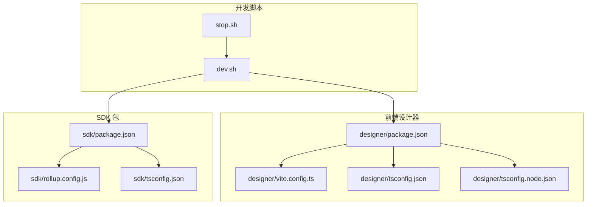
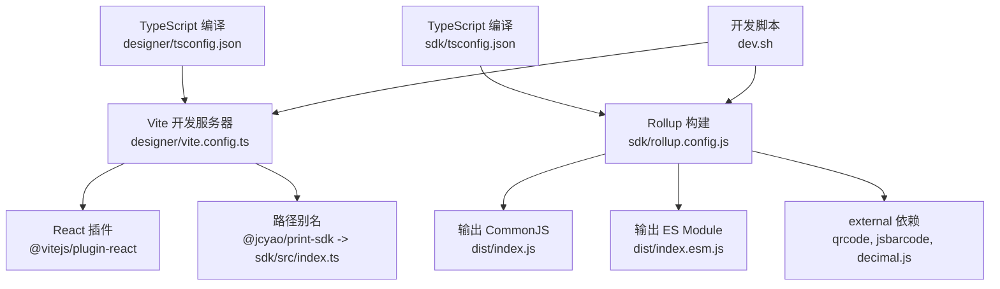
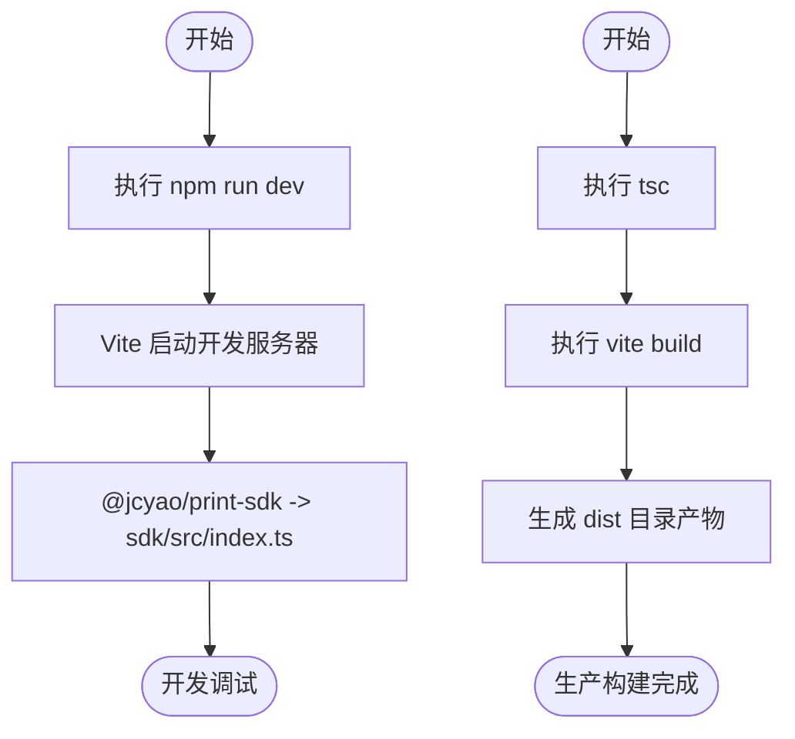
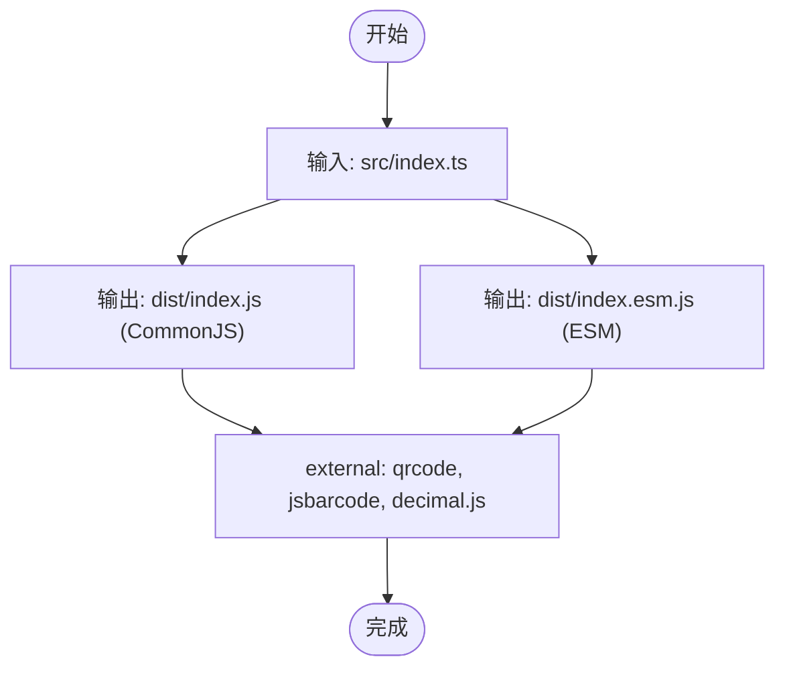
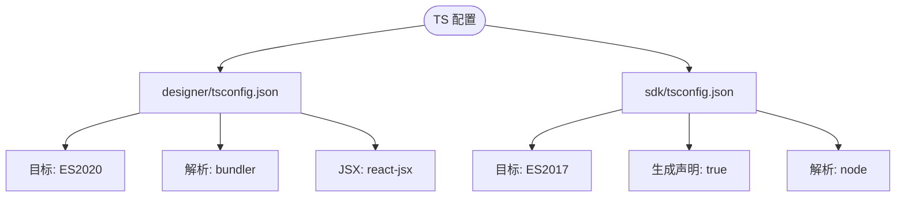
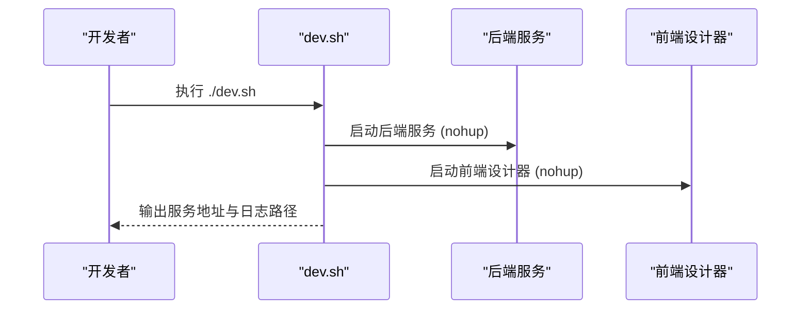
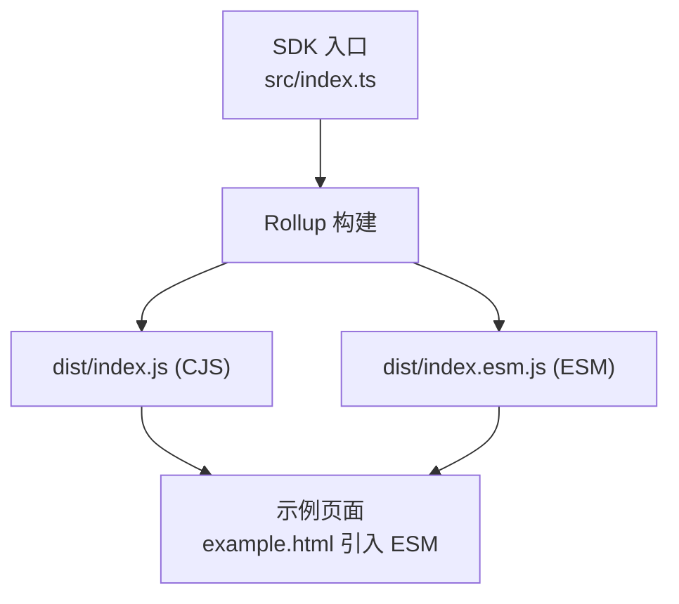
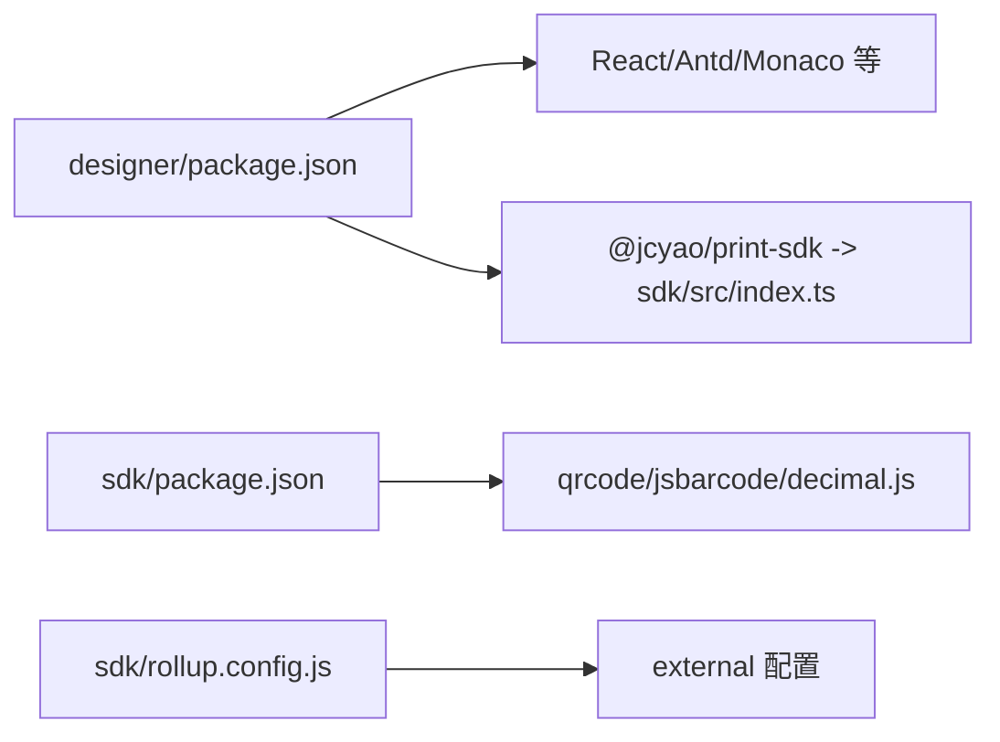

# 项目构建

<cite>
**本文引用的文件**   
- [designer/vite.config.ts](file://designer/vite.config.ts)
- [sdk/rollup.config.js](file://sdk/rollup.config.js)
- [designer/tsconfig.json](file://designer/tsconfig.json)
- [designer/tsconfig.node.json](file://designer/tsconfig.node.json)
- [sdk/tsconfig.json](file://sdk/tsconfig.json)
- [designer/package.json](file://designer/package.json)
- [sdk/package.json](file://sdk/package.json)
- [dev.sh](file://dev.sh)
- [stop.sh](file://stop.sh)
- [example.html](file://sdk/example.html)
- [README.md](file://README.md)
</cite>

## 目录
1. [简介](#简介)
2. [项目结构](#项目结构)
3. [核心组件](#核心组件)
4. [架构总览](#架构总览)
5. [详细组件分析](#详细组件分析)
6. [依赖分析](#依赖分析)
7. [性能考量](#性能考量)
8. [故障排查指南](#故障排查指南)
9. [结论](#结论)
10. [附录](#附录)

## 简介
本指南面向打印平台的构建流程，覆盖以下方面：
- 前端 Vite 构建配置：开发构建、生产构建与优化策略
- SDK Rollup 构建配置：打包策略、外部依赖处理与输出格式
- TypeScript 编译配置：编译选项、路径映射与类型检查
- 构建命令与脚本：开发、生产与 SDK 发布构建的使用说明
- 构建产物分析与优化：帮助开发者理解构建流程与性能优化

## 项目结构
该项目采用多包结构，包含前端设计器、SDK 包与服务端模块。构建相关的关键文件分布如下：
- 前端设计器：Vite 配置、TypeScript 配置与构建脚本
- SDK 包：Rollup 配置、TypeScript 配置与发布脚本
- 开发脚本：一键启动前后端与日志管理

**图表来源**
- [designer/vite.config.ts:1-15](file://designer/vite.config.ts#L1-L15)
- [sdk/rollup.config.js:1-25](file://sdk/rollup.config.js#L1-L25)
- [designer/tsconfig.json:1-26](file://designer/tsconfig.json#L1-L26)
- [designer/tsconfig.node.json:1-12](file://designer/tsconfig.node.json#L1-L12)
- [sdk/tsconfig.json:1-17](file://sdk/tsconfig.json#L1-L17)
- [designer/package.json:1-43](file://designer/package.json#L1-L43)
- [sdk/package.json:1-60](file://sdk/package.json#L1-L60)
- [dev.sh:1-102](file://dev.sh#L1-L102)
- [stop.sh:1-37](file://stop.sh#L1-L37)

**章节来源**
- [designer/vite.config.ts:1-15](file://designer/vite.config.ts#L1-L15)
- [sdk/rollup.config.js:1-25](file://sdk/rollup.config.js#L1-L25)
- [designer/tsconfig.json:1-26](file://designer/tsconfig.json#L1-L26)
- [designer/tsconfig.node.json:1-12](file://designer/tsconfig.node.json#L1-L12)
- [sdk/tsconfig.json:1-17](file://sdk/tsconfig.json#L1-L17)
- [designer/package.json:1-43](file://designer/package.json#L1-L43)
- [sdk/package.json:1-60](file://sdk/package.json#L1-L60)
- [dev.sh:1-102](file://dev.sh#L1-L102)
- [stop.sh:1-37](file://stop.sh#L1-L37)

## 核心组件
- 前端 Vite 配置：启用 React 插件与本地 SDK 路径别名，便于开发联调
- SDK Rollup 配置：同时输出 CommonJS 与 ES Module，并将部分依赖标记为 external
- TypeScript 配置：分别针对前端与 SDK 的不同目标与严格程度进行编译选项配置
- 构建脚本：提供开发联调脚本与 SDK 构建脚本

**章节来源**
- [designer/vite.config.ts:1-15](file://designer/vite.config.ts#L1-L15)
- [sdk/rollup.config.js:1-25](file://sdk/rollup.config.js#L1-L25)
- [designer/tsconfig.json:1-26](file://designer/tsconfig.json#L1-L26)
- [sdk/tsconfig.json:1-17](file://sdk/tsconfig.json#L1-L17)
- [designer/package.json:6-10](file://designer/package.json#L6-L10)
- [sdk/package.json:13-16](file://sdk/package.json#L13-L16)

## 架构总览
下图展示了前端与 SDK 的构建关系与产物流向：

**图表来源**
- [designer/vite.config.ts:6-14](file://designer/vite.config.ts#L6-L14)
- [sdk/rollup.config.js:3-24](file://sdk/rollup.config.js#L3-L24)
- [designer/tsconfig.json:2-22](file://designer/tsconfig.json#L2-L22)
- [sdk/tsconfig.json:2-13](file://sdk/tsconfig.json#L2-L13)
- [dev.sh:42-71](file://dev.sh#L42-L71)

## 详细组件分析

### 前端 Vite 构建配置
- 插件与解析
  - 使用 React 插件以支持 JSX 与 React HMR
  - 通过路径别名将 SDK 指向本地源码，便于开发调试
- 开发与预览
  - 开发命令启动 Vite 本地服务
  - 预览命令用于本地验证构建产物
- 生产构建
  - 生产构建顺序为：先执行 TypeScript 编译，再执行 Vite 打包
  - 该顺序确保类型检查与构建的一致性

**图表来源**
- [designer/vite.config.ts:6-14](file://designer/vite.config.ts#L6-L14)
- [designer/package.json:7-10](file://designer/package.json#L7-L10)

**章节来源**
- [designer/vite.config.ts:1-15](file://designer/vite.config.ts#L1-L15)
- [designer/package.json:6-10](file://designer/package.json#L6-L10)

### SDK Rollup 构建配置
- 输入与输出
  - 输入为 SDK 入口文件
  - 输出同时生成 CommonJS 与 ES Module，并均开启 Source Map
- 外部依赖
  - 将二维码、条形码与高精度计算等依赖标记为 external，避免打入包体
- 类型声明
  - 通过 TypeScript 插件生成类型声明文件，配合 tsconfig 的 declaration 选项

**图表来源**
- [sdk/rollup.config.js:4-24](file://sdk/rollup.config.js#L4-L24)
- [sdk/tsconfig.json:6-6](file://sdk/tsconfig.json#L6-L6)

**章节来源**
- [sdk/rollup.config.js:1-25](file://sdk/rollup.config.js#L1-L25)
- [sdk/tsconfig.json:1-17](file://sdk/tsconfig.json#L1-L17)
- [sdk/package.json:6-8](file://sdk/package.json#L6-L8)

### TypeScript 编译配置
- 前端 TypeScript 配置
  - 目标与模块：ES2020 与 ESNext
  - 模块解析：bundler，适配 Vite
  - JSX：react-jsx
  - 严格模式与未使用检查：开启
- SDK TypeScript 配置
  - 目标与模块：ES2017 与 ESNext
  - 生成声明文件：开启
  - 模块解析：node
  - 严格模式与互操作：开启

**图表来源**
- [designer/tsconfig.json:2-22](file://designer/tsconfig.json#L2-L22)
- [sdk/tsconfig.json:2-13](file://sdk/tsconfig.json#L2-L13)

**章节来源**
- [designer/tsconfig.json:1-26](file://designer/tsconfig.json#L1-L26)
- [designer/tsconfig.node.json:1-12](file://designer/tsconfig.node.json#L1-L12)
- [sdk/tsconfig.json:1-17](file://sdk/tsconfig.json#L1-L17)

### 构建命令与脚本
- 前端设计器
  - 开发：启动 Vite 本地服务
  - 预览：本地预览生产构建
  - 生产：先执行 tsc 再执行 vite build
- SDK 包
  - 开发：Rollup 监听构建
  - 发布：Rollup 一次性构建
- 一键开发脚本
  - 同时启动后端服务与前端设计器，带日志与 PID 管理

**图表来源**
- [dev.sh:42-87](file://dev.sh#L42-L87)
- [designer/package.json:7-10](file://designer/package.json#L7-L10)
- [sdk/package.json:15-16](file://sdk/package.json#L15-L16)

**章节来源**
- [designer/package.json:6-10](file://designer/package.json#L6-L10)
- [sdk/package.json:13-16](file://sdk/package.json#L13-L16)
- [dev.sh:1-102](file://dev.sh#L1-L102)
- [stop.sh:1-37](file://stop.sh#L1-L37)

### 构建产物分析与优化
- 前端产物
  - 通过 Vite 构建生成静态资源与 HTML；结合路径别名可减少重复打包
- SDK 产物
  - 同时产出 CommonJS 与 ESM，满足不同运行环境
  - external 依赖减少包体积，但需确保消费者运行时具备相应依赖
- 示例页面
  - 示例页面演示如何引入 ESM 版本的 SDK 并进行打印调用

**图表来源**
- [sdk/rollup.config.js:5-16](file://sdk/rollup.config.js#L5-L16)
- [sdk/example.html:130-134](file://sdk/example.html#L130-L134)

**章节来源**
- [sdk/rollup.config.js:1-25](file://sdk/rollup.config.js#L1-L25)
- [sdk/example.html:130-134](file://sdk/example.html#L130-L134)

## 依赖分析
- 前端依赖
  - React、Ant Design、Monaco Editor、QRCode、JSBarcode、BWIP 等
  - 通过 Vite 配置的路径别名指向本地 SDK 源码，便于联调
- SDK 依赖
  - 外部依赖：qrcode、jsbarcode、decimal.js
  - 通过 external 配置避免打入 SDK 包体
- 开发脚本
  - 自动安装依赖、后台启动服务、记录 PID、实时日志

**图表来源**
- [designer/package.json:12-28](file://designer/package.json#L12-L28)
- [designer/vite.config.ts:10-12](file://designer/vite.config.ts#L10-L12)
- [sdk/package.json:49-53](file://sdk/package.json#L49-L53)
- [sdk/rollup.config.js:17-18](file://sdk/rollup.config.js#L17-L18)

**章节来源**
- [designer/package.json:12-28](file://designer/package.json#L12-L28)
- [sdk/package.json:49-53](file://sdk/package.json#L49-L53)
- [sdk/rollup.config.js:17-18](file://sdk/rollup.config.js#L17-L18)
- [designer/vite.config.ts:10-12](file://designer/vite.config.ts#L10-L12)

## 性能考量
- 构建体积
  - SDK 使用 external 外部依赖，显著降低包体；注意消费者运行时需提供相应依赖
- 构建速度
  - Vite 开发阶段利用 HMR 与按需编译提升迭代效率
  - Rollup 构建同时输出 CJS 与 ESM，避免重复构建
- 运行时性能
  - 打印预览与直接打印均通过隐藏 iframe 或新窗口实现，避免阻塞主线程
  - 图片资源加载完成后触发打印，减少白屏或内容缺失

[本节为通用指导，不涉及具体文件分析]

## 故障排查指南
- 依赖未安装
  - 使用开发脚本自动安装 server 与 designer 的依赖
- 无法启动开发环境
  - 检查 Node.js 版本与网络代理；确认端口未被占用
- SDK 无法在浏览器中使用
  - 确认 external 依赖已在运行时环境中提供
  - 使用示例页面验证 ESM 引入是否正确
- 停止服务
  - 使用停止脚本根据 PID 文件安全终止服务；清理残留进程

**章节来源**
- [dev.sh:17-39](file://dev.sh#L17-L39)
- [stop.sh:12-33](file://stop.sh#L12-L33)
- [sdk/rollup.config.js:17-18](file://sdk/rollup.config.js#L17-L18)
- [sdk/example.html:130-134](file://sdk/example.html#L130-L134)

## 结论
本指南梳理了打印平台的构建体系：前端基于 Vite 的高效开发与生产构建，SDK 基于 Rollup 的多格式输出与外部依赖剥离，以及 TypeScript 的严格配置保障类型安全。通过开发脚本与示例页面，开发者可以快速启动、联调与验证打印能力。

[本节为总结性内容，不涉及具体文件分析]

## 附录
- 快速参考
  - 前端开发：在设计器目录执行开发命令
  - 前端生产：在设计器目录先执行类型检查再执行构建
  - SDK 开发：在 SDK 目录执行监听构建
  - SDK 发布：在 SDK 目录执行一次性构建
  - 一键开发：在根目录执行开发脚本

**章节来源**
- [designer/package.json:6-10](file://designer/package.json#L6-L10)
- [sdk/package.json:13-16](file://sdk/package.json#L13-L16)
- [dev.sh:42-71](file://dev.sh#L42-L71)
- [README.md:265-293](file://README.md#L265-L293)