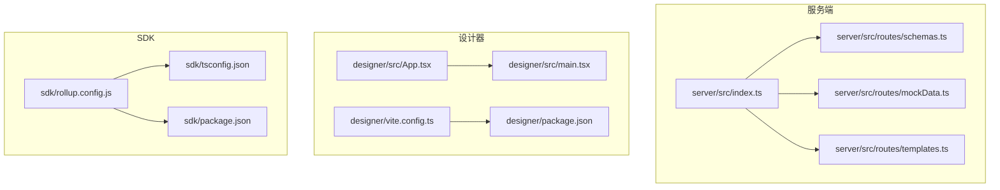
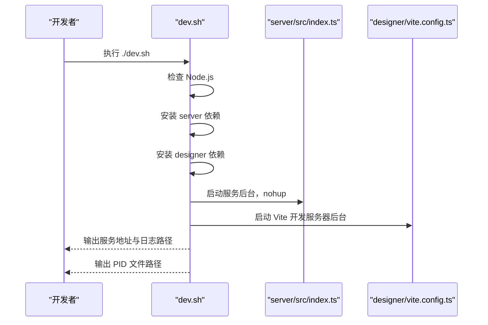
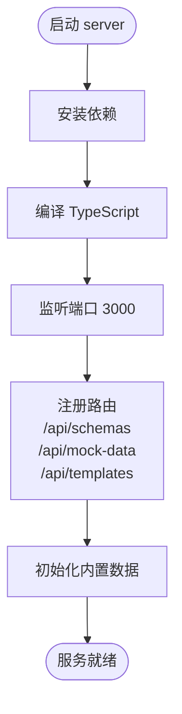
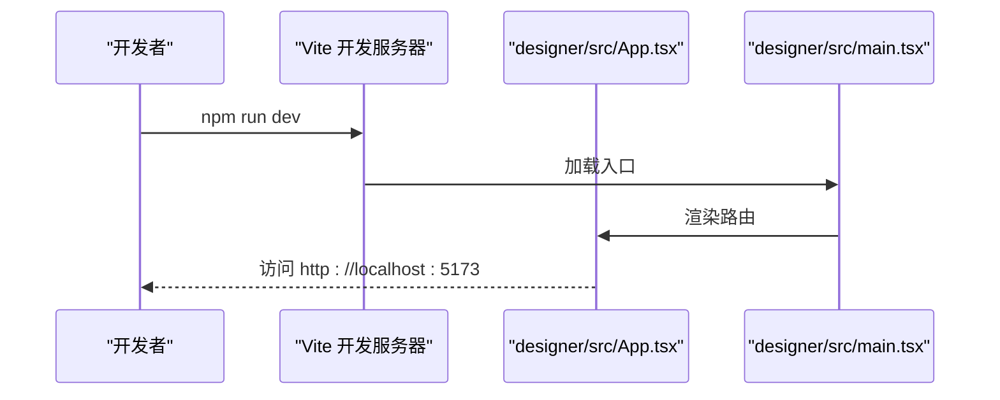
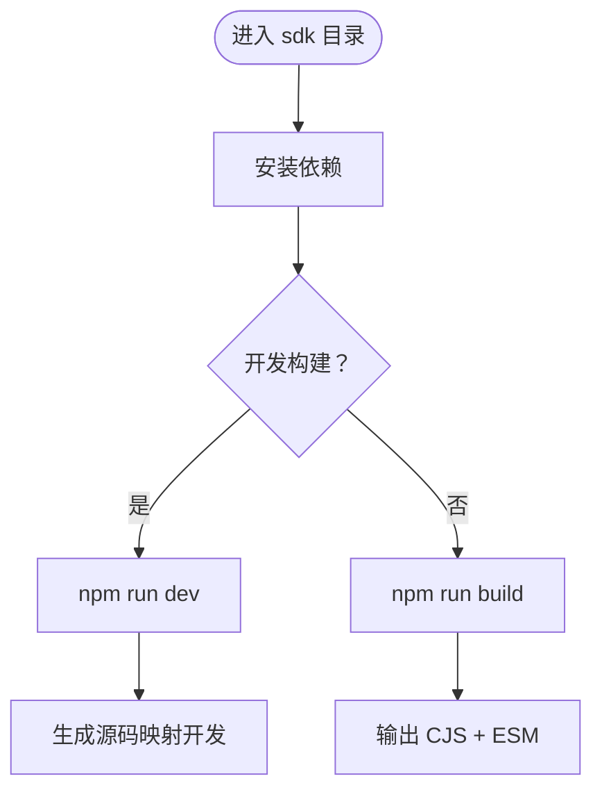
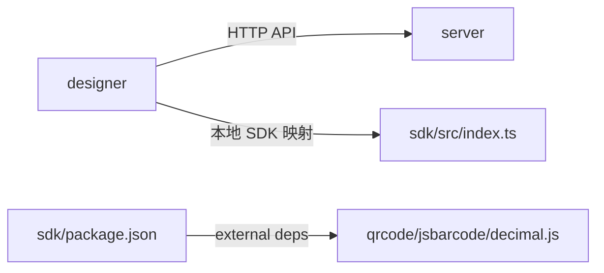

# 快速开始

<cite>
**本文引用的文件**   
- [README.md](file://README.md)
- [DEV_README.md](file://DEV_README.md)
- [dev.sh](file://dev.sh)
- [designer/package.json](file://designer/package.json)
- [designer/vite.config.ts](file://designer/vite.config.ts)
- [designer/tsconfig.json](file://designer/tsconfig.json)
- [designer/src/main.tsx](file://designer/src/main.tsx)
- [designer/src/App.tsx](file://designer/src/App.tsx)
- [sdk/package.json](file://sdk/package.json)
- [sdk/tsconfig.json](file://sdk/tsconfig.json)
- [sdk/rollup.config.js](file://sdk/rollup.config.js)
- [server/package.json](file://server/package.json)
- [server/src/index.ts](file://server/src/index.ts)
- [server/src/routes/schemas.ts](file://server/src/routes/schemas.ts)
- [server/src/routes/mockData.ts](file://server/src/routes/mockData.ts)
- [server/src/routes/templates.ts](file://server/src/routes/templates.ts)
</cite>

## 目录
1. [简介](#简介)
2. [项目结构](#项目结构)
3. [核心组件](#核心组件)
4. [架构总览](#架构总览)
5. [详细组件分析](#详细组件分析)
6. [依赖关系分析](#依赖关系分析)
7. [性能注意事项](#性能注意事项)
8. [故障排查指南](#故障排查指南)
9. [结论](#结论)
10. [附录](#附录)

## 简介
本指南面向新手开发者，帮助你在最短时间内完成打印服务平台的开发环境搭建与运行。你将获得：
- 环境准备与依赖安装
- 三个模块（设计器、SDK、服务端）的启动流程与配置要点
- 开发环境配置清单与常见问题解答
- 实际命令行示例与预期输出说明

## 项目结构
项目采用多模块组织方式，包含服务端（Node.js）、可视化设计器（React/Vite）与独立 SDK（Rollup 打包），并通过统一的开发脚本进行一键启动。

**图表来源**
- [server/src/index.ts:1-25](file://server/src/index.ts#L1-L25)
- [server/src/routes/schemas.ts:1-178](file://server/src/routes/schemas.ts#L1-L178)
- [server/src/routes/mockData.ts:1-448](file://server/src/routes/mockData.ts#L1-L448)
- [server/src/routes/templates.ts:1-800](file://server/src/routes/templates.ts#L1-L800)
- [designer/src/main.tsx:1-8](file://designer/src/main.tsx#L1-L8)
- [designer/src/App.tsx:1-31](file://designer/src/App.tsx#L1-L31)
- [designer/vite.config.ts:1-15](file://designer/vite.config.ts#L1-L15)
- [sdk/rollup.config.js:1-25](file://sdk/rollup.config.js#L1-L25)
- [sdk/tsconfig.json:1-17](file://sdk/tsconfig.json#L1-L17)
- [sdk/package.json:1-60](file://sdk/package.json#L1-L60)

**章节来源**
- [README.md: 191-234:191-234](file://README.md#L191-L234)

## 核心组件
- 服务端（Node.js + Express）
  - 提供 REST API：/api/schemas、/api/mock-data、/api/templates
  - 默认监听端口：3000（可通过环境变量 PORT 修改）
- 设计器（React + Vite）
  - 开发端口：5173
  - 本地 SDK 路径映射：指向 sdk/src/index.ts，便于联调
- SDK（Rollup 打包）
  - 输出 CommonJS 与 ESM 两种格式
  - 外部依赖：qrcode、jsbarcode、decimal.js

**章节来源**
- [server/src/index.ts: 20-24:20-24](file://server/src/index.ts#L20-L24)
- [designer/vite.config.ts: 10-12:10-12](file://designer/vite.config.ts#L10-L12)
- [sdk/rollup.config.js: 17-18:17-18](file://sdk/rollup.config.js#L17-L18)

## 架构总览
下面的序列图展示了“一键启动”脚本如何同时启动服务端与设计器，并输出日志与 PID 文件。

**图表来源**
- [dev.sh: 20-67:20-67](file://dev.sh#L20-L67)
- [server/src/index.ts: 22-24:22-24](file://server/src/index.ts#L22-L24)
- [designer/vite.config.ts: 6-14:6-14](file://designer/vite.config.ts#L6-L14)

**章节来源**
- [dev.sh: 17-87:17-87](file://dev.sh#L17-L87)

## 详细组件分析

### 服务端（Node.js）启动与配置
- 启动方式
  - 开发：在 server 目录执行安装与启动命令
  - 生产：构建后通过 dist/index.js 启动
- 关键配置
  - 端口：默认 3000；可通过环境变量 PORT 修改
  - 路由：/api/schemas、/api/mock-data、/api/templates
  - 中间件：CORS、JSON 解析、全局错误处理
- 内置数据
  - Schema、Mock 数据、示例模板在服务启动时初始化

**图表来源**
- [server/src/index.ts: 9-18:9-18](file://server/src/index.ts#L9-L18)
- [server/src/routes/schemas.ts: 118](file://server/src/routes/schemas.ts#L118)
- [server/src/routes/mockData.ts: 380](file://server/src/routes/mockData.ts#L380)
- [server/src/routes/templates.ts: 60](file://server/src/routes/templates.ts#L60)

**章节来源**
- [server/package.json: 6-9:6-9](file://server/package.json#L6-L9)
- [server/src/index.ts: 11-18:11-18](file://server/src/index.ts#L11-L18)
- [server/src/routes/schemas.ts: 34-116:34-116](file://server/src/routes/schemas.ts#L34-L116)
- [server/src/routes/mockData.ts: 15-177:15-177](file://server/src/routes/mockData.ts#L15-L177)
- [server/src/routes/templates.ts: 60-L800:60-800](file://server/src/routes/templates.ts#L60-L800)

### 设计器（React + Vite）启动与配置
- 启动方式
  - 在 designer 目录执行安装与启动命令
  - 一键启动脚本也会自动启动设计器
- 关键配置
  - Vite 开发端口：5173
  - 本地 SDK 路径映射：指向 sdk/src/index.ts，便于本地联调
  - TypeScript 配置：严格模式、Bundler 模式
- 入口与路由
  - main.tsx 作为应用入口
  - App.tsx 定义路由与布局

**图表来源**
- [designer/vite.config.ts: 6-14:6-14](file://designer/vite.config.ts#L6-L14)
- [designer/src/main.tsx: 5-7:5-7](file://designer/src/main.tsx#L5-L7)
- [designer/src/App.tsx: 9-27:9-27](file://designer/src/App.tsx#L9-L27)

**章节来源**
- [designer/package.json: 6-10:6-10](file://designer/package.json#L6-L10)
- [designer/vite.config.ts: 6-14:6-14](file://designer/vite.config.ts#L6-L14)
- [designer/tsconfig.json: 2-22:2-22](file://designer/tsconfig.json#L2-L22)
- [designer/src/main.tsx: 1-8:1-8](file://designer/src/main.tsx#L1-L8)
- [designer/src/App.tsx: 1-31:1-31](file://designer/src/App.tsx#L1-L31)

### SDK（Rollup 打包）构建与配置
- 构建方式
  - 开发：npm run dev（监听文件变化）
  - 生产：npm run build（输出 CommonJS 与 ESM）
- 输出产物
  - dist/index.js（CommonJS）
  - dist/index.esm.js（ES Module）
- 外部依赖
  - qrcode、jsbarcode、decimal.js 不打入包内，由使用者决定版本

**图表来源**
- [sdk/package.json: 13-16:13-16](file://sdk/package.json#L13-L16)
- [sdk/rollup.config.js: 5-16:5-16](file://sdk/rollup.config.js#L5-L16)
- [sdk/tsconfig.json: 2-12:2-12](file://sdk/tsconfig.json#L2-L12)

**章节来源**
- [sdk/package.json: 13-16:13-16](file://sdk/package.json#L13-L16)
- [sdk/rollup.config.js: 17-18:17-18](file://sdk/rollup.config.js#L17-L18)
- [sdk/tsconfig.json: 1-L17:1-17](file://sdk/tsconfig.json#L1-L17)

## 依赖关系分析
- 设计器依赖服务端提供的 API
- 设计器在开发时通过本地 SDK 路径映射，直接引用 sdk/src/index.ts
- SDK 以外部依赖形式引入 qrcode、jsbarcode、decimal.js

**图表来源**
- [designer/vite.config.ts: 10-12:10-12](file://designer/vite.config.ts#L10-L12)
- [sdk/package.json: 49-53:49-53](file://sdk/package.json#L49-L53)

**章节来源**
- [designer/vite.config.ts: 10-12:10-12](file://designer/vite.config.ts#L10-L12)
- [sdk/package.json: 49-53:49-53](file://sdk/package.json#L49-L53)

## 性能注意事项
- 大表格与批量打印：服务端内置大数据量 Mock 数据，可用于测试分页与表格渲染性能
- 打印引擎：基于相对间距的分页模型，支持表格跨页与页码功能，建议在设计器中先行验证复杂模板的分页效果
- SDK 打包：Rollup 输出两种格式，按需选择 CJS 或 ESM，减少不必要的体积

[本节为通用指导，无需列出具体文件来源]

## 故障排查指南
- 端口被占用
  - 服务端：设置环境变量 PORT=3001
  - 设计器：修改 designer/vite.config.ts 中的 server.port
- 日志过大
  - 删除 logs/*.log 文件
- 无法访问服务端 API
  - 确认服务端已启动且端口为 3000
  - 确认 CORS 已启用（默认已配置）

**章节来源**
- [DEV_README.md: 130-148:130-148](file://DEV_README.md#L130-L148)
- [server/src/index.ts: 11](file://server/src/index.ts#L11)

## 结论
通过本指南，你可以使用一键启动脚本或分步命令快速拉起服务端、设计器与 SDK。建议先在设计器中创建并测试模板，再集成 SDK 到你的业务系统中。遇到问题时，优先检查端口占用、日志与 CORS 配置。

[本节为总结性内容，无需列出具体文件来源]

## 附录

### 环境与版本要求
- Node.js：脚本会检查 Node.js 是否安装并输出版本
- 设计器与 SDK：使用 TypeScript 5.x、Vite 5.x、Rollup 4.x

**章节来源**
- [dev.sh: 20-25:20-25](file://dev.sh#L20-L25)
- [designer/tsconfig.json: 2-L22:2-22](file://designer/tsconfig.json#L2-L22)
- [sdk/tsconfig.json: 2-L12:2-12](file://sdk/tsconfig.json#L2-L12)

### 开发环境配置清单
- 一键启动
  - 执行：./dev.sh
  - 输出：后端服务地址、前端设计器地址、日志路径、PID 文件
- 分步启动
  - 服务端：cd server && npm install && npm run dev
  - 设计器：cd designer && npm install && npm run dev
  - SDK：cd sdk && npm install && npm run build
- 端口与日志
  - 服务端：默认端口 3000（可改）
  - 设计器：默认端口 5173（可在 vite.config.ts 修改）
  - 日志：logs/server.log、logs/designer.log

**章节来源**
- [DEV_README.md: 5-L24:5-24](file://DEV_README.md#L5-L24)
- [dev.sh: 46-87:46-87](file://dev.sh#L46-L87)
- [server/src/index.ts: 20](file://server/src/index.ts#L20)
- [designer/vite.config.ts: 6-14:6-14](file://designer/vite.config.ts#L6-L14)

### 常见问题与解决方案
- 端口被占用
  - 修改服务端端口：设置环境变量 PORT
  - 修改设计器端口：在 vite.config.ts 中调整 server.port
- 如何添加默认数据
  - 编辑 server/src/routes/schemas.ts 与 server/src/routes/mockData.ts 中的默认数组
- 日志清理
  - 删除 logs/*.log 文件

**章节来源**
- [DEV_README.md: 130-148:130-148](file://DEV_README.md#L130-L148)