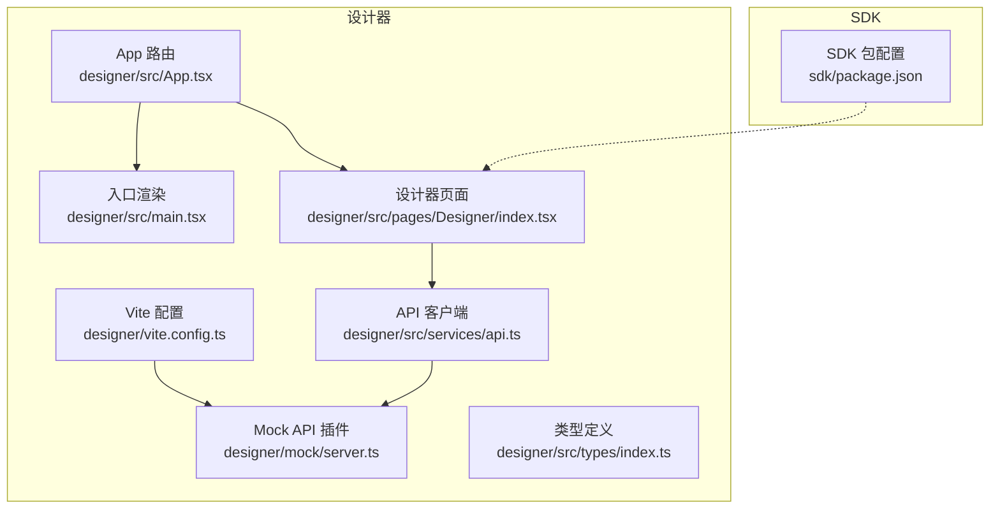
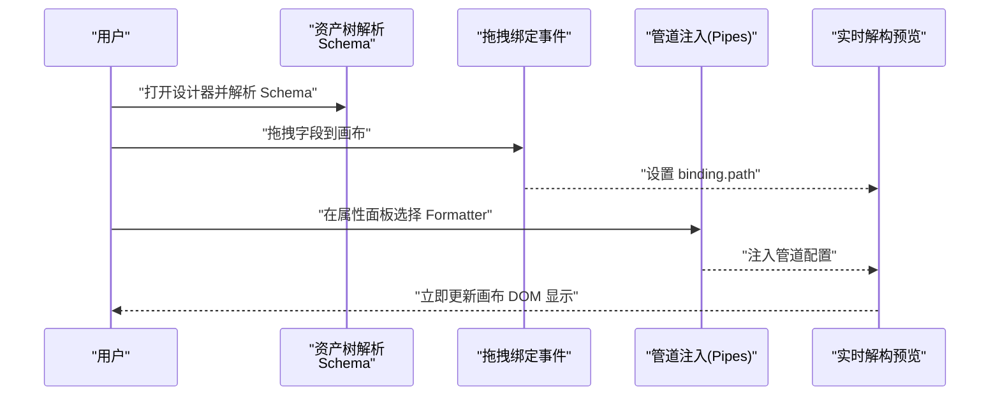
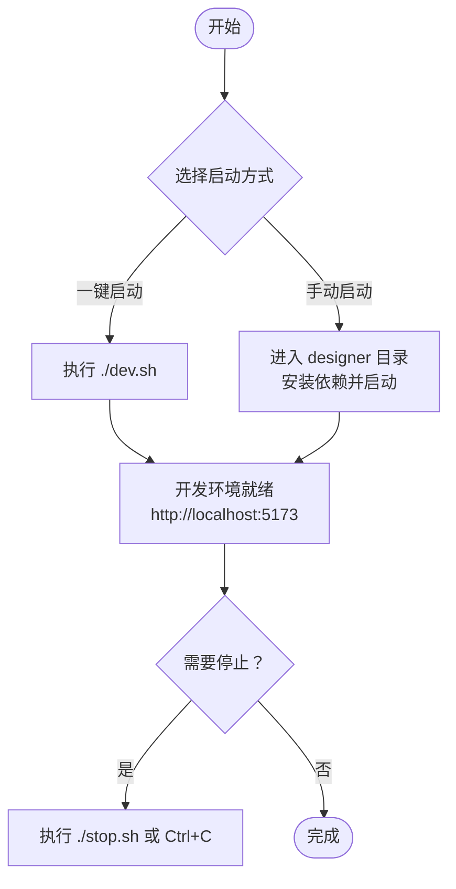
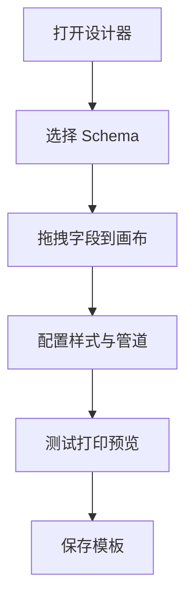
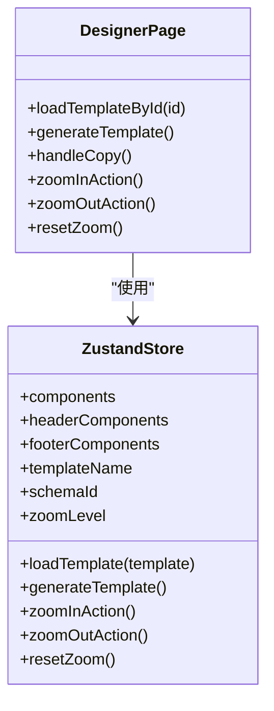
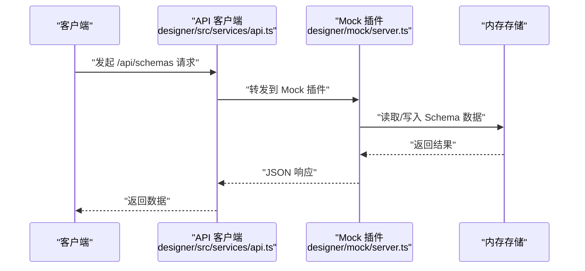
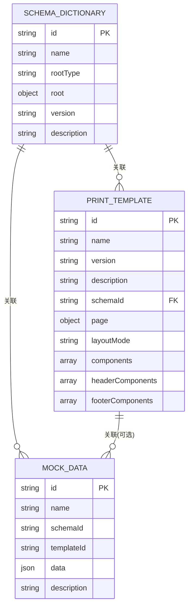
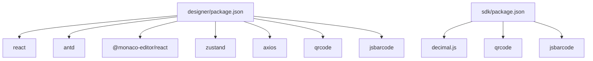

# 快速开始

<cite>
**本文引用的文件**
- [README.md](file://README.md)
- [package.json](file://package.json)
- [designer/package.json](file://designer/package.json)
- [designer/vite.config.ts](file://designer/vite.config.ts)
- [designer/src/main.tsx](file://designer/src/main.tsx)
- [designer/src/App.tsx](file://designer/src/App.tsx)
- [designer/src/services/api.ts](file://designer/src/services/api.ts)
- [designer/src/services/mockApi.ts](file://designer/src/services/mockApi.ts)
- [designer/mock/server.ts](file://designer/mock/server.ts)
- [designer/src/pages/Designer/index.tsx](file://designer/src/pages/Designer/index.tsx)
- [designer/src/types/index.ts](file://designer/src/types/index.ts)
- [sdk/package.json](file://sdk/package.json)
</cite>

## 目录
1. [简介](#简介)
2. [项目结构](#项目结构)
3. [核心组件](#核心组件)
4. [架构概览](#架构概览)
5. [详细组件分析](#详细组件分析)
6. [依赖分析](#依赖分析)
7. [性能考虑](#性能考虑)
8. [故障排除指南](#故障排除指南)
9. [结论](#结论)
10. [附录](#附录)

## 简介
本指南面向首次接触打印设计器项目的用户，帮助你在最短时间内完成环境准备、项目启动与核心功能体验。你将学会：
- 环境准备（Node.js、包管理器等）
- 克隆与安装依赖
- 启动开发环境（一键脚本与手动流程）
- 在线演示与离线使用
- 基本使用流程：创建 Schema、设计模板、测试打印、保存模板
- 常见问题与故障排除

## 项目结构
该项目采用“多包”结构，包含可视化设计器与独立 SDK：
- designer：React + Vite 的可视化设计器，集成 Mock API，无需后端服务
- sdk：独立的打印 SDK，支持浏览器端打印与批量打印
- docs：技术文档与架构说明（可选参考）

**图表来源**
- [designer/src/App.tsx:1-31](file://designer/src/App.tsx#L1-L31)
- [designer/src/main.tsx:1-8](file://designer/src/main.tsx#L1-L8)
- [designer/src/pages/Designer/index.tsx:1-200](file://designer/src/pages/Designer/index.tsx#L1-L200)
- [designer/vite.config.ts:1-29](file://designer/vite.config.ts#L1-L29)
- [designer/mock/server.ts:1-193](file://designer/mock/server.ts#L1-L193)
- [designer/src/services/api.ts:1-134](file://designer/src/services/api.ts#L1-L134)
- [designer/src/types/index.ts:1-378](file://designer/src/types/index.ts#L1-L378)
- [sdk/package.json:1-61](file://sdk/package.json#L1-L61)

**章节来源**
- [README.md: 第369-406 行:369-406](file://README.md#L369-L406)
- [designer/src/App.tsx: 第1-31 行:1-31](file://designer/src/App.tsx#L1-L31)
- [designer/src/main.tsx: 第1-8 行:1-8](file://designer/src/main.tsx#L1-L8)
- [designer/vite.config.ts: 第1-29 行:1-29](file://designer/vite.config.ts#L1-L29)
- [designer/mock/server.ts: 第1-193 行:1-193](file://designer/mock/server.ts#L1-L193)
- [designer/src/services/api.ts: 第1-134 行:1-134](file://designer/src/services/api.ts#L1-L134)
- [designer/src/types/index.ts: 第1-378 行:1-378](file://designer/src/types/index.ts#L1-L378)
- [sdk/package.json: 第1-61 行:1-61](file://sdk/package.json#L1-L61)

## 核心组件
- 设计器路由与页面
  - App 路由负责页面导航与布局，包含设计器全屏模式与管理页布局
  - 设计器页面提供三栏布局（数据资产树、画布编辑器、属性面板），支持页头/页脚三区域画布
- API 客户端与 Mock
  - API 客户端根据环境变量决定走真实 HTTP 还是前端内存 Mock
  - Mock API 插件提供 Schema、模板、Mock 数据的 CRUD 接口
- Vite 配置与开发体验
  - 集成 React 插件、Monaco 编辑器插件、Mock API 插件
  - 本地开发时可指向 SDK 源码，便于联调

**章节来源**
- [designer/src/App.tsx: 第1-31 行:1-31](file://designer/src/App.tsx#L1-L31)
- [designer/src/pages/Designer/index.tsx: 第1-200 行:1-200](file://designer/src/pages/Designer/index.tsx#L1-L200)
- [designer/src/services/api.ts: 第1-134 行:1-134](file://designer/src/services/api.ts#L1-L134)
- [designer/src/services/mockApi.ts: 第1-103 行:1-103](file://designer/src/services/mockApi.ts#L1-L103)
- [designer/mock/server.ts: 第1-193 行:1-193](file://designer/mock/server.ts#L1-L193)
- [designer/vite.config.ts: 第1-29 行:1-29](file://designer/vite.config.ts#L1-L29)

## 架构概览
下面的时序图展示了“从拖拽字段到预览生效”的交互闭环，体现 Schema 解析、拖拽绑定、管道注入与实时预览的关系。

**图表来源**
- [docs/技术架构文档(仅参考).md: 第83-91 行](file://docs/技术架构文档(仅参考).md#L83-L91)
- [designer/src/pages/Designer/index.tsx: 第1-200 行:1-200](file://designer/src/pages/Designer/index.tsx#L1-L200)

**章节来源**
- [docs/技术架构文档(仅参考).md: 第83-91 行](file://docs/技术架构文档(仅参考).md#L83-L91)

## 详细组件分析

### 启动方式与开发环境
- 一键启动（推荐）
  - 通过根目录脚本启动设计器开发环境，自动检查依赖、启动服务并输出日志
  - 停止服务：提供停止脚本或在终端按 Ctrl+C
- 手动启动
  - 进入设计器目录，安装依赖并启动开发服务器
  - 设计器运行在本地端口，Mock API 已集成，无需单独启动后端

**图表来源**
- [README.md: 第438-457 行:438-457](file://README.md#L438-L457)
- [package.json: 第1-10 行:1-10](file://package.json#L1-L10)

**章节来源**
- [README.md: 第438-457 行:438-457](file://README.md#L438-L457)
- [package.json: 第1-10 行:1-10](file://package.json#L1-L10)

### 在线演示与离线使用
- 在线演示
  - 提供在线演示地址，内置示例数据（Schema、模板、Mock 数据），无需后端即可体验完整功能
  - 数据存储在浏览器内存中，刷新页面会重置为默认示例数据
- 离线使用
  - 通过一键启动或手动启动在本地运行设计器
  - Mock API 已集成，无需额外后端服务

**章节来源**
- [README.md: 第9-19 行:9-19](file://README.md#L9-L19)

### 基本使用流程
- 创建打印模板
  1) 打开设计器
  2) 从左侧数据资产树选择 Schema
  3) 拖拽字段到画布生成组件
  4) 在右侧属性面板配置样式和管道
  5) 点击“测试打印”预览效果
  6) 保存模板

**图表来源**
- [README.md: 第470-480 行:470-480](file://README.md#L470-L480)

**章节来源**
- [README.md: 第470-480 行:470-480](file://README.md#L470-L480)

### 设计器页面与状态管理
- 页面结构
  - 三栏布局：左侧数据资产树、中央画布编辑器、右侧属性面板
  - 支持页头/页脚三区域画布，组件可跨区域拖拽
  - 提供缩放控件、调试面板、组件树面板等辅助功能
- 状态管理
  - 使用 Zustand 管理设计器状态（组件、模板、缩放级别等）
  - 通过 Store 导出的方法生成模板、加载模板、缩放操作等

**图表来源**
- [designer/src/pages/Designer/index.tsx: 第1-200 行:1-200](file://designer/src/pages/Designer/index.tsx#L1-L200)

**章节来源**
- [designer/src/pages/Designer/index.tsx: 第1-200 行:1-200](file://designer/src/pages/Designer/index.tsx#L1-L200)

### API 客户端与 Mock 机制
- API 客户端
  - 通过环境变量决定使用真实后端还是前端 Mock
  - 统一设置 baseURL 与请求头，封装 Schema、模板、Mock 数据的 CRUD 方法
- Mock 机制
  - Vite 插件集成 Mock 服务，拦截 /api/* 路由
  - 提供 Schema、模板、Mock 数据的内存存储与 CRUD 接口
  - 前端 Mock API 与真实 API 结构一致，便于切换

**图表来源**
- [designer/src/services/api.ts: 第1-134 行:1-134](file://designer/src/services/api.ts#L1-L134)
- [designer/src/services/mockApi.ts: 第1-103 行:1-103](file://designer/src/services/mockApi.ts#L1-L103)
- [designer/mock/server.ts: 第1-193 行:1-193](file://designer/mock/server.ts#L1-L193)

**章节来源**
- [designer/src/services/api.ts: 第1-134 行:1-134](file://designer/src/services/api.ts#L1-L134)
- [designer/src/services/mockApi.ts: 第1-103 行:1-103](file://designer/src/services/mockApi.ts#L1-L103)
- [designer/mock/server.ts: 第1-193 行:1-193](file://designer/mock/server.ts#L1-L193)

### 类型系统与数据模型
- 类型系统
  - 定义 Schema 字段类型、Schema 字典、页面配置、组件节点、打印模板、Mock 数据等核心类型
  - 支持页码配置、表格列定义、数据绑定、管道配置等高级能力
- 数据模型
  - Schema 驱动的数据模型，支持点号路径安全取值
  - 组件树与画布布局，支持绝对定位与流式布局
  - 模板包含页面配置与组件列表，支持页头/页脚区域

**图表来源**
- [designer/src/types/index.ts: 第39-52 行:39-52](file://designer/src/types/index.ts#L39-L52)
- [designer/src/types/index.ts: 第337-358 行:337-358](file://designer/src/types/index.ts#L337-L358)
- [designer/src/types/index.ts: 第364-377 行:364-377](file://designer/src/types/index.ts#L364-L377)

**章节来源**
- [designer/src/types/index.ts: 第1-378 行:1-378](file://designer/src/types/index.ts#L1-L378)

## 依赖分析
- 设计器依赖
  - React、Ant Design、Monaco Editor、Zustand、Axios、QRCode、JSBarcode 等
  - Vite 作为构建工具，集成 React 插件与 Mock 插件
- SDK 依赖
  - 打印 SDK 依赖 decimal.js、qrcode、jsbarcode，支持浏览器端打印与批量打印

**图表来源**
- [designer/package.json: 第1-46 行:1-46](file://designer/package.json#L1-L46)
- [sdk/package.json: 第1-61 行:1-61](file://sdk/package.json#L1-L61)

**章节来源**
- [designer/package.json: 第1-46 行:1-46](file://designer/package.json#L1-L46)
- [sdk/package.json: 第1-61 行:1-61](file://sdk/package.json#L1-L61)

## 性能考虑
- Mock API 延迟模拟：前端 Mock 在部分操作上引入轻微延迟，以更接近真实网络请求体验
- Vite 开发体验：热更新与按需编译，提升开发效率
- 组件渲染：三区域画布与跨区域拖拽可能带来 DOM 更新压力，建议在复杂模板中合理拆分组件与减少不必要的重绘

[本节为通用指导，不直接分析具体文件]

## 故障排除指南
- 端口占用
  - 若本地端口被占用，修改 Vite 配置中的端口或释放占用进程
- Mock API 无法访问
  - 确认 Mock 插件已正确集成，且请求路径为 /api/*
  - 检查环境变量 VITE_USE_MOCK 与 VITE_API_BASE_URL 的配置
- 依赖安装失败
  - 使用推荐的包管理器安装依赖，确保 Node.js 版本满足要求
- 路由跳转异常
  - 确认 App 路由配置与页面路径一致，避免路径错误导致页面空白

**章节来源**
- [designer/vite.config.ts: 第1-29 行:1-29](file://designer/vite.config.ts#L1-L29)
- [designer/src/services/api.ts: 第1-134 行:1-134](file://designer/src/services/api.ts#L1-L134)
- [designer/src/App.tsx: 第1-31 行:1-31](file://designer/src/App.tsx#L1-L31)

## 结论
通过本快速开始指南，你已经完成了环境准备、项目启动与核心功能体验。建议进一步阅读技术架构文档与类型定义，深入理解数据绑定、管道系统与渲染器插件的设计理念，以便在实际业务中高效使用打印设计器与 SDK。

[本节为总结性内容，不直接分析具体文件]

## 附录
- 在线演示地址：https://printer-pi-five.vercel.app
- 在线演示功能：可视化模板设计器、模板管理、打印预览与批量打印、Mock 数据管理
- SDK 使用：独立打印 SDK，支持浏览器端打印与批量打印

**章节来源**
- [README.md: 第9-19 行:9-19](file://README.md#L9-L19)
- [README.md: 第481-500 行:481-500](file://README.md#L481-L500)