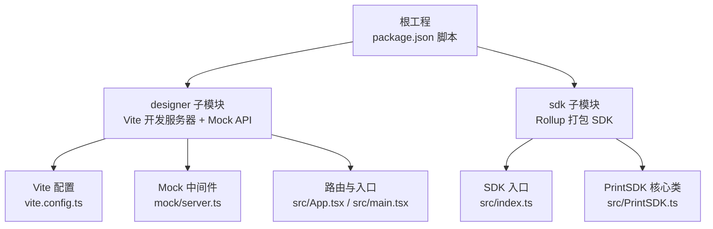
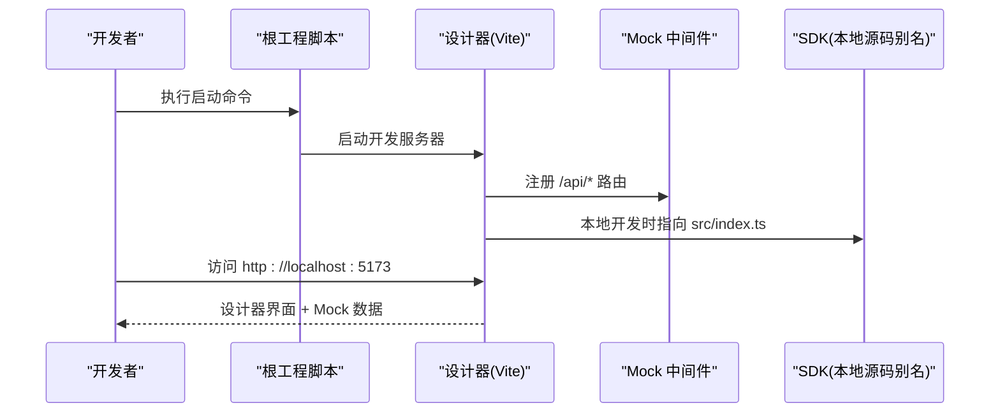
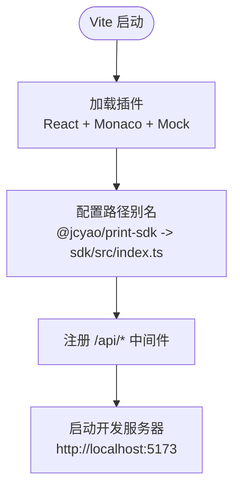
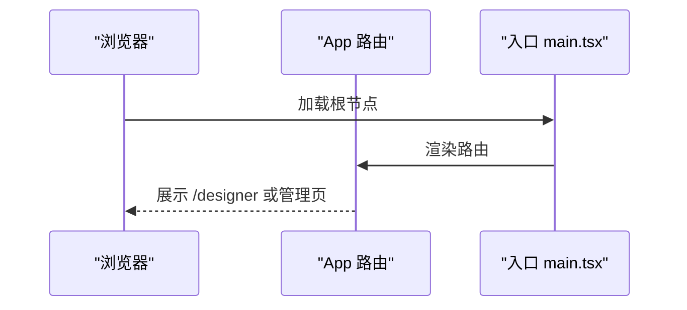
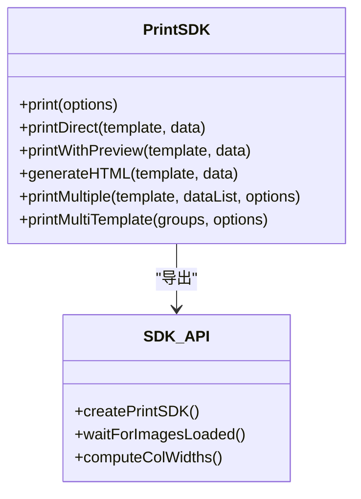
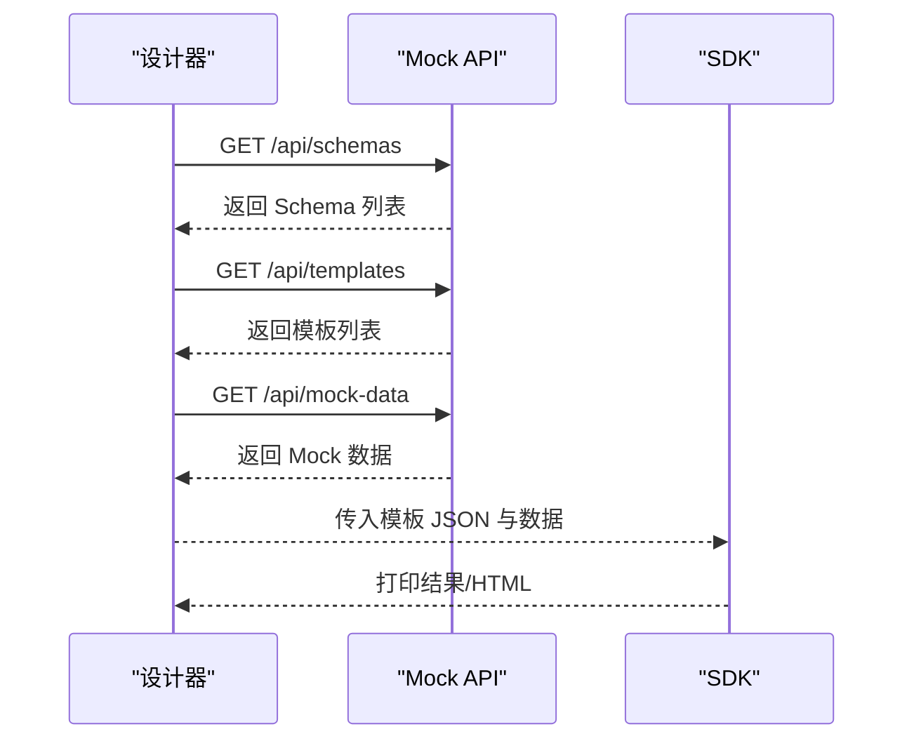
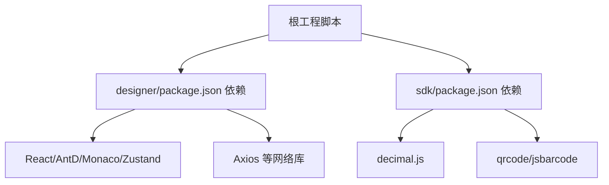

# 快速开始

<cite>
**本文引用的文件**   
- [README.md](file://README.md)
- [package.json](file://package.json)
- [designer/package.json](file://designer/package.json)
- [sdk/package.json](file://sdk/package.json)
- [designer/vite.config.ts](file://designer/vite.config.ts)
- [designer/mock/server.ts](file://designer/mock/server.ts)
- [sdk/src/index.ts](file://sdk/src/index.ts)
- [sdk/src/PrintSDK.ts](file://sdk/src/PrintSDK.ts)
- [sdk/README.md](file://sdk/README.md)
- [sdk/example.html](file://sdk/example.html)
- [designer/src/App.tsx](file://designer/src/App.tsx)
- [designer/src/main.tsx](file://designer/src/main.tsx)
- [designer/tsconfig.json](file://designer/tsconfig.json)
</cite>

## 目录
1. [简介](#简介)
2. [项目结构](#项目结构)
3. [核心组件](#核心组件)
4. [架构总览](#架构总览)
5. [详细组件分析](#详细组件分析)
6. [依赖分析](#依赖分析)
7. [性能注意事项](#性能注意事项)
8. [故障排除指南](#故障排除指南)
9. [结论](#结论)
10. [附录](#附录)

## 简介
本指南面向新手开发者，帮助你在最短时间内完成打印服务平台的环境准备、依赖安装、一键启动与手动启动，并掌握设计器与 SDK 的基础使用方法。你将学会：
- 如何准备开发环境与依赖
- 如何一键启动与手动启动
- 如何在本地使用设计器进行模板设计与 Mock 数据管理
- 如何在业务系统中集成 SDK 实现打印
- 常见问题与调试技巧

## 项目结构
该仓库采用“根工程 + 子模块”的组织方式：
- 根工程提供统一脚本与顶层依赖
- designer 子模块：可视化模板设计器（React + Vite + Zustand）
- sdk 子模块：独立打印 SDK（Rollup 打包，支持 ESM/CJS）

图表来源
- [package.json:1-10](file://package.json#L1-L10)
- [designer/vite.config.ts:1-29](file://designer/vite.config.ts#L1-L29)
- [designer/mock/server.ts:1-193](file://designer/mock/server.ts#L1-L193)
- [designer/src/App.tsx:1-31](file://designer/src/App.tsx#L1-L31)
- [designer/src/main.tsx:1-8](file://designer/src/main.tsx#L1-L8)
- [sdk/src/index.ts:1-22](file://sdk/src/index.ts#L1-L22)
- [sdk/src/PrintSDK.ts:1-477](file://sdk/src/PrintSDK.ts#L1-L477)

章节来源
- [README.md:353-390](file://README.md#L353-L390)
- [package.json:1-10](file://package.json#L1-L10)

## 核心组件
- 设计器（designer）：基于 React + Vite，集成 Mock API，提供模板设计、数据资产、属性面板、打印预览等功能。
- SDK（sdk）：纯 TypeScript 实现，无 UI 依赖，提供 print、printMultiple、printMultiTemplate 等打印能力。

章节来源
- [README.md:325-350](file://README.md#L325-L350)
- [sdk/README.md:65-75](file://sdk/README.md#L65-L75)

## 架构总览
下面的序列图展示了“设计器启动 → Mock API 提供 → SDK 本地联调”的典型开发流程。

图表来源
- [package.json:4-8](file://package.json#L4-L8)
- [designer/vite.config.ts:15-28](file://designer/vite.config.ts#L15-L28)
- [designer/mock/server.ts:184-192](file://designer/mock/server.ts#L184-L192)

## 详细组件分析

### 环境准备与依赖安装
- 运行环境
  - Node.js 与包管理器：推荐使用 Node.js LTS 与 pnpm 或 npm
  - 浏览器：现代浏览器（支持 ES 模块与 TypeScript）
- 依赖安装
  - 根工程脚本提供统一入口：进入根目录后执行安装与启动脚本
  - 设计器与 SDK 各自维护依赖，按模块安装

章节来源
- [README.md:420-451](file://README.md#L420-L451)
- [designer/package.json:13-45](file://designer/package.json#L13-L45)
- [sdk/package.json:49-61](file://sdk/package.json#L49-L61)

### 一键启动与手动启动
- 一键启动（推荐）
  - 根工程脚本提供 start、build:sdk、build:designer 等命令
  - 常用：在根目录执行启动命令，自动进入设计器开发环境
- 手动启动
  - 进入 designer 子目录，安装依赖并运行开发服务器
  - Mock API 已集成到 Vite，无需单独启动后端

章节来源
- [README.md:420-441](file://README.md#L420-L441)
- [package.json:4-8](file://package.json#L4-L8)

### 开发服务器配置（Vite + Mock）
- Vite 配置要点
  - 插件：React、Monaco 编辑器、Mock 中间件插件
  - 路径别名：开发模式下将 SDK 模块别名为本地源码，便于联调
  - 环境变量：通过 --mode demo 注入 VITE_USE_MOCK 标记
- Mock API
  - 提供 /api/schemas、/api/templates、/api/mock-data 的 CRUD 接口
  - 支持 CORS 预检，响应统一为 JSON

图表来源
- [designer/vite.config.ts:8-28](file://designer/vite.config.ts#L8-L28)
- [designer/mock/server.ts:36-192](file://designer/mock/server.ts#L36-L192)

章节来源
- [designer/vite.config.ts:1-29](file://designer/vite.config.ts#L1-L29)
- [designer/mock/server.ts:1-193](file://designer/mock/server.ts#L1-L193)

### 设计器与 SDK 的集成
- 设计器在开发模式下将 SDK 模块别名为本地源码，便于联调
- 设计器路由与入口
  - 应用入口负责渲染根组件
  - 路由定义了设计器、模板管理、Schema 管理、Mock 数据管理等页面

图表来源
- [designer/src/main.tsx:1-8](file://designer/src/main.tsx#L1-L8)
- [designer/src/App.tsx:1-31](file://designer/src/App.tsx#L1-L31)

章节来源
- [designer/src/main.tsx:1-8](file://designer/src/main.tsx#L1-L8)
- [designer/src/App.tsx:1-31](file://designer/src/App.tsx#L1-L31)

### SDK 使用与基础示例
- SDK 设计原则
  - 完全解耦：不依赖外部服务
  - 数据驱动：直接接收模板与数据
  - 无状态：无需初始化与配置
- 常用 API
  - print：执行打印（可选预览）
  - printMultiple：同模板多数据批量打印
  - printMultiTemplate：多模板各自绑定数据列表的批量打印
  - generateHTML：仅生成 HTML（不打印）
- 示例页面
  - 提供 example.html，演示 SDK 初始化、直接打印、预览后打印、批量打印等

图表来源
- [sdk/src/PrintSDK.ts:100-477](file://sdk/src/PrintSDK.ts#L100-L477)
- [sdk/src/index.ts:11-22](file://sdk/src/index.ts#L11-L22)

章节来源
- [sdk/src/PrintSDK.ts:1-477](file://sdk/src/PrintSDK.ts#L1-L477)
- [sdk/src/index.ts:1-22](file://sdk/src/index.ts#L1-L22)
- [sdk/README.md:81-127](file://sdk/README.md#L81-L127)
- [sdk/example.html:130-202](file://sdk/example.html#L130-L202)

### 设计器与 Mock 数据流
- 设计器通过 Mock API 提供 Schema、模板、Mock 数据的增删改查
- 设计器与 SDK 的数据交互
  - 设计器生成模板 JSON
  - SDK 直接接收模板 JSON 与业务数据，执行打印

图表来源
- [designer/mock/server.ts:62-170](file://designer/mock/server.ts#L62-L170)

章节来源
- [designer/mock/server.ts:1-193](file://designer/mock/server.ts#L1-L193)

## 依赖分析
- 设计器依赖
  - React、Ant Design、Monaco Editor、Zustand、Axios、QRCode、JSBarcode 等
- SDK 依赖
  - decimal.js、qrcode、jsbarcode
- 根工程脚本
  - 提供统一的启动与构建命令

图表来源
- [designer/package.json:13-45](file://designer/package.json#L13-L45)
- [sdk/package.json:49-61](file://sdk/package.json#L49-L61)
- [package.json:4-8](file://package.json#L4-L8)

章节来源
- [designer/package.json:1-46](file://designer/package.json#L1-L46)
- [sdk/package.json:1-61](file://sdk/package.json#L1-L61)
- [package.json:1-10](file://package.json#L1-L10)

## 性能注意事项
- 打印前资源加载
  - SDK 在打印前等待图片资源加载完成，确保内容完整
- HTML 解析健壮性
  - 使用 DOMParser 提取 body 内容，避免正则带来的不确定性
- 打印完成清理
  - 优先使用 afterprint 事件清理隐藏 iframe；若未触发则设置兜底清理时间

章节来源
- [sdk/src/PrintSDK.ts:17-42](file://sdk/src/PrintSDK.ts#L17-L42)
- [sdk/src/PrintSDK.ts:146-171](file://sdk/src/PrintSDK.ts#L146-L171)

## 故障排除指南
- 启动失败
  - 确认 Node.js 与包管理器版本满足要求
  - 在根目录执行安装与启动命令，或分别在 designer/sdk 目录执行安装
- 设计器无法访问
  - 确认 Vite 开发服务器已启动且端口未被占用
  - 检查 Mock 中间件是否成功注册
- 打印空白或内容缺失
  - 确保模板 JSON 与数据结构匹配
  - 检查图片资源是否可访问
- 打印完成后未清理
  - 若 afterprint 未触发，确认浏览器设置未阻止弹窗或打印窗口

章节来源
- [README.md:420-451](file://README.md#L420-L451)
- [designer/vite.config.ts:15-28](file://designer/vite.config.ts#L15-L28)
- [designer/mock/server.ts:184-192](file://designer/mock/server.ts#L184-L192)
- [sdk/src/PrintSDK.ts:146-171](file://sdk/src/PrintSDK.ts#L146-L171)

## 结论
通过本指南，你可以：
- 快速完成环境准备与依赖安装
- 使用一键启动或手动启动进入开发环境
- 在设计器中完成模板设计与 Mock 数据管理
- 在业务系统中集成 SDK 实现打印
- 遇到问题时快速定位与解决

## 附录
- 在线演示与文档
  - 在线演示地址与示例数据，无需后端即可体验设计器
  - SDK 在线示例页面与 API 说明
- 版本与许可
  - 当前版本与许可证信息

章节来源
- [README.md:9-20](file://README.md#L9-L20)
- [sdk/README.md:1-15](file://sdk/README.md#L1-L15)
- [README.md:514-532](file://README.md#L514-L532)