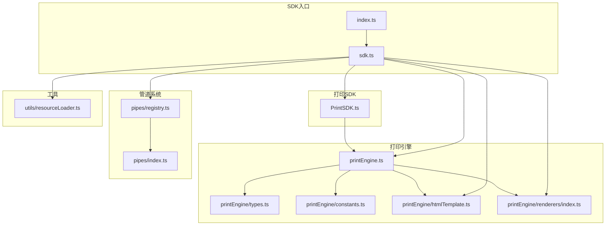
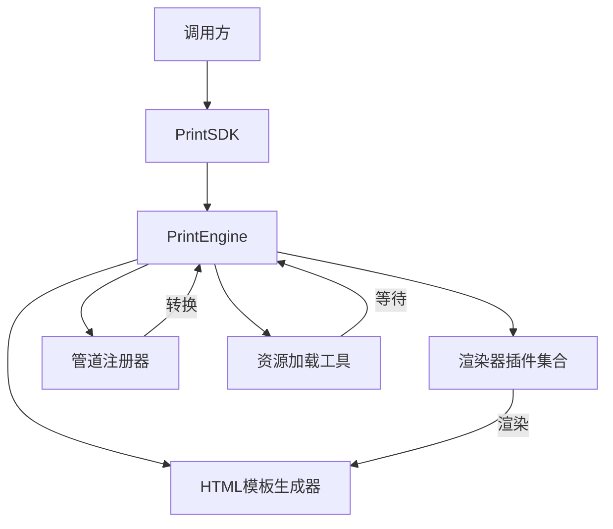
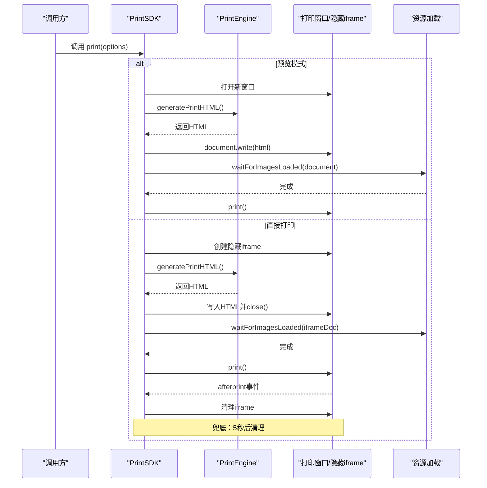
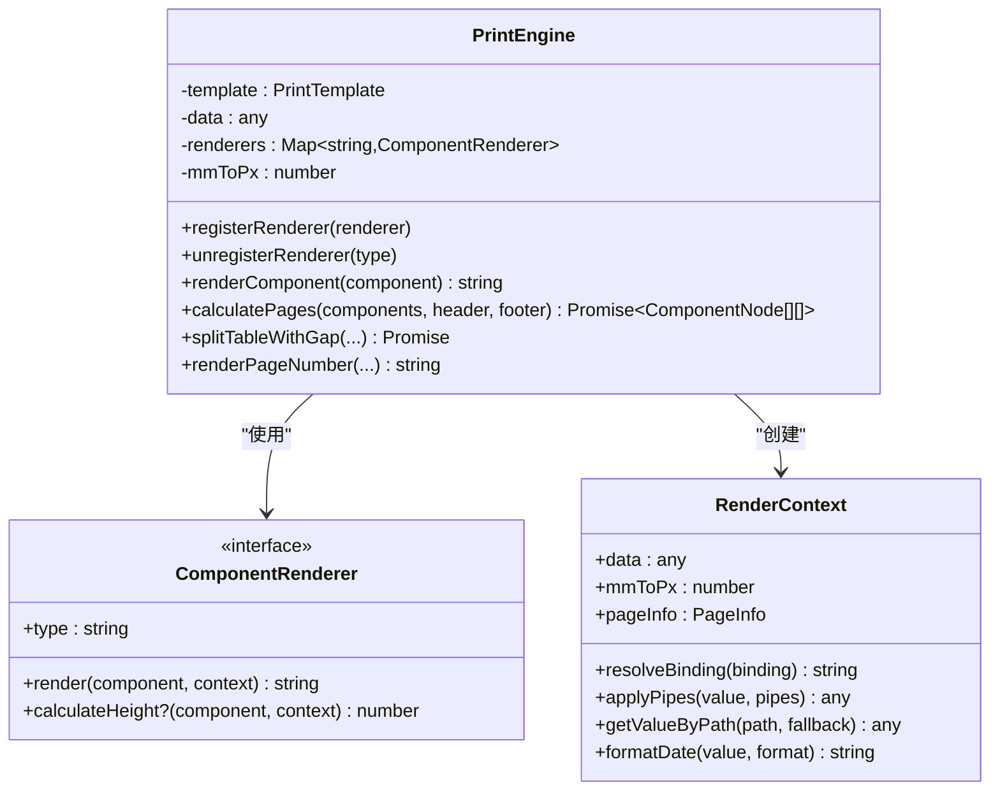
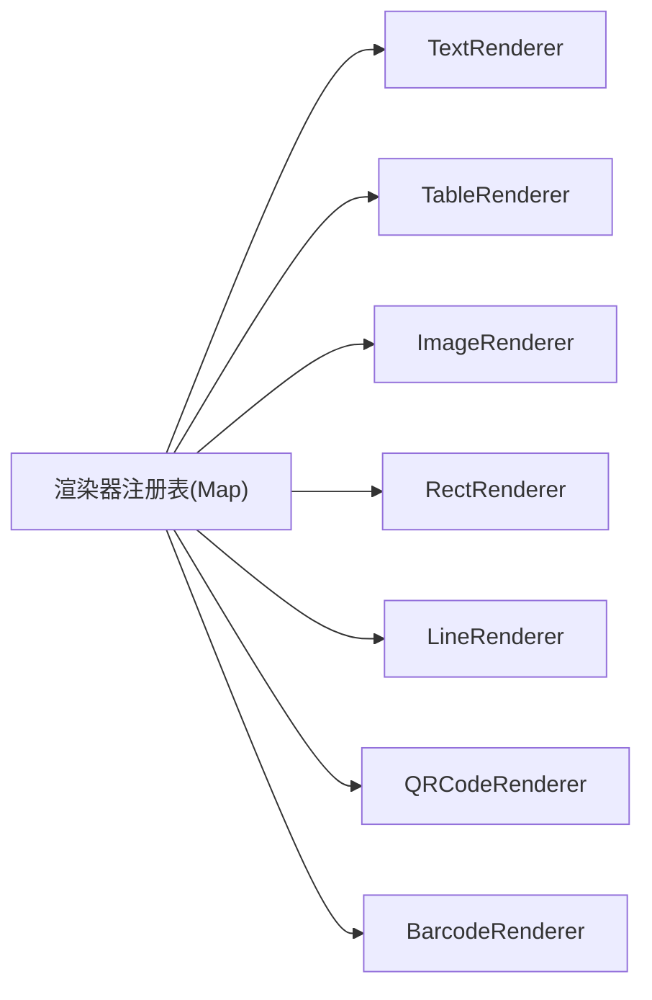
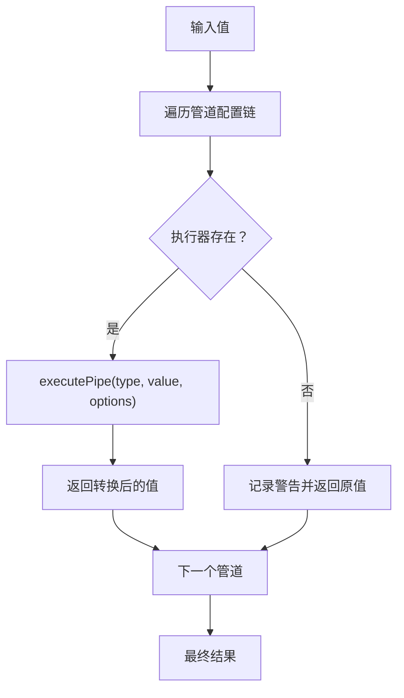
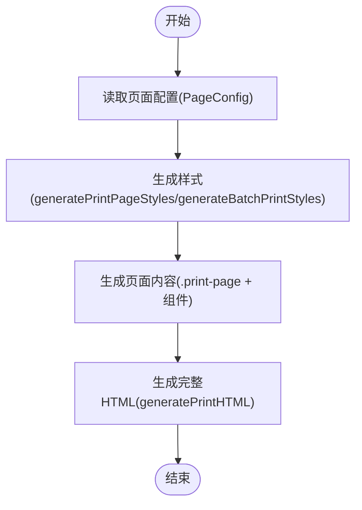
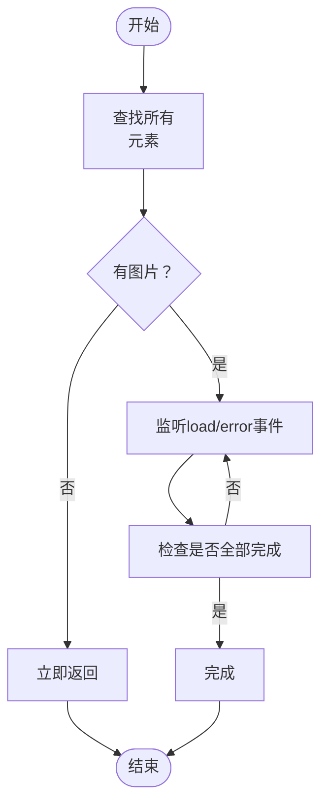
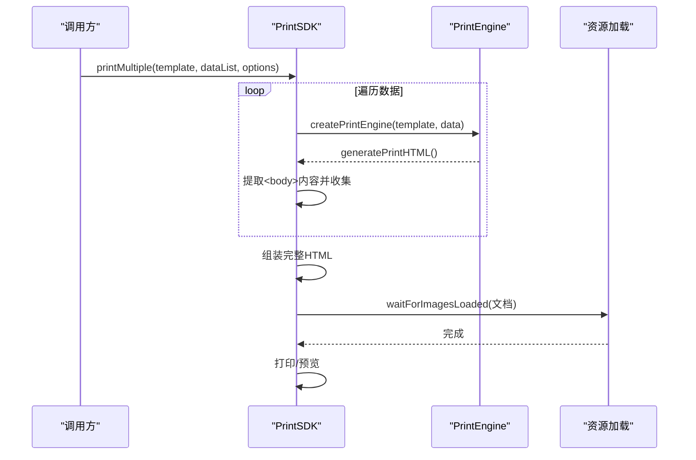
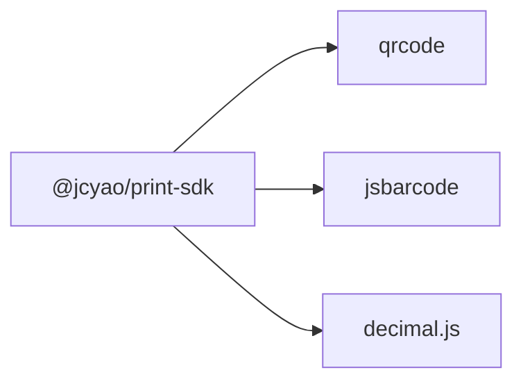

# 打印SDK系统

<cite>
**本文档引用的文件**
- [sdk/src/index.ts](file://sdk/src/index.ts)
- [sdk/src/sdk.ts](file://sdk/src/sdk.ts)
- [sdk/src/PrintSDK.ts](file://sdk/src/PrintSDK.ts)
- [sdk/src/printEngine.ts](file://sdk/src/printEngine.ts)
- [sdk/src/printEngine/types.ts](file://sdk/src/printEngine/types.ts)
- [sdk/src/printEngine/constants.ts](file://sdk/src/printEngine/constants.ts)
- [sdk/src/printEngine/htmlTemplate.ts](file://sdk/src/printEngine/htmlTemplate.ts)
- [sdk/src/printEngine/renderers/index.ts](file://sdk/src/printEngine/renderers/index.ts)
- [sdk/src/pipes/index.ts](file://sdk/src/pipes/index.ts)
- [sdk/src/pipes/registry.ts](file://sdk/src/pipes/registry.ts)
- [sdk/src/utils/resourceLoader.ts](file://sdk/src/utils/resourceLoader.ts)
- [sdk/src/types.ts](file://sdk/src/types.ts)
- [sdk/example.html](file://sdk/example.html)
- [sdk/package.json](file://sdk/package.json)
- [README.md](file://README.md)
</cite>

## 目录
1. [简介](#简介)
2. [项目结构](#项目结构)
3. [核心组件](#核心组件)
4. [架构总览](#架构总览)
5. [详细组件分析](#详细组件分析)
6. [依赖分析](#依赖分析)
7. [性能考量](#性能考量)
8. [故障排查指南](#故障排查指南)
9. [结论](#结论)
10. [附录](#附录)

## 简介
本项目是一个纯前端、无状态、解耦的打印SDK，专注于浏览器端打印与预览。其设计理念强调：
- 完全解耦：不依赖任何外部服务，直接接收模板与数据
- 数据驱动：模板与数据通过参数传入，无需服务端存储
- 无状态：无需初始化与配置，实例化即用

SDK提供以下核心能力：
- 单模板打印与预览
- 批量打印（同模板多数据）
- 多模板批量打印（不同模板各自绑定数据列表）
- HTML模板生成与样式管理
- 渲染器插件系统（文本、表格、图片、矩形、线条、二维码、条形码）
- 管道系统（数据转换链，如日期、货币、中文大写、大小写、截取、默认值）
- 资源加载策略（图片、二维码、条形码异步加载保障）

## 项目结构
SDK位于 sdk/ 目录，采用分层与插件化架构：
- 入口与导出：index.ts、sdk.ts
- 打印引擎：printEngine.ts（核心类）、renderers（渲染器插件）、htmlTemplate（HTML与样式生成）、constants（常量）、types（类型）
- 管道系统：pipes（registry注册器、executors执行器、types类型）
- 工具：resourceLoader（资源加载）
- 类型：types.ts
- 示例：example.html
- 包配置：package.json

**图表来源**
- [sdk/src/index.ts:1-22](file://sdk/src/index.ts#L1-L22)
- [sdk/src/sdk.ts:1-66](file://sdk/src/sdk.ts#L1-L66)
- [sdk/src/PrintSDK.ts:1-477](file://sdk/src/PrintSDK.ts#L1-L477)
- [sdk/src/printEngine.ts:1-800](file://sdk/src/printEngine.ts#L1-L800)
- [sdk/src/printEngine/types.ts:1-116](file://sdk/src/printEngine/types.ts#L1-L116)
- [sdk/src/printEngine/constants.ts:1-113](file://sdk/src/printEngine/constants.ts#L1-L113)
- [sdk/src/printEngine/htmlTemplate.ts:1-280](file://sdk/src/printEngine/htmlTemplate.ts#L1-L280)
- [sdk/src/printEngine/renderers/index.ts:1-13](file://sdk/src/printEngine/renderers/index.ts#L1-L13)
- [sdk/src/pipes/index.ts:1-9](file://sdk/src/pipes/index.ts#L1-L9)
- [sdk/src/pipes/registry.ts:1-65](file://sdk/src/pipes/registry.ts#L1-L65)
- [sdk/src/utils/resourceLoader.ts:1-90](file://sdk/src/utils/resourceLoader.ts#L1-L90)

**章节来源**
- [sdk/src/index.ts:1-22](file://sdk/src/index.ts#L1-L22)
- [sdk/src/sdk.ts:1-66](file://sdk/src/sdk.ts#L1-L66)
- [README.md:375-412](file://README.md#L375-L412)

## 核心组件
- PrintSDK：对外API封装，负责打印流程编排（预览/直接打印、批量打印、多模板打印、HTML生成）
- PrintEngine：打印引擎核心，负责渲染器插件管理、数据绑定、管道转换、虚拟分页计算
- 渲染器插件：TextRenderer、TableRenderer、ImageRenderer、RectRenderer、LineRenderer、QRCodeRenderer、BarcodeRenderer
- 管道系统：注册器模式，内置多种执行器（日期、货币、金额、中文大写、大小写、截取、默认值）
- HTML模板与样式：统一生成打印页面样式与完整HTML文档
- 资源加载工具：等待图片、二维码、条形码等异步资源加载完成

**章节来源**
- [sdk/src/PrintSDK.ts:100-477](file://sdk/src/PrintSDK.ts#L100-L477)
- [sdk/src/printEngine.ts:30-800](file://sdk/src/printEngine.ts#L30-L800)
- [sdk/src/printEngine/renderers/index.ts:1-13](file://sdk/src/printEngine/renderers/index.ts#L1-L13)
- [sdk/src/pipes/registry.ts:1-65](file://sdk/src/pipes/registry.ts#L1-L65)
- [sdk/src/printEngine/htmlTemplate.ts:1-280](file://sdk/src/printEngine/htmlTemplate.ts#L1-L280)
- [sdk/src/utils/resourceLoader.ts:1-90](file://sdk/src/utils/resourceLoader.ts#L1-L90)

## 架构总览
SDK采用“无状态 + 插件化”的分层架构：
- 上层：PrintSDK（API层）
- 中层：PrintEngine（核心引擎层）
- 下层：渲染器插件（组件渲染）、管道系统（数据转换）、HTML模板（样式与文档生成）、资源加载（异步资源保障）

**图表来源**
- [sdk/src/PrintSDK.ts:100-477](file://sdk/src/PrintSDK.ts#L100-L477)
- [sdk/src/printEngine.ts:30-800](file://sdk/src/printEngine.ts#L30-L800)
- [sdk/src/printEngine/htmlTemplate.ts:1-280](file://sdk/src/printEngine/htmlTemplate.ts#L1-L280)
- [sdk/src/utils/resourceLoader.ts:1-90](file://sdk/src/utils/resourceLoader.ts#L1-L90)

## 详细组件分析

### PrintSDK 组件分析
PrintSDK提供对外API，核心职责：
- print：单模板打印（预览/直接）
- printDirect：快捷打印（直接打印）
- printWithPreview：预览后打印
- generateHTML：仅生成HTML
- printMultiple：批量打印（同模板多数据）
- printMultiTemplate：多模板批量打印（不同模板各自绑定数据列表）

关键流程：
- 预览模式：打开新窗口，写入HTML，等待图片加载，调用window.print
- 直接打印：创建隐藏iframe，写入HTML，等待图片加载，监听afterprint事件清理，兜底5秒清理
- 批量打印：逐条生成页面body内容，抽取body片段，组装完整HTML，再执行打印
- 多模板打印：按组遍历，逐条生成页面body内容，组装完整HTML，再执行打印

**图表来源**
- [sdk/src/PrintSDK.ts:110-172](file://sdk/src/PrintSDK.ts#L110-L172)
- [sdk/src/utils/resourceLoader.ts:12-73](file://sdk/src/utils/resourceLoader.ts#L12-L73)

**章节来源**
- [sdk/src/PrintSDK.ts:100-477](file://sdk/src/PrintSDK.ts#L100-L477)
- [sdk/src/utils/resourceLoader.ts:1-90](file://sdk/src/utils/resourceLoader.ts#L1-L90)

### PrintEngine 组件分析
PrintEngine是打印引擎核心，职责包括：
- 渲染器插件管理：注册/注销渲染器
- 数据绑定：getValueByPath、applyPipes、resolveBinding
- 页面信息：mmToPx、页面尺寸与页边距
- 虚拟分页：calculatePages（基于相对间距gap的流式布局）
- 表格跨页拆分：splitTableWithGap（渲染后测量高度）
- 页码渲染：renderPageNumber
- HTML转义与安全：escapeHtml

**图表来源**
- [sdk/src/printEngine.ts:30-800](file://sdk/src/printEngine.ts#L30-L800)
- [sdk/src/printEngine/types.ts:11-82](file://sdk/src/printEngine/types.ts#L11-L82)

**章节来源**
- [sdk/src/printEngine.ts:30-800](file://sdk/src/printEngine.ts#L30-L800)
- [sdk/src/printEngine/types.ts:1-116](file://sdk/src/printEngine/types.ts#L1-L116)

### 渲染器插件系统
渲染器插件系统采用注册器模式，每个组件类型拥有独立渲染器：
- TextRenderer：文本组件渲染
- TableRenderer：表格组件渲染（含跨页、表头重复、合计）
- ImageRenderer：图片组件渲染
- RectRenderer：矩形组件渲染
- LineRenderer：线条组件渲染
- QRCodeRenderer：二维码组件渲染（同步生成base64）
- BarcodeRenderer：条形码组件渲染（同步生成base64）

扩展方式：实现ComponentRenderer接口，registerRenderer注册。

**图表来源**
- [sdk/src/printEngine/renderers/index.ts:1-13](file://sdk/src/printEngine/renderers/index.ts#L1-L13)
- [sdk/src/printEngine/types.ts:61-82](file://sdk/src/printEngine/types.ts#L61-L82)

**章节来源**
- [sdk/src/printEngine/renderers/index.ts:1-13](file://sdk/src/printEngine/renderers/index.ts#L1-L13)
- [sdk/src/printEngine/types.ts:58-82](file://sdk/src/printEngine/types.ts#L58-L82)

### 管道系统
管道系统采用注册器模式，支持数据转换链：
- 注册器：registerExecutor、getExecutor、getAllPipes、executePipe
- 内置执行器：DatePipe、CurrencyPipe、MoneyPipe、UppercasePipe、LowercasePipe、SlicePipe、DefaultPipe、ChineseNumberPipe

**图表来源**
- [sdk/src/pipes/registry.ts:1-65](file://sdk/src/pipes/registry.ts#L1-L65)

**章节来源**
- [sdk/src/pipes/index.ts:1-9](file://sdk/src/pipes/index.ts#L1-L9)
- [sdk/src/pipes/registry.ts:1-65](file://sdk/src/pipes/registry.ts#L1-L65)

### HTML模板生成机制
HTML模板生成器负责：
- generatePrintPageStyles：打印页面样式（预览模式）
- generateBatchPrintStyles：批量打印样式（直接打印模式）
- generatePrintHTML：生成完整HTML文档
- getPageSizeFromConfig：从PageConfig提取页面尺寸

**图表来源**
- [sdk/src/printEngine/htmlTemplate.ts:81-251](file://sdk/src/printEngine/htmlTemplate.ts#L81-L251)

**章节来源**
- [sdk/src/printEngine/htmlTemplate.ts:1-280](file://sdk/src/printEngine/htmlTemplate.ts#L1-L280)

### 资源加载策略
资源加载工具：
- waitForImagesLoaded：等待文档中所有图片加载完成（支持超时与错误统计）
- waitForPrintResourcesReady：等待打印所需资源（目前主要等待图片，二维码/条形码已同步生成为base64）

**图表来源**
- [sdk/src/utils/resourceLoader.ts:12-73](file://sdk/src/utils/resourceLoader.ts#L12-L73)

**章节来源**
- [sdk/src/utils/resourceLoader.ts:1-90](file://sdk/src/utils/resourceLoader.ts#L1-L90)

### 批量打印与多模板打印
- printMultiple：同模板多数据，逐条生成页面body内容，抽取body片段，组装完整HTML，再执行打印
- printMultiTemplate：多模板各自绑定数据列表，逐条生成页面body内容，组装完整HTML，再执行打印

**图表来源**
- [sdk/src/PrintSDK.ts:210-322](file://sdk/src/PrintSDK.ts#L210-L322)

**章节来源**
- [sdk/src/PrintSDK.ts:210-467](file://sdk/src/PrintSDK.ts#L210-L467)

## 依赖分析
SDK依赖外部库：
- qrcode：二维码生成
- jsbarcode：条形码生成
- decimal.js：高精度数值计算

**图表来源**
- [sdk/package.json:49-53](file://sdk/package.json#L49-L53)

**章节来源**
- [sdk/package.json:1-61](file://sdk/package.json#L1-L61)

## 性能考量
- 渲染后测量：表格跨页拆分采用“渲染后测量”方案，避免估算误差，提高分页精度
- 资源加载：图片、二维码、条形码异步加载，使用超时与错误统计，避免阻塞打印
- 无状态设计：无需初始化与配置，减少上下文切换成本
- 插件化架构：渲染器与管道可扩展，避免重复造轮子
- 连续纸模式：特殊样式适配，避免不必要的分页

[本节为通用性能讨论，无需特定文件引用]

## 故障排查指南
常见问题与处理建议：
- 打开打印窗口失败：检查浏览器弹窗策略，确保用户交互触发
- afterprint事件未触发：SDK已提供5秒兜底清理，避免iframe残留
- 图片加载超时：waitForImagesLoaded提供超时与错误统计，必要时检查网络与图片URL
- 表格跨页异常：确认表格数据与列宽配置，确保渲染后测量可用
- 页头/页脚高度异常：检查headerEnabled/headerHeight/footerEnabled/footerHeight配置

**章节来源**
- [sdk/src/PrintSDK.ts:114-171](file://sdk/src/PrintSDK.ts#L114-L171)
- [sdk/src/utils/resourceLoader.ts:28-43](file://sdk/src/utils/resourceLoader.ts#L28-L43)

## 结论
本打印SDK以“无状态、解耦、数据驱动”为核心设计原则，结合插件化渲染器与管道系统，实现了浏览器端高效、稳定的打印与预览能力。通过HTML模板生成与资源加载策略，SDK在保证功能完整性的同时兼顾了性能与可扩展性。批量打印与多模板打印进一步满足了复杂业务场景的需求。

[本节为总结性内容，无需特定文件引用]

## 附录

### API参考（PrintSDK）
- print(options)：单模板打印（预览/直接）
- printDirect(template, data)：快捷打印（直接）
- printWithPreview(template, data)：预览后打印
- generateHTML(template, data)：仅生成HTML
- printMultiple(template, dataList, options)：批量打印（同模板多数据）
- printMultiTemplate(groups, options)：多模板批量打印

**章节来源**
- [sdk/src/PrintSDK.ts:110-467](file://sdk/src/PrintSDK.ts#L110-L467)

### 使用示例
- 初始化：createPrintSDK()
- 直接打印：await sdk.print({ template, data, preview: false })
- 预览后打印：await sdk.print({ template, data, preview: true })
- 仅生成HTML：const html = await sdk.generateHTML(template, data)
- 批量打印：await sdk.printMultiple(template, dataList, { preview: true, onProgress })

**章节来源**
- [sdk/example.html:88-127](file://sdk/example.html#L88-L127)

### 集成指南
- 安装：npm install @jcyao/print-sdk
- 引入：import { createPrintSDK } from '@jcyao/print-sdk'
- 使用：const sdk = createPrintSDK(); await sdk.print({ template, data })

**章节来源**
- [sdk/package.json:1-61](file://sdk/package.json#L1-L61)
- [README.md:488-506](file://README.md#L488-L506)

### 自定义渲染器与管道开发指南
- 自定义渲染器：实现ComponentRenderer接口，registerRenderer注册
- 自定义管道：实现PipeExecutor接口，registerExecutor注册
- 扩展点：PrintEngine.registerRenderer、pipes/registry.ts

**章节来源**
- [sdk/src/printEngine/types.ts:61-82](file://sdk/src/printEngine/types.ts#L61-L82)
- [sdk/src/pipes/registry.ts:17-26](file://sdk/src/pipes/registry.ts#L17-L26)