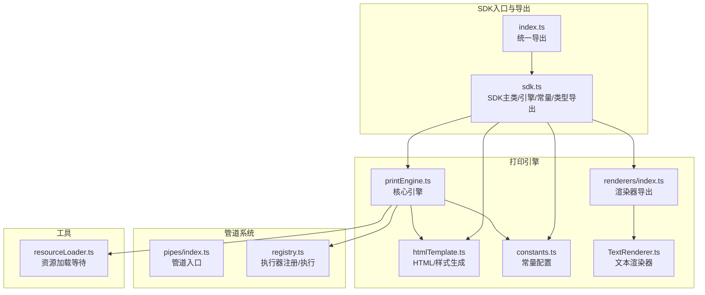
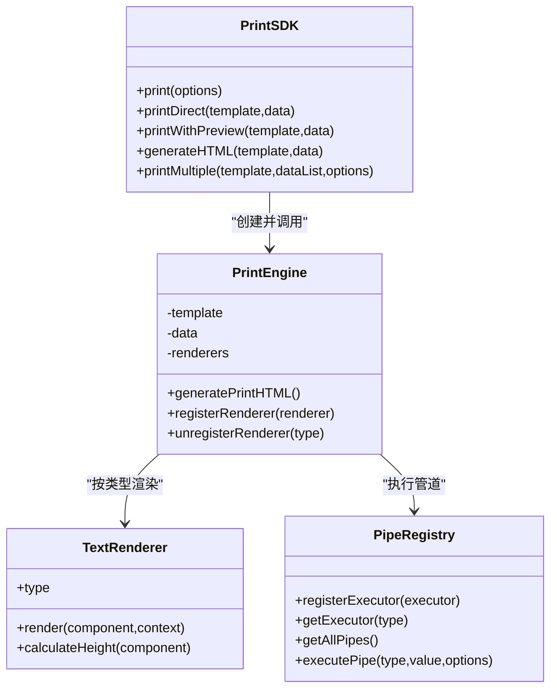
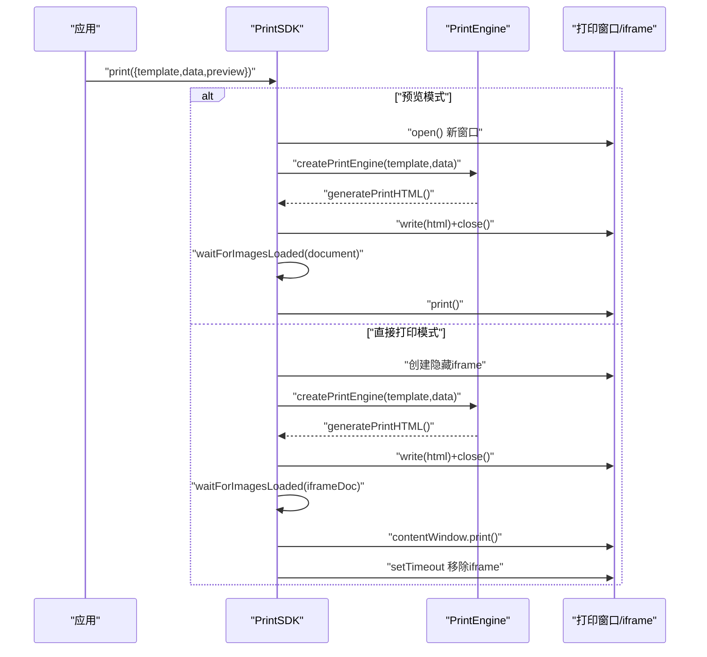
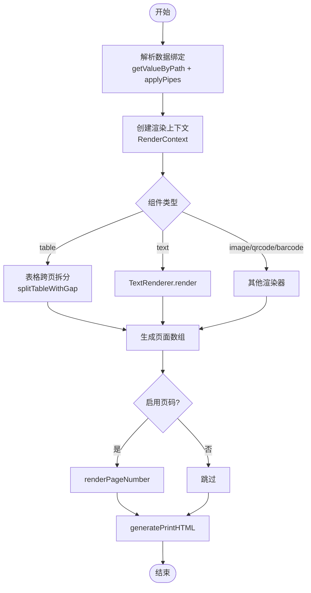
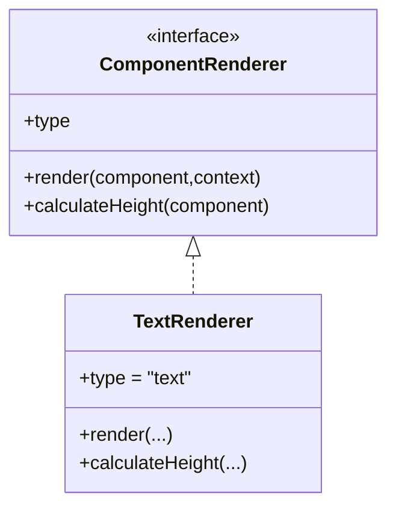
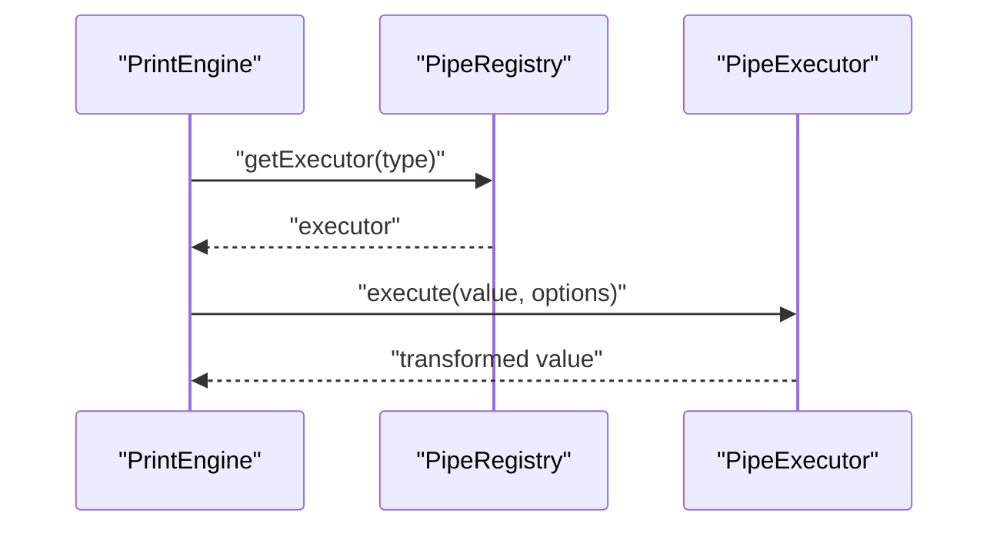
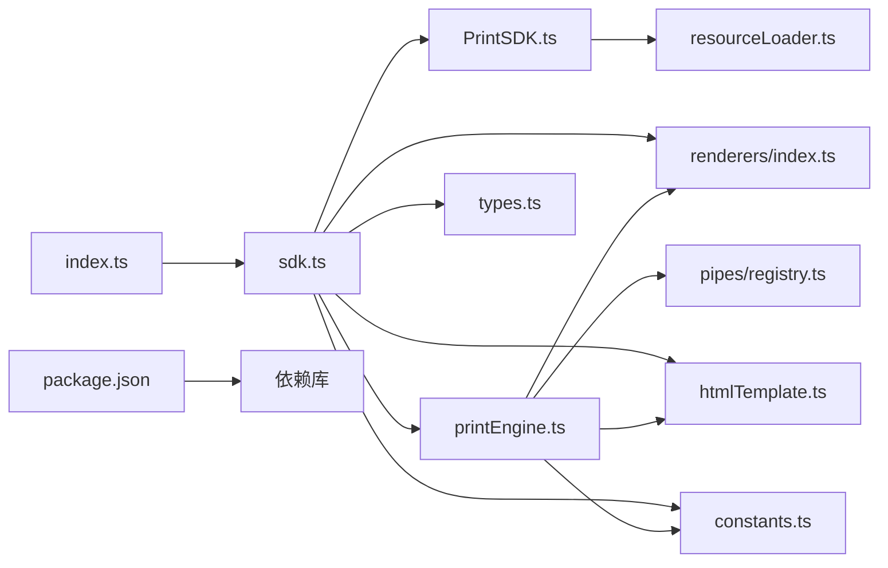

# SDK架构设计

<cite>
**本文引用的文件**
- [sdk/src/index.ts](file://sdk/src/index.ts)
- [sdk/src/sdk.ts](file://sdk/src/sdk.ts)
- [sdk/src/PrintSDK.ts](file://sdk/src/PrintSDK.ts)
- [sdk/src/printEngine.ts](file://sdk/src/printEngine.ts)
- [sdk/src/types.ts](file://sdk/src/types.ts)
- [sdk/src/printEngine/constants.ts](file://sdk/src/printEngine/constants.ts)
- [sdk/src/printEngine/htmlTemplate.ts](file://sdk/src/printEngine/htmlTemplate.ts)
- [sdk/src/printEngine/renderers/index.ts](file://sdk/src/printEngine/renderers/index.ts)
- [sdk/src/printEngine/renderers/TextRenderer.ts](file://sdk/src/printEngine/renderers/TextRenderer.ts)
- [sdk/src/pipes/index.ts](file://sdk/src/pipes/index.ts)
- [sdk/src/pipes/registry.ts](file://sdk/src/pipes/registry.ts)
- [sdk/src/utils/resourceLoader.ts](file://sdk/src/utils/resourceLoader.ts)
- [sdk/package.json](file://sdk/package.json)
- [sdk/example.html](file://sdk/example.html)
- [designer/src/App.tsx](file://designer/src/App.tsx)
</cite>

## 目录
1. [简介](#简介)
2. [项目结构](#项目结构)
3. [核心组件](#核心组件)
4. [架构总览](#架构总览)
5. [详细组件分析](#详细组件分析)
6. [依赖关系分析](#依赖关系分析)
7. [性能考量](#性能考量)
8. [故障排查指南](#故障排查指南)
9. [结论](#结论)
10. [附录](#附录)

## 简介
本技术文档面向打印SDK的架构设计，系统阐述其“完全解耦、数据驱动、无状态”的核心设计原则，以及模块组织、API导出策略、类型定义管理、与设计器的关系、独立使用与扩展能力、使用示例与最佳实践、性能优化建议、版本管理与兼容性策略等内容。SDK通过统一入口导出API，提供打印、预览、HTML生成与批量打印能力，并以插件化渲染器与管道系统支持扩展。

## 项目结构
SDK位于sdk目录，采用“按职责分层+按功能聚合”的组织方式：
- 入口与导出：index.ts负责统一导出；sdk.ts提供SDK主类、引擎、常量、HTML模板工具与类型导出。
- 打印引擎：printEngine.ts为核心，负责模板解析、数据绑定、管道转换、虚拟分页与HTML生成。
- 渲染器：renderers目录提供文本、表格、图片、矩形、线条、二维码、条形码等组件渲染器，支持注册/注销扩展。
- 管道系统：pipes目录提供管道注册与执行器，支持日期、货币、金额、大小写、切片、默认值等内置转换。
- 类型定义：types.ts集中管理模板、组件、数据绑定、表格、页码等类型。
- 工具函数：utils/resourceLoader.ts提供图片与打印资源加载等待能力。
- 示例与构建：example.html提供使用示例；package.json定义构建脚本与发布配置。

**图表来源**
- [sdk/src/index.ts:1-22](file://sdk/src/index.ts#L1-L22)
- [sdk/src/sdk.ts:1-63](file://sdk/src/sdk.ts#L1-L63)
- [sdk/src/printEngine.ts:1-757](file://sdk/src/printEngine.ts#L1-L757)
- [sdk/src/printEngine/htmlTemplate.ts:1-274](file://sdk/src/printEngine/htmlTemplate.ts#L1-L274)
- [sdk/src/printEngine/constants.ts:1-113](file://sdk/src/printEngine/constants.ts#L1-L113)
- [sdk/src/printEngine/renderers/index.ts:1-13](file://sdk/src/printEngine/renderers/index.ts#L1-L13)
- [sdk/src/printEngine/renderers/TextRenderer.ts:1-60](file://sdk/src/printEngine/renderers/TextRenderer.ts#L1-L60)
- [sdk/src/pipes/index.ts:1-9](file://sdk/src/pipes/index.ts#L1-L9)
- [sdk/src/pipes/registry.ts:1-64](file://sdk/src/pipes/registry.ts#L1-L64)
- [sdk/src/utils/resourceLoader.ts:1-90](file://sdk/src/utils/resourceLoader.ts#L1-L90)

**章节来源**
- [sdk/src/index.ts:1-22](file://sdk/src/index.ts#L1-L22)
- [sdk/src/sdk.ts:1-63](file://sdk/src/sdk.ts#L1-L63)

## 核心组件
- PrintSDK：对外API门面，提供print、printDirect、printWithPreview、generateHTML、printMultiple等方法，支持预览与直接打印，支持批量打印与进度回调。
- PrintEngine：核心渲染引擎，负责数据绑定、管道转换、虚拟分页、组件渲染与HTML生成，支持注册/注销自定义渲染器。
- 渲染器体系：文本、表格、图片、矩形、线条、二维码、条形码等组件渲染器，遵循统一接口，便于扩展。
- 管道系统：注册器管理执行器，支持日期、货币、金额、大小写、切片、默认值等转换。
- HTML模板与样式：统一生成页面样式、批量打印样式与完整HTML文档。
- 资源加载工具：等待图片加载完成，确保打印前资源就绪。
- 类型系统：集中定义模板、组件节点、数据绑定、表格、页码等类型。

**章节来源**
- [sdk/src/PrintSDK.ts:43-253](file://sdk/src/PrintSDK.ts#L43-L253)
- [sdk/src/printEngine.ts:31-757](file://sdk/src/printEngine.ts#L31-L757)
- [sdk/src/printEngine/renderers/index.ts:1-13](file://sdk/src/printEngine/renderers/index.ts#L1-L13)
- [sdk/src/pipes/registry.ts:45-64](file://sdk/src/pipes/registry.ts#L45-L64)
- [sdk/src/printEngine/htmlTemplate.ts:81-245](file://sdk/src/printEngine/htmlTemplate.ts#L81-L245)
- [sdk/src/utils/resourceLoader.ts:12-90](file://sdk/src/utils/resourceLoader.ts#L12-L90)
- [sdk/src/types.ts:1-171](file://sdk/src/types.ts#L1-L171)

## 架构总览
SDK采用“完全解耦、数据驱动、无状态”设计：
- 完全解耦：SDK不依赖外部服务，直接接收模板与数据；渲染器与管道通过注册机制扩展。
- 数据驱动：模板与数据作为输入，引擎负责解析与渲染。
- 无状态：无需初始化与配置，createPrintSDK/createPrintEngine即可使用。

**图表来源**
- [sdk/src/PrintSDK.ts:43-253](file://sdk/src/PrintSDK.ts#L43-L253)
- [sdk/src/printEngine.ts:31-757](file://sdk/src/printEngine.ts#L31-L757)
- [sdk/src/printEngine/renderers/TextRenderer.ts:10-60](file://sdk/src/printEngine/renderers/TextRenderer.ts#L10-L60)
- [sdk/src/pipes/registry.ts:17-64](file://sdk/src/pipes/registry.ts#L17-L64)

## 详细组件分析

### PrintSDK：打印门面与批量处理
- 功能要点
  - 直接打印与预览打印：通过window.open或隐藏iframe实现。
  - HTML生成：仅生成HTML字符串，不触发打印。
  - 批量打印：合并多条数据为单次打印，支持进度回调。
  - 资源等待：打印前等待图片加载，确保内容完整。
- 设计特点
  - 无状态：每次调用均创建临时引擎实例。
  - 易用性：提供快捷方法printDirect/printWithPreview。
  - 可观测性：批量打印提供进度回调，便于前端展示。

**图表来源**
- [sdk/src/PrintSDK.ts:53-97](file://sdk/src/PrintSDK.ts#L53-L97)
- [sdk/src/utils/resourceLoader.ts:12-73](file://sdk/src/utils/resourceLoader.ts#L12-L73)

**章节来源**
- [sdk/src/PrintSDK.ts:43-253](file://sdk/src/PrintSDK.ts#L43-L253)
- [sdk/src/utils/resourceLoader.ts:12-90](file://sdk/src/utils/resourceLoader.ts#L12-L90)

### PrintEngine：渲染引擎与虚拟分页
- 功能要点
  - 数据绑定：支持嵌套路径、智能前缀匹配、回退值。
  - 管道转换：链式执行，内置多种转换器。
  - 虚拟分页：基于相对间距的流式布局，支持表格跨页拆分与表头重复。
  - 页面渲染：支持连续纸与标准分页，生成独立页面。
  - 页码渲染：根据配置在指定位置渲染页码。
- 扩展点
  - registerRenderer/unregisterRenderer：动态注册/注销渲染器。
  - RenderContext：向渲染器提供数据、绑定解析、格式化、尺寸换算等上下文。

**图表来源**
- [sdk/src/printEngine.ts:75-726](file://sdk/src/printEngine.ts#L75-L726)
- [sdk/src/printEngine/htmlTemplate.ts:220-245](file://sdk/src/printEngine/htmlTemplate.ts#L220-L245)

**章节来源**
- [sdk/src/printEngine.ts:31-757](file://sdk/src/printEngine.ts#L31-L757)

### 渲染器体系：插件化扩展
- 内置渲染器：文本、表格、图片、矩形、线条、二维码、条形码。
- 扩展机制：通过registerRenderer注入自定义渲染器，覆盖或新增组件类型。
- 渲染约定：统一实现render(component, context)与calculateHeight(component)。

**图表来源**
- [sdk/src/printEngine/renderers/TextRenderer.ts:10-60](file://sdk/src/printEngine/renderers/TextRenderer.ts#L10-L60)

**章节来源**
- [sdk/src/printEngine/renderers/index.ts:1-13](file://sdk/src/printEngine/renderers/index.ts#L1-L13)
- [sdk/src/printEngine/renderers/TextRenderer.ts:10-60](file://sdk/src/printEngine/renderers/TextRenderer.ts#L10-L60)

### 管道系统：数据转换与扩展
- 注册器：维护执行器映射，提供查询与遍历。
- 执行流程：executePipe(type, value, options) -> executor.execute。
- 内置执行器：日期、货币、金额、大小写、切片、默认值等。

**图表来源**
- [sdk/src/pipes/registry.ts:45-64](file://sdk/src/pipes/registry.ts#L45-L64)

**章节来源**
- [sdk/src/pipes/index.ts:1-9](file://sdk/src/pipes/index.ts#L1-L9)
- [sdk/src/pipes/registry.ts:1-64](file://sdk/src/pipes/registry.ts#L1-L64)

### HTML模板与样式：统一输出
- generatePrintPageStyles：标准分页样式与预览样式。
- generateBatchPrintStyles：批量打印样式（直接打印模式）。
- generatePrintHTML：拼装完整HTML文档。
- getPageSizeFromConfig：从PageConfig提取页面尺寸。

**章节来源**
- [sdk/src/printEngine/htmlTemplate.ts:81-274](file://sdk/src/printEngine/htmlTemplate.ts#L81-L274)

### 资源加载工具：打印前保障
- waitForImagesLoaded：等待文档中所有图片加载完成，支持超时与错误统计。
- waitForPrintResourcesReady：当前等同于等待图片，二维码/条形码已同步生成为base64。

**章节来源**
- [sdk/src/utils/resourceLoader.ts:12-90](file://sdk/src/utils/resourceLoader.ts#L12-L90)

### 类型定义：强类型支撑
- Schema相关：SchemaField、SchemaDictionary、SchemaFieldType。
- 模板与组件：PageConfig、ComponentNode、ComponentType、PrintTemplate。
- 数据绑定与管道：DataBinding、PipeConfig。
- 表格与页码：TableColumn、TableProps、PageNumberConfig、TableColumnSummary等。
- MockData：模拟数据结构。

**章节来源**
- [sdk/src/types.ts:1-171](file://sdk/src/types.ts#L1-L171)

## 依赖关系分析
- 入口导出：index.ts统一导出sdk.ts与pipes工具；sdk.ts导出PrintSDK、PrintEngine、常量、HTML模板工具与类型。
- 引擎依赖：PrintEngine依赖渲染器集合、管道注册器、HTML模板生成器与常量。
- 管道依赖：管道注册器依赖各执行器模块。
- 工具依赖：PrintSDK依赖资源加载工具。
- 版本与构建：package.json定义包名、版本、构建脚本与依赖库。

**图表来源**
- [sdk/src/index.ts:11-18](file://sdk/src/index.ts#L11-L18)
- [sdk/src/sdk.ts:6-62](file://sdk/src/sdk.ts#L6-L62)
- [sdk/src/printEngine.ts:6-29](file://sdk/src/printEngine.ts#L6-L29)
- [sdk/src/pipes/registry.ts:6-7](file://sdk/src/pipes/registry.ts#L6-L7)
- [sdk/src/PrintSDK.ts:7-14](file://sdk/src/PrintSDK.ts#L7-L14)
- [sdk/src/utils/resourceLoader.ts:1-4](file://sdk/src/utils/resourceLoader.ts#L1-L4)
- [sdk/package.json:49-53](file://sdk/package.json#L49-L53)

**章节来源**
- [sdk/src/index.ts:1-22](file://sdk/src/index.ts#L1-L22)
- [sdk/src/sdk.ts:1-63](file://sdk/src/sdk.ts#L1-L63)
- [sdk/src/printEngine.ts:1-757](file://sdk/src/printEngine.ts#L1-L757)
- [sdk/src/pipes/registry.ts:1-64](file://sdk/src/pipes/registry.ts#L1-L64)
- [sdk/src/PrintSDK.ts:1-253](file://sdk/src/PrintSDK.ts#L1-L253)
- [sdk/src/utils/resourceLoader.ts:1-90](file://sdk/src/utils/resourceLoader.ts#L1-L90)
- [sdk/package.json:1-60](file://sdk/package.json#L1-L60)

## 性能考量
- 渲染性能
  - 虚拟分页基于相对间距，避免复杂布局计算；表格跨页拆分时按行高估算，减少DOM重建。
  - 组件默认尺寸与样式常量集中管理，降低运行时开销。
- 资源加载
  - 图片加载采用并发监听与超时控制，避免长时间阻塞；二维码/条形码已同步生成为base64，减少异步等待。
- 打印体验
  - 预览模式使用新窗口，避免与主页面交互干扰；直接打印使用隐藏iframe，打印后及时移除。
- 批量打印
  - 先生成所有页面HTML片段，再一次性组装完整文档，减少多次打印确认。

[本节为通用性能讨论，不直接分析具体文件]

## 故障排查指南
- 打开打印窗口失败
  - 现象：浏览器弹窗被拦截或无法访问新窗口。
  - 处理：检查浏览器设置，确保允许弹窗；捕获异常并提示用户手动允许。
- 图片加载超时或失败
  - 现象：部分图片未显示或打印内容缺失。
  - 处理：检查图片URL有效性；利用超时与错误统计日志定位问题。
- 表格跨页异常
  - 现象：表格被截断或表头重复不符合预期。
  - 处理：调整表格行高与表头高度配置；确认repeatHeader与summaryMode设置。
- 页码渲染位置异常
  - 现象：页码不在期望位置或被裁剪。
  - 处理：检查PageNumberConfig的position、offset与页边距设置。

**章节来源**
- [sdk/src/PrintSDK.ts:57-62](file://sdk/src/PrintSDK.ts#L57-L62)
- [sdk/src/utils/resourceLoader.ts:28-42](file://sdk/src/utils/resourceLoader.ts#L28-L42)
- [sdk/src/printEngine.ts:274-362](file://sdk/src/printEngine.ts#L274-L362)

## 结论
该SDK以“完全解耦、数据驱动、无状态”为核心理念，通过清晰的模块划分与插件化扩展机制，实现了模板驱动的客户端打印解决方案。PrintSDK提供简洁易用的API，PrintEngine负责复杂的渲染与分页逻辑，管道系统与渲染器体系支持灵活扩展。配合统一的HTML模板与样式生成、完善的类型定义与资源加载工具，SDK既可独立使用，也可与设计器深度协作，满足多样化的打印需求。

[本节为总结性内容，不直接分析具体文件]

## 附录

### 与设计器的关系与协作
- 设计器负责模板与Schema的可视化编辑与管理，SDK直接消费模板数据进行打印。
- SDK通过统一入口导出，设计器可按需导入管道系统与渲染器扩展能力。
- 示例页面展示了SDK的使用方式，便于设计器与业务系统集成。

**章节来源**
- [sdk/src/index.ts:14-18](file://sdk/src/index.ts#L14-L18)
- [sdk/example.html:130-199](file://sdk/example.html#L130-L199)
- [designer/src/App.tsx:1-31](file://designer/src/App.tsx#L1-L31)

### 使用示例与最佳实践
- 基本使用
  - 创建SDK实例：createPrintSDK。
  - 直接打印：print({ template, data, preview: false })。
  - 预览后打印：print({ template, data, preview: true })。
  - 仅生成HTML：generateHTML(template, data)。
  - 批量打印：printMultiple(template, dataList, { preview, onProgress })。
- 最佳实践
  - 模板与数据分离：模板由设计器生成，业务数据在运行时注入。
  - 管道链路：合理使用管道进行数据格式化，避免在模板中硬编码格式。
  - 表格跨页：根据实际内容调整行高与表头重复策略，提升阅读体验。
  - 资源准备：确保图片等外部资源可访问，必要时预加载。

**章节来源**
- [sdk/src/PrintSDK.ts:53-243](file://sdk/src/PrintSDK.ts#L53-L243)
- [sdk/example.html:88-127](file://sdk/example.html#L88-L127)

### 版本管理、兼容性与升级策略
- 版本管理
  - 包名与版本：@jcyao/print-sdk 1.0.1。
  - 发布配置：ES模块与CommonJS双产物，声明类型文件。
- 兼容性
  - 依赖库：Decimal.js、jsbarcode、qrcode等第三方库。
  - 浏览器兼容：依赖现代浏览器API（window.print、iframe、Promise等）。
- 升级策略
  - 语义化版本：遵循语义化版本规则，重大变更提升主版本号。
  - 类型导出：保持types.ts稳定，新增类型时提供向后兼容别名或迁移指引。
  - 渲染器扩展：通过registerRenderer保持向后兼容，避免破坏性变更。
  - 管道系统：新增执行器时保持execute签名一致，避免破坏性变更。

**章节来源**
- [sdk/package.json:1-60](file://sdk/package.json#L1-L60)