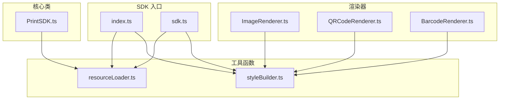
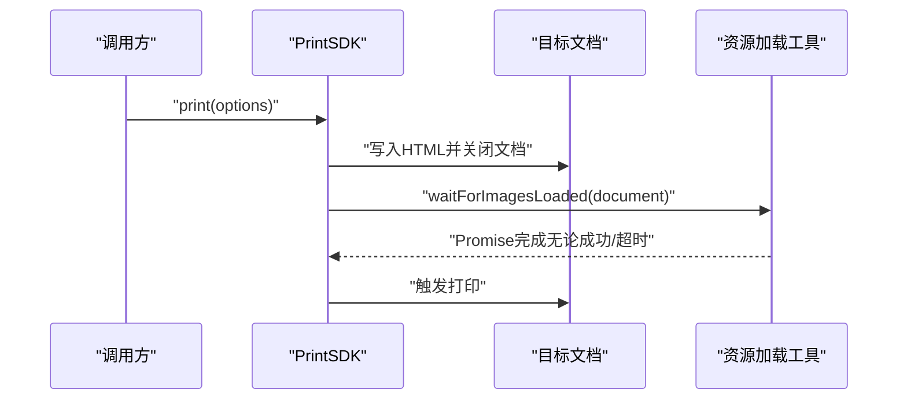
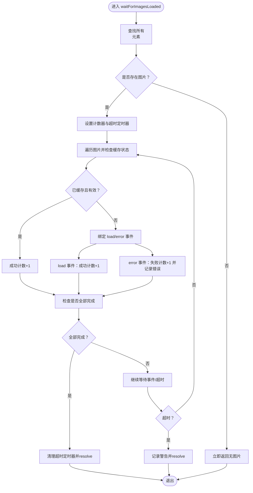
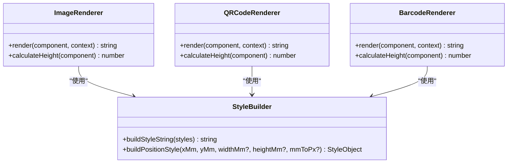
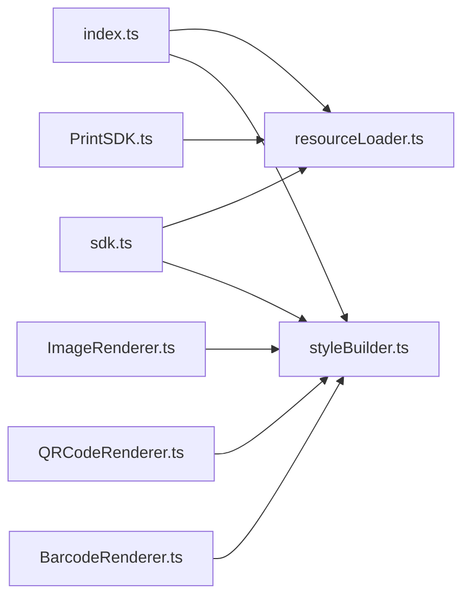

# 工具函数系统

<cite>
**本文引用的文件**
- [resourceLoader.ts](file://sdk/src/utils/resourceLoader.ts)
- [styleBuilder.ts](file://sdk/src/printEngine/utils/styleBuilder.ts)
- [index.ts](file://sdk/src/index.ts)
- [sdk.ts](file://sdk/src/sdk.ts)
- [PrintSDK.ts](file://sdk/src/PrintSDK.ts)
- [ImageRenderer.ts](file://sdk/src/printEngine/renderers/ImageRenderer.ts)
- [QRCodeRenderer.ts](file://sdk/src/printEngine/renderers/QRCodeRenderer.ts)
- [BarcodeRenderer.ts](file://sdk/src/printEngine/renderers/BarcodeRenderer.ts)
- [types.ts](file://sdk/src/types.ts)
- [example.html](file://sdk/example.html)
</cite>

## 目录
1. [简介](#简介)
2. [项目结构](#项目结构)
3. [核心组件](#核心组件)
4. [架构概览](#架构概览)
5. [详细组件分析](#详细组件分析)
6. [依赖分析](#依赖分析)
7. [性能考虑](#性能考虑)
8. [故障排查指南](#故障排查指南)
9. [结论](#结论)
10. [附录](#附录)

## 简介
本文件系统性梳理打印SDK中的工具函数体系，重点覆盖两类工具：
- 资源加载工具：负责等待图片、二维码、条形码等异步资源加载完成，确保打印前资源就绪。
- 样式构建工具：负责将样式对象转换为CSS字符串，并提供常用定位样式的构建方法，支撑渲染器生成稳定的HTML。

文档将从架构、实现原理、使用示例、性能与扩展建议等方面进行深入说明，并给出在实际项目中的应用实践与最佳实践。

## 项目结构
工具函数位于SDK包的两个子模块中：
- 资源加载工具：sdk/src/utils/resourceLoader.ts
- 样式构建工具：sdk/src/printEngine/utils/styleBuilder.ts

它们通过SDK入口统一对外导出，供上层PrintSDK与渲染器使用。

图表来源
- [index.ts:17-18](file://sdk/src/index.ts#L17-L18)
- [sdk.ts:12-19](file://sdk/src/sdk.ts#L12-L19)
- [PrintSDK.ts:14](file://sdk/src/PrintSDK.ts#L14)
- [ImageRenderer.ts:7](file://sdk/src/printEngine/renderers/ImageRenderer.ts#L7)
- [QRCodeRenderer.ts:9](file://sdk/src/printEngine/renderers/QRCodeRenderer.ts#L9)
- [BarcodeRenderer.ts:9](file://sdk/src/printEngine/renderers/BarcodeRenderer.ts#L9)

章节来源
- [index.ts:17-18](file://sdk/src/index.ts#L17-L18)
- [sdk.ts:12-19](file://sdk/src/sdk.ts#L12-L19)

## 核心组件
- 资源加载工具（resourceLoader）
  - waitForImagesLoaded：等待文档中所有图片加载完成，支持超时与错误统计。
  - waitForPrintResourcesReady：等待打印所需资源（当前主要针对外部图片，二维码与条形码在渲染时已同步生成为base64）。
- 样式构建工具（styleBuilder）
  - buildStyleString：将样式对象转换为CSS字符串，自动处理驼峰键到短横线命名的转换。
  - buildPositionStyle：根据毫米坐标与尺寸构建绝对定位样式，含mm到px的换算。

章节来源
- [resourceLoader.ts:12-89](file://sdk/src/utils/resourceLoader.ts#L12-L89)
- [styleBuilder.ts:13-53](file://sdk/src/printEngine/utils/styleBuilder.ts#L13-L53)

## 架构概览
工具函数在整个SDK中的位置如下：
- SDK入口导出工具函数，供外部直接使用。
- PrintSDK在打印流程的关键节点调用资源加载工具，确保图片资源就绪后再触发打印。
- 渲染器通过样式构建工具生成稳定且可读的CSS字符串，保证跨组件的一致性与可维护性。

图表来源
- [PrintSDK.ts:53-96](file://sdk/src/PrintSDK.ts#L53-L96)
- [resourceLoader.ts:12-73](file://sdk/src/utils/resourceLoader.ts#L12-L73)

## 详细组件分析

### 资源加载工具（resourceLoader）
- 功能概述
  - waitForImagesLoaded：扫描文档中的所有元素，监听load与error事件，统计加载与失败数量；在超时或全部检查完成后resolve，避免无限等待。
  - waitForPrintResourcesReady：当前实现委托给waitForImagesLoaded，因为二维码与条形码在渲染阶段已同步生成为base64，无需额外等待。
- 关键行为
  - 缓存命中检测：若img.complete为true且naturalHeight非0则计入成功，否则计入失败。
  - 事件监听：为每个未缓存的图片注册load与error事件，动态更新计数并检查完成条件。
  - 超时控制：超时后记录警告并resolve，避免阻塞打印流程。
- 使用场景
  - 预览打印：在新窗口打开后等待图片加载再触发打印。
  - 直接打印：在隐藏iframe中写入HTML后等待图片加载再打印。
- 可扩展点
  - 可增加对二维码/条形码生成状态的等待逻辑（当前已在渲染阶段同步生成）。
  - 可扩展为等待字体、视频等其他异步资源。

图表来源
- [resourceLoader.ts:12-73](file://sdk/src/utils/resourceLoader.ts#L12-L73)

章节来源
- [resourceLoader.ts:12-89](file://sdk/src/utils/resourceLoader.ts#L12-L89)
- [PrintSDK.ts:53-96](file://sdk/src/PrintSDK.ts#L53-L96)

### 样式构建工具（styleBuilder）
- 功能概述
  - buildStyleString：将样式对象（键为驼峰命名）转换为CSS字符串，键名自动转为短横线命名，值以分号连接。
  - buildPositionStyle：根据x/y/宽/高（mm）与mm到px换算系数，生成绝对定位样式对象，便于渲染器快速拼接。
- 设计要点
  - 类型安全：StyleObject为通用样式字典，确保传入参数与输出一致。
  - 可复用性：buildPositionStyle统一了毫米到像素的换算，避免各渲染器重复实现。
  - 输出稳定性：buildStyleString保证输出顺序与格式一致，便于调试与对比。
- 在渲染器中的应用
  - ImageRenderer：组合定位样式与容器样式，生成img外层容器与内部img的样式字符串。
  - QRCodeRenderer/BarcodeRenderer：使用定位样式作为顶层容器，内部img直接使用该样式字符串。

图表来源
- [styleBuilder.ts:13-53](file://sdk/src/printEngine/utils/styleBuilder.ts#L13-L53)
- [ImageRenderer.ts:7](file://sdk/src/printEngine/renderers/ImageRenderer.ts#L7)
- [QRCodeRenderer.ts:9](file://sdk/src/printEngine/renderers/QRCodeRenderer.ts#L9)
- [BarcodeRenderer.ts:9](file://sdk/src/printEngine/renderers/BarcodeRenderer.ts#L9)

章节来源
- [styleBuilder.ts:13-53](file://sdk/src/printEngine/utils/styleBuilder.ts#L13-L53)
- [ImageRenderer.ts:21-34](file://sdk/src/printEngine/renderers/ImageRenderer.ts#L21-L34)
- [QRCodeRenderer.ts:22-30](file://sdk/src/printEngine/renderers/QRCodeRenderer.ts#L22-L30)
- [BarcodeRenderer.ts:24-32](file://sdk/src/printEngine/renderers/BarcodeRenderer.ts#L24-L32)

## 依赖分析
- 导出关系
  - SDK入口与统一导出文件均导出资源加载工具，便于外部直接使用。
  - 渲染器显式导入样式构建工具，形成明确的依赖链。
- 内部耦合
  - PrintSDK在打印流程中耦合资源加载工具，确保打印前资源就绪。
  - 渲染器与样式构建工具之间为纯函数依赖，低耦合、高内聚。
- 外部依赖
  - 二维码与条形码渲染器依赖第三方库生成base64图像，但工具函数层面不直接依赖这些库。

图表来源
- [index.ts:17-18](file://sdk/src/index.ts#L17-L18)
- [sdk.ts:12-19](file://sdk/src/sdk.ts#L12-L19)
- [PrintSDK.ts:14](file://sdk/src/PrintSDK.ts#L14)
- [ImageRenderer.ts:7](file://sdk/src/printEngine/renderers/ImageRenderer.ts#L7)
- [QRCodeRenderer.ts:9](file://sdk/src/printEngine/renderers/QRCodeRenderer.ts#L9)
- [BarcodeRenderer.ts:9](file://sdk/src/printEngine/renderers/BarcodeRenderer.ts#L9)

章节来源
- [index.ts:17-18](file://sdk/src/index.ts#L17-L18)
- [sdk.ts:12-19](file://sdk/src/sdk.ts#L12-L19)

## 性能考虑
- 资源加载工具
  - 超时机制：默认10秒超时，避免长时间等待导致的阻塞；超时后仍resolve，保证流程可控。
  - 缓存利用：优先检测img.complete与naturalHeight，减少事件监听开销。
  - 错误容忍：个别图片加载失败不影响整体流程，但会记录警告，便于排查。
- 样式构建工具
  - buildStyleString采用映射与连接，复杂度O(n)，n为样式键数量，开销极小。
  - buildPositionStyle仅做数值换算与对象拼接，常数时间复杂度，适合高频调用。
- 实践建议
  - 在大批量打印场景中，尽量预加载关键图片资源，减少打印时的等待。
  - 对于二维码/条形码，建议在模板设计阶段固定尺寸，避免运行时频繁计算。

## 故障排查指南
- 图片加载超时
  - 现象：控制台出现“图片加载超时”警告，打印仍继续。
  - 排查：检查图片URL是否可达、CORS策略、网络状况；必要时增大timeout。
  - 参考实现：[resourceLoader.ts:29-32](file://sdk/src/utils/resourceLoader.ts#L29-L32)
- 图片加载失败
  - 现象：控制台输出具体失败的图片URL与事件信息。
  - 排查：确认资源存在、权限与格式正确；可替换为占位图或延迟重试。
  - 参考实现：[resourceLoader.ts:62-65](file://sdk/src/utils/resourceLoader.ts#L62-L65)
- 打印预览空白或部分缺失
  - 现象：预览窗口打开但图片未显示。
  - 排查：确认PrintSDK在写入HTML后调用了资源等待；检查图片是否跨域或被拦截。
  - 参考流程：[PrintSDK.ts:57-70](file://sdk/src/PrintSDK.ts#L57-L70)
- 样式不生效或定位异常
  - 现象：组件位置或尺寸不符合预期。
  - 排查：核对mmToPx换算系数与传入的mm值；检查buildPositionStyle生成的样式对象。
  - 参考实现：[styleBuilder.ts:31-53](file://sdk/src/printEngine/utils/styleBuilder.ts#L31-L53)

章节来源
- [resourceLoader.ts:29-32](file://sdk/src/utils/resourceLoader.ts#L29-L32)
- [resourceLoader.ts:62-65](file://sdk/src/utils/resourceLoader.ts#L62-L65)
- [PrintSDK.ts:57-70](file://sdk/src/PrintSDK.ts#L57-L70)
- [styleBuilder.ts:31-53](file://sdk/src/printEngine/utils/styleBuilder.ts#L31-L53)

## 结论
工具函数系统在SDK中承担了“资源就绪保障”和“样式一致性生成”的双重职责。资源加载工具通过超时与事件驱动机制，确保打印流程的鲁棒性；样式构建工具以简洁的API提供稳定的CSS输出，降低渲染器实现成本。两者配合PrintSDK与渲染器，形成了清晰、可扩展、易维护的工具层。

## 附录

### 使用示例与最佳实践
- 直接打印与预览后打印
  - 参考示例页面中的按钮与脚本，了解如何调用SDK打印接口。
  - 参考路径：[example.html:98-126](file://sdk/example.html#L98-L126)
- 资源等待的最佳实践
  - 在写入HTML并关闭文档后，务必调用资源等待函数，再触发打印。
  - 参考路径：[PrintSDK.ts:68-70](file://sdk/src/PrintSDK.ts#L68-L70)
- 样式构建的最佳实践
  - 使用buildPositionStyle统一生成定位样式，再与其他样式对象合并。
  - 使用buildStyleString将样式对象转换为CSS字符串，保持输出格式一致。
  - 参考路径：[ImageRenderer.ts:21-34](file://sdk/src/printEngine/renderers/ImageRenderer.ts#L21-L34)

### 类型与常量参考
- 样式对象类型：StyleObject
  - 参考路径：[types.ts:87](file://sdk/src/printEngine/types.ts#L87)
- 常用常量（mm到px换算等）
  - 参考路径：[sdk.ts:19-27](file://sdk/src/sdk.ts#L19-L27)