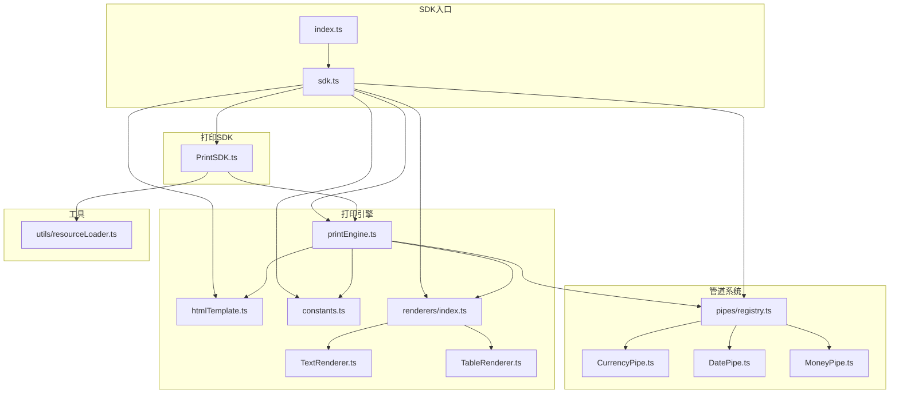
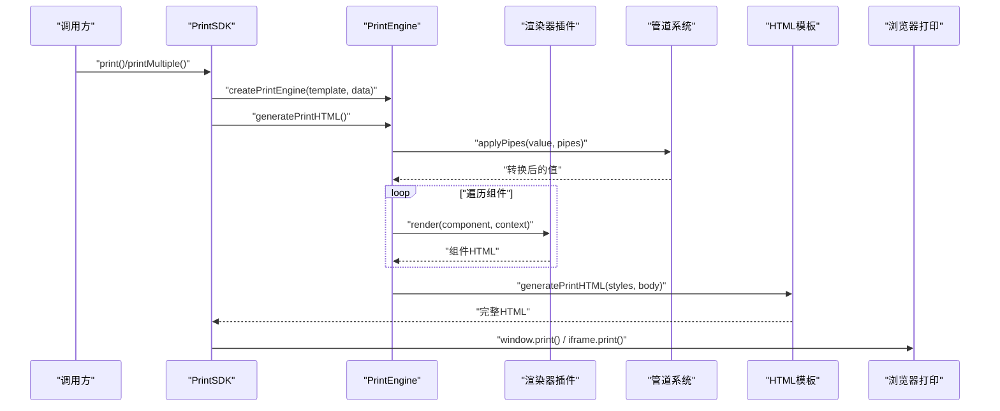
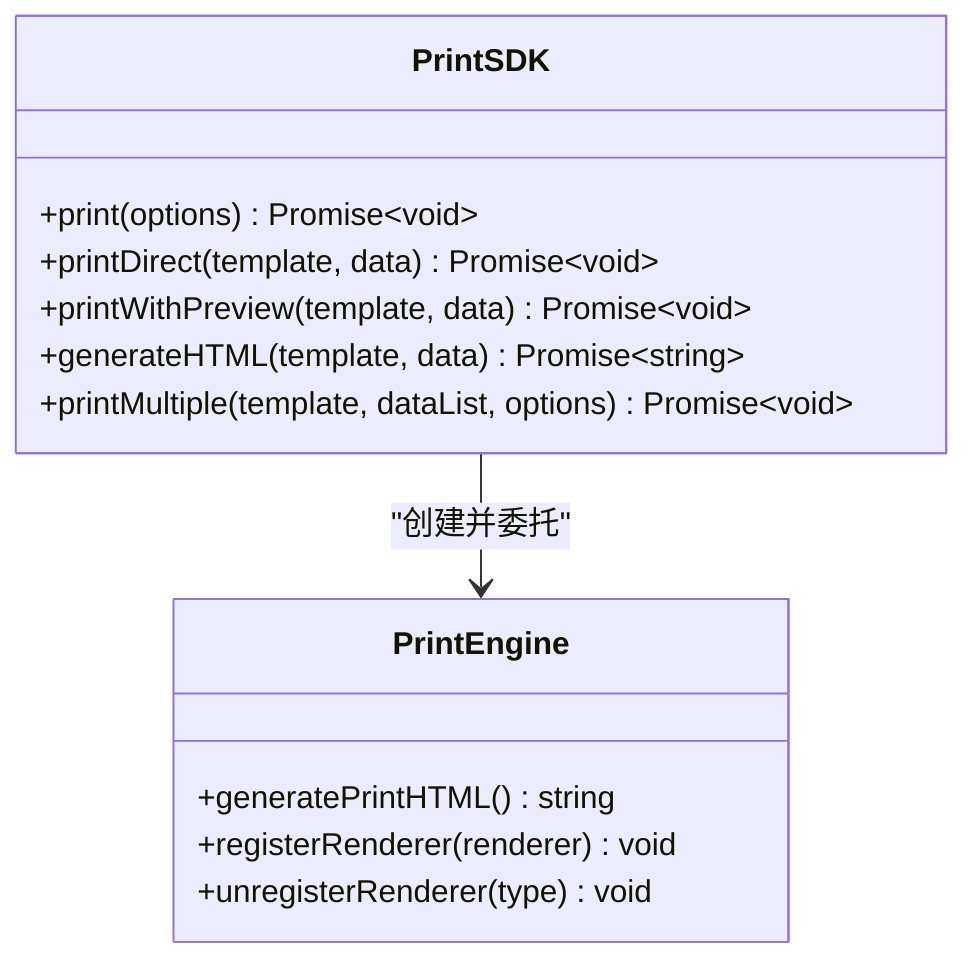
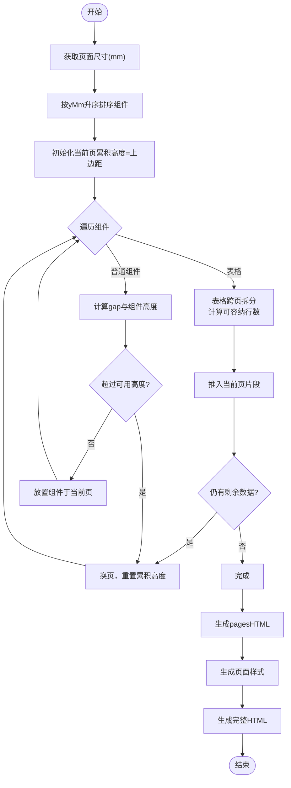
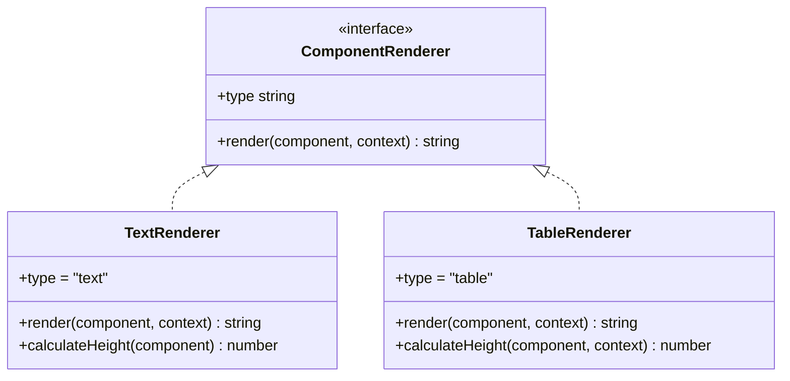
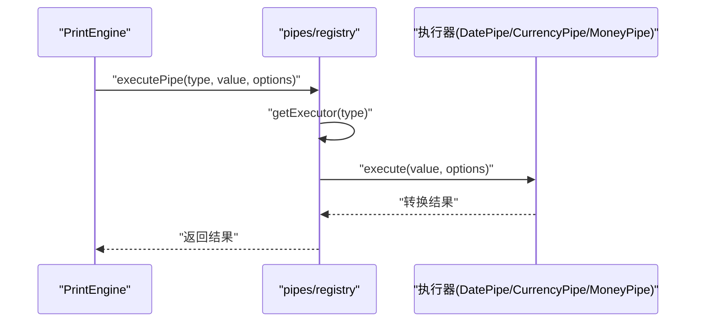
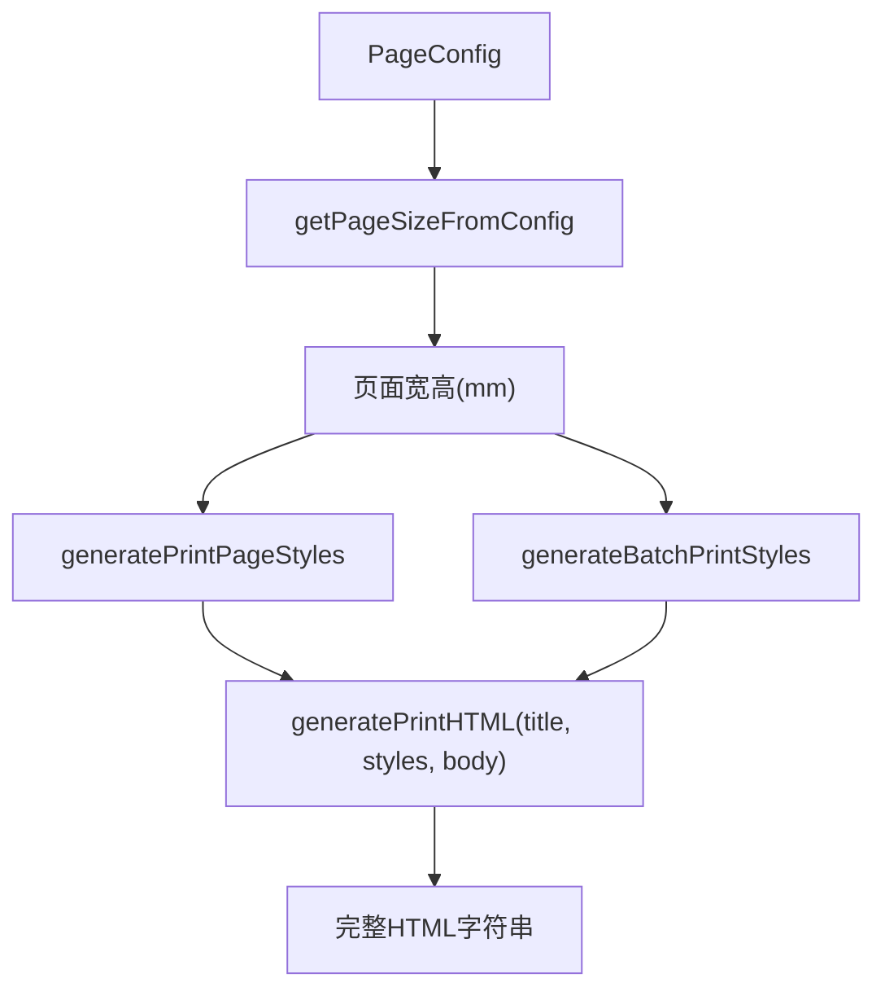
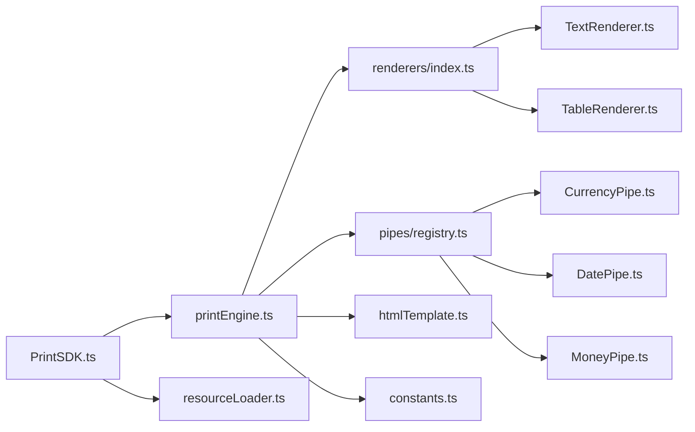

# 打印SDK系统

<cite>
**本文引用的文件**
- [sdk/src/index.ts](file://sdk/src/index.ts)
- [sdk/src/sdk.ts](file://sdk/src/sdk.ts)
- [sdk/src/PrintSDK.ts](file://sdk/src/PrintSDK.ts)
- [sdk/src/printEngine.ts](file://sdk/src/printEngine.ts)
- [sdk/src/types.ts](file://sdk/src/types.ts)
- [sdk/src/printEngine/htmlTemplate.ts](file://sdk/src/printEngine/htmlTemplate.ts)
- [sdk/src/printEngine/constants.ts](file://sdk/src/printEngine/constants.ts)
- [sdk/src/printEngine/renderers/index.ts](file://sdk/src/printEngine/renderers/index.ts)
- [sdk/src/printEngine/renderers/TextRenderer.ts](file://sdk/src/printEngine/renderers/TextRenderer.ts)
- [sdk/src/printEngine/renderers/TableRenderer.ts](file://sdk/src/printEngine/renderers/TableRenderer.ts)
- [sdk/src/utils/resourceLoader.ts](file://sdk/src/utils/resourceLoader.ts)
- [sdk/src/pipes/registry.ts](file://sdk/src/pipes/registry.ts)
- [sdk/src/pipes/executors/CurrencyPipe.ts](file://sdk/src/pipes/executors/CurrencyPipe.ts)
- [sdk/src/pipes/executors/DatePipe.ts](file://sdk/src/pipes/executors/DatePipe.ts)
- [sdk/src/pipes/executors/MoneyPipe.ts](file://sdk/src/pipes/executors/MoneyPipe.ts)
</cite>

## 目录
1. [简介](#简介)
2. [项目结构](#项目结构)
3. [核心组件](#核心组件)
4. [架构总览](#架构总览)
5. [详细组件分析](#详细组件分析)
6. [依赖关系分析](#依赖关系分析)
7. [性能考量](#性能考量)
8. [故障排查指南](#故障排查指南)
9. [结论](#结论)
10. [附录](#附录)

## 简介
本项目是一个独立的打印SDK，采用纯TypeScript实现，无UI依赖，专注于“数据驱动”的打印流程。其设计理念强调：
- 完全解耦：不依赖任何外部服务或全局状态
- 数据驱动：直接接收模板与数据，无需初始化与配置
- 无状态：SDK实例无需缓存或持久化状态
- 插件化：渲染器与管道均采用注册器模式，便于扩展

SDK对外提供统一入口，内部包含打印引擎、HTML模板生成、资源加载工具、管道系统与渲染器插件体系，覆盖从模板解析、数据绑定、管道转换、虚拟分页到最终HTML生成与打印的全流程。

## 项目结构
SDK位于sdk目录，核心模块划分如下：
- 入口与导出：index.ts与sdk.ts负责统一导出
- 打印SDK：PrintSDK封装打印、预览、批量打印、HTML生成等能力
- 打印引擎：PrintEngine负责插件化渲染、数据绑定、管道转换、虚拟分页与HTML生成
- 渲染器插件：TextRenderer、TableRenderer等组件渲染器
- 管道系统：registry集中注册与执行，内置多种执行器
- HTML模板：统一生成页面样式与完整HTML文档
- 常量与工具：MM_TO_PX、默认尺寸、样式默认值、资源加载工具等

**图表来源**
- [sdk/src/index.ts:1-22](file://sdk/src/index.ts#L1-L22)
- [sdk/src/sdk.ts:1-63](file://sdk/src/sdk.ts#L1-L63)
- [sdk/src/PrintSDK.ts:43-244](file://sdk/src/PrintSDK.ts#L43-L244)
- [sdk/src/printEngine.ts:31-756](file://sdk/src/printEngine.ts#L31-L756)
- [sdk/src/printEngine/htmlTemplate.ts:81-274](file://sdk/src/printEngine/htmlTemplate.ts#L81-L274)
- [sdk/src/printEngine/constants.ts:1-113](file://sdk/src/printEngine/constants.ts#L1-L113)
- [sdk/src/printEngine/renderers/index.ts:1-13](file://sdk/src/printEngine/renderers/index.ts#L1-L13)
- [sdk/src/printEngine/renderers/TextRenderer.ts:10-60](file://sdk/src/printEngine/renderers/TextRenderer.ts#L10-L60)
- [sdk/src/printEngine/renderers/TableRenderer.ts:11-275](file://sdk/src/printEngine/renderers/TableRenderer.ts#L11-L275)
- [sdk/src/pipes/registry.ts:1-64](file://sdk/src/pipes/registry.ts#L1-L64)
- [sdk/src/pipes/executors/CurrencyPipe.ts:7-17](file://sdk/src/pipes/executors/CurrencyPipe.ts#L7-L17)
- [sdk/src/pipes/executors/DatePipe.ts:7-35](file://sdk/src/pipes/executors/DatePipe.ts#L7-L35)
- [sdk/src/pipes/executors/MoneyPipe.ts:9-62](file://sdk/src/pipes/executors/MoneyPipe.ts#L9-L62)
- [sdk/src/utils/resourceLoader.ts:1-90](file://sdk/src/utils/resourceLoader.ts#L1-L90)

**章节来源**
- [sdk/src/index.ts:1-22](file://sdk/src/index.ts#L1-L22)
- [sdk/src/sdk.ts:1-63](file://sdk/src/sdk.ts#L1-L63)

## 核心组件
- PrintSDK：对外API封装，支持直接打印、预览打印、仅生成HTML、批量打印（同模板多数据），并提供进度回调
- PrintEngine：核心引擎，负责渲染器注册与调用、数据绑定、管道转换、虚拟分页计算、HTML生成
- 渲染器插件：TextRenderer、TableRenderer等，遵循统一接口，按组件类型渲染HTML
- 管道系统：registry集中注册执行器，支持currency、date、money、uppercase、lowercase、slice、default等
- HTML模板：统一生成页面样式与完整HTML文档，支持连续纸与标准分页
- 资源加载工具：等待图片加载完成，确保打印前资源就绪

**章节来源**
- [sdk/src/PrintSDK.ts:43-244](file://sdk/src/PrintSDK.ts#L43-L244)
- [sdk/src/printEngine.ts:31-756](file://sdk/src/printEngine.ts#L31-L756)
- [sdk/src/printEngine/renderers/index.ts:1-13](file://sdk/src/printEngine/renderers/index.ts#L1-L13)
- [sdk/src/pipes/registry.ts:1-64](file://sdk/src/pipes/registry.ts#L1-L64)
- [sdk/src/printEngine/htmlTemplate.ts:81-274](file://sdk/src/printEngine/htmlTemplate.ts#L81-L274)
- [sdk/src/utils/resourceLoader.ts:12-90](file://sdk/src/utils/resourceLoader.ts#L12-L90)

## 架构总览
SDK采用“数据驱动 + 插件化”架构：
- 数据输入：模板与数据
- 引擎处理：渲染器插件化、管道转换、虚拟分页
- 输出：HTML文档，支持预览与直接打印
- 资源保障：图片等异步资源加载完成后再触发打印

**图表来源**
- [sdk/src/PrintSDK.ts:53-243](file://sdk/src/PrintSDK.ts#L53-L243)
- [sdk/src/printEngine.ts:197-725](file://sdk/src/printEngine.ts#L197-L725)
- [sdk/src/pipes/registry.ts:45-52](file://sdk/src/pipes/registry.ts#L45-L52)
- [sdk/src/printEngine/htmlTemplate.ts:223-245](file://sdk/src/printEngine/htmlTemplate.ts#L223-L245)

## 详细组件分析

### PrintSDK：打印控制与API
- 支持直接打印与预览打印两种模式，预览模式打开新窗口，直接打印模式使用隐藏iframe
- 提供printDirect、printWithPreview、generateHTML等便捷方法
- 批量打印printMultiple：聚合多条数据为一个完整文档，减少用户确认次数，并提供进度回调
- 内部使用waitForImagesLoaded确保图片资源加载完成再打印

**图表来源**
- [sdk/src/PrintSDK.ts:43-244](file://sdk/src/PrintSDK.ts#L43-L244)
- [sdk/src/printEngine.ts:731-756](file://sdk/src/printEngine.ts#L731-L756)

**章节来源**
- [sdk/src/PrintSDK.ts:43-244](file://sdk/src/PrintSDK.ts#L43-L244)

### PrintEngine：核心打印引擎
- 插件化渲染器：默认注册Text、Table、Image、Rect、Line、QRCode、Barcode渲染器；支持动态注册/注销
- 数据绑定与管道：getValueByPath支持嵌套路径与智能前缀跳过；applyPipes按顺序执行管道
- 虚拟分页：基于组件yMm排序与相对间距累加，支持表格跨页拆分与表头重复策略
- HTML生成：根据页面配置生成页面样式与完整HTML文档，支持连续纸与标准分页

**图表来源**
- [sdk/src/printEngine.ts:396-541](file://sdk/src/printEngine.ts#L396-L541)
- [sdk/src/printEngine.ts:547-663](file://sdk/src/printEngine.ts#L547-L663)
- [sdk/src/printEngine/htmlTemplate.ts:81-170](file://sdk/src/printEngine/htmlTemplate.ts#L81-L170)

**章节来源**
- [sdk/src/printEngine.ts:31-756](file://sdk/src/printEngine.ts#L31-L756)

### 渲染器插件系统：注册器模式与扩展机制
- 统一接口：ComponentRenderer，包含type与render方法；部分渲染器提供calculateHeight
- 注册器：PrintEngine构造时注册默认渲染器；可通过registerRenderer动态扩展
- 典型渲染器：
  - TextRenderer：支持label前缀、flex布局对齐、自动换行
  - TableRenderer：支持列过滤、边框、合计行、跨页重复表头、合计计算（Decimal.js）

**图表来源**
- [sdk/src/printEngine/renderers/TextRenderer.ts:10-60](file://sdk/src/printEngine/renderers/TextRenderer.ts#L10-L60)
- [sdk/src/printEngine/renderers/TableRenderer.ts:11-275](file://sdk/src/printEngine/renderers/TableRenderer.ts#L11-L275)

**章节来源**
- [sdk/src/printEngine/renderers/index.ts:1-13](file://sdk/src/printEngine/renderers/index.ts#L1-L13)
- [sdk/src/printEngine/renderers/TextRenderer.ts:10-60](file://sdk/src/printEngine/renderers/TextRenderer.ts#L10-L60)
- [sdk/src/printEngine/renderers/TableRenderer.ts:11-275](file://sdk/src/printEngine/renderers/TableRenderer.ts#L11-L275)

### 管道系统：内置执行器与自定义开发
- 注册器：registry集中管理执行器，提供registerExecutor、getAllPipes、executePipe
- 内置执行器：DatePipe、CurrencyPipe、MoneyPipe、UppercasePipe、LowercasePipe、SlicePipe、DefaultPipe
- 自定义开发：实现PipeExecutor接口（type、label、execute），通过registerExecutor注册即可使用

**图表来源**
- [sdk/src/pipes/registry.ts:45-64](file://sdk/src/pipes/registry.ts#L45-L64)
- [sdk/src/pipes/executors/DatePipe.ts:7-35](file://sdk/src/pipes/executors/DatePipe.ts#L7-L35)
- [sdk/src/pipes/executors/CurrencyPipe.ts:7-17](file://sdk/src/pipes/executors/CurrencyPipe.ts#L7-L17)
- [sdk/src/pipes/executors/MoneyPipe.ts:9-62](file://sdk/src/pipes/executors/MoneyPipe.ts#L9-L62)

**章节来源**
- [sdk/src/pipes/registry.ts:1-64](file://sdk/src/pipes/registry.ts#L1-L64)

### HTML模板与页面配置管理
- generatePrintPageStyles：生成预览模式样式（含@media print）
- generateBatchPrintStyles：生成批量打印样式（screen与print分别处理）
- generatePrintHTML：拼装完整HTML文档
- getPageSizeFromConfig：根据PageConfig计算页面宽高与方向

**图表来源**
- [sdk/src/printEngine/htmlTemplate.ts:81-274](file://sdk/src/printEngine/htmlTemplate.ts#L81-L274)

**章节来源**
- [sdk/src/printEngine/htmlTemplate.ts:81-274](file://sdk/src/printEngine/htmlTemplate.ts#L81-L274)

### 资源加载与打印时机
- waitForImagesLoaded：等待文档中所有加载完成，支持超时与错误统计
- PrintSDK在预览与直接打印前调用该工具，确保图片资源就绪后再触发print()

**章节来源**
- [sdk/src/utils/resourceLoader.ts:12-90](file://sdk/src/utils/resourceLoader.ts#L12-L90)
- [sdk/src/PrintSDK.ts:68-95](file://sdk/src/PrintSDK.ts#L68-L95)
- [sdk/src/PrintSDK.ts:216-242](file://sdk/src/PrintSDK.ts#L216-L242)

## 依赖关系分析
- PrintSDK依赖PrintEngine与资源加载工具
- PrintEngine依赖渲染器插件、管道注册器、HTML模板与常量
- 渲染器插件依赖样式构建工具与常量
- 管道注册器依赖各执行器实现
- HTML模板与常量相互独立，被引擎与SDK复用

**图表来源**
- [sdk/src/PrintSDK.ts:7-14](file://sdk/src/PrintSDK.ts#L7-L14)
- [sdk/src/printEngine.ts:16-29](file://sdk/src/printEngine.ts#L16-L29)
- [sdk/src/printEngine/renderers/index.ts:1-13](file://sdk/src/printEngine/renderers/index.ts#L1-L13)
- [sdk/src/pipes/registry.ts:6-7](file://sdk/src/pipes/registry.ts#L6-L7)

**章节来源**
- [sdk/src/PrintSDK.ts:7-14](file://sdk/src/PrintSDK.ts#L7-L14)
- [sdk/src/printEngine.ts:16-29](file://sdk/src/printEngine.ts#L16-L29)

## 性能考量
- 虚拟分页与相对间距：按yMm排序与gap累加，避免复杂布局计算，提升分页效率
- 表格跨页拆分：按可用高度与行高计算可容纳行数，减少无效渲染
- 合计计算：使用Decimal.js保证数值精度，避免浮点误差
- 资源加载：图片异步加载并超时保护，避免阻塞打印流程
- 连续纸：不分页渲染，减少页面切分开销

[本节为通用性能建议，不直接分析具体文件]

## 故障排查指南
- 打印窗口无法打开：检查浏览器弹窗策略，确保允许弹窗
- 图片未显示：确认图片URL有效，使用waitForImagesLoaded等待加载完成
- 表格高度异常：检查表格数据与列配置，避免组件高度接近页面可用高度
- 管道执行失败：确认管道类型正确，options参数合法，必要时在控制台查看警告

**章节来源**
- [sdk/src/PrintSDK.ts:60-62](file://sdk/src/PrintSDK.ts#L60-L62)
- [sdk/src/utils/resourceLoader.ts:28-42](file://sdk/src/utils/resourceLoader.ts#L28-L42)
- [sdk/src/printEngine.ts:446-451](file://sdk/src/printEngine.ts#L446-L451)
- [sdk/src/pipes/registry.ts:47-50](file://sdk/src/pipes/registry.ts#L47-L50)

## 结论
本打印SDK以“数据驱动 + 插件化”为核心，实现了从模板解析、数据绑定、管道转换、虚拟分页到HTML生成与打印的完整链路。其纯TypeScript实现、无UI依赖、完全解耦的设计，使其易于集成与扩展。通过渲染器插件与管道注册器，开发者可灵活扩展组件类型与数据转换逻辑；通过批量打印与资源加载工具，提升了用户体验与稳定性。

[本节为总结性内容，不直接分析具体文件]

## 附录

### 使用示例（步骤说明）
- 直接打印：创建SDK实例，调用printDirect传入模板与数据
- 预览打印：调用printWithPreview，打开新窗口预览后再打印
- 仅生成HTML：调用generateHTML，获取完整HTML字符串
- 批量打印：调用printMultiple，传入模板、数据数组与进度回调

**章节来源**
- [sdk/src/PrintSDK.ts:104-126](file://sdk/src/PrintSDK.ts#L104-L126)
- [sdk/src/PrintSDK.ts:135-243](file://sdk/src/PrintSDK.ts#L135-L243)

### API参考（核心类型）
- PrintSDK：print、printDirect、printWithPreview、generateHTML、printMultiple
- PrintEngine：generatePrintHTML、registerRenderer、unregisterRenderer
- 渲染器：TextRenderer、TableRenderer等
- 管道：DatePipe、CurrencyPipe、MoneyPipe等
- HTML模板：generatePrintPageStyles、generateBatchPrintStyles、generatePrintHTML
- 常量：MM_TO_PX、COMPONENT_DEFAULT_SIZE、TABLE_DEFAULT、STYLE_DEFAULT等

**章节来源**
- [sdk/src/sdk.ts:6-63](file://sdk/src/sdk.ts#L6-L63)
- [sdk/src/types.ts:151-171](file://sdk/src/types.ts#L151-L171)